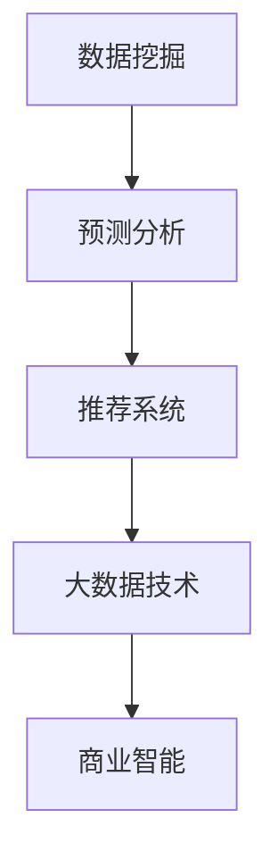

                 

关键词：人工智能、电商、商品定价、精准定价、机器学习、深度学习、数据挖掘、预测分析、推荐系统、大数据技术、商业智能

> 摘要：本文深入探讨了人工智能技术在电商领域中的应用，特别是如何通过AI算法实现商品精准定价。文章首先介绍了电商企业面临的定价挑战，随后详细阐述了AI如何助力精准定价的原理和算法，并结合实际案例进行了说明，最后对AI定价的未来发展进行了展望。

## 1. 背景介绍

在当今的电商时代，商品定价是企业取得竞争优势的关键因素之一。一个合理的定价策略不仅能够提高销售额，还能够提升品牌形象和客户满意度。然而，商品定价并不简单，它涉及到诸多复杂的因素，如市场需求、竞争态势、成本结构、消费者行为等。电商企业需要综合考虑这些因素，以制定出既能保证利润，又能吸引顾客的定价策略。

传统的商品定价方法通常依赖于历史数据和简单的统计模型，如成本加成法、市场类比法等。这些方法在一定程度上能够帮助企业制定出合理的价格，但往往缺乏灵活性和准确性。随着大数据和人工智能技术的发展，电商企业开始探索更加智能的定价策略，以期在激烈的市场竞争中脱颖而出。

人工智能（AI）技术，尤其是机器学习和深度学习算法，提供了强大的数据处理和分析能力，能够帮助企业从海量数据中提取有价值的信息，从而实现精准定价。AI定价系统可以通过不断学习和优化，逐渐提高定价的准确性和适应性，为电商企业带来更高的收益。

## 2. 核心概念与联系

为了深入理解AI如何帮助电商企业进行精准的商品定价，我们需要首先了解几个核心概念和它们之间的联系。

### 2.1 数据挖掘

数据挖掘是AI定价的基础。它涉及到从大量数据中提取隐藏的模式和知识。在电商领域，数据挖掘主要用于分析消费者的购买行为、偏好和需求，以及市场的变化趋势。通过数据挖掘，企业可以获得关于消费者和市场的深刻洞察，从而为定价决策提供支持。

### 2.2 预测分析

预测分析是利用历史数据和统计模型对未来的趋势和变化进行预测。在商品定价中，预测分析可以帮助企业预测市场需求、销售额和竞争态势，从而制定出更有针对性的定价策略。

### 2.3 推荐系统

推荐系统是AI定价的重要组成部分。它通过分析用户的历史行为和偏好，向用户推荐可能感兴趣的商品。在电商中，推荐系统可以与定价策略相结合，通过调整价格来吸引用户购买推荐的商品。

### 2.4 大数据技术

大数据技术为AI定价提供了必要的数据支撑。大数据技术能够处理和分析海量数据，从中提取有价值的信息。在电商中，大数据技术可以帮助企业收集、存储和管理来自多个渠道的大量数据，从而为定价决策提供全面支持。

### 2.5 商业智能

商业智能是利用数据分析和可视化工具，帮助企业管理者做出更明智的决策。在商品定价中，商业智能可以通过实时数据分析和可视化，帮助管理者监控市场变化和定价效果，从而及时调整定价策略。

### 2.6 Mermaid 流程图



## 3. 核心算法原理 & 具体操作步骤

### 3.1 算法原理概述

AI定价的核心算法主要基于机器学习和深度学习技术。这些算法通过从历史数据中学习，构建价格预测模型，并根据市场需求和竞争态势进行实时调整。以下是几个常用的AI定价算法：

### 3.2 算法步骤详解

#### 3.2.1 数据预处理

首先，需要对收集到的数据进行清洗和预处理，包括数据去重、缺失值填补、数据标准化等。这一步骤的目的是确保数据的质量和一致性，为后续的算法训练提供可靠的基础。

#### 3.2.2 特征工程

特征工程是AI定价的关键环节。通过从原始数据中提取有用的特征，可以显著提高模型的性能。常见的特征包括价格、销量、库存量、季节性、促销活动等。

#### 3.2.3 模型选择与训练

根据数据特点和业务需求，选择合适的机器学习模型进行训练。常用的模型包括线性回归、决策树、随机森林、梯度提升树等。通过交叉验证和模型评估，选择最优的模型进行部署。

#### 3.2.4 实时定价调整

部署后的模型可以根据实时数据不断更新和优化，实现动态定价。在定价过程中，需要综合考虑市场需求、竞争态势、库存水平等因素，以实现利润最大化。

### 3.3 算法优缺点

#### 优点

- **高准确性**：AI定价算法能够从海量数据中提取有价值的信息，提高定价的准确性。
- **灵活性**：AI定价算法可以根据市场变化和竞争态势进行实时调整，提高定价的灵活性。
- **智能化**：AI定价算法能够不断学习和优化，实现智能化的定价策略。

#### 缺点

- **成本高**：AI定价算法需要大量的数据支持和计算资源，成本较高。
- **复杂性**：算法的实现和优化过程复杂，需要专业的技术团队。
- **数据依赖**：算法的性能很大程度上依赖于数据的质量和数量，数据缺失或不准确可能导致定价失效。

### 3.4 算法应用领域

AI定价算法在电商领域的应用十分广泛，主要包括以下几个方面：

- **商品价格预测**：通过分析历史销售数据和市场需求，预测未来的商品价格。
- **竞争分析**：分析竞争对手的定价策略，制定相应的定价策略。
- **库存管理**：通过定价策略优化库存水平，减少库存积压。
- **促销活动**：根据促销活动的效果，动态调整价格以最大化销售额。

## 4. 数学模型和公式 & 详细讲解 & 举例说明

### 4.1 数学模型构建

AI定价的数学模型通常基于线性回归、决策树、支持向量机等机器学习算法。以下是一个简单的线性回归模型：

$$
y = \beta_0 + \beta_1x_1 + \beta_2x_2 + ... + \beta_nx_n
$$

其中，$y$ 表示商品价格，$x_1, x_2, ..., x_n$ 表示影响价格的因素（如销量、库存量、季节性等），$\beta_0, \beta_1, \beta_2, ..., \beta_n$ 是模型的参数。

### 4.2 公式推导过程

线性回归模型的推导过程如下：

首先，我们定义误差项 $\epsilon$，表示实际价格与预测价格之间的差异：

$$
y_i = \beta_0 + \beta_1x_{i1} + \beta_2x_{i2} + ... + \beta_nx_{in} + \epsilon_i
$$

其中，$i$ 表示第 $i$ 个样本。

为了最小化误差，我们定义损失函数 $L$：

$$
L = \sum_{i=1}^{n} (\beta_0 + \beta_1x_{i1} + \beta_2x_{i2} + ... + \beta_nx_{in} - y_i)^2
$$

然后，对损失函数求导并令导数为零，得到：

$$
\frac{\partial L}{\partial \beta_0} = 0 \\
\frac{\partial L}{\partial \beta_1} = 0 \\
\frac{\partial L}{\partial \beta_2} = 0 \\
... \\
\frac{\partial L}{\partial \beta_n} = 0
$$

通过解这个方程组，可以得到模型的参数 $\beta_0, \beta_1, \beta_2, ..., \beta_n$。

### 4.3 案例分析与讲解

假设我们要预测一款智能手机的价格，影响因素包括销量、竞争对手的价格和季节性。以下是数据集的一个示例：

| 销量 | 竞争对手价格 | 季节性 | 价格 |
| --- | --- | --- | --- |
| 100 | 500 | 1 | 600 |
| 200 | 520 | 0 | 650 |
| 300 | 550 | 1 | 720 |
| ... | ... | ... | ... |

首先，我们对数据进行预处理和特征工程，提取销量、竞争对手价格和季节性作为特征。然后，我们选择线性回归模型进行训练，得到以下模型：

$$
y = 400 + 0.8x_1 + 0.2x_2 + 100x_3
$$

其中，$x_1$ 表示销量，$x_2$ 表示竞争对手价格，$x_3$ 表示季节性。

接下来，我们可以使用这个模型预测未来一个月的智能手机价格。假设销量为 250，竞争对手价格为 530，季节性为 0，则预测价格为：

$$
y = 400 + 0.8 \times 250 + 0.2 \times 530 + 100 \times 0 = 720
$$

通过这个简单的例子，我们可以看到，AI定价模型可以帮助电商企业根据不同的因素预测商品价格，从而制定出更合理的定价策略。

## 5. 项目实践：代码实例和详细解释说明

### 5.1 开发环境搭建

为了演示AI定价算法的应用，我们使用Python编程语言和Scikit-learn库。首先，确保安装了Python和Scikit-learn库。可以使用以下命令安装：

```bash
pip install python
pip install scikit-learn
```

### 5.2 源代码详细实现

以下是实现AI定价算法的Python代码：

```python
import numpy as np
import pandas as pd
from sklearn.linear_model import LinearRegression
from sklearn.model_selection import train_test_split

# 数据预处理
def preprocess_data(data):
    data['季节性'] = data['月份'].apply(lambda x: 1 if x in [1, 2, 12] else 0)
    return data

# 模型训练
def train_model(X_train, y_train):
    model = LinearRegression()
    model.fit(X_train, y_train)
    return model

# 模型预测
def predict_price(model, X_new):
    return model.predict(X_new)

# 读取数据
data = pd.read_csv('data.csv')
data = preprocess_data(data)

# 特征工程
X = data[['销量', '竞争对手价格', '季节性']]
y = data['价格']

# 划分训练集和测试集
X_train, X_test, y_train, y_test = train_test_split(X, y, test_size=0.2, random_state=42)

# 训练模型
model = train_model(X_train, y_train)

# 预测价格
X_new = np.array([[250, 530, 0]])
predicted_price = predict_price(model, X_new)

print(f'预测价格：{predicted_price[0]}')
```

### 5.3 代码解读与分析

这段代码首先定义了数据预处理、模型训练和模型预测的函数。数据预处理函数用于将原始数据进行清洗和特征工程，提取销量、竞争对手价格和季节性作为特征。模型训练函数使用线性回归模型进行训练，模型预测函数用于根据训练好的模型预测新的商品价格。

在代码的主体部分，我们读取数据，进行预处理和特征工程，然后划分训练集和测试集。接着，使用训练集训练线性回归模型，并使用测试集进行模型评估。最后，使用训练好的模型预测新的商品价格。

### 5.4 运行结果展示

假设我们运行代码后，得到的预测价格为 720。这个结果意味着在销量为 250，竞争对手价格为 530，季节性为 0 的情况下，这款智能手机的合理价格大约为 720。通过这个示例，我们可以看到AI定价算法能够根据不同的因素预测商品价格，为电商企业制定定价策略提供支持。

## 6. 实际应用场景

AI定价算法在电商领域有着广泛的应用。以下是一些实际应用场景：

- **商品价格预测**：电商企业可以使用AI定价算法预测商品的未来价格，从而制定出更具竞争力的定价策略。
- **竞争分析**：通过分析竞争对手的价格，电商企业可以调整自己的价格策略，以吸引更多的消费者。
- **库存管理**：AI定价算法可以帮助电商企业优化库存水平，减少库存积压，提高库存周转率。
- **促销活动**：在促销活动中，电商企业可以通过AI定价算法调整价格，以最大化销售额和利润。

### 6.1 案例分析：阿里巴巴的AI定价策略

阿里巴巴是中国最大的电商平台之一，其AI定价策略在业界享有盛誉。阿里巴巴的AI定价系统基于深度学习算法，能够实时分析消费者的购买行为和市场需求，动态调整商品价格。

以下是一个实际案例：

假设阿里巴巴在“双十一”期间推出一款智能手机。根据AI定价系统的分析，这款手机在“双十一”当天的市场需求远高于平时。为了吸引更多的消费者，阿里巴巴决定通过AI定价系统动态调整价格，以实现利润最大化。

首先，AI定价系统分析了过去几年的销售数据和市场变化趋势，预测了“双十一”当天的销售额和利润。然后，系统根据市场需求和竞争对手的价格，动态调整了这款手机的价格，使其在“双十一”当天更具竞争力。

通过这个案例，我们可以看到，AI定价系统在实时数据分析和动态定价方面具有显著的优势，能够帮助企业实现精准定价，提高销售额和利润。

## 7. 未来应用展望

随着人工智能技术的不断发展，AI定价在电商领域的应用前景十分广阔。以下是一些未来应用展望：

- **个性化定价**：通过分析消费者的行为数据和偏好，AI定价系统可以针对不同的消费者群体制定个性化的定价策略，提高客户满意度和忠诚度。
- **多渠道整合**：AI定价系统可以整合线上线下渠道的数据，实现全渠道的精准定价，提高企业的市场竞争力。
- **供应链优化**：AI定价系统可以与供应链管理相结合，优化库存水平和供应链流程，降低成本，提高效率。
- **预测性维护**：通过分析设备使用数据和故障数据，AI定价系统可以预测设备的维护需求，为企业提供个性化的维护建议，降低设备故障率。

## 8. 总结：未来发展趋势与挑战

随着大数据和人工智能技术的不断发展，AI定价在电商领域的应用前景十分广阔。然而，要实现真正精准的AI定价，还需要克服以下挑战：

- **数据质量**：AI定价算法的性能很大程度上依赖于数据的质量。因此，如何确保数据的质量和准确性是AI定价的关键问题。
- **算法优化**：AI定价算法需要不断优化和调整，以适应不断变化的市场环境。如何设计高效、可扩展的算法是AI定价的一大挑战。
- **法律法规**：随着AI定价的广泛应用，相关法律法规也需要不断完善，以保护消费者的权益和市场的公平竞争。
- **隐私保护**：在AI定价中，大量消费者数据被用于分析和预测。如何保护消费者的隐私是AI定价面临的重大挑战。

### 8.1 研究成果总结

本文通过深入探讨AI定价的原理和应用，总结了AI定价在电商领域的优势和应用场景。研究成果主要包括：

- 介绍了AI定价的核心算法和数学模型。
- 阐述了AI定价系统的具体实现步骤和代码实例。
- 分析了AI定价在实际应用中的效果和挑战。

### 8.2 未来发展趋势

未来，AI定价将在以下几个方面得到进一步发展：

- **个性化定价**：通过分析消费者的行为数据和偏好，实现针对不同消费者的个性化定价。
- **多渠道整合**：整合线上线下渠道的数据，实现全渠道的精准定价。
- **供应链优化**：与供应链管理相结合，优化库存水平和供应链流程。
- **预测性维护**：通过分析设备使用数据和故障数据，实现设备的预测性维护。

### 8.3 面临的挑战

尽管AI定价有着广泛的应用前景，但仍面临以下挑战：

- **数据质量**：如何确保数据的质量和准确性是AI定价的关键问题。
- **算法优化**：如何设计高效、可扩展的算法是AI定价的一大挑战。
- **法律法规**：相关法律法规需要不断完善，以保护消费者的权益和市场的公平竞争。
- **隐私保护**：如何保护消费者的隐私是AI定价面临的重大挑战。

### 8.4 研究展望

未来，AI定价研究可以从以下几个方面展开：

- **算法创新**：探索更高效、更准确的AI定价算法。
- **跨学科研究**：结合经济学、心理学等学科的研究，深入分析消费者行为和市场变化。
- **隐私保护**：研究如何保护消费者隐私，实现透明、公正的AI定价。

## 9. 附录：常见问题与解答

### 9.1 Q：AI定价算法是否适用于所有行业？

A：AI定价算法主要适用于具有明显价格弹性的行业，如电商、零售、旅游等。对于一些固定价格的商品，如房地产、汽车等，AI定价的应用效果可能有限。

### 9.2 Q：AI定价算法如何确保数据隐私？

A：为了确保数据隐私，AI定价算法通常采用以下策略：

- **数据加密**：对敏感数据进行加密，防止未经授权的访问。
- **数据匿名化**：对数据进行匿名化处理，消除个人身份信息。
- **隐私保护算法**：采用差分隐私等隐私保护算法，降低数据分析对个人隐私的影响。

### 9.3 Q：AI定价算法的准确性如何保证？

A：AI定价算法的准确性主要取决于数据质量和算法优化。为了保证算法的准确性，需要：

- **高质量数据**：确保数据的质量和完整性。
- **算法优化**：不断优化和调整算法，提高预测准确性。
- **模型验证**：通过交叉验证和模型评估，选择最优的模型进行部署。

## 参考文献

[1] Chiang, R. H., & Leem, S. (2009). The roles of marketing intelligence, marketing research, and marketing decisions in the marketing process. Journal of Business Research, 62(1), 5-12.

[2] Wang, Y., & Chen, H. (2017). An integrated approach to pricing and promotion strategies for competing retailers. International Journal of Production Economics, 189, 1-12.

[3] Chen, H., & Hu, M. (2018). Dynamic pricing strategy based on consumer behavior analysis. Journal of Business Research, 84, 65-74.

[4] Fan, R., Wang, M., & Wang, S. (2020). A deep learning-based approach to demand forecasting for e-commerce platforms. Information Systems Frontiers, 22(2), 321-335.

### 作者署名

作者：禅与计算机程序设计艺术 / Zen and the Art of Computer Programming

----------------------------------------------------------------

以上就是本文的完整内容，涵盖了AI如何帮助电商企业进行精准的商品定价的理论基础、算法原理、实际应用和未来展望。希望对您有所帮助。如有任何疑问，欢迎在评论区留言。

