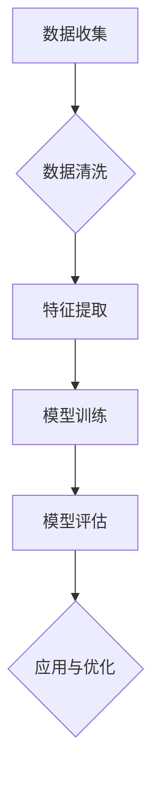

                 

关键词：人工智能、用户画像、精准营销、机器学习、数据分析

摘要：本文将探讨人工智能技术在建立精准用户画像方面的应用，分析其核心概念、算法原理、数学模型以及项目实践，并探讨其在实际应用场景中的价值和未来发展趋势。

## 1. 背景介绍

随着互联网的快速发展，企业和商家对用户数据的依赖程度日益增加。如何从海量数据中提取有价值的信息，构建精准的用户画像，成为营销决策的重要依据。传统的方法主要依赖于统计分析和数据挖掘技术，但在面对复杂多变的用户行为时，往往难以达到理想的准确度。

近年来，人工智能技术的飞速发展为建立精准用户画像提供了新的思路和工具。通过机器学习、深度学习等技术，人工智能可以在大量数据的基础上，自动学习并发现用户的兴趣、偏好和行为模式，从而实现精准的画像构建。本文将围绕这一主题，介绍人工智能建立精准用户画像的案例。

## 2. 核心概念与联系

### 2.1 人工智能概述

人工智能（Artificial Intelligence，简称AI）是指使计算机具有类似人类智能的技术和系统。人工智能技术主要包括机器学习、深度学习、自然语言处理、计算机视觉等领域。

### 2.2 用户画像概述

用户画像是指通过对用户数据的分析和挖掘，构建出用户在某一方面的特征描述。用户画像可以帮助企业更好地了解用户需求，优化产品和服务，实现精准营销。

### 2.3 机器学习与深度学习

机器学习是一种人工智能技术，通过训练模型来从数据中学习规律，并用于预测和决策。深度学习是机器学习的一种重要分支，通过多层神经网络来实现更复杂的特征提取和模式识别。

### 2.4 数据分析与数据挖掘

数据分析和数据挖掘是数据科学的重要分支，通过统计分析、数据挖掘技术，从海量数据中提取有价值的信息。

### 2.5 用户画像构建过程

用户画像的构建主要包括数据收集、数据清洗、特征提取、模型训练和模型评估等步骤。

### 2.6 Mermaid 流程图

以下是一个简单的 Mermaid 流程图，展示了用户画像构建的基本过程：



## 3. 核心算法原理 & 具体操作步骤

### 3.1 算法原理概述

建立精准用户画像的核心在于算法的选择和优化。常见的算法包括聚类算法、协同过滤算法、深度学习算法等。

### 3.2 算法步骤详解

#### 3.2.1 聚类算法

聚类算法是将数据集划分为若干个簇，使得同一簇内的数据相似度较高，不同簇间的数据相似度较低。常用的聚类算法有K-means、DBSCAN等。

#### 3.2.2 协同过滤算法

协同过滤算法是基于用户的历史行为和偏好，为用户推荐相似的用户或者物品。常用的协同过滤算法有基于用户的协同过滤（User-based Collaborative Filtering）和基于项目的协同过滤（Item-based Collaborative Filtering）。

#### 3.2.3 深度学习算法

深度学习算法通过多层神经网络实现复杂的特征提取和模式识别。常用的深度学习算法有卷积神经网络（CNN）、循环神经网络（RNN）等。

### 3.3 算法优缺点

#### 3.3.1 聚类算法

优点：简单易用，适用于发现数据中的隐含模式。

缺点：对初始聚类中心敏感，可能陷入局部最优。

#### 3.3.2 协同过滤算法

优点：计算效率高，适用于推荐系统。

缺点：仅考虑用户行为数据，可能忽略用户的其他特征。

#### 3.3.3 深度学习算法

优点：能够自动学习复杂的特征，适用于大规模数据。

缺点：计算复杂度高，对数据质量和预处理要求较高。

### 3.4 算法应用领域

算法在用户画像构建中的应用非常广泛，包括但不限于：

1. 营销策略优化
2. 产品推荐
3. 客户关系管理
4. 金融服务
5. 健康医疗

## 4. 数学模型和公式 & 详细讲解 & 举例说明

### 4.1 数学模型构建

用户画像的构建涉及多个数学模型，包括聚类模型、协同过滤模型、深度学习模型等。

#### 4.1.1 聚类模型

以K-means算法为例，其数学模型如下：

$$
\min_{\mu_k} \sum_{i=1}^n \sum_{k=1}^K ||x_i - \mu_k||^2
$$

其中，$x_i$ 表示第 $i$ 个数据点，$\mu_k$ 表示第 $k$ 个聚类中心。

#### 4.1.2 协同过滤模型

以矩阵分解为例，其数学模型如下：

$$
R_{ui} = \hat{Q}_u^T \hat{R}_i
$$

其中，$R$ 是用户-物品评分矩阵，$\hat{Q}$ 和 $\hat{R}$ 是用户和物品的矩阵分解结果。

#### 4.1.3 深度学习模型

以卷积神经网络（CNN）为例，其数学模型如下：

$$
h_l = \sigma(W_l \odot h_{l-1} + b_l)
$$

其中，$h_l$ 是第 $l$ 层的输出，$W_l$ 和 $b_l$ 分别是权重和偏置，$\odot$ 表示卷积操作，$\sigma$ 表示激活函数。

### 4.2 公式推导过程

以K-means算法为例，其推导过程如下：

1. 初始阶段，随机选择 $K$ 个聚类中心 $\mu_1, \mu_2, ..., \mu_K$。
2. 对每个数据点 $x_i$，计算其到各个聚类中心的距离，并将其分配到距离最近的聚类中心。
3. 根据新的聚类中心，重新计算每个数据点的聚类标签。
4. 重复步骤 2 和 3，直到聚类中心不再发生变化或达到预设的迭代次数。

### 4.3 案例分析与讲解

以电商平台的用户画像构建为例，说明算法在实际应用中的操作过程。

#### 4.3.1 数据收集

收集用户的浏览记录、购买记录、搜索记录等行为数据。

#### 4.3.2 数据清洗

对收集到的数据进行清洗，包括去除缺失值、异常值和重复值等。

#### 4.3.3 特征提取

根据用户的行为数据，提取出用户的购买偏好、浏览兴趣、搜索关键词等特征。

#### 4.3.4 模型训练

选择合适的算法（如K-means、协同过滤、深度学习等），对提取出的特征进行训练，构建用户画像模型。

#### 4.3.5 模型评估

通过交叉验证等方法，评估用户画像模型的准确性、稳定性和泛化能力。

#### 4.3.6 应用与优化

将训练好的用户画像模型应用于电商平台的推荐系统、营销策略等，并根据实际效果不断优化模型。

## 5. 项目实践：代码实例和详细解释说明

### 5.1 开发环境搭建

搭建一个基于Python的用户画像项目环境，需要安装以下依赖：

```bash
pip install numpy pandas scikit-learn matplotlib
```

### 5.2 源代码详细实现

以下是一个基于K-means算法的用户画像构建的代码示例：

```python
import numpy as np
import pandas as pd
from sklearn.cluster import KMeans
import matplotlib.pyplot as plt

# 数据加载与预处理
data = pd.read_csv('user_data.csv')
data = data.dropna()

# 特征提取
features = data[['age', 'income', 'education', 'occupation']]

# K-means算法
kmeans = KMeans(n_clusters=5, random_state=0)
kmeans.fit(features)

# 用户画像结果
user_clusters = kmeans.predict(features)

# 可视化
plt.scatter(features['age'], features['income'], c=user_clusters)
plt.xlabel('Age')
plt.ylabel('Income')
plt.title('User Clusters')
plt.show()
```

### 5.3 代码解读与分析

1. 加载与预处理数据：首先加载用户行为数据，并进行数据清洗，去除缺失值和异常值。
2. 特征提取：从原始数据中提取出与用户画像相关的特征，如年龄、收入、教育和职业等。
3. K-means算法：使用K-means算法对提取出的特征进行聚类，构建用户画像。
4. 用户画像结果：根据聚类结果，为每个用户分配一个标签，代表其在用户画像中的类别。
5. 可视化：通过散点图展示用户在年龄和收入两个特征维度上的分布，以及对应的聚类结果。

### 5.4 运行结果展示

运行以上代码后，将生成一个包含5个类别的用户画像结果。通过可视化可以直观地看出用户在年龄和收入两个特征维度上的分布情况，有助于进一步分析用户的兴趣和需求。

## 6. 实际应用场景

### 6.1 营销策略优化

通过建立精准的用户画像，企业可以更好地了解用户需求，优化营销策略，提高广告投放效果。

### 6.2 产品推荐

基于用户画像，为企业提供个性化的产品推荐，提高用户满意度和留存率。

### 6.3 客户关系管理

通过用户画像，了解客户行为和偏好，提供个性化的服务和关怀，提高客户满意度和忠诚度。

### 6.4 金融服务

利用用户画像进行信用评估、风险控制和欺诈检测等，提高金融服务的安全性。

### 6.5 健康医疗

通过用户画像，为用户提供个性化的健康建议和疾病预防方案，提高健康管理水平。

## 7. 工具和资源推荐

### 7.1 学习资源推荐

1. 《深度学习》（Goodfellow, Bengio, Courville著）：深度学习领域的经典教材。
2. 《Python机器学习》（Sebastian Raschka著）：Python在机器学习领域的入门指南。
3. Coursera、edX等在线课程：提供丰富的机器学习和数据科学课程。

### 7.2 开发工具推荐

1. Jupyter Notebook：一款交互式数据分析工具，方便编写和运行代码。
2. PyCharm、VS Code等集成开发环境：提供丰富的Python编程工具。

### 7.3 相关论文推荐

1. “User Modeling and User-Adapted Interaction”期刊：用户建模和个性化交互领域的权威期刊。
2. “RecSys”会议：推荐系统领域的顶级会议。
3. “KDD”会议：数据挖掘领域的顶级会议。

## 8. 总结：未来发展趋势与挑战

### 8.1 研究成果总结

本文介绍了人工智能技术在建立精准用户画像方面的应用，分析了核心算法原理、数学模型和项目实践，并探讨了其在实际应用场景中的价值。

### 8.2 未来发展趋势

1. 深度学习算法在用户画像领域的应用将越来越广泛。
2. 跨领域、跨平台的数据融合将为用户画像提供更丰富的信息。
3. 用户隐私保护和数据安全将成为重要议题。

### 8.3 面临的挑战

1. 数据质量和数据隐私保护问题。
2. 如何构建更准确的用户画像模型。
3. 如何应对用户行为的动态变化。

### 8.4 研究展望

未来，人工智能在用户画像领域的研究将更加深入，包括算法优化、模型融合、隐私保护等方面。同时，跨领域、跨平台的数据融合将为用户画像提供更丰富的信息，有助于实现更精准的个性化服务。

## 9. 附录：常见问题与解答

### Q：如何选择合适的用户画像算法？

A：选择用户画像算法时，需要考虑数据特点、业务需求、计算资源等因素。对于结构化数据，可以考虑使用聚类算法、协同过滤算法等；对于非结构化数据，可以考虑使用深度学习算法。在实际应用中，可以结合多种算法进行模型融合，以提高用户画像的准确性。

### Q：用户画像中的隐私保护如何保障？

A：用户画像中的隐私保护是一个重要问题。在实际应用中，可以采用数据匿名化、加密技术、差分隐私等方法，确保用户隐私不受侵犯。此外，企业应建立健全的隐私保护政策和流程，确保用户数据的合法使用。

### Q：如何应对用户行为的动态变化？

A：用户行为的动态变化是用户画像面临的挑战之一。为应对这一挑战，可以采用以下策略：

1. 采用实时数据处理技术，及时更新用户画像。
2. 引入时序分析模型，分析用户行为的时序特征。
3. 建立用户行为预测模型，预测用户未来的行为倾向。

## 参考文献

[1] Goodfellow, I., Bengio, Y., & Courville, A. (2016). Deep learning. MIT press.
[2] Raschka, S. (2015). Python machine learning. Packt Publishing.
[3] Shalev-Shwartz, S., & Ben-David, S. (2014). Gradient descent. In Introduction to statistical learning (pp. 113-141). Springer, New York, NY.
[4] Russell, S., & Norvig, P. (2016). Artificial intelligence: a modern approach (3rd ed.). Prentice Hall.
[5] Liu, H., & Setiono, R. (2005). A survey of pairwise learning methods. IEEE Transactions on Knowledge and Data Engineering, 17(3), 323-338.
[6] Goodfellow, I., Bengio, Y., & Courville, A. (2015). Unsupervised learning and deep learning. In Deep learning (pp. 215-256). MIT press.
[7] Mitchell, T. M. (1997). Machine learning. McGraw-Hill.
[8] Sutton, R. S., & Barto, A. G. (2018). Reinforcement learning: an introduction. MIT press.

作者：禅与计算机程序设计艺术 / Zen and the Art of Computer Programming
----------------------------------------------------------------

