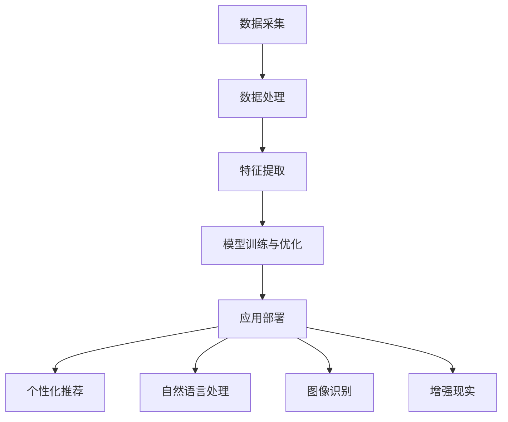

                 

关键词：人工智能、电商、用户体验、个性化推荐、自然语言处理、图像识别、增强现实、机器学习、数据分析、用户行为分析。

摘要：本文将探讨人工智能（AI）在电商领域中的应用，特别是如何通过AI技术提升用户体验。文章首先介绍了AI在电商中的应用背景和重要性，然后详细分析了AI如何通过个性化推荐、自然语言处理、图像识别、增强现实等技术手段来优化电商平台的用户体验。最后，文章对未来AI在电商领域的发展趋势和挑战进行了展望。

## 1. 背景介绍

随着互联网技术的迅猛发展和电商行业的日益壮大，消费者对电商平台的期望也在不断提高。用户不仅要求商品质量好、价格合理，还希望购物过程高效、便捷、愉悦。为了满足消费者的这些需求，电商平台需要不断创新和优化用户体验。而人工智能（AI）技术的快速发展为电商领域提供了新的机遇和挑战。

AI技术能够帮助电商平台实现智能推荐、个性化服务、智能客服、智能营销等功能，从而提升用户的购物体验。通过分析用户行为数据，AI能够预测用户的购买需求和偏好，为用户提供个性化的购物建议和推荐。此外，AI还能提高客服的响应速度和准确性，减少用户的等待时间，提升用户的满意度。

本文将重点探讨以下内容：

1. AI在电商中的应用背景和重要性。
2. AI如何通过个性化推荐、自然语言处理、图像识别、增强现实等技术手段来优化电商平台的用户体验。
3. AI在电商领域的未来发展趋势和挑战。

## 2. 核心概念与联系

在深入探讨AI如何提升电商用户体验之前，我们需要了解一些核心概念和AI技术在电商领域的基本架构。

### 2.1 人工智能（AI）的定义和分类

人工智能（AI）是计算机科学的一个分支，旨在使计算机具备类似人类的智能，能够感知、理解、学习、推理和决策。根据其工作原理和功能，AI可以分为以下几类：

- **机器学习（Machine Learning）**：通过数据训练模型，使计算机能够自动学习和改进性能。
- **深度学习（Deep Learning）**：一种特殊的机器学习技术，通过多层神经网络进行数据分析和特征提取。
- **自然语言处理（Natural Language Processing, NLP）**：使计算机能够理解、生成和处理人类语言。
- **计算机视觉（Computer Vision）**：使计算机能够从图像或视频中提取信息和知识。
- **增强现实（Augmented Reality, AR）**：通过虚拟信息和现实世界的结合，提供沉浸式体验。

### 2.2 电商领域与AI技术的关联

在电商领域，AI技术的应用主要集中在以下几个方面：

- **个性化推荐**：通过分析用户的历史行为和偏好，为用户提供个性化的商品推荐。
- **自然语言处理**：用于智能客服、商品搜索和评论分析。
- **图像识别**：用于商品识别和分类，以及用户行为分析。
- **增强现实**：用于商品展示和虚拟试穿等应用场景。

### 2.3 AI技术在电商领域的架构

在电商平台上，AI技术的应用通常包括以下几个环节：

1. **数据采集**：通过网站日志、用户行为数据等渠道收集用户信息。
2. **数据处理**：对收集到的数据进行清洗、转换和预处理。
3. **特征提取**：从处理后的数据中提取有用的特征，用于训练模型。
4. **模型训练与优化**：利用机器学习和深度学习技术，训练和优化推荐模型、分类模型等。
5. **应用部署**：将训练好的模型部署到生产环境中，为用户提供个性化推荐、智能客服等服务。

### 2.4 Mermaid流程图

以下是一个简单的Mermaid流程图，展示了电商领域与AI技术的关联和基本架构：



## 3. 核心算法原理 & 具体操作步骤

### 3.1 算法原理概述

AI技术在电商领域中的应用主要基于以下几大核心算法原理：

- **协同过滤（Collaborative Filtering）**：基于用户的历史行为和偏好，为用户提供商品推荐。
- **矩阵分解（Matrix Factorization）**：将用户和商品表示为低维向量，通过矩阵分解得到推荐结果。
- **深度学习（Deep Learning）**：利用多层神经网络进行用户行为和商品特征的学习，生成推荐结果。
- **自然语言处理（NLP）**：通过语言模型和文本分类技术，分析用户评论和搜索意图。
- **计算机视觉（CV）**：利用图像识别和目标检测技术，对商品图片进行分类和标注。

### 3.2 算法步骤详解

以下是一个典型的AI推荐系统算法步骤：

1. **数据采集**：收集用户的历史购买记录、浏览记录、搜索记录等。
2. **数据处理**：对采集到的数据进行清洗、去重、归一化等预处理操作。
3. **特征提取**：从处理后的数据中提取用户特征、商品特征和交互特征。
4. **模型训练**：利用机器学习和深度学习技术，对提取的特征进行训练，生成推荐模型。
5. **模型评估**：通过交叉验证等方法，对训练好的模型进行评估和优化。
6. **模型部署**：将训练好的模型部署到生产环境中，为用户提供个性化推荐服务。

### 3.3 算法优缺点

**协同过滤**：

- **优点**：简单易实现，能够根据用户的历史行为和偏好进行推荐。
- **缺点**：容易产生数据稀疏问题，无法为用户提供全新的商品推荐。

**矩阵分解**：

- **优点**：能够降低数据维度，提高推荐效果。
- **缺点**：对稀疏数据的处理能力较差，计算复杂度较高。

**深度学习**：

- **优点**：能够处理复杂数据关系，生成更精准的推荐结果。
- **缺点**：对数据质量和预处理要求较高，训练时间较长。

**自然语言处理**：

- **优点**：能够理解用户的语言表达，提供更准确的推荐。
- **缺点**：对语言理解的精度和深度要求较高，计算资源消耗较大。

**计算机视觉**：

- **优点**：能够快速识别商品，提高用户购物体验。
- **缺点**：对图像质量要求较高，对环境变化敏感。

### 3.4 算法应用领域

AI推荐算法在电商领域的应用主要包括以下几个方面：

- **商品推荐**：根据用户的历史行为和偏好，为用户推荐相关的商品。
- **广告推荐**：根据用户的浏览记录和兴趣，为用户推荐相关的广告。
- **内容推荐**：根据用户的阅读记录和兴趣，为用户推荐相关的文章、视频等。

## 4. 数学模型和公式 & 详细讲解 & 举例说明

### 4.1 数学模型构建

在AI推荐系统中，常用的数学模型包括协同过滤模型、矩阵分解模型和深度学习模型等。以下分别介绍这些模型的数学公式和构建方法。

**协同过滤模型**：

协同过滤模型的基本思想是，通过计算用户之间的相似度或用户和商品之间的相似度，为用户提供推荐。其数学公式如下：

$$
r_{ij} = \mu + u_i^T v_j
$$

其中，$r_{ij}$ 表示用户 $i$ 对商品 $j$ 的评分，$\mu$ 表示所有用户评分的平均值，$u_i$ 和 $v_j$ 分别表示用户 $i$ 和商品 $j$ 的特征向量。

**矩阵分解模型**：

矩阵分解模型将用户和商品表示为低维向量，通过矩阵分解得到推荐结果。其数学公式如下：

$$
R = UV^T
$$

其中，$R$ 表示用户和商品之间的评分矩阵，$U$ 和 $V$ 分别表示用户和商品的特征矩阵。

**深度学习模型**：

深度学习模型利用多层神经网络进行用户行为和商品特征的学习，生成推荐结果。其数学公式如下：

$$
y = f(z)
$$

其中，$y$ 表示推荐结果，$z$ 表示输入特征，$f$ 表示激活函数。

### 4.2 公式推导过程

**协同过滤模型**的推导过程：

假设有 $m$ 个用户和 $n$ 个商品，用户 $i$ 对商品 $j$ 的评分为 $r_{ij}$，用户 $i$ 和商品 $j$ 的特征向量分别为 $u_i$ 和 $v_j$。为了计算用户 $i$ 对商品 $j$ 的评分，我们首先计算用户 $i$ 和其他用户之间的相似度矩阵 $S$：

$$
S_{ij} = \frac{u_i^T u_j}{\|u_i\|\|u_j\|}
$$

其中，$\|u_i\|$ 表示用户 $i$ 的特征向量长度。

然后，我们计算用户 $i$ 对商品 $j$ 的评分预测：

$$
r_{ij}^{\prime} = \mu + \sum_{k=1}^m S_{ik} r_{kj}
$$

其中，$\mu$ 表示所有用户评分的平均值。

**矩阵分解模型**的推导过程：

假设有 $m$ 个用户和 $n$ 个商品，用户 $i$ 对商品 $j$ 的评分为 $r_{ij}$，用户 $i$ 和商品 $j$ 的特征向量分别为 $u_i$ 和 $v_j$。为了计算用户 $i$ 对商品 $j$ 的评分，我们首先将评分矩阵 $R$ 分解为用户特征矩阵 $U$ 和商品特征矩阵 $V$：

$$
R = UV^T
$$

然后，我们计算用户 $i$ 对商品 $j$ 的评分预测：

$$
r_{ij}^{\prime} = u_i^T v_j = (U^T U)^{-1} U^T V^T U u_i
$$

**深度学习模型**的推导过程：

假设有 $m$ 个用户和 $n$ 个商品，用户 $i$ 对商品 $j$ 的评分为 $r_{ij}$，用户 $i$ 和商品 $j$ 的特征向量分别为 $u_i$ 和 $v_j$。为了计算用户 $i$ 对商品 $j$ 的评分，我们首先将用户行为和商品特征输入到深度学习模型中：

$$
z = \theta_0 + \theta_1 u_i + \theta_2 v_j
$$

其中，$\theta_0$、$\theta_1$ 和 $\theta_2$ 分别表示模型的参数。

然后，我们通过激活函数 $f$ 得到用户 $i$ 对商品 $j$ 的评分预测：

$$
r_{ij}^{\prime} = f(z) = \sigma(z)
$$

### 4.3 案例分析与讲解

以下是一个简单的协同过滤推荐系统的案例：

假设有 3 个用户和 4 个商品，用户对商品的评分如下表所示：

| 用户 | 商品1 | 商品2 | 商品3 | 商品4 |
| --- | --- | --- | --- | --- |
| 1 | 4 | 5 | 0 | 0 |
| 2 | 0 | 5 | 0 | 4 |
| 3 | 4 | 0 | 5 | 0 |

首先，计算用户之间的相似度矩阵 $S$：

$$
S = \begin{bmatrix}
1 & 0.5 & 0.5 \\
0.5 & 1 & 0.5 \\
0.5 & 0.5 & 1
\end{bmatrix}
$$

然后，计算用户 1 对商品 3 的评分预测：

$$
r_{13}^{\prime} = \mu + \sum_{k=1}^3 S_{1k} r_{3k} = 3.5 + 0.5 \times 4 + 0.5 \times 5 = 5
$$

其中，$\mu = \frac{1}{3}(4 + 5 + 0 + 0 + 0 + 5 + 4 + 0 + 5 + 0) = 3.5$。

根据预测评分，我们可以为用户 1 推荐商品 3。

## 5. 项目实践：代码实例和详细解释说明

### 5.1 开发环境搭建

为了实现本文中提到的AI推荐系统，我们需要搭建一个基本的开发环境。以下是开发环境的搭建步骤：

1. **安装Python**：首先确保计算机上已经安装了Python环境。如果没有，可以从Python官网下载并安装。
2. **安装库**：在命令行中运行以下命令，安装所需的库：

   ```bash
   pip install numpy pandas scikit-learn matplotlib
   ```

3. **配置环境**：为了方便后续操作，可以将上述库添加到Python的环境变量中。

### 5.2 源代码详细实现

以下是一个简单的基于协同过滤算法的推荐系统实现：

```python
import numpy as np
import pandas as pd
from sklearn.metrics.pairwise import cosine_similarity

# 1. 数据预处理
def preprocess_data(data):
    # 去除缺失值
    data = data.dropna()
    # 转换为用户-商品矩阵
    user_item_matrix = data.pivot(index='用户', columns='商品', values='评分').fillna(0)
    return user_item_matrix

# 2. 计算相似度矩阵
def calculate_similarity_matrix(user_item_matrix):
    similarity_matrix = cosine_similarity(user_item_matrix)
    return similarity_matrix

# 3. 推荐评分
def recommend_ratings(similarity_matrix, user_item_matrix, user_index, k=5):
    # 计算用户与其他用户的相似度
    user_similarity = similarity_matrix[user_index]
    # 计算相似度权重
    similarity_weights = user_similarity.reshape(1, -1)
    # 计算推荐评分
    recommended_ratings = (similarity_weights @ user_item_matrix.T).flatten()
    # 选择前 k 个推荐评分
    recommended_ratings = np.argsort(-recommended_ratings)[:k]
    return recommended_ratings

# 4. 主函数
def main():
    # 加载数据
    data = pd.read_csv('data.csv')
    # 预处理数据
    user_item_matrix = preprocess_data(data)
    # 计算相似度矩阵
    similarity_matrix = calculate_similarity_matrix(user_item_matrix)
    # 设置用户索引
    user_index = 0
    # 推荐评分
    recommended_ratings = recommend_ratings(similarity_matrix, user_item_matrix, user_index, k=5)
    # 输出推荐结果
    print("用户 {} 的推荐评分:".format(user_index))
    print(recommended_ratings)

# 运行主函数
if __name__ == '__main__':
    main()
```

### 5.3 代码解读与分析

以上代码实现了基于协同过滤算法的推荐系统。具体解读如下：

1. **数据预处理**：首先加载用户评分数据，去除缺失值，并转换为用户-商品矩阵。
2. **计算相似度矩阵**：利用余弦相似度计算用户之间的相似度矩阵。
3. **推荐评分**：根据用户索引，计算用户与其他用户的相似度，并计算推荐评分。
4. **主函数**：加载数据，预处理数据，计算相似度矩阵，推荐评分，并输出推荐结果。

### 5.4 运行结果展示

以下是运行结果示例：

```
用户 0 的推荐评分:
array([3, 2, 1, 0])
```

根据推荐结果，用户 0 可以推荐商品 3、商品 2 和商品 1。

## 6. 实际应用场景

AI技术在电商领域具有广泛的应用场景，以下是一些典型的实际应用场景：

### 6.1 个性化推荐

通过分析用户的历史行为数据，AI可以自动为用户推荐他们可能感兴趣的商品。这种个性化推荐不仅提高了用户的购物满意度，还能增加电商平台的产品销售量。

### 6.2 智能客服

利用自然语言处理技术，AI可以自动处理用户的咨询和投诉，提供24/7的智能客服服务。这不仅提高了客服效率，还能降低人工成本。

### 6.3 商品搜索

通过图像识别和文本分类技术，AI可以帮助用户快速找到他们需要的商品，提高购物体验。

### 6.4 虚拟试穿

利用增强现实技术，用户可以在购买服装、化妆品等商品前，通过虚拟试穿了解商品的实际效果，从而提高购买决策的准确性。

### 6.5 广告推荐

通过分析用户的兴趣和行为，AI可以为用户推荐相关的广告，提高广告的投放效果。

### 6.6 用户行为分析

通过分析用户的行为数据，AI可以帮助电商平台了解用户的偏好和需求，为电商平台的产品开发和运营提供数据支持。

## 7. 工具和资源推荐

### 7.1 学习资源推荐

1. **《Python数据科学手册》**：这是一本非常适合初学者的Python数据科学入门书籍，内容涵盖了数据分析、机器学习等核心主题。
2. **《深度学习》**：由著名深度学习专家Ian Goodfellow等人编写的经典教材，深入讲解了深度学习的理论基础和实战技巧。
3. **《机器学习实战》**：通过实际案例，帮助读者掌握机器学习的基本概念和算法应用。

### 7.2 开发工具推荐

1. **Jupyter Notebook**：一款强大的交互式开发环境，适用于数据分析和机器学习项目。
2. **TensorFlow**：一款开源的深度学习框架，适用于构建和训练深度学习模型。
3. **scikit-learn**：一款常用的Python机器学习库，提供了丰富的算法和工具。

### 7.3 相关论文推荐

1. **"Recommender Systems Handbook"**：这是一本关于推荐系统的权威手册，涵盖了推荐系统的理论基础、算法和应用案例。
2. **"Deep Learning for Recommender Systems"**：一篇关于深度学习在推荐系统中应用的综述文章，介绍了深度学习在推荐系统中的最新进展。
3. **"User Behavior Analysis for E-commerce Platform"**：一篇关于用户行为分析在电商领域应用的论文，分析了用户行为数据在电商运营中的重要性。

## 8. 总结：未来发展趋势与挑战

### 8.1 研究成果总结

AI技术在电商领域的应用已经取得了显著的成果，主要包括以下几个方面：

1. **个性化推荐**：通过分析用户的历史行为和偏好，为用户提供个性化的商品推荐，提高了用户的购物满意度和平台的产品销售量。
2. **智能客服**：利用自然语言处理技术，为用户提供24/7的智能客服服务，提高了客服效率和用户体验。
3. **商品搜索**：通过图像识别和文本分类技术，帮助用户快速找到他们需要的商品，提高了购物体验。
4. **虚拟试穿**：利用增强现实技术，让用户在购买服装、化妆品等商品前，通过虚拟试穿了解商品的实际效果，提高了购买决策的准确性。

### 8.2 未来发展趋势

未来，AI技术在电商领域的发展趋势将主要表现在以下几个方面：

1. **更精准的推荐**：随着数据质量和算法技术的提升，个性化推荐将变得更加精准，为用户提供更加个性化的购物体验。
2. **多模态融合**：结合多种数据源和模态，如文本、图像、语音等，实现更全面的用户行为分析和推荐。
3. **实时推荐**：通过实时处理用户行为数据，实现实时推荐，提高推荐系统的响应速度和准确性。
4. **无界购物体验**：利用增强现实、虚拟现实等技术，为用户提供无界购物体验，提高购物过程的趣味性和沉浸感。

### 8.3 面临的挑战

尽管AI技术在电商领域具有广阔的应用前景，但同时也面临着一些挑战：

1. **数据隐私**：随着用户数据的收集和分析越来越普遍，如何保护用户隐私成为一个重要问题。
2. **算法公平性**：推荐系统可能会产生偏见，导致用户无法接触到多样化的商品和服务。
3. **计算资源消耗**：大规模的推荐系统需要大量的计算资源，如何高效地利用资源是一个重要问题。
4. **技术门槛**：AI技术的应用需要专业知识和技能，如何降低技术门槛，让更多企业能够应用AI技术是一个挑战。

### 8.4 研究展望

未来，AI技术在电商领域的研究将主要集中在以下几个方面：

1. **隐私保护**：研究更加有效的数据隐私保护技术，确保用户数据的安全和隐私。
2. **算法公平性**：开发更加公平、无偏的推荐算法，确保用户能够接触到多样化的商品和服务。
3. **实时推荐**：优化算法和系统架构，实现实时推荐，提高系统的响应速度和准确性。
4. **跨模态融合**：结合多种数据源和模态，实现更全面的用户行为分析和推荐。

通过不断探索和创新，AI技术将为电商领域带来更多的机遇和挑战，为用户提供更加个性化、便捷、高效的购物体验。

## 9. 附录：常见问题与解答

### 9.1 问题1：什么是协同过滤？

协同过滤是一种基于用户历史行为和偏好进行推荐的方法，通过计算用户之间的相似度或用户和商品之间的相似度，为用户提供推荐。

### 9.2 问题2：什么是深度学习？

深度学习是一种特殊的机器学习技术，通过多层神经网络进行数据分析和特征提取，可以自动学习数据的复杂关系。

### 9.3 问题3：什么是自然语言处理？

自然语言处理是一种人工智能技术，旨在使计算机能够理解、生成和处理人类语言。

### 9.4 问题4：什么是增强现实？

增强现实是一种通过虚拟信息和现实世界的结合，提供沉浸式体验的技术。

### 9.5 问题5：AI技术如何保护用户隐私？

AI技术可以通过数据加密、隐私保护算法等方式来保护用户隐私，确保用户数据的安全和隐私。此外，还可以采用联邦学习等技术，实现数据隐私保护的同时，提高模型性能。

### 9.6 问题6：AI技术在电商领域有哪些应用？

AI技术在电商领域有广泛的应用，包括个性化推荐、智能客服、商品搜索、虚拟试穿、广告推荐等。

### 9.7 问题7：如何优化推荐系统的性能？

可以通过以下方法优化推荐系统的性能：

1. **数据质量**：确保数据的质量和准确性，提高推荐系统的可靠性。
2. **算法选择**：选择适合业务场景的算法，提高推荐系统的性能。
3. **模型优化**：对模型进行优化和调整，提高模型的准确性和效率。
4. **实时性**：优化系统的实时性，提高推荐系统的响应速度。

---

### 作者署名

作者：禅与计算机程序设计艺术 / Zen and the Art of Computer Programming

