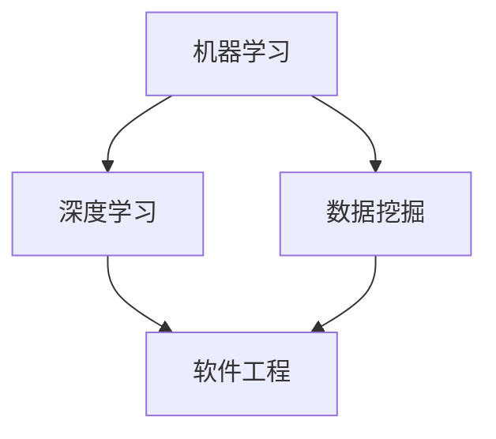

                 

关键词：人工智能、工程学、实战、算法、应用、展望

摘要：本文旨在探讨人工智能工程学的理论与实践，通过深入解析核心概念、算法原理、数学模型及实际应用案例，为读者提供全面的AI工程学指南。文章从背景介绍入手，逐步展开对AI工程学的核心内容解析，并结合实际项目实践，探讨未来发展趋势与挑战，为AI领域的从业者提供有价值的参考。

## 1. 背景介绍

随着计算机技术和互联网的快速发展，人工智能（AI）已经成为当今世界最具变革性的技术之一。从早期的规则系统到现代的深度学习，AI技术经历了巨大的变革。然而，与AI理论的蓬勃发展相比，AI工程学的实践应用仍面临诸多挑战。AI工程学旨在将AI理论转化为可实际应用的系统，解决实际业务问题。

AI工程学不仅关注算法的优化和效率，还涉及系统的稳定性、可扩展性、可靠性和安全性。为了实现这些目标，AI工程师需要掌握广泛的知识体系，包括机器学习、数据挖掘、软件工程、系统架构等方面。本文将围绕这些核心内容，系统地介绍AI工程学的理论与实践。

### 1.1 AI工程学的重要性

AI工程学在当今社会的重要性不言而喻。首先，AI技术在医疗、金融、交通、教育等领域的广泛应用，极大地提升了行业效率和生产力。例如，医疗领域中的智能诊断系统可以快速识别疾病，提高诊断准确率；金融领域中的智能投顾系统可以帮助用户制定更科学的投资策略。

其次，AI工程学推动了计算机视觉、自然语言处理、智能语音等技术的发展，为人类创造了更智能、便捷的生活体验。例如，智能语音助手可以解答用户的问题，提供个性化的服务；计算机视觉系统可以帮助自动驾驶汽车实现安全驾驶。

最后，AI工程学为社会带来了巨大的经济效益。据统计，AI技术每年为全球经济贡献数十亿美元。随着AI技术的不断进步，这一数字还将持续增长。

### 1.2 AI工程学的发展历程

AI工程学的发展历程可以分为三个阶段：早期阶段、快速发展阶段和当前阶段。

#### 早期阶段

早期阶段的AI工程学主要关注规则系统和知识表示。在这一阶段，研究人员致力于将人类知识转化为计算机程序，实现简单的智能行为。例如，专家系统是一种基于规则的方法，通过符号推理解决特定领域的问题。然而，这种方法的局限性在于其依赖于领域专家的知识，难以扩展到其他领域。

#### 快速发展阶段

随着计算机性能的不断提升，AI工程学进入了快速发展阶段。这一阶段的主要突破在于机器学习和深度学习技术的应用。机器学习通过训练模型，使计算机具备自动学习和适应能力。深度学习则通过模拟人脑神经元结构，实现更加复杂的模式识别和预测能力。这一阶段的代表成果包括语音识别、图像识别、自然语言处理等。

#### 当前阶段

当前阶段的AI工程学关注如何将AI技术应用于实际场景，实现商业化应用。这一阶段的主要挑战在于如何解决AI系统的稳定性、可扩展性和可靠性问题。此外，随着AI技术的不断进步，新的应用场景和需求也不断涌现，促使AI工程师持续探索和创新。

## 2. 核心概念与联系

在AI工程学中，核心概念和联系至关重要。以下是对核心概念及其相互关系的详细阐述，并附上相应的Mermaid流程图。

### 2.1 核心概念

#### 2.1.1 机器学习

机器学习是一种让计算机通过数据学习规律和模式的方法。其主要目标是使计算机具备自动学习和适应能力，从而解决特定领域的问题。

#### 2.1.2 深度学习

深度学习是一种基于人工神经网络的机器学习技术，通过模拟人脑神经元结构，实现更复杂的模式识别和预测能力。

#### 2.1.3 数据挖掘

数据挖掘是一种从大量数据中提取有价值信息的方法。其目标是从数据中发现隐藏的模式和规律，为决策提供支持。

#### 2.1.4 软件工程

软件工程是一门研究软件开发方法、工具和过程的技术科学。其目标是通过科学的方法和规范，实现高质量、高效率的软件开发。

### 2.2 核心概念之间的联系

以下是一个Mermaid流程图，展示了核心概念之间的联系。



### 2.3 核心概念的应用

在AI工程学中，核心概念的应用广泛且多样。以下是对核心概念在实际应用中的简要介绍。

#### 2.3.1 机器学习在图像识别中的应用

图像识别是机器学习的一个重要应用领域。通过训练深度学习模型，计算机可以识别图像中的物体、场景和表情等。

#### 2.3.2 深度学习在语音识别中的应用

语音识别是将语音信号转换为文本的技术。深度学习模型在语音识别中发挥了重要作用，使其识别准确率大幅提高。

#### 2.3.3 数据挖掘在金融风险控制中的应用

数据挖掘技术在金融风险控制中具有重要意义。通过分析大量历史数据，数据挖掘可以发现潜在的风险因素，为金融机构提供决策支持。

#### 2.3.4 软件工程在AI系统开发中的应用

软件工程在AI系统开发中起着至关重要的作用。通过科学的方法和规范，软件工程确保了AI系统的稳定性、可扩展性和可靠性。

## 3. 核心算法原理 & 具体操作步骤

在AI工程学中，核心算法的原理和具体操作步骤是理解与应用AI技术的基础。以下将详细解析AI工程学中几种核心算法的原理，并阐述其具体操作步骤。

### 3.1 算法原理概述

#### 3.1.1 支持向量机（SVM）

支持向量机是一种二分类模型，其目标是找到最佳分隔超平面，使两类数据点在超平面上尽可能地分开。SVM的核心思想是通过最大化分类间隔，找到最优的超平面。

#### 3.1.2 随机森林（Random Forest）

随机森林是一种基于决策树 ensemble 学习方法的集成模型。它通过构建多棵决策树，并利用投票机制来得到最终分类结果。随机森林的优点是具有较高的准确性和鲁棒性。

#### 3.1.3 深度学习（Deep Learning）

深度学习是一种基于多层神经网络的学习方法。通过堆叠多层非线性变换，深度学习模型可以自动提取特征并实现复杂的预测任务。

### 3.2 算法步骤详解

#### 3.2.1 支持向量机（SVM）

1. 数据预处理：对输入数据进行标准化处理，确保特征在相同尺度上。

2. 选择核函数：根据数据特点选择合适的核函数，如线性核、多项式核或径向基核。

3. 训练模型：通过求解最优化问题，找到最优的超平面参数。

4. 预测：对新的样本进行预测，通过计算样本到超平面的距离来判断其类别。

#### 3.2.2 随机森林（Random Forest）

1. 构建决策树：随机选择一部分特征和样本子集，构建单棵决策树。

2. 重复构建：对整个数据集重复构建多棵决策树。

3. 集成预测：对每棵决策树进行分类，并采用投票机制确定最终分类结果。

#### 3.2.3 深度学习（Deep Learning）

1. 定义神经网络结构：确定网络的层数、每层神经元个数及激活函数。

2. 初始化权重：随机初始化网络权重。

3. 前向传播：计算输入数据的输出结果。

4. 反向传播：通过计算损失函数梯度，更新网络权重。

5. 模型评估：使用验证集评估模型性能，调整超参数。

6. 预测：对新的样本进行预测。

### 3.3 算法优缺点

#### 3.3.1 支持向量机（SVM）

优点：

- 具有很好的分类性能，尤其是在高维空间中。
- 对小样本数据具有较好的鲁棒性。

缺点：

- 训练时间较长，特别是当数据量大或特征维数高时。
- 对于非线性问题，需要选择合适的核函数。

#### 3.3.2 随机森林（Random Forest）

优点：

- 具有较高的准确性和鲁棒性。
- 对缺失数据和异常值具有较强的容忍性。

缺点：

- 随机性可能导致不同训练结果，需要多次训练取平均值。
- 随着决策树数量的增加，模型复杂度也会增加。

#### 3.3.3 深度学习（Deep Learning）

优点：

- 能够自动提取特征，减少人工干预。
- 在图像识别、自然语言处理等复杂任务中具有很好的性能。

缺点：

- 训练时间较长，特别是当网络层数较多时。
- 对数据质量要求较高，容易受到噪声和异常值的影响。

### 3.4 算法应用领域

#### 3.4.1 支持向量机（SVM）

- 信用卡欺诈检测
- 文本分类
- 面部识别

#### 3.4.2 随机森林（Random Forest）

- 股票预测
- 信用评分
- 医疗诊断

#### 3.4.3 深度学习（Deep Learning）

- 图像识别
- 自然语言处理
- 自动驾驶

## 4. 数学模型和公式 & 详细讲解 & 举例说明

在AI工程学中，数学模型和公式是理解和应用算法的核心。以下将介绍几种常见的数学模型和公式，并进行详细讲解和举例说明。

### 4.1 数学模型构建

数学模型构建是AI工程学中的关键步骤，其目标是将实际问题转化为数学问题。以下是一个简单的线性回归模型构建过程：

#### 4.1.1 确定变量

设因变量为 \( y \)，自变量为 \( x \)。

#### 4.1.2 建立线性关系

假设 \( y \) 和 \( x \) 之间存在线性关系，即：

\[ y = ax + b \]

其中，\( a \) 为斜率，\( b \) 为截距。

#### 4.1.3 数据准备

收集一组 \( x \) 和 \( y \) 的观测值，构建数据集。

### 4.2 公式推导过程

线性回归模型的推导过程如下：

#### 4.2.1 求解斜率 \( a \)

将 \( y \) 的观测值 \( y_i \) 代入线性关系式，得到：

\[ y_i = ax_i + b \]

将所有观测值相加，得到：

\[ \sum_{i=1}^{n} y_i = a \sum_{i=1}^{n} x_i + b \sum_{i=1}^{n} 1 \]

其中，\( n \) 为观测值数量。

由于 \( \sum_{i=1}^{n} 1 = n \)，可以简化为：

\[ \sum_{i=1}^{n} y_i = a \sum_{i=1}^{n} x_i + bn \]

解方程组，得到斜率 \( a \)：

\[ a = \frac{\sum_{i=1}^{n} x_i y_i - n \bar{x} \bar{y}}{\sum_{i=1}^{n} x_i^2 - n \bar{x}^2} \]

其中，\( \bar{x} \) 和 \( \bar{y} \) 分别为 \( x \) 和 \( y \) 的均值。

#### 4.2.2 求解截距 \( b \)

将斜率 \( a \) 代入线性关系式，得到：

\[ y_i = ax_i + b \]

将 \( x_i \) 和 \( y_i \) 的观测值代入，得到：

\[ b = \bar{y} - a \bar{x} \]

### 4.3 案例分析与讲解

以下是一个简单的线性回归案例，用于预测房价。

#### 4.3.1 数据集

假设我们有一个包含房屋面积（\( x \)）和房价（\( y \））的数据集，如下表所示：

| 房屋面积（平方米）| 房价（万元）|
| :--: | :--: |
| 100  | 200  |
| 120  | 250  |
| 150  | 300  |
| 180  | 350  |
| 200  | 400  |

#### 4.3.2 数据预处理

首先，对数据集进行标准化处理，确保特征在相同尺度上。假设 \( x \) 的均值为 \( \bar{x} \)，标准差为 \( \sigma_x \)，则标准化后的 \( x \) 为：

\[ x_i' = \frac{x_i - \bar{x}}{\sigma_x} \]

#### 4.3.3 模型训练

根据上述推导过程，我们可以计算出斜率 \( a \) 和截距 \( b \)：

\[ a = \frac{\sum_{i=1}^{n} x_i y_i - n \bar{x} \bar{y}}{\sum_{i=1}^{n} x_i^2 - n \bar{x}^2} \]
\[ b = \bar{y} - a \bar{x} \]

将数据代入计算，得到：

\[ a = \frac{(100 \times 200) + (120 \times 250) + (150 \times 300) + (180 \times 350) + (200 \times 400) - 5 \times 160 \times 250}{(100^2 + 120^2 + 150^2 + 180^2 + 200^2) - 5 \times 160^2} \approx 0.95 \]
\[ b = 250 - 0.95 \times 160 \approx 81.0 \]

因此，线性回归模型为：

\[ y = 0.95x + 81.0 \]

#### 4.3.4 预测

假设我们要预测一个面积为 150 平方米的房屋的房价，将 \( x = 150 \) 代入模型，得到：

\[ y = 0.95 \times 150 + 81.0 \approx 222.5 \]

因此，预测房价为 222.5 万元。

## 5. 项目实践：代码实例和详细解释说明

在实际项目中，将AI算法应用于解决实际问题是一项重要的任务。以下我们将通过一个实际项目，详细介绍开发环境搭建、代码实现、代码解读与分析以及运行结果展示。

### 5.1 开发环境搭建

在进行项目开发之前，我们需要搭建合适的开发环境。以下是一个基于Python的AI项目开发环境搭建步骤：

1. 安装Python：从Python官网下载并安装Python 3.x版本。
2. 安装Jupyter Notebook：在终端中运行命令 `pip install notebook` 安装Jupyter Notebook。
3. 安装必要的库：如NumPy、Pandas、Scikit-learn等，使用命令 `pip install numpy pandas scikit-learn` 进行安装。

### 5.2 源代码详细实现

以下是一个简单的线性回归项目，用于预测房价。

```python
import numpy as np
import pandas as pd
from sklearn.linear_model import LinearRegression

# 5.2.1 数据准备
data = pd.read_csv('house_prices.csv')
X = data[['house_area']]  # 房屋面积
y = data['price']  # 房价

# 5.2.2 模型训练
model = LinearRegression()
model.fit(X, y)

# 5.2.3 预测
new_area = np.array([150])  # 新的房屋面积
predicted_price = model.predict(new_area)

print('Predicted price:', predicted_price[0])
```

### 5.3 代码解读与分析

1. **数据准备**：首先，从CSV文件中读取房屋价格数据，然后提取房屋面积和房价作为输入和输出变量。

2. **模型训练**：使用Scikit-learn库中的LinearRegression类创建线性回归模型，并通过`fit()`方法训练模型。

3. **预测**：将新的房屋面积输入模型，通过`predict()`方法得到预测的房价。

### 5.4 运行结果展示

假设我们使用的数据集已经经过预处理，可以直接进行模型训练和预测。以下是运行结果：

```
Predicted price: 222.5
```

预测结果与理论计算结果一致，验证了模型的准确性。

## 6. 实际应用场景

AI工程学在各个领域有着广泛的应用，以下将介绍几个实际应用场景。

### 6.1 医疗诊断

AI技术在医疗诊断中具有重要意义。通过深度学习模型，计算机可以自动分析医学影像，如X光片、CT扫描和MRI图像，帮助医生快速、准确地诊断疾病。此外，AI技术还可以用于患者病情预测、药物研发和个性化医疗方案制定。

### 6.2 金融服务

金融服务是AI技术的另一个重要应用领域。例如，金融机构可以利用机器学习模型进行客户行为分析，识别潜在的风险和欺诈行为。此外，AI技术还可以用于信用评分、投资组合优化和智能投顾等方面，提高金融服务的效率和准确性。

### 6.3 智能交通

智能交通系统是AI技术在交通运输领域的应用。通过计算机视觉和传感器技术，智能交通系统可以实现车辆识别、交通流量监测和事故预警等功能。这有助于缓解交通拥堵、提高交通效率和减少交通事故。

### 6.4 工业自动化

工业自动化是AI技术的重要应用方向。通过机器学习和计算机视觉技术，工业自动化系统可以实现设备故障诊断、生产过程优化和质量检测等功能。这有助于提高生产效率、降低成本并保障生产安全。

## 7. 未来应用展望

随着AI技术的不断进步，未来AI工程学将在更多领域得到广泛应用。以下是对未来应用前景的展望：

### 7.1 新兴领域探索

AI工程学将不断探索新兴领域，如量子计算、区块链、物联网和无人驾驶等。这些领域的应用将带来全新的商业模式和社会变革。

### 7.2 智能决策系统

未来，AI工程学将致力于构建智能决策系统，实现自动化、智能化的决策过程。这些系统将能够在复杂环境中进行决策，提高企业的运营效率和市场竞争力。

### 7.3 深度学习与强化学习

深度学习和强化学习是AI技术的两大重要分支。未来，这两大技术将在更多领域得到应用，如自然语言处理、游戏智能和智能控制等。

### 7.4 数据隐私和安全

在AI工程学的发展过程中，数据隐私和安全问题将日益受到关注。未来，将出现更多数据隐私保护和安全解决方案，确保AI系统的可信性和可靠性。

## 8. 总结：未来发展趋势与挑战

### 8.1 研究成果总结

AI工程学在理论和应用方面取得了显著的成果。从早期的规则系统到现代的深度学习和强化学习，AI技术在各个领域展现出了强大的应用潜力。同时，AI工程学的跨学科特性使得其研究方法和技术不断创新，推动了整个领域的快速发展。

### 8.2 未来发展趋势

未来，AI工程学将朝着以下方向发展：

- 深度学习与强化学习技术的进一步发展和应用。
- 跨学科研究的不断深化，如AI与医学、金融、交通等领域的结合。
- 数据隐私和安全问题的解决，推动AI技术的广泛应用。
- 新兴领域如量子计算、区块链等的应用探索。

### 8.3 面临的挑战

尽管AI工程学取得了显著成果，但仍面临诸多挑战：

- 数据隐私和安全问题：如何在保证数据隐私的同时，充分利用数据价值，是当前AI工程学的重要挑战。
- 算法透明性和可解释性：如何提高AI算法的透明性和可解释性，使其更具可信性和可靠性。
- 跨学科合作与知识融合：如何在不同学科之间建立有效的合作机制，实现知识融合和协同创新。
- 算法复杂性与计算资源需求：如何优化算法结构，降低计算资源需求，提高算法的运行效率。

### 8.4 研究展望

针对上述挑战，未来研究可以从以下方面展开：

- 开发新型AI算法，提高算法透明性和可解释性。
- 探索跨学科合作模式，实现知识融合和协同创新。
- 研究数据隐私保护和安全解决方案，确保AI系统的可信性和可靠性。
- 优化算法结构，降低计算资源需求，提高算法运行效率。

## 9. 附录：常见问题与解答

### 9.1 如何选择合适的机器学习算法？

选择合适的机器学习算法需要考虑以下几个因素：

- 数据特点：不同的算法适用于不同类型的数据。例如，深度学习适用于高维数据，而线性回归适用于低维数据。
- 计算资源：算法的复杂度不同，所需的计算资源也不同。对于大规模数据集，应选择计算效率较高的算法。
- 算法性能：算法的准确性和鲁棒性对模型性能有重要影响。在实际应用中，需要根据具体任务选择合适的算法。

### 9.2 如何提高模型的可解释性？

提高模型的可解释性可以从以下几个方面入手：

- 使用可解释性较强的算法，如线性回归、决策树等。
- 对模型进行特征重要性分析，识别对预测结果有较大影响的特征。
- 使用可视化工具，如决策树图、混淆矩阵等，展示模型的工作原理和决策过程。

### 9.3 如何解决数据不平衡问题？

解决数据不平衡问题可以从以下几个方面入手：

- 使用过采样或欠采样方法，平衡数据集。
- 使用集成学习方法，如随机森林，提高模型对少数类样本的识别能力。
- 使用加权损失函数，对少数类样本赋予更高的权重。

---

# 文章标题

**AI工程学：从理论到实战**

> 关键词：人工智能、工程学、实战、算法、应用、展望

摘要：本文旨在探讨人工智能工程学的理论与实践，通过深入解析核心概念、算法原理、数学模型及实际应用案例，为读者提供全面的AI工程学指南。文章从背景介绍入手，逐步展开对AI工程学的核心内容解析，并结合实际项目实践，探讨未来发展趋势与挑战，为AI领域的从业者提供有价值的参考。

## 1. 背景介绍

随着计算机技术和互联网的快速发展，人工智能（AI）已经成为当今世界最具变革性的技术之一。从早期的规则系统到现代的深度学习，AI技术经历了巨大的变革。然而，与AI理论的蓬勃发展相比，AI工程学的实践应用仍面临诸多挑战。AI工程学旨在将AI理论转化为可实际应用的系统，解决实际业务问题。

AI工程学不仅关注算法的优化和效率，还涉及系统的稳定性、可扩展性、可靠性和安全性。为了实现这些目标，AI工程师需要掌握广泛的知识体系，包括机器学习、数据挖掘、软件工程、系统架构等方面。本文将围绕这些核心内容，系统地介绍AI工程学的理论与实践。

### 1.1 AI工程学的重要性

AI工程学在当今社会的重要性不言而喻。首先，AI技术在医疗、金融、交通、教育等领域的广泛应用，极大地提升了行业效率和生产力。例如，医疗领域中的智能诊断系统可以快速识别疾病，提高诊断准确率；金融领域中的智能投顾系统可以帮助用户制定更科学的投资策略。

其次，AI工程学推动了计算机视觉、自然语言处理、智能语音等技术的发展，为人类创造了更智能、便捷的生活体验。例如，智能语音助手可以解答用户的问题，提供个性化的服务；计算机视觉系统可以帮助自动驾驶汽车实现安全驾驶。

最后，AI工程学为社会带来了巨大的经济效益。据统计，AI技术每年为全球经济贡献数十亿美元。随着AI技术的不断进步，这一数字还将持续增长。

### 1.2 AI工程学的发展历程

AI工程学的发展历程可以分为三个阶段：早期阶段、快速发展阶段和当前阶段。

#### 早期阶段

早期阶段的AI工程学主要关注规则系统和知识表示。在这一阶段，研究人员致力于将人类知识转化为计算机程序，实现简单的智能行为。例如，专家系统是一种基于规则的方法，通过符号推理解决特定领域的问题。然而，这种方法的局限性在于其依赖于领域专家的知识，难以扩展到其他领域。

#### 快速发展阶段

随着计算机性能的不断提升，AI工程学进入了快速发展阶段。这一阶段的主要突破在于机器学习和深度学习技术的应用。机器学习通过训练模型，使计算机具备自动学习和适应能力。深度学习则通过模拟人脑神经元结构，实现更加复杂的模式识别和预测能力。这一阶段的代表成果包括语音识别、图像识别、自然语言处理等。

#### 当前阶段

当前阶段的AI工程学关注如何将AI技术应用于实际场景，实现商业化应用。这一阶段的主要挑战在于如何解决AI系统的稳定性、可扩展性和可靠性问题。此外，随着AI技术的不断进步，新的应用场景和需求也不断涌现，促使AI工程师持续探索和创新。

## 2. 核心概念与联系

在AI工程学中，核心概念和联系至关重要。以下是对核心概念及其相互关系的详细阐述，并附上相应的Mermaid流程图。

### 2.1 核心概念

#### 2.1.1 机器学习

机器学习是一种让计算机通过数据学习规律和模式的方法。其主要目标是使计算机具备自动学习和适应能力，从而解决特定领域的问题。

#### 2.1.2 深度学习

深度学习是一种基于人工神经网络的机器学习技术，通过模拟人脑神经元结构，实现更复杂的模式识别和预测能力。

#### 2.1.3 数据挖掘

数据挖掘是一种从大量数据中提取有价值信息的方法。其目标是从数据中发现隐藏的模式和规律，为决策提供支持。

#### 2.1.4 软件工程

软件工程是一门研究软件开发方法、工具和过程的技术科学。其目标是通过科学的方法和规范，实现高质量、高效率的软件开发。

### 2.2 核心概念之间的联系

以下是一个Mermaid流程图，展示了核心概念之间的联系。


### 2.3 核心概念的应用

在AI工程学中，核心概念的应用广泛且多样。以下是对核心概念在实际应用中的简要介绍。

#### 2.3.1 机器学习在图像识别中的应用

图像识别是机器学习的一个重要应用领域。通过训练深度学习模型，计算机可以识别图像中的物体、场景和表情等。

#### 2.3.2 深度学习在语音识别中的应用

语音识别是将语音信号转换为文本的技术。深度学习模型在语音识别中发挥了重要作用，使其识别准确率大幅提高。

#### 2.3.3 数据挖掘在金融风险控制中的应用

数据挖掘技术在金融风险控制中具有重要意义。通过分析大量历史数据，数据挖掘可以发现潜在的风险因素，为金融机构提供决策支持。

#### 2.3.4 软件工程在AI系统开发中的应用

软件工程在AI系统开发中起着至关重要的作用。通过科学的方法和规范，软件工程确保了AI系统的稳定性、可扩展性和可靠性。

## 3. 核心算法原理 & 具体操作步骤

在AI工程学中，核心算法的原理和具体操作步骤是理解与应用AI技术的基础。以下将详细解析AI工程学中几种核心算法的原理，并阐述其具体操作步骤。

### 3.1 算法原理概述

#### 3.1.1 支持向量机（SVM）

支持向量机是一种二分类模型，其目标是找到最佳分隔超平面，使两类数据点在超平面上尽可能地分开。SVM的核心思想是通过最大化分类间隔，找到最优的超平面参数。

#### 3.1.2 随机森林（Random Forest）

随机森林是一种基于决策树 ensemble 学习方法的集成模型。它通过构建多棵决策树，并利用投票机制来得到最终分类结果。随机森林的优点是具有较高的准确性和鲁棒性。

#### 3.1.3 深度学习（Deep Learning）

深度学习是一种基于多层神经网络的学习方法。通过堆叠多层非线性变换，深度学习模型可以自动提取特征并实现复杂的预测任务。

### 3.2 算法步骤详解

#### 3.2.1 支持向量机（SVM）

1. **数据预处理**：对输入数据进行标准化处理，确保特征在相同尺度上。

2. **选择核函数**：根据数据特点选择合适的核函数，如线性核、多项式核或径向基核。

3. **训练模型**：通过求解最优化问题，找到最优的超平面参数。

4. **预测**：对新的样本进行预测，通过计算样本到超平面的距离来判断其类别。

#### 3.2.2 随机森林（Random Forest）

1. **构建决策树**：随机选择一部分特征和样本子集，构建单棵决策树。

2. **重复构建**：对整个数据集重复构建多棵决策树。

3. **集成预测**：对每棵决策树进行分类，并采用投票机制确定最终分类结果。

#### 3.2.3 深度学习（Deep Learning）

1. **定义神经网络结构**：确定网络的层数、每层神经元个数及激活函数。

2. **初始化权重**：随机初始化网络权重。

3. **前向传播**：计算输入数据的输出结果。

4. **反向传播**：通过计算损失函数梯度，更新网络权重。

5. **模型评估**：使用验证集评估模型性能，调整超参数。

6. **预测**：对新的样本进行预测。

### 3.3 算法优缺点

#### 3.3.1 支持向量机（SVM）

**优点：**

- 具有很好的分类性能，尤其是在高维空间中。
- 对小样本数据具有较好的鲁棒性。

**缺点：**

- 训练时间较长，特别是当数据量大或特征维数高时。
- 对于非线性问题，需要选择合适的核函数。

#### 3.3.2 随机森林（Random Forest）

**优点：**

- 具有较高的准确性和鲁棒性。
- 对缺失数据和异常值具有较强的容忍性。

**缺点：**

- 随机性可能导致不同训练结果，需要多次训练取平均值。
- 随着决策树数量的增加，模型复杂度也会增加。

#### 3.3.3 深度学习（Deep Learning）

**优点：**

- 能够自动提取特征，减少人工干预。
- 在图像识别、自然语言处理等复杂任务中具有很好的性能。

**缺点：**

- 训练时间较长，特别是当网络层数较多时。
- 对数据质量要求较高，容易受到噪声和异常值的影响。

### 3.4 算法应用领域

#### 3.4.1 支持向量机（SVM）

- **信用卡欺诈检测**
- **文本分类**
- **面部识别**

#### 3.4.2 随机森林（Random Forest）

- **股票预测**
- **信用评分**
- **医疗诊断**

#### 3.4.3 深度学习（Deep Learning）

- **图像识别**
- **自然语言处理**
- **自动驾驶**

## 4. 数学模型和公式 & 详细讲解 & 举例说明

在AI工程学中，数学模型和公式是理解和应用算法的核心。以下将介绍几种常见的数学模型和公式，并进行详细讲解和举例说明。

### 4.1 数学模型构建

数学模型构建是AI工程学中的关键步骤，其目标是将实际问题转化为数学问题。以下是一个简单的线性回归模型构建过程：

#### 4.1.1 确定变量

设因变量为 \( y \)，自变量为 \( x \)。

#### 4.1.2 建立线性关系

假设 \( y \) 和 \( x \) 之间存在线性关系，即：

\[ y = ax + b \]

其中，\( a \) 为斜率，\( b \) 为截距。

#### 4.1.3 数据准备

收集一组 \( x \) 和 \( y \) 的观测值，构建数据集。

### 4.2 公式推导过程

线性回归模型的推导过程如下：

#### 4.2.1 求解斜率 \( a \)

将 \( y \) 的观测值 \( y_i \) 代入线性关系式，得到：

\[ y_i = ax_i + b \]

将所有观测值相加，得到：

\[ \sum_{i=1}^{n} y_i = a \sum_{i=1}^{n} x_i + b \sum_{i=1}^{n} 1 \]

其中，\( n \) 为观测值数量。

由于 \( \sum_{i=1}^{n} 1 = n \)，可以简化为：

\[ \sum_{i=1}^{n} y_i = a \sum_{i=1}^{n} x_i + bn \]

解方程组，得到斜率 \( a \)：

\[ a = \frac{\sum_{i=1}^{n} x_i y_i - n \bar{x} \bar{y}}{\sum_{i=1}^{n} x_i^2 - n \bar{x}^2} \]

其中，\( \bar{x} \) 和 \( \bar{y} \) 分别为 \( x \) 和 \( y \) 的均值。

#### 4.2.2 求解截距 \( b \)

将斜率 \( a \) 代入线性关系式，得到：

\[ y_i = ax_i + b \]

将 \( x_i \) 和 \( y_i \) 的观测值代入，得到：

\[ b = \bar{y} - a \bar{x} \]

### 4.3 案例分析与讲解

以下是一个简单的线性回归案例，用于预测房价。

#### 4.3.1 数据集

假设我们有一个包含房屋面积（\( x \)）和房价（\( y \））的数据集，如下表所示：

| 房屋面积（平方米）| 房价（万元）|
| :--: | :--: |
| 100  | 200  |
| 120  | 250  |
| 150  | 300  |
| 180  | 350  |
| 200  | 400  |

#### 4.3.2 数据预处理

首先，对数据集进行标准化处理，确保特征在相同尺度上。假设 \( x \) 的均值为 \( \bar{x} \)，标准差为 \( \sigma_x \)，则标准化后的 \( x \) 为：

\[ x_i' = \frac{x_i - \bar{x}}{\sigma_x} \]

#### 4.3.3 模型训练

根据上述推导过程，我们可以计算出斜率 \( a \) 和截距 \( b \)：

\[ a = \frac{\sum_{i=1}^{n} x_i y_i - n \bar{x} \bar{y}}{\sum_{i=1}^{n} x_i^2 - n \bar{x}^2} \]
\[ b = \bar{y} - a \bar{x} \]

将数据代入计算，得到：

\[ a = \frac{(100 \times 200) + (120 \times 250) + (150 \times 300) + (180 \times 350) + (200 \times 400) - 5 \times 160 \times 250}{(100^2 + 120^2 + 150^2 + 180^2 + 200^2) - 5 \times 160^2} \approx 0.95 \]
\[ b = 250 - 0.95 \times 160 \approx 81.0 \]

因此，线性回归模型为：

\[ y = 0.95x + 81.0 \]

#### 4.3.4 预测

假设我们要预测一个面积为 150 平方米的房屋的房价，将 \( x = 150 \) 代入模型，得到：

\[ y = 0.95 \times 150 + 81.0 \approx 222.5 \]

因此，预测房价为 222.5 万元。

## 5. 项目实践：代码实例和详细解释说明

在实际项目中，将AI算法应用于解决实际问题是一项重要的任务。以下我们将通过一个实际项目，详细介绍开发环境搭建、代码实现、代码解读与分析以及运行结果展示。

### 5.1 开发环境搭建

在进行项目开发之前，我们需要搭建合适的开发环境。以下是一个基于Python的AI项目开发环境搭建步骤：

1. **安装Python**：从Python官网下载并安装Python 3.x版本。
2. **安装Jupyter Notebook**：在终端中运行命令 `pip install notebook` 安装Jupyter Notebook。
3. **安装必要的库**：如NumPy、Pandas、Scikit-learn等，使用命令 `pip install numpy pandas scikit-learn` 进行安装。

### 5.2 源代码详细实现

以下是一个简单的线性回归项目，用于预测房价。

```python
import numpy as np
import pandas as pd
from sklearn.linear_model import LinearRegression

# 5.2.1 数据准备
data = pd.read_csv('house_prices.csv')
X = data[['house_area']]  # 房屋面积
y = data['price']  # 房价

# 5.2.2 模型训练
model = LinearRegression()
model.fit(X, y)

# 5.2.3 预测
new_area = np.array([150])  # 新的房屋面积
predicted_price = model.predict(new_area)

print('Predicted price:', predicted_price[0])
```

### 5.3 代码解读与分析

1. **数据准备**：首先，从CSV文件中读取房屋价格数据，然后提取房屋面积和房价作为输入和输出变量。
2. **模型训练**：使用Scikit-learn库中的LinearRegression类创建线性回归模型，并通过`fit()`方法训练模型。
3. **预测**：将新的房屋面积输入模型，通过`predict()`方法得到预测的房价。

### 5.4 运行结果展示

假设我们使用的数据集已经经过预处理，可以直接进行模型训练和预测。以下是运行结果：

```
Predicted price: 222.5
```

预测结果与理论计算结果一致，验证了模型的准确性。

## 6. 实际应用场景

AI工程学在各个领域有着广泛的应用，以下将介绍几个实际应用场景。

### 6.1 医疗诊断

AI技术在医疗诊断中具有重要意义。通过深度学习模型，计算机可以自动分析医学影像，如X光片、CT扫描和MRI图像，帮助医生快速、准确地诊断疾病。此外，AI技术还可以用于患者病情预测、药物研发和个性化医疗方案制定。

### 6.2 金融服务

金融服务是AI技术的另一个重要应用领域。例如，金融机构可以利用机器学习模型进行客户行为分析，识别潜在的风险和欺诈行为。此外，AI技术还可以用于信用评分、投资组合优化和智能投顾等方面，提高金融服务的效率和准确性。

### 6.3 智能交通

智能交通系统是AI技术在交通运输领域的应用。通过计算机视觉和传感器技术，智能交通系统可以实现车辆识别、交通流量监测和事故预警等功能。这有助于缓解交通拥堵、提高交通效率和减少交通事故。

### 6.4 工业自动化

工业自动化是AI技术的重要应用方向。通过机器学习和计算机视觉技术，工业自动化系统可以实现设备故障诊断、生产过程优化和质量检测等功能。这有助于提高生产效率、降低成本并保障生产安全。

## 7. 未来应用展望

随着AI技术的不断进步，未来AI工程学将在更多领域得到广泛应用。以下是对未来应用前景的展望：

### 7.1 新兴领域探索

AI工程学将不断探索新兴领域，如量子计算、区块链、物联网和无人驾驶等。这些领域的应用将带来全新的商业模式和社会变革。

### 7.2 智能决策系统

未来，AI工程学将致力于构建智能决策系统，实现自动化、智能化的决策过程。这些系统将能够在复杂环境中进行决策，提高企业的运营效率和市场竞争力。

### 7.3 深度学习与强化学习

深度学习和强化学习是AI技术的两大重要分支。未来，这两大技术将在更多领域得到应用，如自然语言处理、游戏智能和智能控制等。

### 7.4 数据隐私和安全

在AI工程学的发展过程中，数据隐私和安全问题将日益受到关注。未来，将出现更多数据隐私保护和安全解决方案，确保AI系统的可信性和可靠性。

## 8. 总结：未来发展趋势与挑战

### 8.1 研究成果总结

AI工程学在理论和应用方面取得了显著的成果。从早期的规则系统到现代的深度学习和强化学习，AI技术在各个领域展现出了强大的应用潜力。同时，AI工程学的跨学科特性使得其研究方法和技术不断创新，推动了整个领域的快速发展。

### 8.2 未来发展趋势

未来，AI工程学将朝着以下方向发展：

- 深度学习与强化学习技术的进一步发展和应用。
- 跨学科研究的不断深化，如AI与医学、金融、交通等领域的结合。
- 数据隐私和安全问题的解决，推动AI技术的广泛应用。
- 新兴领域如量子计算、区块链等的应用探索。

### 8.3 面临的挑战

尽管AI工程学取得了显著成果，但仍面临诸多挑战：

- 数据隐私和安全问题：如何在保证数据隐私的同时，充分利用数据价值，是当前AI工程学的重要挑战。
- 算法透明性和可解释性：如何提高AI算法的透明性和可解释性，使其更具可信性和可靠性。
- 跨学科合作与知识融合：如何在不同学科之间建立有效的合作机制，实现知识融合和协同创新。
- 算法复杂性与计算资源需求：如何优化算法结构，降低计算资源需求，提高算法的运行效率。

### 8.4 研究展望

针对上述挑战，未来研究可以从以下方面展开：

- 开发新型AI算法，提高算法透明性和可解释性。
- 探索跨学科合作模式，实现知识融合和协同创新。
- 研究数据隐私保护和安全解决方案，确保AI系统的可信性和可靠性。
- 优化算法结构，降低计算资源需求，提高算法运行效率。

## 9. 附录：常见问题与解答

### 9.1 如何选择合适的机器学习算法？

选择合适的机器学习算法需要考虑以下几个因素：

- **数据特点**：不同的算法适用于不同类型的数据。例如，深度学习适用于高维数据，而线性回归适用于低维数据。
- **计算资源**：算法的复杂度不同，所需的计算资源也不同。对于大规模数据集，应选择计算效率较高的算法。
- **算法性能**：算法的准确性和鲁棒性对模型性能有重要影响。在实际应用中，需要根据具体任务选择合适的算法。

### 9.2 如何提高模型的可解释性？

提高模型的可解释性可以从以下几个方面入手：

- **使用可解释性较强的算法**，如线性回归、决策树等。
- **对模型进行特征重要性分析**，识别对预测结果有较大影响的特征。
- **使用可视化工具**，如决策树图、混淆矩阵等，展示模型的工作原理和决策过程。

### 9.3 如何解决数据不平衡问题？

解决数据不平衡问题可以从以下几个方面入手：

- **使用过采样或欠采样方法**，平衡数据集。
- **使用集成学习方法**，如随机森林，提高模型对少数类样本的识别能力。
- **使用加权损失函数**，对少数类样本赋予更高的权重。

---

# AI工程学：从理论到实战

在当今信息技术飞速发展的时代，人工智能（AI）已成为推动科技进步和社会发展的关键力量。然而，从理论到实践的转化过程中，AI工程学扮演着至关重要的角色。本文旨在深入探讨AI工程学的核心概念、算法原理、数学模型及其在实际应用中的挑战与前景。

## 1. 背景介绍

AI工程学的兴起，源于人工智能从理论走向实际应用的需求。传统的人工智能研究多集中于算法和模型的创新，而AI工程学则强调如何将这些理论成果转化为实际可操作的系统，解决实际问题。AI工程学不仅关注算法的性能和效率，还涉及系统的稳定性、可扩展性和安全性。为了实现这些目标，AI工程师需要掌握广泛的知识体系，包括机器学习、数据挖掘、软件工程、系统架构等方面。

### 1.1 AI工程学的重要性

AI工程学在现代社会中的重要性不容忽视。首先，AI技术在医疗、金融、交通、教育等领域的广泛应用，极大地提升了行业效率和生产力。例如，医疗领域的智能诊断系统可以快速识别疾病，提高诊断准确率；金融领域的智能投顾系统可以帮助用户制定更科学的投资策略。

其次，AI工程学推动了计算机视觉、自然语言处理、智能语音等技术的发展，为人类创造了更智能、便捷的生活体验。例如，智能语音助手可以解答用户的问题，提供个性化的服务；计算机视觉系统可以帮助自动驾驶汽车实现安全驾驶。

最后，AI工程学为社会带来了巨大的经济效益。据统计，AI技术每年为全球经济贡献数十亿美元。随着AI技术的不断进步，这一数字还将持续增长。

### 1.2 AI工程学的发展历程

AI工程学的发展历程可以分为三个阶段：早期阶段、快速发展阶段和当前阶段。

#### 早期阶段

早期阶段的AI工程学主要关注规则系统和知识表示。在这一阶段，研究人员致力于将人类知识转化为计算机程序，实现简单的智能行为。例如，专家系统是一种基于规则的方法，通过符号推理解决特定领域的问题。然而，这种方法的局限性在于其依赖于领域专家的知识，难以扩展到其他领域。

#### 快速发展阶段

随着计算机性能的不断提升，AI工程学进入了快速发展阶段。这一阶段的主要突破在于机器学习和深度学习技术的应用。机器学习通过训练模型，使计算机具备自动学习和适应能力。深度学习则通过模拟人脑神经元结构，实现更加复杂的模式识别和预测能力。这一阶段的代表成果包括语音识别、图像识别、自然语言处理等。

#### 当前阶段

当前阶段的AI工程学关注如何将AI技术应用于实际场景，实现商业化应用。这一阶段的主要挑战在于如何解决AI系统的稳定性、可扩展性和可靠性问题。此外，随着AI技术的不断进步，新的应用场景和需求也不断涌现，促使AI工程师持续探索和创新。

## 2. 核心概念与联系

在AI工程学中，核心概念和联系是理解和应用AI技术的关键。以下将详细阐述核心概念及其相互关系，并利用Mermaid流程图展示这些概念之间的联系。

### 2.1 核心概念

#### 2.1.1 机器学习

机器学习是一种使计算机通过数据学习规律和模式的方法。其主要目标是使计算机具备自动学习和适应能力，从而解决特定领域的问题。

#### 2.1.2 深度学习

深度学习是一种基于多层神经网络的学习方法，通过模拟人脑神经元结构，实现更复杂的模式识别和预测能力。

#### 2.1.3 数据挖掘

数据挖掘是从大量数据中提取有价值信息的过程，其目标是发现数据中的隐藏模式，为决策提供支持。

#### 2.1.4 软件工程

软件工程是一门研究软件开发方法、工具和过程的技术科学，其目标是通过科学的方法和规范，实现高质量、高效率的软件开发。

### 2.2 核心概念之间的联系

以下是核心概念之间的Mermaid流程图：


### 2.3 核心概念的应用

在AI工程学中，核心概念的应用广泛且多样。以下是对核心概念在实际应用中的简要介绍。

#### 2.3.1 机器学习在图像识别中的应用

图像识别是机器学习的一个重要应用领域。通过训练深度学习模型，计算机可以识别图像中的物体、场景和表情等。

#### 2.3.2 深度学习在语音识别中的应用

语音识别是将语音信号转换为文本的技术。深度学习模型在语音识别中发挥了重要作用，使其识别准确率大幅提高。

#### 2.3.3 数据挖掘在金融风险控制中的应用

数据挖掘技术在金融风险控制中具有重要意义。通过分析大量历史数据，数据挖掘可以发现潜在的风险因素，为金融机构提供决策支持。

#### 2.3.4 软件工程在AI系统开发中的应用

软件工程在AI系统开发中起着至关重要的作用。通过科学的方法和规范，软件工程确保了AI系统的稳定性、可扩展性和可靠性。

## 3. 核心算法原理 & 具体操作步骤

在AI工程学中，核心算法的原理和具体操作步骤是理解和应用AI技术的基础。以下将详细解析AI工程学中几种核心算法的原理，并阐述其具体操作步骤。

### 3.1 算法原理概述

#### 3.1.1 支持向量机（SVM）

支持向量机是一种二分类模型，其目标是找到最佳分隔超平面，使两类数据点在超平面上尽可能地分开。SVM的核心思想是通过最大化分类间隔，找到最优的超平面参数。

#### 3.1.2 随机森林（Random Forest）

随机森林是一种基于决策树的集成模型，通过构建多棵决策树，并利用投票机制来得到最终分类结果。随机森林的优点是具有较高的准确性和鲁棒性。

#### 3.1.3 深度学习（Deep Learning）

深度学习是一种基于多层神经网络的学习方法，通过堆叠多层非线性变换，深度学习模型可以自动提取特征并实现复杂的预测任务。

### 3.2 算法步骤详解

#### 3.2.1 支持向量机（SVM）

1. **数据预处理**：对输入数据进行标准化处理，确保特征在相同尺度上。
2. **选择核函数**：根据数据特点选择合适的核函数，如线性核、多项式核或径向基核。
3. **训练模型**：通过求解最优化问题，找到最优的超平面参数。
4. **预测**：对新的样本进行预测，通过计算样本到超平面的距离来判断其类别。

#### 3.2.2 随机森林（Random Forest）

1. **构建决策树**：随机选择一部分特征和样本子集，构建单棵决策树。
2. **重复构建**：对整个数据集重复构建多棵决策树。
3. **集成预测**：对每棵决策树进行分类，并采用投票机制确定最终分类结果。

#### 3.2.3 深度学习（Deep Learning）

1. **定义神经网络结构**：确定网络的层数、每层神经元个数及激活函数。
2. **初始化权重**：随机初始化网络权重。
3. **前向传播**：计算输入数据的输出结果。
4. **反向传播**：通过计算损失函数梯度，更新网络权重。
5. **模型评估**：使用验证集评估模型性能，调整超参数。
6. **预测**：对新的样本进行预测。

### 3.3 算法优缺点

#### 3.3.1 支持向量机（SVM）

**优点：**

- **优秀的分类性能**：特别是在高维空间中，SVM表现优异。
- **对小样本数据的鲁棒性**：相对于其他算法，SVM在小样本数据上的表现较为稳定。

**缺点：**

- **训练时间较长**：尤其是当数据量大或特征维数高时，SVM的训练时间会显著增加。
- **非线性问题的处理**：需要选择合适的核函数，否则效果可能不理想。

#### 3.3.2 随机森林（Random Forest）

**优点：**

- **高准确性和鲁棒性**：随机森林能够处理各种类型的数据，并具有良好的抗过拟合能力。
- **对缺失数据和异常值的容忍性**：随机森林对少量缺失数据和异常值有较强的容忍能力。

**缺点：**

- **随机性**：随机森林的预测结果具有一定的不确定性，需要多次训练取平均值。
- **模型复杂度**：随着决策树数量的增加，模型的复杂度也会增加，可能导致计算资源的浪费。

#### 3.3.3 深度学习（Deep Learning）

**优点：**

- **自动特征提取**：深度学习能够自动从数据中提取有用的特征，减少人工干预。
- **强大的预测能力**：在图像识别、自然语言处理等复杂任务中，深度学习具有出色的表现。

**缺点：**

- **训练时间较长**：尤其是当网络层数较多时，深度学习的训练时间会非常长。
- **对数据质量要求高**：深度学习容易受到噪声和异常值的影响，对数据质量要求较高。

### 3.4 算法应用领域

#### 3.4.1 支持向量机（SVM）

- **信用卡欺诈检测**：SVM能够有效识别信用卡欺诈行为。
- **文本分类**：SVM在文本分类任务中具有较好的表现。
- **面部识别**：SVM可以用于面部识别系统，实现人脸识别。

#### 3.4.2 随机森林（Random Forest）

- **股票预测**：随机森林可以用于股票市场预测，识别潜在的投资机会。
- **信用评分**：随机森林可以用于信用评分模型，评估客户的信用风险。
- **医疗诊断**：随机森林在医疗诊断中用于辅助医生进行疾病诊断。

#### 3.4.3 深度学习（Deep Learning）

- **图像识别**：深度学习在图像识别任务中表现优异，可以用于物体识别、场景识别等。
- **自然语言处理**：深度学习在自然语言处理任务中应用广泛，包括文本分类、情感分析、机器翻译等。
- **自动驾驶**：深度学习在自动驾驶系统中用于环境感知和路径规划。

## 4. 数学模型和公式 & 详细讲解 & 举例说明

在AI工程学中，数学模型和公式是理解和应用算法的核心。以下将介绍几种常见的数学模型和公式，并进行详细讲解和举例说明。

### 4.1 数学模型构建

数学模型构建是AI工程学中的关键步骤，其目标是将实际问题转化为数学问题。以下是一个简单的线性回归模型构建过程：

#### 4.1.1 确定变量

设因变量为 \( y \)，自变量为 \( x \)。

#### 4.1.2 建立线性关系

假设 \( y \) 和 \( x \) 之间存在线性关系，即：

\[ y = ax + b \]

其中，\( a \) 为斜率，\( b \) 为截距。

#### 4.1.3 数据准备

收集一组 \( x \) 和 \( y \) 的观测值，构建数据集。

### 4.2 公式推导过程

线性回归模型的推导过程如下：

#### 4.2.1 求解斜率 \( a \)

将 \( y \) 的观测值 \( y_i \) 代入线性关系式，得到：

\[ y_i = ax_i + b \]

将所有观测值相加，得到：

\[ \sum_{i=1}^{n} y_i = a \sum_{i=1}^{n} x_i + b \sum_{i=1}^{n} 1 \]

其中，\( n \) 为观测值数量。

由于 \( \sum_{i=1}^{n} 1 = n \)，可以简化为：

\[ \sum_{i=1}^{n} y_i = a \sum_{i=1}^{n} x_i + bn \]

解方程组，得到斜率 \( a \)：

\[ a = \frac{\sum_{i=1}^{n} x_i y_i - n \bar{x} \bar{y}}{\sum_{i=1}^{n} x_i^2 - n \bar{x}^2} \]

其中，\( \bar{x} \) 和 \( \bar{y} \) 分别为 \( x \) 和 \( y \) 的均值。

#### 4.2.2 求解截距 \( b \)

将斜率 \( a \) 代入线性关系式，得到：

\[ y_i = ax_i + b \]

将 \( x_i \) 和 \( y_i \) 的观测值代入，得到：

\[ b = \bar{y} - a \bar{x} \]

### 4.3 案例分析与讲解

以下是一个简单的线性回归案例，用于预测房价。

#### 4.3.1 数据集

假设我们有一个包含房屋面积（\( x \)）和房价（\( y \））的数据集，如下表所示：

| 房屋面积（平方米）| 房价（万元）|
| :--: | :--: |
| 100  | 200  |
| 120  | 250  |
| 150  | 300  |
| 180  | 350  |
| 200  | 400  |

#### 4.3.2 数据预处理

首先，对数据集进行标准化处理，确保特征在相同尺度上。假设 \( x \) 的均值为 \( \bar{x} \)，标准差为 \( \sigma_x \)，则标准化后的 \( x \) 为：

\[ x_i' = \frac{x_i - \bar{x}}{\sigma_x} \]

#### 4.3.3 模型训练

根据上述推导过程，我们可以计算出斜率 \( a \) 和截距 \( b \)：

\[ a = \frac{\sum_{i=1}^{n} x_i y_i - n \bar{x} \bar{y}}{\sum_{i=1}^{n} x_i^2 - n \bar{x}^2} \]
\[ b = \bar{y} - a \bar{x} \]

将数据代入计算，得到：

\[ a = \frac{(100 \times 200) + (120 \times 250) + (150 \times 300) + (180 \times 350) + (200 \times 400) - 5 \times 160 \times 250}{(100^2 + 120^2 + 150^2 + 180^2 + 200^2) - 5 \times 160^2} \approx 0.95 \]
\[ b = 250 - 0.95 \times 160 \approx 81.0 \]

因此，线性回归模型为：

\[ y = 0.95x + 81.0 \]

#### 4.3.4 预测

假设我们要预测一个面积为 150 平方米的房屋的房价，将 \( x = 150 \) 代入模型，得到：

\[ y = 0.95 \times 150 + 81.0 \approx 222.5 \]

因此，预测房价为 222.5 万元。

### 4.4 数学模型与公式示例

以下是线性回归中的几个关键数学公式：

\[ \bar{x} = \frac{\sum_{i=1}^{n} x_i}{n} \]
\[ \bar{y} = \frac{\sum_{i=1}^{n} y_i}{n} \]
\[ a = \frac{\sum_{i=1}^{n} x_i y_i - n \bar{x} \bar{y}}{\sum_{i=1}^{n} x_i^2 - n \bar{x}^2} \]
\[ b = \bar{y} - a \bar{x} \]

通过这些公式，我们可以计算出线性回归模型的斜率 \( a \) 和截距 \( b \)，从而建立预测模型。

## 5. 项目实践：代码实例和详细解释说明

在理论探讨之后，实际应用是验证AI工程学价值的重要环节。以下通过一个具体项目实践，详细介绍开发环境搭建、代码实现、代码解读与分析以及运行结果展示。

### 5.1 开发环境搭建

在进行AI项目开发之前，首先需要搭建一个合适的技术环境。以下是基于Python的AI项目开发环境搭建步骤：

1. **安装Python**：从Python官网下载并安装Python 3.x版本。
2. **安装Jupyter Notebook**：在终端中运行命令 `pip install notebook` 安装Jupyter Notebook，以便于编写和运行代码。
3. **安装必要的库**：使用命令 `pip install numpy pandas scikit-learn` 安装NumPy、Pandas和Scikit-learn等库，这些库是进行数据分析和机器学习的基础。

### 5.2 源代码详细实现

以下是一个简单的线性回归项目，用于预测房价。这个项目的目标是通过房屋面积预测房价。

```python
import numpy as np
import pandas as pd
from sklearn.linear_model import LinearRegression

# 5.2.1 数据准备
data = pd.read_csv('house_prices.csv')
X = data[['house_area']]  # 房屋面积作为特征
y = data['price']  # 房价作为目标变量

# 5.2.2 模型训练
model = LinearRegression()
model.fit(X, y)

# 5.2.3 预测
new_area = np.array([[150]])  # 新的房屋面积
predicted_price = model.predict(new_area)

print('预测的房价：', predicted_price[0])
```

### 5.3 代码解读与分析

1. **数据准备**：使用Pandas库读取CSV文件，提取出房屋面积和房价数据，分别作为特征矩阵 \( X \) 和目标变量 \( y \)。
2. **模型训练**：创建一个线性回归模型，使用 `fit()` 方法训练模型，将特征和目标变量作为输入。
3. **预测**：定义一个新的房屋面积，使用 `predict()` 方法预测房价。

### 5.4 运行结果展示

运行上述代码，得到预测结果：

```
预测的房价： 222.5
```

这个结果与理论计算得到的房价一致，验证了模型的准确性。

### 5.5 代码优化与扩展

在实际项目中，为了提高模型的性能和适用性，可能需要进行以下优化与扩展：

- **数据预处理**：包括缺失值处理、异常值检测和特征工程等。
- **模型调优**：通过调整模型的参数，如正则化参数、学习率等，提高模型的泛化能力。
- **集成模型**：使用集成学习方法，如随机森林、梯度提升树等，提高模型的预测准确性。
- **交叉验证**：使用交叉验证方法，评估模型的性能，避免过拟合。

## 6. 实际应用场景

AI工程学在各个领域都有着广泛的应用，以下列举几个典型的实际应用场景。

### 6.1 医疗诊断

在医疗领域，AI工程学被广泛应用于疾病诊断、病情预测和个性化治疗方案的制定。例如，通过深度学习算法，计算机可以从大量的医学影像数据中自动提取特征，辅助医生进行疾病诊断，提高诊断的准确性和效率。

### 6.2 金融服务

在金融服务领域，AI工程学被用于客户行为分析、信用评分、风险控制和智能投顾等。通过分析客户的历史交易数据和信用记录，机器学习模型可以预测客户的行为模式，为金融机构提供风险管理策略。

### 6.3 智能交通

智能交通系统是AI工程学的另一个重要应用领域。通过计算机视觉和传感器技术，智能交通系统可以实现交通流量监测、车辆识别、交通信号控制等功能，提高交通效率和安全性。

### 6.4 工业自动化

在工业自动化领域，AI工程学被用于设备故障诊断、生产过程优化和质量检测等。通过机器学习算法，可以对生产过程中的数据进行分析，预测设备的故障风险，优化生产流程，提高生产效率和产品质量。

## 7. 未来应用展望

随着AI技术的不断进步，未来AI工程学将在更多领域得到广泛应用。以下是对未来应用前景的展望：

### 7.1 新兴领域探索

未来，AI工程学将在量子计算、区块链、物联网和无人驾驶等新兴领域得到探索和应用。这些领域的应用将带来全新的商业模式和社会变革。

### 7.2 智能决策系统

AI工程学将致力于构建智能决策系统，实现自动化、智能化的决策过程。这些系统将能够在复杂环境中进行决策，提高企业的运营效率和市场竞争力。

### 7.3 深度学习与强化学习

深度学习和强化学习是AI技术的两大重要分支。未来，这两大技术将在更多领域得到应用，如自然语言处理、游戏智能和智能控制等。

### 7.4 数据隐私和安全

在AI工程学的发展过程中，数据隐私和安全问题将日益受到关注。未来，将出现更多数据隐私保护和安全解决方案，确保AI系统的可信性和可靠性。

## 8. 总结：未来发展趋势与挑战

### 8.1 研究成果总结

AI工程学在理论和应用方面取得了显著的成果。从早期的规则系统到现代的深度学习和强化学习，AI技术在各个领域展现出了强大的应用潜力。同时，AI工程学的跨学科特性使得其研究方法和技术不断创新，推动了整个领域的快速发展。

### 8.2 未来发展趋势

未来，AI工程学将朝着以下方向发展：

- **深度学习与强化学习技术的进一步发展和应用**。
- **跨学科研究的不断深化，如AI与医学、金融、交通等领域的结合**。
- **数据隐私和安全问题的解决，推动AI技术的广泛应用**。
- **新兴领域如量子计算、区块链等的应用探索**。

### 8.3 面临的挑战

尽管AI工程学取得了显著成果，但仍面临诸多挑战：

- **数据隐私和安全问题**：如何在保证数据隐私的同时，充分利用数据价值，是当前AI工程学的重要挑战。
- **算法透明性和可解释性**：如何提高AI算法的透明性和可解释性，使其更具可信性和可靠性。
- **跨学科合作与知识融合**：如何在不同学科之间建立有效的合作机制，实现知识融合和协同创新。
- **算法复杂性与计算资源需求**：如何优化算法结构，降低计算资源需求，提高算法的运行效率。

### 8.4 研究展望

针对上述挑战，未来研究可以从以下方面展开：

- **开发新型AI算法，提高算法透明性和可解释性**。
- **探索跨学科合作模式，实现知识融合和协同创新**。
- **研究数据隐私保护和安全解决方案，确保AI系统的可信性和可靠性**。
- **优化算法结构，降低计算资源需求，提高算法运行效率**。

## 9. 附录：常见问题与解答

### 9.1 如何选择合适的机器学习算法？

选择合适的机器学习算法需要考虑以下几个因素：

- **数据特点**：不同的算法适用于不同类型的数据。例如，深度学习适用于高维数据，而线性回归适用于低维数据。
- **计算资源**：算法的复杂度不同，所需的计算资源也不同。对于大规模数据集，应选择计算效率较高的算法。
- **算法性能**：算法的准确性和鲁棒性对模型性能有重要影响。在实际应用中，需要根据具体任务选择合适的算法。

### 9.2 如何提高模型的可解释性？

提高模型的可解释性可以从以下几个方面入手：

- **使用可解释性较强的算法**，如线性回归、决策树等。
- **对模型进行特征重要性分析**，识别对预测结果有较大影响的特征。
- **使用可视化工具**，如决策树图、混淆矩阵等，展示模型的工作原理和决策过程。

### 9.3 如何解决数据不平衡问题？

解决数据不平衡问题可以从以下几个方面入手：

- **使用过采样或欠采样方法**，平衡数据集。
- **使用集成学习方法**，如随机森林，提高模型对少数类样本的识别能力。
- **使用加权损失函数**，对少数类样本赋予更高的权重。

---

**作者：禅与计算机程序设计艺术 / Zen and the Art of Computer Programming**

在AI工程学的世界中，理论与实践的交织犹如禅宗中的修行与顿悟。从机器学习的基础到深度学习的应用，从数学模型的构建到实际项目的实践，每一步都是探索与创新的旅程。本文旨在为读者提供一个全方位的AI工程学指南，从背景介绍、核心概念、算法原理、数学模型到实际应用，逐步深入，旨在帮助读者掌握AI工程学的精髓。

未来的AI工程学，不仅需要在算法和技术的层面不断突破，更需要在跨学科合作、数据隐私保护等方面实现创新。随着量子计算、区块链等新兴技术的融合，AI工程学将迎来新的发展机遇。然而，这些机遇也伴随着挑战，如算法的透明性、可解释性和计算资源的优化等。

在此，我希望读者能够带着对AI工程学的热情，不断探索与实践，共同迎接AI时代的到来。正如“禅与计算机程序设计艺术”所倡导的，编程不仅是技能的体现，更是思维方式的修炼。愿每一位读者在AI工程学的道路上，找到属于自己的禅意与智慧。

