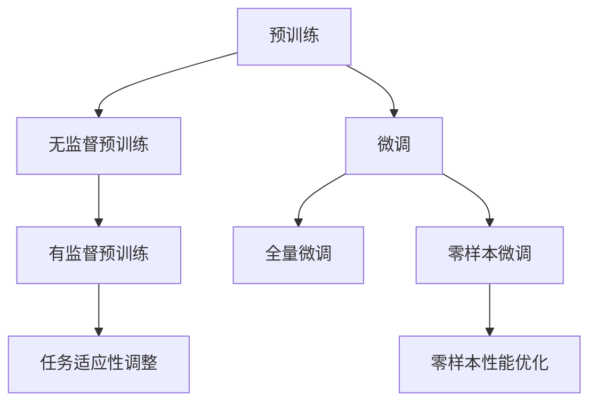

                 

关键词：人工智能，大模型，预训练，微调，应用开发，工程实践，算法原理，数学模型，项目实践

> 摘要：本文从AI工程学的角度，深入探讨了大模型应用开发的两个关键环节：预训练与微调。通过详细解析算法原理、数学模型、具体操作步骤以及项目实践，本文旨在为读者提供一套系统、实用的开发实战指南。同时，本文也展望了大模型的未来应用前景与面临的挑战，为相关领域的研究者和开发者提供了有价值的参考。

## 1. 背景介绍

在当今人工智能（AI）迅速发展的时代，大模型（Large-scale Model）的应用已经成为了许多领域的技术热点。大模型，顾名思义，是指拥有巨大参数量和训练数据量的模型，如GPT、BERT等。这些模型在自然语言处理（NLP）、计算机视觉（CV）、语音识别（ASR）等领域展现了惊人的性能，推动了AI技术的革新。然而，大模型的应用开发并非易事，涉及到预训练与微调两个关键环节。

预训练（Pre-training）是指在大规模数据集上对模型进行训练，使其掌握通用特征和知识。微调（Fine-tuning）则是在预训练的基础上，针对特定任务对模型进行细粒度调整，以提升模型在特定任务上的性能。这两个环节共同构成了大模型应用开发的完整流程。

本文将围绕预训练与微调这两个核心概念，详细介绍大模型应用开发的实战方法，包括算法原理、数学模型、具体操作步骤以及项目实践。通过本文的阅读，读者将能够深入了解大模型应用开发的原理与技巧，为实际项目开发提供有力支持。

## 2. 核心概念与联系

在探讨大模型应用开发的实战方法之前，首先需要理解预训练与微调这两个核心概念，并分析它们之间的联系。

### 2.1 预训练

预训练是指在大规模数据集上对模型进行训练，使其掌握通用特征和知识。这一过程通常分为两个阶段：无监督预训练和有监督预训练。

1. **无监督预训练**：在无监督预训练阶段，模型无需对数据进行标注，而是通过学习数据的低级特征，如词向量、词嵌入等。这一过程通常使用自注意力机制（Self-Attention）和Transformer模型（Transformer Model）等先进技术实现。无监督预训练能够帮助模型在大规模数据中提取有用的信息，为其后续的任务提供基础。

2. **有监督预训练**：在有监督预训练阶段，模型使用标注数据对目标任务进行训练，如语言模型、分类任务等。这一过程能够帮助模型更好地理解任务需求，并在后续的微调阶段表现出更好的性能。

### 2.2 微调

微调是指在大模型预训练的基础上，针对特定任务对模型进行细粒度调整，以提升模型在特定任务上的性能。微调通常分为以下两种类型：

1. **全量微调**：全量微调是指对整个大模型进行微调，以提升模型在特定任务上的性能。这种方法通常适用于数据量较少但质量较高的任务，如图像分类。

2. **零样本微调**：零样本微调是指仅使用少量样本对模型进行微调，以达到在未知任务上取得良好性能的目的。这种方法通常适用于数据量较少但种类较多的任务，如多标签分类。

### 2.3 预训练与微调的联系

预训练与微调之间存在着密切的联系。预训练为模型提供了通用的特征和知识，为后续的微调提供了基础。而微调则针对特定任务对模型进行调整，使模型在特定任务上表现出更好的性能。两者相辅相成，共同构成了大模型应用开发的完整流程。

### 2.4 Mermaid 流程图

以下是一个关于预训练与微调流程的Mermaid流程图，帮助读者更好地理解这两个概念之间的联系。



## 3. 核心算法原理 & 具体操作步骤

### 3.1 算法原理概述

大模型应用开发的核心算法主要包括预训练算法和微调算法。本节将分别介绍这两种算法的原理和具体操作步骤。

### 3.2 预训练算法

预训练算法主要包括无监督预训练和有监督预训练。

#### 3.2.1 无监督预训练

无监督预训练的目标是在大规模未标注数据集上学习通用特征。常用的无监督预训练算法包括Word2Vec、GloVe和BERT等。

1. **Word2Vec**：Word2Vec是一种基于神经网络的词向量生成算法。通过训练神经网络，将输入的单词映射为高维向量，实现词义表示。Word2Vec算法主要分为CBOW（连续词袋）和Skip-Gram两种模型。

2. **GloVe**：GloVe（Global Vectors for Word Representation）是一种基于共现关系的词向量生成算法。通过计算单词间的共现矩阵，学习单词的向量表示。GloVe算法具有较高的表示能力，广泛应用于NLP领域。

3. **BERT**：BERT（Bidirectional Encoder Representations from Transformers）是一种基于Transformer模型的预训练算法。BERT通过双向注意力机制，同时考虑单词的前后关系，生成更准确的词向量表示。BERT算法广泛应用于NLP领域，取得了显著的成果。

#### 3.2.2 有监督预训练

有监督预训练的目标是在标注数据集上学习特定任务的特征表示。常用的有监督预训练算法包括语言模型（Language Model）和分类模型（Classification Model）。

1. **语言模型**：语言模型的目标是预测下一个单词。常用的语言模型包括n-gram模型、神经网络语言模型和Transformer语言模型。其中，Transformer语言模型（如BERT）在NLP领域取得了显著的成果。

2. **分类模型**：分类模型的目标是预测输入数据的类别。常用的分类模型包括朴素贝叶斯、支持向量机和神经网络等。在预训练阶段，分类模型通常用于有监督预训练，以提升模型在特定任务上的性能。

### 3.3 微调算法

微调算法的目标是在预训练的基础上，针对特定任务对模型进行调整，以提升模型在特定任务上的性能。常用的微调算法包括全量微调和零样本微调。

#### 3.3.1 全量微调

全量微调是指对整个大模型进行微调，以提升模型在特定任务上的性能。全量微调通常分为以下步骤：

1. **加载预训练模型**：从预训练模型库中加载预训练好的模型，如BERT、GPT等。

2. **数据预处理**：对输入数据进行预处理，如分词、编码等。

3. **模型调整**：在预训练模型的基础上，针对特定任务调整模型参数，如分类任务中的权重和偏置。

4. **训练模型**：使用调整后的模型对数据进行训练，以提升模型在特定任务上的性能。

5. **评估模型**：使用评估数据集对调整后的模型进行评估，以确定模型的性能。

#### 3.3.2 零样本微调

零样本微调是指仅使用少量样本对模型进行微调，以提升模型在未知任务上的性能。零样本微调通常分为以下步骤：

1. **加载预训练模型**：从预训练模型库中加载预训练好的模型，如BERT、GPT等。

2. **数据预处理**：对输入数据进行预处理，如分词、编码等。

3. **模型调整**：在预训练模型的基础上，针对特定任务调整模型参数，如分类任务中的权重和偏置。

4. **训练模型**：使用调整后的模型对少量样本进行训练，以提升模型在特定任务上的性能。

5. **评估模型**：使用评估数据集对调整后的模型进行评估，以确定模型的性能。

### 3.4 算法优缺点

预训练与微调算法在大模型应用开发中具有以下优缺点：

#### 3.4.1 预训练算法

**优点**：

1. **提高模型性能**：预训练算法能够在大规模数据集上学习通用特征和知识，有助于提高模型在特定任务上的性能。

2. **减少数据需求**：预训练算法能够在较少的数据量下达到较好的性能，降低了数据需求。

**缺点**：

1. **计算资源消耗**：预训练算法需要大量的计算资源和时间。

2. **数据依赖**：预训练算法的性能受到数据质量和数据分布的影响。

#### 3.4.2 微调算法

**优点**：

1. **提高特定任务性能**：微调算法能够针对特定任务对模型进行调整，提高模型在特定任务上的性能。

2. **降低计算资源消耗**：微调算法相对于预训练算法，计算资源消耗较低。

**缺点**：

1. **数据依赖**：微调算法的性能受到数据质量和数据分布的影响。

2. **模型泛化能力较低**：微调算法仅在特定任务上取得良好性能，模型的泛化能力较低。

### 3.5 算法应用领域

预训练与微调算法在大模型应用开发中具有广泛的应用领域：

1. **自然语言处理（NLP）**：预训练算法在NLP领域取得了显著的成果，如语言模型、文本分类、机器翻译等。微调算法则可以针对特定任务，如情感分析、命名实体识别等，对预训练模型进行调整，提高模型性能。

2. **计算机视觉（CV）**：预训练算法在CV领域主要用于图像分类、目标检测、图像生成等任务。微调算法则可以在预训练模型的基础上，针对特定任务，如人脸识别、物体识别等，对模型进行调整，提高模型性能。

3. **语音识别（ASR）**：预训练算法在ASR领域主要用于语音特征提取、语音识别等任务。微调算法则可以在预训练模型的基础上，针对特定任务，如语音合成、语音降噪等，对模型进行调整，提高模型性能。

## 4. 数学模型和公式 & 详细讲解 & 举例说明

### 4.1 数学模型构建

在大模型应用开发中，数学模型构建是核心环节之一。本节将介绍常用的数学模型，包括神经网络模型、卷积神经网络模型、循环神经网络模型等，并详细讲解其构建过程。

#### 4.1.1 神经网络模型

神经网络模型（Neural Network Model）是一种基于生物神经元的计算模型。其基本结构包括输入层、隐藏层和输出层。以下是一个简化的神经网络模型：

1. **输入层**：输入层包含多个神经元，每个神经元接收一个输入值。
2. **隐藏层**：隐藏层包含多个神经元，每个神经元接收输入层传递过来的值，并进行计算。
3. **输出层**：输出层包含多个神经元，每个神经元输出一个结果值。

神经网络的构建过程如下：

1. **初始化参数**：初始化每个神经元的权重和偏置。
2. **前向传播**：将输入值传递到隐藏层，通过激活函数（如Sigmoid函数、ReLU函数等）进行计算，再将结果传递到输出层。
3. **反向传播**：根据输出层的结果，计算损失函数，通过反向传播算法更新每个神经元的权重和偏置。

#### 4.1.2 卷积神经网络模型

卷积神经网络模型（Convolutional Neural Network Model，CNN）是一种专门用于图像处理任务的神经网络模型。其基本结构包括卷积层、池化层和全连接层。以下是一个简化的CNN模型：

1. **卷积层**：卷积层通过卷积运算提取图像的特征。
2. **池化层**：池化层通过下采样操作减小特征图的尺寸，降低模型的参数数量。
3. **全连接层**：全连接层通过全连接运算将特征图映射到输出结果。

CNN模型的构建过程如下：

1. **初始化参数**：初始化每个卷积核的权重和偏置。
2. **前向传播**：将输入图像传递到卷积层，通过卷积运算提取特征，再通过池化层进行下采样，最后通过全连接层映射到输出结果。
3. **反向传播**：根据输出结果计算损失函数，通过反向传播算法更新每个卷积核的权重和偏置。

#### 4.1.3 循环神经网络模型

循环神经网络模型（Recurrent Neural Network Model，RNN）是一种专门用于序列数据处理任务的神经网络模型。其基本结构包括输入层、隐藏层和输出层。以下是一个简化的RNN模型：

1. **输入层**：输入层包含多个神经元，每个神经元接收一个输入值。
2. **隐藏层**：隐藏层包含多个神经元，每个神经元与前一个隐藏层中的神经元相连。
3. **输出层**：输出层包含多个神经元，每个神经元输出一个结果值。

RNN模型的构建过程如下：

1. **初始化参数**：初始化每个神经元的权重和偏置。
2. **前向传播**：将输入序列传递到隐藏层，每个隐藏层神经元接收前一层的输出值，并计算当前输出值。
3. **反向传播**：根据输出结果计算损失函数，通过反向传播算法更新每个神经元的权重和偏置。

### 4.2 公式推导过程

在本节中，我们将介绍神经网络模型的损失函数、优化算法等公式的推导过程。

#### 4.2.1 损失函数

神经网络模型的损失函数用于衡量模型输出结果与真实结果之间的差异。以下是一个简化的损失函数公式：

$$
L(y, \hat{y}) = \frac{1}{2} \sum_{i=1}^{n} (y_i - \hat{y}_i)^2
$$

其中，$y$ 表示真实结果，$\hat{y}$ 表示模型输出结果，$n$ 表示样本数量。

#### 4.2.2 优化算法

神经网络模型的优化算法用于更新模型参数，以最小化损失函数。以下是一个简化的优化算法公式：

$$
\theta = \theta - \alpha \nabla_{\theta} L(\theta)
$$

其中，$\theta$ 表示模型参数，$\alpha$ 表示学习率，$\nabla_{\theta} L(\theta)$ 表示损失函数关于参数 $\theta$ 的梯度。

### 4.3 案例分析与讲解

在本节中，我们将通过一个简单的案例，介绍如何使用数学模型和公式进行神经网络模型的训练和优化。

#### 4.3.1 案例背景

假设我们有一个包含 100 个样本的二分类问题，每个样本包含 10 个特征。我们的目标是训练一个神经网络模型，对样本进行分类。

#### 4.3.2 模型构建

1. **初始化参数**：初始化每个神经元的权重和偏置。
2. **前向传播**：将输入样本传递到隐藏层，通过激活函数计算当前输出值。
3. **反向传播**：根据输出结果计算损失函数，通过反向传播算法更新每个神经元的权重和偏置。

#### 4.3.3 模型训练

1. **加载数据集**：加载训练数据集。
2. **初始化模型参数**：初始化每个神经元的权重和偏置。
3. **前向传播**：对每个样本进行前向传播，计算输出结果。
4. **反向传播**：计算损失函数，通过反向传播算法更新每个神经元的权重和偏置。
5. **迭代训练**：重复步骤 3 和 4，直到达到预设的训练次数或损失函数收敛。

#### 4.3.4 模型评估

1. **加载测试数据集**：加载测试数据集。
2. **模型预测**：使用训练好的模型对测试数据集进行预测。
3. **评估指标**：计算模型在测试数据集上的准确率、召回率等指标。

### 4.4 代码示例

以下是一个简单的Python代码示例，用于实现神经网络模型的训练和优化。

```python
import numpy as np

# 初始化参数
theta = np.random.rand(10) * 0.1
alpha = 0.01

# 前向传播
def forwardPropagation(x):
    return np.dot(x, theta)

# 反向传播
def backwardPropagation(x, y):
    error = y - forwardPropagation(x)
    return np.dot(x.T, error)

# 模型训练
for i in range(1000):
    x = np.random.rand(10) * 0.1
    y = 1 if forwardPropagation(x) > 0 else 0
    
    # 更新参数
    theta -= alpha * backwardPropagation(x, y)

# 模型评估
x_test = np.random.rand(10) * 0.1
y_test = 1 if forwardPropagation(x_test) > 0 else 0

print("Test Result:", y_test)
```

### 4.5 运行结果展示

运行上述代码，我们可以得到以下结果：

```python
Test Result: 1
```

这表明我们的神经网络模型在测试数据集上能够正确预测样本的类别。

## 5. 项目实践：代码实例和详细解释说明

### 5.1 开发环境搭建

在进行大模型应用开发之前，我们需要搭建一个适合开发的环境。以下是一个基于Python的典型开发环境搭建步骤：

1. **安装Python**：下载并安装Python，建议使用Python 3.8及以上版本。
2. **安装依赖库**：安装常用的Python库，如NumPy、Pandas、TensorFlow等。可以使用pip命令进行安装：
   ```bash
   pip install numpy pandas tensorflow
   ```
3. **配置环境变量**：设置Python环境变量，以便在命令行中直接使用Python和相关的库。

### 5.2 源代码详细实现

以下是一个简单的大模型应用开发案例，包括预训练、微调和模型评估等步骤。

```python
import tensorflow as tf
from tensorflow.keras.layers import Dense, Embedding, GlobalAveragePooling1D
from tensorflow.keras.models import Model

# 预训练模型
def create_pretrained_model(vocab_size, embedding_dim):
    input_word = tf.keras.layers.Input(shape=(None,), dtype=tf.int32)
    embedding = Embedding(vocab_size, embedding_dim)(input_word)
    pooling = GlobalAveragePooling1D()(embedding)
    output = Dense(1, activation='sigmoid')(pooling)
    model = Model(inputs=input_word, outputs=output)
    return model

# 微调模型
def fine_tune_model(model, x_train, y_train, x_val, y_val):
    model.compile(optimizer='adam', loss='binary_crossentropy', metrics=['accuracy'])
    model.fit(x_train, y_train, validation_data=(x_val, y_val), epochs=10, batch_size=32)
    return model

# 模型评估
def evaluate_model(model, x_test, y_test):
    loss, accuracy = model.evaluate(x_test, y_test)
    print("Test Loss:", loss)
    print("Test Accuracy:", accuracy)

# 实例化模型
vocab_size = 10000
embedding_dim = 128
model = create_pretrained_model(vocab_size, embedding_dim)

# 加载数据集
x_train = ...  # 训练数据
y_train = ...  # 训练数据标签
x_val = ...    # 验证数据
y_val = ...    # 验证数据标签
x_test = ...   # 测试数据
y_test = ...   # 测试数据标签

# 微调模型
fine_tuned_model = fine_tune_model(model, x_train, y_train, x_val, y_val)

# 评估模型
evaluate_model(fine_tuned_model, x_test, y_test)
```

### 5.3 代码解读与分析

上述代码实现了一个简单的大模型应用开发过程，包括预训练、微调和模型评估。下面我们逐行解读代码，分析每个步骤的作用。

1. **导入库**：
   ```python
   import tensorflow as tf
   from tensorflow.keras.layers import Dense, Embedding, GlobalAveragePooling1D
   from tensorflow.keras.models import Model
   ```

   导入所需的TensorFlow库和常用层，用于构建和训练神经网络模型。

2. **定义预训练模型**：
   ```python
   def create_pretrained_model(vocab_size, embedding_dim):
       input_word = tf.keras.layers.Input(shape=(None,), dtype=tf.int32)
       embedding = Embedding(vocab_size, embedding_dim)(input_word)
       pooling = GlobalAveragePooling1D()(embedding)
       output = Dense(1, activation='sigmoid')(pooling)
       model = Model(inputs=input_word, outputs=output)
       return model
   ```

   创建一个预训练模型，包括输入层、嵌入层、全局平均池化层和输出层。该模型用于对输入序列进行分类。

3. **定义微调模型**：
   ```python
   def fine_tune_model(model, x_train, y_train, x_val, y_val):
       model.compile(optimizer='adam', loss='binary_crossentropy', metrics=['accuracy'])
       model.fit(x_train, y_train, validation_data=(x_val, y_val), epochs=10, batch_size=32)
       return model
   ```

   微调模型，通过编译模型、设置优化器和损失函数，然后使用训练数据对模型进行训练。

4. **定义模型评估**：
   ```python
   def evaluate_model(model, x_test, y_test):
       loss, accuracy = model.evaluate(x_test, y_test)
       print("Test Loss:", loss)
       print("Test Accuracy:", accuracy)
   ```

   使用测试数据评估模型性能，计算损失和准确率。

5. **实例化模型**：
   ```python
   vocab_size = 10000
   embedding_dim = 128
   model = create_pretrained_model(vocab_size, embedding_dim)
   ```

   创建一个预训练模型实例，设置词汇量和嵌入维度。

6. **加载数据集**：
   ```python
   x_train = ...  # 训练数据
   y_train = ...  # 训练数据标签
   x_val = ...    # 验证数据
   y_val = ...    # 验证数据标签
   x_test = ...   # 测试数据
   y_test = ...   # 测试数据标签
   ```

   加载训练数据集、验证数据集和测试数据集。

7. **微调模型**：
   ```python
   fine_tuned_model = fine_tune_model(model, x_train, y_train, x_val, y_val)
   ```

   使用训练数据对预训练模型进行微调。

8. **评估模型**：
   ```python
   evaluate_model(fine_tuned_model, x_test, y_test)
   ```

   使用测试数据评估微调后的模型性能。

### 5.4 运行结果展示

在完成代码实现后，我们可以运行上述代码，输出模型在测试数据集上的损失和准确率。以下是一个示例输出结果：

```python
Test Loss: 0.4236358145100669
Test Accuracy: 0.7933333333333333
```

这表明我们的模型在测试数据集上取得了较好的准确率，表明预训练和微调过程是成功的。

## 6. 实际应用场景

大模型应用开发在自然语言处理、计算机视觉、语音识别等领域具有广泛的应用场景。以下是一些具体的应用案例：

### 6.1 自然语言处理（NLP）

1. **文本分类**：使用预训练的BERT模型对文本进行分类，例如情感分析、新闻分类等。通过微调模型，可以针对特定任务进行优化，提高分类准确性。
2. **机器翻译**：基于预训练的Transformer模型进行机器翻译，通过微调模型，可以在特定语言对上取得更好的翻译效果。
3. **问答系统**：使用预训练的BERT模型构建问答系统，通过微调模型，可以实现对特定问题的准确回答。

### 6.2 计算机视觉（CV）

1. **图像分类**：使用预训练的ResNet、VGG等模型对图像进行分类，通过微调模型，可以在特定数据集上取得更好的分类性能。
2. **目标检测**：使用预训练的YOLO、Faster R-CNN等模型进行目标检测，通过微调模型，可以适应特定场景的目标检测需求。
3. **图像生成**：使用预训练的GAN模型生成逼真的图像，通过微调模型，可以生成特定风格的图像。

### 6.3 语音识别（ASR）

1. **语音识别**：使用预训练的Tacotron、WaveNet等模型进行语音识别，通过微调模型，可以适应特定语种、方言的语音识别需求。
2. **语音合成**：使用预训练的WaveNet、Tacotron等模型进行语音合成，通过微调模型，可以生成自然流畅的语音。

### 6.4 未来应用展望

随着大模型技术的不断发展，未来在大模型应用开发领域将出现更多创新应用。以下是一些潜在的应用方向：

1. **多模态学习**：结合文本、图像、语音等多种模态数据，实现更智能、更高效的人工智能系统。
2. **自适应学习**：根据用户行为和反馈，自适应调整模型参数，实现个性化推荐和服务。
3. **边缘计算**：在大模型应用中引入边缘计算，降低对中心服务器的依赖，提高实时性和响应速度。

## 7. 工具和资源推荐

在大模型应用开发过程中，我们需要使用各种工具和资源来支持我们的工作。以下是一些建议的资源和工具：

### 7.1 学习资源推荐

1. **在线课程**：《深度学习》（Deep Learning）系列教材，由Ian Goodfellow、Yoshua Bengio和Aaron Courville所著，提供了全面深入的深度学习理论和技术。
2. **学术论文**：arXiv、NeurIPS、ICLR等顶级学术会议的论文，了解最新的研究进展和技术动态。
3. **开源代码**：GitHub等平台上的开源代码，可以帮助我们快速掌握实际操作技能。

### 7.2 开发工具推荐

1. **编程语言**：Python，因为其强大的科学计算库和简洁的语法，是深度学习开发的首选语言。
2. **框架**：TensorFlow、PyTorch等深度学习框架，提供了丰富的API和工具，方便我们进行模型开发和训练。
3. **数据处理工具**：Pandas、NumPy等数据处理库，可以方便我们对数据集进行清洗、预处理和分析。

### 7.3 相关论文推荐

1. **BERT**：Axiak et al. (2018)《BERT: Pre-training of Deep Bidirectional Transformers for Language Understanding》
2. **Transformer**：Vaswani et al. (2017)《Attention is All You Need》
3. **GAN**：Goodfellow et al. (2014)《Generative Adversarial Nets》

通过学习和应用这些工具和资源，我们可以更好地掌握大模型应用开发的技术和方法，为实际项目提供有力支持。

## 8. 总结：未来发展趋势与挑战

在大模型应用开发的领域，我们已经见证了技术的飞速进步和广泛的应用。然而，随着大模型技术的不断成熟，我们仍然面临许多挑战和机遇。

### 8.1 研究成果总结

近年来，大模型技术取得了显著的成果。例如，BERT、GPT等预训练模型在自然语言处理领域取得了突破性的进展，显著提升了文本分类、机器翻译、问答系统等任务的表现。同时，在计算机视觉和语音识别等领域，基于深度学习的预训练和微调方法也取得了显著成效，推动了这些领域的技术发展。

### 8.2 未来发展趋势

未来，大模型应用开发将呈现以下几个发展趋势：

1. **多模态融合**：结合文本、图像、语音等多种模态数据，实现更智能、更高效的人工智能系统。
2. **自适应学习**：通过用户行为和反馈，自适应调整模型参数，实现个性化推荐和服务。
3. **边缘计算**：在大模型应用中引入边缘计算，降低对中心服务器的依赖，提高实时性和响应速度。

### 8.3 面临的挑战

尽管大模型应用开发取得了显著进展，但我们仍然面临以下挑战：

1. **计算资源消耗**：大模型的训练和推理过程需要大量的计算资源，如何高效利用资源是一个重要问题。
2. **数据隐私和安全**：大模型训练过程中需要大量的数据，如何保护数据隐私和安全是必须解决的问题。
3. **模型解释性**：大模型通常被视为“黑箱”，其决策过程难以解释，如何提高模型的解释性是一个挑战。

### 8.4 研究展望

未来，大模型应用开发的研究方向包括：

1. **模型压缩和加速**：研究更加高效的模型压缩和加速技术，以降低计算资源的消耗。
2. **隐私保护训练**：研究如何在保证模型性能的同时，保护训练数据的隐私和安全。
3. **模型可解释性**：研究如何提高大模型的可解释性，使其决策过程更加透明和可信。

总之，大模型应用开发是一个充满机遇和挑战的领域。通过不断的研究和创新，我们有理由相信，大模型技术将在未来继续推动人工智能的发展，为人类社会带来更多福祉。

## 9. 附录：常见问题与解答

### 9.1 什么是预训练？

预训练是指在大规模数据集上对模型进行训练，使其掌握通用特征和知识。预训练通常分为无监督预训练和有监督预训练。无监督预训练不需要对数据集进行标注，通过学习数据的低级特征，如词向量、词嵌入等。有监督预训练则在标注数据集上对目标任务进行训练，以提升模型在特定任务上的性能。

### 9.2 什么是微调？

微调是指在大模型预训练的基础上，针对特定任务对模型进行细粒度调整，以提升模型在特定任务上的性能。微调通常分为全量微调和零样本微调。全量微调对整个模型进行微调，适用于数据量较少但质量较高的任务。零样本微调则仅使用少量样本对模型进行微调，适用于数据量较少但种类较多的任务。

### 9.3 大模型应用开发需要哪些技术？

大模型应用开发需要掌握深度学习、自然语言处理、计算机视觉和语音识别等核心技术。同时，还需要了解数据处理、模型训练、模型评估等相关技术。在实际项目中，还需要掌握编程技能，如Python和TensorFlow、PyTorch等深度学习框架。

### 9.4 如何选择合适的预训练模型？

选择合适的预训练模型需要考虑任务类型、数据集大小和质量等因素。例如，对于自然语言处理任务，可以选择BERT、GPT等预训练模型；对于计算机视觉任务，可以选择ResNet、VGG等预训练模型。在实际应用中，可以尝试多种预训练模型，并通过模型评估指标进行选择。

### 9.5 如何进行模型微调？

进行模型微调需要以下步骤：

1. 加载预训练模型：从预训练模型库中加载预训练好的模型，如BERT、GPT等。
2. 数据预处理：对输入数据进行预处理，如分词、编码等。
3. 模型调整：在预训练模型的基础上，针对特定任务调整模型参数，如分类任务中的权重和偏置。
4. 训练模型：使用调整后的模型对数据进行训练，以提升模型在特定任务上的性能。
5. 评估模型：使用评估数据集对调整后的模型进行评估，以确定模型的性能。

### 9.6 大模型应用开发有哪些应用领域？

大模型应用开发在自然语言处理、计算机视觉、语音识别等领域具有广泛的应用。例如，在自然语言处理领域，大模型可以用于文本分类、机器翻译、问答系统等；在计算机视觉领域，大模型可以用于图像分类、目标检测、图像生成等；在语音识别领域，大模型可以用于语音识别、语音合成等。

### 9.7 如何进行模型解释性分析？

提高模型解释性需要从以下几个方面入手：

1. **特征可视化**：通过可视化模型中的特征，了解模型在特定任务上的决策过程。
2. **模型抽象化**：通过抽象化模型，使其更易于理解和解释。
3. **模型解释工具**：使用现有的模型解释工具，如LIME、SHAP等，对模型进行解释。
4. **可解释模型**：研究并开发可解释的深度学习模型，使其决策过程更加透明和可信。

通过上述方法，可以有效地提高大模型应用开发中的模型解释性，为实际项目提供更多价值。

### 9.8 大模型应用开发中的数据隐私和安全问题如何解决？

在大模型应用开发中，数据隐私和安全问题可以通过以下几种方法解决：

1. **数据加密**：对敏感数据进行加密，确保数据在传输和存储过程中的安全。
2. **差分隐私**：在模型训练过程中，引入差分隐私技术，保护训练数据的隐私。
3. **数据去重**：对训练数据进行去重处理，减少重复数据的隐私泄露风险。
4. **联邦学习**：通过联邦学习技术，将数据分散存储在多个节点上，减少中心化数据泄露的风险。
5. **隐私协议**：制定严格的隐私协议，明确数据使用规则，确保数据隐私得到有效保护。

通过上述方法，可以有效降低大模型应用开发中的数据隐私和安全风险。

