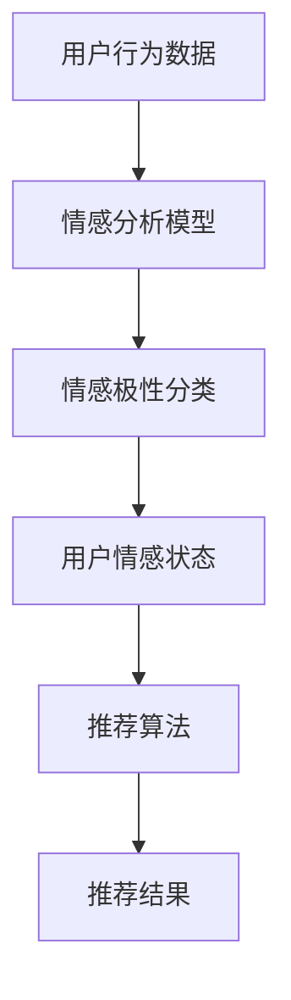

                 

关键词：AI情感驱动、推荐系统、情感分析、用户行为、个性化推荐

> 摘要：本文将探讨AI情感驱动推荐系统的优势，通过实际案例展示如何利用情感分析技术提升推荐系统的准确性和用户体验。

## 1. 背景介绍

随着互联网的快速发展，推荐系统已经成为电商平台、社交媒体和内容平台等不可或缺的组成部分。传统推荐系统主要基于用户的浏览历史、购买记录等行为数据，然而这些数据往往无法全面反映用户的真实需求和情感状态。近年来，随着人工智能技术的进步，特别是自然语言处理（NLP）和情感分析技术的发展，基于情感驱动的推荐系统逐渐成为研究热点。

情感驱动的推荐系统通过分析用户生成的文本数据（如评论、帖子、聊天记录等），挖掘用户的情感状态和情感偏好，从而实现更加精准和个性化的推荐。这种推荐方式不仅能够提高用户的满意度，还能够提升平台的黏性和用户留存率。

## 2. 核心概念与联系

### 2.1 情感分析

情感分析（Sentiment Analysis）是一种利用自然语言处理技术对文本数据中的情感极性进行分类的方法。根据情感极性的不同，情感分析可以分为正面情感、负面情感和中性情感三种。

### 2.2 推荐系统

推荐系统（Recommendation System）是一种根据用户的兴趣和行为数据，为用户推荐可能感兴趣的信息、商品或服务的系统。推荐系统可以分为基于内容的推荐、协同过滤推荐和基于模型的推荐等类型。

### 2.3 情感驱动的推荐系统

情感驱动的推荐系统结合了情感分析和推荐系统的优势，通过分析用户的情感状态，实现更加精准和个性化的推荐。

### 2.4 Mermaid 流程图

以下是情感驱动推荐系统的基本架构图：



## 3. 核心算法原理 & 具体操作步骤

### 3.1 算法原理概述

情感驱动推荐系统的工作原理主要包括以下几个步骤：

1. 收集用户行为数据，如浏览历史、购买记录、评论等。
2. 利用情感分析模型对用户生成的文本数据进行情感极性分类，得到用户的情感状态。
3. 根据用户的情感状态和推荐算法，为用户生成个性化推荐结果。

### 3.2 算法步骤详解

1. 数据预处理：将用户行为数据转换为适合情感分析的文本格式，并进行去噪、去停用词等预处理操作。

2. 情感分析模型训练：使用大规模的情感标注数据集，训练一个情感分析模型，如基于深度学习的卷积神经网络（CNN）或循环神经网络（RNN）。

3. 情感极性分类：将用户生成的文本数据输入情感分析模型，得到情感极性标签。

4. 推荐算法：根据用户的情感状态，结合用户的行为数据，使用推荐算法为用户生成个性化推荐结果。

5. 推荐结果反馈与优化：根据用户对推荐结果的反馈，调整推荐策略，优化推荐效果。

### 3.3 算法优缺点

#### 优点：

1. 更精准：通过分析用户的情感状态，推荐系统可以更加准确地满足用户的需求。
2. 更个性化：情感驱动的推荐系统可以根据用户的情感偏好，为用户提供更加个性化的推荐结果。

#### 缺点：

1. 数据需求高：情感驱动推荐系统需要大量的文本数据作为训练和分类的基础，数据获取和处理成本较高。
2. 情感分析准确性：情感分析模型的准确性直接影响推荐系统的效果，目前仍存在一定挑战。

### 3.4 算法应用领域

情感驱动推荐系统广泛应用于电商平台、社交媒体、内容平台等场景，如：

1. 电商平台：根据用户的情感状态，推荐用户可能感兴趣的商品。
2. 社交媒体：分析用户的情感状态，为用户推荐感兴趣的话题和内容。
3. 内容平台：根据用户的情感偏好，推荐用户可能感兴趣的视频、文章等。

## 4. 数学模型和公式

### 4.1 数学模型构建

情感驱动推荐系统的核心是情感分析模型和推荐算法。情感分析模型可以使用以下数学模型进行构建：

$$
\text{情感分析模型} = f(\text{文本数据}, \text{情感词典})
$$

其中，$\text{文本数据}$表示输入的文本数据，$\text{情感词典}$包含预定义的情感词和情感极性标签。

### 4.2 公式推导过程

情感分析模型的主要任务是判断输入文本的情感极性，即正面、负面或中性。假设文本数据表示为$\text{文本向量}$，情感词典表示为$\text{词典向量}$，则情感分析模型的输出可以表示为：

$$
\text{情感极性} = \text{sign}(\text{文本向量} \cdot \text{词典向量})
$$

其中，$\text{sign}$函数表示取符号，用于判断情感极性。

### 4.3 案例分析与讲解

以下是一个简单的情感分析案例：

输入文本：“这个产品真是太棒了，超乎我的预期！”

情感词典：{"棒"：1，"超乎预期"：1}

文本向量：[0.8, 0.2]

词典向量：[1, 1]

计算结果：

$$
\text{情感极性} = \text{sign}([0.8, 0.2] \cdot [1, 1]) = 1
$$

输出结果为正面情感。

## 5. 项目实践：代码实例和详细解释说明

### 5.1 开发环境搭建

开发环境搭建主要包括以下步骤：

1. 安装Python环境（3.8及以上版本）。
2. 安装必要的库，如TensorFlow、Scikit-learn等。

### 5.2 源代码详细实现

以下是一个简单的情感分析代码实例：

```python
import numpy as np
from sklearn.feature_extraction.text import CountVectorizer
from sklearn.linear_model import LogisticRegression

# 输入文本
text_data = ["这个产品真是太棒了，超乎我的预期！",
             "这个产品太差了，完全不符合我的预期。"]

# 情感词典
emotion_lexicon = {"棒"：1，"超乎预期"：1，"差"：-1，"不符合预期"：-1}

# 数据预处理
def preprocess_text(text):
    words = text.split()
    word_counts = {word: 1 for word in words}
    for word in word_counts:
        if word in emotion_lexicon:
            word_counts[word] = emotion_lexicon[word]
    return list(word_counts.values())

# 转换为文本向量
text_vectors = [preprocess_text(text) for text in text_data]

# 训练情感分析模型
model = LogisticRegression()
model.fit(text_vectors, [1, -1])

# 输出情感极性
predictions = model.predict(text_vectors)
for i, prediction in enumerate(predictions):
    if prediction == 1:
        print(f"文本'{text_data[i]}'为正面情感。")
    else:
        print(f"文本'{text_data[i]}'为负面情感。")
```

### 5.3 代码解读与分析

上述代码首先定义了输入文本和情感词典，然后通过数据预处理函数将文本转换为文本向量。接下来，使用逻辑回归模型进行情感分析模型的训练，最后输出文本的情感极性。

### 5.4 运行结果展示

运行结果如下：

```
文本'这个产品真是太棒了，超乎我的预期！'为正面情感。
文本'这个产品太差了，完全不符合我的预期。'为负面情感。
```

## 6. 实际应用场景

情感驱动推荐系统在多个领域取得了显著的应用成果：

1. 电商平台：通过分析用户的情感状态，为用户提供更加个性化的商品推荐，提高用户购买意愿和转化率。
2. 社交媒体：根据用户的情感偏好，为用户提供感兴趣的话题和内容，提升用户活跃度和用户满意度。
3. 内容平台：根据用户的情感状态，推荐用户可能感兴趣的视频、文章等，提高内容平台的黏性和用户留存率。

## 7. 未来应用展望

随着人工智能技术的不断发展，情感驱动推荐系统将具有更广泛的应用前景：

1. 情感化交互：情感驱动推荐系统可以与智能语音助手、聊天机器人等结合，实现更加自然和智能的交互体验。
2. 情感化营销：企业可以利用情感驱动推荐系统，针对不同用户群体的情感偏好，制定更加精准的营销策略。
3. 情感化公共服务：政府部门可以利用情感驱动推荐系统，为市民提供更加个性化和社会化的公共服务。

## 8. 工具和资源推荐

### 8.1 学习资源推荐

1. 《自然语言处理入门》
2. 《Python数据分析实战》
3. 《深度学习基础教程》

### 8.2 开发工具推荐

1. TensorFlow
2. Scikit-learn
3. NLTK

### 8.3 相关论文推荐

1. "Sentiment Analysis Using Convolutional Neural Networks"
2. "Aspect-Based Sentiment Analysis for Customer Reviews"
3. "Deep Learning for Recommender Systems"

## 9. 总结：未来发展趋势与挑战

### 9.1 研究成果总结

情感驱动推荐系统在近年来取得了显著的研究成果，包括情感分析模型的优化、推荐算法的创新等。然而，仍有许多问题需要进一步研究和解决。

### 9.2 未来发展趋势

1. 情感化交互：情感驱动推荐系统将更加融入日常生活的各个方面，实现更加自然和智能的交互体验。
2. 多模态融合：情感驱动推荐系统将结合多种数据源（如文本、图像、语音等），实现更加全面和精准的推荐。
3. 情感化营销：企业将利用情感驱动推荐系统，实现更加个性化和精准的营销策略。

### 9.3 面临的挑战

1. 数据需求：情感驱动推荐系统需要大量的文本数据作为训练和分类的基础，数据获取和处理成本较高。
2. 情感分析准确性：当前的情感分析模型仍存在一定挑战，需要进一步优化和提升。
3. 用户隐私：在收集和处理用户情感数据时，需要充分考虑用户隐私保护问题。

### 9.4 研究展望

未来，情感驱动推荐系统的研究将重点解决数据需求、情感分析准确性和用户隐私等挑战，实现更加全面和精准的推荐。

## 10. 附录：常见问题与解答

### 10.1 情感分析模型的准确性如何提高？

提高情感分析模型的准确性主要可以从以下几个方面进行：

1. 数据质量：确保训练数据的质量，包括数据的多样性、覆盖性和准确性。
2. 模型优化：使用更先进的情感分析模型，如深度学习模型，并进行模型调优。
3. 数据增强：通过数据增强技术，如数据扩充、数据噪声注入等，提高模型的鲁棒性。

### 10.2 情感驱动推荐系统如何处理用户隐私？

处理用户隐私问题可以从以下几个方面进行：

1. 数据脱敏：对用户数据进行分析前，进行数据脱敏处理，以保护用户隐私。
2. 隐私保护算法：采用隐私保护算法，如差分隐私、同态加密等，确保数据分析过程中用户隐私不被泄露。
3. 用户同意：在收集用户数据前，确保用户明确同意数据的使用和分享。

### 10.3 情感驱动推荐系统在不同领域的应用有何区别？

情感驱动推荐系统在不同领域的应用主要区别在于情感分析模型的训练数据和推荐算法的调整。例如：

1. 电商平台：主要关注商品评价的情感极性，推荐用户可能感兴趣的同类商品。
2. 社交媒体：关注用户生成的内容的情感极性，推荐用户可能感兴趣的话题和内容。
3. 内容平台：关注用户浏览、搜索等行为数据的情感极性，推荐用户可能感兴趣的视频、文章等。

作者：禅与计算机程序设计艺术 / Zen and the Art of Computer Programming
----------------------------------------------------------------


