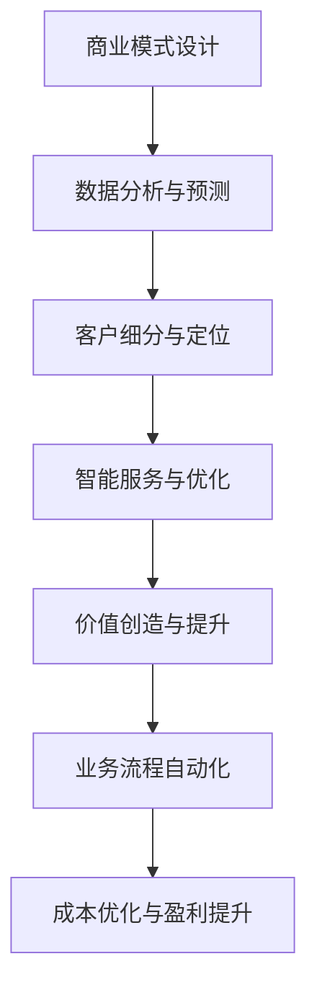

                 

关键词：人工智能、商业模式、创新、数字化转型、企业战略、市场机会、技术趋势。

> 摘要：本文探讨了人工智能技术如何与商业模式相结合，推动企业的数字化转型和创新。通过分析AI技术的核心原理和应用场景，本文提出了AI在商业模式设计、运营优化和客户服务等方面的具体应用策略，并对未来AI技术与商业模式融合的发展趋势进行了展望。

## 1. 背景介绍

在21世纪，人工智能（AI）已经成为全球科技发展的核心驱动力。从早期的机器学习、深度学习，到如今的自然语言处理、计算机视觉等前沿技术，AI在各个行业都展现出了巨大的潜力。与此同时，商业模式的创新也成为企业持续发展的重要战略。传统的商业模式正面临着前所未有的挑战和机遇，特别是在互联网、大数据和云计算等新兴技术的推动下，商业环境发生了深刻变化。

这种背景下，AI技术的引入不仅改变了企业的运营方式，还推动了商业模式的创新和变革。企业开始利用AI技术优化业务流程、提升客户体验、创造新的业务模式，从而在激烈的市场竞争中脱颖而出。本文将深入探讨AI技术与商业模式的结合，分析其原理、应用和实践，并展望未来发展的趋势。

## 2. 核心概念与联系

### 2.1 AI技术原理

人工智能技术主要包括机器学习、深度学习、自然语言处理和计算机视觉等。这些技术的基本原理是通过对大量数据的学习和处理，使计算机具备模拟人类智能的能力。

- **机器学习**：通过算法从数据中学习规律和模式，用于预测和决策。
- **深度学习**：一种特殊的机器学习技术，通过多层神经网络模型对数据进行处理。
- **自然语言处理**：使计算机理解和生成人类语言，包括语音识别、机器翻译等。
- **计算机视觉**：使计算机理解和解释视觉信息，如图像识别、目标检测等。

### 2.2 商业模式定义

商业模式是指企业通过提供产品或服务，创造、传递和捕获价值的系统。它包括价值主张、客户细分、渠道、客户关系、收入来源和成本结构等关键要素。

### 2.3 AI与商业模式的联系

AI技术可以与商业模式的不同要素相结合，实现以下几个方面的创新：

- **价值主张**：通过个性化推荐、智能客服等，提高产品或服务的价值和客户满意度。
- **客户细分**：利用数据分析和预测模型，精准定位客户需求，实现精细化管理。
- **渠道**：通过电商平台、社交媒体等数字化渠道，扩大市场覆盖范围。
- **客户关系**：通过个性化服务和智能反馈，提升客户忠诚度和粘性。
- **收入来源**：通过智能定价、广告优化等，提高收入效率和盈利能力。
- **成本结构**：通过自动化和优化，降低运营成本，提高企业竞争力。

### 2.4 Mermaid流程图



## 3. 核心算法原理 & 具体操作步骤

### 3.1 算法原理概述

AI技术的核心在于算法。常用的算法包括：

- **机器学习算法**：如线性回归、决策树、随机森林、支持向量机等。
- **深度学习算法**：如卷积神经网络（CNN）、循环神经网络（RNN）、生成对抗网络（GAN）等。

这些算法通过对数据进行训练和测试，可以实现对未知数据的预测和分类。

### 3.2 算法步骤详解

1. **数据收集**：收集相关的数据，包括客户信息、产品数据、市场数据等。
2. **数据预处理**：对数据进行清洗、归一化和特征提取，使其适合算法处理。
3. **模型选择**：根据问题的性质选择合适的算法模型。
4. **模型训练**：使用训练数据对模型进行训练，调整模型参数。
5. **模型评估**：使用测试数据评估模型的性能，调整模型参数。
6. **模型部署**：将训练好的模型部署到生产环境中，进行实际应用。

### 3.3 算法优缺点

- **优点**：高效、精准、自适应性强。
- **缺点**：需要大量高质量的数据、计算资源需求高、易过拟合。

### 3.4 算法应用领域

AI技术在商业领域的应用非常广泛，包括：

- **客户关系管理**：通过数据分析预测客户行为，提供个性化服务。
- **供应链管理**：通过预测和优化，提高供应链的效率和灵活性。
- **市场营销**：通过数据分析和广告优化，提高营销效果。
- **风险管理**：通过预测和监控，降低风险。
- **智能客服**：通过自然语言处理，提供高效的客户服务。

## 4. 数学模型和公式 & 详细讲解 & 举例说明

### 4.1 数学模型构建

AI技术的核心在于数学模型。常用的数学模型包括：

- **线性回归模型**：$y = w_0 + w_1 \cdot x$
- **逻辑回归模型**：$P(y=1) = \frac{1}{1 + e^{-(w_0 + w_1 \cdot x)} }$
- **卷积神经网络模型**：$h_l = \sigma ( W_l \cdot a_{l-1} + b_l )$

### 4.2 公式推导过程

以线性回归模型为例，其推导过程如下：

1. **损失函数**：$J(w_0, w_1) = \frac{1}{2} \sum_{i=1}^{m} (y_i - (w_0 + w_1 \cdot x_i))^2$
2. **梯度下降**：$\frac{\partial J}{\partial w_0} = \sum_{i=1}^{m} (y_i - (w_0 + w_1 \cdot x_i)) \cdot (-x_i)$
   $\frac{\partial J}{\partial w_1} = \sum_{i=1}^{m} (y_i - (w_0 + w_1 \cdot x_i)) \cdot (-1)$
3. **更新参数**：$w_0 = w_0 - \alpha \cdot \frac{\partial J}{\partial w_0}$
   $w_1 = w_1 - \alpha \cdot \frac{\partial J}{\partial w_1}$

### 4.3 案例分析与讲解

假设我们有一个关于房价预测的线性回归模型。输入特征包括房屋面积（$x$）和房屋层数（$x$），目标变量是房价（$y$）。

- **数据收集**：收集1000个房屋数据。
- **数据预处理**：对数据进行归一化处理。
- **模型选择**：选择线性回归模型。
- **模型训练**：使用训练数据进行模型训练。
- **模型评估**：使用测试数据评估模型性能。
- **模型部署**：将模型部署到生产环境，进行房价预测。

## 5. 项目实践：代码实例和详细解释说明

### 5.1 开发环境搭建

- **编程语言**：Python
- **开发工具**：PyCharm
- **依赖库**：NumPy、Pandas、Scikit-learn、Matplotlib

### 5.2 源代码详细实现

```python
import numpy as np
import pandas as pd
from sklearn.linear_model import LinearRegression
from sklearn.model_selection import train_test_split
import matplotlib.pyplot as plt

# 数据收集
data = pd.read_csv('house_data.csv')
X = data[['area', 'floor']]
y = data['price']

# 数据预处理
X = (X - X.mean()) / X.std()
y = (y - y.mean()) / y.std()

# 模型选择
model = LinearRegression()

# 模型训练
X_train, X_test, y_train, y_test = train_test_split(X, y, test_size=0.2, random_state=42)
model.fit(X_train, y_train)

# 模型评估
score = model.score(X_test, y_test)
print(f'Model Score: {score}')

# 模型部署
def predict_price(area, floor):
    X_new = np.array([[area, floor]])
    X_new = (X_new - X.mean()) / X.std()
    return (model.predict(X_new)[0] * y.std()) + y.mean()

# 测试
area = 100
floor = 3
price = predict_price(area, floor)
print(f'Predicted Price: {price}')
```

### 5.3 代码解读与分析

该代码实现了一个简单的房价预测模型。首先，从CSV文件中读取房屋数据，然后对数据进行归一化处理。接着，选择线性回归模型，使用训练数据进行模型训练，并使用测试数据进行模型评估。最后，定义了一个函数`predict_price`，用于进行房价预测。

## 6. 实际应用场景

### 6.1 客户关系管理

AI技术可以用于客户关系管理，帮助企业更好地了解客户需求，提供个性化的服务。例如，通过分析客户的购买行为和偏好，企业可以精准推荐产品，提升客户满意度。

### 6.2 市场营销

AI技术可以帮助企业进行精准营销，通过分析潜在客户的行为和需求，制定有针对性的营销策略。例如，通过自然语言处理技术，企业可以自动分析社交媒体上的用户评论，了解用户对产品的反馈，从而优化产品和服务。

### 6.3 供应链管理

AI技术可以用于供应链管理，优化库存管理和物流配送。例如，通过预测算法，企业可以提前预测需求变化，调整库存策略，减少库存成本。

### 6.4 未来应用展望

随着AI技术的不断发展，未来其在商业模式中的应用将会更加广泛和深入。例如，通过智能合约和区块链技术，企业可以实现更高效、更安全的交易和协作。此外，AI技术还可以帮助企业在竞争激烈的市场中实现创新，创造新的商业模式。

## 7. 工具和资源推荐

### 7.1 学习资源推荐

- 《深度学习》（Goodfellow、Bengio、Courville 著）
- 《机器学习》（周志华 著）
- 《自然语言处理综论》（Jurafsky、Martin 著）

### 7.2 开发工具推荐

- PyCharm
- Jupyter Notebook
- Google Colab

### 7.3 相关论文推荐

- "Deep Learning for Customer Relationship Management"
- "AI-powered Marketing: Strategies for the Age of Artificial Intelligence"
- "AI in Supply Chain Management: A Survey"

## 8. 总结：未来发展趋势与挑战

### 8.1 研究成果总结

AI技术与商业模式的结合已经取得了显著的成果。通过个性化推荐、精准营销、智能客服等，企业实现了业务流程的优化和客户体验的提升。

### 8.2 未来发展趋势

随着AI技术的不断发展，未来其在商业模式中的应用将会更加广泛和深入。例如，AI将推动企业的数字化转型，实现业务的智能化和自动化。

### 8.3 面临的挑战

尽管AI技术在商业模式中展现了巨大的潜力，但也面临着一些挑战。例如，数据隐私和安全、算法偏见、技术人才短缺等问题。

### 8.4 研究展望

未来，AI技术将在商业模式中发挥更重要的作用。通过不断创新和优化，企业将能够更好地应对市场变化，实现持续发展。

## 9. 附录：常见问题与解答

### 9.1 AI技术与商业模式的结合有哪些具体应用场景？

AI技术与商业模式的结合应用场景包括客户关系管理、市场营销、供应链管理、智能客服等。

### 9.2 如何确保AI技术在商业模式中的数据安全和隐私？

确保AI技术在商业模式中的数据安全和隐私需要采取以下措施：

- 采用加密技术保护数据传输和存储。
- 建立严格的数据使用规范，确保数据使用的合法性和透明度。
- 定期进行数据安全审计和风险评估。

---

作者：禅与计算机程序设计艺术 / Zen and the Art of Computer Programming
----------------------------------------------------------------

这篇文章详细探讨了人工智能技术与商业模式结合的原理、应用和实践，并展望了未来的发展趋势。通过本文的阅读，读者可以更好地理解AI技术如何助力企业的数字化转型和创新，为企业在激烈的市场竞争中提供新的机遇和策略。在未来，AI技术与商业模式的结合将会更加紧密，为企业的持续发展带来新的动力。

