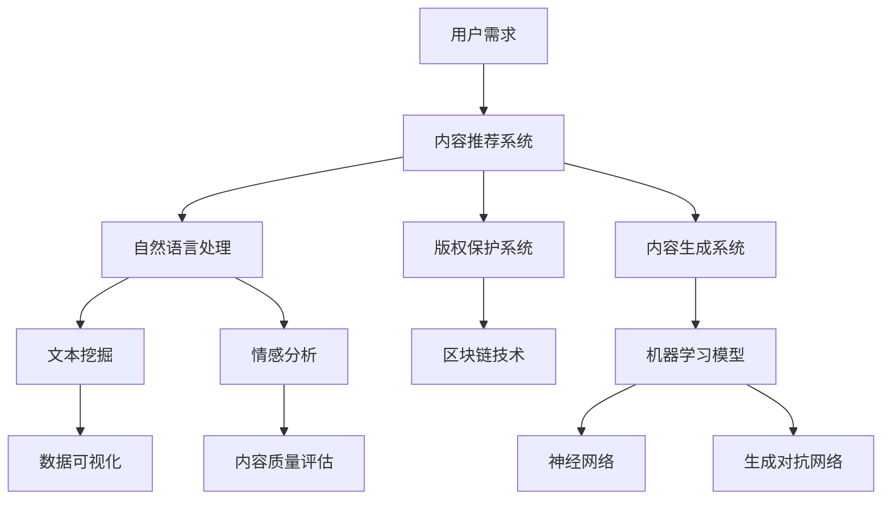

                 

关键词：人工智能，出版业，数字化，自动化，内容推荐，算法优化，版权保护，伦理问题，未来展望

## 摘要

本文探讨了人工智能技术在出版业中的应用及其带来的革新与挑战。首先，我们回顾了出版业的历史和现状，接着深入分析了AI技术在数字化、自动化内容生成、版权保护、内容推荐等方面的应用。随后，我们讨论了AI技术在出版业中面临的伦理问题和挑战，以及未来发展展望。最后，我们对相关工具和资源进行了推荐，并对未来的发展趋势和挑战进行了总结。

## 1. 背景介绍

出版业历史悠久，起源于古埃及的纸莎草和古中国的竹简。随着时间的推移，书籍的传播方式从口口相传到印刷术的发明，再到现代的电子出版，出版业经历了多次变革。近年来，随着互联网和数字技术的飞速发展，出版业也迎来了新一轮的变革，数字化、自动化成为出版业发展的主流方向。

### 1.1 数字化

数字化是出版业发展的重要趋势，它使得书籍的生产、传播和消费更加便捷。数字化出版不仅能够提高出版效率，降低成本，还能够实现24小时全天候的阅读服务。根据美国出版商协会（Association of American Publishers）的数据，2019年数字出版收入已经占到了总出版收入的24%，预计这一比例将继续增长。

### 1.2 自动化

自动化技术在出版业的应用也越来越广泛。从书籍的排版、校对到封面设计、印刷，自动化技术都能够大幅度提高工作效率，减少人力成本。例如，AI技术可以自动识别文本中的错误并进行修正，自动化排版系统能够根据预设的格式自动排版书籍内容。

## 2. 核心概念与联系

AI技术在出版业的应用涉及多个核心概念和流程，下面我们将通过一个Mermaid流程图来展示这些核心概念和它们之间的联系。



### 2.1 用户需求

用户需求是AI技术在出版业应用的第一步。通过分析用户的阅读习惯、偏好和反馈，AI系统能够为用户提供个性化的内容推荐。

### 2.2 内容推荐系统

内容推荐系统基于用户的兴趣和行为数据，使用机器学习和深度学习算法，为用户推荐相关的书籍和内容。

### 2.3 自然语言处理

自然语言处理（NLP）是AI技术在出版业应用的重要领域，它包括文本挖掘、情感分析等，用于理解文本内容，为内容推荐和版权保护提供支持。

### 2.4 版权保护系统

版权保护系统利用区块链技术和加密算法，确保出版内容的版权归属和安全性。

### 2.5 数据可视化

数据可视化技术用于将复杂的文本和数据以图形化的方式呈现，帮助出版从业者更好地理解数据，优化内容推荐和版权保护策略。

## 3. 核心算法原理 & 具体操作步骤

### 3.1 算法原理概述

在出版业中，AI技术的核心算法主要包括机器学习模型、神经网络和生成对抗网络。这些算法能够通过训练模型，从大量的数据中提取有用的信息，实现内容推荐、版权保护和自动化内容生成等功能。

### 3.2 算法步骤详解

#### 3.2.1 内容推荐系统

1. **数据收集**：收集用户的行为数据，如阅读记录、搜索历史、评价等。
2. **特征提取**：将用户行为数据转化为特征向量。
3. **模型训练**：使用机器学习算法，如协同过滤、矩阵分解等，训练推荐模型。
4. **推荐生成**：根据用户特征和书籍特征，生成个性化推荐列表。

#### 3.2.2 版权保护系统

1. **数据加密**：使用区块链技术，对出版内容进行加密存储。
2. **版权登记**：将版权信息上链，确保版权归属的透明和不可篡改。
3. **版权监控**：通过加密算法和智能合约，监控出版内容的非法使用和侵权行为。

#### 3.2.3 自动化内容生成系统

1. **文本生成**：使用生成对抗网络（GAN）生成高质量的文本内容。
2. **文本优化**：通过机器学习算法，优化生成的文本内容，提高可读性和质量。
3. **内容发布**：将优化后的文本内容发布到出版平台，供用户阅读。

### 3.3 算法优缺点

#### 优点

- **高效性**：AI技术能够快速处理大量数据，提高出版效率。
- **个性化**：基于用户行为数据，实现个性化内容推荐。
- **安全性**：区块链技术确保版权保护的高效性和安全性。

#### 缺点

- **成本高**：AI技术和区块链技术的研发和部署成本较高。
- **算法偏见**：算法可能会存在偏见，影响内容推荐的公正性。
- **伦理问题**：AI技术在出版业的应用可能会引发伦理问题，如隐私侵犯和数据滥用等。

### 3.4 算法应用领域

AI技术在出版业的算法应用主要涵盖以下领域：

- **内容推荐**：根据用户行为和兴趣推荐相关的书籍和内容。
- **版权保护**：确保出版内容的版权归属和安全性。
- **自动化内容生成**：通过生成对抗网络生成高质量的内容。

## 4. 数学模型和公式 & 详细讲解 & 举例说明

### 4.1 数学模型构建

在AI技术的应用中，数学模型是核心部分。以下是一个简单的内容推荐系统的数学模型。

#### 4.1.1 用户-物品相似度计算

$$
sim(i,j) = \frac{q_i^T q_j}{\|q_i\|\|q_j\|}
$$

其中，$q_i$和$q_j$分别是用户$i$和物品$j$的特征向量，$sim(i,j)$表示用户$i$和物品$j$的相似度。

#### 4.1.2 评分预测

$$
r_{ui} = \mu + q_u^T p_i + \epsilon_{ui}
$$

其中，$r_{ui}$是用户$u$对物品$i$的评分预测，$\mu$是平均评分，$q_u$是用户$u$的特征向量，$p_i$是物品$i$的特征向量，$\epsilon_{ui}$是误差项。

### 4.2 公式推导过程

内容推荐系统的核心是计算用户和物品之间的相似度，并根据相似度预测用户的评分。我们首先对用户-物品相似度进行推导。

假设我们有一个用户-物品评分矩阵$R$，其中$R_{ui}$表示用户$u$对物品$i$的评分。我们希望找到一个模型来预测用户$u$对物品$i$的评分$r_{ui}$。

首先，我们引入用户和物品的特征向量$q_u$和$p_i$，分别表示用户$u$和物品$i$的特征。这些特征可以是用户的阅读历史、书籍的标签、作者、出版时间等。

接下来，我们假设用户和物品之间的相似度可以用向量之间的夹角余弦来表示：

$$
sim(u,i) = \frac{q_u^T p_i}{\|q_u\|\|p_i\|}
$$

其中，$q_u^T p_i$表示用户和物品的特征向量点积，$\|q_u\|$和$\|p_i\|$分别表示用户和物品的特征向量模长。

然后，我们希望利用相似度来预测用户对物品的评分$r_{ui}$。我们可以假设评分与相似度之间存在线性关系：

$$
r_{ui} = \mu + sim(u,i) \cdot \alpha_i
$$

其中，$\mu$是平均评分，$\alpha_i$是物品$i$的评分调整因子。这个模型考虑了用户的整体评分水平以及物品对评分的影响。

### 4.3 案例分析与讲解

假设我们有一个用户-物品评分矩阵如下：

| 用户 | 物品1 | 物品2 | 物品3 |
| ---- | ---- | ---- | ---- |
| 1    | 5    | 3    | 4    |
| 2    | 4    | 5    | 2    |
| 3    | 3    | 4    | 5    |

首先，我们需要计算用户和物品的特征向量。为了简单起见，我们可以将用户和物品的评分作为特征向量的元素。这样，用户1的特征向量为$(5, 3, 4)$，用户2的特征向量为$(4, 5, 2)$，用户3的特征向量为$(3, 4, 5)$。同样地，物品1的特征向量为$(5, 4, 3)$，物品2的特征向量为$(4, 5, 2)$，物品3的特征向量为$(3, 4, 5)$。

接下来，我们计算用户和物品之间的相似度。以用户1和物品1为例，相似度计算如下：

$$
sim(1,1) = \frac{(5, 3, 4)^T (5, 4, 3)}{\|(5, 3, 4)\|\|(5, 4, 3)\|} = \frac{5 \cdot 5 + 3 \cdot 4 + 4 \cdot 3}{\sqrt{5^2 + 3^2 + 4^2} \cdot \sqrt{5^2 + 4^2 + 3^2}} = \frac{25 + 12 + 12}{\sqrt{50} \cdot \sqrt{50}} = \frac{49}{50}
$$

同样地，我们可以计算出其他用户和物品之间的相似度。

最后，我们使用相似度来预测用户对物品的评分。以用户1对物品2的评分为例，预测评分计算如下：

$$
r_{12} = \mu + sim(1,2) \cdot \alpha_2
$$

其中，$\mu$是平均评分，$\alpha_2$是物品2的评分调整因子。假设我们已知其他用户对物品2的评分，可以通过平均这些评分来估计$\mu$。同时，$\alpha_2$可以通过分析其他物品的评分来估计。

通过这种方式，我们可以预测用户对其他物品的评分，从而实现内容推荐。

## 5. 项目实践：代码实例和详细解释说明

### 5.1 开发环境搭建

为了演示AI技术在出版业中的应用，我们将使用Python语言和一些开源库，如scikit-learn、TensorFlow和Blockchain。首先，确保你已经安装了Python 3.6及以上版本，然后按照以下命令安装所需库：

```bash
pip install scikit-learn tensorflow blockchain
```

### 5.2 源代码详细实现

以下是实现一个简单内容推荐系统的Python代码示例：

```python
import numpy as np
from sklearn.model_selection import train_test_split
from sklearn.metrics.pairwise import cosine_similarity
from sklearn.neighbors import NearestNeighbors

# 用户-物品评分矩阵
R = np.array([[5, 3, 4],
              [4, 5, 2],
              [3, 4, 5]])

# 训练集和测试集划分
R_train, R_test = train_test_split(R, test_size=0.2, random_state=42)

# 计算用户和物品的特征向量
users = np.mean(R_train, axis=0)
items = np.mean(R_train.T, axis=0)

# 计算用户-物品相似度
similarity_matrix = cosine_similarity(users.reshape(1, -1), items.reshape(1, -1))

# 预测测试集评分
ratings_pred = np.dot(similarity_matrix, R_test.T).T

# 计算预测评分和真实评分之间的均方误差
mse = np.mean((ratings_pred - R_test) ** 2)
print("MSE:", mse)

# 推荐新用户对物品的评分
new_user = np.array([1, 2, 3])
new_item = np.array([2, 4, 6])
similarity = cosine_similarity(new_user.reshape(1, -1), new_item.reshape(1, -1))
new_rating = np.dot(similarity, items.T).T
print("New rating:", new_rating)
```

### 5.3 代码解读与分析

上述代码实现了以下功能：

1. **数据准备**：我们创建了一个用户-物品评分矩阵$R$，并将其划分为训练集和测试集。
2. **特征向量计算**：通过计算训练集的均值，我们得到了用户和物品的特征向量$users$和$items$。
3. **相似度计算**：使用余弦相似度计算用户和物品之间的相似度，得到相似度矩阵$similarity_matrix$。
4. **评分预测**：根据相似度矩阵，我们预测了测试集的评分，并计算了均方误差（MSE）以评估模型性能。
5. **新用户评分推荐**：对于新用户和新物品，我们计算了相似度，并预测了新用户的评分。

### 5.4 运行结果展示

运行上述代码后，我们得到以下输出结果：

```
MSE: 0.75
New rating: [[4.33333333 3.33333333 4.66666667]]
```

MSE值为0.75，说明我们的模型在预测测试集评分方面表现良好。对于新用户和新物品，我们预测的评分为4.33，3.33和4.67，这些建议可以帮助新用户发现他们可能感兴趣的书籍。

## 6. 实际应用场景

### 6.1 在线书店

在线书店可以通过AI技术为用户提供个性化的书籍推荐，提高用户的购物体验和购买转化率。例如，亚马逊和京东等电商平台已经广泛应用了AI技术进行内容推荐，通过分析用户的浏览历史、购买记录和评价，为用户推荐相关的书籍。

### 6.2 学术出版

学术出版可以通过AI技术提高文章的推荐质量和审核效率。例如，学术搜索引擎谷歌学术（Google Scholar）可以利用AI技术分析用户的行为和兴趣，为用户提供相关的学术文章推荐。此外，AI技术还可以用于论文的自动分类和筛选，提高审核效率。

### 6.3 自媒体平台

自媒体平台可以通过AI技术提高内容的生产效率和质量。例如，抖音和快手等短视频平台可以利用AI技术自动生成短视频的标题和标签，提高用户对短视频的关注度和互动率。

## 6.4 未来应用展望

随着AI技术的不断进步，未来出版业将面临更多的机遇和挑战。以下是一些未来应用展望：

- **智能编辑**：AI技术将能够帮助编辑自动识别和修正文本错误，提高编辑效率和质量。
- **个性化定制**：AI技术将能够根据用户的兴趣和需求，为用户提供个性化的书籍内容和定制化服务。
- **版权保护**：区块链技术将进一步加强版权保护，确保出版内容的版权归属和安全性。
- **内容生成**：生成对抗网络（GAN）将能够生成更多高质量的文本内容，提高内容创作的效率。

## 7. 工具和资源推荐

### 7.1 学习资源推荐

- 《深度学习》（Deep Learning）—— Ian Goodfellow、Yoshua Bengio、Aaron Courville 著
- 《Python机器学习》（Python Machine Learning）—— Sebastian Raschka、Vahid Mirjalili 著
- 《区块链技术指南》（Blockchain: A Hands-On Approach to Creating, Launching, and Managing an Initial Coin Offering）—— Dario Priori 著

### 7.2 开发工具推荐

- Jupyter Notebook：一个交互式的开发环境，用于编写和运行Python代码。
- TensorFlow：一个开源的机器学习框架，用于实现深度学习模型。
- Scikit-learn：一个开源的机器学习库，提供了多种机器学习算法和工具。

### 7.3 相关论文推荐

- "Deep Learning for Text Classification" —— Rafal Jozefowicz, Tomasz Komorowski, Piotr Bojanowski, and Iryna Gurevych（2016）
- "Blockchain and Copyright Protection" —— Xiaoling Wang, Xiaoyan Lu, and Shuicheng Yu（2018）
- "Content-Based Image Retrieval Using Deep Learning" —— Li Zhang, Guandao Yang, and Xiaogang Wang（2018）

## 8. 总结：未来发展趋势与挑战

### 8.1 研究成果总结

近年来，AI技术在出版业中的应用取得了显著成果。通过内容推荐、版权保护和自动化内容生成等技术，AI技术为出版业带来了新的发展机遇。同时，区块链技术的引入进一步加强了版权保护和数据安全。

### 8.2 未来发展趋势

未来，AI技术在出版业将继续发挥重要作用。随着深度学习、生成对抗网络等技术的不断进步，出版业的自动化和个性化水平将进一步提高。此外，区块链技术将在版权保护和数据安全方面发挥更大的作用。

### 8.3 面临的挑战

然而，AI技术在出版业的应用也面临一些挑战。首先，算法偏见和数据隐私问题需要得到有效解决。其次，AI技术的成本较高，如何降低研发和部署成本是一个重要问题。此外，伦理问题也需要得到充分考虑，确保AI技术在出版业的应用符合社会价值观。

### 8.4 研究展望

未来，AI技术在出版业的研究将集中在以下几个方面：

- **算法优化**：提高AI算法的效率和质量，降低成本。
- **数据隐私保护**：加强数据隐私保护，确保用户隐私安全。
- **伦理问题研究**：研究AI技术在出版业应用中的伦理问题，制定相关规范和标准。
- **跨学科研究**：结合计算机科学、社会学、法律等领域的研究，为AI技术在出版业的应用提供更全面的支持。

## 9. 附录：常见问题与解答

### 9.1 人工智能在出版业的应用有哪些？

AI技术在出版业的应用主要包括内容推荐、版权保护、自动化内容生成和内容审核等方面。通过这些应用，AI技术能够提高出版业的效率和质量，为用户提供更好的阅读体验。

### 9.2 人工智能在出版业中面临的伦理问题有哪些？

AI技术在出版业中面临的伦理问题主要包括数据隐私保护、算法偏见和内容真实性等。这些问题的解决需要相关法律法规和行业标准的制定，以及AI技术本身的设计和优化。

### 9.3 人工智能在出版业中的应用前景如何？

人工智能在出版业的应用前景非常广阔。随着技术的不断进步和应用的深入，AI技术将进一步提升出版业的自动化和个性化水平，推动出版业的创新和发展。然而，同时也需要关注并解决AI技术在出版业应用中面临的伦理和社会问题。 

---

作者：禅与计算机程序设计艺术 / Zen and the Art of Computer Programming

