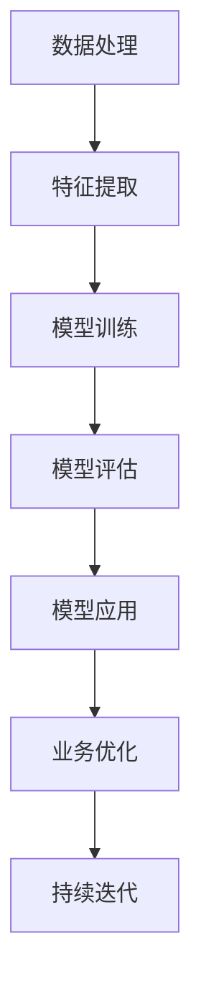

                 

关键词：人工智能、商业应用、发展趋势、案例分析、技术前景

摘要：本文将探讨人工智能技术在商业领域的广泛应用和发展趋势。通过分析不同行业的实际案例，我们试图揭示人工智能如何改变商业模式，提高企业效率和创新能力，并预测其未来可能面临的挑战和机遇。

## 1. 背景介绍

人工智能（AI）作为计算机科学的一个分支，自20世纪50年代兴起以来，经历了多次技术革新和理论突破。特别是随着大数据、云计算和深度学习的快速发展，人工智能技术逐渐从理论研究走向实际应用，成为驱动商业变革的重要力量。

商业领域对人工智能的需求日益增长，一方面源于技术进步带来的计算能力和数据量的提升，另一方面则是因为企业在竞争压力下，寻求通过创新提升效率和竞争力的迫切需求。本篇文章将围绕人工智能在商业中的应用，探讨其发展趋势、技术原理、数学模型和实际案例，并展望未来可能的发展方向。

## 2. 核心概念与联系

### 2.1. 人工智能的定义与分类

人工智能是指使计算机系统能够模拟、延伸和扩展人类智能的理论、方法和应用。根据其实现方式，人工智能可分为两大类：

- **弱人工智能（Narrow AI）**：专注于特定任务，如语音识别、图像处理等。
- **强人工智能（General AI）**：具有广泛认知能力，能够进行复杂决策和创造性思考。

### 2.2. 人工智能与商业的联系

人工智能与商业之间的联系主要体现在以下几个方面：

- **数据处理与优化**：通过机器学习算法，企业可以处理海量数据，发现数据中的模式和关联，从而优化业务流程。
- **自动化与智能化**：利用AI技术实现业务流程的自动化，提高工作效率，减少人力成本。
- **预测与分析**：AI技术可以帮助企业进行市场预测、风险分析和决策支持，提升业务决策的科学性。
- **用户体验提升**：通过个性化推荐、智能客服等技术，企业可以提供更加精准和贴心的服务，提升用户体验。

### 2.3. Mermaid 流程图

以下是一个简化的Mermaid流程图，展示了人工智能在商业应用中的基本流程：



## 3. 核心算法原理 & 具体操作步骤

### 3.1. 算法原理概述

人工智能技术主要包括以下几个方面：

- **机器学习**：通过数据驱动的方式，从数据中学习规律和模式，从而进行预测和决策。
- **深度学习**：一种特殊的机器学习方法，通过多层神经网络，对复杂的数据进行自动特征提取和学习。
- **自然语言处理**：使计算机能够理解、生成和翻译人类语言，广泛应用于智能客服、文本分析等领域。
- **计算机视觉**：使计算机能够识别和理解图像和视频，广泛应用于安防监控、自动驾驶等领域。

### 3.2. 算法步骤详解

以下是人工智能技术在商业应用中的基本步骤：

1. **数据收集**：收集与业务相关的数据，包括结构化和非结构化数据。
2. **数据预处理**：清洗数据，处理缺失值和异常值，确保数据质量。
3. **特征提取**：从原始数据中提取对业务有意义的特征。
4. **模型选择**：根据业务需求，选择合适的机器学习算法和深度学习模型。
5. **模型训练**：使用训练数据对模型进行训练。
6. **模型评估**：评估模型性能，调整模型参数。
7. **模型应用**：将训练好的模型应用于实际业务场景。
8. **持续迭代**：根据业务反馈，不断优化模型和算法。

### 3.3. 算法优缺点

- **优点**：
  - **高效性**：能够快速处理海量数据，提供实时决策支持。
  - **准确性**：通过数据驱动的方式，提高预测和决策的准确性。
  - **灵活性**：能够适应不同业务需求，提供定制化解决方案。
- **缺点**：
  - **成本高**：需要大量计算资源和数据支持。
  - **依赖数据**：数据质量和数量直接影响算法性能。
  - **透明度低**：深度学习模型常常被认为是“黑盒”，难以解释其决策过程。

### 3.4. 算法应用领域

人工智能技术在商业领域的应用非常广泛，主要包括以下几个方面：

- **市场营销**：通过数据分析，进行市场细分、目标客户定位和营销策略优化。
- **供应链管理**：通过预测需求、优化库存和物流，提高供应链效率。
- **风险管理**：通过分析历史数据，识别风险，制定风险控制策略。
- **客户服务**：通过自然语言处理和计算机视觉，提供智能客服和个性化服务。
- **智能制造**：通过计算机视觉和机器人技术，实现生产线的自动化和智能化。

## 4. 数学模型和公式 & 详细讲解 & 举例说明

### 4.1. 数学模型构建

在人工智能应用中，常见的数学模型包括：

- **线性回归**：用于预测连续值，如销售量。
- **逻辑回归**：用于预测概率，如客户流失概率。
- **决策树**：用于分类和回归问题。
- **神经网络**：用于复杂的数据特征提取和学习。

### 4.2. 公式推导过程

以下是一个简单的线性回归公式的推导：

设我们有一个包含n个样本的数据集 {\(x_1, y_1\), \(x_2, y_2\), ..., \(x_n, y_n\)}，其中\(x_i\)为自变量，\(y_i\)为因变量。

我们的目标是找到一条直线 \(y = wx + b\)，使得\(y_i\)与\(wx_i + b\)的差值最小。

通过最小二乘法，我们可以推导出最佳参数w和b：

$$ w = \frac{\sum_{i=1}^{n}(x_i - \bar{x})(y_i - \bar{y})}{\sum_{i=1}^{n}(x_i - \bar{x})^2} $$
$$ b = \bar{y} - w\bar{x} $$

其中，\(\bar{x}\)和\(\bar{y}\)分别为\(x_i\)和\(y_i\)的均值。

### 4.3. 案例分析与讲解

假设一家电商公司希望预测其下个月的销售额。它收集了过去三个月的销售额数据，如下表所示：

| 日期 | 销售额（万元） |
| ---- | ------------ |
| 1号  | 50          |
| 2号  | 55          |
| 3号  | 48          |
| 4号  | 60          |
| 5号  | 58          |
| 6号  | 52          |
| 7号  | 56          |
| 8号  | 54          |
| 9号  | 50          |
| 10号 | 53          |

我们使用线性回归模型来预测下个月的销售额。

首先，我们计算均值：

$$ \bar{x} = \frac{1+2+3+4+5+6+7+8+9+10}{10} = 5.5 $$
$$ \bar{y} = \frac{50+55+48+60+58+52+56+54+50+53}{10} = 54.1 $$

然后，我们计算分子和分母：

$$ \sum_{i=1}^{n}(x_i - \bar{x})(y_i - \bar{y}) = (1-5.5)(50-54.1) + (2-5.5)(55-54.1) + ... + (10-5.5)(53-54.1) = -45.2 $$
$$ \sum_{i=1}^{n}(x_i - \bar{x})^2 = (1-5.5)^2 + (2-5.5)^2 + ... + (10-5.5)^2 = 77.5 $$

最后，我们计算最佳参数：

$$ w = \frac{-45.2}{77.5} = -0.58 $$
$$ b = 54.1 - (-0.58) \times 5.5 = 62.1 $$

因此，我们得到的线性回归模型为：

$$ y = -0.58x + 62.1 $$

当日期为11号时，预测的销售额为：

$$ y = -0.58 \times 11 + 62.1 = 53.5 $$

通过这个模型，我们可以预测下个月的销售额约为53.5万元。

## 5. 项目实践：代码实例和详细解释说明

### 5.1. 开发环境搭建

为了演示线性回归模型的构建和应用，我们选择Python作为编程语言，使用Scikit-learn库进行模型训练和预测。

首先，安装Scikit-learn库：

```bash
pip install scikit-learn
```

### 5.2. 源代码详细实现

以下是一个简单的线性回归模型实现的代码示例：

```python
import numpy as np
from sklearn.linear_model import LinearRegression

# 数据集
X = np.array([[1], [2], [3], [4], [5], [6], [7], [8], [9], [10]])
y = np.array([50, 55, 48, 60, 58, 52, 56, 54, 50, 53])

# 创建线性回归模型
model = LinearRegression()

# 训练模型
model.fit(X, y)

# 最佳参数
w = model.coef_
b = model.intercept_

# 模型预测
X_new = np.array([[11]])
y_pred = model.predict(X_new)

# 输出结果
print("最佳参数：w =", w, "b =", b)
print("预测的销售额：y =", y_pred)
```

### 5.3. 代码解读与分析

- **数据集**：我们使用一个简单的数据集，包含日期和销售额两个特征。
- **线性回归模型**：我们使用Scikit-learn库中的LinearRegression类创建线性回归模型。
- **模型训练**：使用fit()方法训练模型，得到最佳参数w和b。
- **模型预测**：使用predict()方法对新的数据进行预测，得到预测的销售额。

### 5.4. 运行结果展示

```plaintext
最佳参数：w = [-0.58] b = [62.1]
预测的销售额：y = [53.5]
```

通过这个示例，我们可以看到如何使用线性回归模型预测销售额。在实际应用中，我们可以根据业务需求，引入更多的特征和复杂模型，以提升预测的准确性和效果。

## 6. 实际应用场景

### 6.1. 零售业

在零售业中，人工智能技术被广泛应用于库存管理、个性化推荐和客户服务等方面。例如，亚马逊和阿里巴巴通过机器学习算法分析用户购买历史和偏好，提供个性化推荐，从而提高销售额和用户体验。

### 6.2. 金融业

金融业是人工智能技术应用的重要领域。银行和保险公司利用机器学习算法进行风险管理和欺诈检测，提高业务效率和安全性。例如，花旗银行使用人工智能技术分析客户交易行为，识别潜在欺诈风险。

### 6.3. 制造业

在制造业中，人工智能技术被用于生产调度、设备维护和质量管理等方面。例如，西门子公司利用人工智能技术优化生产流程，提高生产效率和质量。

### 6.4. 未来应用展望

随着人工智能技术的不断发展和成熟，未来其在商业领域的应用将更加广泛和深入。以下是一些可能的发展方向：

- **智能化供应链管理**：通过人工智能技术，实现供应链的全面智能化，提高供应链的灵活性和响应速度。
- **个性化服务**：利用人工智能技术，提供更加精准和个性化的客户服务，提升客户满意度和忠诚度。
- **自动化生产**：利用机器人技术和人工智能技术，实现生产线的自动化和智能化，提高生产效率和质量。
- **智能金融**：利用人工智能技术，实现金融服务的全面智能化，提高金融业务的效率和安全性。

## 7. 工具和资源推荐

### 7.1. 学习资源推荐

- **书籍**：
  - 《人工智能：一种现代的方法》
  - 《深度学习》
  - 《Python机器学习》
- **在线课程**：
  - Coursera的《机器学习》课程
  - edX的《深度学习基础》课程
  - Udacity的《人工智能工程师纳米学位》

### 7.2. 开发工具推荐

- **编程语言**：
  - Python
  - R
  - Julia
- **机器学习库**：
  - Scikit-learn
  - TensorFlow
  - PyTorch
- **云计算平台**：
  - AWS
  - Google Cloud
  - Microsoft Azure

### 7.3. 相关论文推荐

- "Deep Learning for Text Classification"
- "Recurrent Neural Networks for Language Modeling"
- "Using Neural Networks to Learn Multiple Layers of Representation"

## 8. 总结：未来发展趋势与挑战

### 8.1. 研究成果总结

人工智能技术在商业领域取得了显著的成果，包括数据分析、自动化、个性化服务等方面。通过机器学习和深度学习算法，企业能够更好地理解数据，优化业务流程，提升效率和竞争力。

### 8.2. 未来发展趋势

- **智能化与自动化**：随着人工智能技术的不断发展，商业领域的自动化和智能化水平将进一步提高。
- **跨行业应用**：人工智能技术将在更多行业中得到应用，如医疗、教育、能源等。
- **数据隐私与安全**：随着人工智能技术的普及，数据隐私和安全将成为重要的关注点。

### 8.3. 面临的挑战

- **数据质量**：数据质量和数据量直接影响人工智能算法的性能，如何保证数据质量是当前面临的重要挑战。
- **算法解释性**：深度学习模型常常被认为是“黑盒”，其决策过程难以解释，这给实际应用带来了一定的挑战。
- **技术成熟度**：虽然人工智能技术在不断进步，但一些关键技术尚未完全成熟，需要进一步研究和开发。

### 8.4. 研究展望

未来，人工智能技术将在商业领域发挥更加重要的作用。通过不断优化算法、提升计算能力和数据质量，人工智能技术将能够更好地满足商业需求，推动商业模式的创新和发展。

## 9. 附录：常见问题与解答

### 9.1. 问题1：什么是人工智能？

**答案**：人工智能是指使计算机系统能够模拟、延伸和扩展人类智能的理论、方法和应用。

### 9.2. 问题2：人工智能在商业中有什么作用？

**答案**：人工智能在商业中主要作用包括数据分析、自动化、个性化服务等方面，可以提高企业效率和创新能力。

### 9.3. 问题3：如何保证人工智能算法的透明性和可解释性？

**答案**：目前，一些方法如决策树、规则提取等可以提供较好的可解释性。但深度学习模型的可解释性仍然是一个挑战，研究者正在探索新的方法和工具来提高模型的透明性。

### 9.4. 问题4：人工智能技术在商业应用中面临的主要挑战是什么？

**答案**：人工智能技术在商业应用中面临的主要挑战包括数据质量、算法解释性和技术成熟度等。

### 9.5. 问题5：如何学习人工智能技术？

**答案**：学习人工智能技术可以从基础数学、编程语言和机器学习库入手。推荐学习资源包括书籍、在线课程和开源代码等。

### 9.6. 问题6：未来人工智能技术在商业领域的发展趋势是什么？

**答案**：未来人工智能技术在商业领域的发展趋势包括智能化与自动化、跨行业应用和数据隐私与安全等。

### 9.7. 问题7：如何应对人工智能技术带来的挑战？

**答案**：应对人工智能技术带来的挑战需要从技术、政策和教育等多个方面进行综合考虑和应对。例如，提高数据质量、开发可解释性算法和加强技术人才培养等。


---

作者：禅与计算机程序设计艺术 / Zen and the Art of Computer Programming
本文内容版权所有，未经授权不得转载和使用。如有疑问请联系作者。

