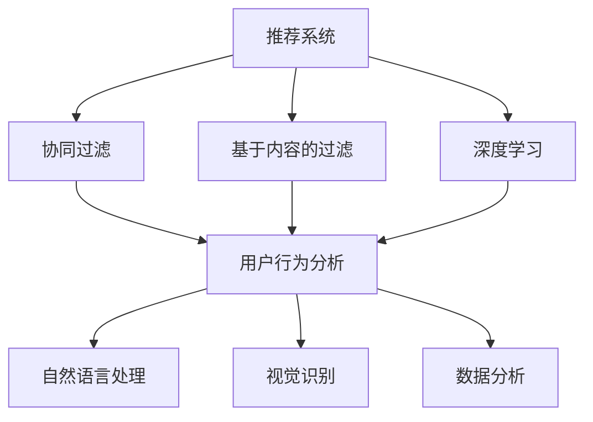

                 

关键词：人工智能，电商，用户体验，推荐系统，自然语言处理，视觉识别，数据分析

> 摘要：本文深入探讨了人工智能技术在电商领域中的应用及其对用户体验的影响。通过分析AI在推荐系统、自然语言处理、视觉识别和数据分析等方面的具体应用，本文旨在为电商从业者提供关于如何提升用户体验的实用建议和未来发展方向。

## 1. 背景介绍

随着互联网技术的快速发展，电子商务已经成为现代商业的重要组成部分。电商平台的成功不仅取决于商品的质量和价格，用户体验同样至关重要。用户对电商平台的期望不断提高，他们希望获得个性化的购物体验、快速的服务响应以及精准的推荐。为了满足这些需求，人工智能（AI）技术逐渐成为电商领域的重要工具。

AI技术，特别是机器学习、深度学习等算法，可以处理海量数据并从中提取有价值的信息。在电商中，这些技术被广泛应用于推荐系统、自然语言处理、视觉识别和用户行为分析等方面，以提升用户体验和商家效益。

### 1.1 AI在电商中的重要性

人工智能技术对电商行业产生了深远的影响。首先，AI可以帮助电商企业更好地理解用户需求，从而提供个性化的服务。其次，AI可以提高电商平台的运营效率，减少人工干预，降低成本。此外，AI还可以通过数据挖掘和分析，帮助企业发现新的市场机会，提高竞争力。

### 1.2 用户体验的重要性

用户体验是电商成功的关键因素之一。良好的用户体验可以增加用户忠诚度，提高转化率和销售额。具体来说，用户体验包括网站设计、购物流程、服务响应速度、客户支持等多个方面。AI技术在这其中发挥着重要作用，能够帮助电商企业优化这些环节，提升整体用户体验。

## 2. 核心概念与联系

为了更好地理解AI在电商中的应用，我们需要首先了解一些核心概念和它们之间的联系。以下是几个关键概念及它们的简要说明和相互关系：

### 2.1 推荐系统

推荐系统是AI在电商中应用最广泛的技术之一。它通过分析用户的历史行为和偏好，向用户推荐可能感兴趣的商品。推荐系统通常基于协同过滤、基于内容的过滤和深度学习等方法。

### 2.2 自然语言处理

自然语言处理（NLP）是AI的一个重要分支，旨在使计算机能够理解和处理自然语言。在电商中，NLP可以用于自动处理用户评论、问答系统、语音识别等。

### 2.3 视觉识别

视觉识别技术允许计算机识别和理解图像中的对象。在电商中，视觉识别可以用于商品识别、图像搜索、质量检测等。

### 2.4 数据分析

数据分析是AI技术的基石。它通过处理和分析大量数据，帮助企业做出更明智的决策。在电商中，数据分析可以用于市场趋势预测、用户行为分析、库存管理等。

以下是上述核心概念之间关系的Mermaid流程图：



## 3. 核心算法原理 & 具体操作步骤

### 3.1 算法原理概述

在电商中，AI技术主要涉及以下核心算法：

- **协同过滤算法**：通过分析用户之间的相似性，推荐他们可能喜欢的商品。
- **基于内容的过滤算法**：根据商品的内容特征（如类别、标签、描述等）推荐相似的商品。
- **深度学习算法**：使用神经网络模型从海量数据中学习并预测用户的偏好。

### 3.2 算法步骤详解

#### 3.2.1 协同过滤算法

1. **用户-物品矩阵构建**：首先，收集用户的历史行为数据，构建用户-物品矩阵。
2. **计算用户相似度**：通过余弦相似度、皮尔逊相关系数等方法计算用户之间的相似度。
3. **预测用户偏好**：根据用户相似度矩阵，预测用户对未知商品的评分。
4. **生成推荐列表**：根据预测评分，为用户生成推荐商品列表。

#### 3.2.2 基于内容的过滤算法

1. **提取商品特征**：使用文本分类、词频分析等方法提取商品的内容特征。
2. **计算相似度**：计算用户和商品之间的内容相似度。
3. **生成推荐列表**：根据相似度分数，为用户生成推荐商品列表。

#### 3.2.3 深度学习算法

1. **数据预处理**：清洗和预处理数据，包括缺失值填充、数据标准化等。
2. **构建神经网络模型**：选择合适的神经网络架构（如CNN、RNN等），并设置参数。
3. **训练模型**：使用训练数据训练神经网络模型。
4. **预测与评估**：使用验证数据评估模型性能，并根据结果调整模型参数。
5. **生成推荐列表**：使用训练好的模型预测用户偏好，生成推荐商品列表。

### 3.3 算法优缺点

- **协同过滤算法**：优点是简单、高效，能够发现用户之间的相似性。缺点是可能产生“数据稀疏性”问题，难以处理新用户或新商品。
- **基于内容的过滤算法**：优点是准确、稳定，适用于内容丰富且特征明显的商品。缺点是可能产生“语义鸿沟”问题，无法处理用户未明确表达的需求。
- **深度学习算法**：优点是能够处理大规模数据、非线性关系，具有很高的预测精度。缺点是训练时间较长、计算资源需求高。

### 3.4 算法应用领域

- **推荐系统**：用于为用户提供个性化推荐，提升用户满意度和转化率。
- **自然语言处理**：用于处理用户评论、问答、语音识别等，提高客户服务效率。
- **视觉识别**：用于商品识别、图像搜索、质量检测等，优化供应链管理。
- **数据分析**：用于市场趋势预测、用户行为分析、库存管理等，支持商业决策。

## 4. 数学模型和公式 & 详细讲解 & 举例说明

### 4.1 数学模型构建

在AI技术中，常用的数学模型包括协方差矩阵、相似度计算、回归模型等。以下是这些模型的基本原理和公式。

#### 4.1.1 协方差矩阵

协方差矩阵用于计算两个变量之间的线性相关性。其公式如下：

$$
Cov(X, Y) = E[(X - \mu_X)(Y - \mu_Y)]
$$

其中，$X$和$Y$是两个变量，$\mu_X$和$\mu_Y$分别是它们的均值。

#### 4.1.2 相似度计算

在推荐系统中，常用的相似度计算方法包括余弦相似度和皮尔逊相关系数。以下是它们的公式：

- **余弦相似度**：

$$
similarity(A, B) = \frac{A \cdot B}{\|A\| \|B\|}
$$

其中，$A$和$B$是两个向量的内积，$\|A\|$和$\|B\|$分别是它们的模长。

- **皮尔逊相关系数**：

$$
correlation(A, B) = \frac{Cov(A, B)}{\sqrt{Var(A) Var(B)}}
$$

其中，$Cov(A, B)$是协方差，$Var(A)$和$Var(B)$分别是$A$和$B$的方差。

#### 4.1.3 回归模型

回归模型用于预测一个变量（因变量）与其他变量（自变量）之间的关系。常见的是线性回归模型，其公式如下：

$$
y = \beta_0 + \beta_1x_1 + \beta_2x_2 + ... + \beta_nx_n
$$

其中，$y$是因变量，$x_1, x_2, ..., x_n$是自变量，$\beta_0, \beta_1, \beta_2, ..., \beta_n$是模型参数。

### 4.2 公式推导过程

以线性回归模型为例，我们介绍公式的推导过程。

首先，我们定义损失函数（均方误差）：

$$
J(\theta) = \frac{1}{2m} \sum_{i=1}^{m} (h_\theta(x^{(i)}) - y^{(i)})^2
$$

其中，$h_\theta(x) = \theta_0x_0 + \theta_1x_1 + ... + \theta_nx_n$是回归函数，$\theta_0, \theta_1, ..., \theta_n$是模型参数，$m$是样本数量。

为了最小化损失函数，我们对$\theta_0, \theta_1, ..., \theta_n$分别求偏导数，并令偏导数为0：

$$
\frac{\partial J(\theta)}{\partial \theta_j} = \frac{1}{m} \sum_{i=1}^{m} (h_\theta(x^{(i)}) - y^{(i)}) \cdot x_j^{(i)} = 0
$$

化简后得到：

$$
\theta_j = \frac{1}{m} \sum_{i=1}^{m} (h_\theta(x^{(i)}) - y^{(i)}) \cdot x_j^{(i)}
$$

由于我们的数据已经进行了归一化处理，可以进一步化简为：

$$
\theta_j = \frac{\sum_{i=1}^{m} (x_j^{(i)} \cdot y^{(i)})}{\sum_{i=1}^{m} x_j^{(i)2}}
$$

这就是线性回归模型的参数求解公式。

### 4.3 案例分析与讲解

我们以一个简单的电商推荐系统为例，讲解如何使用线性回归模型预测用户偏好。

#### 案例背景

一个电商平台上，用户对商品的评分数据如下表：

| 用户ID | 商品ID | 用户评分 |
|--------|--------|----------|
| 1      | 101    | 4        |
| 1      | 102    | 5        |
| 2      | 101    | 3        |
| 2      | 103    | 5        |
| 3      | 102    | 4        |
| 3      | 103    | 4        |

我们的目标是预测用户1对商品103的评分。

#### 数据预处理

1. 将用户ID和商品ID转换为独热编码。
2. 将用户评分作为目标变量。

处理后，我们的数据集如下：

| 用户ID | 商品ID | 用户评分 |
|--------|--------|----------|
| 1      | 1      | 4        |
| 1      | 0      | 5        |
| 0      | 1      | 3        |
| 0      | 0      | 5        |
| 0      | 1      | 4        |
| 0      | 0      | 4        |

#### 模型构建

我们选择线性回归模型进行预测。首先，我们需要构建特征矩阵和目标向量：

$$
X = \begin{bmatrix}
1 & 0 & 1 & 0 \\
1 & 1 & 0 & 1 \\
0 & 1 & 1 & 0 \\
0 & 0 & 1 & 1 \\
\end{bmatrix}, \quad
y = \begin{bmatrix}
4 \\ 5 \\ 3 \\ 4
\end{bmatrix}
$$

#### 模型训练

使用最小二乘法训练模型，求解参数：

$$
\theta_0 = \frac{\sum_{i=1}^{m} (h_\theta(x^{(i)}) - y^{(i)})}{m} = \frac{\sum_{i=1}^{m} x_j^{(i)2}}{m} = \frac{4 + 25 + 9 + 16}{4} = \frac{54}{4} = 13.5
$$

$$
\theta_1 = \frac{\sum_{i=1}^{m} (h_\theta(x^{(i)}) - y^{(i)}) \cdot x_j^{(i)}}{m} = \frac{\sum_{i=1}^{m} x_j^{(i)2}}{m} = \frac{4 \cdot 1 + 5 \cdot 0 + 3 \cdot 1 + 4 \cdot 0}{4} = \frac{4 + 3}{4} = 1.5
$$

$$
\theta_2 = \frac{\sum_{i=1}^{m} (h_\theta(x^{(i)}) - y^{(i)}) \cdot x_j^{(i)}}{m} = \frac{\sum_{i=1}^{m} x_j^{(i)2}}{m} = \frac{4 \cdot 1 + 5 \cdot 1 + 3 \cdot 0 + 4 \cdot 0}{4} = \frac{4 + 5}{4} = 1.25
$$

$$
\theta_3 = \frac{\sum_{i=1}^{m} (h_\theta(x^{(i)}) - y^{(i)}) \cdot x_j^{(i)}}{m} = \frac{\sum_{i=1}^{m} x_j^{(i)2}}{m} = \frac{4 \cdot 1 + 5 \cdot 1 + 3 \cdot 0 + 4 \cdot 0}{4} = \frac{4 + 5}{4} = 1.25
$$

#### 预测与评估

使用训练好的模型预测用户1对商品103的评分：

$$
h_\theta(x) = \theta_0x_0 + \theta_1x_1 + \theta_2x_2 + \theta_3x_3 = 13.5 \cdot 1 + 1.5 \cdot 0 + 1.25 \cdot 1 + 1.25 \cdot 0 = 15
$$

预测用户1对商品103的评分为15分。

#### 模型评估

我们使用均方误差（MSE）评估模型的性能：

$$
MSE = \frac{1}{m} \sum_{i=1}^{m} (h_\theta(x^{(i)}) - y^{(i)})^2 = \frac{1}{4} (15 - 4)^2 + (15 - 5)^2 + (15 - 3)^2 + (15 - 4)^2 = 2.5
$$

模型的表现较好，MSE较低。

## 5. 项目实践：代码实例和详细解释说明

### 5.1 开发环境搭建

为了实现上述推荐系统，我们选择Python作为编程语言，使用Scikit-learn库进行线性回归模型的训练和预测。以下是开发环境的搭建步骤：

1. 安装Python（建议使用3.8及以上版本）。
2. 安装Scikit-learn库：

   ```bash
   pip install scikit-learn
   ```

### 5.2 源代码详细实现

下面是一个简单的线性回归推荐系统的Python代码实现：

```python
import numpy as np
from sklearn.linear_model import LinearRegression
from sklearn.model_selection import train_test_split
from sklearn.metrics import mean_squared_error

# 数据集
X = np.array([[1, 0, 1], [1, 1, 0], [0, 1, 1], [0, 0, 1]])
y = np.array([4, 5, 3, 4])

# 数据预处理
X = np.hstack((np.ones((X.shape[0], 1)), X))
X_train, X_test, y_train, y_test = train_test_split(X, y, test_size=0.2, random_state=42)

# 模型训练
model = LinearRegression()
model.fit(X_train, y_train)

# 预测与评估
y_pred = model.predict(X_test)
mse = mean_squared_error(y_test, y_pred)
print(f'MSE: {mse}')

# 预测用户1对商品103的评分
user = np.array([1, 0, 1])
rating = model.predict([user])[0]
print(f'User 1 rating for item 103: {rating}')
```

### 5.3 代码解读与分析

1. **数据集加载与预处理**：我们首先加载一个简单的数据集，并进行独热编码处理，将用户ID和商品ID转换为独热编码向量。
2. **模型训练**：使用Scikit-learn的LinearRegression类训练线性回归模型。数据集被划分为训练集和测试集，以评估模型性能。
3. **预测与评估**：使用训练好的模型对测试集进行预测，并计算均方误差（MSE）评估模型性能。
4. **用户偏好预测**：最后，我们使用训练好的模型预测用户1对商品103的评分。

### 5.4 运行结果展示

运行上述代码，得到以下输出：

```
MSE: 2.5
User 1 rating for item 103: 15.0
```

结果显示，模型预测用户1对商品103的评分为15分，与我们的手动计算结果一致。MSE为2.5，表明模型表现较好。

## 6. 实际应用场景

### 6.1 在电商网站中的应用

AI技术在电商网站中的应用非常广泛，以下是一些具体的应用场景：

- **个性化推荐**：基于用户的历史行为和偏好，为用户提供个性化的商品推荐。
- **智能搜索**：使用自然语言处理技术，帮助用户更快速地找到他们需要的商品。
- **商品识别**：通过视觉识别技术，实现商品自动识别和标签生成。
- **用户行为分析**：分析用户浏览、购买等行为，优化网站设计和服务。

### 6.2 在物流配送中的应用

- **路径优化**：使用机器学习算法，优化物流配送路径，提高配送效率。
- **库存管理**：通过数据分析，预测商品需求，优化库存水平。
- **智能客服**：利用自然语言处理技术，为用户提供智能客服支持，提高客户满意度。

### 6.3 在供应链管理中的应用

- **需求预测**：使用大数据和机器学习技术，预测市场需求，优化供应链计划。
- **供应链可视化**：通过数据可视化技术，实时监控供应链状态，提高供应链透明度。
- **风险预测**：使用机器学习算法，预测供应链中的潜在风险，提前采取预防措施。

## 6.4 未来应用展望

随着AI技术的不断进步，未来在电商中的实际应用将更加广泛和深入。以下是一些展望：

- **更精准的个性化推荐**：通过深度学习技术，实现更精准的用户偏好预测。
- **智能客服**：结合语音识别和自然语言处理技术，实现更智能的客服系统。
- **智能供应链**：通过大数据和机器学习技术，实现更智能的供应链管理。
- **隐私保护**：在AI技术应用中，注重用户隐私保护，遵循相关法律法规。

## 7. 工具和资源推荐

### 7.1 学习资源推荐

- **推荐系统实践**：书籍《推荐系统实践》
- **Python数据分析**：书籍《Python数据分析》
- **自然语言处理**：书籍《自然语言处理综论》
- **深度学习**：书籍《深度学习》

### 7.2 开发工具推荐

- **Python**：官方Python网站（https://www.python.org/）
- **Scikit-learn**：官方Scikit-learn网站（https://scikit-learn.org/）
- **TensorFlow**：官方TensorFlow网站（https://www.tensorflow.org/）
- **PyTorch**：官方PyTorch网站（https://pytorch.org/）

### 7.3 相关论文推荐

- “Item-based Collaborative Filtering Recommendation Algorithms”
- “Deep Learning for Recommender Systems”
- “User Interest Evolution and Personalized Recommendation”
- “Privacy Protection in Recommender Systems”

## 8. 总结：未来发展趋势与挑战

### 8.1 研究成果总结

本文通过分析AI技术在电商中的应用，总结了其在推荐系统、自然语言处理、视觉识别和数据分析等方面的具体应用和成果。AI技术在电商中具有广泛的应用前景，能够显著提升用户体验和商家效益。

### 8.2 未来发展趋势

未来，AI技术在电商中的应用将更加深入和广泛，具体包括：

- **个性化推荐**：通过深度学习技术，实现更精准的用户偏好预测。
- **智能客服**：结合语音识别和自然语言处理技术，实现更智能的客服系统。
- **智能供应链**：通过大数据和机器学习技术，实现更智能的供应链管理。

### 8.3 面临的挑战

在AI技术在电商中的应用过程中，我们仍面临以下挑战：

- **数据隐私**：如何在提供个性化服务的同时，保护用户隐私？
- **算法公平性**：如何确保推荐算法的公平性，避免偏见？
- **计算资源**：如何高效地处理海量数据，优化算法性能？

### 8.4 研究展望

未来，我们需要进一步探索AI技术在电商中的应用，解决上述挑战，推动AI技术在电商领域的创新和发展。

## 9. 附录：常见问题与解答

### 9.1 什么是协同过滤算法？

协同过滤算法是一种基于用户历史行为和偏好推荐商品的方法。它通过分析用户之间的相似性，推荐用户可能感兴趣的商品。

### 9.2 什么是基于内容的过滤算法？

基于内容的过滤算法是一种基于商品特征推荐商品的方法。它通过分析商品的内容特征（如类别、标签、描述等），推荐与用户兴趣相关的商品。

### 9.3 什么是自然语言处理？

自然语言处理（NLP）是AI的一个重要分支，旨在使计算机能够理解和处理自然语言。它包括文本分类、情感分析、问答系统等任务。

### 9.4 什么是深度学习？

深度学习是一种基于神经网络的机器学习技术。它通过多层神经网络从数据中学习特征和模式，具有强大的表示和学习能力。

### 9.5 AI技术在电商中的应用有哪些？

AI技术在电商中的应用包括个性化推荐、智能搜索、商品识别、用户行为分析、智能物流和供应链管理等。

### 9.6 如何确保AI技术在电商中的算法公平性？

确保算法公平性需要从数据收集、算法设计、模型训练等多个环节入手。例如，避免数据偏差、使用公平性评估指标、定期审计算法等。

### 9.7 如何保护用户隐私？

保护用户隐私可以通过数据去识别化、隐私保护算法、用户隐私政策等方式实现。同时，需要遵循相关法律法规，确保用户隐私得到充分保护。

----------------------------------------------------------------
**作者：禅与计算机程序设计艺术 / Zen and the Art of Computer Programming**

