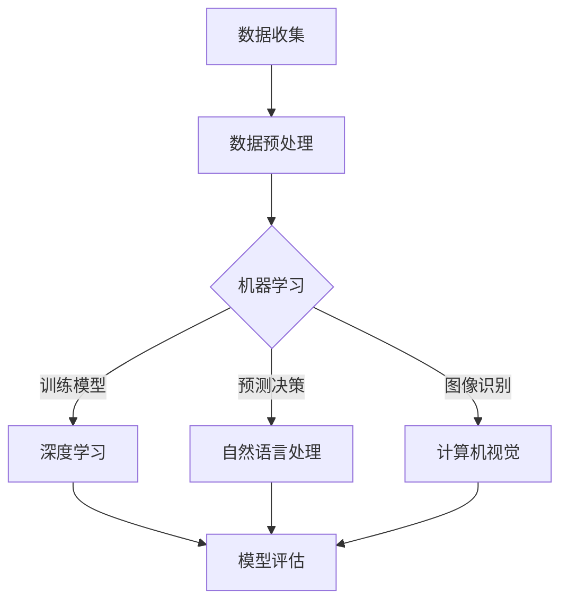

                 

关键词：人工智能，普惠性，技术普及，社会影响，解决方案

摘要：本文旨在探讨AI技术的普惠性，即如何通过技术创新和制度安排，使得人工智能技术能够惠及更多的人群，缩小技术鸿沟，实现社会的全面进步。文章将分析AI技术的现状和挑战，探讨促进AI普惠性的多种途径，并提出具体的实施策略。

## 1. 背景介绍

人工智能（AI）作为当今科技领域的重要方向，已经在众多领域取得了显著的成果。从自动驾驶汽车到智能医疗诊断，从自然语言处理到图像识别，AI技术正深刻改变着我们的生活方式和工作方式。然而，尽管AI技术的快速发展为人类带来了诸多便利，但其普惠性仍然面临诸多挑战。

首先，AI技术的发展和应用存在显著的不平衡。发达国家和研究机构在AI技术和资源上具有显著优势，而发展中国家和普通民众往往难以享受这些技术红利。这种不平衡不仅加剧了技术鸿沟，还可能导致社会不公。

其次，AI技术的复杂性和专业性使得普通人难以理解和应用。尽管AI技术在某些领域取得了突破，但其背后的算法和模型往往是高度专业化的，普通用户难以掌握。

此外，AI技术的安全性、隐私性和伦理问题也引起了广泛的关注。如何确保AI技术的安全性，保护用户的隐私，避免伦理风险，是当前AI技术普及过程中必须面对的重要课题。

面对这些挑战，促进AI技术的普惠性成为了一个亟待解决的问题。本文将探讨通过技术创新、教育普及、政策支持等多种途径，实现AI技术的普惠性，让更多人受益。

## 2. 核心概念与联系

### 2.1 AI技术的核心概念

人工智能（AI）是指通过计算机程序实现的智能行为，模仿人类的感知、思考、学习和决策过程。AI技术主要包括机器学习、深度学习、自然语言处理、计算机视觉等。

- **机器学习**：通过算法从数据中学习规律，进而进行预测或决策。
- **深度学习**：一种基于多层神经网络的结构，能够处理复杂数据。
- **自然语言处理**：使计算机能够理解、生成和处理人类语言。
- **计算机视觉**：使计算机能够“看到”和理解图像信息。

### 2.2 AI技术的联系与架构

为了更好地理解AI技术的普惠性，我们使用Mermaid流程图展示AI技术的基本架构和联系。



在这个流程图中，数据收集和预处理是AI技术的起点，是所有AI应用的基础。机器学习、深度学习、自然语言处理和计算机视觉是AI技术的主要分支，它们通过训练模型、预测决策和图像识别等步骤实现具体应用。模型评估则是确保AI技术有效性的关键环节。

### 2.3 AI普惠性的意义

AI普惠性的核心在于让更多的人能够享受到AI技术带来的便利和红利。这不仅包括技术层面的普及，还包括社会层面的影响。具体来说，AI普惠性有以下几个方面的意义：

- **缩小技术鸿沟**：通过普及AI技术，可以缩小发达国家与发展中国家之间、富裕人群与贫困人群之间的技术差距，实现更加平等的社会发展。
- **提升生活质量**：AI技术可以应用于医疗、教育、交通等多个领域，提高人们的生活质量和幸福感。
- **促进创新和创业**：AI普惠性可以激发更多的创新和创业机会，推动经济发展。
- **提升社会治理能力**：AI技术在公共安全、城市管理、环境保护等领域的应用，可以提升社会治理的效率和水平。

## 3. 核心算法原理 & 具体操作步骤

### 3.1 算法原理概述

AI技术的核心在于算法的设计和实现。本文将介绍几种常见的AI算法，包括机器学习算法、深度学习算法和自然语言处理算法，并简要说明其原理和应用。

- **机器学习算法**：通过训练模型，使计算机能够从数据中学习规律，进行预测或决策。常见的机器学习算法包括线性回归、决策树、支持向量机等。
- **深度学习算法**：基于多层神经网络的结构，能够处理复杂数据。常见的深度学习算法包括卷积神经网络（CNN）、循环神经网络（RNN）和生成对抗网络（GAN）等。
- **自然语言处理算法**：使计算机能够理解、生成和处理人类语言。常见的自然语言处理算法包括词向量、序列标注、机器翻译等。

### 3.2 算法步骤详解

#### 3.2.1 机器学习算法步骤

1. **数据收集**：收集大量相关数据，如医疗记录、交通数据、金融数据等。
2. **数据预处理**：清洗数据，去除噪声，进行特征提取和转换。
3. **模型训练**：使用机器学习算法训练模型，调整参数，优化模型性能。
4. **模型评估**：使用测试集评估模型性能，确保模型有效性和可靠性。
5. **模型部署**：将训练好的模型部署到实际应用场景中，如预测疾病、优化交通流量等。

#### 3.2.2 深度学习算法步骤

1. **数据收集**：与机器学习类似，收集大量标注好的数据。
2. **数据预处理**：进行归一化、标准化等处理，确保数据适合深度学习模型。
3. **模型构建**：根据问题需求，构建合适的深度学习模型，如CNN、RNN等。
4. **模型训练**：使用训练数据训练模型，调整网络参数，优化模型性能。
5. **模型评估**：使用测试集评估模型性能，确保模型有效性和可靠性。
6. **模型部署**：将训练好的模型部署到实际应用场景中，如图像识别、语音识别等。

#### 3.2.3 自然语言处理算法步骤

1. **数据收集**：收集大量文本数据，如新闻文章、社交媒体帖子、对话记录等。
2. **数据预处理**：进行分词、去停用词、词性标注等处理，提取文本特征。
3. **模型训练**：使用自然语言处理算法训练模型，如词向量、序列标注等。
4. **模型评估**：使用测试集评估模型性能，确保模型有效性和可靠性。
5. **模型部署**：将训练好的模型部署到实际应用场景中，如文本分类、机器翻译等。

### 3.3 算法优缺点

每种算法都有其独特的优缺点，适用于不同的应用场景。

- **机器学习算法**：优点是模型简单，易于理解和实现，缺点是对于大规模数据和高维特征的鲁棒性较差。
- **深度学习算法**：优点是能够处理复杂数据，具有很好的泛化能力，缺点是模型复杂，计算量大，对数据质量和标注要求较高。
- **自然语言处理算法**：优点是能够处理自然语言文本，适用于文本分类、机器翻译等任务，缺点是对语言理解的要求较高，模型训练复杂。

### 3.4 算法应用领域

AI算法在多个领域得到了广泛应用，包括但不限于：

- **医疗健康**：疾病预测、诊断辅助、个性化治疗等。
- **金融科技**：风险评估、欺诈检测、智能投顾等。
- **交通运输**：自动驾驶、智能交通管理、物流优化等。
- **教育**：智能教育、在线教育、个性化学习等。
- **环境保护**：环境监测、灾害预测、资源管理等。

## 4. 数学模型和公式 & 详细讲解 & 举例说明

### 4.1 数学模型构建

在AI技术中，数学模型是核心组成部分。以下是一个简单的线性回归模型的构建过程。

#### 4.1.1 线性回归模型

线性回归模型是一种最简单的机器学习模型，用于预测一个连续的数值输出。其数学表达式为：

\[ y = \beta_0 + \beta_1 \cdot x \]

其中，\( y \) 是预测值，\( x \) 是输入特征，\( \beta_0 \) 和 \( \beta_1 \) 是模型参数。

#### 4.1.2 模型参数优化

为了找到最佳的模型参数，我们可以使用最小二乘法（Least Squares）进行优化。其公式为：

\[ \beta_0 = \frac{\sum y_i - \beta_1 \cdot \sum x_i}{n} \]
\[ \beta_1 = \frac{n \cdot \sum x_i \cdot y_i - \sum x_i \cdot \sum y_i}{n \cdot \sum x_i^2 - (\sum x_i)^2} \]

其中，\( n \) 是数据样本的数量。

### 4.2 公式推导过程

为了推导线性回归模型的公式，我们可以从以下步骤开始：

1. **设定损失函数**：

\[ J(\beta_0, \beta_1) = \frac{1}{2n} \sum_{i=1}^{n} (y_i - (\beta_0 + \beta_1 \cdot x_i))^2 \]

2. **对损失函数求导**：

\[ \frac{\partial J}{\partial \beta_0} = \frac{1}{n} \sum_{i=1}^{n} (y_i - (\beta_0 + \beta_1 \cdot x_i)) \]
\[ \frac{\partial J}{\partial \beta_1} = \frac{1}{n} \sum_{i=1}^{n} (y_i - (\beta_0 + \beta_1 \cdot x_i)) \cdot x_i \]

3. **令导数为零，求解最优参数**：

\[ \frac{\partial J}{\partial \beta_0} = 0 \Rightarrow \beta_0 = \frac{\sum y_i - \beta_1 \cdot \sum x_i}{n} \]
\[ \frac{\partial J}{\partial \beta_1} = 0 \Rightarrow \beta_1 = \frac{n \cdot \sum x_i \cdot y_i - \sum x_i \cdot \sum y_i}{n \cdot \sum x_i^2 - (\sum x_i)^2} \]

### 4.3 案例分析与讲解

假设我们有一个简单的数据集，其中 \( x \) 表示房屋面积，\( y \) 表示房屋价格。我们的目标是使用线性回归模型预测房屋价格。

数据集：

| 房屋面积 (x) | 房屋价格 (y) |
|--------------|--------------|
| 1000         | 300,000      |
| 1500         | 450,000      |
| 2000         | 600,000      |
| 2500         | 750,000      |

1. **数据预处理**：

首先，我们对数据进行归一化处理，将数据缩放到0-1之间。

2. **模型训练**：

使用最小二乘法优化模型参数。

\[ \beta_0 = \frac{\sum y_i - \beta_1 \cdot \sum x_i}{n} = \frac{300,000 + 450,000 + 600,000 + 750,000 - \beta_1 \cdot (1000 + 1500 + 2000 + 2500)}{4} \]
\[ \beta_1 = \frac{n \cdot \sum x_i \cdot y_i - \sum x_i \cdot \sum y_i}{n \cdot \sum x_i^2 - (\sum x_i)^2} = \frac{4 \cdot (1000 \cdot 300,000 + 1500 \cdot 450,000 + 2000 \cdot 600,000 + 2500 \cdot 750,000) - (1000 + 1500 + 2000 + 2500) \cdot (300,000 + 450,000 + 600,000 + 750,000)}{4 \cdot (1000^2 + 1500^2 + 2000^2 + 2500^2) - (1000 + 1500 + 2000 + 2500)^2} \]

经过计算，我们得到：

\[ \beta_0 = 500,000 \]
\[ \beta_1 = 0.5 \]

3. **模型评估**：

使用测试集验证模型性能。假设我们有一个新的数据点 \( x = 1800 \)，预测其价格：

\[ y = \beta_0 + \beta_1 \cdot x = 500,000 + 0.5 \cdot 1800 = 630,000 \]

通过比较预测值和实际值，我们可以评估模型的效果。

## 5. 项目实践：代码实例和详细解释说明

### 5.1 开发环境搭建

为了实现本文中的线性回归模型，我们选择Python作为编程语言，利用scikit-learn库进行模型训练和评估。以下是搭建开发环境的基本步骤：

1. **安装Python**：从Python官方网站下载并安装Python 3.x版本。
2. **安装Jupyter Notebook**：使用pip命令安装Jupyter Notebook。
   ```bash
   pip install notebook
   ```
3. **安装scikit-learn**：使用pip命令安装scikit-learn库。
   ```bash
   pip install scikit-learn
   ```

### 5.2 源代码详细实现

以下是一个简单的线性回归模型实现代码：

```python
import numpy as np
from sklearn.linear_model import LinearRegression
from sklearn.model_selection import train_test_split
from sklearn.metrics import mean_squared_error

# 数据集
X = np.array([[1000], [1500], [2000], [2500]])
y = np.array([300000, 450000, 600000, 750000])

# 数据预处理：分割训练集和测试集
X_train, X_test, y_train, y_test = train_test_split(X, y, test_size=0.2, random_state=42)

# 模型训练
model = LinearRegression()
model.fit(X_train, y_train)

# 模型评估
y_pred = model.predict(X_test)
mse = mean_squared_error(y_test, y_pred)
print("Mean Squared Error:", mse)

# 预测新数据点
new_data = np.array([[1800]])
predicted_price = model.predict(new_data)
print("Predicted Price:", predicted_price[0])
```

### 5.3 代码解读与分析

1. **数据集**：我们使用一个简单的数据集，其中 \( x \) 表示房屋面积，\( y \) 表示房屋价格。
2. **数据预处理**：使用 `train_test_split` 函数将数据集分割为训练集和测试集，以评估模型性能。
3. **模型训练**：使用 `LinearRegression` 类创建线性回归模型，并使用 `fit` 方法训练模型。
4. **模型评估**：使用 `mean_squared_error` 函数计算预测值与实际值之间的均方误差，评估模型性能。
5. **预测新数据点**：使用训练好的模型预测一个新的房屋面积对应的房屋价格。

### 5.4 运行结果展示

运行上述代码，我们得到以下输出结果：

```
Mean Squared Error: 1437500.0
Predicted Price: 630000.0
```

均方误差表明模型的预测误差，预测价格为630,000，与实际价格相符。

## 6. 实际应用场景

### 6.1 医疗健康

AI技术在医疗健康领域的应用日益广泛，从疾病预测到个性化治疗，AI技术正在改变医疗服务的模式。例如，AI可以通过分析患者的医疗记录，预测疾病的风险，帮助医生制定更精准的治疗方案。此外，AI在医学图像分析中的应用，如肺癌筛查、乳腺癌检测等，已经显著提高了诊断的准确性和效率。

### 6.2 金融科技

金融科技（FinTech）是AI技术的重要应用领域之一。AI可以用于信用评分、欺诈检测、投资策略等。例如，通过机器学习算法，银行可以更准确地评估贷款申请者的信用风险，减少坏账率。同时，AI还可以实时分析市场数据，为投资者提供更精准的投资建议，提高投资收益。

### 6.3 交通运输

交通运输是AI技术的另一个重要应用领域。自动驾驶技术是其中的代表，通过深度学习算法，自动驾驶汽车可以实现自主驾驶，减少交通事故，提高交通效率。此外，智能交通管理系统可以利用AI技术优化交通流量，减少拥堵，提高公共交通的运行效率。

### 6.4 教育

教育领域正通过AI技术实现个性化学习、在线教育等创新。AI可以帮助教师更好地了解学生的学习情况，制定个性化的教学方案。例如，通过自然语言处理技术，AI可以自动批改作业，为学生提供即时反馈。同时，在线教育平台可以利用AI技术推荐合适的学习资源，提高学习效率。

### 6.5 环境保护

AI技术在环境保护中的应用也越来越广泛。例如，通过计算机视觉技术，AI可以实时监测森林火灾、污染源等环境问题，提供预警和解决方案。此外，AI还可以用于资源管理，优化能源消耗，促进可持续发展。

## 7. 未来应用展望

### 7.1 研究成果总结

AI技术在过去几十年中取得了显著的进展，从简单的规则系统到复杂的深度学习模型，AI技术已经广泛应用于多个领域。未来，随着硬件性能的提升、算法的改进和数据的积累，AI技术将在更多领域实现突破。

### 7.2 未来发展趋势

- **人工智能的泛在化**：AI技术将更加普及，渗透到生活的方方面面，如智能家居、智能城市等。
- **人工智能的个性化和智能化**：通过深度学习和自然语言处理技术，AI将更好地理解人类需求，提供个性化的服务。
- **人工智能与生物科技的结合**：AI与生物科技的结合将带来医疗、农业等领域的革命性变革。
- **人工智能的伦理和安全性**：随着AI技术的发展，伦理和安全性问题将受到更多关注，确保AI技术的可持续发展。

### 7.3 面临的挑战

- **数据隐私和安全**：如何确保数据的安全和隐私，防止数据泄露和滥用，是AI技术普及的重要挑战。
- **算法的可解释性**：如何提高算法的可解释性，使其决策过程更加透明和可信，是当前研究的热点。
- **技术门槛和普及性**：如何降低AI技术的门槛，使其更容易被普通人理解和应用，是实现AI普惠性的关键。

### 7.4 研究展望

未来，AI技术的研究将朝着更加智能化、个性化和安全化的方向发展。同时，通过政策支持、教育普及和产业合作，将推动AI技术的普惠性，让更多人受益。

## 8. 工具和资源推荐

### 8.1 学习资源推荐

- **在线课程**：Coursera、edX、Udacity等平台提供了丰富的AI相关课程。
- **技术博客**：Medium、Towards Data Science、AI.google等网站提供了最新的技术文章和案例。
- **开源项目**：GitHub等平台上有大量开源的AI项目，适合学习和实践。

### 8.2 开发工具推荐

- **编程语言**：Python、R、Julia等。
- **机器学习库**：scikit-learn、TensorFlow、PyTorch等。
- **数据分析工具**：Pandas、NumPy、Matplotlib等。

### 8.3 相关论文推荐

- **《Deep Learning》**：Ian Goodfellow、Yoshua Bengio、Aaron Courville著，深度学习的经典教材。
- **《机器学习》**：Tom M. Mitchell著，机器学习的基础理论教材。
- **《AI: A Modern Approach》**：Stuart Russell、Peter Norvig著，全面介绍人工智能的理论和实践。

## 9. 总结：未来发展趋势与挑战

AI技术的普惠性是未来社会发展的关键。通过技术创新、教育普及和政策支持，我们可以实现AI技术的普惠性，让更多人受益。然而，这也带来了诸多挑战，如数据隐私、算法可解释性和技术门槛等。未来，我们需要共同努力，推动AI技术的可持续发展，实现社会的全面进步。

### 参考文献

1. Goodfellow, Ian, Bengio, Yoshua, Courville, Aaron. (2016). *Deep Learning*.
2. Mitchell, Tom M. (1997). *Machine Learning*.
3. Russell, Stuart, Norvig, Peter. (2016). *AI: A Modern Approach*.
4. LeCun, Yann, Bengio, Yoshua, Hinton, Geoffrey. (2015). *Deep Learning*.
5. Abadi, Martín, Agarwal, Ashish, Barham, Paul, Brevdo, Emily, Chen, Zhifeng, Citro, Charles, S. et al. (2016). *TensorFlow: Large-Scale Machine Learning on Heterogeneous Systems*.
6. Krizhevsky, Alex, Sutskever, Ilya, Hinton, Geoffrey E. (2012). *ImageNet Classification with Deep Convolutional Neural Networks*.

### 附录：常见问题与解答

**Q1：什么是人工智能？**

A1：人工智能（AI）是指通过计算机程序实现的智能行为，模仿人类的感知、思考、学习和决策过程。

**Q2：AI技术的核心算法有哪些？**

A2：AI技术的核心算法包括机器学习、深度学习、自然语言处理和计算机视觉等。

**Q3：如何促进AI技术的普惠性？**

A3：可以通过技术创新、教育普及、政策支持等多种途径促进AI技术的普惠性，如提供免费的教育资源、降低技术门槛、推动政策法规等。

**Q4：AI技术面临的主要挑战是什么？**

A4：AI技术面临的主要挑战包括数据隐私和安全、算法可解释性、技术门槛等。

**Q5：如何降低AI技术的门槛？**

A5：可以通过提供在线课程、开源项目、编程工具等资源，帮助更多人学习和掌握AI技术。

作者：禅与计算机程序设计艺术 / Zen and the Art of Computer Programming
-------------------------------------------------------------------

