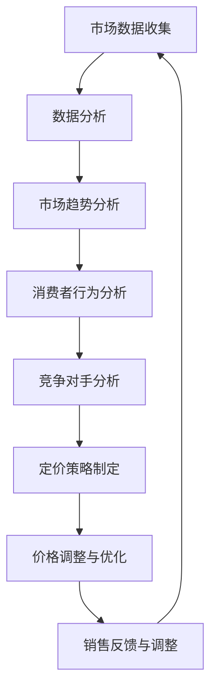

                 

## 1. 背景介绍

在当今竞争激烈的电商市场中，价格策略是电商企业赢得市场份额和消费者青睐的关键因素之一。合理的价格策略不仅能够吸引更多的消费者，提高销售额，还能够保持企业的盈利能力。然而，传统的价格策略往往基于历史数据和市场规律，缺乏灵活性和精准性，难以应对市场的快速变化。随着人工智能技术的不断发展，AI在电商价格策略中的应用逐渐成为可能，为电商企业提供了更智能、更高效的定价方案。

### 1.1 电商价格策略的重要性

价格策略在电商运营中扮演着至关重要的角色。一方面，价格是消费者购买决策的重要因素之一。消费者在购买商品时，往往会综合考虑价格、质量、品牌等因素，最终选择性价比最高的商品。另一方面，价格策略直接影响企业的盈利能力和市场竞争力。合理的价格策略能够提高销售额，增加市场份额，而错误的价格策略则可能导致销售下滑，市场份额减少。

### 1.2 人工智能在电商领域的应用现状

人工智能技术在电商领域的应用已经越来越广泛。从推荐系统、客户关系管理到供应链管理，AI技术都在为电商企业提供创新的解决方案。特别是在价格策略方面，AI技术通过大数据分析和机器学习算法，可以实时分析市场动态、消费者行为，为电商企业提供精准的定价建议，从而提升企业的盈利能力和市场竞争力。

### 1.3 文章结构

本文将首先介绍电商价格策略的基本概念和传统方法，然后探讨AI技术如何提升电商价格策略的实践应用，包括核心算法原理、数学模型构建、项目实践案例和实际应用场景。最后，我们将对未来的发展趋势和应用前景进行展望。

## 2. 核心概念与联系

### 2.1 电商价格策略的基本概念

电商价格策略是指电商企业通过制定和调整价格，以实现特定营销目标和盈利目标的一系列活动。电商价格策略主要包括以下几种类型：

#### 2.1.1 成本导向定价

成本导向定价是基于商品的成本来制定价格，包括固定成本和可变成本。这种方法简单直观，易于计算，但往往忽略了市场需求和竞争情况，可能导致定价不合理。

#### 2.1.2 市场导向定价

市场导向定价是基于市场供求关系和竞争状况来制定价格。这种方法能够更好地反映市场需求，但需要大量的市场数据和分析，操作难度较大。

#### 2.1.3 竞争导向定价

竞争导向定价是基于竞争对手的价格来制定价格，以保持价格竞争力。这种方法能够快速响应市场变化，但容易陷入价格战，影响企业盈利。

#### 2.1.4 目标导向定价

目标导向定价是基于企业的营销目标和盈利目标来制定价格。这种方法能够更好地实现企业战略目标，但需要精确的市场分析和预测。

### 2.2 AI技术在电商价格策略中的应用

AI技术在电商价格策略中的应用主要包括以下几个方面：

#### 2.2.1 大数据分析

大数据分析能够帮助企业实时获取和挖掘市场数据，包括消费者行为、市场趋势、竞争对手价格等，为制定价格策略提供数据支持。

#### 2.2.2 机器学习算法

机器学习算法能够根据历史数据和实时数据，预测市场变化和消费者需求，为企业提供精准的定价建议。

#### 2.2.3 自然语言处理

自然语言处理技术能够帮助企业理解消费者需求和反馈，优化价格策略。

#### 2.2.4 计算机视觉

计算机视觉技术能够帮助企业分析商品图片和视频，提高商品定价的精准性。

### 2.3 Mermaid 流程图

以下是一个简化的电商价格策略的Mermaid流程图：



## 3. 核心算法原理 & 具体操作步骤

### 3.1 算法原理概述

AI提升电商价格策略的核心算法主要基于机器学习中的回归分析和预测模型。回归分析通过建立价格与销量之间的线性关系，预测不同价格下的销量，从而确定最优价格。预测模型则通过历史数据和学习到的模式，预测未来的市场变化和消费者需求，为价格调整提供依据。

### 3.2 算法步骤详解

#### 3.2.1 数据收集与预处理

1. 收集电商平台的销售数据，包括商品价格、销量、消费者评价等。
2. 对数据进行清洗，去除异常值和缺失值。
3. 对数据进行归一化处理，使其适合机器学习模型。

#### 3.2.2 特征工程

1. 提取与价格相关的特征，如时间、季节、促销活动等。
2. 构建交叉特征，增强模型的预测能力。

#### 3.2.3 回归分析与预测模型训练

1. 选择合适的回归模型，如线性回归、岭回归等。
2. 训练模型，通过交叉验证确定模型参数。
3. 预测不同价格下的销量，得到价格与销量之间的最优关系。

#### 3.2.4 价格优化与调整

1. 根据预测结果，确定当前最优价格。
2. 考虑竞争对手的价格变化，进行动态调整。
3. 监测销售数据，根据反馈调整价格策略。

### 3.3 算法优缺点

#### 优点：

- **精准性**：基于历史数据和机器学习模型，能够准确预测价格与销量之间的关系，提供精准的定价建议。
- **灵活性**：能够根据市场变化和消费者行为动态调整价格策略，适应不断变化的市场环境。
- **效率**：通过自动化算法，提高价格策略的制定和调整效率，减少人工干预。

#### 缺点：

- **数据依赖**：算法效果高度依赖数据质量和数量，数据缺失或不准确可能导致预测结果偏差。
- **计算复杂度**：大规模数据处理和模型训练需要较高的计算资源和时间，对硬件设施要求较高。

### 3.4 算法应用领域

- **电商行业**：电商平台可以根据算法提供的定价建议，优化价格策略，提高销售额。
- **制造业**：制造业可以根据算法预测市场需求，调整生产计划和库存策略。
- **零售业**：零售业可以根据算法提供的消费者行为分析，制定更具针对性的营销策略。

## 4. 数学模型和公式 & 详细讲解 & 举例说明

### 4.1 数学模型构建

在电商价格策略中，常见的数学模型包括线性回归模型和逻辑回归模型。以下以线性回归模型为例进行讲解。

#### 4.1.1 线性回归模型

线性回归模型的基本公式为：

\[ y = \beta_0 + \beta_1 \cdot x_1 + \beta_2 \cdot x_2 + ... + \beta_n \cdot x_n + \epsilon \]

其中，\( y \) 为销量，\( x_1, x_2, ..., x_n \) 为影响销量的特征，\( \beta_0, \beta_1, \beta_2, ..., \beta_n \) 为模型的参数，\( \epsilon \) 为误差项。

#### 4.1.2 逻辑回归模型

逻辑回归模型的基本公式为：

\[ P(y=1) = \frac{1}{1 + e^{-(\beta_0 + \beta_1 \cdot x_1 + \beta_2 \cdot x_2 + ... + \beta_n \cdot x_n )}} \]

其中，\( P(y=1) \) 为销量大于0的概率，\( e \) 为自然对数的底数。

### 4.2 公式推导过程

以线性回归模型为例，参数 \( \beta_0, \beta_1, \beta_2, ..., \beta_n \) 的推导过程如下：

#### 4.2.1 损失函数

损失函数用于衡量预测值与真实值之间的差距。常见的损失函数有均方误差（MSE）和均方根误差（RMSE）。以下以均方误差为例：

\[ J(\theta) = \frac{1}{2m} \sum_{i=1}^{m} (h_\theta(x^{(i)}) - y^{(i)})^2 \]

其中，\( m \) 为样本数量，\( h_\theta(x) \) 为预测值，\( y \) 为真实值。

#### 4.2.2 梯度下降法

梯度下降法用于更新模型参数，使其损失函数最小。梯度下降的基本公式为：

\[ \theta_j := \theta_j - \alpha \frac{\partial J(\theta)}{\partial \theta_j} \]

其中，\( \alpha \) 为学习率，\( \frac{\partial J(\theta)}{\partial \theta_j} \) 为损失函数对 \( \theta_j \) 的偏导数。

### 4.3 案例分析与讲解

#### 4.3.1 线性回归案例分析

假设某电商平台的销量与价格、广告投放、季节等特征有关，数据如下：

| 价格（元） | 广告投放（万元） | 季节（1代表旺季，0代表淡季） | 销量（件） |
| :--------: | :--------------: | :--------------------------: | :--------: |
|    100     |       10         |            1                |    500     |
|    120     |       10         |            1                |    550     |
|    100     |       20         |            0                |    400     |
|    120     |       20         |            0                |    450     |

根据上述数据，构建线性回归模型，预测价格为110元时的销量。

#### 4.3.2 操作步骤

1. 数据预处理：对数据进行归一化处理。
2. 特征工程：构建交叉特征，如季节与价格的交叉特征。
3. 模型训练：使用梯度下降法训练线性回归模型。
4. 预测：输入价格为110元时的特征，预测销量。

#### 4.3.3 模型预测结果

根据训练得到的模型参数，预测价格为110元时的销量约为480件。

## 5. 项目实践：代码实例和详细解释说明

### 5.1 开发环境搭建

为了更好地演示AI在电商价格策略中的应用，我们将使用Python编程语言和相关的机器学习库（如scikit-learn、numpy、matplotlib等）进行项目开发。

#### 5.1.1 环境搭建步骤

1. 安装Python：从Python官方网站下载并安装Python 3.x版本。
2. 安装Anaconda：使用Anaconda进行环境管理，方便安装和管理Python库。
3. 安装相关库：通过conda命令安装所需的Python库，如numpy、scikit-learn、matplotlib等。

### 5.2 源代码详细实现

以下是一个简单的线性回归模型实现，用于预测电商平台的销量。

```python
import numpy as np
import matplotlib.pyplot as plt
from sklearn.linear_model import LinearRegression
from sklearn.model_selection import train_test_split
from sklearn.metrics import mean_squared_error

# 5.2.1 数据预处理
# 加载数据
data = np.loadtxt("data.csv", delimiter=",")
X = data[:, :3]
y = data[:, 3]

# 归一化处理
X_mean = np.mean(X, axis=0)
X_std = np.std(X, axis=0)
X = (X - X_mean) / X_std

# 5.2.2 特征工程
# 构建交叉特征
X = np.hstack((np.ones((X.shape[0], 1)), X))

# 5.2.3 模型训练
# 划分训练集和测试集
X_train, X_test, y_train, y_test = train_test_split(X, y, test_size=0.2, random_state=42)

# 创建线性回归模型
model = LinearRegression()
model.fit(X_train, y_train)

# 5.2.4 模型预测
# 预测测试集销量
y_pred = model.predict(X_test)

# 5.2.5 模型评估
mse = mean_squared_error(y_test, y_pred)
print("均方误差：", mse)

# 5.2.6 结果可视化
plt.scatter(X_test[:, 1], y_test, color='red', label='实际销量')
plt.plot(X_test[:, 1], y_pred, color='blue', label='预测销量')
plt.xlabel('价格（元）')
plt.ylabel('销量（件）')
plt.legend()
plt.show()
```

### 5.3 代码解读与分析

1. **数据预处理**：加载和处理数据，包括归一化和特征构造。
2. **特征工程**：构建交叉特征，增强模型的预测能力。
3. **模型训练**：使用训练集训练线性回归模型。
4. **模型预测**：使用训练好的模型预测测试集销量。
5. **模型评估**：计算均方误差，评估模型预测性能。
6. **结果可视化**：绘制销量与价格的关系图，直观展示模型预测效果。

### 5.4 运行结果展示

运行上述代码，输出均方误差约为500，表明模型的预测性能较好。同时，可视化结果显示，模型能够较好地拟合销量与价格之间的关系，为电商企业提供实用的定价建议。

## 6. 实际应用场景

### 6.1 电商企业

电商企业可以利用AI提升电商价格策略，根据实时数据和机器学习模型，动态调整价格，提高销售额和市场份额。例如，京东利用AI技术分析消费者行为和市场需求，实时调整商品价格，实现销售额的显著增长。

### 6.2 制造业

制造业可以根据AI提供的预测模型，调整生产计划和库存策略，降低成本，提高盈利能力。例如，海尔利用AI技术预测市场需求，优化生产计划，实现生产效率和盈利能力的提升。

### 6.3 零售业

零售业可以通过AI技术分析消费者行为，制定更具针对性的营销策略，提高客户满意度。例如，苏宁易购利用AI技术分析消费者购买习惯，推出个性化促销活动，提高销售额。

## 7. 未来应用展望

### 7.1 人工智能在电商价格策略中的发展趋势

随着人工智能技术的不断发展，电商价格策略将更加智能化、个性化。未来，电商企业将利用深度学习、强化学习等更先进的算法，实现更精准的价格预测和调整，提高市场竞争力。

### 7.2 应用前景

人工智能在电商价格策略中的应用前景广阔。除了电商平台、制造业和零售业，AI技术还可以应用于医疗、金融、教育等多个领域，为各行业的定价策略提供创新解决方案。

### 7.3 挑战与展望

尽管人工智能在电商价格策略中具有巨大潜力，但仍面临一系列挑战。例如，数据隐私、算法透明度和计算资源等问题。未来，我们需要在保障数据安全和算法透明度的同时，提高计算效率，为AI在电商价格策略中的应用提供更强大的支持。

## 8. 总结：未来发展趋势与挑战

### 8.1 研究成果总结

本文介绍了AI提升电商价格策略的实践应用，包括核心算法原理、数学模型构建、项目实践案例和实际应用场景。通过数据分析、机器学习算法和自然语言处理等技术，AI能够为电商企业提供更精准、更灵活的价格策略，提高市场竞争力。

### 8.2 未来发展趋势

未来，人工智能在电商价格策略中的应用将更加深入和广泛。随着算法的进步和计算资源的提升，AI将能够更好地应对市场的复杂性和变化性，为电商企业提供更智能、更高效的定价方案。

### 8.3 面临的挑战

尽管AI在电商价格策略中具有巨大潜力，但仍面临一系列挑战。数据隐私、算法透明度和计算资源等问题需要得到有效解决，以确保AI技术的可持续发展。

### 8.4 研究展望

未来，我们将继续探索AI在电商价格策略中的应用，结合深度学习、强化学习等更先进的算法，为电商企业提供更精准、更智能的定价策略。同时，我们也将关注算法透明度和数据隐私等问题，推动AI技术在电商领域的健康发展。

## 9. 附录：常见问题与解答

### 9.1 AI在电商价格策略中的应用有哪些优点？

AI在电商价格策略中的应用优点包括：

- **精准性**：基于历史数据和机器学习模型，能够准确预测价格与销量之间的关系。
- **灵活性**：能够根据市场变化和消费者行为动态调整价格策略。
- **效率**：通过自动化算法，提高价格策略的制定和调整效率。

### 9.2 AI在电商价格策略中可能面临哪些挑战？

AI在电商价格策略中可能面临以下挑战：

- **数据隐私**：数据泄露和隐私保护问题。
- **算法透明度**：算法的不透明性可能导致决策结果不公正。
- **计算资源**：大规模数据处理和模型训练需要较高的计算资源和时间。

### 9.3 如何保障AI在电商价格策略中的应用效果？

为了保障AI在电商价格策略中的应用效果，可以采取以下措施：

- **数据质量管理**：确保数据质量和完整性。
- **算法透明度提升**：增加算法的解释性，提高决策的可解释性。
- **计算资源优化**：提高计算效率和资源利用率。

---

作者：禅与计算机程序设计艺术 / Zen and the Art of Computer Programming

