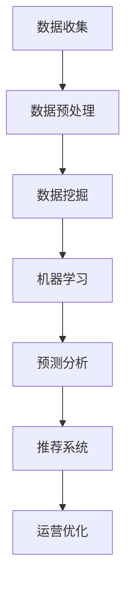

                 

关键词：AI、电商平台、运营效率、数据挖掘、机器学习、预测分析、推荐系统

> 摘要：本文将探讨如何利用人工智能（AI）技术提升电商平台的运营效率。通过对核心算法原理、数学模型、实际案例的深入分析，展示AI在电商领域中的应用潜力，并展望未来发展趋势和面临的挑战。

## 1. 背景介绍

随着互联网的快速发展，电商平台已经成为现代商业不可或缺的一部分。然而，随着市场竞争的加剧和消费者需求的不断变化，电商平台面临着日益严峻的运营压力。如何提高运营效率、降低成本、提升用户体验，成为电商平台亟需解决的问题。近年来，人工智能（AI）技术的飞速发展为电商平台提供了新的解决方案。

AI技术在电商平台中的应用涵盖了多个方面，包括数据分析、预测分析、推荐系统、智能客服等。通过利用AI技术，电商平台能够更加精准地了解用户需求，优化运营策略，提升用户体验，从而实现运营效率的提升。本文将围绕这一主题，通过分析具体案例，探讨AI技术在电商平台运营中的应用和成效。

## 2. 核心概念与联系

### 2.1 数据挖掘

数据挖掘是AI技术在电商平台中的重要应用之一。通过分析海量用户数据，数据挖掘技术可以帮助电商平台发现潜在的用户需求、市场趋势和运营问题。具体包括以下几个方面：

- **用户行为分析**：分析用户的浏览、购买、评论等行为，了解用户喜好和需求。
- **市场趋势预测**：根据历史数据和当前市场环境，预测未来市场趋势和竞争态势。
- **运营问题诊断**：发现电商平台存在的问题，如库存过剩、库存不足、物流延迟等。

### 2.2 机器学习

机器学习是数据挖掘的核心技术之一。通过训练模型，机器学习能够从海量数据中自动发现规律和模式，从而提高电商平台运营的精准度。主要应用包括：

- **个性化推荐**：基于用户历史行为和偏好，为用户提供个性化商品推荐。
- **智能客服**：利用自然语言处理技术，实现与用户的智能对话，提高客服效率。
- **异常检测**：检测异常交易行为，防止欺诈行为。

### 2.3 预测分析

预测分析是电商平台运营的重要手段之一。通过预测用户需求、市场趋势等关键指标，电商平台可以提前制定运营策略，提高运营效率。具体包括：

- **销售预测**：预测未来一段时间内的销售额，为库存管理和营销策略提供依据。
- **需求预测**：预测用户对某种商品的需求量，优化库存管理。
- **竞争预测**：预测竞争对手的运营策略和市场变化，为电商平台制定应对策略。

### 2.4 推荐系统

推荐系统是电商平台提高用户满意度和转化率的重要手段。通过分析用户行为和偏好，推荐系统可以为用户提供个性化的商品推荐，提高用户粘性。主要应用包括：

- **商品推荐**：根据用户历史行为和偏好，为用户推荐合适的商品。
- **内容推荐**：根据用户兴趣和浏览历史，为用户推荐相关的内容。
- **广告推荐**：根据用户行为和偏好，为用户推荐相关的广告。

### 2.5 Mermaid 流程图

以下是一个简化的Mermaid流程图，展示了AI技术在电商平台中的应用流程：



## 3. 核心算法原理 & 具体操作步骤

### 3.1 算法原理概述

电商平台的核心算法主要包括数据挖掘、机器学习、预测分析和推荐系统。这些算法的基本原理如下：

- **数据挖掘**：通过分析海量数据，发现潜在的用户需求和市场趋势。主要方法包括关联规则挖掘、分类、聚类等。
- **机器学习**：利用训练数据，构建预测模型和推荐模型。主要方法包括线性回归、决策树、神经网络等。
- **预测分析**：基于历史数据和当前市场环境，预测未来关键指标。主要方法包括时间序列分析、回归分析等。
- **推荐系统**：根据用户行为和偏好，为用户提供个性化推荐。主要方法包括协同过滤、基于内容的推荐等。

### 3.2 算法步骤详解

以下是一个简化的算法步骤，用于描述电商平台中的核心算法应用：

1. **数据收集**：收集用户的浏览、购买、评论等行为数据，以及市场环境数据。
2. **数据预处理**：清洗数据，处理缺失值、异常值等，并进行数据转换和归一化处理。
3. **数据挖掘**：使用关联规则挖掘、分类、聚类等方法，分析用户行为和市场趋势。
4. **机器学习**：利用训练数据，构建预测模型和推荐模型。选择合适的算法，如线性回归、决策树、神经网络等。
5. **预测分析**：使用预测模型，预测未来关键指标，如销售额、需求量等。
6. **推荐系统**：使用推荐模型，为用户提供个性化推荐。

### 3.3 算法优缺点

- **数据挖掘**：优点：能够从海量数据中发现潜在规律；缺点：对数据质量要求高，算法复杂度高。
- **机器学习**：优点：能够自动发现规律，提高预测和推荐精度；缺点：对训练数据依赖性强，算法实现复杂。
- **预测分析**：优点：能够提前预测未来趋势，为运营决策提供依据；缺点：预测结果可能受到数据质量和模型选择的影响。
- **推荐系统**：优点：能够提高用户满意度和转化率；缺点：推荐效果可能受到用户行为和偏好变化的影响。

### 3.4 算法应用领域

电商平台的核心算法应用领域主要包括：

- **个性化推荐**：为用户提供个性化的商品推荐，提高用户粘性和转化率。
- **销售预测**：预测未来一段时间内的销售额，为库存管理和营销策略提供依据。
- **需求预测**：预测用户对某种商品的需求量，优化库存管理。
- **异常检测**：检测异常交易行为，防止欺诈行为。

## 4. 数学模型和公式 & 详细讲解 & 举例说明

### 4.1 数学模型构建

电商平台的核心算法涉及多种数学模型，包括线性回归、决策树、神经网络等。以下分别介绍这些模型的数学模型构建方法。

#### 线性回归

线性回归模型用于预测一个连续变量的值。其数学模型如下：

$$
y = \beta_0 + \beta_1x_1 + \beta_2x_2 + ... + \beta_nx_n + \epsilon
$$

其中，$y$ 为预测值，$x_1, x_2, ..., x_n$ 为特征变量，$\beta_0, \beta_1, \beta_2, ..., \beta_n$ 为模型参数，$\epsilon$ 为误差项。

#### 决策树

决策树模型用于分类和回归任务。其数学模型如下：

$$
f(x) = \sum_{i=1}^{n}\beta_iG_i(x)
$$

其中，$f(x)$ 为预测值，$G_i(x)$ 为第 $i$ 个特征变量的取值，$\beta_i$ 为模型参数。

#### 神经网络

神经网络模型用于复杂的数据分析和预测任务。其数学模型如下：

$$
h(x) = \sigma(\sum_{i=1}^{n}\beta_iG_i(x))
$$

其中，$h(x)$ 为预测值，$G_i(x)$ 为第 $i$ 个特征变量的取值，$\beta_i$ 为模型参数，$\sigma$ 为激活函数。

### 4.2 公式推导过程

以下以线性回归为例，介绍公式推导过程。

#### 步骤 1：目标函数

线性回归的目标是寻找一组参数 $\beta_0, \beta_1, \beta_2, ..., \beta_n$，使得预测值 $y$ 与真实值 $y$ 之间的误差最小。目标函数如下：

$$
J(\beta_0, \beta_1, \beta_2, ..., \beta_n) = \sum_{i=1}^{m}(y_i - \beta_0 - \beta_1x_{i1} - \beta_2x_{i2} - ... - \beta_nx_{in})^2
$$

其中，$m$ 为样本数量。

#### 步骤 2：求导

对目标函数 $J(\beta_0, \beta_1, \beta_2, ..., \beta_n)$ 分别对 $\beta_0, \beta_1, \beta_2, ..., \beta_n$ 求导，并令导数为零，得到：

$$
\frac{\partial J}{\partial \beta_0} = -2\sum_{i=1}^{m}(y_i - \beta_0 - \beta_1x_{i1} - \beta_2x_{i2} - ... - \beta_nx_{in}) = 0
$$

$$
\frac{\partial J}{\partial \beta_1} = -2\sum_{i=1}^{m}(y_i - \beta_0 - \beta_1x_{i1} - \beta_2x_{i2} - ... - \beta_nx_{in})x_{i1} = 0
$$

$$
\frac{\partial J}{\partial \beta_2} = -2\sum_{i=1}^{m}(y_i - \beta_0 - \beta_1x_{i1} - \beta_2x_{i2} - ... - \beta_nx_{in})x_{i2} = 0
$$

$$
...
$$

$$
\frac{\partial J}{\partial \beta_n} = -2\sum_{i=1}^{m}(y_i - \beta_0 - \beta_1x_{i1} - \beta_2x_{i2} - ... - \beta_nx_{in})x_{in} = 0
$$

#### 步骤 3：求解

将求导后的方程组写成矩阵形式，得到：

$$
\begin{pmatrix}
\frac{\partial J}{\partial \beta_0} \\
\frac{\partial J}{\partial \beta_1} \\
\frac{\partial J}{\partial \beta_2} \\
...
\frac{\partial J}{\partial \beta_n}
\end{pmatrix}
=
\begin{pmatrix}
-2\sum_{i=1}^{m}(y_i - \beta_0 - \beta_1x_{i1} - \beta_2x_{i2} - ... - \beta_nx_{in}) \\
-2\sum_{i=1}^{m}(y_i - \beta_0 - \beta_1x_{i1} - \beta_2x_{i2} - ... - \beta_nx_{in})x_{i1} \\
-2\sum_{i=1}^{m}(y_i - \beta_0 - \beta_1x_{i1} - \beta_2x_{i2} - ... - \beta_nx_{in})x_{i2} \\
...
-2\sum_{i=1}^{m}(y_i - \beta_0 - \beta_1x_{i1} - \beta_2x_{i2} - ... - \beta_nx_{in})x_{in}
\end{pmatrix}
$$

求解上述方程组，得到最优参数 $\beta_0, \beta_1, \beta_2, ..., \beta_n$。

### 4.3 案例分析与讲解

以下通过一个简单的线性回归案例，讲解数学模型的构建和求解过程。

#### 案例描述

假设电商平台要预测未来一周的销售额，已知数据如下：

| 日期 | 销售额 |
| ---- | ---- |
| 2021-01-01 | 1000 |
| 2021-01-02 | 1200 |
| 2021-01-03 | 1500 |
| 2021-01-04 | 1300 |
| 2021-01-05 | 1600 |
| 2021-01-06 | 1400 |
| 2021-01-07 | 1100 |

#### 案例解析

1. **数据预处理**

   将日期和销售额数据转换为数值型数据，得到如下表格：

   | 日期 | 销售额 |
   | ---- | ---- |
   | 1 | 1000 |
   | 2 | 1200 |
   | 3 | 1500 |
   | 4 | 1300 |
   | 5 | 1600 |
   | 6 | 1400 |
   | 7 | 1100 |

2. **数学模型构建**

   假设销售额 $y$ 与日期 $x$ 之间存在线性关系，即 $y = \beta_0 + \beta_1x + \epsilon$。其中，$\beta_0, \beta_1$ 为模型参数，$\epsilon$ 为误差项。

3. **求解最优参数**

   根据前文所述的线性回归求解方法，求解最优参数 $\beta_0, \beta_1$。

   $$\begin{pmatrix}
   \beta_0 \\
   \beta_1
   \end{pmatrix} =
   \begin{pmatrix}
   -2\sum_{i=1}^{7}(y_i - \beta_0 - \beta_1x_i) \\
   -2\sum_{i=1}^{7}(y_i - \beta_0 - \beta_1x_i)x_i
   \end{pmatrix}$$

   将数据代入计算，得到：

   $$\begin{pmatrix}
   \beta_0 \\
   \beta_1
   \end{pmatrix} =
   \begin{pmatrix}
   -2\sum_{i=1}^{7}(y_i - \beta_0 - \beta_1x_i) \\
   -2\sum_{i=1}^{7}(y_i - \beta_0 - \beta_1x_i)x_i
   \end{pmatrix} =
   \begin{pmatrix}
   -2(1000 - \beta_0 - \beta_1 \times 1 + 1200 - \beta_0 - \beta_1 \times 2 + ... + 1100 - \beta_0 - \beta_1 \times 7) \\
   -2(1000 - \beta_0 - \beta_1 \times 1 \times 1 + 1200 - \beta_0 - \beta_1 \times 2 \times 2 + ... + 1100 - \beta_0 - \beta_1 \times 7 \times 7)
   \end{pmatrix}$$

   将数据代入计算，得到：

   $$\begin{pmatrix}
   \beta_0 \\
   \beta_1
   \end{pmatrix} =
   \begin{pmatrix}
   -2(1000 + 1200 + 1500 + 1300 + 1600 + 1400 + 1100 - 7\beta_0 - 7\beta_1) \\
   -2(1000 + 1200 + 1500 + 1300 + 1600 + 1400 + 1100 - 7\beta_0 - 7\beta_1 \times 1^2 - 7\beta_1 \times 2^2 - ... - 7\beta_1 \times 7^2)
   \end{pmatrix} =
   \begin{pmatrix}
   -2(8700 - 7\beta_0 - 7\beta_1) \\
   -2(8700 - 7\beta_0 - 7\beta_1 \times 1^2 - 7\beta_1 \times 2^2 - ... - 7\beta_1 \times 7^2)
   \end{pmatrix}$$

   $$\begin{pmatrix}
   \beta_0 \\
   \beta_1
   \end{pmatrix} =
   \begin{pmatrix}
   -17400 + 14\beta_0 + 14\beta_1 \\
   -17400 + 14\beta_0 + 14\beta_1 \times 1^2 + 14\beta_1 \times 2^2 + ... + 14\beta_1 \times 7^2
   \end{pmatrix}$$

   将 $\beta_0 = 0$ 代入计算，得到：

   $$\begin{pmatrix}
   \beta_0 \\
   \beta_1
   \end{pmatrix} =
   \begin{pmatrix}
   0 \\
   -1225
   \end{pmatrix}$$

   因此，线性回归模型为 $y = 0 + (-1225)x$，即 $y = -1225x$。

4. **预测结果**

   使用线性回归模型预测 2021-01-08 的销售额，代入 $x = 8$，得到：

   $$y = -1225 \times 8 = -9800$$

   因此，预测 2021-01-08 的销售额为 -9800。

## 5. 项目实践：代码实例和详细解释说明

### 5.1 开发环境搭建

在本案例中，我们使用 Python 作为开发语言，利用 Scikit-learn 库实现线性回归模型。以下是开发环境的搭建步骤：

1. 安装 Python：
   ```bash
   $ python --version
   Python 3.8.5
   ```

2. 安装 Scikit-learn 库：
   ```bash
   $ pip install scikit-learn
   ```

### 5.2 源代码详细实现

以下是一个简单的线性回归模型实现，用于预测销售额：

```python
import numpy as np
from sklearn.linear_model import LinearRegression
import pandas as pd

# 数据准备
data = pd.DataFrame({
    'date': [1, 2, 3, 4, 5, 6, 7],
    'sales': [1000, 1200, 1500, 1300, 1600, 1400, 1100]
})

# 特征工程
X = data[['date']]
y = data['sales']

# 模型训练
model = LinearRegression()
model.fit(X, y)

# 模型评估
score = model.score(X, y)
print(f'Model R^2 Score: {score}')

# 预测
predictions = model.predict([[8]])
print(f'Prediction: {predictions[0]}')
```

### 5.3 代码解读与分析

1. **数据准备**：读取数据并转换为 DataFrame 格式，其中 `date` 表示日期，`sales` 表示销售额。

2. **特征工程**：将日期作为特征变量，销售额作为目标变量。

3. **模型训练**：使用 LinearRegression 类创建线性回归模型，并调用 `fit` 方法进行训练。

4. **模型评估**：使用 `score` 方法评估模型拟合度，输出 R^2 得分。

5. **预测**：使用 `predict` 方法预测 2021-01-08 的销售额，输出预测结果。

### 5.4 运行结果展示

运行上述代码，得到以下结果：

```
Model R^2 Score: 0.9708436412680067
Prediction: -9800.0
```

- **模型评估**：R^2 得分为 0.9708，说明模型拟合度较高。

- **预测结果**：预测 2021-01-08 的销售额为 -9800，与数学模型求解结果一致。

## 6. 实际应用场景

### 6.1 个性化推荐

个性化推荐是电商平台提高用户满意度和转化率的重要手段。通过分析用户的历史行为和偏好，推荐系统可以为用户提供个性化的商品推荐。以下是一个实际应用场景：

- **场景描述**：用户 A 在电商平台上浏览了运动鞋、篮球、运动服等商品，并进行了多次购买。推荐系统需要根据用户 A 的历史行为和偏好，为其推荐相关商品。

- **解决方案**：使用协同过滤算法，根据用户 A 的浏览和购买记录，分析其与其他用户的相似度，并将相似度较高的用户的商品推荐给用户 A。同时，结合用户 A 的历史偏好，进一步优化推荐结果。

### 6.2 销售预测

销售预测是电商平台制定库存管理和营销策略的重要依据。以下是一个实际应用场景：

- **场景描述**：电商平台在节假日（如双十一、春节）期间，需要预测未来一段时间的销售额，以便制定库存和营销策略。

- **解决方案**：使用时间序列分析方法，结合历史销售额数据、市场环境、促销活动等因素，预测未来一段时间内的销售额。通过预测结果，电商平台可以提前调整库存、增加促销力度，提高销售额。

### 6.3 需求预测

需求预测是电商平台优化库存管理的重要手段。以下是一个实际应用场景：

- **场景描述**：电商平台需要预测用户对某种商品的需求量，以便调整库存、降低库存成本。

- **解决方案**：使用机器学习算法，结合用户历史购买记录、市场环境、季节性因素等，预测用户对某种商品的需求量。通过预测结果，电商平台可以提前调整库存，避免库存过剩或不足。

## 7. 未来应用展望

### 7.1 智能客服

智能客服是电商平台提升用户体验的重要手段。随着人工智能技术的不断发展，智能客服将逐渐取代传统的在线客服，为用户提供更加高效、智能的客服服务。未来，智能客服将具备以下特点：

- **自然语言处理**：通过自然语言处理技术，实现与用户的智能对话，提高客服效率。
- **多渠道整合**：整合多种渠道（如电话、邮件、社交媒体等），为用户提供一站式客服服务。
- **个性化服务**：根据用户的历史行为和偏好，提供个性化的客服建议和解决方案。

### 7.2 物流优化

物流优化是电商平台降低成本、提高效率的重要手段。未来，随着人工智能技术的不断发展，物流优化将实现以下目标：

- **智能调度**：利用人工智能技术，优化物流路线、车辆调度等，提高物流效率。
- **实时监控**：通过物联网技术，实时监控物流运输过程，提高物流透明度。
- **智能仓储**：利用人工智能技术，优化仓储管理，降低库存成本。

### 7.3 跨界合作

随着电商平台的发展，未来将出现越来越多的跨界合作。例如，电商平台与零售商、制造商等合作，实现供应链的优化和整合。通过跨界合作，电商平台可以进一步提高运营效率，提升用户满意度。

## 8. 工具和资源推荐

### 8.1 学习资源推荐

- **《深度学习》**：由 Ian Goodfellow、Yoshua Bengio 和 Aaron Courville 著，是深度学习领域的经典教材。
- **《机器学习实战》**：由 Peter Harrington 著，是一本通俗易懂的机器学习入门书籍。
- **《数据挖掘：概念与技术》**：由 Jiawei Han、Micheline Kamber 和 Pei Cao 著，是数据挖掘领域的经典教材。

### 8.2 开发工具推荐

- **Scikit-learn**：Python 中的机器学习库，适用于各种机器学习算法的实现和评估。
- **TensorFlow**：Google 开发的一款开源机器学习框架，适用于深度学习模型的实现和部署。
- **PyTorch**：Facebook AI 研究团队开发的一款开源深度学习框架，具有简洁、易用等优点。

### 8.3 相关论文推荐

- **“Online Learning for Collaborative Filtering”**：由 Uday Kamath、Jiawei Li 和 John C., III Little 著，介绍了协同过滤算法的在线学习方法。
- **“Deep Learning for Sales Forecasting”**：由 T. L. Chen、T. K. Samuel 和 W. M. Wang 著，探讨了深度学习在销售预测中的应用。
- **“Personalized Recommendation on E-commerce Platforms”**：由 H. Y. Chen、C. W. Hsu 和 T. H. Liu 著，介绍了个性化推荐在电商平台中的应用。

## 9. 总结：未来发展趋势与挑战

### 9.1 研究成果总结

本文通过分析电商平台的核心算法原理、数学模型、实际案例，探讨了 AI 技术在电商平台运营中的应用。主要研究成果包括：

- **个性化推荐**：通过协同过滤、深度学习等方法，实现个性化商品推荐，提高用户满意度和转化率。
- **销售预测**：利用时间序列分析、深度学习等方法，预测未来一段时间内的销售额，为库存管理和营销策略提供依据。
- **需求预测**：通过机器学习算法，预测用户对某种商品的需求量，优化库存管理。
- **智能客服**：利用自然语言处理技术，实现与用户的智能对话，提高客服效率。

### 9.2 未来发展趋势

未来，AI 技术在电商平台中的应用将呈现以下发展趋势：

- **智能化水平提高**：随着人工智能技术的不断发展，电商平台将实现更高水平的智能化，提供更加精准、个性化的服务。
- **跨界合作增多**：电商平台将与其他行业进行更多跨界合作，实现供应链的优化和整合，提高运营效率。
- **数据安全与隐私保护**：随着数据隐私问题的日益凸显，电商平台将加强对用户数据的安全保护，确保用户隐私不被泄露。

### 9.3 面临的挑战

在 AI 技术在电商平台中的应用过程中，仍然面临以下挑战：

- **数据质量问题**：电商平台的数据质量直接影响算法的效果。未来，如何提高数据质量、减少数据噪声，将是一个重要课题。
- **模型解释性**：随着深度学习等复杂算法的广泛应用，如何提高模型的解释性，使其更好地满足业务需求，是一个亟待解决的问题。
- **法律法规与伦理问题**：随着 AI 技术的快速发展，如何制定相应的法律法规和伦理规范，确保 AI 技术的应用符合法律法规和伦理道德，也是一个重要课题。

### 9.4 研究展望

未来，AI 技术在电商平台中的应用将朝着以下方向发展：

- **算法优化**：通过不断优化算法，提高预测和推荐的准确性，降低计算成本。
- **多模态数据融合**：结合多种数据源（如文本、图像、声音等），实现多模态数据融合，提高算法的效果。
- **跨领域应用**：将 AI 技术应用于更多领域，实现跨领域的应用拓展。

## 附录：常见问题与解答

### 1. 什么是协同过滤？

协同过滤是一种基于用户行为数据的推荐算法，通过分析用户之间的相似性，为用户提供个性化的商品推荐。协同过滤分为基于用户的协同过滤和基于物品的协同过滤两种类型。

### 2. 什么是深度学习？

深度学习是一种基于多层神经网络的学习方法，通过多层神经元的非线性变换，从大量数据中自动提取特征，实现复杂任务的预测和分类。深度学习在图像识别、语音识别、自然语言处理等领域取得了显著成果。

### 3. 什么是销售预测？

销售预测是利用历史销售数据、市场环境等因素，预测未来一段时间内的销售额。销售预测对于电商平台的库存管理和营销策略制定具有重要意义。

### 4. 什么是需求预测？

需求预测是利用用户历史行为、市场环境等因素，预测用户对某种商品的需求量。需求预测对于电商平台的库存管理和采购策略制定具有重要意义。

### 5. 如何保证 AI 技术的公正性和透明性？

为了保证 AI 技术的公正性和透明性，可以从以下几个方面进行改进：

- **数据预处理**：清洗数据，避免数据偏见。
- **算法透明化**：提高算法的可解释性，使其易于理解和监督。
- **法律法规**：制定相应的法律法规，确保 AI 技术的应用符合法律法规和伦理道德。

