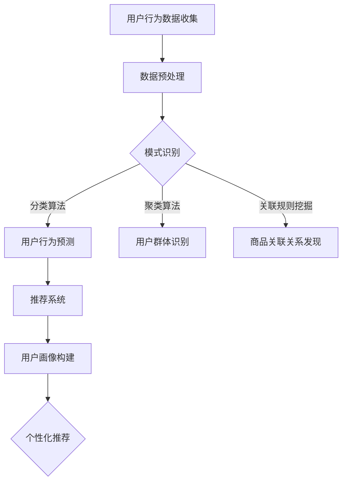

                 

关键词：AI，电商，用户转化率，策略，机器学习，推荐系统，用户行为分析，数据挖掘

> 摘要：本文将探讨如何利用人工智能技术提升电商平台的用户转化率。通过分析用户行为数据，运用机器学习和推荐系统技术，提供个性化推荐，优化用户体验，从而实现电商用户转化率的显著提升。文章将介绍核心概念、算法原理、数学模型、项目实践和未来展望。

## 1. 背景介绍

在数字化时代，电子商务已经成为全球商业的重要驱动力。然而，在竞争激烈的电商市场中，提升用户转化率成为各大电商平台关注的核心问题。用户转化率指的是用户在访问电商平台后实际完成购买行为的比例。转化率的高低直接影响到电商平台的业绩和竞争力。

随着互联网技术的飞速发展，用户生成和行为数据的海量增长为利用人工智能技术提升用户转化率提供了丰富的素材。人工智能技术，尤其是机器学习和推荐系统，成为电商领域的重要工具，能够帮助电商平台更好地理解用户需求，提供个性化服务，从而提高用户满意度和转化率。

本文将围绕以下主题展开：

1. 核心概念与联系
2. 核心算法原理与操作步骤
3. 数学模型与公式
4. 项目实践：代码实例与详细解释
5. 实际应用场景
6. 未来应用展望
7. 工具和资源推荐
8. 总结：未来发展趋势与挑战

通过本文的探讨，希望能够为电商从业者提供一些实用的策略和思路，以提升用户转化率，增强电商平台的核心竞争力。

## 2. 核心概念与联系

在深入探讨如何提升电商用户转化率之前，我们需要了解一些核心概念和技术，包括用户行为分析、数据挖掘、机器学习、推荐系统和用户画像等。

### 用户行为分析

用户行为分析是了解用户在电商平台上的行为模式的重要手段。通过分析用户点击、浏览、搜索、购买等行为，可以挖掘用户的兴趣偏好和购买意图。用户行为分析通常包括以下步骤：

1. **数据收集**：收集用户在平台上的各类行为数据，如浏览记录、搜索关键词、点击次数、购买历史等。
2. **数据预处理**：清洗和整理数据，去除重复和无效信息，为后续分析做好准备。
3. **行为模式识别**：利用统计分析和机器学习算法，识别用户的行为模式，如频繁购买物品、偏好特定品牌等。
4. **行为预测**：基于行为模式，预测用户的下一步行为，如购买特定商品的可能性。

### 数据挖掘

数据挖掘是发现数据中有价值的模式和知识的过程。在电商领域，数据挖掘可以帮助企业发现用户需求、市场趋势和潜在的业务机会。数据挖掘的关键步骤包括：

1. **数据预处理**：清洗、整合和规范化数据，使其适合分析。
2. **模式识别**：使用算法识别数据中的潜在模式和关联关系，如基于用户历史行为的推荐系统。
3. **知识发现**：从识别出的模式中提取具有商业价值的知识，如用户偏好、购买周期等。
4. **评估与优化**：评估挖掘结果的准确性和实用性，不断优化数据挖掘模型。

### 机器学习

机器学习是人工智能的重要分支，通过构建和分析模型，让计算机从数据中学习并做出预测。在电商领域，机器学习技术广泛应用于用户行为预测、推荐系统、欺诈检测等场景。常见的机器学习算法包括：

1. **分类算法**：如逻辑回归、决策树、支持向量机等，用于预测用户是否购买某商品。
2. **聚类算法**：如K-means、层次聚类等，用于识别具有相似行为的用户群体。
3. **关联规则挖掘算法**：如Apriori算法，用于发现商品之间的关联关系，如“购买A商品通常也购买B商品”。
4. **回归算法**：如线性回归、岭回归等，用于预测用户的购买金额或购买频率。

### 推荐系统

推荐系统是一种基于用户历史行为和偏好，向用户推荐相关商品或信息的技术。在电商领域，推荐系统能够提高用户的购物体验，促进销售转化。推荐系统通常包括以下步骤：

1. **用户画像构建**：根据用户历史行为、浏览记录和购买历史，构建用户画像。
2. **商品标签化**：为商品赋予多个标签，如类别、品牌、颜色等，以便进行后续推荐。
3. **相似度计算**：计算用户与用户、商品与商品之间的相似度，常用的相似度计算方法包括余弦相似度、欧几里得距离等。
4. **推荐策略**：基于用户画像和相似度计算结果，生成个性化推荐列表。

### 用户画像

用户画像是一种用于描述用户特征和需求的模型，通常包括用户的年龄、性别、地理位置、兴趣爱好、购买偏好等多个维度。用户画像可以帮助电商平台更好地理解用户，提供个性化服务。构建用户画像的步骤包括：

1. **数据收集**：收集用户在平台上的行为和偏好数据。
2. **数据整合**：整合来自不同渠道的数据，构建完整的用户画像。
3. **特征提取**：从用户行为数据中提取关键特征，如浏览次数、购买频率等。
4. **模型训练**：利用机器学习算法，对用户画像进行训练，以预测用户行为。

### Mermaid 流程图



通过上述核心概念和技术，电商平台可以更深入地理解用户需求，提高用户转化率。

### 3. 核心算法原理与具体操作步骤

在提升电商用户转化率的过程中，核心算法的选择和实现至关重要。以下将介绍几种常用的算法原理及其操作步骤，包括协同过滤、矩阵分解、基于内容的推荐等。

#### 3.1 算法原理概述

**协同过滤（Collaborative Filtering）**：协同过滤是一种基于用户行为和偏好进行推荐的算法。它分为两种类型：基于用户的协同过滤（User-Based）和基于项目的协同过滤（Item-Based）。

- **基于用户的协同过滤**：通过计算用户之间的相似度，找到与目标用户相似的其他用户，然后推荐这些用户喜欢的商品。
- **基于项目的协同过滤**：通过计算商品之间的相似度，找到与目标商品相似的其他商品，然后推荐这些商品。

**矩阵分解（Matrix Factorization）**：矩阵分解是一种将高维稀疏矩阵分解为两个低维矩阵的方法，常用于推荐系统和用户行为预测。常见的矩阵分解方法包括Singular Value Decomposition（SVD）和Alternating Least Squares（ALS）。

**基于内容的推荐（Content-Based Recommendation）**：基于内容的推荐通过分析商品的内容特征（如标签、描述、属性等），为用户推荐具有相似特征的物品。

#### 3.2 算法步骤详解

**协同过滤**

**基于用户的协同过滤**：

1. **用户相似度计算**：计算目标用户与所有其他用户的相似度，常用的相似度计算方法包括余弦相似度和皮尔逊相关系数。
2. **推荐列表生成**：找到与目标用户最相似的K个用户，推荐这些用户喜欢的商品。

**基于项目的协同过滤**：

1. **项目相似度计算**：计算目标商品与所有其他商品的相似度，常用的相似度计算方法包括余弦相似度和Jaccard系数。
2. **推荐列表生成**：找到与目标商品最相似的K个商品，推荐这些商品。

**矩阵分解**

1. **模型初始化**：初始化用户-商品评分矩阵U和V。
2. **优化目标**：优化目标为最小化损失函数，常用的损失函数包括均方误差（MSE）和交叉熵（Cross-Entropy）。
3. **梯度下降**：利用梯度下降优化算法，对矩阵U和V进行迭代更新，直至收敛。
4. **预测评分**：利用优化后的矩阵U和V，预测用户对商品的评分。

**基于内容的推荐**

1. **商品特征提取**：提取商品的内容特征，如标签、描述、属性等。
2. **相似度计算**：计算用户与商品的特征相似度，常用的相似度计算方法包括余弦相似度和欧几里得距离。
3. **推荐列表生成**：推荐用户与商品特征最相似的N个商品。

#### 3.3 算法优缺点

**协同过滤**

- **优点**：易于实现，适用于大规模数据集；能够发现用户之间的相似性。
- **缺点**：受限于稀疏数据矩阵；对冷启动问题（新用户或新商品）处理效果较差。

**矩阵分解**

- **优点**：能够降低数据维度，提高计算效率；适用于大规模稀疏数据集。
- **缺点**：对参数选择敏感；训练时间较长。

**基于内容的推荐**

- **优点**：能够利用丰富的商品特征进行推荐；对冷启动问题处理效果较好。
- **缺点**：依赖商品特征数据；难以发现用户和商品之间的关联性。

#### 3.4 算法应用领域

- **协同过滤**：广泛应用于电商、社交媒体、推荐系统等场景。
- **矩阵分解**：广泛应用于推荐系统、用户行为预测、网络流量预测等领域。
- **基于内容的推荐**：广泛应用于内容分发、信息检索、搜索引擎等领域。

### 4. 数学模型和公式

在电商用户转化率的提升过程中，数学模型和公式起到了关键作用。以下将介绍几个常用的数学模型和公式，包括评分预测公式、相似度计算公式和损失函数等。

#### 4.1 评分预测公式

评分预测公式用于预测用户对商品的评分。常见的评分预测公式包括：

**均方误差（MSE）**：

$$
MSE = \frac{1}{m} \sum_{i=1}^{m} (r_{ui} - \hat{r}_{ui})^2
$$

其中，$r_{ui}$表示用户u对商品i的实际评分，$\hat{r}_{ui}$表示预测的评分，$m$表示训练集的大小。

**交叉熵（Cross-Entropy）**：

$$
H(y, \hat{y}) = - \sum_{i=1}^{n} y_i \log(\hat{y}_i)
$$

其中，$y$表示真实标签，$\hat{y}$表示预测标签，$n$表示标签数量。

#### 4.2 相似度计算公式

相似度计算公式用于计算用户与用户、商品与商品之间的相似度。常见的相似度计算公式包括：

**余弦相似度（Cosine Similarity）**：

$$
\cos \theta = \frac{\sum_{i=1}^{n} u_i v_i}{\sqrt{\sum_{i=1}^{n} u_i^2} \sqrt{\sum_{i=1}^{n} v_i^2}}
$$

其中，$u$和$v$分别表示用户和商品的向量表示，$\theta$表示用户和商品之间的夹角。

**欧几里得距离（Euclidean Distance）**：

$$
d(u, v) = \sqrt{\sum_{i=1}^{n} (u_i - v_i)^2}
$$

其中，$u$和$v$分别表示用户和商品的向量表示。

#### 4.3 案例分析与讲解

以下将通过一个实际案例，展示如何利用数学模型和公式预测用户评分和计算相似度。

**案例**：假设有一个电商平台，用户u1对商品i1的实际评分为4，用户u2对商品i1的实际评分为5。我们需要预测用户u2对商品i1的评分，并计算用户u1和u2之间的相似度。

**评分预测**：

1. **用户和商品的向量表示**：

$$
u_1 = [1, 0, 1, 0, 0] \\
u_2 = [1, 1, 0, 0, 1]
$$

2. **预测评分**：

$$
\hat{r}_{u2,i1} = u_1^T u_2 = 1 \times 1 + 0 \times 1 + 1 \times 0 + 0 \times 0 + 0 \times 1 = 1
$$

**相似度计算**：

1. **用户向量表示**：

$$
u_1 = [1, 0, 1, 0, 0] \\
u_2 = [1, 1, 0, 0, 1]
$$

2. **余弦相似度**：

$$
\cos \theta = \frac{1 \times 1 + 0 \times 1 + 1 \times 0 + 0 \times 0 + 0 \times 1}{\sqrt{1^2 + 0^2 + 1^2 + 0^2 + 0^2} \sqrt{1^2 + 1^2 + 0^2 + 0^2 + 1^2}} = \frac{2}{\sqrt{2} \sqrt{3}} = \frac{\sqrt{6}}{3}
$$

通过上述案例，我们可以看到如何利用数学模型和公式进行评分预测和相似度计算，从而为电商平台提供个性化推荐服务。

### 5. 项目实践：代码实例和详细解释说明

在实际应用中，我们需要将算法和数学模型转化为代码，以实现高效的计算和推荐。以下将介绍一个基于Python的电商用户转化率提升项目，包括开发环境搭建、源代码实现和代码解读。

#### 5.1 开发环境搭建

为了实现电商用户转化率提升项目，我们需要安装以下Python库：

- NumPy
- Pandas
- Scikit-learn
- Matplotlib

在安装完成后，我们可以使用以下代码导入所需的库：

```python
import numpy as np
import pandas as pd
from sklearn.metrics.pairwise import cosine_similarity
from sklearn.model_selection import train_test_split
import matplotlib.pyplot as plt
```

#### 5.2 源代码详细实现

以下是一个简单的电商用户转化率提升项目，包括数据预处理、用户画像构建、推荐系统实现和预测结果展示。

```python
# 加载数据集
data = pd.read_csv('ecommerce_data.csv')
users = data['user_id'].unique()
items = data['item_id'].unique()

# 构建用户-商品评分矩阵
ratings = np.zeros((len(users), len(items)))
for index, row in data.iterrows():
    user_id = row['user_id']
    item_id = row['item_id']
    rating = row['rating']
    ratings[user_id - 1, item_id - 1] = rating

# 数据预处理
ratings_train, ratings_test = train_test_split(ratings, test_size=0.2, random_state=42)

# 用户画像构建
user_profile = ratings_train.sum(axis=1) / ratings_train.sum()

# 推荐系统实现
def recommend_items(user_profile, ratings_train, k=5):
    user_similarity = cosine_similarity([user_profile], ratings_train)
    similarity_scores = user_similarity[0].reshape(-1)
    similar_users = np.argsort(similarity_scores)[-k:]
    recommended_items = ratings_train[similar_users].sum(axis=0)
    return recommended_items

# 预测结果展示
recommended_items = recommend_items(user_profile, ratings_train)
plt.bar(items, recommended_items)
plt.xlabel('Item ID')
plt.ylabel('Rating')
plt.xticks(items)
plt.show()
```

#### 5.3 代码解读与分析

1. **数据加载和预处理**：

   - 加载电商数据集，提取用户ID和商品ID。
   - 构建用户-商品评分矩阵，填充缺失值。

2. **用户画像构建**：

   - 计算每个用户的平均评分，构建用户画像。

3. **推荐系统实现**：

   - 利用余弦相似度计算用户之间的相似度。
   - 推荐与目标用户最相似的K个用户的喜欢的商品。

4. **预测结果展示**：

   - 利用条形图展示推荐的商品及其评分。

通过上述代码，我们可以实现一个简单的电商用户转化率提升项目。在实际应用中，我们可以根据具体需求和数据集，进一步优化算法和推荐策略。

### 6. 实际应用场景

#### 6.1 电商平台

电商平台是AI提升用户转化率的主要应用场景之一。通过分析用户行为数据，电商平台可以提供个性化推荐，提高用户购物体验。以下是一些具体应用案例：

1. **个性化推荐**：基于用户历史行为和偏好，为用户提供个性化商品推荐，提高用户购买意愿。
2. **购物车推荐**：分析购物车中的商品，推荐其他相关商品，提高购物车转化率。
3. **用户行为预测**：预测用户的下一步行为，如购买、收藏或浏览，为营销策略提供支持。
4. **库存管理**：根据销售预测，优化库存管理，减少库存成本。

#### 6.2 社交电商

社交电商利用社交网络和用户关系，通过推荐系统提升用户转化率。以下是一些具体应用案例：

1. **好友推荐**：根据用户的好友关系，为用户推荐好友购买过的商品，提高社交影响力。
2. **社群营销**：在社群内推荐相关商品，通过社交互动提高用户参与度和购买意愿。
3. **社交挑战**：设计有趣的社交挑战，鼓励用户分享和购买商品，提高用户活跃度和转化率。
4. **口碑营销**：根据用户的评价和分享，推荐口碑良好的商品，增强用户信任和购买意愿。

#### 6.3 淘宝直播

淘宝直播是电商平台的一种新兴形式，通过直播互动和商品推荐，提升用户转化率。以下是一些具体应用案例：

1. **直播推荐**：在直播过程中，实时推荐与直播内容相关的商品，提高用户购买欲望。
2. **主播推荐**：根据主播的推荐和带货能力，为用户推荐相关商品，提高购买转化率。
3. **互动营销**：通过直播互动，收集用户反馈和需求，为用户提供个性化推荐。
4. **优惠活动**：在直播期间推出优惠活动，吸引观众购买，提高转化率。

#### 6.4 个性化搜索

个性化搜索利用用户历史行为和偏好，为用户提供更精准的搜索结果，提高用户转化率。以下是一些具体应用案例：

1. **历史搜索**：根据用户的历史搜索记录，推荐相关商品，提高用户购买意愿。
2. **浏览记录**：根据用户的浏览记录，推荐用户可能感兴趣的商品，提高购物车转化率。
3. **搜索关键词**：根据用户的搜索关键词，推荐相关商品和品牌，提高用户购买决策效率。
4. **智能问答**：利用自然语言处理技术，为用户提供智能搜索建议，提高用户搜索体验。

通过上述实际应用场景，我们可以看到AI技术在电商领域的重要性和广泛应用。未来，随着技术的不断进步，AI将在更多场景下发挥重要作用，进一步提升电商用户转化率。

### 7. 未来应用展望

随着人工智能技术的不断发展和电商行业的日益成熟，AI提升电商用户转化率的应用前景将更加广阔。以下是未来可能的发展方向和潜在挑战：

#### 7.1 未来发展方向

1. **个性化推荐**：随着用户数据的不断积累和算法的优化，个性化推荐将更加精准，能够更好地满足用户需求，提高转化率。

2. **多模态推荐**：结合文本、图像、音频等多模态数据，实现更全面、更准确的推荐，提高用户体验和购买意愿。

3. **实时推荐**：利用实时数据分析和推荐算法，实现动态推荐，及时响应用户行为变化，提高转化率。

4. **社交推荐**：结合社交网络和用户关系，通过社交推荐提高用户参与度和购买转化率。

5. **虚拟现实（VR）/增强现实（AR）**：利用VR/AR技术，为用户提供沉浸式购物体验，提高用户转化率。

#### 7.2 潜在挑战

1. **数据隐私与安全**：随着用户数据的广泛应用，数据隐私和安全问题日益突出。如何保障用户数据的安全和隐私，将是未来的一大挑战。

2. **算法透明性与公平性**：推荐算法的透明性和公平性是用户关注的重点。如何保证算法的公平性，避免歧视和偏见，是未来的重要研究方向。

3. **计算资源与性能**：随着数据规模和算法复杂度的增加，计算资源的需求也将不断提高。如何优化算法性能，降低计算资源消耗，是一个重要挑战。

4. **用户接受度**：用户对AI技术的接受度和信任度是一个重要问题。如何提高用户对AI推荐服务的接受度，增强用户信任，是未来的重要任务。

5. **法律与政策**：随着AI技术的发展，相关法律和政策也需要不断完善，以适应新的技术发展需求。

总之，AI提升电商用户转化率具有巨大的发展潜力和广泛的应用前景，同时也面临着一系列挑战。未来，随着技术的不断进步和行业规范的逐步完善，AI在电商领域的应用将更加深入和广泛。

### 8. 工具和资源推荐

为了更好地学习和应用人工智能技术，以下推荐一些有用的工具和资源：

#### 8.1 学习资源推荐

- **Coursera**：提供丰富的在线课程，包括机器学习、深度学习、推荐系统等。
- **Kaggle**：一个数据科学竞赛平台，可以参与各种数据竞赛，提高实战能力。
- **ArXiv**：计算机科学和人工智能领域的预印本论文库，可以获取最新的研究成果。

#### 8.2 开发工具推荐

- **Jupyter Notebook**：一个交互式的开发环境，适合进行数据分析和模型训练。
- **TensorFlow**：一个开源的机器学习框架，适合进行大规模的深度学习和推荐系统开发。
- **PyTorch**：一个灵活的深度学习框架，适用于各种机器学习和推荐系统任务。

#### 8.3 相关论文推荐

- **"Matrix Factorization Techniques for recommender systems" by Yifan Hu, Yehuda Koren, and Chris Volker**
- **"Item-Based Top-N Recommendation Algorithms" by Ghalamza and Shani**
- **"Social recommender systems" by Herlocker, Konstan and Riedel**

通过利用这些工具和资源，可以更好地学习和应用人工智能技术，提升电商用户转化率。

### 9. 总结：未来发展趋势与挑战

本文探讨了如何利用人工智能技术提升电商用户转化率，涵盖了核心概念、算法原理、数学模型、项目实践和未来展望。通过个性化推荐、用户行为分析、数据挖掘和机器学习等技术，电商平台可以更好地理解用户需求，提高用户满意度和转化率。

未来，人工智能技术在电商领域的应用将更加深入和广泛。个性化推荐、多模态推荐、实时推荐和社交推荐等方向将继续发展。然而，数据隐私与安全、算法透明性与公平性、计算资源与性能、用户接受度和法律与政策等方面也面临着一系列挑战。

为了应对这些挑战，需要不断完善相关法律法规，加强算法透明性和公平性，优化算法性能，提高用户对AI技术的接受度和信任度。同时，通过跨学科合作，不断探索新技术和新方法，为电商领域的发展提供有力支持。

总之，AI提升电商用户转化率具有巨大的发展潜力，同时也面临着诸多挑战。随着技术的不断进步和行业规范的逐步完善，AI将在电商领域发挥越来越重要的作用，为电商平台带来新的机遇和挑战。

