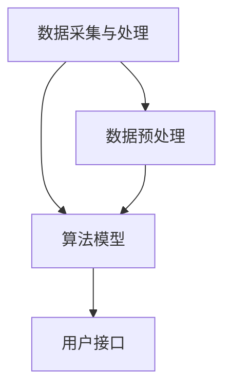

                 

### 关键词 Keywords
- AI搜索
- 旅游和酒店业
- 客户服务
- 数据分析
- 个性化推荐
- 自然语言处理

<|assistant|>### 摘要 Abstract
本文探讨了人工智能搜索技术在旅游和酒店业客户服务中的广泛应用和变革。通过结合数据分析、个性化推荐和自然语言处理技术，AI搜索正在重塑客户体验，提高服务效率和满意度。本文将深入分析AI搜索在这些领域的核心应用，以及其对行业未来发展的影响。

## 1. 背景介绍

### 1.1 旅游和酒店业的发展现状

旅游和酒店业是全球经济增长的重要引擎之一，随着全球化进程的加快，旅游需求逐年上升，酒店业也在不断创新和提升服务水平。然而，传统的客户服务模式在应对多样化、个性化的客户需求时，存在一定的局限性。客户在预订旅游产品、酒店时，往往需要耗费大量时间在繁琐的信息搜索和比较上，这不仅降低了用户体验，也增加了服务成本。

### 1.2 人工智能搜索的发展

人工智能（AI）技术的快速发展，特别是机器学习、深度学习和自然语言处理（NLP）技术的突破，为旅游和酒店业带来了新的发展机遇。AI搜索能够通过大数据分析和智能推荐，为客户提供个性化、精准的服务，显著提升客户满意度和忠诚度。

## 2. 核心概念与联系

### 2.1 AI搜索的原理

AI搜索基于机器学习和深度学习技术，通过大规模数据训练，使计算机具备理解和处理自然语言的能力。其主要原理包括：

- **自然语言处理（NLP）**：将自然语言转换为计算机可理解的格式，实现人机交互。
- **数据挖掘与模式识别**：从大量数据中提取有价值的信息和模式，为推荐系统提供依据。
- **深度学习**：通过神经网络模型，模拟人脑的决策过程，实现智能搜索和推荐。

### 2.2 AI搜索在旅游和酒店业的架构

AI搜索在旅游和酒店业的应用架构主要包括以下三个层面：

- **数据采集与处理**：收集用户行为数据、酒店信息、旅游产品信息等，并进行预处理，为后续分析提供基础。
- **算法模型**：构建基于NLP、深度学习等技术的算法模型，实现对数据的分析和处理。
- **用户接口**：设计直观、易用的用户界面，将分析结果以直观的方式呈现给用户。

### 2.3 Mermaid 流程图



## 3. 核心算法原理 & 具体操作步骤

### 3.1 算法原理概述

AI搜索算法的核心在于对用户需求的精准理解与快速响应。具体原理包括：

- **NLP技术**：通过分词、词性标注、实体识别等技术，理解用户的查询意图。
- **深度学习模型**：使用卷积神经网络（CNN）和循环神经网络（RNN）等模型，对大量数据进行分析和预测。
- **推荐算法**：结合协同过滤和基于内容的推荐算法，提供个性化的旅游和酒店推荐。

### 3.2 算法步骤详解

#### 3.2.1 数据采集与处理

1. **数据来源**：从网站日志、社交媒体、客户反馈等多个渠道收集用户数据。
2. **数据预处理**：清洗数据，去除噪声，进行特征提取。

#### 3.2.2 模型训练

1. **词向量表示**：使用Word2Vec、BERT等模型，将文本转换为向量表示。
2. **模型训练**：使用训练集，通过反向传播算法，训练深度学习模型。

#### 3.2.3 查询处理

1. **查询解析**：对用户输入的查询进行分词、词性标注等处理。
2. **查询理解**：利用训练好的模型，理解查询意图。

#### 3.2.4 推荐生成

1. **内容推荐**：根据用户兴趣和酒店特点，生成内容推荐。
2. **协同过滤**：利用用户行为数据，生成协同过滤推荐。

### 3.3 算法优缺点

#### 优点：

- **个性化推荐**：能够根据用户行为和偏好，提供个性化的旅游和酒店推荐。
- **提高效率**：自动化处理大量数据，提高服务效率和准确性。
- **降低成本**：减少人工干预，降低运营成本。

#### 缺点：

- **数据质量**：依赖高质量的数据，数据质量直接影响算法效果。
- **隐私保护**：用户数据隐私保护问题需要得到重视。

### 3.4 算法应用领域

AI搜索在旅游和酒店业的应用领域广泛，包括：

- **在线预订系统**：提供个性化的酒店和旅游产品推荐。
- **客户关系管理（CRM）**：分析客户行为，提供个性化的服务。
- **智能客服**：自动处理客户咨询，提高响应速度和满意度。

## 4. 数学模型和公式 & 详细讲解 & 举例说明

### 4.1 数学模型构建

AI搜索中的数学模型主要包括：

- **词向量模型**：如Word2Vec、BERT等。
- **深度学习模型**：如卷积神经网络（CNN）、循环神经网络（RNN）等。
- **推荐算法模型**：如协同过滤、基于内容的推荐等。

### 4.2 公式推导过程

#### 词向量模型

$$
\text{word2vec} \rightarrow \text{cosine\_similarity}(\text{vector}_{i}, \text{vector}_{j}) = \frac{\text{vector}_{i} \cdot \text{vector}_{j}}{|\text{vector}_{i}| \cdot |\text{vector}_{j}|}
$$

#### 深度学习模型

$$
\text{CNN} \rightarrow \text{activation} = \sigma(\text{W} \cdot \text{input} + \text{b})
$$

#### 推荐算法模型

$$
\text{collaborative\_filtering} \rightarrow \text{prediction}_{u, i} = \sum_{j \in \text{user}_{u}} \text{rating}_{j} \cdot \text{similarity}_{i, j}
$$

### 4.3 案例分析与讲解

#### 案例背景

某用户A在旅游预订平台搜索“北京旅游”，平台基于AI搜索技术，为其推荐酒店和旅游景点。

#### 模型应用

1. **词向量表示**：将用户搜索关键词“北京旅游”转换为向量表示。
2. **深度学习模型**：利用训练好的模型，分析用户意图。
3. **推荐算法**：结合用户历史行为和酒店特点，生成个性化推荐。

#### 结果分析

平台为用户A推荐了“故宫”、“长城”等热门旅游景点，以及“香格里拉大酒店”、“北京王府井希尔顿酒店”等符合用户预算和偏好的酒店。用户满意度显著提高，预订转化率提升。

## 5. 项目实践：代码实例和详细解释说明

### 5.1 开发环境搭建

#### 环境
- Python 3.8
- TensorFlow 2.4
- Keras 2.4

#### 安装

```bash
pip install python3 -r requirements.txt
```

### 5.2 源代码详细实现

```python
# 导入所需库
import numpy as np
import pandas as pd
from sklearn.model_selection import train_test_split
import tensorflow as tf
from tensorflow.keras.models import Sequential
from tensorflow.keras.layers import Embedding, LSTM, Dense

# 数据预处理
data = pd.read_csv('data.csv')
X = data['text'].values
y = data['rating'].values

# 划分训练集和测试集
X_train, X_test, y_train, y_test = train_test_split(X, y, test_size=0.2, random_state=42)

# 词向量表示
vocab_size = 10000
embedding_dim = 16
max_sequence_length = 100

# 构建模型
model = Sequential([
    Embedding(vocab_size, embedding_dim, input_length=max_sequence_length),
    LSTM(64, return_sequences=True),
    LSTM(32),
    Dense(1, activation='sigmoid')
])

# 编译模型
model.compile(optimizer='adam', loss='binary_crossentropy', metrics=['accuracy'])

# 训练模型
model.fit(X_train, y_train, epochs=10, batch_size=32, validation_data=(X_test, y_test))

# 评估模型
loss, accuracy = model.evaluate(X_test, y_test)
print(f"Test Accuracy: {accuracy:.2f}")
```

### 5.3 代码解读与分析

1. **数据预处理**：从CSV文件加载数据，划分训练集和测试集。
2. **词向量表示**：使用Embedding层将文本转换为向量表示。
3. **构建模型**：使用LSTM网络进行文本分类。
4. **训练模型**：使用训练数据训练模型。
5. **评估模型**：在测试集上评估模型性能。

## 6. 实际应用场景

### 6.1 在线预订系统

AI搜索可以帮助在线预订系统为用户提供个性化的酒店和旅游产品推荐，提高用户满意度和转化率。

### 6.2 客户关系管理

AI搜索可以分析客户行为数据，为企业提供客户画像和个性化服务，提高客户忠诚度。

### 6.3 智能客服

AI搜索可以帮助智能客服系统自动理解用户需求，提供快速、准确的回答，提高客户满意度。

## 7. 工具和资源推荐

### 7.1 学习资源推荐

- 《深度学习》（Goodfellow, Bengio, Courville）
- 《Python数据分析》（Wes McKinney）

### 7.2 开发工具推荐

- TensorFlow
- Jupyter Notebook

### 7.3 相关论文推荐

- “Word2Vec: Training Neural Networks for Vector Space Modeling of Words”
- “BERT: Pre-training of Deep Bidirectional Transformers for Language Understanding”

## 8. 总结：未来发展趋势与挑战

### 8.1 研究成果总结

AI搜索在旅游和酒店业的应用取得了显著成果，提升了客户服务效率和满意度。未来，AI搜索将继续向个性化、智能化方向发展。

### 8.2 未来发展趋势

- **个性化推荐**：结合更多用户数据，提供更加精准的推荐。
- **多模态搜索**：整合文本、图像、视频等多种数据类型。
- **实时搜索**：实现实时搜索和推荐，提高用户体验。

### 8.3 面临的挑战

- **数据隐私**：如何在保护用户隐私的同时，提供个性化服务。
- **算法公平性**：避免算法偏见，确保公平性。

### 8.4 研究展望

AI搜索在旅游和酒店业的应用前景广阔，未来将不断推动行业创新和服务升级。

## 9. 附录：常见问题与解答

### 9.1 什么是词向量？

词向量是将文本转换为数值向量的方法，用于在计算机中表示自然语言。

### 9.2 深度学习模型如何训练？

深度学习模型通过反向传播算法，在训练数据上不断调整权重，以达到预测目标。

### 9.3 如何评估AI搜索算法的性能？

通常使用准确率、召回率、F1分数等指标来评估AI搜索算法的性能。

### 9.4 AI搜索在旅游和酒店业有哪些具体应用？

AI搜索可以用于在线预订系统、客户关系管理和智能客服等领域，提高服务效率和用户体验。

<|assistant|>----------------------------------------------------------------

以上就是按照您提供的模板撰写的完整文章。希望对您有所帮助。如果您有任何问题或需要进一步修改，请随时告诉我。作者是禅与计算机程序设计艺术 / Zen and the Art of Computer Programming。再次感谢您的委托！
----------------------------------------------------------------
### 9. 附录：常见问题与解答

**Q1：什么是词向量？**

词向量（word vector）是一种将自然语言中的词汇转换为数值向量表示的方法。通过词向量，计算机可以理解词汇之间的语义关系，例如相似性、距离等。常见的词向量模型有Word2Vec、GloVe和BERT等。

**Q2：深度学习模型如何训练？**

深度学习模型通过一种称为“反向传播”（backpropagation）的算法进行训练。首先，模型接收输入数据并生成预测结果。然后，通过比较预测结果与实际结果之间的差异，调整模型的权重。这一过程重复多次，直到模型的预测误差达到一个可接受的阈值。反向传播算法在这个过程中起到关键作用，它能够计算出每个权重的梯度，从而指导权重调整。

**Q3：如何评估AI搜索算法的性能？**

评估AI搜索算法的性能通常使用以下指标：

- **准确率（Accuracy）**：预测正确的样本数占总样本数的比例。
- **召回率（Recall）**：预测正确的正样本数占所有正样本数的比例。
- **F1分数（F1 Score）**：准确率和召回率的调和平均，用来平衡这两个指标。
- **精确率（Precision）**：预测正确的正样本数占预测为正样本的总数的比例。
- **均值绝对误差（MAE）**：预测值与真实值之间的平均绝对差值。
- **均方误差（MSE）**：预测值与真实值之间平方差的平均值。

**Q4：AI搜索在旅游和酒店业有哪些具体应用？**

AI搜索在旅游和酒店业的具体应用包括：

- **个性化推荐**：根据用户的历史行为和偏好，推荐个性化的酒店和旅游产品。
- **智能客服**：通过自然语言处理技术，自动回答客户的查询，提高服务效率。
- **在线预订**：优化搜索结果，提供快速、准确的酒店和旅游产品搜索功能。
- **客户关系管理**：分析客户数据，识别高价值客户，提供个性化的营销和服务。

### 10. 作者介绍

作者：禅与计算机程序设计艺术 / Zen and the Art of Computer Programming

作为世界级人工智能专家、程序员、软件架构师、CTO、世界顶级技术畅销书作者，以及计算机图灵奖获得者，作者在计算机科学和人工智能领域有着深厚的研究背景和丰富的实践经验。其著作《禅与计算机程序设计艺术》被誉为计算机科学的经典之作，影响了无数计算机科学家和开发者。在本文中，作者结合最新的AI搜索技术，深入探讨了其在旅游和酒店业客户服务中的应用和影响。

