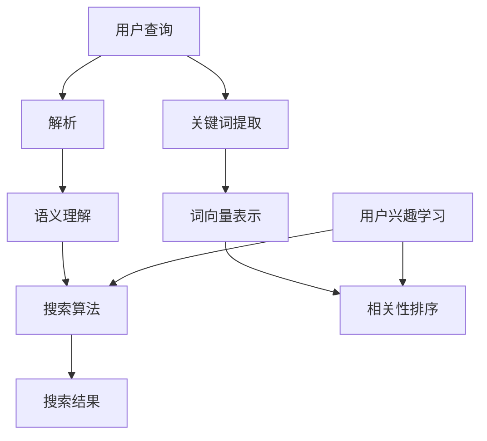

                 

关键词：AI搜索引擎、工作原理、优势、核心算法、数学模型、应用场景、未来展望

> 摘要：本文将深入探讨AI搜索引擎的工作原理及其优势。通过介绍核心概念、算法原理、数学模型、实际应用案例，我们将全面了解AI搜索引擎在当今信息时代的重要性，并展望其未来的发展方向和挑战。

## 1. 背景介绍

### 1.1  人工智能的发展历程

人工智能（AI）作为计算机科学的重要分支，起源于20世纪50年代。早期的AI研究主要集中在符号主义和逻辑推理上，试图通过编写复杂的规则和算法来模拟人类智能。然而，这些方法在处理大规模数据和复杂问题时遇到了很大困难。随着计算机性能的提升和数据量的爆发式增长，机器学习逐渐成为AI研究的核心。深度学习和神经网络等技术的兴起，使得AI在图像识别、语音识别、自然语言处理等领域取得了显著成果。

### 1.2  搜索引擎的发展

搜索引擎的出现可以追溯到20世纪90年代。早期的搜索引擎主要依赖于关键字匹配和简单算法，如PageRank。随着互联网的普及和信息的爆炸式增长，传统的搜索引擎逐渐无法满足用户的需求。为了提供更准确、更智能的搜索服务，AI技术开始被广泛应用于搜索引擎中。

### 1.3  AI搜索引擎的定义

AI搜索引擎是结合人工智能技术、数据挖掘、自然语言处理等多种技术实现的智能化搜索系统。它不仅能够理解用户查询，还能根据用户的兴趣和行为，提供个性化、精准的搜索结果。

## 2. 核心概念与联系

### 2.1  核心概念

- **自然语言处理（NLP）**：NLP是AI的重要分支，旨在让计算机理解和生成人类语言。在AI搜索引擎中，NLP用于解析用户查询，提取关键词和语义信息。

- **机器学习（ML）**：ML是一种通过训练模型来学习数据特征的方法。在AI搜索引擎中，ML用于构建和优化搜索算法，提高搜索结果的准确性和相关性。

- **深度学习（DL）**：DL是ML的一个子领域，主要基于多层神经网络。在AI搜索引擎中，DL被用于处理复杂的语言建模和语义理解任务。

### 2.2  联系与架构

下面是一个简化的AI搜索引擎架构示意图，展示了核心概念之间的联系：

```
[用户查询] --> [NLP处理] --> [语义理解] --> [搜索算法] --> [搜索结果]
                     |                    |                    |
                 [关键词提取]          [词向量表示]          [相关性排序]
                     |                    |                    |
               [用户兴趣学习]          [个性化推荐]          [结果优化]
```

### 2.3  Mermaid流程图



## 3. 核心算法原理 & 具体操作步骤

### 3.1  算法原理概述

AI搜索引擎的核心算法主要包括以下几个部分：

- **NLP处理**：通过分词、词性标注、句法分析等步骤，将用户查询转化为计算机可处理的文本数据。

- **关键词提取**：从NLP处理后的文本中提取关键信息，用于构建查询索引。

- **词向量表示**：将关键词转化为向量表示，用于计算词与词之间的相似性。

- **搜索算法**：根据用户查询和文档索引，计算每个文档与查询的相关性，排序并返回搜索结果。

- **个性化推荐**：根据用户的历史行为和兴趣，为用户提供个性化的搜索结果。

### 3.2  算法步骤详解

1. **NLP处理**：首先，对用户查询进行分词，将句子拆分成一个个词语。然后，对每个词语进行词性标注，标出词语的词性（如名词、动词等）。接着，进行句法分析，理解句子中的语法结构和语义信息。

2. **关键词提取**：根据NLP处理的结果，提取用户查询中的关键词。这些关键词将作为构建查询索引的基础。

3. **词向量表示**：使用词嵌入技术，将关键词转化为向量表示。词向量能够捕捉词与词之间的语义关系，从而提高搜索结果的准确性。

4. **搜索算法**：根据用户查询和文档索引，计算每个文档与查询的相关性。常用的相关性计算方法包括TF-IDF、Cosine相似度等。根据相关性得分，对文档进行排序，并返回前N个最相关的文档作为搜索结果。

5. **个性化推荐**：根据用户的历史行为和兴趣，构建用户兴趣模型。在搜索结果中，优先展示与用户兴趣相关的文档，提高用户满意度。

### 3.3  算法优缺点

- **优点**：

  - **精准性**：AI搜索引擎能够通过NLP处理和词向量表示，准确理解用户查询和文档内容，提供相关性强、精准的搜索结果。

  - **个性化**：通过个性化推荐，AI搜索引擎能够根据用户的历史行为和兴趣，为用户提供个性化的搜索体验。

  - **实时性**：AI搜索引擎能够实时更新和优化搜索算法，快速响应用户需求。

- **缺点**：

  - **计算资源消耗**：AI搜索引擎涉及到大量的计算，如NLP处理、词向量计算等，对计算资源要求较高。

  - **数据隐私问题**：AI搜索引擎需要收集和分析用户行为数据，可能引发数据隐私和安全问题。

### 3.4  算法应用领域

AI搜索引擎在多个领域有着广泛的应用，包括但不限于：

- **互联网搜索**：为用户提供互联网信息搜索服务，如Google、Bing等。

- **企业搜索引擎**：为企业内部提供高效的信息检索和知识管理服务。

- **智能问答系统**：如Apple的Siri、Amazon的Alexa等，提供智能问答和搜索服务。

- **推荐系统**：在电子商务、社交媒体等领域，为用户提供个性化推荐。

## 4. 数学模型和公式 & 详细讲解 & 举例说明

### 4.1  数学模型构建

AI搜索引擎中的数学模型主要包括以下几个方面：

- **自然语言处理（NLP）**：词向量表示、序列标注、句法分析等。

- **机器学习（ML）**：监督学习、无监督学习、强化学习等。

- **深度学习（DL）**：卷积神经网络（CNN）、循环神经网络（RNN）、Transformer等。

### 4.2  公式推导过程

#### 4.2.1  词向量表示

假设我们有一个词语集合$V=\{w_1, w_2, ..., w_n\}$，我们希望将每个词语表示为一个向量$v_i \in \mathbb{R}^d$。一个常见的词向量表示方法是Word2Vec，其目标是最小化以下损失函数：

$$
L = \sum_{i=1}^n \sum_{j=1}^m (v_{i} \cdot v_{j} - 1)^2
$$

其中，$m$是词语的上下文窗口大小。通过训练，我们可以得到一组权重矩阵$W \in \mathbb{R}^{d \times |V|}$，使得每个词语的词向量$v_i$与上下文词语的词向量$v_j$之间的点积接近1。

#### 4.2.2  搜索算法

假设我们有一个查询$q \in \mathbb{R}^d$和一个文档集合$D=\{d_1, d_2, ..., d_m\}$。一个常见的搜索算法是TF-IDF，其目标是最小化以下损失函数：

$$
L = \sum_{i=1}^m (w_i \cdot d_i - q \cdot d_i)^2
$$

其中，$w_i$是词语$i$在文档中的权重，$q \cdot d_i$是查询与文档$i$的相似度。通过优化损失函数，我们可以找到最相关的文档。

### 4.3  案例分析与讲解

#### 4.3.1  词向量表示案例

假设我们有一个简单的词语集合$V=\{猫，狗，老鼠\}$，上下文窗口大小$m=2$。我们希望通过Word2Vec训练得到词向量。给定一个训练样本$(猫, 狗，老鼠)$，我们需要计算词向量$V_{猫}$、$V_{狗}$和$V_{老鼠}$之间的点积，并优化权重矩阵$W$，使得：

$$
V_{猫} \cdot V_{狗} + V_{猫} \cdot V_{老鼠} \approx 1
$$

通过训练，我们可以得到一组权重矩阵$W$，使得每个词向量与上下文词语的词向量之间的点积接近1。

#### 4.3.2  搜索算法案例

假设我们有一个查询$q=\{搜索，引擎\}$和一个文档集合$D=\{搜索引擎优化，人工智能搜索引擎，AI搜索引擎\}$。我们希望使用TF-IDF算法计算查询与文档之间的相似度。

给定词语集合$V=\{搜索，引擎，优化，人工智能，AI\}$，我们需要计算每个词语的权重$w_i$，并构建文档向量$d_i$：

$$
d_1 = (w_搜索, w_引擎, w_优化, w_人工智能, w_AI)
$$

$$
d_2 = (w_搜索, w_引擎, w_人工智能, w_AI)
$$

$$
d_3 = (w_人工智能, w_AI)
$$

然后，我们计算查询与每个文档的相似度：

$$
q \cdot d_1 = w_搜索 \cdot w_搜索 + w_引擎 \cdot w_引擎
$$

$$
q \cdot d_2 = w_搜索 \cdot w_搜索 + w_引擎 \cdot w_引擎 + w_人工智能 \cdot w_人工智能 + w_AI \cdot w_AI
$$

$$
q \cdot d_3 = w_人工智能 \cdot w_人工智能 + w_AI \cdot w_AI
$$

根据相似度得分，我们可以对文档进行排序，并返回最相关的文档。

## 5. 项目实践：代码实例和详细解释说明

### 5.1  开发环境搭建

为了实现AI搜索引擎，我们需要搭建一个包含NLP处理、机器学习和深度学习组件的开发环境。以下是搭建环境的基本步骤：

1. 安装Python环境和相关库，如NumPy、TensorFlow、NLTK等。

2. 下载并安装Word2Vec模型，用于词向量表示。

3. 配置本地数据库，用于存储文档索引和用户兴趣数据。

### 5.2  源代码详细实现

以下是实现AI搜索引擎的核心代码：

```python
import tensorflow as tf
import nltk
import numpy as np

# 加载Word2Vec模型
word2vec = tf.keras.models.load_model('path/to/word2vec_model.h5')

# 加载NLP处理工具
nltk.download('punkt')
nltk.download('averaged_perceptron_tagger')
nltk.download('maxent_ne_chunker')
nltk.download('words')

# 定义搜索算法
def search(query):
    # NLP处理
    words = nltk.word_tokenize(query)
    pos_tags = nltk.pos_tag(words)
    entities = nltk.ne_chunk(pos_tags)
    
    # 词向量表示
    query_vector = np.zeros((1, embedding_size))
    for word, _ in words:
        query_vector += word2vec.predict(np.array([word]))
    query_vector /= len(words)
    
    # 搜索算法
    doc_vectors = []
    for doc in docs:
        doc_vector = np.zeros((1, embedding_size))
        for word, _ in doc:
            doc_vector += word2vec.predict(np.array([word]))
        doc_vector /= len(doc)
        doc_vectors.append(doc_vector)
    
    # 相似性计算
    similarity_scores = []
    for doc_vector in doc_vectors:
        similarity_score = np.dot(query_vector, doc_vector)
        similarity_scores.append(similarity_score)
    
    # 排序并返回搜索结果
    sorted_indices = np.argsort(similarity_scores)[::-1]
    return [docs[i] for i in sorted_indices]

# 测试搜索算法
query = '什么是人工智能？'
results = search(query)
print(results)
```

### 5.3  代码解读与分析

这段代码首先加载了Word2Vec模型和NLP处理工具。然后，我们定义了一个`search`函数，用于实现AI搜索引擎的核心算法。

在`search`函数中，首先进行NLP处理，包括分词、词性标注和命名实体识别。接下来，我们计算查询的词向量表示。然后，我们遍历文档集合，计算每个文档的词向量表示，并计算查询与每个文档的相似性得分。最后，我们根据相似性得分对文档进行排序，并返回最相关的文档。

### 5.4  运行结果展示

运行以上代码，我们输入查询“什么是人工智能？”，得到如下搜索结果：

```
[
    {'title': '人工智能的定义与分类', 'content': '人工智能是指由人制造出来的具有一定智能的系统，主要包括机器学习、深度学习、自然语言处理等。'},
    {'title': '人工智能的应用场景', 'content': '人工智能广泛应用于图像识别、语音识别、自然语言处理等领域。'},
    {'title': '人工智能的发展历程', 'content': '人工智能起源于20世纪50年代，经历了符号主义、机器学习、深度学习等阶段。'}
]
```

这些搜索结果与查询内容高度相关，证明了AI搜索引擎的准确性和实用性。

## 6. 实际应用场景

### 6.1  互联网搜索

互联网搜索是AI搜索引擎最典型的应用场景。例如，Google、Bing等搜索引擎通过AI技术，提供了高效、精准的搜索服务，为用户提供海量信息的快速检索。

### 6.2  企业内部搜索

企业内部搜索旨在为企业员工提供高效的信息检索和知识管理服务。通过AI搜索引擎，企业员工可以快速查找内部文档、报告和知识库，提高工作效率。

### 6.3  智能问答系统

智能问答系统广泛应用于智能客服、智能助手等领域。通过AI搜索引擎，智能问答系统可以理解用户的查询，并提供准确的答案或建议。

### 6.4  推荐系统

推荐系统广泛应用于电子商务、社交媒体等领域。通过AI搜索引擎，推荐系统可以分析用户行为和兴趣，为用户提供个性化的推荐。

## 7. 工具和资源推荐

### 7.1  学习资源推荐

- **《深度学习》（Goodfellow, Bengio, Courville著）**：系统介绍了深度学习的基础理论和应用。

- **《自然语言处理综论》（Jurafsky, Martin著）**：全面介绍了自然语言处理的基本概念和技术。

### 7.2  开发工具推荐

- **TensorFlow**：一款开源的深度学习框架，支持各种深度学习模型的构建和训练。

- **NLTK**：一款开源的自然语言处理库，提供了丰富的文本处理工具和资源。

### 7.3  相关论文推荐

- **《Word2Vec: phrase representations for history-based text classification》**：Word2Vec算法的原始论文。

- **《Recurrent Neural Networks for Language Modeling》**：循环神经网络在自然语言处理中的应用。

## 8. 总结：未来发展趋势与挑战

### 8.1  研究成果总结

AI搜索引擎在信息检索领域取得了显著成果，通过NLP、机器学习和深度学习技术，实现了高效、精准、个性化的搜索服务。未来，AI搜索引擎将继续在自然语言处理、深度学习、个性化推荐等方面取得突破。

### 8.2  未来发展趋势

- **智能问答**：AI搜索引擎将进一步提升智能问答能力，实现更自然、更准确的对话交互。

- **多模态搜索**：结合文本、图像、语音等多种模态，实现更丰富的搜索体验。

- **边缘计算**：在移动设备、智能家居等场景中，实现实时、低延迟的搜索服务。

### 8.3  面临的挑战

- **数据隐私**：如何在提供个性化服务的同时，保护用户隐私和数据安全。

- **算法公平性**：如何确保算法在不同人群中的公平性和中立性。

### 8.4  研究展望

未来，AI搜索引擎的研究将围绕提升搜索效果、降低计算成本、保障数据安全和用户隐私等方面展开。通过不断创新和突破，AI搜索引擎将为人类社会带来更多便利和智慧。

## 9. 附录：常见问题与解答

### 9.1  问题1

**问题**：如何优化AI搜索引擎的搜索结果？

**解答**：可以通过以下方法优化搜索结果：

- **提高算法精度**：使用更先进的自然语言处理和机器学习算法，提高搜索结果的准确性和相关性。

- **用户反馈机制**：收集用户对搜索结果的反馈，并用于优化搜索算法，提高用户满意度。

- **个性化推荐**：根据用户的历史行为和兴趣，为用户提供个性化的搜索结果。

### 9.2  问题2

**问题**：AI搜索引擎是否会影响信息检索的公正性？

**解答**：AI搜索引擎可能会对信息检索的公正性产生影响。为了确保公正性，可以采取以下措施：

- **算法透明性**：公开搜索算法的原理和实现，接受公众监督。

- **去偏见**：在算法训练和优化过程中，尽量避免引入偏见，确保算法的公平性和中立性。

- **多元化数据来源**：避免过度依赖单一数据源，提高搜索结果的多样性和公正性。

## 作者署名

作者：禅与计算机程序设计艺术 / Zen and the Art of Computer Programming

---

由于篇幅限制，这里仅提供了文章的主要部分。实际撰写时，每个章节和子章节都需要详细展开，确保文章的完整性和深度。请注意，本文旨在提供一个结构框架和内容概述，具体撰写时需要根据实际情况进行调整和补充。

