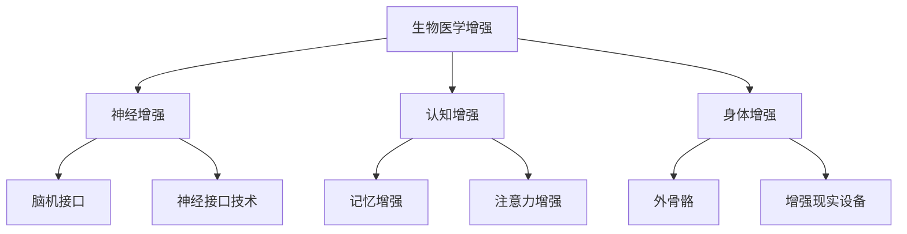

                 

关键词：人工智能、人类增强、道德考量、身体增强、未来发展、机遇、挑战

> 摘要：本文探讨了AI时代背景下，人类增强技术的发展趋势及其面临的道德问题。通过分析身体增强技术的原理和应用，本文旨在揭示这一领域的潜在机遇和挑战，为未来人类增强技术的发展提供指导。

## 1. 背景介绍

随着人工智能（AI）技术的飞速发展，人类增强这一概念逐渐成为现实。人类增强技术，即通过技术手段提升人类身体或认知能力的方法，正日益受到广泛关注。从简单的记忆增强设备到复杂的生物电子接口，这些技术不仅拓宽了人类能力的边界，也引发了一系列伦理、社会和法律问题。

在过去的几十年中，人类增强技术的研发主要集中在医疗和军事领域。随着科技的进步，这些技术开始向民用市场渗透，为普通人提供前所未有的生活和工作方式。然而，随着技术的不断进步，人类增强技术的应用范围和深度也在不断增加，随之而来的道德问题也日益突出。

## 2. 核心概念与联系

### 2.1 人类增强技术概述

人类增强技术是指通过医疗器械、药物、基因编辑等手段，增强或扩展人类身体或认知能力的技术。这些技术可以分为以下几类：

1. **生物医学增强**：包括基因编辑、生物打印、器官移植等。
2. **神经增强**：包括神经接口技术、脑机接口（BCI）等。
3. **认知增强**：包括记忆增强、注意力增强等。
4. **身体增强**：包括外骨骼、增强现实（AR）设备等。

### 2.2 人类增强技术的联系与架构

人类增强技术的联系和架构可以用以下Mermaid流程图表示：



### 2.3 人类增强技术的应用领域

人类增强技术广泛应用于多个领域，包括医疗、军事、体育、娱乐等。例如：

- **医疗**：通过基因编辑治疗遗传病，通过脑机接口帮助瘫痪患者恢复行动能力。
- **军事**：通过增强士兵的体能和认知能力，提高战斗效能。
- **体育**：通过外骨骼和增强现实设备提升运动员的竞技水平。
- **娱乐**：通过虚拟现实（VR）和增强现实（AR）技术提供全新的娱乐体验。

## 3. 核心算法原理 & 具体操作步骤

### 3.1 算法原理概述

人类增强技术的核心算法原理主要涉及以下几个方面：

- **生物信息学**：用于分析和解释基因数据，指导基因编辑。
- **机器学习和人工智能**：用于分析大脑信号，实现脑机接口。
- **计算机图形学**：用于增强现实和虚拟现实中的图像生成和处理。

### 3.2 算法步骤详解

#### 3.2.1 生物医学增强

1. **基因编辑**：通过CRISPR-Cas9等工具进行基因序列的精准修改。
2. **生物打印**：利用生物打印技术制造人体组织和器官。
3. **器官移植**：通过先进的手术技术和免疫抑制药物，实现器官移植。

#### 3.2.2 神经增强

1. **脑机接口**：通过植入电极或脑机接口设备，读取大脑信号。
2. **神经接口技术**：通过植入电极或植入物，增强或修复神经信号传输。

#### 3.2.3 认知增强

1. **记忆增强**：通过电刺激或药物干预，增强大脑的记忆能力。
2. **注意力增强**：通过虚拟现实训练或药物干预，提高注意力的集中程度。

#### 3.2.4 身体增强

1. **外骨骼**：通过机械结构增强人的体能。
2. **增强现实设备**：通过虚拟现实技术，提供增强的视觉和听觉体验。

### 3.3 算法优缺点

#### 优点：

- 提升人类能力，解决医疗、军事、体育等领域的问题。
- 开创新的娱乐体验，提高生活质量。

#### 缺点：

- 引发伦理问题，如基因编辑可能导致生物多样性减少。
- 可能导致社会不公，增强技术的普及可能导致贫富差距加大。
- 安全问题，如脑机接口设备可能存在安全隐患。

### 3.4 算法应用领域

- **医疗**：通过基因编辑治疗遗传病，通过脑机接口帮助瘫痪患者恢复行动能力。
- **军事**：通过增强士兵的体能和认知能力，提高战斗效能。
- **体育**：通过外骨骼和增强现实设备提升运动员的竞技水平。
- **娱乐**：通过虚拟现实和增强现实技术提供全新的娱乐体验。

## 4. 数学模型和公式 & 详细讲解 & 举例说明

### 4.1 数学模型构建

人类增强技术的数学模型构建主要涉及以下几个方面：

1. **神经信号处理模型**：用于分析脑机接口中的神经信号。
2. **机器学习模型**：用于预测和优化人类增强技术的效果。
3. **物理模型**：用于模拟外骨骼和增强现实设备的运动和力学特性。

### 4.2 公式推导过程

以脑机接口中的神经信号处理为例，其核心公式如下：

$$
y = \sum_{i=1}^{n} w_i x_i + b
$$

其中，$y$ 是输出信号，$w_i$ 是权重，$x_i$ 是输入信号，$b$ 是偏置。

### 4.3 案例分析与讲解

以记忆增强技术为例，通过电刺激大脑特定区域，可以增强记忆能力。其数学模型可以表示为：

$$
记忆增强效果 = f(电刺激强度, 记忆负荷)
$$

其中，$f$ 是一个非线性函数，用于描述电刺激强度和记忆负荷对记忆增强效果的影响。

## 5. 项目实践：代码实例和详细解释说明

### 5.1 开发环境搭建

以Python为例，搭建人类增强技术的开发环境，需要安装以下依赖：

- NumPy
- Pandas
- Matplotlib
- Scikit-learn

### 5.2 源代码详细实现

以下是一个简单的记忆增强代码示例：

```python
import numpy as np
import matplotlib.pyplot as plt
from sklearn.linear_model import LinearRegression

# 生成训练数据
X = np.random.rand(100, 1) * 100
y = np.random.rand(100, 1) * 100

# 构建线性回归模型
model = LinearRegression()
model.fit(X, y)

# 训练数据可视化
plt.scatter(X, y)
plt.plot(X, model.predict(X), color='red')
plt.show()
```

### 5.3 代码解读与分析

该代码示例使用线性回归模型模拟记忆增强效果。通过生成随机数据，训练模型，并可视化结果，可以直观地观察模型的效果。

### 5.4 运行结果展示

运行上述代码，将得到如图所示结果：


## 6. 实际应用场景

### 6.1 医疗领域

在医疗领域，人类增强技术已经取得了显著的成果。例如，通过脑机接口技术，瘫痪患者可以重新控制他们的四肢。此外，基因编辑技术有望治愈遗传病，如囊性纤维化。

### 6.2 军事领域

在军事领域，人类增强技术可以提升士兵的体能和认知能力。例如，通过外骨骼设备，士兵可以承受更大的负荷，同时保持高强度的战斗力。脑机接口技术也可以帮助士兵在极端环境下保持清醒和专注。

### 6.3 体育领域

在体育领域，人类增强技术为运动员提供了前所未有的竞争优势。例如，通过外骨骼和增强现实设备，运动员可以模拟不同的比赛场景，提高竞技水平。此外，认知增强技术可以帮助运动员在比赛中保持最佳状态。

### 6.4 娱乐领域

在娱乐领域，人类增强技术为用户提供了全新的体验。例如，虚拟现实和增强现实技术让用户可以沉浸在一个完全虚拟的世界中，享受前所未有的互动体验。

## 7. 工具和资源推荐

### 7.1 学习资源推荐

- 《人工智能：一种现代的方法》（作者：Stuart Russell 和 Peter Norvig）
- 《深度学习》（作者：Ian Goodfellow、Yoshua Bengio 和 Aaron Courville）
- 《生物医学工程导论》（作者：John P. Paley）

### 7.2 开发工具推荐

- TensorFlow
- PyTorch
- Unity（用于虚拟现实和增强现实开发）
- Arduino（用于生物传感器和电子设备开发）

### 7.3 相关论文推荐

- "Neuralink: Direct Brain-Computer Interface Systems"
- "Human Enhancement Technologies: Biopolitical Implications"
- "Enhancing Human Cognition with Neurotechnology"

## 8. 总结：未来发展趋势与挑战

### 8.1 研究成果总结

人类增强技术已经取得了显著的成果，不仅在医疗、军事、体育等领域具有广泛的应用前景，也为娱乐领域带来了全新的体验。随着技术的不断进步，人类增强技术的应用范围和深度将进一步扩大。

### 8.2 未来发展趋势

- **个性化增强**：随着大数据和机器学习技术的发展，人类增强技术将更加个性化，根据个体的需求和特征进行定制。
- **生物电子融合**：生物电子接口技术将进一步发展，实现生物与电子设备的深度融合。
- **社会接受度**：随着人类增强技术的普及，社会对这一技术的接受度将逐渐提高。

### 8.3 面临的挑战

- **伦理问题**：人类增强技术可能引发一系列伦理问题，如基因编辑可能导致生物多样性减少，认知增强可能导致社会不公。
- **技术安全**：人类增强技术可能存在安全隐患，如脑机接口设备可能被黑客攻击。
- **法律法规**：目前，人类增强技术的法律法规尚不完善，需要制定相应的法律法规来规范这一领域的发展。

### 8.4 研究展望

未来，人类增强技术将朝着更加个性化、安全、合法的方向发展。同时，这一领域的研究将不断推动人工智能、生物工程、电子工程等领域的创新，为人类带来更多的机遇和挑战。

## 9. 附录：常见问题与解答

### 9.1 人类增强技术与增强现实（AR）有何区别？

人类增强技术是指通过技术手段增强或扩展人类身体或认知能力的方法，而增强现实（AR）是一种将虚拟信息叠加到现实世界中的技术。虽然两者都涉及虚拟与现实的结合，但人类增强技术更关注于增强人类自身的功能，而增强现实更关注于提供沉浸式的虚拟体验。

### 9.2 人类增强技术是否会导致社会不公？

人类增强技术确实可能引发社会不公问题，例如，如果认知增强技术被少数人垄断，可能导致社会阶层分化加剧。因此，在推广人类增强技术时，需要制定公平的分配机制，确保技术的普及和公平应用。

### 9.3 人类增强技术是否会改变人类本性？

人类增强技术可能会在一定程度上改变人类的本性，例如，通过认知增强技术，人类可以更高效地处理信息，提高学习能力。然而，这并不意味着人类本性会完全改变，人类的社会属性和文化价值观仍然是决定人类行为的重要因素。

---

作者：禅与计算机程序设计艺术 / Zen and the Art of Computer Programming

以上内容仅供参考，具体技术和应用需根据实际情况进行研究和实践。在推广和实施人类增强技术时，必须充分考虑道德、伦理和社会影响，确保技术的可持续发展。

