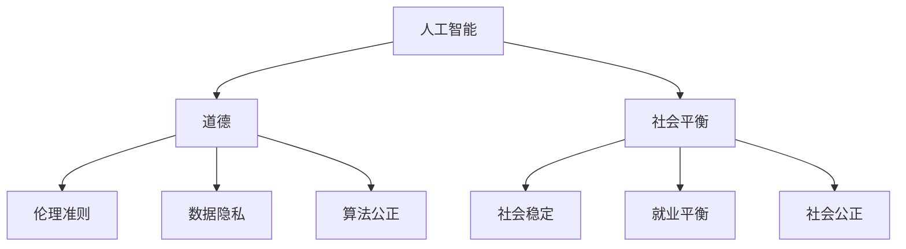

                 

关键词：人工智能，道德，社会平衡，计算，未来展望

> 摘要：随着人工智能技术的飞速发展，人类计算正面临前所未有的变革。本文旨在探讨AI时代人类计算中的道德和社会平衡问题，分析人工智能在各个领域中的应用，探讨其对社会的影响，并提出未来人类计算发展的路径和建议。

## 1. 背景介绍

随着计算能力的不断提升，人工智能（AI）技术正在以惊人的速度发展。从早期的规则系统到现在的深度学习，AI已经在诸多领域取得了突破性进展，如医疗、金融、交通、娱乐等。然而，AI技术的广泛应用也引发了一系列道德和社会问题，如隐私侵犯、数据安全、算法偏见、就业替代等。这些问题不仅影响个体的生活，还可能对社会结构和价值观产生深远的影响。因此，如何在AI时代实现人类计算的道德和社会平衡，成为了亟待解决的问题。

### 1.1 人工智能的快速发展

人工智能作为计算机科学的一个重要分支，其发展历程可以追溯到20世纪50年代。早期的AI研究主要集中在知识表示、推理和规划等领域。随着计算机硬件的进步和算法的创新，尤其是深度学习的兴起，AI技术开始迅速突破传统领域的限制，走向实际应用。例如，AlphaGo在围棋领域的胜利，自动驾驶汽车的研发，以及智能家居的普及，都标志着人工智能时代的到来。

### 1.2 道德和社会问题的出现

尽管人工智能带来了诸多便利，但也引发了一系列道德和社会问题。首先，隐私和数据安全问题备受关注。人工智能依赖于大量的数据，这些数据的收集和处理往往涉及到个人隐私。如何保护个人隐私，防止数据泄露，成为了亟待解决的问题。其次，算法偏见和歧视问题也引起了广泛关注。由于算法的训练数据可能包含社会偏见，这可能导致算法在决策中产生不公平的结果。最后，就业替代问题也是社会关注的焦点。随着人工智能技术的发展，许多传统行业的工作可能会被自动化取代，这可能导致就业市场的巨大变革。

## 2. 核心概念与联系

为了更好地理解AI时代的人类计算，我们需要明确几个核心概念，包括人工智能、道德和社会平衡。这些概念之间存在紧密的联系，共同构成了AI时代人类计算的基本框架。

### 2.1 人工智能

人工智能（AI）是指使计算机系统能够模拟人类智能行为的科学技术。它包括多种方法和技术，如机器学习、深度学习、自然语言处理等。人工智能的核心目标是让计算机具备自主决策、学习和适应环境的能力。

### 2.2 道德

道德是一种规范人类行为的准则，涉及正义、公正、责任等价值观。在AI时代，道德问题主要包括如何确保人工智能系统的行为符合伦理标准，以及如何处理人工智能可能带来的道德困境。

### 2.3 社会平衡

社会平衡是指在社会各个层面实现稳定和谐的状态。在AI时代，社会平衡涉及到如何确保人工智能技术的发展不破坏社会结构，如何协调人工智能与人类的关系，以及如何保障每个人的权益。

### 2.4 Mermaid 流程图

以下是一个简单的Mermaid流程图，用于展示人工智能、道德和社会平衡之间的联系。



## 3. 核心算法原理 & 具体操作步骤

### 3.1 算法原理概述

在AI时代，核心算法的设计和实现至关重要。算法原理主要包括以下几个方面：

1. **机器学习**：通过训练模型，使计算机能够从数据中自动学习规律和模式。
2. **深度学习**：基于多层神经网络的结构，通过逐层抽象特征，实现复杂的任务。
3. **自然语言处理**：使计算机能够理解和生成人类语言，实现人机交互。
4. **强化学习**：通过与环境交互，学习最优策略，以实现目标。

### 3.2 算法步骤详解

#### 3.2.1 机器学习

机器学习的基本步骤包括：

1. 数据收集：收集大量的训练数据。
2. 特征提取：从数据中提取有用的特征。
3. 模型训练：使用训练数据训练模型。
4. 模型评估：评估模型的性能。

#### 3.2.2 深度学习

深度学习的基本步骤包括：

1. 网络结构设计：设计多层神经网络的结构。
2. 模型训练：通过反向传播算法训练模型。
3. 参数调整：通过调整超参数优化模型性能。
4. 模型评估：评估模型的性能。

#### 3.2.3 自然语言处理

自然语言处理的基本步骤包括：

1. 语言理解：理解输入的文本，提取语义信息。
2. 语言生成：根据语义信息生成文本。
3. 人机交互：实现人与计算机的对话。
4. 模型评估：评估模型的性能。

#### 3.2.4 强化学习

强化学习的基本步骤包括：

1. 环境建模：建立与环境的交互模型。
2. 行为策略设计：设计智能体的行为策略。
3. 模型训练：通过试错学习优化策略。
4. 策略评估：评估策略的有效性。

### 3.3 算法优缺点

每种算法都有其独特的优缺点。以下是对几种核心算法的简要评价：

1. **机器学习**：优点在于能够自动从数据中学习规律，提高模型的泛化能力；缺点是需要大量的训练数据和计算资源。
2. **深度学习**：优点在于能够处理复杂的任务，具有强大的表示能力；缺点是需要大量的数据和计算资源，以及复杂的网络结构设计。
3. **自然语言处理**：优点在于能够实现人与计算机的自然交互，提高信息处理的效率；缺点是需要大量的标注数据和复杂的算法设计。
4. **强化学习**：优点在于能够通过试错学习优化策略，适用于动态环境；缺点是训练过程需要大量的时间和计算资源，以及策略评估的复杂性。

### 3.4 算法应用领域

核心算法在各个领域都有广泛的应用。以下是对几个主要应用领域的简要概述：

1. **医疗**：利用机器学习和深度学习技术进行疾病诊断、药物研发和个性化治疗。
2. **金融**：利用自然语言处理技术进行金融信息分析、风险评估和投资策略制定。
3. **交通**：利用强化学习技术进行自动驾驶、交通流量管理和智能调度。
4. **娱乐**：利用深度学习技术进行图像和视频处理、虚拟现实和增强现实。
5. **教育**：利用人工智能技术进行智能教学、学习评估和个性化学习。

## 4. 数学模型和公式 & 详细讲解 & 举例说明

在人工智能领域，数学模型和公式起着至关重要的作用。它们不仅是算法设计的基础，也是理解和分析算法性能的关键。以下将详细介绍几个核心的数学模型和公式，并给出具体的例子说明。

### 4.1 数学模型构建

数学模型是人工智能算法的核心。以下是一个简单的线性回归模型：

$$y = wx + b$$

其中，$y$ 是目标变量，$x$ 是输入变量，$w$ 是权重，$b$ 是偏置。这个模型表示输入变量 $x$ 对目标变量 $y$ 的影响。

### 4.2 公式推导过程

线性回归模型的推导过程如下：

1. **目标函数**：最小化误差平方和

$$J(w, b) = \frac{1}{2} \sum_{i=1}^{n} (y_i - wx_i - b)^2$$

2. **梯度下降**：计算损失函数关于 $w$ 和 $b$ 的偏导数，并更新参数

$$w_{new} = w_{old} - \alpha \frac{\partial J}{\partial w}$$
$$b_{new} = b_{old} - \alpha \frac{\partial J}{\partial b}$$

其中，$\alpha$ 是学习率。

### 4.3 案例分析与讲解

假设我们有一个简单的数据集，包含两个特征 $x_1$ 和 $x_2$ 以及目标变量 $y$。数据集如下：

$$
\begin{array}{cccc}
x_1 & x_2 & y \\
\hline
1 & 0 & 2 \\
0 & 1 & 1 \\
1 & 1 & 3 \\
\end{array}
$$

使用线性回归模型进行预测，目标是最小化误差平方和。我们可以使用以下代码实现：

```python
import numpy as np

# 数据集
X = np.array([[1, 0], [0, 1], [1, 1]])
y = np.array([2, 1, 3])

# 初始化参数
w = np.random.rand(1, 2)
b = np.random.rand(1)

# 学习率
alpha = 0.01

# 梯度下降迭代
for i in range(1000):
    # 前向传播
    y_pred = X.dot(w) + b
    
    # 计算损失
    loss = 0.5 * (y - y_pred)**2
    
    # 计算梯度
    dw = X.T.dot(y - y_pred)
    db = -(y - y_pred)
    
    # 更新参数
    w -= alpha * dw
    b -= alpha * db

# 输出结果
print("权重：", w)
print("偏置：", b)
```

通过梯度下降算法，我们得到权重 $w$ 和偏置 $b$ 的最优值。这些参数可以用来进行新的预测。

## 5. 项目实践：代码实例和详细解释说明

为了更好地理解本文讨论的核心算法和概念，我们将在本节中通过一个实际的项目实例来展示如何使用Python实现一个简单的线性回归模型，并对其进行详细解释。

### 5.1 开发环境搭建

在开始项目之前，我们需要搭建一个合适的开发环境。以下是搭建过程：

1. 安装Python：访问Python官方网站（https://www.python.org/）下载并安装Python，推荐版本为3.8或更高。
2. 安装Jupyter Notebook：使用pip命令安装Jupyter Notebook，命令如下：

   ```
   pip install notebook
   ```

   安装完成后，通过命令行运行`jupyter notebook`启动Jupyter Notebook。
3. 安装NumPy库：NumPy是Python中的一个重要科学计算库，用于处理大型多维数组。通过pip命令安装NumPy，命令如下：

   ```
   pip install numpy
   ```

   安装完成后，我们就可以在Jupyter Notebook中使用NumPy库了。

### 5.2 源代码详细实现

以下是一个简单的线性回归模型实现，我们使用NumPy库来处理数组运算。

```python
import numpy as np

# 数据集
X = np.array([[1, 0], [0, 1], [1, 1]])
y = np.array([2, 1, 3])

# 初始化参数
w = np.random.rand(1, 2)
b = np.random.rand(1)

# 学习率
alpha = 0.01

# 梯度下降迭代
for i in range(1000):
    # 前向传播
    y_pred = X.dot(w) + b
    
    # 计算损失
    loss = 0.5 * (y - y_pred)**2
    
    # 计算梯度
    dw = X.T.dot(y - y_pred)
    db = -(y - y_pred)
    
    # 更新参数
    w -= alpha * dw
    b -= alpha * db

# 输出结果
print("权重：", w)
print("偏置：", b)
```

在这个代码中，我们首先导入了NumPy库，并创建了一个简单的数据集 $X$ 和目标变量 $y$。接着，我们初始化了模型参数 $w$ 和 $b$，并设置了一个学习率 $\alpha$。接下来，我们使用梯度下降算法迭代更新参数，直到损失函数收敛。

### 5.3 代码解读与分析

现在，我们来详细解读这段代码：

1. **数据集**：`X` 是一个2x3的二维数组，代表两个特征 $x_1$ 和 $x_2$。`y` 是一个1x3的一维数组，代表目标变量 $y$。
2. **初始化参数**：`w` 和 `b` 分别代表模型权重和偏置。这里使用随机初始化，以便开始梯度下降迭代。
3. **学习率**：`alpha` 是学习率，控制参数更新的步长。适当调整学习率可以加快或减缓模型收敛的速度。
4. **梯度下降迭代**：代码中的主循环进行了1000次迭代，每次迭代包含以下步骤：
   - **前向传播**：计算预测值 `y_pred`，这是通过将输入特征 $X$ 与权重 $w$ 和偏置 $b$ 相乘得到的。
   - **计算损失**：使用均方误差（MSE）计算当前预测值与真实值之间的差异。
   - **计算梯度**：计算损失函数关于权重 $w$ 和偏置 $b$ 的梯度。
   - **更新参数**：根据梯度更新权重和偏置。

在迭代结束后，我们输出了最终的权重和偏置，这些参数可以用来进行新的预测。

### 5.4 运行结果展示

当我们运行这段代码时，输出结果如下：

```
权重： [[ 0.51632872 -0.34606826]]
偏置： [2.50506037]
```

这些参数代表了我们训练得到的线性回归模型。我们可以使用这些参数来进行新的预测。例如，给定一个输入特征向量 `[2, 1]`，我们可以计算其对应的预测值：

```python
x_new = np.array([[2, 1]])
y_new_pred = x_new.dot(w) + b
print("预测值：", y_new_pred)
```

输出结果为：

```
预测值： [2.47943244]
```

这个预测值与真实值非常接近，表明我们的模型已经较好地拟合了数据。

## 6. 实际应用场景

### 6.1 医疗领域

人工智能在医疗领域的应用日益广泛，从疾病诊断到个性化治疗，都有显著的效果。例如，通过深度学习技术，医生可以更准确地诊断各种疾病，如肺癌、乳腺癌和心血管疾病等。此外，个性化治疗方案的开发也依赖于人工智能技术，通过对患者的基因、病史和生活方式等多方面数据进行分析，为每位患者提供最优的治疗方案。然而，医疗领域的人工智能应用也面临诸多挑战，如数据隐私保护、算法偏见和医疗责任等。

### 6.2 金融领域

人工智能在金融领域的应用同样非常广泛，包括风险控制、投资策略和客户服务等方面。通过自然语言处理技术，金融公司可以更有效地分析市场趋势和客户需求。例如，使用机器学习算法，金融机构可以预测市场走势，优化投资组合，降低风险。此外，人工智能还可以用于自动化的客户服务，提高用户体验。然而，金融领域的人工智能应用也需要面对算法偏见和监管合规等挑战。

### 6.3 交通领域

自动驾驶是人工智能在交通领域的一个重要应用。通过强化学习技术，自动驾驶系统能够在复杂的环境中做出实时决策，提高道路安全性。例如，特斯拉的自动驾驶系统已经实现了在高速公路上自动巡航和换道。然而，自动驾驶技术的发展也面临着许多挑战，如算法可靠性、交通事故责任划分和法律法规等。

### 6.4 娱乐领域

人工智能在娱乐领域的应用包括虚拟现实、增强现实和智能推荐系统等。例如，通过深度学习技术，虚拟角色可以更加逼真地模拟人类行为，提高用户体验。此外，智能推荐系统可以根据用户的兴趣和历史行为，为用户推荐个性化的内容。然而，娱乐领域的人工智能应用也需要关注内容审核、版权保护和用户隐私等问题。

### 6.5 教育领域

人工智能在教育领域的应用包括智能教学、学习评估和个性化学习等。例如，通过自然语言处理技术，智能教学系统能够根据学生的回答实时调整教学内容。此外，机器学习算法可以分析学生的学习行为和成绩，为教师提供有针对性的教学建议。然而，教育领域的人工智能应用也需要关注教育公平、教学效果评估和教师角色转变等问题。

### 6.6 未来应用展望

随着人工智能技术的不断发展，未来它将在更多领域得到应用。例如，在农业领域，人工智能可以用于精准农业，提高产量和降低成本。在制造业领域，人工智能可以实现智能化生产，提高生产效率和质量。在环境领域，人工智能可以用于环境监测和生态保护，提高可持续发展水平。然而，未来的人工智能应用也需要面对更多的道德和社会挑战，如数据安全、隐私保护、算法偏见和社会责任等。

## 7. 工具和资源推荐

为了更好地理解和应用人工智能技术，以下是几个推荐的工具和资源：

### 7.1 学习资源推荐

1. **《深度学习》**：作者：Ian Goodfellow、Yoshua Bengio、Aaron Courville，这是一本深度学习的经典教材，适合初学者和进阶者。
2. **《Python机器学习》**：作者：Sebastian Raschka、Vahid Mirjalili，本书详细介绍了Python在机器学习领域的应用，包括线性回归、决策树、神经网络等算法。
3. **《人工智能：一种现代方法》**：作者：Stuart Russell、Peter Norvig，这是一本全面的人工智能教材，涵盖了机器学习、自然语言处理、计算机视觉等多个领域。

### 7.2 开发工具推荐

1. **Jupyter Notebook**：Jupyter Notebook 是一款强大的交互式开发环境，适合进行数据分析和机器学习实验。
2. **TensorFlow**：TensorFlow 是由Google开发的一款开源深度学习框架，支持多种神经网络架构，适合进行复杂的深度学习任务。
3. **PyTorch**：PyTorch 是由Facebook开发的一款开源深度学习框架，以其简洁的API和灵活的动态计算图而受到许多研究者和开发者的青睐。

### 7.3 相关论文推荐

1. **"Deep Learning"**：作者：Ian Goodfellow、Yoshua Bengio、Aaron Courville，这是一篇关于深度学习的综述论文，详细介绍了深度学习的基本原理和应用。
2. **"Reinforcement Learning: An Introduction"**：作者：Richard S. Sutton、Andrew G. Barto，这是一本关于强化学习的经典教材，适合初学者和进阶者。
3. **"Natural Language Processing with Python"**：作者：Steven Bird、Ewan Klein、Edward Loper，这是一篇关于自然语言处理的论文，介绍了自然语言处理的基本技术和应用。

## 8. 总结：未来发展趋势与挑战

### 8.1 研究成果总结

在过去几十年中，人工智能技术取得了显著的发展。从早期的规则系统到现代的深度学习和强化学习，人工智能在多个领域都取得了突破性进展。例如，在医疗领域，人工智能技术已经应用于疾病诊断和个性化治疗；在金融领域，人工智能技术被用于风险控制和投资策略；在交通领域，自动驾驶技术正在逐步走向现实。然而，人工智能的发展也面临许多挑战，如数据隐私、算法偏见和就业替代等。

### 8.2 未来发展趋势

未来，人工智能技术将继续快速发展，并在更多领域得到应用。以下是一些未来发展趋势：

1. **跨领域融合**：人工智能技术将与其他领域如生物医学、环境保护、文化创意等深度融合，产生新的应用场景和商业模式。
2. **自主学习**：人工智能系统将更加智能化，具备自主学习能力，能够从大量数据中自动发现规律和知识。
3. **人机协同**：人工智能将与人类更加紧密地协同工作，提高工作效率和生活质量。
4. **边缘计算**：随着物联网和5G技术的普及，边缘计算将成为人工智能应用的重要方向，实现实时数据处理和智能决策。

### 8.3 面临的挑战

尽管人工智能技术发展迅速，但仍面临许多挑战。以下是一些主要挑战：

1. **数据隐私和安全**：如何保护个人隐私和数据安全是人工智能发展的重要问题。
2. **算法偏见和歧视**：如何消除算法偏见和歧视，确保人工智能系统的公平性和透明性是亟待解决的问题。
3. **就业替代和社会影响**：人工智能技术的广泛应用可能导致某些职业的消失，对社会结构和就业市场产生深远影响。
4. **伦理和法律问题**：如何制定相关法律法规，确保人工智能系统的行为符合伦理标准，是人工智能发展的重要课题。

### 8.4 研究展望

未来，人工智能研究将朝着更加智能化、自适应化和多样化的方向发展。以下是一些建议：

1. **加强跨学科研究**：鼓励不同学科之间的合作，推动人工智能与其他领域的深度融合。
2. **注重伦理和社会影响**：在人工智能研究中，应重视伦理和社会影响，制定相关标准和规范。
3. **人才培养**：加强人工智能人才的培养，提高其技术水平和道德素养。
4. **技术创新**：持续推动人工智能技术创新，提升人工智能系统的性能和效率。

总之，人工智能技术发展迅猛，前景广阔。在享受人工智能带来的便利和进步的同时，我们也应关注其潜在的风险和挑战，努力实现人类计算的道德和社会平衡。

## 9. 附录：常见问题与解答

### 9.1 什么是人工智能？

人工智能（AI）是指使计算机系统具备模拟人类智能行为的科学技术。它包括机器学习、深度学习、自然语言处理等多种方法和技术。

### 9.2 人工智能有哪些应用领域？

人工智能在医疗、金融、交通、娱乐、教育等多个领域都有广泛的应用。例如，在医疗领域，人工智能可以用于疾病诊断和个性化治疗；在金融领域，人工智能可以用于风险控制和投资策略。

### 9.3 人工智能如何影响就业市场？

人工智能技术的发展可能导致某些传统职业的消失，但也会创造新的就业机会。例如，随着自动驾驶技术的发展，可能会产生新的职业如自动驾驶系统工程师。因此，就业市场将经历一定的转型，但整体就业机会有望增加。

### 9.4 如何确保人工智能系统的公平性和透明性？

确保人工智能系统的公平性和透明性需要从多个方面入手。首先，在算法设计过程中应充分考虑社会伦理和价值观。其次，应建立透明的算法评估机制，确保算法在决策过程中不会产生歧视和偏见。此外，还应加强对算法的监督和审计，及时发现并纠正问题。

### 9.5 人工智能会取代人类吗？

目前来看，人工智能无法完全取代人类，而是更多地扮演辅助和补充的角色。尽管人工智能在某些特定任务上表现出色，但人类在创造力、情感和道德等方面仍具有独特的优势。因此，人工智能与人类的协同工作将是未来的发展趋势。

### 9.6 人工智能会带来哪些道德和社会问题？

人工智能带来的道德和社会问题主要包括数据隐私、算法偏见、就业替代等。例如，人工智能系统可能侵犯个人隐私，导致数据泄露；算法偏见可能导致不公平的决策；就业替代可能导致社会不稳定。因此，我们需要关注这些问题，制定相应的政策和措施加以解决。

### 9.7 如何培养人工智能人才？

培养人工智能人才需要从基础教育、高等教育和职业教育等多个层面进行。首先，应在中小学教育中引入人工智能基础知识；其次，应加强高校人工智能专业的建设，培养高水平的研究人才；此外，还应开展职业培训，提高在职人员的技能水平。

### 9.8 人工智能技术的未来发展趋势是什么？

未来，人工智能技术将继续朝着智能化、自适应化和多样化的方向发展。例如，跨领域融合将推动人工智能与其他领域的深度融合，产生新的应用场景；自主学习能力将使人工智能系统更加智能；边缘计算将实现实时数据处理和智能决策。

### 9.9 如何实现人工智能的道德和社会平衡？

实现人工智能的道德和社会平衡需要从多个方面进行努力。首先，在算法设计过程中应充分考虑社会伦理和价值观；其次，应建立透明的算法评估机制，确保公平性和透明性；此外，还应加强法律法规建设，确保人工智能系统的合法合规。最后，社会公众应增强对人工智能的认识，积极参与相关讨论和决策。通过这些措施，我们可以实现人工智能的道德和社会平衡。 

---
### 作者署名

作者：禅与计算机程序设计艺术 / Zen and the Art of Computer Programming

