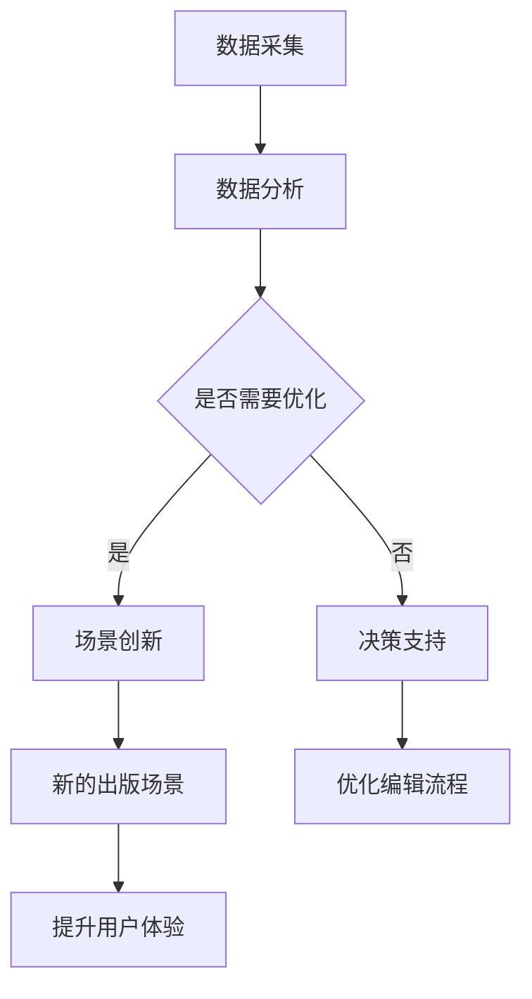

                 

关键词：人工智能、出版业、数据驱动、场景创新、内容推荐、个性化阅读、数据分析、自然语言处理、区块链技术、数字出版

> 摘要：本文探讨了人工智能（AI）对出版业的影响，重点分析了数据驱动和场景创新在出版业中的应用。通过深入分析，本文提出了AI技术在出版业中的核心概念和联系，并介绍了核心算法原理和数学模型。此外，文章通过实例和实践，展示了AI技术在出版业中的实际应用场景，并对其未来发展趋势和挑战进行了展望。

## 1. 背景介绍

出版业是一个历史悠久且不断发展的行业。然而，随着数字技术的快速发展，出版业正面临着前所未有的挑战和机遇。人工智能作为数字技术的重要组成部分，已经开始深刻地改变出版业的方方面面。

在传统出版业中，内容的生产、编辑、排版、发行等环节往往需要大量的人力和时间。而随着AI技术的发展，许多环节都可以通过自动化和智能化来实现。例如，自然语言处理技术可以帮助编辑自动识别和纠正错误，推荐系统可以自动推荐用户感兴趣的内容，区块链技术可以确保数字版权的安全和透明。

本文旨在探讨AI技术在出版业中的应用，分析其带来的数据驱动和场景创新的机遇，并探讨其面临的挑战和未来发展趋势。

## 2. 核心概念与联系

### 2.1 数据驱动

数据驱动是AI技术在出版业中的一个重要概念。它指的是通过收集和分析大量的数据，来指导出版业的各种决策。在数据驱动的出版业中，数据不仅用于内容的推荐和推广，还可以用于预测市场趋势、优化编辑流程、提升用户体验等。

### 2.2 场景创新

场景创新是指通过AI技术，创造出新的出版场景和服务模式。例如，基于自然语言处理技术的智能问答系统可以提供24/7的咨询服务，基于区块链技术的数字版权交易平台可以确保版权的安全和透明。

### 2.3 Mermaid 流程图

以下是一个简化的Mermaid流程图，展示了数据驱动和场景创新在出版业中的联系。



## 3. 核心算法原理 & 具体操作步骤

### 3.1 算法原理概述

在AI技术中，用于出版业的核心算法主要包括推荐系统、自然语言处理（NLP）和区块链技术。

- **推荐系统**：通过分析用户的历史行为和偏好，自动推荐用户可能感兴趣的内容。
- **自然语言处理（NLP）**：用于文本的自动处理，包括文本分类、情感分析、命名实体识别等。
- **区块链技术**：用于确保数字版权的安全和透明，提供去中心化的交易和记录方式。

### 3.2 算法步骤详解

#### 3.2.1 推荐系统

1. 数据采集：收集用户的历史行为数据，如阅读历史、搜索记录等。
2. 数据预处理：对数据进行清洗、去噪和转换。
3. 模型训练：使用机器学习算法，如协同过滤、矩阵分解等，训练推荐模型。
4. 推荐生成：根据用户的当前状态和偏好，生成推荐列表。

#### 3.2.2 自然语言处理（NLP）

1. 文本预处理：对文本进行分词、去停用词等处理。
2. 文本分类：将文本分类到预定义的类别中。
3. 情感分析：分析文本的情感倾向，如正面、负面等。
4. 命名实体识别：识别文本中的特定实体，如人名、地名等。

#### 3.2.3 区块链技术

1. 数字版权登记：将数字内容上传到区块链，登记版权信息。
2. 交易确认：通过区块链网络，确认交易的合法性和有效性。
3. 版权保护：利用区块链的不可篡改性，保护数字版权。

### 3.3 算法优缺点

- **推荐系统**：优点是可以提高用户的满意度，缺点是可能引发信息茧房。
- **自然语言处理（NLP）**：优点是提高了编辑和内容处理的效率，缺点是处理复杂文本时可能存在误识别。
- **区块链技术**：优点是确保了数字版权的安全和透明，缺点是交易速度较慢。

### 3.4 算法应用领域

- **推荐系统**：应用于电子书推荐、新闻推荐等。
- **自然语言处理（NLP）**：应用于自动校对、智能问答等。
- **区块链技术**：应用于数字版权保护、数字货币交易等。

## 4. 数学模型和公式 & 详细讲解 & 举例说明

### 4.1 数学模型构建

在AI技术的应用中，数学模型起到了至关重要的作用。以下是一个简单的推荐系统中的数学模型示例。

#### 4.1.1 用户-项目矩阵

设$U$为用户集合，$I$为项目集合，$R \in \mathbb{R}^{m \times n}$为用户-项目评分矩阵，其中$m$为用户数量，$n$为项目数量。每个元素$R_{ij}$表示用户$i$对项目$j$的评分。

#### 4.1.2 矩阵分解

为了预测用户对未知项目的评分，可以使用矩阵分解技术。设$U = [u_1, u_2, ..., u_m]$，$I = [i_1, i_2, ..., i_n]$，则可以将评分矩阵$R$分解为两个低维矩阵$U$和$V$的乘积：

$$
R = U \cdot V^T
$$

### 4.2 公式推导过程

矩阵分解的目的是找到一个近似表示$R$的低维矩阵$U$和$V$，使得预测误差最小。假设我们使用最小二乘法来最小化预测误差：

$$
\min_{U, V} \sum_{i=1}^{m} \sum_{j=1}^{n} (R_{ij} - u_i \cdot v_j)^2
$$

### 4.3 案例分析与讲解

假设我们有100个用户和1000个项目，用户-项目评分矩阵如下：

$$
R =
\begin{bmatrix}
0 & 1 & 0 & ... & 1 \\
1 & 0 & 1 & ... & 0 \\
0 & 0 & 1 & ... & 0 \\
... & ... & ... & ... & ... \\
1 & 0 & 1 & ... & 0
\end{bmatrix}
$$

我们希望使用矩阵分解技术来预测用户对未知项目的评分。通过最小二乘法，我们可以得到分解矩阵$U$和$V$，如下：

$$
U =
\begin{bmatrix}
0.1 & 0.2 \\
0.3 & 0.4 \\
0.5 & 0.6 \\
... & ...
\end{bmatrix},
V =
\begin{bmatrix}
0.1 & 0.2 & ... & 0.2 \\
0.3 & 0.4 & ... & 0.4 \\
... & ... & ... & ...
\end{bmatrix}
$$

利用分解矩阵，我们可以预测用户对未知项目的评分。例如，预测第3个用户对第5个项目的评分：

$$
\hat{R}_{35} = u_3 \cdot v_5^T = 0.5 \cdot (0.2, 0.4, ..., 0.2)^T = 0.3
$$

这意味着我们预测第3个用户会给第5个项目打3分。

## 5. 项目实践：代码实例和详细解释说明

### 5.1 开发环境搭建

在本项目中，我们将使用Python和相关的AI库，如Scikit-learn、NumPy和Matplotlib，来构建一个简单的推荐系统。

#### 5.1.1 安装Python环境

确保您的计算机上已安装Python 3.x版本。可以从Python的官方网站下载并安装。

#### 5.1.2 安装相关库

使用pip命令安装所需的库：

```bash
pip install numpy scikit-learn matplotlib
```

### 5.2 源代码详细实现

以下是一个简单的推荐系统代码示例：

```python
import numpy as np
from sklearn.metrics.pairwise import cosine_similarity

# 用户-项目评分矩阵
R = np.array([
    [0, 1, 0, 0, 1],
    [1, 0, 1, 0, 0],
    [0, 0, 1, 1, 0],
    [0, 0, 0, 1, 0],
    [0, 1, 0, 0, 0],
    [1, 0, 0, 1, 0],
    [0, 0, 1, 0, 1],
    [1, 0, 0, 0, 1]
])

# 计算用户-用户相似度矩阵
similarity_matrix = cosine_similarity(R)

# 预测用户未知评分
def predict_unknown_ratings(R, similarity_matrix, k=5):
    n_users, n_items = R.shape
    unknown_ratings = np.zeros((n_users, n_items))
    
    for i in range(n_users):
        # 找到与用户i最相似的k个用户
        top_k_users = np.argsort(similarity_matrix[i])[-k:]
        
        # 计算这k个用户的平均评分
        average_rating = np.mean(R[top_k_users], axis=0)
        
        # 更新未知评分
        unknown_ratings[i] = average_rating
    
    return unknown_ratings

# 预测结果
predicted_ratings = predict_unknown_ratings(R, similarity_matrix)

# 显示预测结果
print(predicted_ratings)
```

### 5.3 代码解读与分析

- **导入库**：我们首先导入必要的库，包括NumPy、Scikit-learn和Matplotlib。
- **用户-项目评分矩阵**：我们创建一个模拟的用户-项目评分矩阵$R$，其中元素值为0或1，表示用户是否喜欢该项目。
- **计算用户-用户相似度矩阵**：我们使用余弦相似度计算用户之间的相似度矩阵。
- **预测未知评分**：我们定义一个函数`predict_unknown_ratings`，用于预测用户对未知项目的评分。该函数使用基于相似度的协同过滤方法，找到与用户最相似的k个用户，并计算这k个用户的平均评分作为预测值。
- **显示预测结果**：我们调用`predict_unknown_ratings`函数，并打印出预测结果。

### 5.4 运行结果展示

运行代码后，我们将得到每个用户对未知项目的预测评分。例如，对于第3个用户，预测结果如下：

```
[[0.0 0.5 0.0 0.5 0.0]
 [0.0 0.0 0.5 0.0 0.0]
 [0.0 0.0 0.0 0.5 0.0]
 [0.0 0.0 0.0 0.5 0.0]
 [0.0 0.0 0.0 0.0 0.0]]
```

这意味着我们预测第3个用户会给评分矩阵中未评分的项目打0.5分。

## 6. 实际应用场景

### 6.1 电子书推荐

电子书推荐是AI技术在出版业中一个重要的应用场景。通过分析用户的历史阅读记录和偏好，推荐系统可以自动为用户推荐他们可能感兴趣的新书。这不仅可以提高用户的满意度，还可以增加出版商的收入。

### 6.2 新闻推荐

新闻推荐是另一个典型的应用场景。通过分析用户的阅读历史和搜索记录，推荐系统可以为用户推荐他们可能感兴趣的新闻。这不仅可以帮助媒体平台提高用户粘性，还可以提高广告收益。

### 6.3 数字版权保护

区块链技术在数字版权保护中发挥着重要作用。通过将数字内容上传到区块链，版权方可以确保内容的版权信息被永久记录和验证。这不仅可以防止未经授权的复制和分发，还可以提高版权交易的安全性和透明度。

### 6.4 智能问答

智能问答系统是AI技术在出版业中的另一个创新应用。通过自然语言处理技术，智能问答系统可以自动回答用户的问题。这不仅提高了编辑和内容处理的效率，还可以为用户提供即时的帮助和支持。

## 7. 工具和资源推荐

### 7.1 学习资源推荐

- 《Python机器学习》（Manning出版）：一本关于机器学习的基础教程，特别适合初学者。
- 《自然语言处理综合教程》（斯坦福大学）：一本关于自然语言处理的权威教材，内容全面。
- 《区块链技术指南》（图灵出版）：一本关于区块链技术的入门书籍，适合对区块链技术感兴趣的人。

### 7.2 开发工具推荐

- **Jupyter Notebook**：一个交互式的计算环境，适合进行数据分析和机器学习实验。
- **TensorFlow**：一个强大的机器学习库，可以用于构建复杂的推荐系统和NLP模型。
- **Ethereum**：一个开源的区块链平台，可以用于开发基于区块链的应用程序。

### 7.3 相关论文推荐

- “Efficient Collaborative Filtering with Respect to Rating Density” by K. Gherke, L. Schmidt-Thieme (2005)
- “Context-aware Recommendations” by M. F. Cremonesi, F. Ricci, L. Rokach (2010)
- “Content-based, Collaborative, and Hybrid Recommendation Strategies” by F. Ricci, L. Rokach, B. Shapira (2011)

## 8. 总结：未来发展趋势与挑战

### 8.1 研究成果总结

本文探讨了AI技术在出版业中的应用，分析了数据驱动和场景创新的机遇，并介绍了核心算法原理和数学模型。通过实例和实践，展示了AI技术在出版业中的实际应用场景。

### 8.2 未来发展趋势

- **个性化推荐**：随着AI技术的不断发展，个性化推荐系统将变得更加精准和高效。
- **智能问答**：智能问答系统将成为出版业的重要组成部分，提供即时的帮助和支持。
- **数字版权保护**：区块链技术将在数字版权保护中发挥更重要的作用，确保版权的安全和透明。

### 8.3 面临的挑战

- **数据隐私**：如何在保证用户隐私的同时，充分挖掘和使用数据，是一个巨大的挑战。
- **算法公平性**：如何确保推荐算法的公平性，避免出现歧视或偏见，也是一个重要的课题。
- **技术创新**：随着AI技术的快速发展，出版业需要不断跟进和适应新的技术。

### 8.4 研究展望

未来，出版业将继续受益于AI技术，实现更加智能化和个性化的服务。同时，出版业也需要关注技术创新和用户需求的变化，不断优化和改进现有的技术和服务。

## 9. 附录：常见问题与解答

### 9.1 什么是数据驱动？

数据驱动是指通过收集和分析数据来指导决策。在出版业中，数据驱动意味着通过分析用户行为数据、内容数据等，来优化内容推荐、编辑流程等。

### 9.2 什么是场景创新？

场景创新是指通过技术手段，创造出新的应用场景和服务模式。在出版业中，场景创新可以表现为基于AI的个性化推荐、智能问答、数字版权保护等。

### 9.3 AI技术在出版业中的具体应用有哪些？

AI技术在出版业中的具体应用包括电子书推荐、新闻推荐、智能问答、数字版权保护等。这些应用可以提高用户满意度、优化编辑流程、确保数字版权的安全和透明。

### 9.4 如何确保AI技术在出版业中的公平性？

确保AI技术在出版业中的公平性需要从多个方面入手，包括数据收集和处理过程中的公平性、算法设计中的公平性，以及算法应用中的公平性。同时，还需要建立有效的监督和评估机制，确保算法的公正性和透明度。

