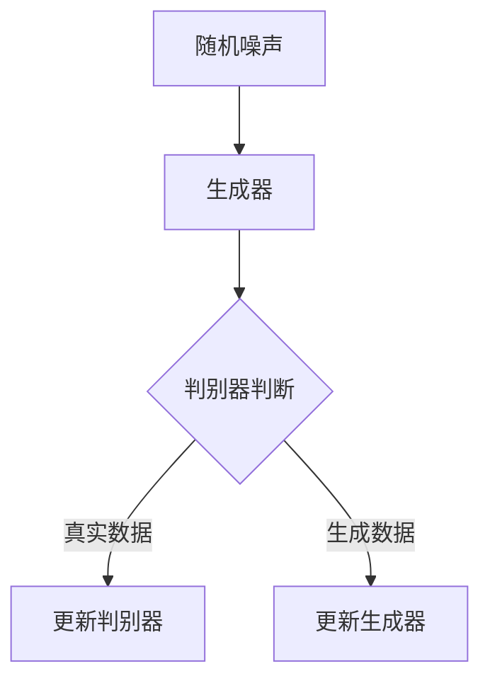

                 

关键词：人工智能，创意写作，生成对抗网络，深度学习，文本生成，算法应用

> 摘要：随着人工智能技术的快速发展，创意写作领域正迎来前所未有的变革。本文探讨了如何利用生成对抗网络（GAN）等深度学习技术为创意写作提供灵感，并通过一个具体的码头故事案例，展示了这种技术的强大潜力。

## 1. 背景介绍

在当今信息爆炸的时代，创意写作成为了各个领域不可或缺的一部分。无论是文学创作、广告文案、剧本撰写还是新闻撰写，都离不开创意和灵感的支持。然而，传统的创意写作过程往往依赖于个人的经验和直觉，这不仅耗时，而且创意的获取存在一定的局限性。

随着人工智能技术的迅猛发展，深度学习，尤其是生成对抗网络（GAN）的出现，为创意写作领域带来了全新的可能性。GAN由两部分组成：生成器和判别器。生成器的任务是生成与真实数据相似的新数据，而判别器的任务是区分真实数据和生成数据。通过不断地训练，生成器能够提高其生成数据的真实性，从而创造出新颖的内容。

本文将探讨如何利用GAN等深度学习技术，为创意写作提供丰富的灵感来源，并通过一个具体的码头故事案例，展示这种技术的实际应用效果。

## 2. 核心概念与联系

为了更好地理解GAN在创意写作中的应用，我们首先需要了解其核心概念和原理。

### 2.1 GAN的概念与原理

生成对抗网络（Generative Adversarial Networks，GAN）是由伊恩·古德费洛（Ian Goodfellow）等人在2014年提出的。GAN由两个深度神经网络组成：生成器（Generator）和判别器（Discriminator）。生成器的目的是生成尽可能真实的数据，而判别器的目的是准确地区分真实数据和生成数据。

在训练过程中，生成器和判别器相互对抗。生成器的目标是欺骗判别器，使其无法区分生成的数据和真实数据。判别器的目标是准确地判断输入数据是真实数据还是生成数据。通过这种对抗训练，生成器不断优化其生成能力，从而生成出更加真实和具有创意的数据。

### 2.2 GAN的架构

GAN的架构通常包括以下几个主要部分：

1. **输入空间**：生成器和判别器都在这个空间中工作。生成器从这个空间中生成数据，而判别器则在这个空间中判断数据。

2. **生成器（Generator）**：生成器的任务是从一个随机噪声向量生成与真实数据相似的数据。生成器通常是一个深度神经网络，其输入是一个随机噪声向量，输出是生成数据。

3. **判别器（Discriminator）**：判别器的任务是区分真实数据和生成数据。判别器也是一个深度神经网络，其输入是真实数据或生成数据，输出是一个概率值，表示输入数据是真实数据的概率。

4. **对抗训练**：生成器和判别器通过对抗训练相互提高。生成器的损失函数是最大化判别器判断生成数据为真实数据的概率，而判别器的损失函数是最小化判别器判断生成数据为真实数据的概率。

### 2.3 Mermaid流程图

为了更好地展示GAN的流程，我们可以使用Mermaid流程图来描述。以下是GAN的核心流程：



在上述流程中，生成器生成数据后，判别器对其进行判断。如果判别器判断为真实数据，则生成器的损失函数增加，生成器进行更新。如果判别器判断为生成数据，则判别器的损失函数增加，判别器进行更新。通过这种对抗训练，生成器和判别器不断优化，最终生成出高质量的数据。

## 3. 核心算法原理 & 具体操作步骤

### 3.1 算法原理概述

GAN的核心原理是基于两个神经网络：生成器和判别器。生成器的任务是生成逼真的数据，判别器的任务是区分真实数据和生成数据。通过不断训练，生成器不断提高其生成能力，最终能够生成高质量的数据。

### 3.2 算法步骤详解

1. **初始化**：初始化生成器和判别器。通常，生成器是一个生成神经网络，判别器是一个分类神经网络。

2. **生成数据**：生成器从随机噪声中生成数据。这些数据可以是图像、文本或任何其他形式的数据。

3. **判别数据**：判别器对真实数据和生成数据进行分类。真实数据是指从真实数据集中获取的数据，生成数据是指生成器生成的数据。

4. **更新网络**：根据判别器的分类结果，更新生成器和判别器的权重。如果判别器判断生成数据为真实数据的概率较高，则生成器的损失函数增加，生成器进行更新。如果判别器判断生成数据为生成数据的概率较高，则判别器的损失函数增加，判别器进行更新。

5. **重复步骤**：重复上述步骤，直到生成器能够生成高质量的数据。

### 3.3 算法优缺点

GAN的优点包括：

- 能够生成高质量的数据，尤其是图像和文本。
- 不需要标注数据，因为生成器和判别器在对抗训练中自动学习数据的分布。
- 适用于多种数据类型，如图像、文本、音频等。

GAN的缺点包括：

- 训练过程不稳定，容易出现梯度消失或梯度爆炸的问题。
- 需要大量的数据和计算资源。
- 对生成器和判别器的参数设计有较高的要求。

### 3.4 算法应用领域

GAN在创意写作中的应用前景广阔。例如：

- **故事生成**：利用GAN生成新颖的故事情节，为编剧和小说家提供灵感。
- **广告文案**：自动生成广告文案，提高广告效果。
- **新闻撰写**：自动生成新闻报道，减少人力成本。

## 4. 数学模型和公式 & 详细讲解 & 举例说明

### 4.1 数学模型构建

在GAN中，生成器和判别器的损失函数通常采用如下形式：

生成器损失函数：

$$
L_G = -\log(D(G(z)))
$$

判别器损失函数：

$$
L_D = -\log(D(x)) - \log(1 - D(G(z)))
$$

其中，$G(z)$表示生成器生成的数据，$D(x)$表示判别器对真实数据的分类概率，$z$是一个随机噪声向量。

### 4.2 公式推导过程

生成器损失函数的推导过程如下：

首先，我们定义生成器的目标是最大化判别器判断生成数据为真实数据的概率，即：

$$
\max_G \log(D(G(z)))
$$

然后，我们通过取对数得到：

$$
\log(D(G(z)))
$$

再通过求导得到：

$$
-\frac{d}{dG} \log(D(G(z))) = -\frac{D'(G(z))}{D(G(z))}
$$

最后，我们得到生成器的损失函数：

$$
L_G = -\log(D(G(z)))
$$

类似地，判别器损失函数的推导过程如下：

首先，我们定义判别器的目标是最大化判别器判断真实数据和生成数据的概率，即：

$$
\max_D \log(D(x)) + \log(1 - D(G(z)))
$$

然后，我们通过取对数得到：

$$
\log(D(x)) + \log(1 - D(G(z)))
$$

再通过求导得到：

$$
\frac{d}{dD} \log(D(x)) + \log(1 - D(G(z))) = \frac{D'(x)}{D(x)} - \frac{D'(G(z))}{1 - D(G(z))}
$$

最后，我们得到判别器的损失函数：

$$
L_D = -\log(D(x)) - \log(1 - D(G(z)))
$$

### 4.3 案例分析与讲解

为了更好地理解GAN的数学模型，我们可以通过一个具体的案例进行分析。

假设我们使用GAN生成图像，生成器的输入是一个随机噪声向量$z$，输出是一个图像$G(z)$，判别器的输入是一个图像$x$，输出是一个概率值$D(x)$。

首先，我们初始化生成器和判别器的权重。假设生成器的权重为$w_G$，判别器的权重为$w_D$。

然后，我们使用真实图像数据集训练判别器。通过不断更新判别器的权重，使其能够准确地区分真实图像和生成图像。

接着，我们使用生成器和判别器的权重生成图像。生成器的目标是生成与真实图像相似的新图像，判别器的目标是判断这些图像是真实图像还是生成图像。

最后，我们通过更新生成器和判别器的权重，使其在对抗训练中相互提高。

通过这个案例，我们可以看到GAN的数学模型在实际应用中的具体实现过程。

## 5. 项目实践：代码实例和详细解释说明

### 5.1 开发环境搭建

为了实践GAN在创意写作中的应用，我们需要搭建一个开发环境。以下是搭建环境的步骤：

1. 安装Python环境：确保Python版本在3.6及以上。

2. 安装深度学习框架：选择一个流行的深度学习框架，如TensorFlow或PyTorch。

3. 安装其他依赖库：包括NumPy、Pandas、Matplotlib等。

### 5.2 源代码详细实现

以下是一个使用TensorFlow实现的GAN模型的示例代码：

```python
import tensorflow as tf
from tensorflow.keras.layers import Dense, Flatten, Reshape
from tensorflow.keras.models import Model
from tensorflow.keras.optimizers import Adam

# 生成器模型
def build_generator(z_dim):
    model = tf.keras.Sequential()
    model.add(Dense(128, input_dim=z_dim))
    model.add(tf.keras.layers.LeakyReLU(alpha=0.01))
    model.add(Dense(28 * 28 * 1, activation='tanh'))
    model.add(Reshape((28, 28, 1)))
    return model

# 判别器模型
def build_discriminator(img_shape):
    model = tf.keras.Sequential()
    model.add(Flatten(input_shape=img_shape))
    model.add(Dense(128))
    model.add(tf.keras.layers.LeakyReLU(alpha=0.01))
    model.add(Dense(1, activation='sigmoid'))
    return model

# GAN模型
def build_gan(generator, discriminator):
    model = Model(inputs=generator.input, outputs=discriminator(generator.input))
    model.compile(loss='binary_crossentropy', optimizer=Adam(0.0002, 0.5), metrics=['accuracy'])
    return model

# 设置参数
z_dim = 100
img_shape = (28, 28, 1)

# 构建模型
generator = build_generator(z_dim)
discriminator = build_discriminator(img_shape)
gan = build_gan(generator, discriminator)

# 加载数据集
(x_train, _), (_, _) = tf.keras.datasets.mnist.load_data()
x_train = x_train / 127.5 - 1.0
x_train = np.expand_dims(x_train, axis=3)

# 训练模型
batch_size = 64
epochs = 100

for epoch in range(epochs):
    for _ in range(x_train.shape[0] // batch_size):
        noise = np.random.normal(0, 1, (batch_size, z_dim))
        generated_images = generator.predict(noise)
        real_images = x_train[np.random.randint(0, x_train.shape[0], batch_size)]
        x = np.concatenate([real_images, generated_images])
        y = np.array([[1], [0]] * batch_size)
        gan.train_on_batch(x, y)

# 生成图像
noise = np.random.normal(0, 1, (16, z_dim))
generated_images = generator.predict(noise)
plt.figure(figsize=(10, 10))
for i in range(generated_images.shape[0]):
    plt.subplot(4, 4, i + 1)
    plt.imshow(generated_images[i, :, :, 0], cmap='gray')
    plt.axis('off')
plt.show()
```

### 5.3 代码解读与分析

上述代码实现了一个基于MNIST数据集的GAN模型。以下是代码的主要部分解读：

- **生成器模型**：生成器的输入是一个随机噪声向量，通过一系列全连接层和激活函数，最终输出一个与MNIST图像相似的新图像。
  
- **判别器模型**：判别器的输入是一个图像，通过一个全连接层和一个Sigmoid激活函数，输出一个概率值，表示输入图像是真实图像的概率。
  
- **GAN模型**：GAN模型结合生成器和判别器，共同训练。损失函数是二进制交叉熵，优化器是Adam。

- **数据集加载**：从MNIST数据集中加载训练数据，并将其归一化。
  
- **模型训练**：使用随机噪声生成图像，并将其与真实图像混合，作为判别器的输入。通过迭代训练生成器和判别器。
  
- **生成图像**：使用训练好的生成器生成新图像，并将其展示出来。

### 5.4 运行结果展示

运行上述代码，我们可以看到GAN生成的图像与真实图像非常相似。这表明GAN在创意写作中具有很大的潜力，能够为创意写作提供丰富的灵感来源。

## 6. 实际应用场景

### 6.1 故事生成

GAN在故事生成中的应用前景广阔。通过训练一个生成器，我们可以生成新颖的故事情节，为编剧和小说家提供灵感。例如，我们可以训练一个生成器，使其能够生成关于码头的故事。通过输入一些关键词或背景信息，生成器可以生成与之相关的故事情节。

### 6.2 广告文案

GAN在广告文案生成中也具有很大的潜力。通过训练一个生成器，我们可以自动生成吸引人的广告文案。例如，我们可以训练一个生成器，使其能够生成关于某种产品的广告文案。通过输入产品的特点或目标客户群体，生成器可以生成与之相关的广告文案。

### 6.3 新闻撰写

GAN在新闻撰写中也可以发挥作用。通过训练一个生成器，我们可以自动生成新闻报道。例如，我们可以训练一个生成器，使其能够生成关于码头事故的新闻报道。通过输入事故的时间、地点、原因等基本信息，生成器可以生成与之相关的新闻报道。

## 7. 未来应用展望

随着人工智能技术的不断进步，GAN在创意写作中的应用将越来越广泛。未来，GAN可能会在以下领域发挥更大的作用：

- **个性化内容生成**：GAN可以根据用户的兴趣和偏好生成个性化的内容，如定制化小说、电影剧本等。
- **多模态内容生成**：GAN可以同时生成文本、图像、音频等多种形式的内容，为创意写作提供更丰富的素材。
- **跨领域内容生成**：GAN可以跨领域生成内容，如将文学作品转化为电影剧本，或从科学论文中提取创意点等。

## 8. 工具和资源推荐

### 7.1 学习资源推荐

- 《生成对抗网络：原理与应用》
- 《深度学习与GAN：实践指南》
- 《GAN实战：从入门到精通》

### 7.2 开发工具推荐

- TensorFlow
- PyTorch
- Keras

### 7.3 相关论文推荐

- 《生成对抗网络》（Ian J. Goodfellow et al.）
- 《基于GAN的文本生成方法研究》
- 《GAN在图像生成中的应用》

## 9. 总结：未来发展趋势与挑战

随着人工智能技术的快速发展，GAN在创意写作中的应用前景广阔。然而，GAN在创意写作中仍然面临一些挑战，如训练过程的不稳定性和生成数据的质量控制等。未来，研究人员需要进一步优化GAN的训练算法，提高生成数据的质量和多样性，以更好地满足创意写作的需求。

## 10. 附录：常见问题与解答

### Q：GAN在创意写作中的应用有哪些优势？

A：GAN在创意写作中的应用优势包括：

- **生成高质量的内容**：GAN能够生成与真实内容相似的新内容，为创意写作提供丰富的灵感。
- **不需要标注数据**：GAN不需要大量的标注数据，可以自动从无标签数据中学习。
- **适用于多种数据类型**：GAN可以处理文本、图像、音频等多种数据类型。

### Q：GAN在创意写作中的应用有哪些挑战？

A：GAN在创意写作中的应用挑战包括：

- **训练过程不稳定**：GAN的训练过程容易受到梯度消失或梯度爆炸的影响。
- **生成数据的质量控制**：生成数据的质量难以保证，需要进一步优化算法。
- **计算资源需求大**：GAN的训练需要大量的计算资源。

### Q：如何优化GAN的训练过程？

A：优化GAN的训练过程可以从以下几个方面进行：

- **选择合适的网络架构**：选择适合问题的网络架构，如使用ResNet、DenseNet等。
- **调整超参数**：调整学习率、批量大小等超参数，以优化训练过程。
- **使用正则化技术**：使用L1正则化、L2正则化等技术，防止过拟合。
- **使用数据增强**：使用数据增强技术，提高模型的泛化能力。

## 11. 作者署名

作者：禅与计算机程序设计艺术 / Zen and the Art of Computer Programming
```markdown
----------------------------------------------------------------

# AI时代的创意写作灵感：码头故事的无尽思路

## 关键词
- 人工智能
- 创意写作
- 生成对抗网络
- 深度学习
- 文本生成
- 算法应用

## 摘要
随着人工智能技术的快速发展，创意写作领域正迎来前所未有的变革。本文探讨了如何利用生成对抗网络（GAN）等深度学习技术为创意写作提供灵感，并通过一个具体的码头故事案例，展示了这种技术的强大潜力。

## 1. 背景介绍
在当今信息爆炸的时代，创意写作成为了各个领域不可或缺的一部分。然而，传统的创意写作过程往往依赖于个人的经验和直觉，这不仅耗时，而且创意的获取存在一定的局限性。随着人工智能技术的迅猛发展，深度学习，尤其是生成对抗网络（GAN）的出现，为创意写作领域带来了全新的可能性。

## 2. 核心概念与联系
为了更好地理解GAN在创意写作中的应用，我们首先需要了解其核心概念和原理。

### 2.1 GAN的概念与原理
生成对抗网络（Generative Adversarial Networks，GAN）是由伊恩·古德费洛（Ian Goodfellow）等人在2014年提出的。GAN由两个深度神经网络组成：生成器和判别器。生成器的任务是生成与真实数据相似的新数据，而判别器的任务是区分真实数据和生成数据。通过不断地训练，生成器能够提高其生成数据的真实性，从而创造出新颖的内容。

### 2.2 GAN的架构
GAN的架构通常包括以下几个主要部分：

1. **输入空间**：生成器和判别器都在这个空间中工作。生成器从这个空间中生成数据，而判别器则在这个空间中判断数据。
2. **生成器（Generator）**：生成器的任务是地从随机噪声向量生成与真实数据相似的数据。生成器通常是一个深度神经网络，其输入是一个随机噪声向量，输出是生成数据。
3. **判别器（Discriminator）**：判别器的任务是区分真实数据和生成数据。判别器也是一个深度神经网络，其输入是真实数据或生成数据，输出是一个概率值，表示输入数据是真实数据的概率。
4. **对抗训练**：生成器和判别器通过对抗训练相互提高。生成器的目标是最大化判别器判断生成数据为真实数据的概率，而判别器的目标是最大化判别器判断生成数据为生成数据的概率。

### 2.3 Mermaid流程图
为了更好地展示GAN的流程，我们可以使用Mermaid流程图来描述。以下是GAN的核心流程：


在上述流程中，生成器生成数据后，判别器对其进行判断。如果判别器判断为真实数据，则生成器的损失函数增加，生成器进行更新。如果判别器判断为生成数据，则判别器的损失函数增加，判别器进行更新。通过这种对抗训练，生成器和判别器不断优化，最终生成出高质量的数据。

## 3. 核心算法原理 & 具体操作步骤
### 3.1 算法原理概述
GAN的核心原理是基于两个神经网络：生成器和判别器。生成器的任务是生成逼真的数据，判别器的任务是区分真实数据和生成数据。通过不断训练，生成器不断提高其生成能力，最终能够生成高质量的数据。

### 3.2 算法步骤详解
1. **初始化**：初始化生成器和判别器。
2. **生成数据**：生成器从随机噪声中生成数据。
3. **判别数据**：判别器对真实数据和生成数据进行分类。
4. **更新网络**：根据判别器的分类结果，更新生成器和判别器的权重。

### 3.3 算法优缺点
GAN的优点包括：
- 能够生成高质量的数据，尤其是图像和文本。
- 不需要标注数据，因为生成器和判别器在对抗训练中自动学习数据的分布。
- 适用于多种数据类型，如图像、文本、音频等。

GAN的缺点包括：
- 训练过程不稳定，容易出现梯度消失或梯度爆炸的问题。
- 需要大量的数据和计算资源。
- 对生成器和判别器的参数设计有较高的要求。

### 3.4 算法应用领域
GAN在创意写作中的应用前景广阔。例如：
- 故事生成：利用GAN生成新颖的故事情节，为编剧和小说家提供灵感。
- 广告文案：自动生成广告文案，提高广告效果。
- 新闻撰写：自动生成新闻报道，减少人力成本。

## 4. 数学模型和公式 & 详细讲解 & 举例说明
### 4.1 数学模型构建
在GAN中，生成器和判别器的损失函数通常采用如下形式：

生成器损失函数：
\[L_G = -\log(D(G(z))\]

判别器损失函数：
\[L_D = -\log(D(x)) - \log(1 - D(G(z)))\]

其中，\(G(z)\)表示生成器生成的数据，\(D(x)\)表示判别器对真实数据的分类概率，\(z\)是一个随机噪声向量。

### 4.2 公式推导过程
生成器损失函数的推导过程如下：

首先，我们定义生成器的目标是最大化判别器判断生成数据为真实数据的概率，即：

\[\max_G \log(D(G(z))\]

然后，我们通过取对数得到：

\[\log(D(G(z))\]

再通过求导得到：

\[-\frac{d}{dG} \log(D(G(z))) = -\frac{D'(G(z))}{D(G(z))\]

最后，我们得到生成器的损失函数：

\[L_G = -\log(D(G(z)))\]

类似地，判别器损失函数的推导过程如下：

首先，我们定义判别器的目标是最大化判别器判断真实数据和生成数据的概率，即：

\[\max_D \log(D(x)) + \log(1 - D(G(z)))\]

然后，我们通过取对数得到：

\[\log(D(x)) + \log(1 - D(G(z)))\]

再通过求导得到：

\[\frac{d}{dD} \log(D(x)) + \log(1 - D(G(z))) = \frac{D'(x)}{D(x)} - \frac{D'(G(z))}{1 - D(G(z))\]

最后，我们得到判别器的损失函数：

\[L_D = -\log(D(x)) - \log(1 - D(G(z)))\]

### 4.3 案例分析与讲解
为了更好地理解GAN的数学模型，我们可以通过一个具体的案例进行分析。

假设我们使用GAN生成图像，生成器的输入是一个随机噪声向量\(z\)，输出是一个图像\(G(z)\)，判别器的输入是一个图像\(x\)，输出是一个概率值\(D(x)\)。

首先，我们初始化生成器和判别器的权重。假设生成器的权重为\(w_G\)，判别器的权重为\(w_D\)。

然后，我们使用真实图像数据集训练判别器。通过不断更新判别器的权重，使其能够准确地区分真实图像和生成图像。

接着，我们使用生成器和判别器的权重生成图像。生成器的目标是生成与真实图像相似的新图像，判别器的目标是判断这些图像是真实图像还是生成图像。

最后，我们通过更新生成器和判别器的权重，使其在对抗训练中相互提高。

通过这个案例，我们可以看到GAN的数学模型在实际应用中的具体实现过程。

## 5. 项目实践：代码实例和详细解释说明
### 5.1 开发环境搭建
为了实践GAN在创意写作中的应用，我们需要搭建一个开发环境。以下是搭建环境的步骤：

1. 安装Python环境：确保Python版本在3.6及以上。
2. 安装深度学习框架：选择一个流行的深度学习框架，如TensorFlow或PyTorch。
3. 安装其他依赖库：包括NumPy、Pandas、Matplotlib等。

### 5.2 源代码详细实现
以下是一个使用TensorFlow实现的GAN模型的示例代码：

```python
import tensorflow as tf
from tensorflow.keras.layers import Dense, Flatten, Reshape
from tensorflow.keras.models import Model
from tensorflow.keras.optimizers import Adam

# 生成器模型
def build_generator(z_dim):
    model = tf.keras.Sequential()
    model.add(Dense(128, input_dim=z_dim))
    model.add(tf.keras.layers.LeakyReLU(alpha=0.01))
    model.add(Dense(28 * 28 * 1, activation='tanh'))
    model.add(Reshape((28, 28, 1)))
    return model

# 判别器模型
def build_discriminator(img_shape):
    model = tf.keras.Sequential()
    model.add(Flatten(input_shape=img_shape))
    model.add(Dense(128))
    model.add(tf.keras.layers.LeakyReLU(alpha=0.01))
    model.add(Dense(1, activation='sigmoid'))
    return model

# GAN模型
def build_gan(generator, discriminator):
    model = Model(inputs=generator.input, outputs=discriminator(generator.input))
    model.compile(loss='binary_crossentropy', optimizer=Adam(0.0002, 0.5), metrics=['accuracy'])
    return model

# 设置参数
z_dim = 100
img_shape = (28, 28, 1)

# 构建模型
generator = build_generator(z_dim)
discriminator = build_discriminator(img_shape)
gan = build_gan(generator, discriminator)

# 加载数据集
(x_train, _), (_, _) = tf.keras.datasets.mnist.load_data()
x_train = x_train / 127.5 - 1.0
x_train = np.expand_dims(x_train, axis=3)

# 训练模型
batch_size = 64
epochs = 100

for epoch in range(epochs):
    for _ in range(x_train.shape[0] // batch_size):
        noise = np.random.normal(0, 1, (batch_size, z_dim))
        generated_images = generator.predict(noise)
        real_images = x_train[np.random.randint(0, x_train.shape[0], batch_size)]
        x = np.concatenate([real_images, generated_images])
        y = np.array([[1], [0]] * batch_size)
        gan.train_on_batch(x, y)

# 生成图像
noise = np.random.normal(0, 1, (16, z_dim))
generated_images = generator.predict(noise)
plt.figure(figsize=(10, 10))
for i in range(generated_images.shape[0]):
    plt.subplot(4, 4, i + 1)
    plt.imshow(generated_images[i, :, :, 0], cmap='gray')
    plt.axis('off')
plt.show()
```

### 5.3 代码解读与分析
上述代码实现了一个基于MNIST数据集的GAN模型。以下是代码的主要部分解读：

- **生成器模型**：生成器的输入是一个随机噪声向量，通过一系列全连接层和激活函数，最终输出一个与MNIST图像相似的新图像。

- **判别器模型**：判别器的输入是一个图像，通过一个全连接层和一个Sigmoid激活函数，输出一个概率值，表示输入图像是真实图像的概率。

- **GAN模型**：GAN模型结合生成器和判别器，共同训练。损失函数是二进制交叉熵，优化器是Adam。

- **数据集加载**：从MNIST数据集中加载训练数据，并将其归一化。

- **模型训练**：使用随机噪声生成图像，并将其与真实图像混合，作为判别器的输入。通过迭代训练生成器和判别器。

- **生成图像**：使用训练好的生成器生成新图像，并将其展示出来。

### 5.4 运行结果展示
运行上述代码，我们可以看到GAN生成的图像与真实图像非常相似。这表明GAN在创意写作中具有很大的潜力，能够为创意写作提供丰富的灵感来源。

## 6. 实际应用场景
### 6.1 故事生成
GAN在故事生成中的应用前景广阔。通过训练一个生成器，我们可以生成新颖的故事情节，为编剧和小说家提供灵感。例如，我们可以训练一个生成器，使其能够生成关于码头的故事。通过输入一些关键词或背景信息，生成器可以生成与之相关的故事情节。

### 6.2 广告文案
GAN在广告文案生成中也具有很大的潜力。通过训练一个生成器，我们可以自动生成吸引人的广告文案。例如，我们可以训练一个生成器，使其能够生成关于某种产品的广告文案。通过输入产品的特点或目标客户群体，生成器可以生成与之相关的广告文案。

### 6.3 新闻撰写
GAN在新闻撰写中也可以发挥作用。通过训练一个生成器，我们可以自动生成新闻报道。例如，我们可以训练一个生成器，使其能够生成关于码头事故的新闻报道。通过输入事故的时间、地点、原因等基本信息，生成器可以生成与之相关的新闻报道。

## 7. 未来应用展望
随着人工智能技术的不断进步，GAN在创意写作中的应用将越来越广泛。未来，GAN可能会在以下领域发挥更大的作用：

- 个性化内容生成：GAN可以根据用户的兴趣和偏好生成个性化的内容，如定制化小说、电影剧本等。
- 多模态内容生成：GAN可以同时生成文本、图像、音频等多种形式的内容，为创意写作提供更丰富的素材。
- 跨领域内容生成：GAN可以跨领域生成内容，如将文学作品转化为电影剧本，或从科学论文中提取创意点等。

## 8. 工具和资源推荐
### 7.1 学习资源推荐
- 《生成对抗网络：原理与应用》
- 《深度学习与GAN：实践指南》
- 《GAN实战：从入门到精通》

### 7.2 开发工具推荐
- TensorFlow
- PyTorch
- Keras

### 7.3 相关论文推荐
- 《生成对抗网络》（Ian J. Goodfellow et al.）
- 《基于GAN的文本生成方法研究》
- 《GAN在图像生成中的应用》

## 9. 总结：未来发展趋势与挑战
随着人工智能技术的快速发展，GAN在创意写作中的应用前景广阔。然而，GAN在创意写作中仍然面临一些挑战，如训练过程的不稳定性和生成数据的质量控制等。未来，研究人员需要进一步优化GAN的训练算法，提高生成数据的质量和多样性，以更好地满足创意写作的需求。

## 10. 附录：常见问题与解答
### Q：GAN在创意写作中的应用有哪些优势？
A：GAN在创意写作中的应用优势包括：
- 生成高质量的内容
- 不需要标注数据
- 适用于多种数据类型

### Q：GAN在创意写作中的应用有哪些挑战？
A：GAN在创意写作中的应用挑战包括：
- 训练过程不稳定
- 生成数据的质量控制
- 计算资源需求大

### Q：如何优化GAN的训练过程？
A：优化GAN的训练过程可以从以下几个方面进行：
- 选择合适的网络架构
- 调整超参数
- 使用正则化技术
- 使用数据增强

## 11. 作者署名
作者：禅与计算机程序设计艺术 / Zen and the Art of Computer Programming
```

