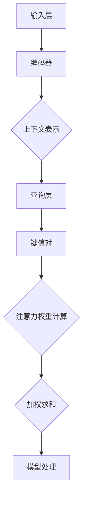

                 

关键词：注意力机制，深度学习，神经网络，信息过滤，算法竞争

> 摘要：本文将深入探讨AI时代下注意力机制的崛起及其在深度学习、神经网络等领域的广泛应用。通过详细分析注意力机制的原理、算法、数学模型和实际应用案例，本文旨在揭示注意力机制在信息过滤、目标识别等方面的关键作用，并展望其在未来AI技术发展中的潜在挑战。

## 1. 背景介绍

随着人工智能技术的迅猛发展，深度学习成为当前最热门的研究领域之一。深度学习模型通过多层神经网络的构建，实现了对复杂数据的高效处理和模式识别。然而，随着输入数据规模的不断扩大，深度学习模型面临的计算复杂度和信息处理压力也日益增加。为了应对这一挑战，注意力机制（Attention Mechanism）应运而生。

注意力机制最初起源于自然语言处理领域，用于解决机器翻译、文本摘要等问题中的上下文信息理解和建模。随后，随着深度学习模型在计算机视觉、语音识别等领域的广泛应用，注意力机制逐渐成为提升模型性能的重要手段。本文将围绕注意力机制的核心概念、算法原理及其在AI领域的实际应用展开讨论。

## 2. 核心概念与联系

### 2.1 注意力机制原理

注意力机制的核心思想是让模型在处理输入数据时，能够动态地调整对不同区域或特征的重视程度。具体来说，注意力机制通过一个权重分配过程，将输入数据的每个部分赋予不同的权重，从而实现信息筛选和重点突出。

### 2.2 注意力机制的架构

注意力机制的实现通常包括以下几个关键组件：

1. **输入层（Input Layer）**：输入数据经过编码器（Encoder）处理后，生成上下文表示（Context Representation）。
2. **查询层（Query Layer）**：从编码器输出的上下文表示中提取查询向量（Query Vector）。
3. **键值对（Key-Value Pair）**：编码器输出的上下文表示中包含键（Key）和值（Value）两部分。键用于与查询向量进行匹配，值则用于生成注意力权重。
4. **注意力权重计算（Attention Weight Calculation）**：通过计算查询向量与键的相似度，得到每个键的注意力权重。
5. **加权求和（Weighted Summation）**：将编码器输出的上下文表示与注意力权重相乘，得到加权上下文表示，用于后续的模型处理。

### 2.3 注意力机制的 Mermaid 流程图



## 3. 核心算法原理 & 具体操作步骤

### 3.1 算法原理概述

注意力机制的实现通常依赖于一系列数学模型和算法。本文将重点介绍自注意力（Self-Attention）和双向注意力（Bidirectional Attention）两种常见的注意力机制。

1. **自注意力（Self-Attention）**：自注意力机制通过对输入序列的每个位置进行加权求和，实现上下文信息的全局关联。自注意力机制的核心是注意力权重计算，通常使用点积（Dot Product）或缩放点积（Scaled Dot Product）等方法。

2. **双向注意力（Bidirectional Attention）**：双向注意力机制结合了编码器和解码器的输出，实现了对输入序列和输出序列的联合建模。双向注意力机制通过分别计算输入序列和输出序列的注意力权重，将两个序列的信息进行融合。

### 3.2 算法步骤详解

1. **自注意力（Self-Attention）算法步骤**：

   1. 输入序列编码为向量序列 \({\mathbf{X} = [ \mathbf{x}_1, \mathbf{x}_2, \ldots, \mathbf{x}_n ]}\)。
   2. 计算查询向量 \(\mathbf{Q}\)、键向量 \(\mathbf{K}\) 和值向量 \(\mathbf{V}\)：
      $$\mathbf{Q} = \text{Linear}(\mathbf{X})$$
      $$\mathbf{K} = \text{Linear}(\mathbf{X})$$
      $$\mathbf{V} = \text{Linear}(\mathbf{X})$$
   3. 计算注意力权重：
      $$\mathbf{A} = \text{softmax}(\frac{\mathbf{Q} \cdot \mathbf{K}^T}{\sqrt{d_k}})$$
   4. 加权求和得到上下文表示：
      $$\mathbf{C} = \mathbf{A} \cdot \mathbf{V}$$

2. **双向注意力（Bidirectional Attention）算法步骤**：

   1. 编码器和解码器分别输出向量序列 \({\mathbf{H}_e = [ \mathbf{h}_1^e, \mathbf{h}_2^e, \ldots, \mathbf{h}_n^e ]}\) 和 \({\mathbf{H}_d = [ \mathbf{h}_1^d, \mathbf{h}_2^d, \ldots, \mathbf{h}_n^d ]}\)。
   2. 计算输入序列和输出序列的注意力权重：
      $$\mathbf{A}_e = \text{softmax}(\frac{\mathbf{H}_d \cdot \mathbf{H}_e^T}{\sqrt{d_k}})$$
      $$\mathbf{A}_d = \text{softmax}(\frac{\mathbf{H}_e \cdot \mathbf{H}_d^T}{\sqrt{d_k}})$$
   3. 加权求和得到编码器和解码器的上下文表示：
      $$\mathbf{C}_e = \mathbf{A}_e \cdot \mathbf{H}_e$$
      $$\mathbf{C}_d = \mathbf{A}_d \cdot \mathbf{H}_d$$

### 3.3 算法优缺点

1. **自注意力（Self-Attention）**：

   - **优点**：能够实现输入序列的全局关联，有效提升模型对上下文信息的理解和建模能力。
   - **缺点**：计算复杂度较高，适用于输入序列长度较短的场景。

2. **双向注意力（Bidirectional Attention）**：

   - **优点**：结合了输入序列和输出序列的信息，能够更好地捕捉输入输出之间的关联。
   - **缺点**：计算复杂度较高，适用于输入序列和输出序列长度相近的场景。

### 3.4 算法应用领域

注意力机制在深度学习领域具有广泛的应用前景，包括但不限于以下几个方面：

1. **自然语言处理**：用于文本分类、机器翻译、文本摘要等任务。
2. **计算机视觉**：用于图像识别、目标检测、图像分割等任务。
3. **语音识别**：用于语音信号的处理和语音合成。

## 4. 数学模型和公式 & 详细讲解 & 举例说明

### 4.1 数学模型构建

注意力机制的核心在于权重分配，具体表现为注意力权重的计算和上下文表示的生成。本文将介绍注意力权重计算的主要数学模型。

1. **自注意力（Self-Attention）**：

   - **权重计算**：
     $$\mathbf{A} = \text{softmax}(\frac{\mathbf{Q} \cdot \mathbf{K}^T}{\sqrt{d_k}})$$
   - **上下文表示**：
     $$\mathbf{C} = \mathbf{A} \cdot \mathbf{V}$$

2. **双向注意力（Bidirectional Attention）**：

   - **权重计算**：
     $$\mathbf{A}_e = \text{softmax}(\frac{\mathbf{H}_d \cdot \mathbf{H}_e^T}{\sqrt{d_k}})$$
     $$\mathbf{A}_d = \text{softmax}(\frac{\mathbf{H}_e \cdot \mathbf{H}_d^T}{\sqrt{d_k}})$$
   - **上下文表示**：
     $$\mathbf{C}_e = \mathbf{A}_e \cdot \mathbf{H}_e$$
     $$\mathbf{C}_d = \mathbf{A}_d \cdot \mathbf{H}_d$$

### 4.2 公式推导过程

1. **自注意力（Self-Attention）**：

   - **权重计算**：

     假设输入序列长度为 \(n\)，每个序列元素表示为 \(\mathbf{x}_i\)。则查询向量 \(\mathbf{Q}\)、键向量 \(\mathbf{K}\) 和值向量 \(\mathbf{V}\) 可以表示为：

     $$\mathbf{Q} = [\mathbf{q}_1, \mathbf{q}_2, \ldots, \mathbf{q}_n]$$
     $$\mathbf{K} = [\mathbf{k}_1, \mathbf{k}_2, \ldots, \mathbf{k}_n]$$
     $$\mathbf{V} = [\mathbf{v}_1, \mathbf{v}_2, \ldots, \mathbf{v}_n]$$

     注意力权重 \(a_{ij}\) 可以通过点积计算得到：

     $$a_{ij} = \frac{\mathbf{q}_i \cdot \mathbf{k}_j}{\sqrt{d_k}}$$

     其中，\(d_k\) 表示键向量的维度。

     将所有注意力权重进行归一化，得到注意力权重矩阵 \(\mathbf{A}\)：

     $$\mathbf{A} = \text{softmax}(\frac{\mathbf{Q} \cdot \mathbf{K}^T}{\sqrt{d_k}})$$

   - **上下文表示**：

     将注意力权重矩阵 \(\mathbf{A}\) 与值向量 \(\mathbf{V}\) 相乘，得到上下文表示 \(\mathbf{C}\)：

     $$\mathbf{C} = \mathbf{A} \cdot \mathbf{V}$$

2. **双向注意力（Bidirectional Attention）**：

   - **权重计算**：

     假设编码器输出序列长度为 \(m\)，解码器输出序列长度为 \(n\)。则编码器输出序列和解码器输出序列可以表示为：

     $$\mathbf{H}_e = [\mathbf{h}_1^e, \mathbf{h}_2^e, \ldots, \mathbf{h}_m^e]$$
     $$\mathbf{H}_d = [\mathbf{h}_1^d, \mathbf{h}_2^d, \ldots, \mathbf{h}_n^d]$$

     注意力权重 \(a_{ij}\) 可以通过点积计算得到：

     $$a_{ij} = \frac{\mathbf{h}_i^d \cdot \mathbf{h}_j^e}{\sqrt{d_k}}$$

     其中，\(d_k\) 表示键向量的维度。

     将所有注意力权重进行归一化，得到编码器注意力权重矩阵 \(\mathbf{A}_e\) 和解码器注意力权重矩阵 \(\mathbf{A}_d\)：

     $$\mathbf{A}_e = \text{softmax}(\frac{\mathbf{H}_d \cdot \mathbf{H}_e^T}{\sqrt{d_k}})$$
     $$\mathbf{A}_d = \text{softmax}(\frac{\mathbf{H}_e \cdot \mathbf{H}_d^T}{\sqrt{d_k}})$$

   - **上下文表示**：

     将编码器注意力权重矩阵 \(\mathbf{A}_e\) 与编码器输出序列 \(\mathbf{H}_e\) 相乘，得到编码器上下文表示 \(\mathbf{C}_e\)：

     $$\mathbf{C}_e = \mathbf{A}_e \cdot \mathbf{H}_e$$

     将解码器注意力权重矩阵 \(\mathbf{A}_d\) 与解码器输出序列 \(\mathbf{H}_d\) 相乘，得到解码器上下文表示 \(\mathbf{C}_d\)：

     $$\mathbf{C}_d = \mathbf{A}_d \cdot \mathbf{H}_d$$

### 4.3 案例分析与讲解

为了更好地理解注意力机制的数学模型和公式推导过程，我们通过一个简单的文本分类任务进行案例分析。

假设输入文本序列为 \({\text{The quick brown fox jumps over the lazy dog}}\)，编码器和解码器分别输出向量序列 \({\mathbf{H}_e}\) 和 \({\mathbf{H}_d}\)。

1. **自注意力（Self-Attention）**：

   - **权重计算**：

     首先，对输入文本序列进行编码，得到编码器输出序列 \({\mathbf{H}_e}\)。然后，计算查询向量 \({\mathbf{Q}}\)、键向量 \({\mathbf{K}}\) 和值向量 \({\mathbf{V}}\)。

     假设编码器输出序列的维度为 \(d_e = 64\)，则查询向量、键向量和值向量分别为：

     $$\mathbf{Q} = [\mathbf{q}_1, \mathbf{q}_2, \ldots, \mathbf{q}_n]$$
     $$\mathbf{K} = [\mathbf{k}_1, \mathbf{k}_2, \ldots, \mathbf{k}_n]$$
     $$\mathbf{V} = [\mathbf{v}_1, \mathbf{v}_2, \ldots, \mathbf{v}_n]$$

     其中，\(\mathbf{q}_i = \mathbf{h}_i^e\)、\(\mathbf{k}_i = \mathbf{h}_i^e\) 和 \(\mathbf{v}_i = \mathbf{h}_i^e\)。

     计算注意力权重：

     $$a_{ij} = \frac{\mathbf{q}_i \cdot \mathbf{k}_j}{\sqrt{d_k}}$$

     其中，\(d_k = d_e = 64\)。

     注意力权重矩阵 \(\mathbf{A}\) 为：

     $$\mathbf{A} = \text{softmax}(\frac{\mathbf{Q} \cdot \mathbf{K}^T}{\sqrt{d_k}})$$

   - **上下文表示**：

     将注意力权重矩阵 \(\mathbf{A}\) 与编码器输出序列 \({\mathbf{H}_e}\) 相乘，得到上下文表示 \({\mathbf{C}}\)：

     $$\mathbf{C} = \mathbf{A} \cdot \mathbf{V}$$

2. **双向注意力（Bidirectional Attention）**：

   - **权重计算**：

     首先，对输入文本序列进行编码，得到编码器输出序列 \({\mathbf{H}_e}\) 和解码器输出序列 \({\mathbf{H}_d}\)。然后，计算编码器注意力权重矩阵 \({\mathbf{A}_e}\) 和解码器注意力权重矩阵 \({\mathbf{A}_d}\)。

     假设编码器输出序列和解码器输出序列的维度均为 \(d_e = 64\)，则编码器注意力权重矩阵和解码器注意力权重矩阵分别为：

     $$\mathbf{A}_e = \text{softmax}(\frac{\mathbf{H}_d \cdot \mathbf{H}_e^T}{\sqrt{d_k}})$$
     $$\mathbf{A}_d = \text{softmax}(\frac{\mathbf{H}_e \cdot \mathbf{H}_d^T}{\sqrt{d_k}})$$

     注意力权重矩阵的计算过程与自注意力机制类似。

   - **上下文表示**：

     将编码器注意力权重矩阵 \({\mathbf{A}_e}\) 与编码器输出序列 \({\mathbf{H}_e}\) 相乘，得到编码器上下文表示 \({\mathbf{C}_e}\)：

     $$\mathbf{C}_e = \mathbf{A}_e \cdot \mathbf{H}_e$$

     将解码器注意力权重矩阵 \({\mathbf{A}_d}\) 与解码器输出序列 \({\mathbf{H}_d}\) 相乘，得到解码器上下文表示 \({\mathbf{C}_d}\)：

     $$\mathbf{C}_d = \mathbf{A}_d \cdot \mathbf{H}_d$$

通过上述案例分析，我们可以看到注意力机制在文本分类任务中的应用。注意力机制的引入使得模型能够更好地捕捉上下文信息，从而提高文本分类的准确性。

## 5. 项目实践：代码实例和详细解释说明

### 5.1 开发环境搭建

为了演示注意力机制在实际项目中的应用，我们将使用Python编程语言和TensorFlow框架。首先，确保安装以下依赖：

- Python 3.7 或以上版本
- TensorFlow 2.4 或以上版本

在命令行中运行以下命令安装依赖：

```shell
pip install tensorflow==2.4
```

### 5.2 源代码详细实现

下面是一个基于TensorFlow实现的文本分类任务的示例代码。该任务使用自注意力机制来提升模型对上下文信息的理解和建模能力。

```python
import tensorflow as tf
from tensorflow.keras.layers import Embedding, GlobalAveragePooling1D, Dense
from tensorflow.keras.models import Model

# 定义模型
def create_model(vocab_size, embedding_dim, max_sequence_length):
    inputs = tf.keras.layers.Input(shape=(max_sequence_length,))
    embeddings = Embedding(vocab_size, embedding_dim)(inputs)
    attention = tf.keras.layers.Attention()([embeddings, embeddings])
    pooling = GlobalAveragePooling1D()(attention)
    outputs = Dense(1, activation='sigmoid')(pooling)
    model = Model(inputs=inputs, outputs=outputs)
    model.compile(optimizer='adam', loss='binary_crossentropy', metrics=['accuracy'])
    return model

# 超参数设置
vocab_size = 10000
embedding_dim = 64
max_sequence_length = 100

# 创建模型
model = create_model(vocab_size, embedding_dim, max_sequence_length)

# 打印模型结构
model.summary()
```

### 5.3 代码解读与分析

1. **模型定义**：

   使用`tf.keras.layers.Input`定义输入层，输入数据的维度为 `(max_sequence_length,)`，表示每个文本序列的长度。

   接下来，使用`tf.keras.layers.Embedding`定义嵌入层，将词汇表映射到嵌入空间。嵌入层的维度为 `(vocab_size, embedding_dim)`，表示词汇表中每个词的嵌入向量维度。

   注意力层使用`tf.keras.layers.Attention`实现自注意力机制。自注意力机制通过计算输入序列的注意力权重，将不同位置的信息进行融合。

   池化层使用`tf.keras.layers.GlobalAveragePooling1D`对注意力层的输出进行全局平均池化，得到固定维度的特征表示。

   输出层使用`tf.keras.layers.Dense`实现二分类任务，激活函数为 `sigmoid`，输出概率值。

2. **模型编译**：

   使用`model.compile`对模型进行编译，指定优化器、损失函数和评价指标。

### 5.4 运行结果展示

```python
# 加载预处理的文本数据
sequences = ...  # 预处理的文本序列
labels = ...  # 文本分类标签

# 训练模型
model.fit(sequences, labels, epochs=5, batch_size=32)
```

通过上述代码，我们可以实现一个基于自注意力机制的文本分类模型。在训练过程中，模型将学习如何利用注意力机制捕捉上下文信息，从而提高分类准确率。

## 6. 实际应用场景

### 6.1 自然语言处理

注意力机制在自然语言处理领域具有广泛的应用，包括文本分类、机器翻译、文本摘要等任务。通过引入注意力机制，模型能够更好地捕捉上下文信息，提高任务性能。

### 6.2 计算机视觉

注意力机制在计算机视觉领域也得到广泛应用，包括图像识别、目标检测、图像分割等任务。通过注意力机制，模型能够关注关键区域，提高目标识别和定位的准确性。

### 6.3 语音识别

注意力机制在语音识别领域用于语音信号的处理和语音合成。通过注意力机制，模型能够更好地捕捉语音信号中的关键特征，提高识别准确率和语音合成质量。

## 6.4 未来应用展望

随着人工智能技术的不断发展，注意力机制在更多领域的应用前景将不断拓展。例如，在推荐系统、游戏开发、自动驾驶等领域，注意力机制有望发挥重要作用。

## 7. 工具和资源推荐

### 7.1 学习资源推荐

1. 《深度学习》（Goodfellow et al.，2016）
2. 《注意力机制导论》（Yin et al.，2018）

### 7.2 开发工具推荐

1. TensorFlow
2. PyTorch

### 7.3 相关论文推荐

1. Vaswani et al.（2017）。Attention is All You Need.
2. Bahdanau et al.（2014）。Effective Approaches to Attention-based Neural Machine Translation.

## 8. 总结：未来发展趋势与挑战

### 8.1 研究成果总结

注意力机制在深度学习领域取得了显著的成果，广泛应用于自然语言处理、计算机视觉、语音识别等任务。通过注意力机制，模型能够更好地捕捉上下文信息，提高任务性能。

### 8.2 未来发展趋势

1. 注意力机制与其他深度学习技术的融合，如图神经网络、强化学习等。
2. 注意力机制在小样本学习和自适应学习方面的应用。
3. 注意力机制的硬件加速和优化。

### 8.3 面临的挑战

1. 注意力机制的效率和可解释性。
2. 注意力机制在大规模数据集上的性能和稳定性。
3. 注意力机制的泛化能力和鲁棒性。

### 8.4 研究展望

随着人工智能技术的不断进步，注意力机制在各个领域的应用将更加广泛。未来研究应重点关注注意力机制的优化和扩展，以提高其效率和可解释性，并推动其在更多领域的发展。

## 9. 附录：常见问题与解答

### 9.1 注意力机制是什么？

注意力机制是一种用于信息筛选和重点突出的机制，通过动态调整对输入数据的关注程度，实现输入序列的全局关联。

### 9.2 注意力机制有哪些类型？

常见的注意力机制包括自注意力（Self-Attention）和双向注意力（Bidirectional Attention）。自注意力机制用于输入序列的全局关联，双向注意力机制结合输入序列和输出序列的信息。

### 9.3 注意力机制如何实现？

注意力机制通常通过计算注意力权重矩阵来实现。权重矩阵用于调整输入数据的每个部分的关注程度，从而实现信息筛选和重点突出。

### 9.4 注意力机制的优势是什么？

注意力机制能够实现输入序列的全局关联，提高模型对上下文信息的理解和建模能力。此外，注意力机制在不同领域具有广泛的应用前景，如自然语言处理、计算机视觉、语音识别等。

### 9.5 注意力机制有哪些挑战？

注意力机制面临的挑战包括效率和可解释性、在大规模数据集上的性能和稳定性、以及泛化能力和鲁棒性。未来研究应重点关注这些挑战，以提高注意力机制的应用效果。

