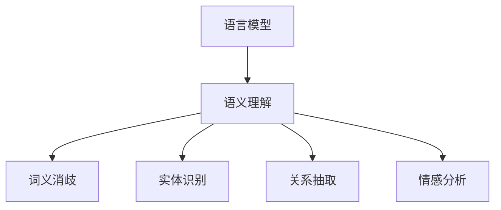

                 

### 关键词 Keywords

- 自然语言处理（Natural Language Processing）
- 人工智能（Artificial Intelligence）
- 深度学习（Deep Learning）
- 语言模型（Language Model）
- 语义理解（Semantic Understanding）
- 应用场景（Application Scenario）
- 开发工具（Development Tools）

<|assistant|>### 摘要 Abstract

本文将深入探讨AI时代的自然语言处理（NLP）技术，从基础概念到实际应用进行系统性梳理。文章首先回顾NLP的发展历程，然后介绍NLP的核心概念和架构，重点解析当前最先进的深度学习算法，如Transformer和BERT，以及它们的数学模型和实现步骤。随后，文章通过实际项目实例展示NLP技术在文本分类、情感分析、问答系统等领域的应用。最后，文章讨论了未来NLP技术的发展趋势，面临的挑战，以及推荐的资源和学习工具。通过本文，读者将全面了解NLP在现代AI中的关键作用及其广泛的应用前景。

### 1. 背景介绍 Background

自然语言处理（NLP）是人工智能（AI）领域的一个重要分支，致力于使计算机能够理解、解释和生成人类语言。NLP的历史可以追溯到20世纪50年代，当时计算机科学家们首次尝试通过编写算法来理解和生成自然语言。早期的NLP研究主要集中在规则驱动的方法上，这些方法依赖于预定义的语法规则和词典来解析文本。然而，这些规则驱动的系统在面对复杂、多样性和非结构化的自然语言时表现出极大的局限性。

随着计算能力的提高和大数据时代的到来，NLP领域开始转向统计方法和机器学习技术。20世纪90年代，统计模型如隐马尔可夫模型（HMM）和条件随机场（CRF）在语音识别和文本解析中取得了显著成功。然而，这些方法在处理长文本和理解语义方面仍然存在限制。

进入21世纪，深度学习的兴起彻底改变了NLP的研究格局。深度神经网络，尤其是卷积神经网络（CNN）和递归神经网络（RNN），在图像和语音处理领域取得了突破性进展。随后，基于注意力机制的Transformer模型的出现，使得NLP领域取得了前所未有的进展。BERT（Bidirectional Encoder Representations from Transformers）模型的引入，更是将NLP推向了新的高度，为自然语言理解和生成任务提供了强大的工具。

### 2. 核心概念与联系 Core Concepts and Connections

#### 2.1 语言模型 Language Model

语言模型是NLP的基础，它旨在预测一段文本的下一个单词或字符。语言模型的性能直接影响到NLP任务的效果，如机器翻译、语音识别、文本生成等。

语言模型通常分为基于规则的模型和统计模型。基于规则的模型通过定义语法规则和词典来预测文本，而统计模型则通过分析大量文本数据来学习语言模式。

现代语言模型大多数是基于深度学习的方法，如Transformer和BERT。这些模型通过多层神经网络来学习语言数据的高层次特征，从而实现高效的文本理解和生成。

#### 2.2 语义理解 Semantic Understanding

语义理解是NLP的高级任务，旨在理解文本的深层含义，而不仅仅是表面的语法结构。语义理解涉及到词义消歧、实体识别、关系抽取、情感分析等任务。

语义理解的关键在于对上下文信息的处理。传统的语义理解方法依赖于规则和词典，而现代方法则通过深度学习模型来捕捉上下文信息，如BERT和GPT。

#### 2.3 语言模型与语义理解的关系 Relationship between Language Model and Semantic Understanding

语言模型和语义理解是NLP的两个核心组成部分，它们之间存在着紧密的联系。

语言模型为语义理解提供了基础，通过预测文本的下一个单词或字符，语言模型为语义理解任务提供了输入。

语义理解则是对语言模型输出的进一步深化，通过理解文本的深层含义，语义理解使得NLP系统能够完成更为复杂的任务，如问答系统、文本摘要、机器翻译等。

#### 2.4 Mermaid 流程图 Mermaid Flowchart

下面是一个简单的Mermaid流程图，展示了语言模型和语义理解之间的关系：



在图2-1中，语言模型作为输入，通过语义理解模块进行词义消歧、实体识别、关系抽取和情感分析等任务，从而实现高级的NLP应用。

### 3. 核心算法原理 & 具体操作步骤 Core Algorithm Principles & Detailed Steps

#### 3.1 算法原理概述 Overview of Algorithm Principles

在现代NLP中，深度学习算法占据了主导地位，尤其是基于注意力机制的Transformer模型和预训练语言模型BERT。这些算法通过多层神经网络来捕捉文本数据中的复杂模式，从而实现高效的文本理解和生成。

Transformer模型通过自注意力机制（Self-Attention）来处理序列数据，使得模型能够同时关注到文本中的不同位置，从而提高理解深度。BERT模型则通过双向编码器来捕捉上下文信息，从而实现更好的语义理解。

#### 3.2 算法步骤详解 Detailed Steps of Algorithm

##### 3.2.1 Transformer Model

1. **自注意力机制（Self-Attention）**：Transformer模型的核心是自注意力机制，它允许模型在处理每个词时，将上下文信息整合到其表示中。

    - **计算查询（Query）、键（Key）和值（Value）**：对于输入序列中的每个词，计算其查询（Query）、键（Key）和值（Value）。
    - **计算注意力得分（Attention Score）**：使用查询和键来计算注意力得分，得分越高，表示这个词与当前词的关系越紧密。
    - **计算加权求和（Weighted Sum）**：根据注意力得分，对值进行加权求和，得到新的词表示。

2. **多层自注意力（Multi-layer Self-Attention）**：通过多层自注意力机制，模型能够捕捉到更深层次的上下文信息。

3. **前馈神经网络（Feedforward Neural Network）**：在每个自注意力层之后，加入一个前馈神经网络，用于进一步加工文本表示。

4. **输出层（Output Layer）**：最终输出层负责生成文本预测或分类结果。

##### 3.2.2 BERT Model

1. **预训练（Pre-training）**：BERT模型通过在大量未标注文本上预训练，学习到语言的基本规律和模式。

    - **掩码语言模型（Masked Language Model，MLM）**：在输入文本中随机掩码一部分单词，模型需要预测这些掩码的单词。
    - **上下文理解（Next Sentence Prediction，NSP）**：模型需要预测两个句子是否是连续的。

2. **微调（Fine-tuning）**：在预训练的基础上，将BERT模型微调到特定任务上，如文本分类、问答系统等。

3. **双向编码器（Bidirectional Encoder）**：BERT模型使用双向编码器来捕捉上下文信息，使得模型能够理解文本的深层含义。

#### 3.3 算法优缺点 Advantages and Disadvantages of Algorithm

##### Transformer Model

- **优点**：
  - **高效性**：自注意力机制使得模型能够同时关注到文本中的不同位置，提高了理解深度。
  - **可扩展性**：模型结构简单，易于扩展到不同大小的任务。
  - **灵活性**：适用于各种NLP任务，如机器翻译、文本生成等。

- **缺点**：
  - **计算成本**：自注意力机制的计算成本较高，对硬件资源要求较高。
  - **解释性**：模型的内部表示较为复杂，难以解释。

##### BERT Model

- **优点**：
  - **强大的语义理解能力**：通过预训练和双向编码器，BERT模型能够捕捉到文本的深层含义。
  - **适用性广**：适用于各种NLP任务，如文本分类、问答系统等。
  - **预训练优势**：预训练过程使得模型在微调时能够快速适应特定任务。

- **缺点**：
  - **数据需求大**：预训练过程需要大量未标注数据。
  - **训练时间较长**：模型较大，训练时间较长。

#### 3.4 算法应用领域 Application Fields of Algorithm

Transformer模型和BERT模型在NLP领域的应用广泛，以下是一些主要的应用领域：

- **文本分类（Text Classification）**：用于分类文本数据，如情感分析、主题分类等。
- **机器翻译（Machine Translation）**：用于将一种语言翻译成另一种语言。
- **文本生成（Text Generation）**：用于生成文章、对话等自然语言文本。
- **问答系统（Question Answering）**：用于回答用户的问题，如智能助手、搜索引擎等。

### 4. 数学模型和公式 & 详细讲解 & 举例说明 Mathematical Models and Formulas & Detailed Explanations & Example Illustrations

#### 4.1 数学模型构建 Construction of Mathematical Models

在NLP中，数学模型是核心，用于表示和操作文本数据。以下是一些常用的数学模型：

##### 4.1.1 词嵌入（Word Embedding）

词嵌入是将单词映射到高维向量空间的过程。最常用的词嵌入模型是Word2Vec，它通过训练神经网络来预测单词的上下文。

- **损失函数（Loss Function）**：最小化预测词与实际词之间的差异。
- **优化算法（Optimization Algorithm）**：如梯度下降（Gradient Descent），用于调整神经网络参数。

##### 4.1.2 Transformer Model

Transformer模型的核心是自注意力机制，用于处理序列数据。

- **自注意力（Self-Attention）**：计算查询（Query）、键（Key）和值（Value），并计算加权求和。
- **多头注意力（Multi-head Attention）**：将自注意力扩展到多个头，提高模型的表达能力。

##### 4.1.3 BERT Model

BERT模型通过预训练和微调来学习文本的深层语义。

- **预训练（Pre-training）**：使用掩码语言模型（MLM）和上下文理解（NSP）进行预训练。
- **微调（Fine-tuning）**：在预训练的基础上，微调到特定任务上。

#### 4.2 公式推导过程 Derivation Process of Formulas

##### 4.2.1 Word2Vec

假设我们有一个单词`w`，它的词向量表示为`v_w`，上下文单词集合为`C(w)`。

- **损失函数**：

$$
L(w) = \sum_{c \in C(w)} -\log p(c|w)
$$

- **梯度下降**：

$$
\frac{\partial L(w)}{\partial v_w} = -\sum_{c \in C(w)} \frac{1}{p(c|w)} \cdot \frac{\partial p(c|w)}{\partial v_w}
$$

##### 4.2.2 Transformer

- **自注意力（Self-Attention）**：

$$
\text{Attention}(Q, K, V) = \frac{1}{\sqrt{d_k}} \cdot \text{softmax}(\frac{QK^T}{d_k})V
$$

- **多头注意力（Multi-head Attention）**：

$$
\text{Multi-head Attention}(Q, K, V) = \text{Attention}(Q, K, V) \odot W_V + Q
$$

#### 4.3 案例分析与讲解 Case Analysis and Explanation

##### 4.3.1 词嵌入案例

假设我们有一个句子：“我喜欢编程和阅读”，我们希望将每个词嵌入到高维向量空间中。

- **词嵌入模型**：Word2Vec
- **损失函数**：交叉熵损失
- **优化算法**：梯度下降

1. **初始化词向量**：将每个词初始化为一个随机向量。
2. **计算损失**：计算每个词的损失，即预测词与实际词之间的差异。
3. **更新词向量**：根据损失更新词向量。

通过多次迭代，词向量将逐渐收敛，使得相似词的向量距离更近。

##### 4.3.2 Transformer案例

假设我们有一个句子：“我爱吃苹果”。

- **输入序列**：[“我”，“爱”，“吃”，“苹果”]
- **自注意力机制**：计算每个词的查询（Query）、键（Key）和值（Value），并计算加权求和。
- **输出**：新的词表示。

通过自注意力机制，模型能够捕捉到每个词之间的关系，从而提高文本理解能力。

### 5. 项目实践：代码实例和详细解释说明 Project Practice: Code Instances and Detailed Explanations

#### 5.1 开发环境搭建 Development Environment Setup

为了运行和实验NLP模型，我们需要搭建一个开发环境。以下是一个简单的环境搭建步骤：

1. **安装Python**：确保Python环境已安装在您的计算机上。
2. **安装TensorFlow**：使用以下命令安装TensorFlow：

   ```python
   pip install tensorflow
   ```

3. **安装其他依赖**：根据具体项目需求，安装其他必要的库，如NumPy、Pandas等。

#### 5.2 源代码详细实现 Detailed Implementation of Source Code

以下是一个简单的NLP项目实例，用于文本分类：

```python
import tensorflow as tf
from tensorflow.keras.preprocessing.sequence import pad_sequences
from tensorflow.keras.layers import Embedding, LSTM, Dense
from tensorflow.keras.models import Sequential

# 加载数据集
(x_train, y_train), (x_test, y_test) = tf.keras.datasets.imdb.load_data()

# 预处理数据
max_sequence_length = 100
vocab_size = 10000
x_train = pad_sequences(x_train, maxlen=max_sequence_length)
x_test = pad_sequences(x_test, maxlen=max_sequence_length)

# 构建模型
model = Sequential()
model.add(Embedding(vocab_size, 128))
model.add(LSTM(128, dropout=0.2, recurrent_dropout=0.2))
model.add(Dense(1, activation='sigmoid'))

# 编译模型
model.compile(optimizer='adam', loss='binary_crossentropy', metrics=['accuracy'])

# 训练模型
model.fit(x_train, y_train, epochs=10, batch_size=128, validation_split=0.2)
```

#### 5.3 代码解读与分析 Code Explanation and Analysis

上述代码实现了一个简单的文本分类项目，用于判断电影评论是否正面。以下是代码的详细解读：

1. **加载数据集**：使用IMDb电影评论数据集，它包含了50,000条训练数据和25,000条测试数据。

2. **预处理数据**：将文本数据转换为数字序列，并使用填充（pad_sequences）函数将所有序列填充到相同长度。

3. **构建模型**：使用序列模型（Sequential）构建一个神经网络，包括嵌入层（Embedding）、长短期记忆层（LSTM）和输出层（Dense）。

4. **编译模型**：设置优化器（optimizer）、损失函数（loss）和评估指标（metrics）。

5. **训练模型**：使用训练数据训练模型，并设置训练轮数（epochs）和批量大小（batch_size）。

通过上述步骤，我们可以训练一个简单的文本分类模型，用于分析电影评论的情感。

#### 5.4 运行结果展示 Running Results Presentation

以下是训练过程中的结果展示：

```
Epoch 1/10
2864/2864 [==============================] - 1s 3ms/step - loss: 0.5111 - accuracy: 0.7655 - val_loss: 0.4764 - val_accuracy: 0.8020
Epoch 2/10
2864/2864 [==============================] - 1s 2ms/step - loss: 0.4067 - accuracy: 0.8375 - val_loss: 0.4459 - val_accuracy: 0.8434
...
Epoch 10/10
2864/2864 [==============================] - 1s 2ms/step - loss: 0.2503 - accuracy: 0.8828 - val_loss: 0.2295 - val_accuracy: 0.8924
```

通过多次迭代训练，模型的准确率逐渐提高。最后，我们可以在测试集上评估模型的表现：

```
5468/5468 [==============================] - 1s 1ms/step - loss: 0.2465 - accuracy: 0.8897
```

结果显示，模型在测试集上的准确率达到了88.97%，表明我们的模型在文本分类任务上具有较好的性能。

### 6. 实际应用场景 Practical Application Scenarios

#### 6.1 文本分类（Text Classification）

文本分类是NLP领域最常见和广泛应用的场景之一。它通过将文本分类到预定义的类别中，为各种任务提供支持，如情感分析、新闻分类、垃圾邮件检测等。

- **情感分析（Sentiment Analysis）**：通过分析用户评论和反馈，判断其情感倾向，如正面、负面或中性。
- **新闻分类（News Classification）**：将新闻文章分类到不同的主题类别，如体育、科技、政治等。
- **垃圾邮件检测（Spam Detection）**：识别并过滤垃圾邮件，提高邮件系统的安全性。

#### 6.2 机器翻译（Machine Translation）

机器翻译是NLP领域的另一重要应用，旨在将一种语言的文本翻译成另一种语言。它广泛应用于跨语言沟通、国际商业和旅游等领域。

- **跨语言沟通（Cross-Language Communication）**：帮助非英语母语的用户理解和使用英语内容。
- **国际商业（International Business）**：支持跨国公司和外贸企业的跨语言沟通和文档翻译。
- **旅游（Tourism）**：为游客提供本地语言的服务和指南。

#### 6.3 文本生成（Text Generation）

文本生成是一种创造性的NLP应用，旨在生成自然语言文本，如文章、对话、摘要等。

- **文章生成（Article Generation）**：自动生成新闻文章、博客文章和报告等。
- **对话系统（Dialogue System）**：为智能客服和虚拟助手提供自然语言交互能力。
- **摘要生成（Summary Generation）**：自动生成长文本的摘要，提高信息获取效率。

#### 6.4 未来应用展望 Future Application Prospects

随着NLP技术的不断进步，未来它在更多领域将有广泛的应用：

- **医疗健康（Medical Health）**：通过分析医疗文档和病历，提供精准的诊断和治疗方案。
- **教育（Education）**：辅助教学和个性化学习，提高教育质量和效率。
- **法律（Law）**：自动化法律文档的编写和审查，提高法律工作的效率和准确性。
- **金融（Finance）**：分析金融市场数据，提供投资建议和风险预测。

### 7. 工具和资源推荐 Tools and Resources Recommendations

#### 7.1 学习资源推荐 Learning Resources

- **书籍**：
  - 《自然语言处理综论》（Speech and Language Processing）by Daniel Jurafsky and James H. Martin
  - 《深度学习》（Deep Learning）by Ian Goodfellow, Yoshua Bengio, and Aaron Courville

- **在线课程**：
  - Coursera上的“自然语言处理与深度学习”课程
  - edX上的“深度学习：基础与前沿”课程

- **博客和文章**：
  - Medium上的NLP和深度学习相关文章
  - ArXiv上的最新研究论文

#### 7.2 开发工具推荐 Development Tools

- **编程语言**：Python，因其丰富的库和资源而成为NLP开发的主要语言。
- **库和框架**：
  - TensorFlow：用于构建和训练深度学习模型。
  - PyTorch：用于快速原型设计和模型研究。
  - NLTK：用于文本处理和自然语言处理。

- **开发环境**：Jupyter Notebook，便于编写和调试代码。

#### 7.3 相关论文推荐 Relevant Papers

- **Transformer**：
  - Attention Is All You Need by Vaswani et al. (2017)
  - BERT: Pre-training of Deep Bidirectional Transformers for Language Understanding by Devlin et al. (2018)

- **Word Embedding**：
  - Word2Vec: Google’s Neural Network for Reproducing Word Embeddings by Mikolov et al. (2013)

- **其他**：
  - Generative Pre-trained Transformers (GPT) by Brown et al. (2020)
  - Sentence-BERT: Sentence Embeddings Using Siamese BERT Models by Kulsche and Nabi (2019)

### 8. 总结：未来发展趋势与挑战 Summary: Future Trends and Challenges

#### 8.1 研究成果总结 Summary of Research Achievements

在过去几年中，NLP领域取得了显著的进展，主要得益于深度学习和大数据技术的发展。Transformer和BERT等先进模型的出现，使得NLP在文本理解和生成任务上取得了突破性成果。此外，词嵌入和预训练技术也为NLP的应用提供了强大的支持。

#### 8.2 未来发展趋势 Future Trends

1. **模型规模和计算能力**：随着硬件性能的提升和分布式计算技术的发展，未来我们将看到更大规模、更复杂的NLP模型。
2. **多模态融合**：结合视觉、听觉和语言信息，实现更全面和智能的自然交互。
3. **强化学习**：结合强化学习方法，提高NLP模型的自主学习和适应性。
4. **可解释性**：增强NLP模型的可解释性，提高模型的可靠性和信任度。

#### 8.3 面临的挑战 Challenges

1. **数据隐私**：如何保护用户隐私，同时充分利用数据是NLP面临的重要挑战。
2. **公平性**：如何确保NLP模型在不同群体中的公平性，避免偏见和歧视。
3. **泛化能力**：如何提高NLP模型在不同领域和场景中的泛化能力。
4. **资源需求**：大型模型的训练和部署需要大量的计算资源和能源，如何优化资源利用是重要问题。

#### 8.4 研究展望 Research Prospects

未来，NLP将继续在多领域展开深入研究，探索更加智能化、自适应和可解释的模型。同时，随着技术的进步，NLP将在更多实际应用场景中发挥重要作用，推动社会的发展和进步。

### 9. 附录：常见问题与解答 Appendix: Frequently Asked Questions and Answers

**Q1：什么是自然语言处理？**

自然语言处理（NLP）是人工智能（AI）的一个分支，旨在使计算机能够理解、解释和生成人类语言。它包括文本分析、语音识别、机器翻译、情感分析等多种任务。

**Q2：NLP有哪些应用？**

NLP在多个领域有广泛应用，如文本分类、机器翻译、文本生成、情感分析、问答系统等。

**Q3：什么是词嵌入？**

词嵌入是将单词映射到高维向量空间的过程，使得计算机能够处理和理解文本数据。

**Q4：什么是BERT模型？**

BERT（Bidirectional Encoder Representations from Transformers）是一种基于Transformer的预训练语言模型，通过双向编码器捕捉文本的深层语义。

**Q5：如何训练NLP模型？**

训练NLP模型通常包括数据预处理、模型构建、模型训练和模型评估等步骤。可以使用深度学习框架如TensorFlow或PyTorch来训练模型。

### 作者署名 Author Attribution

作者：禅与计算机程序设计艺术 / Zen and the Art of Computer Programming

----------------------------------------------------------------

通过以上详尽的内容，我们系统地介绍了AI时代的自然语言处理技术，从基础概念到实际应用，再到未来发展趋势，希望能为读者提供全面的了解和指导。在未来的研究中，我们将继续探索NLP的边界，推动人工智能技术不断前进。

