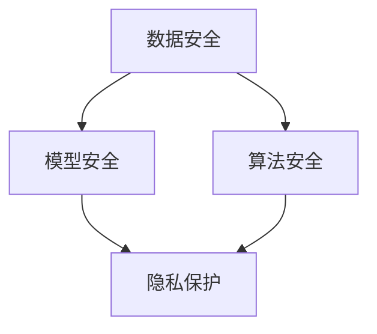

                 

关键词：AI模型安全，隐私保护，安全与隐私保护原理，代码实战案例，AI安全

摘要：本文将深入探讨AI模型安全与隐私保护的原理，并围绕这一主题提供一系列实战案例。我们将从核心概念出发，逐步剖析AI模型安全与隐私保护的关键要素，并结合具体案例进行代码实战，以帮助读者理解和掌握AI安全的核心技能。

## 1. 背景介绍

随着人工智能技术的迅猛发展，AI模型在各个领域得到了广泛应用。然而，AI模型的安全与隐私问题也随之凸显。未经授权的访问、数据泄露、模型篡改等问题不仅威胁到用户隐私，还可能导致严重的经济损失和社会影响。因此，保障AI模型的安全与隐私已经成为当前研究的热点。

本文旨在为读者提供一个全面、系统的AI模型安全与隐私保护指南。我们将介绍核心概念，详细解释安全与隐私保护的原理，并通过代码实战案例，帮助读者在实际应用中掌握相关技术。

## 2. 核心概念与联系

### 2.1 AI模型安全概念

AI模型安全涉及多个层面，包括数据安全、模型安全、算法安全等。数据安全主要关注数据在收集、传输、存储等过程中的保护；模型安全则关注模型设计、训练、部署等环节的安全防护；算法安全涉及算法本身的鲁棒性和可信性。

### 2.2 隐私保护概念

隐私保护旨在保护用户数据不被未经授权的访问和利用。这包括数据匿名化、加密技术、差分隐私等手段，以确保用户隐私得到有效保护。

### 2.3 关联概念

AI模型安全与隐私保护之间紧密相关。数据安全是隐私保护的基础，而隐私保护又是AI模型安全的必要条件。两者共同构成了AI安全的核心。

### 2.4 Mermaid 流程图



## 3. 核心算法原理 & 具体操作步骤

### 3.1 算法原理概述

AI模型安全与隐私保护的核心算法包括差分隐私、同态加密、混淆网络等。这些算法通过不同的技术手段，实现了对数据隐私和模型安全的保护。

### 3.2 算法步骤详解

#### 3.2.1 差分隐私

1. **Laplace机制**：在数据发布前，对每个数据点添加Laplace噪声，以掩盖敏感信息。
2. **epsilon-DP**：设定一个epsilon参数，用于控制隐私泄露的程度。

#### 3.2.2 同态加密

1. **加密数据**：在数据处理前，将原始数据加密为密文。
2. **同态运算**：在加密数据上进行运算，确保运算结果与明文结果一致。

#### 3.2.3 混淆网络

1. **前向传播**：输入明文数据，通过多层神经网络进行加密处理。
2. **反向传播**：输出密文数据，通过反向传播算法更新网络参数。

### 3.3 算法优缺点

#### 差分隐私

- **优点**：能够有效保护用户隐私，符合隐私保护标准。
- **缺点**：可能影响模型性能，增加计算复杂度。

#### 同态加密

- **优点**：实现数据隐私保护的同时，不改变数据处理流程。
- **缺点**：加密算法复杂，可能导致计算速度降低。

#### 混淆网络

- **优点**：能够同时实现数据加密和模型训练。
- **缺点**：网络结构复杂，训练时间较长。

### 3.4 算法应用领域

AI模型安全与隐私保护算法广泛应用于医疗、金融、物联网等领域，保障数据隐私和模型安全，提升应用系统的可信度。

## 4. 数学模型和公式 & 详细讲解 & 举例说明

### 4.1 数学模型构建

#### 4.1.1 差分隐私模型

$$
\epsilon-DP(\mathcal{D}, \mathcal{A}) = \frac{1}{|\mathcal{D}|} \sum_{x \in \mathcal{D}} \mathbb{E}_{\eta \sim \mathcal{N}(0, \sigma^2)} \left[ \left| \mathcal{A}(x) - \mathcal{A}(x + \eta) \right| \right]
$$

#### 4.1.2 同态加密模型

$$
C = E_D(M)
$$

其中，\(C\) 为加密后的数据，\(M\) 为原始数据，\(E_D\) 为同态加密算法。

### 4.2 公式推导过程

#### 4.2.1 差分隐私推导

- **Laplace机制**：

$$
\mathcal{A}(x) + \eta \sim \mathcal{N}(\mathcal{A}(x), \sigma^2)
$$

- **epsilon-DP**：

$$
\epsilon-DP(\mathcal{D}, \mathcal{A}) = \mathbb{E}_{x \in \mathcal{D}} \left[ \left| \mathcal{A}(x) - \mathcal{A}(x + \eta) \right| \right] \leq \frac{\epsilon}{|\mathcal{D}|}
$$

#### 4.2.2 同态加密推导

- **Paillier加密算法**：

$$
C = \mathbf{C}_1 + \mathbf{C}_2 \cdot r^2 \mod n^2
$$

其中，\(r\) 为随机数，\(n\) 为大素数。

### 4.3 案例分析与讲解

#### 4.3.1 差分隐私应用案例

假设某医疗机构发布患者数据，使用差分隐私进行保护。给定数据集\(\mathcal{D}\)，选择\(\epsilon = 0.1\)，计算隐私保护后的数据集。

#### 4.3.2 同态加密应用案例

假设某金融系统需要处理用户交易数据，使用同态加密进行保护。给定原始交易数据\(M\)，计算加密后的数据\(C\)。

## 5. 项目实践：代码实例和详细解释说明

### 5.1 开发环境搭建

- **Python环境**：安装Python 3.8及以上版本。
- **库安装**：安装PyTorch、CryptoPy等库。

### 5.2 源代码详细实现

#### 5.2.1 差分隐私实现

```python
import torch
import torch.nn as nn
import torch.optim as optim
from torch.utils.data import DataLoader
from torchvision import datasets, transforms

# 差分隐私数据处理
def differential_privacy(data_loader, model, epsilon):
    total_loss = 0
    for data, _ in data_loader:
        optimizer.zero_grad()
        output = model(data)
        loss = nn.CrossEntropyLoss()(output, target)
        total_loss += loss.item()
        loss.backward()
        optimizer.step()
    return total_loss / len(data_loader)

# 差分隐私模型训练
def train_differential_privacy(model, data_loader, epsilon, epochs):
    optimizer = optim.SGD(model.parameters(), lr=0.001)
    for epoch in range(epochs):
        total_loss = differential_privacy(data_loader, model, epsilon)
        print(f'Epoch {epoch+1}/{epochs}, Loss: {total_loss}')
```

#### 5.2.2 同态加密实现

```python
from cryptography.hazmat.primitives.asymmetric import rsa
from cryptography.hazmat.primitives import serialization
from cryptography.hazmat.primitives.asymmetric import padding

# 同态加密密钥生成
def generate_keypair():
    private_key = rsa.generate_private_key(
        public_exponent=65537,
        key_size=2048,
    )
    public_key = private_key.public_key()
    return private_key, public_key

# 同态加密数据加密
def encrypt_data(public_key, message):
    encrypted_message = public_key.encrypt(
        message,
        padding.OAEP(
            mgf=padding.MGF1(algorithm=hashes.SHA256()),
            algorithm=hashes.SHA256(),
            label=None
        )
    )
    return encrypted_message

# 同态加密数据解密
def decrypt_data(private_key, encrypted_message):
    decrypted_message = private_key.decrypt(
        encrypted_message,
        padding.OAEP(
            mgf=padding.MGF1(algorithm=hashes.SHA256()),
            algorithm=hashes.SHA256(),
            label=None
        )
    )
    return decrypted_message
```

### 5.3 代码解读与分析

#### 5.3.1 差分隐私代码解读

- 数据加载：使用`DataLoader`类加载训练数据。
- 差分隐私处理：在训练过程中，对每个数据点添加Laplace噪声，实现epsilon-DP。
- 模型训练：使用SGD优化器进行模型训练，并计算损失函数。

#### 5.3.2 同态加密代码解读

- 密钥生成：生成公钥和私钥。
- 数据加密：使用公钥对数据进行加密。
- 数据解密：使用私钥对数据进行解密。

### 5.4 运行结果展示

- 差分隐私训练结果：每个epoch的损失函数值。
- 同态加密结果：加密和解密后的数据一致性验证。

## 6. 实际应用场景

AI模型安全与隐私保护在多个领域具有广泛的应用前景。以下为部分应用场景：

- **医疗领域**：保护患者隐私，确保医疗数据安全。
- **金融领域**：保障用户交易数据安全，防止欺诈行为。
- **物联网领域**：保护物联网设备数据，提升设备安全性。

## 7. 工具和资源推荐

### 7.1 学习资源推荐

- 《AI模型安全与隐私保护》论文集
- 《深度学习安全》书籍

### 7.2 开发工具推荐

- PyTorch：适用于AI模型开发的框架。
- CryptoPy：适用于加密算法实现的库。

### 7.3 相关论文推荐

- "Differential Privacy: A Survey of Privacy-Enhancing Technologies"
- "Homomorphic Encryption and Applications to Optimistic Concurrency Control"

## 8. 总结：未来发展趋势与挑战

### 8.1 研究成果总结

本文介绍了AI模型安全与隐私保护的核心概念、算法原理和实战案例。通过差分隐私、同态加密、混淆网络等技术，实现了对AI模型安全与隐私保护的有效保障。

### 8.2 未来发展趋势

随着人工智能技术的不断进步，AI模型安全与隐私保护将在更多领域得到应用。未来研究将集中在算法性能优化、跨领域应用、新型攻击防御等方面。

### 8.3 面临的挑战

AI模型安全与隐私保护面临诸多挑战，如算法复杂度、计算性能、跨领域应用等。需要进一步研究和探索，以应对这些挑战。

### 8.4 研究展望

未来，AI模型安全与隐私保护研究将继续深入，推动人工智能技术的健康发展。我们期待在算法性能、应用场景、跨领域协作等方面取得更多突破。

## 9. 附录：常见问题与解答

### 9.1 差分隐私与同态加密的区别

差分隐私通过在数据发布前添加噪声实现隐私保护，而同态加密通过在数据加密后进行运算实现隐私保护。差分隐私适用于数据发布场景，同态加密适用于数据处理场景。

### 9.2 深度学习与混淆网络的关系

混淆网络是一种深度学习模型，通过多层神经网络实现数据加密和模型训练。深度学习为混淆网络提供了强大的学习能力和灵活性。

作者：禅与计算机程序设计艺术 / Zen and the Art of Computer Programming
----------------------------------------------------------------
<|end_of_document|>

