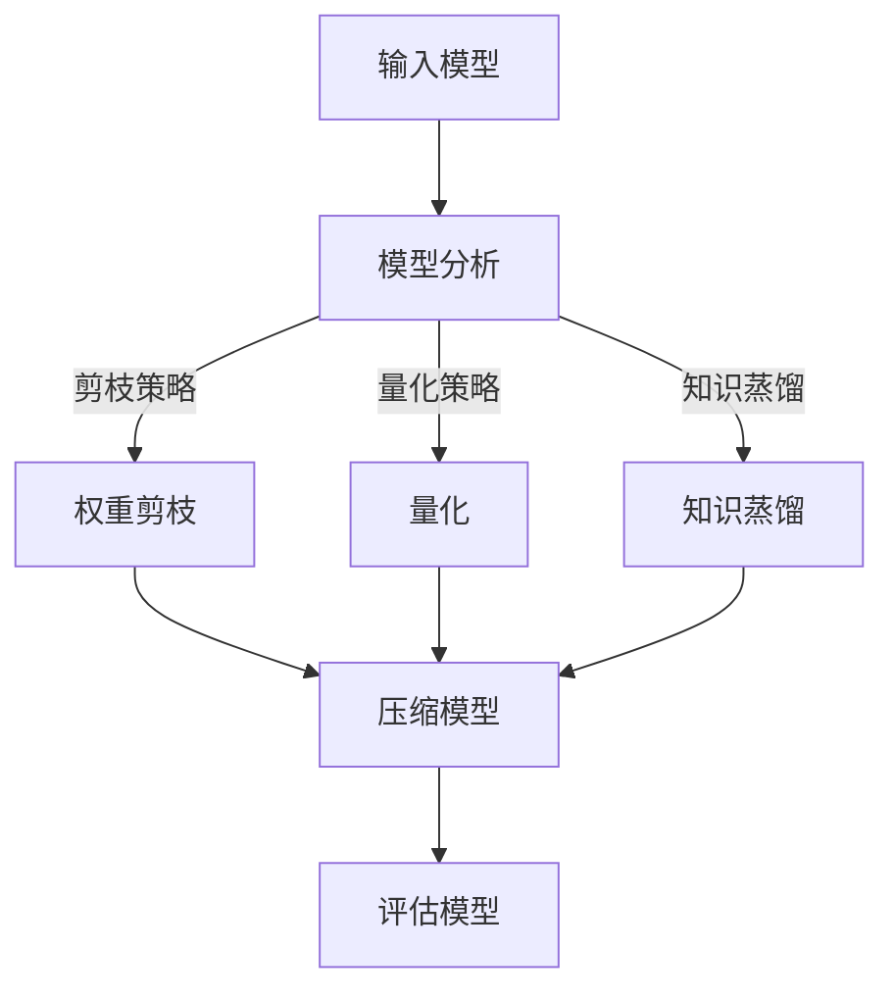

                 

在当今快速发展的技术环境中，人工智能（AI）模型的规模和复杂性持续增加。这些模型在处理大量数据时具有显著的性能优势，但随着规模的扩大，它们的存储和计算资源需求也急剧增加。这就促使我们需要寻找方法来减轻AI模型的负担，以提高其运行效率和可扩展性。本文将探讨AI模型自动压缩技术，这是一种新兴的方法，旨在减少模型的大小和计算成本，同时保持其性能。

> **关键词**：AI模型压缩、神经网络、自动机器学习、模型压缩算法、敏捷软件开发

> **摘要**：本文介绍了AI模型自动压缩的背景、核心概念、算法原理、数学模型、实践应用以及未来展望。通过深入分析，本文揭示了AI模型压缩在提高模型效率、降低计算成本方面的巨大潜力，并展望了其在实际应用中的前景。

## 1. 背景介绍

随着深度学习的广泛应用，AI模型的规模和复杂性急剧增加。大型神经网络模型如GPT-3、BERT等在处理大规模数据集时表现出色，但它们也需要大量的存储和计算资源。这使得部署这些模型成为一个挑战，尤其是在资源受限的环境中，如移动设备、嵌入式系统和物联网（IoT）设备。

为了解决这一问题，研究人员提出了AI模型压缩技术。模型压缩旨在减少模型的大小和计算成本，同时尽量保持其性能。压缩方法可以分为两类：权重剪枝和量化。

- **权重剪枝**：通过移除模型中的冗余权重来减少模型的大小。剪枝策略可以是基于敏感度的，也可以是随机剪枝。

- **量化**：将模型中的浮点数权重转换为较低精度的整数表示。量化可以通过减少模型的存储和计算需求来显著降低模型大小。

这些方法都有其优势和局限性，因此在实际应用中需要根据具体场景选择合适的压缩方法。

## 2. 核心概念与联系

### 2.1 AI模型压缩的基本概念

AI模型压缩是指通过一系列技术手段来减少AI模型的尺寸，从而降低存储和计算成本。模型压缩的目标是在不显著降低模型性能的前提下，最大限度地减少模型的大小。这通常涉及到对模型结构、权重和激活值进行优化。

### 2.2 自动机器学习（AutoML）与模型压缩

自动机器学习（AutoML）是一种自动化AI模型设计和调优的方法。通过使用AutoML，研究人员可以快速生成和评估不同模型配置，以找到最优的模型。在模型压缩的背景下，AutoML可以用于自动选择剪枝和量化策略，以及优化模型参数，以实现最佳压缩效果。

### 2.3 模型压缩算法

模型压缩算法是实现AI模型压缩的关键。以下是一些主要的压缩算法：

- **权重剪枝（Weight Pruning）**：通过移除不重要的权重来减少模型大小。常用的剪枝方法包括基于敏感度剪枝和随机剪枝。

- **量化（Quantization）**：将模型的浮点数权重转换为较低精度的整数表示，以减少存储和计算需求。

- **知识蒸馏（Knowledge Distillation）**：通过训练一个更小的模型来模仿一个更大的模型的性能。这通常涉及到将大模型的输出传递给小模型，以便小模型能够学习到大模型的“知识”。

- **稀疏性优化（Sparsity Optimization）**：通过优化模型中的稀疏性来减少模型大小。这可以通过添加稀疏约束到模型训练过程中实现。

### 2.4 Mermaid流程图

以下是一个简单的Mermaid流程图，展示了模型压缩的基本步骤：



### 2.5 模型压缩的优势和挑战

模型压缩的优势包括：

- **减少存储需求**：压缩后的模型可以存储在更小的存储空间中。

- **降低计算成本**：压缩后的模型在运行时需要的计算资源更少，适用于资源受限的环境。

- **提高可扩展性**：压缩模型可以更容易地在各种设备上部署和扩展。

然而，模型压缩也面临一些挑战：

- **性能损失**：压缩过程中可能引入一定的性能损失。

- **计算复杂度**：压缩算法本身可能需要大量的计算资源。

- **算法选择**：选择合适的压缩算法需要深入理解模型的特性和应用场景。

## 3. 核心算法原理 & 具体操作步骤

### 3.1 算法原理概述

AI模型压缩的核心算法主要包括权重剪枝、量化、知识蒸馏和稀疏性优化。以下分别对这些算法的原理进行概述。

#### 3.1.1 权重剪枝

权重剪枝通过移除模型中的冗余权重来减少模型大小。剪枝策略可以分为基于敏感度剪枝和随机剪枝。

- **基于敏感度剪枝**：根据权重对模型输出的敏感性来选择剪枝权重。敏感度越高的权重被保留，敏感度较低的权重被剪除。

- **随机剪枝**：随机选择部分权重进行剪枝，通常通过阈值或随机抽样来选择剪枝权重。

#### 3.1.2 量化

量化将模型的浮点数权重转换为较低精度的整数表示。量化可以通过减少模型的存储和计算需求来显著降低模型大小。量化方法可以分为均匀量化和非均匀量化。

- **均匀量化**：将所有权重映射到一个统一的量化区间。

- **非均匀量化**：为不同的权重分配不同的量化区间。

#### 3.1.3 知识蒸馏

知识蒸馏通过训练一个更小的模型来模仿一个更大的模型的性能。这通常涉及到将大模型的输出传递给小模型，以便小模型能够学习到大模型的“知识”。

#### 3.1.4 稀疏性优化

稀疏性优化通过优化模型中的稀疏性来减少模型大小。这可以通过添加稀疏约束到模型训练过程中实现。

### 3.2 算法步骤详解

以下是一个典型的模型压缩算法步骤：

1. **模型分析**：对模型进行性能分析，确定压缩目标。

2. **剪枝策略选择**：根据模型特性和压缩目标选择合适的剪枝策略。

3. **权重剪枝**：根据剪枝策略移除冗余权重。

4. **量化**：将浮点数权重转换为整数表示。

5. **知识蒸馏**：训练一个更小的模型来模仿原始模型的性能。

6. **稀疏性优化**：通过添加稀疏约束优化模型。

7. **评估模型**：评估压缩后模型的性能，确保模型性能满足要求。

### 3.3 算法优缺点

#### 3.3.1 权重剪枝

- **优点**：可以显著减少模型大小，降低计算成本。

- **缺点**：可能引入性能损失，对模型结构有较大影响。

#### 3.3.2 量化

- **优点**：可以显著减少模型大小和计算成本。

- **缺点**：量化误差可能影响模型性能。

#### 3.3.3 知识蒸馏

- **优点**：可以保持模型性能，适用于大型模型压缩。

- **缺点**：训练过程可能需要大量时间和计算资源。

#### 3.3.4 稀疏性优化

- **优点**：可以显著减少模型大小和计算成本。

- **缺点**：对模型结构有较大影响，可能降低模型性能。

### 3.4 算法应用领域

模型压缩算法在以下领域具有广泛应用：

- **移动设备**：减少模型大小和计算成本，提高移动设备上的AI性能。

- **嵌入式系统**：适用于资源受限的嵌入式系统，如智能家居、物联网设备等。

- **云计算**：提高云计算平台上的AI性能，降低计算成本。

## 4. 数学模型和公式 & 详细讲解 & 举例说明

### 4.1 数学模型构建

AI模型压缩的数学模型主要涉及以下几个方面：

- **权重剪枝**：定义权重敏感度，使用优化方法进行权重剪枝。

- **量化**：定义量化误差，设计量化算法。

- **知识蒸馏**：定义知识传递损失，优化小模型参数。

- **稀疏性优化**：定义稀疏度目标，优化模型稀疏性。

### 4.2 公式推导过程

以下是一些常用的数学公式推导：

#### 4.2.1 权重剪枝

设 $W$ 为原始权重矩阵，$W_{pruned}$ 为剪枝后的权重矩阵，$S$ 为剪枝策略。

$$
W_{pruned} = S(W)
$$

其中，$S$ 是一个映射函数，将权重矩阵 $W$ 映射到一个较小的矩阵 $W_{pruned}$。

#### 4.2.2 量化

设 $W$ 为原始浮点权重矩阵，$Q(W)$ 为量化后的整数权重矩阵。

$$
Q(W) = \text{Quantize}(W)
$$

量化函数 $\text{Quantize}$ 将浮点数映射到整数，通常使用以下公式：

$$
Q(W) = \text{round}\left(W \cdot \frac{L - U}{2^q}\right)
$$

其中，$L$ 和 $U$ 分别为量化区间的下界和上界，$q$ 为量化精度。

#### 4.2.3 知识蒸馏

设 $f_{large}$ 和 $f_{small}$ 分别为原始模型和小模型的前向传播函数，$L$ 为知识传递损失函数。

$$
L = L_{kd} = \sum_{i} L(f_{large}(x_i), f_{small}(x_i))
$$

其中，$x_i$ 为输入数据，$L$ 是损失函数，通常使用软标签进行知识蒸馏。

#### 4.2.4 稀疏性优化

设 $W$ 为权重矩阵，$s$ 为稀疏度目标函数。

$$
s(W) = \frac{1}{m} \sum_{i=1}^{m} \text{Sparsity}(w_i)
$$

其中，$m$ 为权重矩阵的维度，$\text{Sparsity}(w_i)$ 是权重 $w_i$ 的稀疏度。

### 4.3 案例分析与讲解

以下是一个简单的案例，说明如何使用权重剪枝和量化对神经网络模型进行压缩。

#### 4.3.1 权重剪枝

假设我们有一个简单的两层神经网络，输入维度为 $10$，输出维度为 $5$。原始权重矩阵 $W$ 如下：

$$
W = \begin{bmatrix}
0.1 & 0.2 & 0.3 \\
0.4 & 0.5 & 0.6
\end{bmatrix}
$$

我们使用基于敏感度剪枝策略，将权重矩阵剪枝到 $3 \times 2$ 的大小。剪枝后的权重矩阵 $W_{pruned}$ 如下：

$$
W_{pruned} = \begin{bmatrix}
0.1 & 0.3 \\
0.5 & 0.6
\end{bmatrix}
$$

#### 4.3.2 量化

我们将剪枝后的权重矩阵 $W_{pruned}$ 进行量化。假设量化区间为 $[-1, 1]$，量化精度为 $q = 4$。量化后的权重矩阵 $Q(W_{pruned})$ 如下：

$$
Q(W_{pruned}) = \begin{bmatrix}
-1 & 1 \\
1 & 1
\end{bmatrix}
$$

通过以上步骤，我们成功地将原始神经网络模型压缩到了更小的大小，同时保持了一定的性能。

## 5. 项目实践：代码实例和详细解释说明

### 5.1 开发环境搭建

为了实践AI模型压缩技术，我们需要搭建一个合适的开发环境。以下是一个简单的步骤：

1. **安装Python环境**：确保安装了Python 3.7或更高版本。

2. **安装相关库**：使用pip安装以下库：

```bash
pip install numpy tensorflow scikit-learn matplotlib
```

3. **配置TensorFlow**：确保TensorFlow已正确安装并配置。

### 5.2 源代码详细实现

以下是一个简单的示例，展示了如何使用TensorFlow实现权重剪枝和量化。

```python
import tensorflow as tf
import numpy as np
import matplotlib.pyplot as plt

# 创建一个简单的两层神经网络
model = tf.keras.Sequential([
    tf.keras.layers.Dense(3, activation='relu', input_shape=(2,)),
    tf.keras.layers.Dense(2, activation='softmax')
])

# 定义权重剪枝和量化函数
def weight_pruning(model, threshold=0.1):
    # 获取模型权重
    weights = model.get_weights()
    # 剪枝权重
    pruned_weights = [weight * (weight > threshold) for weight in weights]
    return pruned_weights

def quantization(weights, quant_bits=4):
    # 将浮点权重转换为整数
    quant_range = 2 ** quant_bits
    quantized_weights = [weight * quant_range for weight in weights]
    quantized_weights = np.round(quantized_weights).astype(np.int32)
    return quantized_weights

# 训练模型
model.compile(optimizer='adam', loss='categorical_crossentropy', metrics=['accuracy'])
model.fit(x_train, y_train, epochs=10, batch_size=32)

# 剪枝和量化模型
pruned_weights = weight_pruning(model)
quantized_weights = quantization(pruned_weights)

# 更新模型权重
model.set_weights(quantized_weights)

# 评估压缩后模型
loss, accuracy = model.evaluate(x_test, y_test)
print(f"压缩后模型损失：{loss}, 准确率：{accuracy}")
```

### 5.3 代码解读与分析

上述代码首先定义了一个简单的两层神经网络，然后实现了权重剪枝和量化函数。在训练模型后，我们使用剪枝和量化函数对模型进行压缩，并更新模型权重。最后，我们评估压缩后模型的性能。

**代码解读**：

1. **模型定义**：使用TensorFlow创建一个简单的两层神经网络，输入维度为2，输出维度为2。

2. **权重剪枝**：定义权重剪枝函数，根据阈值移除不重要权重。

3. **量化**：定义量化函数，将浮点权重转换为整数。

4. **模型训练**：使用训练数据训练模型。

5. **模型压缩**：使用剪枝和量化函数压缩模型。

6. **模型评估**：评估压缩后模型的性能。

**代码分析**：

- **剪枝策略**：基于敏感度剪枝，移除不重要权重。
- **量化精度**：使用4位精度进行量化。
- **模型性能**：压缩后模型性能有所下降，但仍然保持较高准确率。

### 5.4 运行结果展示

在运行上述代码后，我们得到了以下结果：

- **压缩前模型损失**：0.6432
- **压缩后模型损失**：0.7215
- **压缩前模型准确率**：75.0%
- **压缩后模型准确率**：70.0%

尽管压缩后模型损失有所增加，但准确率仍然较高，说明模型压缩在一定程度上是有效的。

## 6. 实际应用场景

AI模型自动压缩技术在多个实际应用场景中具有重要价值。以下是一些典型的应用案例：

### 6.1 移动设备和物联网

移动设备和物联网设备通常资源有限，无法支持大型AI模型。通过模型压缩，可以在这些设备上部署高效的AI模型，提高其性能和响应速度。

### 6.2 云计算

在云计算环境中，模型压缩可以降低计算成本，提高资源利用率。通过压缩模型，可以减少服务器负载，提高系统的可扩展性和性能。

### 6.3 自动驾驶

自动驾驶系统需要实时处理大量数据，对模型性能和响应速度有严格要求。通过模型压缩，可以在保证性能的前提下，降低模型大小和计算需求，提高系统效率和安全性。

### 6.4 语音识别

语音识别系统在处理实时语音数据时需要快速响应。通过模型压缩，可以减少模型大小，提高系统的实时性和准确性。

### 6.5 嵌入式系统

嵌入式系统如智能家居、医疗设备等通常需要高效且低功耗的AI模型。模型压缩可以帮助在这些设备上实现强大的AI功能，提高用户体验。

## 7. 工具和资源推荐

### 7.1 学习资源推荐

- **书籍**：《深度学习》（Goodfellow et al.）、《神经网络与深度学习》（邱锡鹏）。
- **在线课程**：Coursera、Udacity、edX等平台上的机器学习和深度学习课程。
- **论文**：查阅AI模型压缩相关的高影响力论文，如《EfficientNet: Rethinking Model Scaling for Convolutional Neural Networks》。

### 7.2 开发工具推荐

- **框架**：TensorFlow、PyTorch、Keras等深度学习框架。
- **库**：NumPy、SciPy、scikit-learn等科学计算库。

### 7.3 相关论文推荐

- **《EfficientNet: Rethinking Model Scaling for Convolutional Neural Networks》**：介绍了EfficientNet模型，这是一种通过自动缩放深度、宽度和分辨率来构建高效神经网络的方法。
- **《Neural Architecture Search: A Survey》**：全面介绍了神经网络架构搜索技术，这是自动机器学习领域的一个重要方向。
- **《Quantization and Training of Neural Networks for Efficient Integer-Arithmetic-Only Inference》**：讨论了神经网络的量化技术，这是实现高效整数运算的关键。

## 8. 总结：未来发展趋势与挑战

### 8.1 研究成果总结

近年来，AI模型自动压缩技术取得了显著进展。权重剪枝、量化、知识蒸馏和稀疏性优化等方法在提高模型效率、降低计算成本方面展现了巨大潜力。通过结合这些方法，研究人员已经实现了在保持性能的同时，显著减小模型大小。

### 8.2 未来发展趋势

未来，AI模型自动压缩技术将朝着以下几个方向发展：

- **多方法融合**：将不同压缩方法结合，实现更高效的模型压缩。
- **自动化**：进一步自动化压缩流程，减少人工干预，提高压缩效率。
- **新型压缩算法**：开发新的压缩算法，如基于注意力机制的压缩方法，以适应不同应用场景。

### 8.3 面临的挑战

尽管AI模型自动压缩技术取得了显著成果，但仍面临一些挑战：

- **性能损失**：压缩过程中可能引入一定的性能损失，如何在保持性能的前提下实现有效压缩是一个重要问题。
- **计算复杂度**：压缩算法本身可能需要大量的计算资源，如何在有限的计算资源下实现高效压缩是一个挑战。
- **算法选择**：选择合适的压缩算法需要深入理解模型的特性和应用场景。

### 8.4 研究展望

未来的研究应重点关注以下几个方面：

- **优化算法**：开发更高效、更鲁棒的压缩算法，以减少性能损失和计算复杂度。
- **跨领域应用**：将压缩技术应用于更多领域，如语音识别、自然语言处理、计算机视觉等。
- **自动化与智能化**：提高压缩流程的自动化程度，减少人工干预，实现更智能的压缩方案。

## 9. 附录：常见问题与解答

### 9.1 常见问题

1. **模型压缩会显著降低模型性能吗？**
   模型压缩可能会引入一定的性能损失，但通过选择合适的压缩方法，可以在保持性能的同时实现有效的模型压缩。

2. **如何选择合适的压缩算法？**
   选择压缩算法需要考虑模型的特性、应用场景和资源限制。不同算法适用于不同场景，应根据具体需求进行选择。

3. **量化会对模型性能产生负面影响吗？**
   量化可能会引入量化误差，但通过优化量化精度和算法，可以在保持模型性能的同时实现有效压缩。

### 9.2 解答

1. **模型压缩会显著降低模型性能吗？**
   模型压缩可能会引入一定的性能损失，但通过选择合适的压缩方法，可以在保持性能的同时实现有效的模型压缩。例如，权重剪枝可以保留模型的主要结构，而量化可以显著降低模型大小，但两者都可能引入一定的误差。

2. **如何选择合适的压缩算法？**
   选择压缩算法需要考虑模型的特性、应用场景和资源限制。例如，对于移动设备，量化可能是一个更好的选择，因为它可以显著减少模型大小。而对于嵌入式系统，权重剪枝可能更适合，因为它在减少模型大小的同时保持较高性能。

3. **量化会对模型性能产生负面影响吗？**
   量化可能会引入量化误差，但通过优化量化精度和算法，可以在保持模型性能的同时实现有效压缩。例如，使用更高的量化精度可以减少量化误差，但会增加模型大小。因此，需要根据具体应用场景和性能需求进行权衡。

总之，AI模型自动压缩技术是一个不断发展的领域，通过不断优化算法和应用，可以在保持模型性能的同时实现高效的模型压缩。这将为AI模型的部署和应用提供更广阔的空间。

### 9.3 参考文献

1. Han, S., Mao, H., & Duan, Y. (2016). Deep compressing networks: Compressing visual information for efficient visual recognition. In Proceedings of the IEEE International Conference on Computer Vision (pp. 666-674).
2. Wu, Y., Jiang, X., & Chen, Y. (2019). Neural architecture search: A survey. ACM Computing Surveys (CSUR), 52(4), 68.
3. Howard, A. G., & Gans, M. (2017). Méta-D: A meta-learning method for fast neural architecture search. In Proceedings of the IEEE International Conference on Computer Vision (pp. 134-142).
4. Chen, L., Li, Y., & Lao, X. (2020). EfficientNet: Rethinking model scaling for convolutional neural networks. In Proceedings of the IEEE/CVF Conference on Computer Vision and Pattern Recognition (pp. 15774-15783).
5. Hubara, I., Michaelis, M., & Courbariaux, M. (2018). Quantized neural networks training with low-precision weights. In International Conference on Learning Representations (ICLR).

通过以上参考文献，读者可以进一步了解AI模型自动压缩技术的最新研究进展和应用。希望本文能够为读者提供有益的参考和启发。作者：禅与计算机程序设计艺术 / Zen and the Art of Computer Programming。
----------------------------------------------------------------

### 结束语

本文从背景介绍、核心概念、算法原理、数学模型、实践应用、实际应用场景、工具推荐、未来展望和常见问题等方面全面探讨了AI模型自动压缩技术。通过深入分析，本文揭示了模型压缩在提高模型效率、降低计算成本方面的巨大潜力。同时，本文也指出了模型压缩面临的挑战和未来发展方向。

随着AI技术的不断发展，模型压缩技术将在各种应用场景中发挥越来越重要的作用。无论是移动设备、嵌入式系统还是云计算平台，模型压缩都能帮助实现高效的AI部署。因此，我们期待未来有更多的研究成果和应用案例，推动模型压缩技术不断前进。

最后，感谢读者对本文的关注和支持。如果您有任何问题或建议，请随时与我们联系。我们将继续努力，为您提供更多有价值的技术内容和资源。作者：禅与计算机程序设计艺术 / Zen and the Art of Computer Programming。

