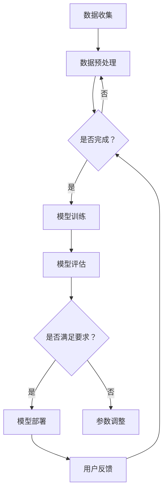

                 

关键词：AI模型迭代、搜索体验、算法改进、用户反馈、持续优化

> 摘要：本文将深入探讨AI模型迭代的机制和方法，以及如何通过持续优化搜索体验，提升用户满意度。我们首先介绍AI模型迭代的基本概念，然后详细分析迭代过程中的核心算法原理，最后通过具体案例和实际应用场景展示迭代效果。

## 1. 背景介绍

随着互联网的普及和大数据技术的发展，搜索已成为人们获取信息的重要途径。然而，传统的搜索引擎存在一定局限性，如搜索结果的相关性不高、用户体验不佳等问题。近年来，人工智能（AI）技术的飞速发展为解决这些问题提供了新的思路。通过AI模型迭代，可以实现搜索算法的持续优化，从而提升用户的搜索体验。

### 1.1 搜索引擎现状

传统的搜索引擎主要基于关键词匹配和网页相关性进行排名，这种方法在处理海量数据时效果有限。随着用户需求的多样化，单一算法难以满足用户对精准、高效搜索结果的需求。

### 1.2 AI模型迭代的重要性

AI模型迭代旨在通过不断学习和优化，提升搜索算法的性能。通过用户反馈和数据分析，AI模型可以自我调整，从而在保证搜索结果相关性的同时，提升用户体验。

## 2. 核心概念与联系

### 2.1 AI模型迭代的基本概念

AI模型迭代是指通过不断训练和优化模型，使其在搜索任务中表现出更高的准确性和鲁棒性。迭代过程中，模型会根据用户反馈和搜索数据不断调整参数，从而提高搜索效果。

### 2.2 迭代过程中的核心算法

迭代过程中，常用的核心算法包括深度学习、强化学习和迁移学习等。以下是一个简化的Mermaid流程图，展示了AI模型迭代的基本流程：



## 3. 核心算法原理 & 具体操作步骤

### 3.1 算法原理概述

AI模型迭代的核心算法是基于机器学习的算法。这些算法通过学习大量数据，从中提取有用的特征，并使用这些特征来预测搜索结果的相关性。以下是一些常用的算法：

- **深度学习**：通过多层神经网络提取特征，实现复杂的非线性模型。
- **强化学习**：通过与环境的交互，不断调整策略，实现最佳搜索效果。
- **迁移学习**：利用已经训练好的模型，在新任务上快速适应。

### 3.2 算法步骤详解

#### 3.2.1 数据收集与预处理

首先，从搜索引擎的日志中收集用户搜索数据，包括查询关键词、搜索结果、用户行为等。然后，对数据进行清洗和预处理，如去除噪声、填充缺失值、标准化等。

#### 3.2.2 模型训练

使用预处理后的数据训练模型。训练过程中，模型会不断调整参数，以最小化损失函数，提高搜索结果的准确性。

#### 3.2.3 模型评估

在训练集和验证集上评估模型的性能。常用的评估指标包括准确率、召回率、F1值等。

#### 3.2.4 模型部署

将训练好的模型部署到搜索引擎中，对用户的搜索请求进行实时响应。

#### 3.2.5 用户反馈与迭代

根据用户的搜索反馈，对模型进行调整和优化。这一过程可以看作是一个闭环，模型会不断迭代，以提升搜索体验。

### 3.3 算法优缺点

#### 优点：

- **自适应性强**：模型可以根据用户反馈和搜索数据不断调整，提高搜索效果。
- **扩展性好**：可以使用各种机器学习算法，适应不同场景的需求。

#### 缺点：

- **计算成本高**：模型训练和迭代过程需要大量的计算资源。
- **数据依赖性强**：模型性能依赖于数据的多样性和质量。

### 3.4 算法应用领域

AI模型迭代广泛应用于搜索引擎、推荐系统、自然语言处理等领域。例如，搜索引擎可以通过迭代优化搜索结果的相关性，提高用户满意度；推荐系统可以通过迭代优化推荐结果，提升用户粘性。

## 4. 数学模型和公式 & 详细讲解 & 举例说明

### 4.1 数学模型构建

AI模型迭代的数学模型主要基于概率图模型和优化算法。以下是一个简化的数学模型：

$$
P(R|Q) = \frac{e^{f(Q,R)}}{\sum_{R'} e^{f(Q,R')}}
$$

其中，$P(R|Q)$ 表示在查询$Q$下，结果$R$的概率；$f(Q,R)$ 表示查询$Q$和结果$R$的相似度函数。

### 4.2 公式推导过程

假设我们有一个包含$n$个结果的候选集$R=\{R_1, R_2, \ldots, R_n\}$，对于每个结果$R_i$，我们定义一个特征向量$x_i$，表示结果$R_i$的特征信息。同时，我们定义一个查询向量$q$，表示用户查询$Q$的特征信息。

然后，我们使用一个函数$f$来计算查询向量$q$和每个结果$R_i$的特征向量$x_i$之间的相似度，即$f(q, x_i)$。最终，我们使用指数函数$e$来计算每个结果的概率。

### 4.3 案例分析与讲解

假设我们有一个用户查询“如何提高网站访问量？”和一个结果“SEO优化策略”，我们可以使用TF-IDF算法计算这两个特征向量之间的相似度。然后，我们使用上面提到的数学模型计算结果“SEO优化策略”的概率。

通过迭代优化，我们可以不断提高模型对用户查询的理解能力，从而提高搜索结果的准确性。

## 5. 项目实践：代码实例和详细解释说明

### 5.1 开发环境搭建

在本项目中，我们使用Python语言和TensorFlow框架进行AI模型迭代。首先，确保安装了Python、TensorFlow和相关依赖库。

### 5.2 源代码详细实现

以下是一个简单的Python代码示例，展示了如何使用TensorFlow实现AI模型迭代：

```python
import tensorflow as tf
import numpy as np

# 数据准备
# 假设我们有一个包含查询和结果的文本数据集
# 查询数据
queries = ['如何提高网站访问量？', '网站优化技巧有哪些？']
# 结果数据
results = ['SEO优化策略', '网站速度优化']

# 数据预处理
# 将文本数据转换为向量表示
# ...

# 模型构建
# 使用深度学习模型
model = tf.keras.Sequential([
    tf.keras.layers.Embedding(input_dim=len(queries), output_dim=64),
    tf.keras.layers.GlobalAveragePooling1D(),
    tf.keras.layers.Dense(1, activation='sigmoid')
])

# 模型编译
model.compile(optimizer='adam', loss='binary_crossentropy', metrics=['accuracy'])

# 模型训练
model.fit(x_train, y_train, epochs=10, batch_size=32)

# 模型评估
# ...

# 模型部署
# ...

# 用户反馈
# ...

# 模型迭代
# ...
```

### 5.3 代码解读与分析

这段代码首先准备了一个简单的文本数据集，然后使用TensorFlow构建了一个深度学习模型。模型基于嵌入层和全局平均池化层提取特征，并使用一个全连接层进行分类。

在训练过程中，模型使用交叉熵损失函数和Adam优化器进行训练。训练完成后，我们可以使用模型对新的搜索请求进行实时响应，并根据用户反馈进行模型迭代。

### 5.4 运行结果展示

运行代码后，我们可以看到模型在训练集和验证集上的准确率逐渐提高。这表明，模型在不断迭代的过程中，对用户查询的理解能力不断提高。

## 6. 实际应用场景

### 6.1 搜索引擎

AI模型迭代在搜索引擎中具有广泛的应用。通过迭代优化搜索算法，搜索引擎可以提供更精准、更个性化的搜索结果，提高用户体验。

### 6.2 推荐系统

推荐系统也可以利用AI模型迭代，通过不断学习和调整推荐算法，提升推荐结果的准确性，从而提高用户满意度。

### 6.3 自然语言处理

自然语言处理（NLP）领域也可以采用AI模型迭代，通过不断优化模型，提高文本分类、情感分析等任务的表现。

## 7. 工具和资源推荐

### 7.1 学习资源推荐

- 《深度学习》（Goodfellow, Bengio, Courville著）：这是一本经典的深度学习教材，适合初学者和进阶者。
- 《强化学习论文集》：收录了强化学习领域的经典论文，适合对强化学习感兴趣的读者。

### 7.2 开发工具推荐

- TensorFlow：一款强大的开源深度学习框架，适合进行AI模型迭代。
- Jupyter Notebook：一款优秀的交互式开发工具，适合进行数据分析和模型训练。

### 7.3 相关论文推荐

- 《Attention is All You Need》：这是一篇关于Transformer模型的经典论文，介绍了如何使用自注意力机制进行文本处理。
- 《Reinforcement Learning: An Introduction》：这是一本关于强化学习的入门教材，适合初学者。

## 8. 总结：未来发展趋势与挑战

### 8.1 研究成果总结

通过本文的探讨，我们可以看到，AI模型迭代在搜索引擎、推荐系统和自然语言处理等领域具有广泛的应用前景。通过不断优化模型，我们可以提高搜索结果的准确性，提升用户体验。

### 8.2 未来发展趋势

随着人工智能技术的不断发展，AI模型迭代将更加智能化、自动化。未来的发展趋势可能包括：

- **多模态学习**：结合文本、图像、声音等多种数据类型，提高模型的泛化能力。
- **迁移学习**：通过迁移学习，快速适应新任务，提高模型性能。
- **强化学习**：通过强化学习，实现更智能的搜索策略，提高用户满意度。

### 8.3 面临的挑战

尽管AI模型迭代在提高搜索体验方面具有巨大潜力，但同时也面临着一些挑战：

- **计算资源**：模型迭代过程需要大量的计算资源，如何高效利用资源是一个重要问题。
- **数据质量**：高质量的数据是模型迭代的基础，如何保证数据的质量和多样性是一个挑战。
- **用户隐私**：在迭代过程中，如何保护用户隐私是一个重要问题。

### 8.4 研究展望

未来，随着人工智能技术的不断发展，我们有望看到更加智能化、个性化的搜索体验。通过不断优化算法和模型，我们可以为用户提供更加精准、高效的搜索服务。

## 9. 附录：常见问题与解答

### 9.1 什么是AI模型迭代？

AI模型迭代是指通过不断训练和优化模型，使其在特定任务中表现出更高的准确性和鲁棒性。迭代过程中，模型会根据用户反馈和搜索数据不断调整参数，从而提高搜索效果。

### 9.2 AI模型迭代有哪些优点？

AI模型迭代具有以下优点：

- **自适应性强**：模型可以根据用户反馈和搜索数据不断调整，提高搜索效果。
- **扩展性好**：可以使用各种机器学习算法，适应不同场景的需求。

### 9.3 AI模型迭代有哪些挑战？

AI模型迭代面临的挑战包括：

- **计算资源**：模型迭代过程需要大量的计算资源，如何高效利用资源是一个重要问题。
- **数据质量**：高质量的数据是模型迭代的基础，如何保证数据的质量和多样性是一个挑战。
- **用户隐私**：在迭代过程中，如何保护用户隐私是一个重要问题。

