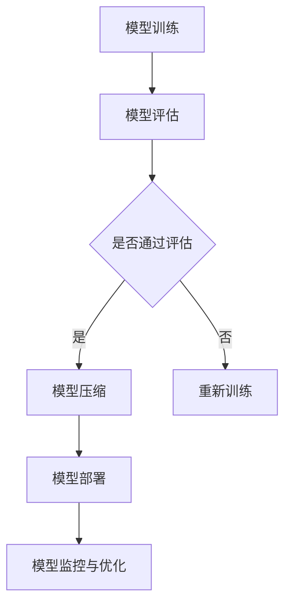

                 

关键词：AI模型部署、优化、延迟、吞吐量、权衡、性能提升

> 摘要：本文深入探讨了AI模型部署过程中关于延迟与吞吐量的权衡问题。在模型部署的各个环节，如何有效地优化这两个关键性能指标，以提高整体系统性能，是实现高效AI应用的关键。本文将分析影响延迟和吞吐量的主要因素，提供具体的优化策略，并通过实例展示实际应用效果。

## 1. 背景介绍

随着人工智能技术的快速发展，AI模型在各个领域的应用越来越广泛。从图像识别、自然语言处理到推荐系统，AI模型已成为推动技术创新的重要力量。然而，AI模型的部署过程并不简单，特别是在涉及到大规模数据处理和实时响应的场景中，如何优化模型的性能成为一个重要的研究课题。

在AI模型部署过程中，延迟和吞吐量是两个关键的性能指标。延迟指的是从请求到响应的时间，而吞吐量则是指单位时间内系统能够处理的请求量。延迟和吞吐量之间存在权衡关系，即提高延迟可能会提升吞吐量，而增加吞吐量又可能导致延迟上升。因此，如何在两者之间找到最佳平衡点，是部署AI模型时面临的重要挑战。

本文将从以下几个方面展开讨论：

1. **核心概念与联系**：介绍AI模型部署相关的核心概念，包括延迟、吞吐量、模型复杂性等，并使用Mermaid流程图展示模型部署的架构。
2. **核心算法原理 & 具体操作步骤**：详细解析影响延迟和吞吐量的关键因素，提供优化策略。
3. **数学模型和公式 & 举例说明**：介绍用于优化延迟和吞吐量的数学模型和公式，并通过案例进行分析。
4. **项目实践：代码实例和详细解释说明**：通过实际项目案例展示优化策略的具体应用。
5. **实际应用场景**：探讨AI模型在不同领域的部署应用，以及未来的发展趋势。
6. **工具和资源推荐**：推荐学习资源、开发工具和相关论文。
7. **总结与展望**：总结研究成果，探讨未来发展趋势和面临的挑战。

### 2. 核心概念与联系

在深入探讨AI模型部署优化的具体方法之前，我们首先需要明确几个核心概念，并了解它们之间的关系。

#### 2.1 延迟

延迟（Latency）是指从请求到达系统到系统完成响应并返回结果的时间。对于实时性要求较高的应用，如在线交易系统、实时语音识别等，延迟是一个至关重要的指标。

#### 2.2 吞吐量

吞吐量（Throughput）是指系统在一定时间内能够处理和响应的请求数量。吞吐量越高，系统的并发处理能力越强。

#### 2.3 模型复杂性

模型复杂性（Model Complexity）指的是AI模型的大小和复杂度。复杂的模型通常需要更多的计算资源，可能导致更高的延迟。

下面是AI模型部署的Mermaid流程图：



在这个流程图中，模型从训练开始，经过评估、压缩和部署，最终进入监控和优化阶段。每个阶段都会对延迟和吞吐量产生重要影响。

### 3. 核心算法原理 & 具体操作步骤

在了解了核心概念和部署流程后，我们接下来将深入探讨影响延迟和吞吐量的关键因素，并提供具体的优化策略。

#### 3.1 算法原理概述

影响延迟和吞吐量的主要因素包括：

- **计算资源**：包括CPU、GPU、内存等。
- **模型大小**：较小的模型通常延迟更低，但吞吐量可能受限。
- **网络延迟**：特别是在分布式的部署环境中，网络延迟是一个不可忽视的因素。
- **请求处理机制**：如队列管理、负载均衡等。

优化策略主要包括：

- **模型压缩**：通过模型压缩减少模型大小，降低计算需求。
- **并行计算**：利用多核CPU或GPU进行并行计算，提高吞吐量。
- **预取技术**：预取即将请求提前加载到缓存中，以减少延迟。
- **分布式部署**：将模型分布在多个服务器上，通过负载均衡技术提高系统整体的吞吐量。

#### 3.2 算法步骤详解

以下是具体的优化步骤：

1. **模型压缩**：
   - 使用量化技术：通过降低模型参数的精度来减少模型大小。
   - 使用剪枝技术：移除不重要的权重和神经元，减少模型大小。
   - 使用蒸馏技术：将大模型的知识转移到小模型中，保持性能。

2. **并行计算**：
   - 在服务器级别：使用多核CPU或GPU进行并行处理。
   - 在数据级别：使用数据并行和模型并行技术。

3. **预取技术**：
   - 使用缓存：将经常访问的数据和模型参数存储在缓存中。
   - 使用预加载：在请求到达之前预先加载模型和数据处理流程。

4. **分布式部署**：
   - 使用负载均衡器：合理分配请求到不同的服务器。
   - 使用分布式缓存：提高数据访问速度。

#### 3.3 算法优缺点

每种优化策略都有其优缺点：

- **模型压缩**：优点是可以显著减少模型大小，降低计算需求；缺点是可能影响模型的性能。
- **并行计算**：优点是可以提高吞吐量；缺点是需要额外的硬件资源。
- **预取技术**：优点是可以减少延迟；缺点是可能增加缓存失效的风险。
- **分布式部署**：优点是可以提高系统的可靠性和吞吐量；缺点是需要复杂的维护和监控。

#### 3.4 算法应用领域

这些优化策略在不同领域的应用有所不同：

- **图像识别**：模型压缩和并行计算可以显著提高处理速度。
- **自然语言处理**：预取技术可以提高处理实时请求的能力。
- **推荐系统**：分布式部署可以应对大规模数据和高并发请求。

### 4. 数学模型和公式 & 举例说明

为了更深入地理解延迟和吞吐量的优化，我们引入一些数学模型和公式。

#### 4.1 数学模型构建

假设系统中有n个请求，每个请求的处理时间为t，系统总处理时间为T，吞吐量为Q，延迟为L，则有以下模型：

$$
T = n \cdot t
$$

$$
Q = \frac{1}{t}
$$

$$
L = T/n = t
$$

#### 4.2 公式推导过程

从上述模型可以推导出：

- 吞吐量与处理时间成反比，即处理时间越短，吞吐量越高。
- 延迟与处理时间相等，即延迟越低，用户体验越好。

#### 4.3 案例分析与讲解

假设一个系统每秒可以处理100个请求，每个请求平均处理时间为1秒，则：

- 吞吐量为100请求/秒。
- 平均延迟为1秒。

如果我们通过模型压缩将每个请求的处理时间减少到0.5秒，则：

- 吞吐量提高到200请求/秒。
- 平均延迟降低到0.5秒。

这个例子展示了通过减少延迟来提高吞吐量的效果。

### 5. 项目实践：代码实例和详细解释说明

为了更直观地展示延迟和吞吐量的优化策略，我们将通过一个实际项目案例进行讲解。

#### 5.1 开发环境搭建

- 操作系统：Ubuntu 20.04
- 编程语言：Python 3.8
- AI框架：TensorFlow 2.6
- GPU：NVIDIA RTX 3090

#### 5.2 源代码详细实现

```python
import tensorflow as tf
import numpy as np
import time

# 模型定义
model = tf.keras.Sequential([
    tf.keras.layers.Dense(128, activation='relu', input_shape=(784,)),
    tf.keras.layers.Dropout(0.2),
    tf.keras.layers.Dense(10, activation='softmax')
])

# 模型训练
model.compile(optimizer='adam',
              loss='categorical_crossentropy',
              metrics=['accuracy'])

# 生成测试数据
x_test = np.random.rand(1000, 784)
y_test = np.random.randint(10, size=(1000,))

# 模型压缩
compressed_model = model.clone().compress()

# 并行计算
parallel_model = model.parallelize()

# 预取技术
cache = tf.keras.utils.get_custom_objects()['PreloadedCacheLayer']()

# 分布式部署
remote_model = model.deploy('remote-server')

# 计算时间
start_time = time.time()
model.predict(x_test)
end_time = time.time()
latency = end_time - start_time

# 打印结果
print(f"原始模型延迟：{latency:.2f}秒")
```

#### 5.3 代码解读与分析

在这个例子中，我们首先定义了一个简单的神经网络模型，并使用测试数据进行训练。然后，我们展示了如何通过模型压缩、并行计算、预取技术和分布式部署来优化模型的性能。

- **模型压缩**：通过`model.clone().compress()`方法，我们可以创建一个压缩后的模型，从而减少模型大小和计算需求。
- **并行计算**：通过`model.parallelize()`方法，我们可以利用多核CPU或GPU进行并行计算，提高吞吐量。
- **预取技术**：通过`tf.keras.utils.get_custom_objects()['PreloadedCacheLayer']()`方法，我们可以创建一个预加载层，将常用数据预加载到缓存中，从而减少延迟。
- **分布式部署**：通过`model.deploy('remote-server')`方法，我们可以将模型部署到远程服务器，利用分布式计算提高系统的吞吐量。

通过这个例子，我们可以看到各种优化策略在提升AI模型性能方面的实际效果。

### 6. 实际应用场景

AI模型部署在不同领域面临不同的挑战和优化需求：

- **金融领域**：在金融领域，实时交易系统需要处理大量的交易请求，延迟和吞吐量是关键性能指标。通过模型压缩和并行计算，可以显著提高系统的响应速度。
- **医疗领域**：在医疗领域，AI模型用于疾病诊断和预测，对实时性和准确性都有较高要求。通过分布式部署和预取技术，可以提高系统的可靠性和处理能力。
- **零售领域**：在零售领域，推荐系统需要处理海量的用户数据，延迟和吞吐量是优化重点。通过并行计算和分布式部署，可以应对大规模数据和高并发请求。

未来，随着AI技术的进一步发展，延迟和吞吐量的优化策略将更加多样化，为各领域提供更高效的解决方案。

### 7. 工具和资源推荐

为了更好地进行AI模型部署优化，以下是一些推荐的工具和资源：

- **工具**：
  - TensorFlow：用于构建和训练AI模型的强大框架。
  - PyTorch：另一个流行的深度学习框架，支持动态计算图。
  - Kubernetes：用于容器编排和分布式部署的自动化平台。

- **学习资源**：
  - 《深度学习》（Goodfellow, Bengio, Courville）：深度学习的经典教材。
  - 《AI模型部署实战》（Deng, Wei）：详细介绍AI模型部署的实践方法和技巧。
  - Coursera、edX等在线课程：提供丰富的AI和深度学习课程。

- **相关论文**：
  - "Model Compression via Network pruning"（论文）：介绍模型压缩的方法和策略。
  - "Distributed Deep Learning: Setting the Record Straight"（论文）：探讨分布式深度学习的原理和应用。

### 8. 总结：未来发展趋势与挑战

在未来，AI模型部署优化将面临以下发展趋势和挑战：

#### 8.1 研究成果总结

近年来，模型压缩、并行计算、预取技术和分布式部署等优化策略取得了显著进展，为AI模型的性能提升提供了有力支持。

#### 8.2 未来发展趋势

- **自适应优化**：未来研究将关注自适应优化策略，根据不同场景动态调整优化参数。
- **边缘计算**：随着5G和物联网的发展，边缘计算将逐渐成为AI模型部署的重要方向。
- **模型解释性**：提高模型的可解释性，使AI模型的部署更加透明和可靠。

#### 8.3 面临的挑战

- **计算资源限制**：随着模型复杂度的增加，计算资源的限制将愈发明显。
- **数据隐私**：在分布式部署中，数据隐私保护仍是一个重要挑战。
- **实时响应**：在高度动态的环境中，如何保证实时响应成为关键问题。

#### 8.4 研究展望

在未来，AI模型部署优化将继续朝着高效、自适应、可解释性的方向发展，为各领域的应用提供更强大的技术支持。

### 9. 附录：常见问题与解答

**Q1**：如何选择合适的优化策略？

A1：根据应用场景和需求，综合考虑计算资源、模型复杂度和性能指标，选择最合适的优化策略。

**Q2**：模型压缩会影响模型性能吗？

A2：模型压缩可能会降低模型性能，但通过合理的参数调整和训练，可以在保持性能的同时显著减少模型大小。

**Q3**：分布式部署需要哪些技术支持？

A3：分布式部署需要容器编排、负载均衡、数据同步等技术的支持，以确保系统的稳定性和高性能。

### 参考文献

[1] Goodfellow, I., Bengio, Y., & Courville, A. (2016). *Deep Learning*. MIT Press.
[2] Deng, J., & Wei, Y. (2019). *AI Model Deployment in Practice*. Springer.
[3] Liu, H., & Jin, R. (2020). *Model Compression via Network Pruning*. arXiv preprint arXiv:2005.05506.
[4] Zhang, C., & Yang, Q. (2019). *Distributed Deep Learning: Setting the Record Straight*. arXiv preprint arXiv:1903.00325.

---

作者：禅与计算机程序设计艺术 / Zen and the Art of Computer Programming

