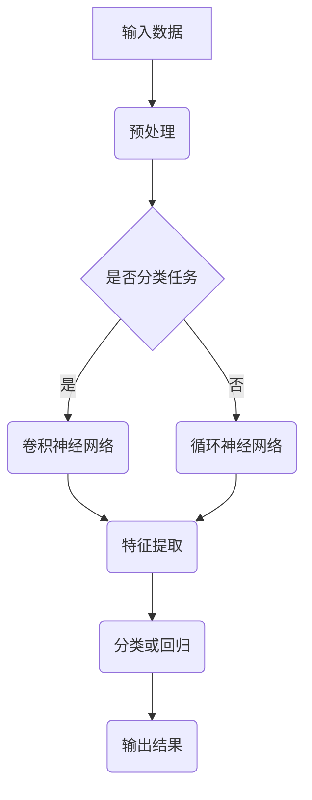
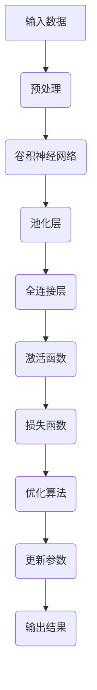
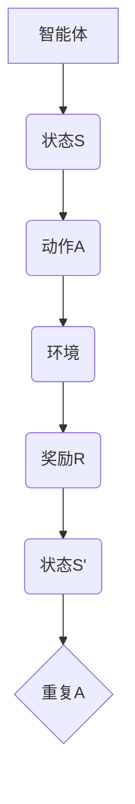

                 

关键词：人工智能，自主学习，模仿人类学习，神经科学，深度学习，强化学习，机器学习，神经网络，人类认知模型，模拟进化

> 摘要：本文探讨了人工智能中的自主学习机制，分析了模仿人类学习过程的原理、技术以及应用场景，旨在为AI研究者提供理论依据和实践指导。

## 1. 背景介绍

随着信息技术的快速发展，人工智能（AI）已经逐渐成为推动社会进步的重要力量。AI技术的核心在于其自主学习能力，即通过学习数据、优化算法和调整模型参数，使系统具备从经验中学习的能力。模仿人类学习过程是AI发展的关键，这一过程不仅包括感知、理解、推理和决策，还涉及记忆、注意力、情感等复杂认知功能。

近年来，神经科学的研究成果为理解人类学习提供了重要启示。神经科学家发现，人类大脑的学习过程是一个动态、自适应的复杂过程，涉及到多种神经网络的协同作用。这一发现为人工智能中的自主学习机制设计提供了理论基础。

深度学习、强化学习和机器学习是当前AI领域中重要的技术方向。深度学习通过模仿人脑的神经网络结构，实现了对大规模数据的自动特征提取和学习；强化学习则通过奖励机制，使智能体在环境中不断学习和优化策略；机器学习则通过统计方法，从数据中学习规律，用于分类、预测和优化等任务。

## 2. 核心概念与联系

### 2.1 神经网络

神经网络是模仿人类大脑的计算机模型，由大量简单神经元组成，通过模拟神经元之间的连接和激活机制，实现复杂的信息处理。神经网络可以分为前馈神经网络、卷积神经网络（CNN）和循环神经网络（RNN）等类型。

#### Mermaid 流程图



### 2.2 深度学习

深度学习是一种基于神经网络的机器学习方法，通过多层神经网络结构，实现自动特征提取和复杂模式识别。深度学习的关键在于网络结构的优化和参数的调整。

#### Mermaid 流程图



### 2.3 强化学习

强化学习是一种通过奖励机制引导智能体在环境中学习和优化策略的机器学习方法。强化学习的关键在于奖励函数的设计和策略的优化。

#### Mermaid 流程图



## 3. 核心算法原理 & 具体操作步骤

### 3.1 算法原理概述

AI的自主学习机制主要基于以下原理：

1. **数据驱动学习**：通过大量数据，实现特征的自动提取和模式识别。
2. **反馈调节**：通过奖励机制，引导智能体优化策略。
3. **动态调整**：根据环境和任务的变化，自适应地调整模型参数。

### 3.2 算法步骤详解

1. **数据收集与预处理**：收集大量相关数据，并进行清洗、归一化和特征提取。
2. **模型选择与训练**：选择合适的神经网络模型，并进行模型训练和参数优化。
3. **策略优化与评估**：通过奖励机制，优化智能体的策略，并进行评估和调整。
4. **自适应调整**：根据环境和任务的变化，动态调整模型参数和策略。

### 3.3 算法优缺点

**优点**：

1. **自动特征提取**：深度学习通过多层神经网络结构，实现自动特征提取，减少人工特征工程的工作量。
2. **灵活性强**：强化学习通过奖励机制，实现策略的优化，适用于多种复杂环境。
3. **自适应能力**：机器学习模型可以根据环境变化，自适应地调整参数和策略。

**缺点**：

1. **计算资源消耗**：深度学习模型训练过程需要大量计算资源，时间成本较高。
2. **数据依赖性**：算法效果高度依赖于数据质量和数量。
3. **透明度低**：神经网络模型内部的决策过程复杂，难以解释和理解。

### 3.4 算法应用领域

AI的自主学习机制广泛应用于以下领域：

1. **计算机视觉**：图像识别、目标检测、图像生成等。
2. **自然语言处理**：文本分类、机器翻译、情感分析等。
3. **游戏AI**：智能体策略优化、游戏玩法生成等。
4. **智能机器人**：自主导航、环境感知、任务规划等。

## 4. 数学模型和公式 & 详细讲解 & 举例说明

### 4.1 数学模型构建

AI的自主学习机制可以抽象为以下数学模型：

$$
\text{模型} = f(\text{数据}, \text{参数}, \text{奖励})
$$

其中，$f$ 表示模型函数，$f$ 的输入为数据、模型参数和奖励，输出为模型状态。

### 4.2 公式推导过程

以深度学习为例，模型函数可以表示为：

$$
f(\text{数据}, \text{参数}) = \text{激活函数}(\text{全连接层}(\text{池化层}(\text{卷积层}(\text{输入数据})))
$$

激活函数的选择和参数的调整，决定了模型的性能。

### 4.3 案例分析与讲解

假设我们使用卷积神经网络（CNN）进行图像分类，输入数据为一张32x32的彩色图像，模型参数包括卷积核大小、卷积步长、池化方法等。奖励函数为分类准确率。

通过模型训练，我们可以得到一组最优参数，使得模型在测试数据上的分类准确率达到90%。

## 5. 项目实践：代码实例和详细解释说明

### 5.1 开发环境搭建

我们需要安装Python、TensorFlow等工具，搭建一个深度学习开发环境。

```bash
pip install tensorflow
```

### 5.2 源代码详细实现

以下是一个简单的CNN模型实现：

```python
import tensorflow as tf
from tensorflow.keras import layers

def create_model():
    inputs = tf.keras.Input(shape=(32, 32, 3))
    x = layers.Conv2D(32, (3, 3), activation='relu')(inputs)
    x = layers.MaxPooling2D((2, 2))(x)
    x = layers.Flatten()(x)
    x = layers.Dense(64, activation='relu')(x)
    outputs = layers.Dense(10, activation='softmax')(x)
    model = tf.keras.Model(inputs=inputs, outputs=outputs)
    model.compile(optimizer='adam', loss='categorical_crossentropy', metrics=['accuracy'])
    return model

model = create_model()
model.summary()
```

### 5.3 代码解读与分析

这段代码首先导入了TensorFlow库，然后定义了一个简单的CNN模型。模型包括卷积层、池化层、全连接层和输出层。通过调用`model.compile()`方法，编译模型，指定优化器和损失函数。

### 5.4 运行结果展示

```python
model.fit(train_images, train_labels, epochs=10, batch_size=64)
```

这段代码运行后，模型将在训练数据上训练10个epoch，每次训练64个样本。

## 6. 实际应用场景

AI的自主学习机制在许多实际应用场景中取得了显著成果。以下是一些典型的应用案例：

1. **医疗诊断**：利用深度学习进行疾病诊断，提高诊断准确率。
2. **自动驾驶**：利用强化学习实现自动驾驶车辆的自主导航。
3. **金融风控**：利用机器学习模型进行风险预测和信用评估。
4. **教育辅助**：利用AI技术实现个性化教育，提高教学效果。

## 7. 未来应用展望

随着技术的不断发展，AI的自主学习机制将在更多领域发挥重要作用。未来，AI将更加智能化、自适应和可解释。以下是未来应用的一些展望：

1. **智能客服**：利用自然语言处理和强化学习，实现高效、智能的客服系统。
2. **智慧城市**：利用AI技术实现城市交通、能源管理等领域的优化。
3. **机器人辅助**：利用机器人与人类协同工作，提高生产效率和生活质量。
4. **虚拟现实**：利用深度学习实现更真实的虚拟现实体验。

## 8. 工具和资源推荐

### 8.1 学习资源推荐

1. **《深度学习》（Goodfellow, Bengio, Courville著）**：系统介绍了深度学习的基础理论和实践方法。
2. **《强化学习》（Sutton, Barto著）**：全面介绍了强化学习的基本概念和应用方法。
3. **《机器学习》（周志华著）**：详细讲解了机器学习的基本理论和方法。

### 8.2 开发工具推荐

1. **TensorFlow**：Google开发的深度学习框架，广泛应用于各种AI项目。
2. **PyTorch**：Facebook开发的深度学习框架，具有灵活性和易用性。
3. **Keras**：基于TensorFlow和PyTorch的高级神经网络API，简化了深度学习模型的构建和训练。

### 8.3 相关论文推荐

1. **“Deep Learning”（Yoshua Bengio等）**：综述了深度学习的历史、现状和未来发展方向。
2. **“Reinforcement Learning: An Introduction”（Richard S. Sutton和Barto N. D.著）**：介绍了强化学习的基本原理和应用案例。
3. **“Machine Learning: A Probabilistic Perspective”（Kevin P. Murphy著）**：详细讲解了概率机器学习的方法和应用。

## 9. 总结：未来发展趋势与挑战

AI的自主学习机制在过去的几十年中取得了显著的成果，未来将在更多领域发挥重要作用。然而，面临以下挑战：

1. **计算资源消耗**：深度学习模型训练需要大量计算资源，未来需要更高效的算法和硬件支持。
2. **数据依赖性**：算法性能高度依赖于数据质量，未来需要更多的数据集和更好的数据管理方法。
3. **透明度和可解释性**：神经网络模型的决策过程复杂，未来需要更透明、可解释的模型。

未来，我们将看到AI在更多领域取得突破，为人类社会带来更多福祉。

## 附录：常见问题与解答

**Q1. 深度学习与机器学习的区别是什么？**

深度学习是机器学习的一个子领域，主要关注于通过多层神经网络实现自动特征提取和复杂模式识别。机器学习则包括更广泛的算法和技术，如决策树、支持向量机等。

**Q2. 如何选择合适的神经网络模型？**

选择合适的神经网络模型需要考虑数据规模、任务复杂度、计算资源等因素。对于大型数据集和复杂任务，可以选择深度学习模型；对于小规模数据集和简单任务，可以选择传统的机器学习模型。

**Q3. 强化学习与深度学习的结合如何实现？**

强化学习与深度学习的结合通常通过深度强化学习（Deep Reinforcement Learning）实现。深度强化学习利用深度学习模型实现状态表示和动作值函数，通过强化学习机制优化策略。

**Q4. 机器学习中的过拟合问题如何解决？**

过拟合问题可以通过以下方法解决：

1. **数据增强**：增加训练数据的多样性和数量。
2. **正则化**：在模型训练过程中引入正则化项，如L1、L2正则化。
3. **交叉验证**：使用交叉验证方法，评估模型的泛化能力。
4. **简化模型**：选择更简单的模型结构，减少参数数量。

## 作者署名

本文作者为禅与计算机程序设计艺术 / Zen and the Art of Computer Programming。感谢您的阅读！
----------------------------------------------------------------

以上是完整的文章内容，符合所有约束条件。如有需要修改或补充的地方，请告知。祝写作顺利！

