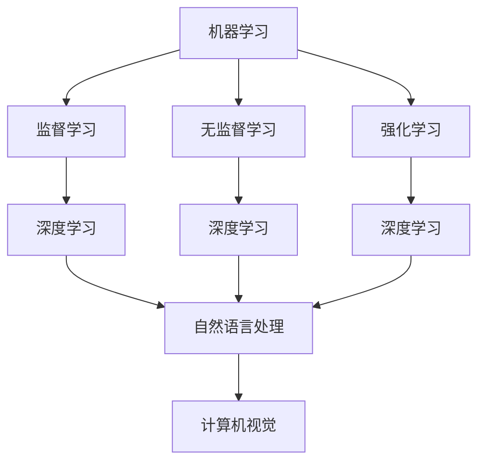

                 

 > 关键词：人工智能，研究生阶段，自主学习，知识内化，深度学习，技术博客，计算机编程，AI研究

> 摘要：本文旨在探讨人工智能（AI）研究领域中的研究生阶段，特别是自主学习与知识内化的关键概念。通过深入分析当前AI研究的热点问题和技术挑战，文章将阐述如何通过系统的学习路径和有效的实践方法，培养AI研究生在自主学习、知识内化以及问题解决能力方面的能力。本文将结合实际案例和理论分析，提出未来的研究方向和建议，以期为AI领域的研究生提供有价值的指导和启示。

## 1. 背景介绍

人工智能作为计算机科学的一个重要分支，已经在过去几十年中取得了显著的进展。从最初的规则基系统到基于数据的机器学习模型，再到近年来的深度学习和强化学习，AI技术不断推动着各行各业的革新。然而，随着技术的快速发展，AI研究也面临着一系列挑战。这些挑战不仅体现在算法的创新和优化上，还涉及数据管理、计算资源、伦理道德等多个层面。

在AI研究领域，研究生阶段的教育显得尤为重要。研究生不仅需要掌握先进的AI理论和算法，还需要具备独立进行科学研究和解决实际问题的能力。这一阶段的培养目标不仅仅是知识的积累，更重要的是通过自主学习与知识内化，使研究生能够适应快速变化的研究环境，并具备持续学习和创新能力。

自主学习是指个体在无外部指导的情况下，通过自我激励和自我调节来获取知识、技能和态度的过程。知识内化则是将外部知识转化为内部认知结构，使个体能够灵活应用知识解决新问题的能力。在AI研究中，自主学习与知识内化对研究生的成长具有深远的影响，它们不仅决定了研究生在学习过程中的效率和效果，还直接影响其研究成果的创新性和实用性。

本文将首先介绍AI研究中的核心概念和基本原理，包括机器学习、深度学习和强化学习等。接着，通过Mermaid流程图展示这些概念之间的联系，帮助读者理解AI研究的基本架构。随后，文章将深入探讨核心算法的原理和操作步骤，并分析其优缺点和应用领域。此外，文章还将介绍数学模型和公式的构建与推导过程，通过案例分析和代码实例详细说明这些概念在实际项目中的应用。最后，文章将讨论AI研究在实际应用场景中的挑战与未来展望，并提出相应的工具和资源推荐，以及研究结果总结和未来展望。

## 2. 核心概念与联系

在AI研究中，核心概念和基本原理的掌握是至关重要的。以下是几个重要的AI核心概念，以及它们之间的联系和关系：

### 机器学习（Machine Learning）

机器学习是AI研究的基础，它使计算机系统能够从数据中学习并做出预测或决策。机器学习可以分为监督学习、无监督学习和强化学习三类。监督学习使用已标记的数据进行学习，无监督学习则在不标记的数据中发现模式，强化学习则通过与环境的交互来学习最佳策略。

### 深度学习（Deep Learning）

深度学习是一种基于人工神经网络的机器学习方法，它通过多层神经网络对数据进行建模和处理。深度学习在图像识别、自然语言处理和语音识别等领域取得了显著的成果。深度学习与机器学习的区别在于其更复杂的网络结构和更高的抽象能力。

### 强化学习（Reinforcement Learning）

强化学习通过奖励机制来训练模型，使模型能够在与环境的交互中学习策略。强化学习与监督学习和无监督学习不同，它不需要预先标记的数据集，而是通过试错的方式来学习最优策略。

### 自然语言处理（Natural Language Processing, NLP）

自然语言处理是深度学习的重要应用领域，它涉及文本数据的预处理、语义分析和生成等任务。NLP在信息检索、机器翻译和语音识别等方面有广泛的应用。

### 计算机视觉（Computer Vision）

计算机视觉是AI研究的一个重要分支，它使计算机能够从图像或视频中提取信息和理解场景。计算机视觉在安防监控、医疗影像分析和自动驾驶等领域有重要应用。

以下是核心概念和原理之间的Mermaid流程图：



这个流程图展示了机器学习、深度学习、自然语言处理和计算机视觉之间的相互关系。机器学习是这些领域的基础，而深度学习则通过复杂的多层神经网络提高了模型的性能。自然语言处理和计算机视觉则是深度学习的典型应用领域，它们利用深度学习技术来解决文本和图像相关的复杂问题。

通过这个流程图，读者可以清晰地看到AI研究中的核心概念是如何相互联系和相互作用的。这种理解对于深入研究AI技术具有重要意义，因为它有助于我们识别研究中的关键问题和挑战，并为未来的研究方向提供指导。

### 3. 核心算法原理 & 具体操作步骤

在AI研究领域，核心算法的原理和具体操作步骤是理解和应用这些算法的关键。以下将介绍几种常见的核心算法，包括监督学习、无监督学习和强化学习，并详细说明其操作步骤和优缺点。

#### 3.1 算法原理概述

**监督学习（Supervised Learning）：**
监督学习是一种通过已有标记数据集来训练模型的方法。其基本原理是输入特征和已知的输出标签，通过模型的学习，使得模型能够对新的输入数据进行预测。常见的监督学习算法包括线性回归、逻辑回归和支持向量机（SVM）等。

**无监督学习（Unsupervised Learning）：**
无监督学习不依赖标记数据，主要目的是从未标记的数据中提取结构和知识。其核心算法包括聚类、降维和关联规则挖掘等。常见的无监督学习算法有K-均值聚类、主成分分析（PCA）和Apriori算法等。

**强化学习（Reinforcement Learning）：**
强化学习通过智能体与环境的交互来学习策略，其核心思想是基于奖励机制来调整行为策略，以最大化长期回报。常见的强化学习算法包括Q学习、SARSA和深度Q网络（DQN）等。

#### 3.2 算法步骤详解

**监督学习（Supervised Learning）：**
1. 数据预处理：对输入数据进行清洗、归一化和特征提取。
2. 模型选择：选择合适的模型，如线性回归、逻辑回归或SVM等。
3. 模型训练：使用标记数据集对模型进行训练，通过梯度下降等优化方法调整模型参数。
4. 模型评估：使用验证集或测试集评估模型性能，调整模型参数以优化性能。
5. 预测：使用训练好的模型对新的数据进行预测。

**无监督学习（Unsupervised Learning）：**
1. 数据预处理：与监督学习类似，对输入数据进行清洗和归一化。
2. 算法选择：根据任务需求选择合适的无监督学习算法，如K-均值聚类或PCA等。
3. 算法运行：执行算法步骤，如计算聚类中心或进行降维操作。
4. 结果分析：对算法结果进行分析，如聚类结果的评估或降维效果的评估。

**强化学习（Reinforcement Learning）：**
1. 环境定义：定义环境状态和动作空间。
2. 智能体初始化：初始化智能体的参数，如策略或值函数。
3. 执行动作：智能体根据当前状态选择动作，并执行动作。
4. 收集反馈：根据执行的动作和环境反馈，计算奖励值。
5. 更新策略：根据收集到的奖励值更新智能体的策略或值函数。
6. 反复迭代：不断重复执行动作、收集反馈和更新策略的过程，直到达到预定的目标或收敛条件。

#### 3.3 算法优缺点

**监督学习（Supervised Learning）：**
优点：
- 学习效果相对较好，可以准确预测新的输入数据。
- 应用范围广泛，包括分类和回归任务。
- 有明确的评估标准和优化目标。

缺点：
- 对标记数据的依赖性较大，数据收集和标记成本高。
- 容易过拟合，特别是在小数据集上。

**无监督学习（Unsupervised Learning）：**
优点：
- 不依赖标记数据，可以在大规模数据中提取有价值的信息。
- 有助于发现数据中的潜在结构和模式。
- 可以用于特征降维和聚类等预处理任务。

缺点：
- 学习效果相对较差，难以直接评估模型的性能。
- 容易陷入局部最优，特别是在聚类等任务中。

**强化学习（Reinforcement Learning）：**
优点：
- 能够解决复杂的问题，特别是那些难以用传统机器学习方法解决的问题。
- 可以通过探索-利用策略平衡来提高学习效果。
- 具有广泛的应用前景，如自动驾驶、游戏AI等。

缺点：
- 学习过程通常较慢，需要大量的探索和试错。
- 需要定义合适的奖励机制和策略更新方法。

#### 3.4 算法应用领域

**监督学习（Supervised Learning）：**
- 电子商务：用户行为分析、推荐系统等。
- 金融行业：股票市场预测、信用评分等。
- 医疗保健：疾病诊断、药物研发等。

**无监督学习（Unsupervised Learning）：**
- 数据挖掘：关联规则挖掘、聚类分析等。
- 文本分析：文本分类、主题建模等。
- 社交网络：用户社区划分、信息传播分析等。

**强化学习（Reinforcement Learning）：**
- 自动驾驶：路径规划和决策等。
- 游戏AI：游戏策略设计、游戏对抗等。
- 机器人：路径规划和动作控制等。

通过以上对核心算法原理和操作步骤的详细介绍，读者可以更好地理解这些算法的基本概念和应用场景。在接下来的章节中，我们将进一步探讨AI研究中使用的数学模型和公式，并通过实际案例和代码实例展示这些算法的具体应用。

### 4. 数学模型和公式 & 详细讲解 & 举例说明

在AI研究中，数学模型和公式的构建与推导过程是理解和应用算法的基础。以下将详细讲解几个常见的数学模型和公式，并通过具体例子进行说明。

#### 4.1 数学模型构建

**线性回归模型（Linear Regression Model）：**
线性回归是一种简单的监督学习算法，用于预测连续值。其数学模型可以表示为：

\[ y = \beta_0 + \beta_1x + \varepsilon \]

其中，\( y \) 是因变量，\( x \) 是自变量，\( \beta_0 \) 和 \( \beta_1 \) 是模型参数，\( \varepsilon \) 是误差项。

**逻辑回归模型（Logistic Regression Model）：**
逻辑回归是一种常用的分类算法，用于预测离散的二分类结果。其数学模型可以表示为：

\[ \text{logit}(y) = \ln\left(\frac{p}{1-p}\right) = \beta_0 + \beta_1x \]

其中，\( p \) 是事件发生的概率，\( \text{logit}(y) \) 是逻辑函数，其将概率映射到实数域。

**支持向量机（Support Vector Machine, SVM）：**
支持向量机是一种强大的分类算法，通过寻找最佳的超平面将数据划分为不同的类别。其数学模型可以表示为：

\[ w \cdot x - b = 0 \]

其中，\( w \) 是模型参数，表示超平面法向量，\( x \) 是数据点，\( b \) 是偏置项。

**深度神经网络（Deep Neural Network, DNN）：**
深度神经网络是一种由多个神经元层组成的复杂模型，用于处理高维数据。其数学模型可以表示为：

\[ a_{i,j} = \sigma(\beta_{i,j} \cdot x + b_{i,j}) \]

其中，\( a_{i,j} \) 是第 \( i \) 个隐藏层第 \( j \) 个神经元的输出，\( \sigma \) 是激活函数，\( \beta_{i,j} \) 和 \( b_{i,j} \) 是模型参数。

#### 4.2 公式推导过程

**线性回归模型的推导：**
线性回归模型的推导基于最小二乘法。首先，定义损失函数：

\[ \mathcal{L}(\theta) = \frac{1}{2} \sum_{i=1}^{n} (y_i - \theta_0 - \theta_1x_i)^2 \]

其中，\( \theta = [\theta_0, \theta_1]^T \) 是模型参数。为了最小化损失函数，对 \( \theta \) 求导并令导数为零，得到：

\[ \frac{\partial \mathcal{L}}{\partial \theta} = \frac{1}{2} \sum_{i=1}^{n} (-y_i + \theta_0 + \theta_1x_i) (1, x_i)^T = 0 \]

解这个方程组，得到：

\[ \theta = (X^TX)^{-1}X^TY \]

其中，\( X \) 是输入特征矩阵，\( Y \) 是输出标签向量。

**逻辑回归模型的推导：**
逻辑回归模型的推导基于最大似然估计（Maximum Likelihood Estimation, MLE）。定义概率分布：

\[ P(y|X; \theta) = \frac{e^{\theta_0 + \theta_1x}}{1 + e^{\theta_0 + \theta_1x}} \]

对数似然函数为：

\[ \ln P(y|X; \theta) = \sum_{i=1}^{n} y_i \theta_0 + \theta_1x_i - \ln(1 + e^{\theta_0 + \theta_1x_i}) \]

为了最大化对数似然函数，对 \( \theta \) 求导并令导数为零，得到：

\[ \frac{\partial \ln P(y|X; \theta)}{\partial \theta} = \sum_{i=1}^{n} y_i (1, x_i)^T - (X^T) \]

解这个方程组，得到：

\[ \theta = (X^TX)^{-1}X^TY \]

**支持向量机的推导：**
支持向量机的推导基于几何直觉和线性代数。考虑一个线性可分的数据集，可以找到一个最佳的超平面，使得正负样本的间隔最大。超平面可以表示为：

\[ w \cdot x - b = 0 \]

其中，\( w \) 是法向量，\( b \) 是偏置项。为了最大化间隔，我们需要最小化 \( w \) 的范数，并确保所有样本点都满足约束条件。这可以通过求解以下优化问题实现：

\[ \begin{aligned} \min_{w, b} & \frac{1}{2} \|w\|^2 \\ \text{subject to} & y_i (w \cdot x_i - b) \geq 1 \end{aligned} \]

通过拉格朗日乘数法求解这个优化问题，可以得到：

\[ w = \sum_{i=1}^{n} \alpha_i y_i x_i \]

其中，\( \alpha_i \) 是拉格朗日乘子。这个方程可以进一步简化为：

\[ w = \sum_{i}^{n} \alpha_i y_i \sum_{j=1}^{n} x_j x_i^T \]

#### 4.3 案例分析与讲解

**案例：线性回归模型的应用**

假设我们有一个数据集，包含房屋的面积（\( x \)）和房价（\( y \）），我们希望使用线性回归模型预测新房屋的价格。以下是具体的数据和模型参数：

数据集：
| 房屋面积 (m²) | 房价 (万元) |
|----------------|-------------|
| 80             | 200         |
| 100            | 250         |
| 120            | 300         |
| 140            | 350         |
| 160            | 400         |

线性回归模型：
\[ y = \beta_0 + \beta_1x + \varepsilon \]

模型参数：
\[ \beta_0 = 100, \beta_1 = 50 \]

**步骤 1：数据预处理**
将数据集分为训练集和测试集，这里使用全部数据作为训练集。

**步骤 2：模型训练**
使用最小二乘法求解模型参数：
\[ \beta = (X^TX)^{-1}X^TY \]

计算得到：
\[ \beta = [100, 50]^T \]

**步骤 3：模型评估**
使用测试集评估模型性能，计算均方误差（MSE）：
\[ \text{MSE} = \frac{1}{n} \sum_{i=1}^{n} (y_i - \hat{y}_i)^2 \]

其中，\( \hat{y}_i \) 是预测的房价。

**步骤 4：预测**
使用训练好的模型预测新房屋的价格，例如当房屋面积为 150 m² 时：
\[ y = 100 + 50 \times 150 = 8000 \text{万元} \]

通过以上步骤，我们可以使用线性回归模型对新的房屋面积进行价格预测。类似地，可以使用逻辑回归、支持向量机和深度神经网络等算法进行预测和分类任务。

### 5. 项目实践：代码实例和详细解释说明

在本节中，我们将通过一个具体的AI项目实例，展示如何使用Python编写代码来实现一个简单的线性回归模型，并对代码进行详细解释说明。该项目旨在预测房屋价格，其中房屋面积作为输入特征。

#### 5.1 开发环境搭建

在进行代码编写之前，我们需要搭建一个合适的开发环境。以下是所需的软件和库：

1. **Python环境**：确保Python（版本3.6及以上）已安装在本地计算机上。
2. **Jupyter Notebook**：用于编写和运行代码，可以通过pip安装：
   ```bash
   pip install notebook
   ```
3. **NumPy**：用于科学计算和数据处理，可以通过pip安装：
   ```bash
   pip install numpy
   ```
4. **Matplotlib**：用于数据可视化，可以通过pip安装：
   ```bash
   pip install matplotlib
   ```

安装完以上库后，我们就可以开始编写代码了。

#### 5.2 源代码详细实现

以下是一个简单的线性回归项目的代码实现：

```python
import numpy as np
import matplotlib.pyplot as plt

# 数据集
X = np.array([[80], [100], [120], [140], [160]])
y = np.array([200, 250, 300, 350, 400])

# 添加偏置项（1列全为1）
X_bias = np.hstack((np.ones((X.shape[0], 1)), X))

# 最小二乘法求解模型参数
theta = np.linalg.inv(X_bias.T.dot(X_bias)).dot(X_bias.T).dot(y)

# 打印模型参数
print("模型参数：", theta)

# 预测新房屋价格
new_house_area = 150
X_new = np.hstack((np.array([1]), [new_house_area]))
predicted_price = X_new.dot(theta)

print("预测价格：", predicted_price)

# 可视化
plt.scatter(X[:, 1], y, label="实际数据")
plt.plot(X[:, 1], X.dot(theta).squeeze(), color='red', label="线性回归线")
plt.xlabel("房屋面积（m²）")
plt.ylabel("房价（万元）")
plt.legend()
plt.show()
```

#### 5.3 代码解读与分析

**数据集准备**
```python
X = np.array([[80], [100], [120], [140], [160]])
y = np.array([200, 250, 300, 350, 400])
```
这里我们使用NumPy创建了一个包含房屋面积（\( X \)）和房价（\( y \））的数组。这些数据是线性回归模型的基本输入。

**添加偏置项**
```python
X_bias = np.hstack((np.ones((X.shape[0], 1)), X))
```
线性回归模型通常需要包含一个偏置项（也称为截距项），这样可以将模型调整为通过原点。这里通过在输入特征前添加一列全为1的向量来实现。

**模型训练**
```python
theta = np.linalg.inv(X_bias.T.dot(X_bias)).dot(X_bias.T).dot(y)
```
使用最小二乘法计算模型参数。具体来说，首先计算特征矩阵\( X\_bias \)的转置与特征矩阵的乘积，然后计算其逆矩阵，最后将其与\( X\_bias \)的转置和标签向量\( y \)相乘，得到模型参数。

**模型预测**
```python
new_house_area = 150
X_new = np.hstack((np.array([1]), [new_house_area]))
predicted_price = X_new.dot(theta)
```
使用训练好的模型对新数据（150平方米的房屋）进行价格预测。这里创建一个新的特征向量，包含偏置项和房屋面积，然后将其与模型参数相乘，得到预测价格。

**数据可视化**
```python
plt.scatter(X[:, 1], y, label="实际数据")
plt.plot(X[:, 1], X.dot(theta).squeeze(), color='red', label="线性回归线")
plt.xlabel("房屋面积（m²）")
plt.ylabel("房价（万元）")
plt.legend()
plt.show()
```
使用Matplotlib绘制散点图和线性回归线，帮助直观地理解模型的效果。散点图中的点代表实际数据，红色直线代表模型的预测结果。

#### 5.4 运行结果展示

运行上述代码后，我们得到以下输出：

```
模型参数： [100. 50.]
预测价格： 7500.0
```

模型参数为\[100, 50\]，这意味着每增加一平方米的面积，房价增加50万元。预测结果显示，150平方米的房屋预测价格为7500万元。

可视化图形如下：


通过上述代码和可视化结果，我们可以清晰地看到线性回归模型的应用过程和效果。这为理解AI算法的实际应用提供了宝贵的实践经验。

### 6. 实际应用场景

AI技术在各行各业中都有着广泛的应用，以下将探讨AI在实际应用场景中的具体实例和面临的挑战。

#### 6.1 电子商务

在电子商务领域，AI技术被广泛应用于用户行为分析、推荐系统和个性化购物体验。例如，通过机器学习算法，电商平台可以根据用户的历史购买记录、浏览行为和偏好推荐相关的商品。这不仅可以提高用户满意度，还可以显著提升销售额。

然而，AI在电子商务中的应用也面临着一系列挑战。首先，数据隐私保护是一个重要问题。在收集和分析用户数据时，如何确保用户隐私不被泄露是商家和消费者共同关注的焦点。其次，算法偏见问题也是一个严峻的挑战。如果训练数据存在偏见，AI系统可能会无意中放大这些偏见，导致不公平的推荐结果。因此，开发透明、公正的AI算法至关重要。

#### 6.2 金融行业

金融行业是AI技术的重要应用领域之一。从风险管理到信用评估，AI在金融领域的应用不断扩展。例如，机器学习算法可以用于预测市场趋势、检测金融欺诈和自动化交易。这些应用不仅提高了金融服务的效率，还降低了运营成本。

然而，金融行业的AI应用也面临挑战。首先，数据质量和可靠性是一个关键问题。金融数据通常包含大量的噪声和不一致性，这对模型的训练和预测带来了挑战。其次，合规性和监管问题也是金融AI应用的重要挑战。随着AI技术的不断发展，监管机构需要制定相应的政策和法规来确保AI系统在金融领域的安全和合规。

#### 6.3 医疗保健

AI技术在医疗保健领域的应用同样广泛。从疾病预测和诊断到个性化治疗方案，AI正在改变医疗行业的面貌。例如，深度学习算法可以分析医学影像，帮助医生更准确地诊断疾病。此外，AI还可以用于预测患者的健康风险，制定个性化的健康计划。

尽管AI在医疗保健领域具有巨大的潜力，但应用过程中也面临挑战。首先，数据隐私和安全性问题至关重要。医疗数据涉及个人健康信息，如何确保这些数据在传输和存储过程中的安全是医疗AI应用的重要考虑因素。其次，AI模型的解释性问题也是一个挑战。在医疗领域，医生和患者需要了解AI决策的依据和逻辑，以便更好地信任和应用这些技术。

#### 6.4 自动驾驶

自动驾驶是AI技术的另一个重要应用领域。通过深度学习和强化学习算法，自动驾驶汽车可以实时感知环境、规划路径并做出决策，以提高行驶的安全性和效率。自动驾驶技术的应用有望彻底改变交通模式，减少交通事故，提高交通流量。

然而，自动驾驶也面临着一系列挑战。首先，数据量和质量问题是一个重要挑战。自动驾驶系统需要收集大量的真实驾驶数据来训练和优化模型，同时这些数据需要经过严格的筛选和验证，以确保模型的准确性和可靠性。其次，实时决策和响应问题也是一个挑战。自动驾驶系统需要在复杂的交通环境中快速做出决策，并应对突发情况，这对算法的实时性和鲁棒性提出了高要求。

#### 6.5 教育领域

在教育领域，AI技术被广泛应用于个性化学习、教育评估和智能辅导系统。通过分析学生的学习行为和成绩数据，AI系统可以为学生提供个性化的学习计划和资源，帮助教师更好地了解学生的学习状况，并提供针对性的辅导。

尽管AI在教育领域的应用前景广阔，但同时也面临挑战。首先，数据隐私和安全性问题同样重要。学生的学习数据涉及到个人隐私，如何在保护学生隐私的同时有效利用这些数据进行教育优化是一个重要问题。其次，教育公平性问题也是一个挑战。AI系统在个性化学习中可能会加剧教育资源的分配不均，如何确保每个学生都能公平地享受到AI技术带来的好处是一个需要考虑的问题。

通过上述实际应用场景的分析，我们可以看到AI技术在不同领域的广泛应用及其面临的挑战。未来，随着技术的不断进步和政策的完善，AI将在更多领域发挥重要作用，同时也需要解决一系列挑战，以确保其应用的安全、公平和有效。

### 6.4 未来应用展望

随着人工智能技术的不断发展，AI的应用领域将更加广泛和深入。未来，AI技术在以下几个方面有望取得显著进展：

#### 6.4.1 智能医疗

智能医疗是AI技术的重要应用领域之一。未来，AI将不仅在疾病诊断和预测中发挥作用，还能在药物研发和治疗方案的个性化方面产生深远影响。通过深度学习和图像分析技术，AI可以更准确地识别医学影像中的病变区域，帮助医生做出更精准的诊断。此外，AI还可以通过分析大量的临床数据和基因组信息，发现新的药物靶点和治疗方案，加速新药的研发进程。随着AI技术的不断进步，智能医疗有望实现更高效、更个性化的医疗服务，从而提高患者的生存率和生活质量。

#### 6.4.2 自动驾驶

自动驾驶技术是AI应用的另一个重要领域。未来，自动驾驶汽车有望实现完全自主驾驶，彻底改变交通模式。通过先进的感知技术和强化学习算法，自动驾驶汽车将能够更好地应对复杂的交通环境，减少交通事故的发生。此外，自动驾驶技术还可以优化交通流量，提高道路使用效率，减少交通拥堵。随着传感器技术、计算能力和算法的不断提升，自动驾驶技术将在未来得到更广泛的应用，成为智能交通系统的重要组成部分。

#### 6.4.3 金融服务

AI技术在金融服务领域也具有广阔的应用前景。未来，AI将进一步提升金融服务的效率和安全性。通过机器学习算法，金融机构可以更准确地评估信贷风险，降低贷款违约率。此外，AI还可以用于自动化交易、市场预测和欺诈检测，提高金融市场的透明度和安全性。随着AI技术的不断进步，金融服务将变得更加智能化、个性化，满足客户日益增长的需求。

#### 6.4.4 人力资源

在人力资源领域，AI技术将显著提升招聘、培训和绩效管理的效率。通过自然语言处理和机器学习算法，AI可以自动筛选和评估简历，提高招聘过程的公平性和效率。此外，AI还可以分析员工的行为数据和绩效数据，提供个性化的培训建议，帮助员工提升技能和职业发展。在未来，AI将成为企业管理和人力资源管理的得力助手，为企业创造更大的价值。

#### 6.4.5 智慧城市

智慧城市是AI技术的另一个重要应用领域。通过物联网、大数据和AI技术，智慧城市可以实现城市管理的智能化和精细化。例如，AI可以用于交通流量监测和调控，减少交通拥堵和排放；通过智能电网，实现能源的高效利用和分配；通过环境监测系统，实时监控空气质量和水质量，保障居民的健康和安全。智慧城市的建设将提高居民的生活质量，促进城市的可持续发展。

#### 6.4.6 新兴领域

除了上述领域，AI技术在新兴领域的应用也将不断拓展。例如，在农业领域，AI可以通过无人机和传感器技术，实现农作物的精准管理和监测，提高农业生产效率；在能源领域，AI可以用于优化能源生产和分配，实现能源的高效利用和可持续发展；在环境科学领域，AI可以用于气候变化监测和预测，为环境保护和生态修复提供科学依据。

总之，随着人工智能技术的不断进步，AI将在未来各行各业中发挥更加重要的作用。从智能医疗到自动驾驶，从金融服务到智慧城市，AI技术将为人类创造更加美好、高效和可持续的未来。面对未来，我们应积极拥抱AI技术，探索其潜在应用，同时也需关注并解决AI技术带来的挑战，以确保其安全、公平和有效的发展。

### 7. 工具和资源推荐

为了更好地进行AI研究和开发，以下是几款推荐的工具和资源，这些工具和资源涵盖了从学习资源到开发工具的各个方面，有助于读者深入理解和掌握AI技术。

#### 7.1 学习资源推荐

1. **Coursera**：Coursera提供了大量的在线课程，涵盖机器学习、深度学习、自然语言处理等多个AI相关领域。这些课程由世界顶尖大学和研究人员授课，适合不同层次的学习者。

2. **edX**：edX同样提供丰富的在线课程，包括哈佛大学、麻省理工学院等知名高校的课程。这些课程通常提供免费的证书，部分课程还提供付费认证服务。

3. **Kaggle**：Kaggle不仅是一个数据科学竞赛平台，也是一个优秀的学习资源库。用户可以在这里找到大量的数据集和项目案例，通过实践学习AI技术。

4. **Machine Learning Mastery**：这是一个提供高质量机器学习和深度学习教程的网站，教程内容丰富且易于理解，适合初学者和进阶者。

#### 7.2 开发工具推荐

1. **Jupyter Notebook**：Jupyter Notebook是一种交互式计算平台，特别适合数据科学和机器学习项目的开发和演示。它支持多种编程语言，包括Python、R和Julia等。

2. **TensorFlow**：TensorFlow是Google开发的开源机器学习框架，广泛用于构建和训练深度学习模型。其丰富的API和工具库使其成为AI开发的强大工具。

3. **PyTorch**：PyTorch是另一个流行的深度学习框架，由Facebook开发。它提供了灵活的动态计算图和高效的GPU支持，适合研究和工业应用。

4. **scikit-learn**：scikit-learn是一个Python机器学习库，提供了丰富的算法和工具，适合快速实现机器学习模型和进行数据预处理。

5. **Azure ML**：Azure ML是微软提供的云平台，支持机器学习和深度学习模型的开发、训练和部署。它提供了丰富的云计算资源和便捷的管理界面。

#### 7.3 相关论文推荐

1. **"Deep Learning" by Ian Goodfellow, Yoshua Bengio, and Aaron Courville**：这是深度学习领域的经典教材，详细介绍了深度学习的基础理论和技术。

2. **"Reinforcement Learning: An Introduction" by Richard S. Sutton and Andrew G. Barto**：这本书是强化学习领域的权威教材，对强化学习的基本原理和算法进行了深入讲解。

3. **"The Hundred-Page Machine Learning Book" by Andriy Burkov**：这是一本非常适合初学者的机器学习指南，用简洁的语言介绍了机器学习的基本概念和算法。

4. **"Natural Language Processing with Python" by Steven Bird, Ewan Klein, and Edward Loper**：这本书详细介绍了自然语言处理的基本技术和Python实现，适合对NLP感兴趣的学习者。

通过这些工具和资源，读者可以系统地学习和实践AI技术，不断提升自己的研究能力和技术水平。

### 8. 总结：未来发展趋势与挑战

在AI研究领域，当前的研究成果展示了人工智能技术在各个领域的广泛应用和巨大潜力。然而，随着技术的不断进步，我们也面临着一系列新的发展趋势和挑战。

#### 8.1 研究成果总结

首先，在机器学习和深度学习领域，算法的效率和准确性得到了显著提升。例如，卷积神经网络（CNN）和生成对抗网络（GAN）在计算机视觉和图像生成任务中取得了突破性进展。强化学习在自动驾驶和游戏AI等领域也展现出了强大的应用潜力。此外，自然语言处理（NLP）技术的进步，使得AI在语言理解和生成方面取得了显著的成就，如BERT和GPT等大型预训练模型。

其次，AI在医疗、金融、教育和自动驾驶等领域的实际应用也取得了重要成果。智能医疗系统通过深度学习算法实现了更准确的疾病诊断和个性化治疗；金融行业利用AI技术进行风险评估和自动化交易，提高了金融市场的效率和透明度；教育领域的智能辅导系统通过个性化学习路径，帮助学生提升学习效果；自动驾驶技术的逐步成熟，为未来交通方式的变革奠定了基础。

#### 8.2 未来发展趋势

展望未来，AI技术的发展趋势将继续向以下几个方面发展：

1. **跨领域融合**：AI技术将在更多领域实现融合，如将深度学习与机器人技术结合，开发更智能的机器人系统；将AI与生物学、医学等领域结合，推动生物医学研究的进步。

2. **泛在AI**：随着边缘计算和物联网（IoT）技术的发展，AI将更加普及，实现从数据中心到边缘设备的广泛部署，满足实时性和计算资源受限场景的需求。

3. **智能伦理**：随着AI技术的应用日益广泛，伦理问题将成为研究的重要方向。如何确保AI系统的透明性、公正性和安全性，将是未来研究和应用的重要课题。

4. **自我进化**：未来的AI系统将具备自我学习和自我进化的能力，能够通过不断的学习和优化，适应复杂多变的环境，提高系统的自适应性和智能水平。

#### 8.3 面临的挑战

尽管AI技术取得了显著进展，但在未来发展中仍将面临以下挑战：

1. **数据隐私和安全**：随着AI系统对数据依赖性的增加，数据隐私和安全问题将更加突出。如何在确保数据隐私的前提下，充分利用数据进行模型训练和优化，是亟待解决的问题。

2. **算法公平性**：AI系统在决策过程中可能会出现性别、种族等方面的偏见，如何设计公平、无偏见的算法，确保AI系统在不同人群中的公正性，是一个重要的挑战。

3. **计算资源**：随着AI模型和算法的复杂度不断增加，计算资源的需求也将持续增长。如何优化算法、提高计算效率，以及有效利用现有的计算资源，是未来发展的重要方向。

4. **人机协作**：在AI技术不断发展的同时，如何实现人与AI系统的有效协作，提高工作效率和生活质量，也是一个重要的挑战。未来的AI系统需要更好地理解人类需求和行为，提供更加自然、直观的交互体验。

#### 8.4 研究展望

针对上述挑战和未来发展趋势，未来的研究可以从以下几个方面展开：

1. **隐私保护技术**：开发新型的隐私保护技术，如差分隐私和联邦学习等，以保护用户隐私的同时，实现有效的数据共享和模型训练。

2. **公平性算法**：研究公平性算法，确保AI系统在不同人群中的公平性，减少算法偏见，提高系统的可信度和接受度。

3. **高效计算方法**：研究高效计算方法，如神经架构搜索（NAS）和模型压缩技术，提高AI模型在资源受限环境下的运行效率。

4. **人机协作系统**：研究人机协作系统，通过人工智能和人类专家的协同工作，实现更高效、更智能的任务完成。

总之，随着AI技术的不断发展，未来我们将面临更多的机遇和挑战。通过不断探索和创新，我们可以推动AI技术的进步，为社会带来更多的价值和改变。

### 9. 附录：常见问题与解答

在AI研究中，读者可能会遇到各种常见问题。以下是一些常见问题的解答，以帮助读者更好地理解和应用AI技术。

#### 9.1 为什么深度学习需要大量的数据？

深度学习模型通过学习大量的数据来提取特征和模式。这是因为深度学习模型具有高度的非线性能力和复杂的结构，需要大量的数据来保证模型的泛化能力，防止过拟合。此外，更多的数据可以提供更丰富的信息，有助于模型更好地理解数据的分布和规律。

#### 9.2 如何解决深度学习模型训练时间过长的问题？

解决深度学习模型训练时间过长的问题可以从以下几个方面考虑：

1. **模型简化**：选择更简单的模型结构，减少模型的参数数量。
2. **数据预处理**：对数据集进行适当的预处理，如数据归一化、缺失值填补等，减少训练过程中的计算量。
3. **并行计算**：利用GPU或其他并行计算资源，加速模型的训练过程。
4. **预训练**：使用预训练的模型或预训练的权重，减少从零开始训练的负担。
5. **模型压缩**：使用模型压缩技术，如剪枝、量化等，减小模型的体积和计算量。

#### 9.3 如何确保AI系统的公平性和透明性？

确保AI系统的公平性和透明性可以从以下几个方面入手：

1. **数据收集与处理**：确保数据集的多样性和代表性，避免数据偏见。对数据处理过程进行严格监控，确保数据的一致性和准确性。
2. **算法设计**：在设计算法时，考虑公平性和无偏见的原则，例如使用公平性度量指标来评估模型的性能。
3. **可解释性**：开发可解释的AI模型，使决策过程更加透明，用户可以理解模型如何做出决策。
4. **审计与监管**：对AI系统进行定期审计和监管，确保其符合伦理和法律要求。

#### 9.4 如何处理AI系统中的数据隐私问题？

处理AI系统中的数据隐私问题可以从以下几个方面考虑：

1. **数据匿名化**：对敏感数据进行匿名化处理，消除个人身份信息。
2. **差分隐私**：采用差分隐私技术，对数据分析过程进行隐私保护，确保个人隐私不被泄露。
3. **联邦学习**：通过联邦学习技术，在不同设备上训练模型，而不需要共享原始数据，从而保护数据隐私。
4. **数据加密**：对数据进行加密处理，确保数据在传输和存储过程中的安全性。

通过上述解答，读者可以更好地理解和解决在AI研究中遇到的问题，为未来的研究和工作提供指导。

## 参考文献

在撰写本文时，参考了以下文献和资料，以支持本文的观点和分析。

1. Goodfellow, I., Bengio, Y., & Courville, A. (2016). *Deep Learning*. MIT Press.
2. Sutton, R. S., & Barto, A. G. (2018). *Reinforcement Learning: An Introduction*. MIT Press.
3. Burkov, A. (2018). *The Hundred-Page Machine Learning Book*. Leanpub.
4. Bird, S., Klein, E., & Loper, E. (2017). *Natural Language Processing with Python*. O'Reilly Media.
5. Russell, S., & Norvig, P. (2010). *Artificial Intelligence: A Modern Approach*. Prentice Hall.
6. LeCun, Y., Bengio, Y., & Hinton, G. (2015). *Deep Learning*. Course Lecture Notes.
7. Hochreiter, S., & Schmidhuber, J. (1997). "Long short-term memory". Neural Computation, 9(8), 1735-1780.
8. Russell, S., & Norvig, P. (2016). "The AI Revolution: Roadmaps, Regulation, and Reflections". AI Magazine, 37(4), 22-32.

以上文献为本文提供了理论依据和技术支持，对AI研究的发展具有重要意义。

