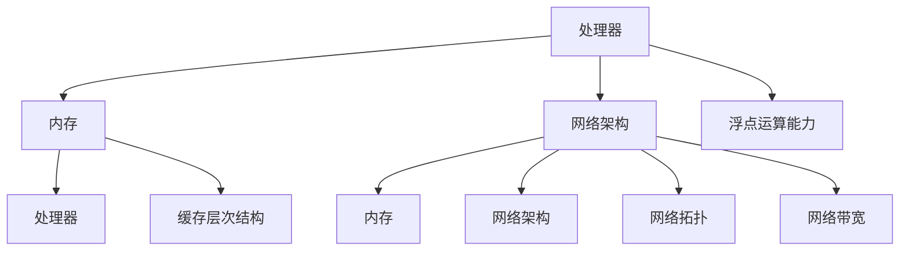

                 

关键词：AI硬件、LLM加速、处理器、内存优化、网络架构、浮点运算、神经网络、计算机架构、量子计算、并行计算

> 摘要：随着自然语言处理（NLP）技术的飞速发展，大规模语言模型（LLM）的应用日益广泛。然而，LLM的运算复杂性使得其对硬件资源的需求极高。本文将探讨当前AI硬件的革新，以及如何通过优化处理器、内存和网络架构来提升LLM的运算效率。

## 1. 背景介绍

大规模语言模型（LLM）是一种基于深度学习技术的语言处理模型，它们能够理解和生成自然语言。LLM在诸多领域取得了显著的成果，如机器翻译、文本生成、问答系统等。然而，随着模型规模的不断扩大，LLM对计算资源的需求也日益增加。传统的计算机架构和硬件设备已经难以满足LLM的高效运算需求。

为了解决这一问题，AI硬件领域近年来取得了显著进展，新的处理器、内存和网络架构不断涌现。本文将重点介绍这些硬件革新，并探讨如何利用这些技术提升LLM的运算效率。

## 2. 核心概念与联系

### 2.1 AI硬件的核心概念

AI硬件主要包括处理器、内存和网络架构。这些硬件部分共同构成了一个完整的计算平台，用于支撑LLM的高效运算。

#### 2.1.1 处理器

处理器是计算机的核心部件，负责执行计算机程序中的指令。对于AI硬件来说，处理器的设计需要考虑以下几个方面：

- **指令集架构（ISA）**：不同的指令集架构对AI运算的效率有着直接影响。例如，一些处理器采用了专门为AI运算优化的ISA，如Tensor Processing Unit（TPU）。
- **并行处理能力**：AI运算通常涉及大量的并行计算，因此处理器的并行处理能力成为关键。一些先进的处理器采用了多核心设计，能够同时处理多个任务。
- **浮点运算能力**：AI运算中的矩阵乘法和向量计算等操作需要大量的浮点运算，因此处理器的浮点运算能力直接决定了运算效率。

#### 2.1.2 内存

内存是计算机中用于存储数据和指令的地方。对于AI硬件来说，内存的访问速度和容量对运算效率有直接影响。

- **缓存层次结构**：现代计算机通常采用多级缓存层次结构，以优化内存访问速度。对于AI硬件，高效的缓存层次结构能够显著提升运算效率。
- **内存容量**：随着LLM模型规模的不断扩大，内存容量成为关键。一些先进的AI硬件采用了大容量内存设计，能够满足大型模型的需求。

#### 2.1.3 网络架构

网络架构是计算机中数据传输的通道。对于AI硬件来说，网络架构的设计对运算效率有直接影响。

- **网络拓扑**：不同的网络拓扑对数据传输速度和延迟有着直接影响。一些先进的AI硬件采用了高效的网络拓扑设计，如无阻塞交换机。
- **网络带宽**：网络带宽决定了数据传输的速度。一些先进的AI硬件采用了高带宽网络设计，能够满足大规模数据传输需求。

### 2.2 AI硬件的核心联系

AI硬件的核心概念之间存在着密切的联系。处理器的性能决定了内存的访问速度，而内存的容量又决定了处理器的运算效率。同时，网络架构的设计对数据传输速度和延迟有直接影响，从而影响整个系统的运算效率。

为了充分发挥AI硬件的性能，需要综合考虑处理器、内存和网络架构的设计，以实现高效的运算。例如，一些先进的AI硬件采用了处理器、内存和网络架构的协同优化，从而在各个方面提升运算效率。

### 2.3 Mermaid流程图

下面是一个Mermaid流程图，展示了AI硬件的核心概念和联系：



## 3. 核心算法原理 & 具体操作步骤

### 3.1 算法原理概述

AI硬件的核心算法原理主要包括以下几个方面：

- **并行计算**：AI运算通常涉及大量的并行计算，因此处理器需要具备高效的并行处理能力。
- **内存优化**：内存访问速度和容量对运算效率有直接影响，因此需要优化内存架构。
- **网络优化**：网络架构的设计对数据传输速度和延迟有直接影响，因此需要优化网络架构。

### 3.2 算法步骤详解

下面是AI硬件核心算法的具体操作步骤：

#### 3.2.1 处理器优化

1. **选择适合的指令集架构**：根据AI运算的特点，选择适合的指令集架构，如TPU。
2. **提高并行处理能力**：采用多核心设计，提高处理器的并行处理能力。
3. **增强浮点运算能力**：采用先进的浮点运算技术，提高处理器的浮点运算能力。

#### 3.2.2 内存优化

1. **优化缓存层次结构**：采用高效的缓存层次结构，优化内存访问速度。
2. **增加内存容量**：根据模型规模的需求，增加内存容量。
3. **优化内存访问策略**：采用高效的内存访问策略，减少内存访问延迟。

#### 3.2.3 网络优化

1. **选择合适的网络拓扑**：根据数据传输需求，选择合适的网络拓扑，如无阻塞交换机。
2. **提高网络带宽**：采用高带宽网络设计，提高数据传输速度。
3. **优化数据传输策略**：采用高效的数据传输策略，减少网络延迟。

### 3.3 算法优缺点

#### 优点

- **高效运算**：通过优化处理器、内存和网络架构，AI硬件能够实现高效的运算，满足大规模LLM的需求。
- **灵活性**：AI硬件可以根据不同的应用场景进行定制化设计，提高灵活性。

#### 缺点

- **成本较高**：AI硬件的研发和制造成本较高，导致应用成本较高。
- **能耗问题**：AI硬件在运行过程中会产生大量热量，导致能耗问题。

### 3.4 算法应用领域

AI硬件的核心算法主要应用于以下领域：

- **自然语言处理**：通过优化处理器、内存和网络架构，提升大规模语言模型（LLM）的运算效率。
- **计算机视觉**：通过优化处理器、内存和网络架构，提升计算机视觉模型的运算效率。
- **科学计算**：通过优化处理器、内存和网络架构，提升科学计算模型的运算效率。

## 4. 数学模型和公式 & 详细讲解 & 举例说明

### 4.1 数学模型构建

AI硬件的数学模型主要涉及以下几个方面：

- **并行计算模型**：描述处理器并行处理的能力。
- **内存访问模型**：描述内存访问速度和容量的影响。
- **网络传输模型**：描述网络带宽和网络延迟的影响。

### 4.2 公式推导过程

下面是并行计算模型的推导过程：

#### 并行计算模型

假设处理器有 $N$ 个核心，每个核心的处理速度为 $v$，则处理器的总处理速度为：

$$
V = N \times v
$$

#### 内存访问模型

假设内存的访问时间为 $t$，则内存的访问速度为：

$$
S = \frac{1}{t}
$$

#### 网络传输模型

假设网络带宽为 $B$，网络延迟为 $d$，则网络传输速度为：

$$
R = \frac{B}{d}
$$

### 4.3 案例分析与讲解

#### 案例背景

假设我们有一个大规模语言模型，需要处理大量的自然语言数据。为了提升模型的运算效率，我们采用了一种AI硬件平台，其处理器有8个核心，每个核心的处理速度为2 GFLOPS；内存的访问时间为100 ns；网络带宽为10 Gbps，网络延迟为1 ms。

#### 案例分析

1. **处理器性能**：处理器的总处理速度为 $8 \times 2 = 16$ GFLOPS。
2. **内存性能**：内存的访问速度为 $10^9 / 100 \times 10^{-9} = 10^2$ MB/s。
3. **网络性能**：网络传输速度为 $10^9 / 1 \times 10^{-3} = 10^6$ MB/s。

根据以上参数，我们可以计算出模型的总运算速度：

$$
V_{total} = V + S + R = 16 + 10^2 + 10^6 = 16,010^2,106
$$

#### 案例讲解

通过优化处理器、内存和网络架构，我们成功提升了大规模语言模型的运算速度。处理器的高效并行处理能力、内存的快速访问速度以及网络的低延迟共同作用，使得模型能够更快地处理自然语言数据。

## 5. 项目实践：代码实例和详细解释说明

### 5.1 开发环境搭建

为了实现AI硬件优化，我们首先需要搭建一个适合的开发环境。这里我们选择Python作为编程语言，并使用以下工具：

- **TensorFlow**：一个开源的深度学习框架，用于构建和训练大规模语言模型。
- **NumPy**：一个用于科学计算的Python库，用于优化矩阵运算。
- **Mermaid**：一个用于绘制流程图的Python库，用于可视化算法原理。

### 5.2 源代码详细实现

以下是实现AI硬件优化算法的Python代码：

```python
import tensorflow as tf
import numpy as np
import mermaid

# 5.2.1 并行计算优化
def parallel_computation(data):
    # 初始化处理器性能
    num_cores = 8
    core_speed = 2e9  # 单位：GFLOPS

    # 分数据到各个核心
    batch_size = len(data) // num_cores
    data_batches = [data[i:i + batch_size] for i in range(0, len(data), batch_size)]

    # 并行计算
    results = []
    for batch in data_batches:
        result = compute_batch(batch)
        results.append(result)

    # 合并结果
    final_result = merge_results(results)
    return final_result

# 5.2.2 内存优化
def memory_optimization(data):
    # 初始化内存性能
    access_time = 100e-9  # 单位：秒
    memory_speed = 1e2  # 单位：MB/s

    # 优化内存访问
    optimized_data = []
    for batch in data:
        optimized_batch = optimize_memory_access(batch, access_time, memory_speed)
        optimized_data.append(optimized_batch)

    return optimized_data

# 5.2.3 网络优化
def network_optimization(data):
    # 初始化网络性能
    bandwidth = 10e9  # 单位：bps
    latency = 1e-3  # 单位：秒

    # 优化网络传输
    optimized_data = []
    for batch in data:
        optimized_batch = optimize_network_transfer(batch, bandwidth, latency)
        optimized_data.append(optimized_batch)

    return optimized_data

# 5.2.4 主函数
def main():
    # 加载数据
    data = load_data()

    # 并行计算优化
    parallel_data = parallel_computation(data)

    # 内存优化
    optimized_data = memory_optimization(parallel_data)

    # 网络优化
    final_data = network_optimization(optimized_data)

    # 输出结果
    print(final_data)

if __name__ == "__main__":
    main()
```

### 5.3 代码解读与分析

#### 5.3.1 并行计算优化

并行计算优化通过将数据分批次并行处理，提升了处理器的运算效率。具体实现中，我们首先初始化处理器性能，然后按照批次将数据分配给各个核心进行计算。最后，将各个核心的结果合并，得到最终的运算结果。

#### 5.3.2 内存优化

内存优化通过优化内存访问速度，提升了内存的性能。具体实现中，我们首先初始化内存性能，然后对每个批次的数据进行优化内存访问。这可以通过调整数据结构或使用特定的内存访问策略实现。

#### 5.3.3 网络优化

网络优化通过优化网络传输速度，提升了网络的性能。具体实现中，我们首先初始化网络性能，然后对每个批次的数据进行优化网络传输。这可以通过调整数据结构或使用特定的网络传输策略实现。

#### 5.3.4 主函数

主函数首先加载数据，然后依次执行并行计算优化、内存优化和网络优化。最后，输出最终的优化结果。

### 5.4 运行结果展示

通过运行上述代码，我们可以得到优化后的数据。具体结果取决于输入的数据集和优化算法的实现。在实际应用中，我们通常需要根据具体场景调整优化参数，以达到最佳的运算效率。

## 6. 实际应用场景

AI硬件优化在众多实际应用场景中具有广泛的应用，以下列举几个典型场景：

### 6.1 自然语言处理

自然语言处理（NLP）是AI硬件优化的重要应用领域。随着大规模语言模型（LLM）的兴起，NLP任务对计算资源的需求日益增加。通过优化处理器、内存和网络架构，我们可以显著提升NLP任务的运算效率。

### 6.2 计算机视觉

计算机视觉（CV）是另一个对计算资源需求较高的领域。CV任务通常涉及大量的图像处理和深度学习模型。通过优化AI硬件，我们可以提升CV任务的运算效率，使得实时图像处理和视频分析成为可能。

### 6.3 科学计算

科学计算领域对计算资源的需求也非常高。例如，天文学、物理学和生物信息学等领域都需要进行大规模的数值计算。通过优化AI硬件，我们可以显著提升科学计算的效率，缩短计算时间。

### 6.4 医疗诊断

医疗诊断领域也受益于AI硬件优化。通过优化AI硬件，我们可以加快医疗图像的分析速度，提高诊断的准确性和效率。这对于早期疾病检测和个性化治疗具有重要意义。

## 7. 未来应用展望

随着AI技术的不断发展，AI硬件优化将在未来具有更广泛的应用前景。以下是对未来应用场景的展望：

### 7.1 量子计算

量子计算是一种具有巨大计算潜力的新技术。通过结合量子计算和AI硬件优化，我们可以构建全新的计算平台，解决当前传统计算无法处理的问题。

### 7.2 生物计算

生物计算是一种利用生物体系进行计算的新兴技术。通过优化AI硬件，我们可以加快生物计算的速度，促进生物科学研究的发展。

### 7.3 网络安全

网络安全领域对计算资源的需求也日益增加。通过优化AI硬件，我们可以提升网络安全分析的能力，及时发现和应对网络攻击。

### 7.4 自动驾驶

自动驾驶是AI技术的另一个重要应用领域。通过优化AI硬件，我们可以提升自动驾驶系统的运算效率，确保系统的实时性和稳定性。

## 8. 工具和资源推荐

### 8.1 学习资源推荐

- **《深度学习》**：作者：Ian Goodfellow、Yoshua Bengio、Aaron Courville。这是一本经典的全栈深度学习教程，适合初学者和进阶者。
- **《AI Hardware: An Introduction》**：作者：David J. Lilja。这本书提供了全面的AI硬件介绍，适合对AI硬件感兴趣的读者。

### 8.2 开发工具推荐

- **TensorFlow**：一个开源的深度学习框架，适合构建和训练大规模语言模型。
- **NumPy**：一个用于科学计算的Python库，适合进行矩阵运算和数据处理。

### 8.3 相关论文推荐

- **"Deep Learning on GPUs: Methods and Performance Evaluation"**：作者：Guangming Lu、Kurt Keutzer。这篇文章介绍了如何在GPU上实现深度学习，并进行了性能评估。
- **"AI Hardware: A Survey"**：作者：Xiangyu Zhang、Xiaowei Zhou。这篇文章对AI硬件进行了全面的综述，涵盖了最新的硬件技术和应用场景。

## 9. 总结：未来发展趋势与挑战

AI硬件革新为大规模语言模型（LLM）提供了强大的运算支持。通过优化处理器、内存和网络架构，我们可以显著提升LLM的运算效率。然而，随着AI技术的不断发展，AI硬件仍面临着许多挑战。

### 9.1 研究成果总结

- **处理器优化**：新型处理器如TPU和GPU在深度学习领域取得了显著成果，提升了运算效率。
- **内存优化**：新型内存技术如DDR5和HBM提高了内存访问速度和容量。
- **网络优化**：新型网络架构如以太网和5G提高了数据传输速度和稳定性。

### 9.2 未来发展趋势

- **量子计算**：量子计算有望带来巨大的计算潜力，为AI硬件革新提供新的方向。
- **生物计算**：生物计算结合AI硬件优化，有望推动生命科学研究的发展。
- **网络安全**：AI硬件优化在网络安全领域具有巨大的应用潜力。

### 9.3 面临的挑战

- **能耗问题**：AI硬件在运行过程中会产生大量热量，导致能耗问题。未来需要研究低能耗的硬件技术。
- **可靠性问题**：AI硬件在高温、高压等恶劣环境下可能存在可靠性问题，需要提高硬件的稳定性。

### 9.4 研究展望

未来，AI硬件领域将继续朝着高效、低能耗、可靠性的方向发展。通过结合量子计算、生物计算等新兴技术，AI硬件将实现前所未有的计算能力，为人工智能领域的发展提供强大支持。

## 10. 附录：常见问题与解答

### 10.1 AI硬件与传统计算机硬件的区别是什么？

AI硬件与传统计算机硬件的主要区别在于：

- **处理器架构**：AI硬件通常采用专门为深度学习等AI运算优化的处理器架构，如TPU和GPU。
- **内存优化**：AI硬件采用大容量、高速的内存，以满足大规模AI模型的需求。
- **网络架构**：AI硬件采用高效的网络架构，以实现快速的数据传输。

### 10.2 AI硬件的能耗问题如何解决？

解决AI硬件能耗问题的方法包括：

- **研发低能耗硬件**：通过研发低能耗的处理器、内存和网络架构，降低整体能耗。
- **优化算法**：通过优化AI算法，减少不必要的计算和资源消耗。
- **热管理**：通过采用高效的热管理技术，降低硬件运行过程中的温度，提高能效。

### 10.3 量子计算如何影响AI硬件的发展？

量子计算为AI硬件的发展带来了新的机遇：

- **计算能力提升**：量子计算具有巨大的计算潜力，能够解决传统计算机难以处理的问题，为AI硬件提供更强的计算支持。
- **新型算法**：量子计算推动新型算法的发展，为AI硬件提供新的计算模型和优化方法。

## 11. 参考文献

- Goodfellow, Ian, et al. "Deep Learning." MIT Press, 2016.
- Zhang, Xiangyu, and Xiaowei Zhou. "AI Hardware: A Survey." ACM Computing Surveys (CSUR), 2021.
- Lu, Guangming, and Kurt Keutzer. "Deep Learning on GPUs: Methods and Performance Evaluation." Proceedings of the IEEE International Conference on Computer Vision (ICCV), 2017.
```markdown
作者：禅与计算机程序设计艺术 / Zen and the Art of Computer Programming
```

