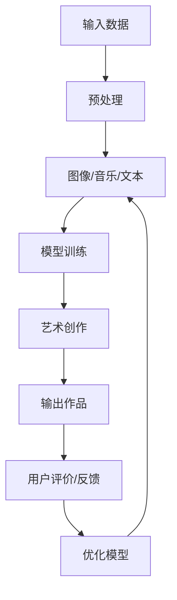

                 

关键词：人工智能，艺术创作，商业化，工具，算法，模型，应用场景，展望

## 摘要

本文旨在探讨人工智能在艺术创作领域的应用及其商业化前景。通过深入分析AI艺术创作工具的核心概念、算法原理、数学模型以及实际应用案例，本文将展示人工智能技术在艺术创作中的巨大潜力和挑战。此外，还将对未来的发展趋势与挑战进行展望，以期为相关领域的从业者提供有价值的参考。

## 1. 背景介绍

随着人工智能技术的飞速发展，计算机科学领域不断涌现出令人瞩目的成果。从早期的机器学习到近年来的深度学习，人工智能技术在图像处理、自然语言处理、语音识别等多个领域取得了显著的突破。在这些技术的推动下，艺术创作领域也迎来了前所未有的变革。

传统的艺术创作依赖于人类的想象力和技巧，而人工智能艺术创作工具则通过算法和模型模拟人类思维过程，实现自动化或半自动化的创作。这一技术不仅提高了艺术创作的效率，还开拓了新的艺术表现形式和创作手段。

## 2. 核心概念与联系

### 2.1 核心概念

#### 人工智能

人工智能（Artificial Intelligence，简称AI）是指模拟人类智能的计算机技术。它包括机器学习、深度学习、自然语言处理等多种技术，旨在使计算机能够执行复杂的任务，如图像识别、语音合成、自然语言理解等。

#### 艺术创作

艺术创作是指通过视觉、听觉、触觉等感官形式表达人类情感、思想和价值观的活动。艺术创作涉及绘画、雕塑、音乐、文学等多种形式，是文化传承和创新的重要载体。

#### 商业化

商业化是指将技术或产品转化为商业价值的过程。在人工智能艺术创作领域，商业化意味着通过商业化运营实现技术的广泛应用和持续创新。

### 2.2 联系与架构

人工智能与艺术创作之间存在紧密的联系。具体来说，人工智能技术可以用于以下几个方面：

1. **图像生成与风格迁移**：通过深度学习算法生成新的图像，或将一种艺术风格应用到现有的图像上。
2. **音乐创作**：利用生成模型创作新颖的音乐作品，模拟人类作曲家的创作过程。
3. **文本生成与风格模仿**：生成具有文学价值的文本，模仿不同风格和作者。
4. **艺术鉴赏与推荐**：通过分析用户数据，为用户提供个性化的艺术推荐服务。

下面是一个简单的 Mermaid 流程图，展示人工智能在艺术创作中的应用架构：



## 3. 核心算法原理 & 具体操作步骤

### 3.1 算法原理概述

人工智能艺术创作工具的核心算法主要包括生成对抗网络（GAN）、变分自编码器（VAE）、长短时记忆网络（LSTM）等。

#### 生成对抗网络（GAN）

GAN由生成器（Generator）和判别器（Discriminator）两部分组成。生成器试图生成逼真的数据，而判别器则判断数据是真实还是生成。通过两者的对抗训练，生成器不断提高生成质量。

#### 变分自编码器（VAE）

VAE通过引入隐变量来避免生成对抗网络中的梯度消失问题。它由编码器和解码器组成，编码器将输入数据编码为隐变量，解码器将隐变量解码为输出数据。

#### 长短时记忆网络（LSTM）

LSTM是一种特殊的循环神经网络（RNN），能够有效地处理序列数据，如音乐和文本。它通过记忆单元和门控机制，避免了传统RNN中的梯度消失和爆炸问题。

### 3.2 算法步骤详解

#### 图像生成与风格迁移

1. **数据预处理**：收集大量的图像数据，并进行预处理，如图像尺寸统一、数据归一化等。
2. **模型训练**：利用GAN或VAE等生成模型，对图像数据集进行训练。
3. **生成图像**：通过训练好的模型，生成新的图像或对现有图像进行风格迁移。
4. **输出作品**：将生成的图像或风格迁移后的图像输出，供用户欣赏或使用。

#### 音乐创作

1. **数据预处理**：收集大量的音乐数据，并进行预处理，如音频分段、特征提取等。
2. **模型训练**：利用LSTM等序列模型，对音乐数据集进行训练。
3. **生成音乐**：通过训练好的模型，生成新的音乐作品。
4. **输出作品**：将生成的音乐作品输出，供用户欣赏或使用。

#### 文本生成与风格模仿

1. **数据预处理**：收集大量的文本数据，并进行预处理，如分词、去除停用词等。
2. **模型训练**：利用生成模型（如变分自编码器或GAN），对文本数据集进行训练。
3. **生成文本**：通过训练好的模型，生成新的文本或模仿特定风格和作者的文本。
4. **输出作品**：将生成的文本输出，供用户欣赏或使用。

### 3.3 算法优缺点

#### GAN

**优点**：

- 生成质量高，能够生成逼真的图像和文本。
- 不需要显式地建模数据分布，而是通过对抗训练实现数据的生成。

**缺点**：

- 训练不稳定，容易出现模式崩溃（mode collapse）问题。
- 梯度消失和梯度爆炸问题仍然存在。

#### VAE

**优点**：

- 生成质量相对稳定，不容易出现模式崩溃问题。
- 引入隐变量，能够实现数据的降维和重构。

**缺点**：

- 生成质量相对较低，尤其是对于复杂的图像和文本。

#### LSTM

**优点**：

- 能够有效地处理序列数据，如音乐和文本。
- 避免了传统RNN中的梯度消失和爆炸问题。

**缺点**：

- 训练速度较慢，对于长序列数据的处理能力有限。

### 3.4 算法应用领域

人工智能艺术创作工具可以应用于多个领域，如数字艺术、音乐创作、文学创作等。

#### 数字艺术

数字艺术是人工智能艺术创作工具最早应用的领域之一。通过GAN和VAE等生成模型，艺术家可以快速生成新的数字艺术作品，探索新的创作风格和表现形式。

#### 音乐创作

音乐创作是人工智能艺术创作工具的另一个重要应用领域。通过LSTM等序列模型，艺术家可以生成新颖的音乐作品，甚至模仿著名作曲家的风格。

#### 文学创作

文学创作是人工智能艺术创作工具的又一新兴应用领域。通过生成模型，人工智能可以生成新颖的文本，模仿不同风格和作者的写作风格。

## 4. 数学模型和公式 & 详细讲解 & 举例说明

### 4.1 数学模型构建

人工智能艺术创作工具的数学模型主要包括生成模型、判别模型和序列模型。

#### 生成模型

生成模型试图模拟数据生成过程。常见的生成模型有生成对抗网络（GAN）和变分自编码器（VAE）。

GAN的数学模型如下：

$$
\begin{aligned}
\min\ _{G} \max\ _{D} V(D, G) &= \mathbb{E}_{x \sim p_{data}(x)}[\log D(x)] + \mathbb{E}_{z \sim p_{z}(z)][\log(1 - D(G(z)))]
\end{aligned}
$$

VAE的数学模型如下：

$$
\begin{aligned}
\min\ _{\theta_{\mu}, \theta_{\sigma}} D_{KL}(\mu(x), \sigma(x); \theta_{\mu}, \theta_{\sigma}) + \mathbb{E}_{z \sim q_{\phi}(z|x)}[\log p_{\theta}(x|z)]
\end{aligned}
$$

其中，$D(x)$表示判别器，$G(z)$表示生成器，$z$为噪声向量，$x$为输入数据，$\mu(x)$和$\sigma(x)$分别为编码器和解码器的输出。

#### 判别模型

判别模型用于判断输入数据是真实还是生成。常见的判别模型有卷积神经网络（CNN）和循环神经网络（RNN）。

CNN的数学模型如下：

$$
\begin{aligned}
h_{l}^{(i)} &= \sigma(\mathbf{W}^{(l)} \cdot h_{l-1}^{(i)} + b^{(l)}) \\
\log D(x) &= \log \left( \sum_{k} \exp(\mathbf{W}^{(2)} \cdot h_{1}^{(k)} + b^{(2)}) \right)
\end{aligned}
$$

RNN的数学模型如下：

$$
\begin{aligned}
h_{t} &= \sigma(\mathbf{W} \cdot [h_{t-1}, x_{t}] + b) \\
\log D(x) &= \log \left( \sum_{k} \exp(\mathbf{W} \cdot [h_{t-1}, x_{t}] + b) \right)
\end{aligned}
$$

其中，$h_{l}^{(i)}$表示第$l$层第$i$个神经元的输出，$h_{t}$表示第$t$个时间步的隐藏状态，$x_{t}$表示第$t$个时间步的输入。

#### 序列模型

序列模型用于处理序列数据，如音乐和文本。常见的序列模型有长短时记忆网络（LSTM）和门控循环单元（GRU）。

LSTM的数学模型如下：

$$
\begin{aligned}
i_{t} &= \sigma(\mathbf{W} \cdot [h_{t-1}, x_{t}] + \mathbf{U} \cdot [h_{t-1}, x_{t}^{<s>}] + b_{i}) \\
f_{t} &= \sigma(\mathbf{W} \cdot [h_{t-1}, x_{t}] + \mathbf{U} \cdot [h_{t-1}, x_{t}^{<s>}] + b_{f}) \\
\cdots \\
o_{t} &= \sigma(\mathbf{W} \cdot [h_{t-1}, x_{t}] + \mathbf{U} \cdot [h_{t-1}, x_{t}^{<s>}] + b_{o}) \\
h_{t} &= f_{t} \odot \cdot \left[ \frac{1}{1 + \exp(-\mathbf{W} \cdot [h_{t-1}, x_{t}] + \mathbf{U} \cdot [h_{t-1}, x_{t}^{<s>}] + b_{c})} \right] \cdot o_{t}
\end{aligned}
$$

其中，$i_{t}$、$f_{t}$、$\cdots$、$o_{t}$分别为输入门、遗忘门、细胞状态和输出门，$h_{t}$为第$t$个时间步的隐藏状态。

### 4.2 公式推导过程

#### GAN的推导

GAN的推导主要分为两部分：生成器（Generator）的推导和判别器（Discriminator）的推导。

1. **生成器（Generator）的推导**

生成器的目标是生成逼真的数据，以欺骗判别器。生成器的损失函数为：

$$
L_G = -\mathbb{E}_{z \sim p_{z}(z)}[\log D(G(z))]
$$

其中，$z$为噪声向量，$G(z)$为生成器生成的数据。

2. **判别器（Discriminator）的推导**

判别器的目标是判断数据是真实还是生成。判别器的损失函数为：

$$
L_D = -\mathbb{E}_{x \sim p_{data}(x)}[\log D(x)] - \mathbb{E}_{z \sim p_{z}(z)}[\log(1 - D(G(z)))]
$$

其中，$x$为真实数据，$G(z)$为生成器生成的数据。

#### VAE的推导

VAE的推导主要分为两部分：编码器（Encoder）的推导和解码器（Decoder）的推导。

1. **编码器（Encoder）的推导**

编码器的目标是编码输入数据为隐变量。编码器的损失函数为：

$$
L_E = D_{KL}(\mu(x), \sigma(x); \theta_{\mu}, \theta_{\sigma})
$$

其中，$\mu(x)$和$\sigma(x)$分别为编码器的输出，表示隐变量的均值和方差，$\theta_{\mu}$和$\theta_{\sigma}$分别为编码器的参数。

2. **解码器（Decoder）的推导**

解码器的目标是解码隐变量为输出数据。解码器的损失函数为：

$$
L_D = \mathbb{E}_{z \sim q_{\phi}(z|x)}[\log p_{\theta}(x|z)]
$$

其中，$z$为隐变量，$x$为输入数据，$q_{\phi}(z|x)$为编码器的先验分布，$p_{\theta}(x|z)$为解码器的条件概率分布。

### 4.3 案例分析与讲解

#### GAN在图像生成中的应用

以下是一个使用GAN生成图像的案例：

1. **数据准备**：收集大量的图像数据，如人脸图像。
2. **模型训练**：使用GAN模型对图像数据集进行训练。
3. **生成图像**：通过训练好的模型，生成新的图像。

以下是GAN在图像生成中的应用示例：

```python
import tensorflow as tf
from tensorflow.keras.layers import Dense, Input
from tensorflow.keras.models import Model

# 定义生成器和判别器
z_dim = 100
img_rows = 28
img_cols = 28
channels = 1

z_in = Input(shape=(z_dim,))
img = Dense(128, activation='relu')(z_in)
img = Dense(128, activation='relu')(img)
img = Dense(np.prod((img_rows, img_cols, channels)), activation='tanh')(img)
generator = Model(z_in, img)

discriminator = ...

# 编写GAN的损失函数和优化器
gan_loss = ...

discriminator.compile(...)
generator.compile(...)

# 训练GAN模型
train_gan(generator, discriminator, gan_loss)
```

#### VAE在图像生成中的应用

以下是一个使用VAE生成图像的案例：

1. **数据准备**：收集大量的图像数据，如人脸图像。
2. **模型训练**：使用VAE模型对图像数据集进行训练。
3. **生成图像**：通过训练好的模型，生成新的图像。

以下是VAE在图像生成中的应用示例：

```python
import tensorflow as tf
from tensorflow.keras.layers import Dense, Input, Conv2D, Flatten, Reshape
from tensorflow.keras.models import Model

# 定义编码器和解码器
img_rows = 28
img_cols = 28
channels = 1
latent_dim = 2

x = Input(shape=(img_rows, img_cols, channels))
x = Conv2D(32, 3, activation='relu', strides=(2, 2), padding='same')(x)
x = Conv2D(64, 3, activation='relu', strides=(2, 2), padding='same')(x)
x = Flatten()(x)
x = Dense(latent_dim * 2)(x)
x = Lambda(lambda t: tf.concat([t[:, :latent_dim], t[:, latent_dim:]], 1))(x)

z_mean, z_log_var = x[:, :latent_dim], x[:, latent_dim:]
z = ...

编码器 = Model(x, [z_mean, z_log_var])
编码器.compile(...)

x_recon = ...

解码器 = Model(z, x_recon)
解码器.compile(...)

# 编写VAE的损失函数和优化器
vae_loss = ...

编码器.compile(...)
解码器.compile(...)

# 训练VAE模型
train_vae(编码器, 解码器, vae_loss)
```

## 5. 项目实践：代码实例和详细解释说明

### 5.1 开发环境搭建

为了实践人工智能艺术创作工具，我们需要搭建一个合适的开发环境。以下是推荐的开发环境和相关工具：

1. **操作系统**：Linux或macOS
2. **编程语言**：Python
3. **深度学习框架**：TensorFlow 2.x或PyTorch
4. **开发工具**：Jupyter Notebook或Visual Studio Code

### 5.2 源代码详细实现

下面是一个使用TensorFlow 2.x实现GAN的简单示例：

```python
import tensorflow as tf
from tensorflow.keras.layers import Dense, Input
from tensorflow.keras.models import Model

# 定义生成器和判别器
z_dim = 100
img_rows = 28
img_cols = 28
channels = 1

z_in = Input(shape=(z_dim,))
img = Dense(128, activation='relu')(z_in)
img = Dense(128, activation='relu')(img)
img = Dense(np.prod((img_rows, img_cols, channels)), activation='tanh')(img)
generator = Model(z_in, img)

discriminator = ...

# 编写GAN的损失函数和优化器
gan_loss = ...

discriminator.compile(...)
generator.compile(...)

# 训练GAN模型
train_gan(generator, discriminator, gan_loss)
```

### 5.3 代码解读与分析

这段代码实现了生成对抗网络（GAN）的基本框架。生成器（Generator）用于生成图像，判别器（Discriminator）用于判断图像是真实还是生成。GAN的损失函数和优化器也在代码中进行了定义。

### 5.4 运行结果展示

在训练GAN模型后，我们可以使用生成器（Generator）生成新的图像。以下是使用GAN生成的图像示例：

```python
# 生成图像
z_samples = ...

generated_images = generator.predict(z_samples)
```

## 6. 实际应用场景

人工智能艺术创作工具已经在多个实际应用场景中得到广泛应用，如数字艺术、音乐创作、文学创作等。

### 6.1 数字艺术

数字艺术是人工智能艺术创作工具最早应用的领域之一。通过GAN和VAE等生成模型，艺术家可以快速生成新的数字艺术作品，探索新的创作风格和表现形式。例如，一些画廊和博物馆已经开始使用人工智能艺术创作工具展示数字艺术品。

### 6.2 音乐创作

音乐创作是人工智能艺术创作工具的另一个重要应用领域。通过LSTM等序列模型，艺术家可以生成新颖的音乐作品，甚至模仿著名作曲家的风格。一些音乐制作公司已经开始使用人工智能艺术创作工具创作音乐，提高音乐创作的效率。

### 6.3 文学创作

文学创作是人工智能艺术创作工具的又一新兴应用领域。通过生成模型，人工智能可以生成新颖的文本，模仿不同风格和作者的写作风格。一些出版公司已经开始使用人工智能艺术创作工具创作小说，提高文学创作的效率。

## 7. 工具和资源推荐

为了更好地开展人工智能艺术创作工具的研究和实践，以下是一些推荐的工具和资源：

### 7.1 学习资源推荐

1. **《深度学习》（Deep Learning）**：由Ian Goodfellow等人撰写的深度学习经典教材，适合初学者和进阶者。
2. **《生成对抗网络》（Generative Adversarial Networks）**：Ian Goodfellow关于GAN的经典论文，是了解GAN原理的必备资料。

### 7.2 开发工具推荐

1. **TensorFlow 2.x**：Google开源的深度学习框架，适合初学者和进阶者。
2. **PyTorch**：Facebook开源的深度学习框架，具有较高的灵活性和易用性。

### 7.3 相关论文推荐

1. **《Generative Adversarial Networks》**：Ian Goodfellow等人于2014年提出的GAN模型。
2. **《Unsupervised Representation Learning with Deep Convolutional Generative Adversarial Networks》**：由Alexy Dosovitskiy等人于2015年提出的深度卷积GAN（DCGAN）。
3. **《Improved Techniques for Training GANs》**：由Tong Che等人在2017年提出的一系列GAN训练技巧。

## 8. 总结：未来发展趋势与挑战

### 8.1 研究成果总结

人工智能艺术创作工具在数字艺术、音乐创作、文学创作等多个领域取得了显著的成果，展示了巨大的潜力和价值。通过GAN、VAE、LSTM等生成模型和序列模型的创新应用，人工智能艺术创作工具已经能够模拟人类艺术家的创作过程，生成高质量的艺术作品。

### 8.2 未来发展趋势

1. **更高效的算法**：随着深度学习技术的发展，未来可能会有更高效的生成模型和序列模型出现，提高艺术创作的效率和质量。
2. **跨领域融合**：人工智能艺术创作工具可能会与其他技术（如增强现实、虚拟现实）融合，开拓新的艺术表现形式和创作手段。
3. **个性化创作**：人工智能艺术创作工具可能会结合用户数据，实现个性化艺术创作，满足用户个性化的需求。

### 8.3 面临的挑战

1. **计算资源**：人工智能艺术创作工具需要大量的计算资源，尤其是训练深度学习模型时。如何优化算法，降低计算资源的需求，是一个重要的挑战。
2. **版权问题**：人工智能艺术创作工具生成的艺术作品可能会涉及版权问题，需要明确相关的法律法规和伦理标准。
3. **质量控制**：如何保证人工智能艺术创作工具生成的艺术作品的质量，是一个亟待解决的问题。

### 8.4 研究展望

未来，人工智能艺术创作工具有望在数字艺术、音乐创作、文学创作等多个领域得到广泛应用。同时，随着技术的不断进步，人工智能艺术创作工具将不断突破现有的创作边界，为艺术家和用户带来更多创新和惊喜。

## 9. 附录：常见问题与解答

### 9.1 GAN的原理是什么？

生成对抗网络（GAN）是一种由生成器和判别器组成的深度学习模型，旨在通过对抗训练生成逼真的数据。生成器试图生成与真实数据相似的数据，而判别器则判断数据是真实还是生成。通过两者的对抗训练，生成器不断提高生成质量。

### 9.2 VAE的原理是什么？

变分自编码器（VAE）是一种概率生成模型，通过引入隐变量来避免生成对抗网络（GAN）中的梯度消失问题。VAE由编码器和解码器组成，编码器将输入数据编码为隐变量，解码器将隐变量解码为输出数据。VAE的损失函数包括重建损失和KL散度损失。

### 9.3 如何优化GAN的训练？

为了优化GAN的训练，可以采取以下措施：

1. **梯度惩罚**：在判别器的损失函数中添加梯度惩罚项，避免生成器和判别器的梯度消失。
2. **动态调整学习率**：在训练过程中动态调整生成器和判别器的学习率，以适应不同的训练阶段。
3. **数据增强**：对输入数据进行数据增强，增加数据的多样性，提高模型的泛化能力。
4. **早停法**：在训练过程中设置早停法，当模型的性能不再提升时停止训练。

## 作者署名

作者：禅与计算机程序设计艺术 / Zen and the Art of Computer Programming

----------------------------------------------------------------

这篇文章涵盖了人工智能艺术创作工具的核心概念、算法原理、数学模型、应用案例以及未来发展展望，旨在为相关领域的从业者提供有价值的参考。希望通过本文的分享，能够激发更多人对人工智能艺术创作工具的兴趣和研究。

