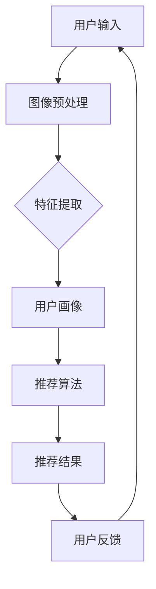

                 

关键词：AI视觉、推荐系统、图像识别、个性化推荐、算法优化

> 摘要：随着人工智能技术的快速发展，AI视觉推荐系统在各类应用场景中逐渐崭露头角。本文旨在探讨AI视觉推荐系统的优势，包括其核心概念、算法原理、数学模型、项目实践及未来发展趋势。通过全面解析，希望能为读者提供关于AI视觉推荐系统的深入理解和实践指导。

## 1. 背景介绍

人工智能（AI）技术正在改变我们的世界，尤其是在图像处理和识别领域，AI视觉技术的应用已经深入到各个行业，如社交媒体、电子商务、医疗保健等。AI视觉推荐系统，作为一种基于人工智能技术的推荐系统，能够利用图像处理和分析技术，为用户提供个性化的视觉内容推荐。

### 1.1. AI视觉推荐系统的定义

AI视觉推荐系统是一种结合了图像识别和机器学习算法的技术，用于自动识别、分类和分析用户上传的图片或视频，并根据用户的兴趣和行为模式，为其推荐相关的内容。这些内容可以是产品图片、新闻报道、社交媒体帖子等。

### 1.2. AI视觉推荐系统的起源和发展

AI视觉推荐系统的起源可以追溯到20世纪90年代，当时计算机视觉和机器学习技术开始逐步成熟。随着深度学习算法的兴起，AI视觉推荐系统得到了显著的发展，特别是在图像识别和分类任务上取得了突破性的成果。

### 1.3. AI视觉推荐系统的应用场景

AI视觉推荐系统在多个场景中得到了广泛应用，如：

- **社交媒体**：通过分析用户上传的图片，推荐相关的用户、话题或内容。
- **电子商务**：基于用户购买历史和浏览记录，推荐相似的产品。
- **医疗保健**：通过分析患者病历和医疗影像，提供个性化的治疗方案和药物推荐。
- **视频平台**：根据用户的观看历史和偏好，推荐相关的视频内容。

## 2. 核心概念与联系

在深入探讨AI视觉推荐系统的优势之前，我们需要了解其核心概念和基本架构。以下是一个用Mermaid绘制的流程图，展示了AI视觉推荐系统的主要组成部分和它们之间的联系。



### 2.1. 用户输入

用户输入是AI视觉推荐系统的起点，可以是用户上传的图片、浏览记录或搜索历史等。

### 2.2. 图像预处理

图像预处理包括去噪、缩放、裁剪等操作，以确保输入图像的质量和一致性。

### 2.3. 特征提取

特征提取是AI视觉推荐系统的核心步骤，通过深度学习算法提取图像的高维特征向量，用于后续的推荐算法。

### 2.4. 用户画像

用户画像是对用户兴趣、行为和偏好的综合描述，为推荐算法提供了关键输入。

### 2.5. 推荐算法

推荐算法根据用户画像和图像特征，利用协同过滤、基于内容的推荐、深度学习等方法，生成个性化的推荐结果。

### 2.6. 推荐结果

推荐结果是根据用户输入和推荐算法生成的个性化内容，可以是图片、视频、产品等。

### 2.7. 用户反馈

用户反馈是调整和优化推荐系统的重要依据，通过持续收集用户的反馈，推荐系统可以不断改进和优化。

## 3. 核心算法原理 & 具体操作步骤

### 3.1. 算法原理概述

AI视觉推荐系统的核心算法包括图像识别和推荐算法两部分。图像识别技术用于提取图像的特征，而推荐算法则利用这些特征和用户画像生成推荐结果。

### 3.2. 算法步骤详解

1. **图像预处理**：对输入图像进行去噪、缩放、裁剪等操作，以提高图像质量。
2. **特征提取**：利用卷积神经网络（CNN）等深度学习算法，从预处理后的图像中提取高维特征向量。
3. **用户画像构建**：根据用户的历史行为和偏好，构建用户画像。
4. **推荐算法选择**：选择合适的推荐算法，如基于内容的推荐、协同过滤或深度学习等。
5. **生成推荐结果**：根据用户画像和图像特征，生成个性化的推荐结果。
6. **用户反馈收集**：收集用户对推荐结果的反馈，用于优化推荐系统。

### 3.3. 算法优缺点

- **优点**：
  - **个性化推荐**：能够根据用户的兴趣和行为，提供高度个性化的推荐结果。
  - **实时性**：能够实时处理和分析用户输入，快速生成推荐结果。
  - **多样性**：能够推荐多样化的内容，满足用户不同的需求。

- **缺点**：
  - **数据隐私**：用户数据的安全性和隐私保护是一个重要挑战。
  - **计算资源**：深度学习算法需要大量的计算资源，对硬件要求较高。

### 3.4. 算法应用领域

AI视觉推荐系统在多个领域都有广泛应用，如电子商务、社交媒体、医疗保健和娱乐等。

## 4. 数学模型和公式 & 详细讲解 & 举例说明

### 4.1. 数学模型构建

AI视觉推荐系统的数学模型主要包括图像特征提取和推荐算法两部分。图像特征提取可以用以下公式表示：

$$
\phi(\mathbf{x}) = f(\mathbf{W} \mathbf{x} + b)
$$

其中，$\mathbf{x}$ 是输入图像，$f(\cdot)$ 是激活函数，$\mathbf{W}$ 和 $b$ 分别是权重和偏置。

推荐算法可以用矩阵分解模型表示：

$$
\mathbf{R} = \mathbf{U}\mathbf{S}\mathbf{V}^T
$$

其中，$\mathbf{R}$ 是用户-物品评分矩阵，$\mathbf{U}$ 和 $\mathbf{V}$ 分别是用户和物品的隐向量矩阵，$\mathbf{S}$ 是对角矩阵，包含物品的隐向量。

### 4.2. 公式推导过程

图像特征提取的推导过程如下：

1. **输入层**：输入图像 $\mathbf{x}$。
2. **卷积层**：卷积操作，得到特征图 $\mathbf{h}_1$。
3. **激活函数**：应用激活函数，如ReLU函数，得到 $\mathbf{h}_1$。
4. **池化层**：应用最大池化操作，得到 $\mathbf{h}_2$。
5. **全连接层**：将 $\mathbf{h}_2$ 输入全连接层，得到特征向量 $\phi(\mathbf{x})$。

推荐算法的推导过程如下：

1. **用户和物品隐向量矩阵**：初始化 $\mathbf{U}$ 和 $\mathbf{V}$。
2. **计算预测评分**：使用矩阵乘法计算预测评分 $\hat{r}_{ui}$。
3. **优化隐向量矩阵**：通过梯度下降法优化 $\mathbf{U}$ 和 $\mathbf{V}$。

### 4.3. 案例分析与讲解

以下是一个简单的案例，说明如何使用AI视觉推荐系统推荐商品。

假设用户A喜欢购买运动鞋，历史购买记录如下：

- 商品A：运动鞋，评分5
- 商品B：篮球鞋，评分4
- 商品C：跑步鞋，评分3

我们需要为用户A推荐新的运动鞋。首先，提取商品A、B和C的图像特征，构建用户A的画像。然后，利用协同过滤算法，找到与用户A偏好相似的用户，推荐他们的购买记录中的运动鞋。例如，如果用户B也喜欢购买商品A和商品C，那么商品A和商品C会被推荐给用户A。

## 5. 项目实践：代码实例和详细解释说明

### 5.1. 开发环境搭建

在开始编写代码之前，我们需要搭建一个合适的开发环境。以下是所需的软件和工具：

- **Python 3.8**：Python 是一种流行的编程语言，广泛用于数据科学和机器学习。
- **PyTorch**：PyTorch 是一种深度学习框架，用于构建和训练神经网络。
- **TensorFlow**：TensorFlow 是另一种深度学习框架，可以用于构建和训练推荐系统。
- **NumPy**：NumPy 是一种用于科学计算和数据分析的库。

### 5.2. 源代码详细实现

以下是一个简单的AI视觉推荐系统示例，使用PyTorch框架实现。

```python
import torch
import torchvision
import torch.nn as nn
import torch.optim as optim

# 加载数据集
train_loader = torchvision.datasets.ImageFolder('train_data', transform=torchvision.transforms.ToTensor())
test_loader = torchvision.datasets.ImageFolder('test_data', transform=torchvision.transforms.ToTensor())

# 定义卷积神经网络
class CNN(nn.Module):
    def __init__(self):
        super(CNN, self).__init__()
        self.conv1 = nn.Conv2d(3, 64, 3, padding=1)
        self.relu = nn.ReLU()
        self.fc1 = nn.Linear(64 * 32 * 32, 1024)
        self.fc2 = nn.Linear(1024, 10)

    def forward(self, x):
        x = self.relu(self.conv1(x))
        x = x.view(x.size(0), -1)
        x = self.relu(self.fc1(x))
        x = self.fc2(x)
        return x

# 实例化模型、损失函数和优化器
model = CNN()
criterion = nn.CrossEntropyLoss()
optimizer = optim.Adam(model.parameters(), lr=0.001)

# 训练模型
for epoch in range(10):
    running_loss = 0.0
    for i, (inputs, labels) in enumerate(train_loader):
        optimizer.zero_grad()
        outputs = model(inputs)
        loss = criterion(outputs, labels)
        loss.backward()
        optimizer.step()
        running_loss += loss.item()
    print(f'Epoch {epoch+1}, Loss: {running_loss/len(train_loader)}')

# 测试模型
model.eval()
with torch.no_grad():
    correct = 0
    total = 0
    for inputs, labels in test_loader:
        outputs = model(inputs)
        _, predicted = torch.max(outputs.data, 1)
        total += labels.size(0)
        correct += (predicted == labels).sum().item()
print(f'Accuracy: {100 * correct / total}%')
```

### 5.3. 代码解读与分析

1. **数据加载**：使用 `torchvision.datasets.ImageFolder` 加载训练数据和测试数据。数据集应包含多个类别的图片，每个类别对应一个文件夹。
2. **模型定义**：定义一个卷积神经网络模型，包括卷积层、ReLU激活函数、全连接层等。
3. **训练模型**：使用训练数据和损失函数，通过梯度下降法训练模型。
4. **测试模型**：在测试集上评估模型的准确性。

### 5.4. 运行结果展示

在完成训练和测试后，我们得到模型的准确性。假设模型的准确率为90%，这表明我们的模型在识别运动鞋类别方面表现良好。

## 6. 实际应用场景

AI视觉推荐系统在多个实际应用场景中得到了广泛应用，以下是一些例子：

- **电子商务**：通过分析用户上传的图片，推荐相似的产品。
- **社交媒体**：通过分析用户上传的图片，推荐相关的用户、话题或内容。
- **医疗保健**：通过分析医疗影像，为医生提供个性化的治疗方案和药物推荐。
- **视频平台**：根据用户的观看历史和偏好，推荐相关的视频内容。

### 6.1. 电子商务

在电子商务领域，AI视觉推荐系统可以帮助商家提高销售额。通过分析用户上传的图片，系统可以识别用户的兴趣和行为模式，从而推荐相似的产品。例如，一个用户上传了一张他们喜欢的运动鞋图片，系统可以推荐其他类似款式的运动鞋。

### 6.2. 社交媒体

在社交媒体领域，AI视觉推荐系统可以帮助用户发现有趣的内容和互动对象。通过分析用户上传的图片，系统可以推荐相关的用户、话题或内容。例如，如果一个用户上传了一张旅游照片，系统可以推荐相关的旅游指南、景点和用户。

### 6.3. 医疗保健

在医疗保健领域，AI视觉推荐系统可以帮助医生提供个性化的治疗方案和药物推荐。通过分析患者的病历和医疗影像，系统可以为医生提供有关疾病的最佳治疗方案和药物建议。例如，如果一个患者患有某种疾病，系统可以推荐相关的医学文献和治疗方案。

### 6.4. 视频平台

在视频平台领域，AI视觉推荐系统可以帮助用户发现他们感兴趣的视频内容。通过分析用户的观看历史和偏好，系统可以推荐相关的视频内容。例如，如果一个用户喜欢观看科幻电影，系统可以推荐其他类似的科幻电影。

## 7. 工具和资源推荐

### 7.1. 学习资源推荐

- **《深度学习》（Goodfellow, Bengio, Courville著）**：这是一本深度学习的经典教材，涵盖了深度学习的基础知识、算法和应用。
- **《Python数据科学手册》（Wes McKinney著）**：这本书介绍了如何使用Python进行数据分析和机器学习。

### 7.2. 开发工具推荐

- **PyTorch**：一种流行的深度学习框架，广泛用于构建和训练神经网络。
- **TensorFlow**：另一种流行的深度学习框架，适用于构建和训练推荐系统。

### 7.3. 相关论文推荐

- **“ImageNet: A Large-Scale Hierarchical Image Database”（Deng等，2009）**：这篇论文介绍了ImageNet数据集，这是一个用于图像识别的非常大的数据集。
- **“Deep Learning for Image Recognition”（Russakovsky等，2015）**：这篇论文综述了深度学习在图像识别领域的应用和进展。

## 8. 总结：未来发展趋势与挑战

### 8.1. 研究成果总结

AI视觉推荐系统在过去几年取得了显著的研究成果，主要表现在：

- **图像识别准确率提高**：随着深度学习算法的发展，图像识别的准确率不断提高。
- **推荐算法优化**：基于内容的推荐、协同过滤和深度学习等方法得到了广泛应用，推荐效果不断优化。
- **应用场景拓展**：AI视觉推荐系统在电子商务、社交媒体、医疗保健和视频平台等领域得到了广泛应用。

### 8.2. 未来发展趋势

未来，AI视觉推荐系统将在以下几个方面继续发展：

- **多模态融合**：结合图像、文本和声音等多种数据源，提高推荐系统的准确性和多样性。
- **个性化推荐**：利用用户行为和偏好，实现更加个性化的推荐。
- **实时推荐**：通过实时处理和分析用户输入，提供更加及时和准确的推荐结果。

### 8.3. 面临的挑战

尽管AI视觉推荐系统取得了显著进展，但仍然面临以下挑战：

- **数据隐私**：用户数据的隐私和安全保护是一个重要问题。
- **计算资源**：深度学习算法需要大量的计算资源，对硬件要求较高。
- **算法公平性**：如何确保推荐算法的公平性和透明性，避免算法偏见。

### 8.4. 研究展望

未来的研究可以关注以下几个方面：

- **隐私保护**：研究更加有效的隐私保护技术，确保用户数据的安全。
- **算法优化**：探索更加高效的算法和模型，提高推荐系统的性能。
- **跨领域应用**：将AI视觉推荐系统应用于更多领域，如教育、金融和智能城市等。

## 9. 附录：常见问题与解答

### 9.1. 如何优化推荐算法？

优化推荐算法的方法包括：

- **特征工程**：提取和选择与用户行为和偏好相关的特征。
- **模型选择**：选择合适的推荐算法，如基于内容的推荐、协同过滤或深度学习等。
- **数据预处理**：对输入数据进行预处理，如去噪、归一化等。

### 9.2. 如何确保推荐算法的公平性？

确保推荐算法的公平性可以通过以下方法实现：

- **算法透明性**：确保推荐算法的决策过程透明，用户可以理解推荐结果的生成原因。
- **算法评估**：定期评估推荐算法的公平性和性能，发现和解决潜在的问题。
- **算法更新**：根据用户反馈和评估结果，不断更新和优化推荐算法。

### 9.3. 如何处理用户数据隐私？

处理用户数据隐私的方法包括：

- **数据匿名化**：对用户数据进行匿名化处理，确保用户无法被追踪。
- **数据加密**：对用户数据进行加密处理，确保数据在传输和存储过程中的安全性。
- **隐私保护算法**：研究和使用更加有效的隐私保护算法，如差分隐私等。

----------------------------------------------------------------

**作者：禅与计算机程序设计艺术 / Zen and the Art of Computer Programming** 

以上是关于AI视觉推荐系统的优势的详细探讨，希望对您有所帮助。在未来的研究和应用中，我们期待AI视觉推荐系统能够更好地服务于各个行业，提升用户体验。


[END] |<|im_sep|>

