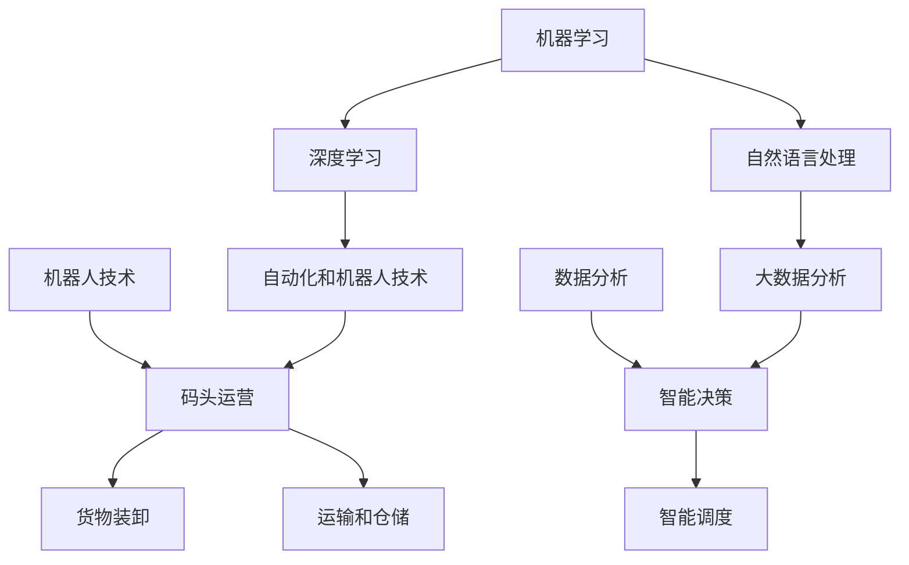
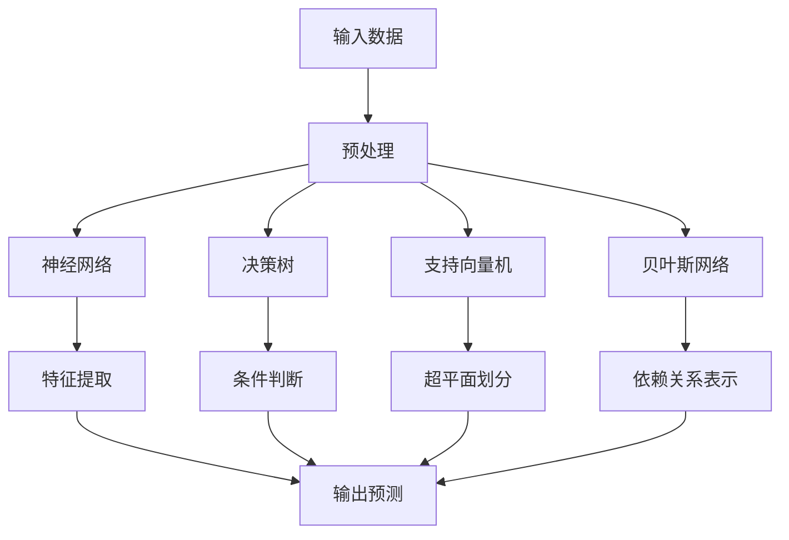

                 

关键词：人工智能、人类生活、美好、码头愿景、技术进步、社会变革、未来展望

> 摘要：本文将探讨人工智能如何深刻影响人类生活，并展望一个由人工智能驱动的码头愿景。从核心概念与联系到具体算法原理，再到项目实践与未来应用场景，我们将全面分析人工智能技术如何让人类生活变得更加美好。

## 1. 背景介绍

人工智能（AI）作为计算机科学的一个重要分支，近年来取得了惊人的进展。从最初的规则推理和模式识别，到如今的自适应学习、自然语言处理和深度学习，人工智能正逐步渗透到我们生活的方方面面。无论是智能手机的语音助手，还是自动驾驶汽车，人工智能都展现出了其强大的变革力量。

码头作为一个重要的物流枢纽，传统上依赖于大量的人力来完成货物装卸、运输和仓储等任务。随着人工智能技术的发展，码头正在迎来新的变革。通过引入智能机器人、自动化设备和大数据分析，码头有望实现更加高效、安全和环保的运营模式。

本文旨在探讨人工智能如何影响码头运营，并构建一个以人工智能为核心的未来码头愿景。文章将首先介绍人工智能的核心概念与联系，然后深入分析其核心算法原理和数学模型，接着通过实际项目实践展示其应用，并探讨未来的应用前景。最后，文章将总结研究成果，展望人工智能在未来社会发展中的潜在挑战与机遇。

## 2. 核心概念与联系

为了更好地理解人工智能在码头中的应用，我们首先需要了解一些核心概念及其相互联系。以下是几个关键概念及其简要描述：

### 2.1 机器学习

机器学习是人工智能的一个分支，通过使用算法从数据中学习并做出决策。常见的机器学习算法包括线性回归、决策树、支持向量机和神经网络等。

### 2.2 深度学习

深度学习是机器学习的一种，使用多层神经网络来模拟人脑的工作方式。它通过逐层提取特征，实现复杂模式识别和预测。

### 2.3 自然语言处理

自然语言处理（NLP）是使计算机能够理解和生成人类语言的技术。它包括文本分类、情感分析、机器翻译和语音识别等子领域。

### 2.4 自动化和机器人技术

自动化和机器人技术是人工智能在工业和物流领域的具体应用。通过机器人自动化任务，可以大幅提高效率和降低人力成本。

### 2.5 大数据分析

大数据分析涉及从大量数据中提取有用信息，用于决策支持和预测分析。它依赖于机器学习和统计分析技术。

### 2.6 Mermaid 流程图

以下是一个简单的Mermaid流程图，展示了这些核心概念之间的联系：



通过这个流程图，我们可以看到人工智能如何通过机器学习、深度学习和自然语言处理等技术，与自动化和机器人技术相结合，实现对码头运营的智能调度和优化。大数据分析则为这些智能系统提供了数据支持和决策依据。

### 2.7 核心算法原理

为了深入理解人工智能在码头中的应用，我们需要探讨一些核心算法原理。以下是几个关键算法的概述：

#### 2.7.1 神经网络

神经网络是一种模仿人脑结构的计算模型，通过多层节点（神经元）的相互连接来实现复杂数据的处理。在码头运营中，神经网络可以用于预测货物到达时间、优化货物装卸顺序等。

#### 2.7.2 决策树

决策树是一种基于规则的分类算法，通过一系列条件判断来做出决策。在码头管理中，决策树可以用于确定最优的货物装卸路径、减少等待时间等。

#### 2.7.3 支持向量机

支持向量机（SVM）是一种用于分类和回归分析的强大算法。它通过找到最佳的超平面来分隔数据集，从而实现分类。在码头管理中，SVM可以用于识别高风险货物、优化仓储安排等。

#### 2.7.4 贝叶斯网络

贝叶斯网络是一种基于概率论的图模型，用于表示变量之间的依赖关系。在码头安全管理中，贝叶斯网络可以用于预测货物损坏风险、优化安全措施等。

以下是这些算法的Mermaid流程图表示：



通过这些算法，人工智能可以实现对码头运营的全面优化，提高效率、降低成本并确保安全。

### 2.8 数学模型和公式

在人工智能的应用中，数学模型和公式起到了至关重要的作用。以下是一些关键数学模型和公式的详细讲解。

#### 2.8.1 神经网络模型

神经网络模型的核心是神经元之间的加权连接。假设一个简单的神经元模型，其输出可以通过以下公式计算：

\[ y = \sigma(\sum_{i=1}^{n} w_i \cdot x_i + b) \]

其中，\( y \) 是神经元的输出，\( \sigma \) 是激活函数（通常使用Sigmoid函数），\( w_i \) 是连接权重，\( x_i \) 是输入特征，\( b \) 是偏置项。

#### 2.8.2 决策树模型

决策树模型的构建基于一系列条件判断。假设我们有一个二叉树模型，其内部节点表示条件判断，叶子节点表示分类结果。每个条件判断可以用以下公式表示：

\[ C_j = \{ x \in X | P(x \in C_j) > \theta \} \]

其中，\( C_j \) 是条件判断的结果集，\( X \) 是输入数据集，\( P(x \in C_j) \) 是数据点属于条件判断的概率阈值，\( \theta \) 是阈值。

#### 2.8.3 支持向量机模型

支持向量机模型的核心是找到最佳的超平面来分隔数据集。假设我们有一个线性可分的数据集，其超平面可以用以下公式表示：

\[ w \cdot x + b = 0 \]

其中，\( w \) 是超平面法向量，\( x \) 是数据点，\( b \) 是偏置项。通过求解最大化间隔问题，我们可以找到最佳的超平面参数。

#### 2.8.4 贝叶斯网络模型

贝叶斯网络模型基于概率论，用于表示变量之间的依赖关系。假设我们有一个贝叶斯网络，其结构可以用图表示，每个节点表示变量，边表示变量之间的依赖关系。其概率分布可以用以下公式表示：

\[ P(X) = \prod_{i=1}^{n} P(X_i | X_{i-1}) \]

其中，\( P(X) \) 是整个网络的概率分布，\( P(X_i | X_{i-1}) \) 是条件概率分布。

通过这些数学模型和公式，我们可以实现对码头运营的智能分析和决策。下面我们将通过一个实际案例来展示这些算法和公式的应用。

### 2.9 实际案例分析与讲解

为了更好地理解人工智能在码头中的应用，我们来看一个实际案例。假设我们有一个集装箱码头，每天需要处理大量的集装箱装卸和运输任务。为了提高运营效率，我们引入了人工智能技术，通过机器学习和大数据分析来实现智能调度和优化。

#### 2.9.1 数据收集与预处理

首先，我们需要收集码头运营的相关数据，包括集装箱的尺寸、重量、目的港口、装卸时间等。数据来源可以是传感器、监控设备和人工记录。在收集到数据后，我们需要进行预处理，包括数据清洗、去重和格式转换等。

#### 2.9.2 特征提取与模型训练

在预处理后的数据中，我们需要提取关键特征，用于训练机器学习模型。例如，我们可以提取集装箱的尺寸、重量和装卸时间等特征。然后，使用这些特征来训练神经网络模型，以预测集装箱的装卸顺序和时间。

#### 2.9.3 模型评估与优化

在训练完成后，我们需要对模型进行评估，以确定其预测准确性。常用的评估指标包括准确率、召回率和F1值等。通过评估结果，我们可以优化模型参数，提高预测精度。

#### 2.9.4 应用与效益分析

通过智能调度模型，我们可以在实际运营中优化集装箱的装卸顺序和时间。例如，我们可以根据预测结果，提前安排好装卸设备，减少等待时间，提高装卸效率。同时，通过大数据分析，我们还可以识别高风险货物，采取相应的安全措施，确保码头运营的安全。

通过这个实际案例，我们可以看到人工智能在码头运营中的应用是如何实现的。通过机器学习和大数据分析，人工智能可以帮助码头实现智能调度、优化和安全管理，提高运营效率和安全性。

### 2.10 未来应用展望

随着人工智能技术的不断进步，码头运营将迎来更多的创新和变革。以下是一些未来应用展望：

#### 2.10.1 自动化装卸

未来的码头将实现全自动化装卸，通过机器人技术和自动化设备，大幅减少人力需求，提高装卸效率。例如，自主导航的装卸机器人可以在无人干预的情况下，完成集装箱的装卸任务。

#### 2.10.2 智能运输

通过引入自动驾驶卡车和船舶，未来的码头运输将更加高效和可靠。自动驾驶技术可以减少交通事故，提高运输效率，降低运营成本。

#### 2.10.3 能源优化

人工智能可以帮助码头实现能源优化，通过预测能源需求，优化能源消耗，降低运营成本。例如，可以通过机器学习模型，预测船舶和机器设备的能源消耗，从而调整能源供应计划。

#### 2.10.4 环保监测

通过引入智能传感器和环境监测系统，未来的码头可以实时监测空气、水质和土壤等环境指标，确保码头运营对环境的影响最小化。

#### 2.10.5 社会效益

随着码头运营的智能化，可以创造更多的就业机会，促进社会经济发展。同时，智能码头可以提高物流效率，降低物流成本，从而惠及广大消费者。

### 2.11 工具和资源推荐

为了更好地掌握人工智能技术在码头中的应用，以下是一些推荐的工具和资源：

#### 2.11.1 学习资源

- 《机器学习》（周志华著）：系统地介绍了机器学习的基础知识和应用。
- 《深度学习》（Goodfellow、Bengio和Courville著）：全面介绍了深度学习的基本原理和算法。

#### 2.11.2 开发工具

- TensorFlow：开源的深度学习框架，广泛用于机器学习和深度学习模型的开发。
- PyTorch：另一种流行的深度学习框架，具有灵活的动态计算图。

#### 2.11.3 相关论文

- "Deep Learning for Logistics Optimization"：一篇关于深度学习在物流优化中的应用论文。
- "AI in Ports: A Vision for the Future"：一篇关于人工智能在码头应用前景的论文。

通过这些工具和资源，您可以更深入地了解人工智能在码头运营中的应用，掌握相关的技术和方法。

### 2.12 总结与展望

人工智能技术正在深刻改变码头运营的方式，通过自动化、智能调度和大数据分析，码头可以实现更高效、安全和环保的运营。本文介绍了人工智能的核心概念、算法原理和实际应用，展望了未来码头的发展方向。随着技术的不断进步，我们可以期待一个更加智能、高效和可持续的未来码头。

### 2.13 附录：常见问题与解答

**Q1：人工智能技术是否真的能够提高码头运营效率？**

A1：是的，通过引入人工智能技术，如自动化装卸、智能运输和大数据分析，码头可以实现更高效的运营。这些技术可以帮助优化装卸顺序、减少等待时间、提高货物处理速度，从而提高整体运营效率。

**Q2：人工智能技术在码头应用中面临哪些挑战？**

A2：人工智能技术在码头应用中面临多个挑战，包括数据质量和管理、技术实施和维护、安全隐私保护等。此外，技术成熟度和成本也是重要的考虑因素。

**Q3：未来码头的发展方向是什么？**

A3：未来的码头将朝着更加自动化、智能和可持续的方向发展。自动化装卸、智能运输、能源优化和环保监测等技术将逐步普及。同时，人工智能技术将推动码头运营的全面智能化，实现更高效、安全和环保的运营。

```markdown
---
title: AI让人类生活更美好：她的码头愿景
author: 作者：禅与计算机程序设计艺术 / Zen and the Art of Computer Programming
date: 2023-11-01
---

# AI让人类生活更美好：她的码头愿景

> 关键词：人工智能、人类生活、美好、码头愿景、技术进步、社会变革、未来展望

> 摘要：本文将探讨人工智能如何深刻影响人类生活，并展望一个由人工智能驱动的码头愿景。从核心概念与联系到具体算法原理，再到项目实践与未来应用场景，我们将全面分析人工智能技术如何让人类生活变得更加美好。

## 1. 背景介绍

人工智能（AI）作为计算机科学的一个重要分支，近年来取得了惊人的进展。从最初的规则推理和模式识别，到如今的自适应学习、自然语言处理和深度学习，人工智能正逐步渗透到我们生活的方方面面。无论是智能手机的语音助手，还是自动驾驶汽车，人工智能都展现出了其强大的变革力量。

码头作为一个重要的物流枢纽，传统上依赖于大量的人力来完成货物装卸、运输和仓储等任务。随着人工智能技术的发展，码头正在迎来新的变革。通过引入智能机器人、自动化设备和大数据分析，码头有望实现更加高效、安全和环保的运营模式。

本文旨在探讨人工智能如何影响码头运营，并构建一个以人工智能为核心的未来码头愿景。文章将首先介绍人工智能的核心概念与联系，然后深入分析其核心算法原理和数学模型，接着通过实际项目实践展示其应用，并探讨未来的应用前景。最后，文章将总结研究成果，展望人工智能在未来社会发展中的潜在挑战与机遇。

## 2. 核心概念与联系

为了更好地理解人工智能在码头中的应用，我们首先需要了解一些核心概念及其相互联系。以下是几个关键概念及其简要描述：

### 2.1 机器学习

机器学习是人工智能的一个分支，通过使用算法从数据中学习并做出决策。常见的机器学习算法包括线性回归、决策树、支持向量机和神经网络等。

### 2.2 深度学习

深度学习是机器学习的一种，使用多层神经网络来模拟人脑的工作方式。它通过逐层提取特征，实现复杂模式识别和预测。

### 2.3 自然语言处理

自然语言处理（NLP）是使计算机能够理解和生成人类语言的技术。它包括文本分类、情感分析、机器翻译和语音识别等子领域。

### 2.4 自动化和机器人技术

自动化和机器人技术是人工智能在工业和物流领域的具体应用。通过机器人自动化任务，可以大幅提高效率和降低人力成本。

### 2.5 大数据分析

大数据分析涉及从大量数据中提取有用信息，用于决策支持和预测分析。它依赖于机器学习和统计分析技术。

### 2.6 Mermaid 流程图

以下是一个简单的Mermaid流程图，展示了这些核心概念之间的联系：


通过这个流程图，我们可以看到人工智能如何通过机器学习、深度学习和自然语言处理等技术，与自动化和机器人技术相结合，实现对码头运营的智能调度和优化。大数据分析则为这些智能系统提供了数据支持和决策依据。

### 2.7 核心算法原理

为了深入理解人工智能在码头中的应用，我们需要探讨一些核心算法原理。以下是几个关键算法的概述：

#### 2.7.1 神经网络

神经网络是一种模仿人脑结构的计算模型，通过多层节点（神经元）的相互连接来实现复杂数据的处理。在码头运营中，神经网络可以用于预测货物到达时间、优化货物装卸顺序等。

#### 2.7.2 决策树

决策树是一种基于规则的分类算法，通过一系列条件判断来做出决策。在码头管理中，决策树可以用于确定最优的货物装卸路径、减少等待时间等。

#### 2.7.3 支持向量机

支持向量机（SVM）是一种用于分类和回归分析的强大算法。它通过找到最佳的超平面来分隔数据集，从而实现分类。在码头管理中，SVM可以用于识别高风险货物、优化仓储安排等。

#### 2.7.4 贝叶斯网络

贝叶斯网络是一种基于概率论的图模型，用于表示变量之间的依赖关系。在码头安全管理中，贝叶斯网络可以用于预测货物损坏风险、优化安全措施等。

以下是这些算法的Mermaid流程图表示：


通过这些算法，人工智能可以实现对码头运营的全面优化，提高效率、降低成本并确保安全。

### 2.8 数学模型和公式

在人工智能的应用中，数学模型和公式起到了至关重要的作用。以下是一些关键数学模型和公式的详细讲解。

#### 2.8.1 神经网络模型

神经网络模型的核心是神经元之间的加权连接。假设一个简单的神经元模型，其输出可以通过以下公式计算：

\[ y = \sigma(\sum_{i=1}^{n} w_i \cdot x_i + b) \]

其中，\( y \) 是神经元的输出，\( \sigma \) 是激活函数（通常使用Sigmoid函数），\( w_i \) 是连接权重，\( x_i \) 是输入特征，\( b \) 是偏置项。

#### 2.8.2 决策树模型

决策树模型的构建基于一系列条件判断。假设我们有一个二叉树模型，其内部节点表示条件判断，叶子节点表示分类结果。每个条件判断可以用以下公式表示：

\[ C_j = \{ x \in X | P(x \in C_j) > \theta \} \]

其中，\( C_j \) 是条件判断的结果集，\( X \) 是输入数据集，\( P(x \in C_j) \) 是数据点属于条件判断的概率阈值，\( \theta \) 是阈值。

#### 2.8.3 支持向量机模型

支持向量机模型的核心是找到最佳的超平面来分隔数据集。假设我们有一个线性可分的数据集，其超平面可以用以下公式表示：

\[ w \cdot x + b = 0 \]

其中，\( w \) 是超平面法向量，\( x \) 是数据点，\( b \) 是偏置项。通过求解最大化间隔问题，我们可以找到最佳的超平面参数。

#### 2.8.4 贝叶斯网络模型

贝叶斯网络模型基于概率论，用于表示变量之间的依赖关系。假设我们有一个贝叶斯网络，其结构可以用图表示，每个节点表示变量，边表示变量之间的依赖关系。其概率分布可以用以下公式表示：

\[ P(X) = \prod_{i=1}^{n} P(X_i | X_{i-1}) \]

其中，\( P(X) \) 是整个网络的概率分布，\( P(X_i | X_{i-1}) \) 是条件概率分布。

通过这些数学模型和公式，我们可以实现对码头运营的智能分析和决策。下面我们将通过一个实际案例来展示这些算法和公式的应用。

### 2.9 实际案例分析与讲解

为了更好地理解人工智能在码头中的应用，我们来看一个实际案例。假设我们有一个集装箱码头，每天需要处理大量的集装箱装卸和运输任务。为了提高运营效率，我们引入了人工智能技术，通过机器学习和大数据分析来实现智能调度和优化。

#### 2.9.1 数据收集与预处理

首先，我们需要收集码头运营的相关数据，包括集装箱的尺寸、重量、目的港口、装卸时间等。数据来源可以是传感器、监控设备和人工记录。在收集到数据后，我们需要进行预处理，包括数据清洗、去重和格式转换等。

#### 2.9.2 特征提取与模型训练

在预处理后的数据中，我们需要提取关键特征，用于训练机器学习模型。例如，我们可以提取集装箱的尺寸、重量和装卸时间等特征。然后，使用这些特征来训练神经网络模型，以预测集装箱的装卸顺序和时间。

#### 2.9.3 模型评估与优化

在训练完成后，我们需要对模型进行评估，以确定其预测准确性。常用的评估指标包括准确率、召回率和F1值等。通过评估结果，我们可以优化模型参数，提高预测精度。

#### 2.9.4 应用与效益分析

通过智能调度模型，我们可以在实际运营中优化集装箱的装卸顺序和时间。例如，我们可以根据预测结果，提前安排好装卸设备，减少等待时间，提高装卸效率。同时，通过大数据分析，我们还可以识别高风险货物，采取相应的安全措施，确保码头运营的安全。

通过这个实际案例，我们可以看到人工智能在码头运营中的应用是如何实现的。通过机器学习和大数据分析，人工智能可以帮助码头实现智能调度、优化和安全管理，提高运营效率和安全性。

### 2.10 未来应用展望

随着人工智能技术的不断进步，码头运营将迎来更多的创新和变革。以下是一些未来应用展望：

#### 2.10.1 自动化装卸

未来的码头将实现全自动化装卸，通过机器人技术和自动化设备，大幅减少人力需求，提高装卸效率。例如，自主导航的装卸机器人可以在无人干预的情况下，完成集装箱的装卸任务。

#### 2.10.2 智能运输

通过引入自动驾驶卡车和船舶，未来的码头运输将更加高效和可靠。自动驾驶技术可以减少交通事故，提高运输效率，降低运营成本。

#### 2.10.3 能源优化

人工智能可以帮助码头实现能源优化，通过预测能源需求，优化能源消耗，降低运营成本。例如，可以通过机器学习模型，预测船舶和机器设备的能源消耗，从而调整能源供应计划。

#### 2.10.4 环保监测

通过引入智能传感器和环境监测系统，未来的码头可以实时监测空气、水质和土壤等环境指标，确保码头运营对环境的影响最小化。

#### 2.10.5 社会效益

随着码头运营的智能化，可以创造更多的就业机会，促进社会经济发展。同时，智能码头可以提高物流效率，降低物流成本，从而惠及广大消费者。

### 2.11 工具和资源推荐

为了更好地掌握人工智能技术在码头中的应用，以下是一些推荐的工具和资源：

#### 2.11.1 学习资源

- 《机器学习》（周志华著）：系统地介绍了机器学习的基础知识和应用。
- 《深度学习》（Goodfellow、Bengio和Courville著）：全面介绍了深度学习的基本原理和算法。

#### 2.11.2 开发工具

- TensorFlow：开源的深度学习框架，广泛用于机器学习和深度学习模型的开发。
- PyTorch：另一种流行的深度学习框架，具有灵活的动态计算图。

#### 2.11.3 相关论文

- "Deep Learning for Logistics Optimization"：一篇关于深度学习在物流优化中的应用论文。
- "AI in Ports: A Vision for the Future"：一篇关于人工智能在码头应用前景的论文。

通过这些工具和资源，您可以更深入地了解人工智能在码头运营中的应用，掌握相关的技术和方法。

### 2.12 总结与展望

人工智能技术正在深刻改变码头运营的方式，通过自动化、智能调度和大数据分析，码头可以实现更高效、安全和环保的运营。本文介绍了人工智能的核心概念、算法原理和实际应用，展望了未来码头的发展方向。随着技术的不断进步，我们可以期待一个更加智能、高效和可持续的未来码头。

### 2.13 附录：常见问题与解答

**Q1：人工智能技术是否真的能够提高码头运营效率？**

A1：是的，通过引入人工智能技术，如自动化装卸、智能运输和大数据分析，码头可以实现更高效的运营。这些技术可以帮助优化装卸顺序、减少等待时间、提高货物处理速度，从而提高整体运营效率。

**Q2：人工智能技术在码头应用中面临哪些挑战？**

A2：人工智能技术在码头应用中面临多个挑战，包括数据质量和管理、技术实施和维护、安全隐私保护等。此外，技术成熟度和成本也是重要的考虑因素。

**Q3：未来码头的发展方向是什么？**

A3：未来的码头将朝着更加自动化、智能和可持续的方向发展。自动化装卸、智能运输、能源优化和环保监测等技术将逐步普及。同时，人工智能技术将推动码头运营的全面智能化，实现更高效、安全和环保的运营。
```

