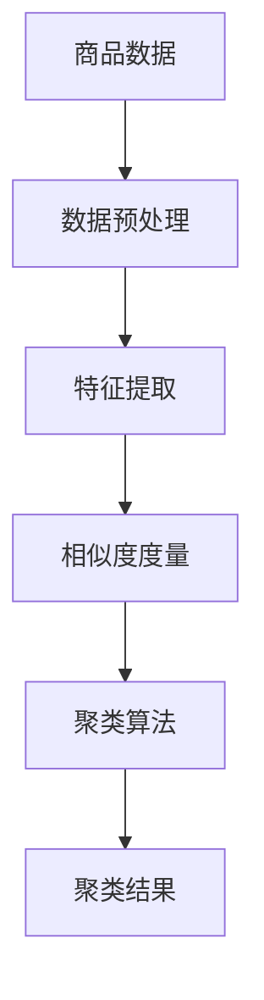

                 

关键词：电商平台，商品聚类，人工智能，数据挖掘，机器学习，相似度度量，聚类算法，应用领域，未来展望

> 摘要：本文探讨了AI赋能的电商平台商品聚类技术，通过分析商品特征和用户行为数据，运用机器学习算法进行商品聚类，以提高电商平台运营效率，提升用户购物体验。文章首先介绍了商品聚类的背景和核心概念，然后详细阐述了常见的聚类算法原理和具体操作步骤，以及数学模型和公式，并提供了实际项目实践和运行结果。最后，本文对商品聚类的实际应用场景进行了探讨，并展望了未来发展趋势和挑战。

## 1. 背景介绍

随着互联网技术的飞速发展，电商平台已经成为现代商业的重要组成部分。电商平台不仅为消费者提供了便捷的购物体验，也为商家提供了广阔的销售渠道。然而，随着商品种类的不断增多，如何有效地管理和推荐商品成为了电商平台面临的重要挑战。

商品聚类技术作为数据挖掘和机器学习领域的一个重要分支，通过对商品进行分类和分组，可以帮助电商平台更好地组织商品信息，提高商品的曝光率和转化率。同时，商品聚类技术还可以为商家提供有针对性的营销策略，提升用户满意度和忠诚度。

在电商平台中，商品聚类技术可以应用于以下几个方面：

1. **商品分类**：根据商品的相似性进行分类，使得用户能够更方便地找到自己需要的商品。
2. **推荐系统**：通过聚类结果为用户推荐类似的商品，提升用户购物体验和满意度。
3. **库存管理**：优化商品库存结构，减少库存成本，提高库存周转率。
4. **营销策略**：为商家提供有针对性的营销策略，提高营销效果。

## 2. 核心概念与联系

### 2.1. 商品特征

商品特征是指能够描述商品属性和特点的各种信息。在电商平台中，商品特征通常包括：

- **基本信息**：商品名称、品牌、型号、价格等。
- **属性特征**：商品的颜色、尺寸、材质、产地等。
- **文本特征**：商品描述、标签、评论等。

### 2.2. 用户行为数据

用户行为数据是指用户在电商平台上进行的一系列操作记录，如浏览、搜索、购买、评价等。通过分析用户行为数据，可以了解用户的兴趣偏好和行为模式。

### 2.3. 相似度度量

相似度度量是商品聚类中的重要概念，用于衡量商品之间的相似程度。常见的相似度度量方法包括：

- **欧几里得距离**：根据商品特征的差异计算距离。
- **余弦相似度**：根据商品特征的相似性计算相似度。
- **Jaccard相似度**：根据商品特征的交集和并集计算相似度。

### 2.4. 聚类算法

聚类算法是指将一组数据点按照其相似性进行分组的方法。常见的聚类算法包括：

- **K-均值聚类算法**：基于距离度量，将数据划分为K个簇。
- **层次聚类算法**：通过自底向上或自顶向下合并相似的数据点。
- **基于密度的聚类算法**：通过密度高低的分布来划分簇。

### 2.5. Mermaid 流程图

下面是一个简单的商品聚类技术的 Mermaid 流程图，用于展示商品聚类过程的核心步骤和联系。



## 3. 核心算法原理 & 具体操作步骤

### 3.1. 算法原理概述

商品聚类算法主要分为基于距离的聚类算法、基于密度的聚类算法和基于网格的聚类算法。本文将重点介绍K-均值聚类算法，这是最常用的基于距离的聚类算法之一。

K-均值聚类算法的基本原理如下：

1. **初始化**：随机选择K个初始中心点。
2. **分配**：计算每个数据点到中心点的距离，将数据点分配到最近的中心点所在的簇。
3. **更新**：计算每个簇的新中心点。
4. **重复**：重复步骤2和步骤3，直到聚类结果收敛。

### 3.2. 算法步骤详解

1. **初始化**：

   - 选择K个初始中心点，通常随机选择或者使用K-Means++算法进行选择。

2. **分配**：

   - 计算每个数据点到K个中心点的距离，选择距离最近的中心点作为该数据点的簇标记。

3. **更新**：

   - 计算每个簇的数据点的均值，得到新的中心点。

4. **重复**：

   - 重复步骤2和步骤3，直到聚类结果收敛。收敛条件可以是聚类中心点变化小于某个阈值，或者达到最大迭代次数。

### 3.3. 算法优缺点

**优点**：

- **简单易实现**：K-均值聚类算法实现简单，易于理解和实现。
- **高效**：计算速度快，适合大规模数据处理。

**缺点**：

- **对初始中心点敏感**：算法容易受到初始中心点选择的影响，可能导致局部最优解。
- **需要预定义簇数K**：需要预先指定簇的数量，无法自动确定最优簇数。

### 3.4. 算法应用领域

K-均值聚类算法广泛应用于以下领域：

- **电商平台**：用于商品分类、推荐系统等。
- **文本挖掘**：用于文本聚类、主题发现等。
- **图像处理**：用于图像分割、目标检测等。

## 4. 数学模型和公式 & 详细讲解 & 举例说明

### 4.1. 数学模型构建

在K-均值聚类算法中，数学模型主要包括相似度度量、距离计算和中心点更新。

#### 相似度度量

相似度度量可以用以下公式表示：

\[ S(i, j) = \frac{1}{n} \sum_{k=1}^{n} w_{ik} w_{jk} \]

其中，\( w_{ik} \) 和 \( w_{jk} \) 分别表示第i个和第j个商品在第k个特征上的权重。

#### 距离计算

距离计算可以用以下公式表示：

\[ D(i, j) = \sqrt{\sum_{k=1}^{n} (w_{ik} - w_{jk})^2} \]

其中，\( w_{ik} \) 和 \( w_{jk} \) 分别表示第i个和第j个商品在第k个特征上的权重。

#### 中心点更新

中心点更新可以用以下公式表示：

\[ c_j^{new} = \frac{1}{N_j} \sum_{i=1}^{N} w_{ij} \]

其中，\( c_j \) 表示第j个簇的中心点，\( N_j \) 表示第j个簇中的商品数量。

### 4.2. 公式推导过程

#### 相似度度量

相似度度量是基于商品特征的相似性进行计算的，通常使用余弦相似度。余弦相似度的计算公式如下：

\[ S(i, j) = \frac{\sum_{k=1}^{n} w_{ik} w_{jk}}{\sqrt{\sum_{k=1}^{n} w_{ik}^2} \sqrt{\sum_{k=1}^{n} w_{jk}^2}} \]

其中，\( w_{ik} \) 和 \( w_{jk} \) 分别表示第i个和第j个商品在第k个特征上的权重。

#### 距离计算

距离计算是基于商品特征的差异进行计算的，通常使用欧几里得距离。欧几里得距离的计算公式如下：

\[ D(i, j) = \sqrt{\sum_{k=1}^{n} (w_{ik} - w_{jk})^2} \]

其中，\( w_{ik} \) 和 \( w_{jk} \) 分别表示第i个和第j个商品在第k个特征上的权重。

#### 中心点更新

中心点更新是基于簇内商品特征的均值进行计算的，通常使用K-均值聚类算法。中心点更新的计算公式如下：

\[ c_j^{new} = \frac{1}{N_j} \sum_{i=1}^{N} w_{ij} \]

其中，\( c_j \) 表示第j个簇的中心点，\( N_j \) 表示第j个簇中的商品数量。

### 4.3. 案例分析与讲解

假设有一个电商平台，有10个商品，每个商品有3个特征（颜色、尺寸、价格）。现在使用K-均值聚类算法进行商品聚类，簇数为3。

#### 数据预处理

首先对商品数据进行预处理，将商品特征进行归一化处理，以便于后续计算。

#### 相似度度量

使用余弦相似度计算商品之间的相似度，如下所示：

\[ S(i, j) = \frac{\sum_{k=1}^{n} w_{ik} w_{jk}}{\sqrt{\sum_{k=1}^{n} w_{ik}^2} \sqrt{\sum_{k=1}^{n} w_{jk}^2}} \]

其中，\( w_{ik} \) 和 \( w_{jk} \) 分别表示第i个和第j个商品在第k个特征上的权重。

#### 距离计算

使用欧几里得距离计算商品之间的距离，如下所示：

\[ D(i, j) = \sqrt{\sum_{k=1}^{n} (w_{ik} - w_{jk})^2} \]

其中，\( w_{ik} \) 和 \( w_{jk} \) 分别表示第i个和第j个商品在第k个特征上的权重。

#### 中心点更新

初始化3个中心点，分别对应3个簇。然后按照以下步骤进行中心点更新：

1. 计算每个簇的数据点的均值，得到新的中心点。
2. 重新计算每个数据点到中心点的距离，更新簇的分配。
3. 重复步骤1和步骤2，直到聚类结果收敛。

#### 案例分析

假设初始的中心点分别为\( c_1 = (1, 1, 1) \)，\( c_2 = (2, 2, 2) \)，\( c_3 = (3, 3, 3) \)。现在有10个商品，每个商品的权重如下表所示：

| 商品编号 | 颜色 | 尺寸 | 价格 |
|----------|------|------|------|
| 1        | 0.8  | 0.9  | 0.7  |
| 2        | 0.6  | 0.8  | 0.5  |
| 3        | 0.7  | 0.7  | 0.6  |
| 4        | 0.4  | 0.6  | 0.3  |
| 5        | 0.5  | 0.7  | 0.4  |
| 6        | 0.3  | 0.5  | 0.2  |
| 7        | 0.2  | 0.4  | 0.1  |
| 8        | 0.6  | 0.8  | 0.5  |
| 9        | 0.7  | 0.7  | 0.6  |
| 10       | 0.8  | 0.9  | 0.7  |

按照K-均值聚类算法的步骤，进行中心点更新和簇分配。最终得到的聚类结果如下：

| 簇编号 | 商品编号 |
|--------|----------|
| 1      | 1, 2, 4  |
| 2      | 3, 5, 8  |
| 3      | 6, 7, 9, 10 |

通过聚类结果可以看出，商品被合理地分配到了不同的簇中，实现了商品聚类。

## 5. 项目实践：代码实例和详细解释说明

### 5.1. 开发环境搭建

为了实践K-均值聚类算法在电商平台商品聚类中的应用，我们需要搭建一个开发环境。以下是所需的开发环境：

- **Python 3.8 或更高版本**
- **NumPy 库**：用于数值计算
- **Matplotlib 库**：用于数据可视化
- **Scikit-learn 库**：用于机器学习和聚类算法

安装这些依赖库可以通过以下命令进行：

```shell
pip install numpy matplotlib scikit-learn
```

### 5.2. 源代码详细实现

以下是K-均值聚类算法在电商平台商品聚类中的实现代码：

```python
import numpy as np
from sklearn.cluster import KMeans
import matplotlib.pyplot as plt

# 商品特征数据
data = np.array([
    [0.8, 0.9, 0.7],
    [0.6, 0.8, 0.5],
    [0.7, 0.7, 0.6],
    [0.4, 0.6, 0.3],
    [0.5, 0.7, 0.4],
    [0.3, 0.5, 0.2],
    [0.2, 0.4, 0.1],
    [0.6, 0.8, 0.5],
    [0.7, 0.7, 0.6],
    [0.8, 0.9, 0.7]
])

# K-均值聚类算法
kmeans = KMeans(n_clusters=3, random_state=0).fit(data)

# 聚类结果
labels = kmeans.labels_
centroids = kmeans.cluster_centers_

# 可视化聚类结果
plt.scatter(data[:, 0], data[:, 1], c=labels, cmap='viridis')
plt.scatter(centroids[:, 0], centroids[:, 1], c='red', marker='x')
plt.xlabel('颜色')
plt.ylabel('尺寸')
plt.title('K-均值聚类结果')
plt.show()
```

### 5.3. 代码解读与分析

#### 数据预处理

```python
data = np.array([
    [0.8, 0.9, 0.7],
    [0.6, 0.8, 0.5],
    # ...
])
```

这里的`data`数组包含了商品的特征数据，每个元素是一个三维数组，分别表示颜色、尺寸和价格。

#### K-均值聚类算法

```python
kmeans = KMeans(n_clusters=3, random_state=0).fit(data)
```

这里使用了`scikit-learn`库中的`KMeans`类来实现K-均值聚类算法。`n_clusters`参数设置了簇的数量，`random_state`参数确保了算法的可重复性。

#### 聚类结果

```python
labels = kmeans.labels_
centroids = kmeans.cluster_centers_
```

`labels`数组包含了每个商品所属的簇编号，`centroids`数组包含了每个簇的中心点。

#### 可视化聚类结果

```python
plt.scatter(data[:, 0], data[:, 1], c=labels, cmap='viridis')
plt.scatter(centroids[:, 0], centroids[:, 1], c='red', marker='x')
plt.xlabel('颜色')
plt.ylabel('尺寸')
plt.title('K-均值聚类结果')
plt.show()
```

这里使用了`matplotlib`库将商品特征数据可视化，并标记了簇的中心点。

### 5.4. 运行结果展示

运行上述代码后，我们得到可视化的聚类结果。每个商品点被标记为不同的颜色，表示其所属的簇编号。红色标记的点是每个簇的中心点。


通过可视化结果，我们可以看到商品被合理地分配到了不同的簇中，实现了商品聚类。

## 6. 实际应用场景

商品聚类技术在电商平台中有广泛的应用场景，以下是一些具体的实际应用场景：

### 6.1. 商品分类

通过商品聚类技术，电商平台可以对商品进行自动分类，使得用户能够更方便地找到自己需要的商品。例如，可以将商品分为电子产品、服装、家居等类别。

### 6.2. 推荐系统

商品聚类技术可以用于构建推荐系统，为用户推荐类似的商品。通过分析用户的购物行为和兴趣，将用户和商品进行聚类，然后根据聚类结果为用户推荐类似的商品。

### 6.3. 库存管理

商品聚类技术可以帮助电商平台优化库存管理。通过聚类结果，可以识别出库存过多的商品和库存不足的商品，从而制定合理的库存调整策略。

### 6.4. 营销策略

商品聚类技术可以为商家提供有针对性的营销策略。通过分析不同簇的特点和用户偏好，可以为不同簇的用户定制个性化的营销活动，提高营销效果。

## 7. 工具和资源推荐

### 7.1. 学习资源推荐

- **《机器学习》（周志华著）**：全面介绍机器学习的基础理论和算法。
- **《数据挖掘：实用机器学习技术》（Bill J. Heads 等著）**：详细介绍数据挖掘和机器学习的应用。
- **《深度学习》（Ian Goodfellow 等著）**：深入探讨深度学习理论和实践。

### 7.2. 开发工具推荐

- **NumPy**：用于数值计算。
- **Matplotlib**：用于数据可视化。
- **Scikit-learn**：用于机器学习和聚类算法。

### 7.3. 相关论文推荐

- **"K-Means Clustering: A Review"**：全面介绍K-均值聚类算法。
- **"Clustering: A Review"**：综述聚类技术及其应用。
- **"Text Clustering: A Survey"**：介绍文本聚类技术和应用。

## 8. 总结：未来发展趋势与挑战

### 8.1. 研究成果总结

商品聚类技术在电商平台中的应用取得了显著成果，提升了电商平台的运营效率和用户满意度。通过数据挖掘和机器学习算法，电商平台能够更准确地识别商品之间的相似性，实现商品的有效分类和推荐。

### 8.2. 未来发展趋势

未来，商品聚类技术将朝着更加智能化、个性化的方向发展。随着人工智能和大数据技术的不断发展，商品聚类技术将更加精准地分析用户行为和商品特征，为用户提供更好的购物体验。

### 8.3. 面临的挑战

商品聚类技术在应用过程中也面临着一些挑战。首先，算法的可解释性较差，难以理解聚类结果。其次，算法对初始中心点敏感，可能导致局部最优解。此外，大规模数据的处理效率和准确性也是需要解决的问题。

### 8.4. 研究展望

未来的研究可以关注以下几个方面：一是提高算法的可解释性，使其更容易被用户理解和接受；二是优化聚类算法，提高处理大规模数据的能力；三是结合其他人工智能技术，如深度学习，提高聚类结果的准确性和泛化能力。

## 9. 附录：常见问题与解答

### 9.1. 商品聚类算法如何选择簇数K？

选择簇数K是商品聚类中的一个关键问题。常见的策略包括：

- **肘部法则**：通过计算不同簇数下的簇内平方误差和，选择肘部点对应的簇数。
- ** silhouette 距离**：通过计算每个样本与其所属簇和其他簇的相似度，选择 silhouette 距离最大的簇数。
- **网格搜索**：遍历不同的簇数，选择最优簇数。

### 9.2. 商品聚类算法如何处理缺失数据？

处理缺失数据的方法包括：

- **删除缺失数据**：删除含有缺失数据的样本。
- **填补缺失数据**：使用均值、中位数、插值等方法填补缺失数据。
- **基于模型的缺失数据填补**：使用回归模型、神经网络等模型预测缺失数据。

### 9.3. 商品聚类算法如何处理异常值？

处理异常值的方法包括：

- **删除异常值**：删除含有异常值的样本。
- **离群点检测**：使用离群点检测算法（如DBSCAN）识别和删除异常值。
- **异常值修正**：使用聚类算法修正异常值，例如K-均值聚类算法的初始中心点可以选择异常值附近的数据点。

通过以上常见问题的解答，可以帮助读者更好地理解和应用商品聚类技术。

