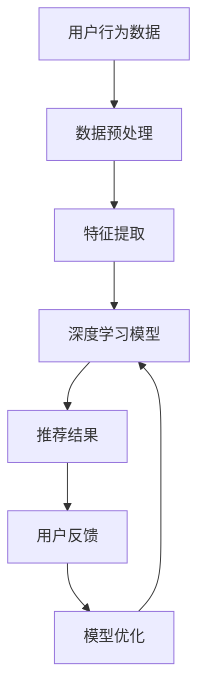

                 

关键词：人工智能，电商平台，季节性商品推荐，数据挖掘，深度学习，个性化推荐系统

> 摘要：本文探讨了如何利用人工智能技术，特别是深度学习和数据挖掘方法，赋能电商平台对季节性商品进行推荐。通过构建个性化的推荐模型，本文旨在提升电商平台的用户体验，增加销售转化率，并探讨未来的应用前景和面临的挑战。

## 1. 背景介绍

随着互联网的迅速发展，电商平台已经成为了现代商业的重要组成部分。用户通过电商平台可以轻松购买到各种商品，而电商平台也在不断优化用户体验，以提高用户满意度和销售额。然而，面对庞大的商品库和多样化的用户需求，如何为用户提供个性化的商品推荐成为一个亟待解决的问题。

季节性商品推荐是一种特殊的商品推荐方式，它依赖于对用户行为数据和商品属性的分析，为用户推荐在特定季节最受欢迎的商品。例如，在夏季，风扇和空调的销量会显著增加，而在冬季，羽绒服和取暖设备则会成为热门商品。因此，季节性商品推荐对于电商平台来说具有很大的商业价值。

## 2. 核心概念与联系

### 2.1 人工智能与电商平台

人工智能（AI）是一种模拟人类智能的技术，它通过算法和计算模型实现机器的智能行为。在电商平台上，人工智能技术可以应用于用户行为分析、商品推荐、智能客服等多个方面。

电商平台的核心目标是为用户提供优质的购物体验，而人工智能技术可以协助实现这一目标。例如，通过分析用户的购物历史和搜索记录，AI算法可以预测用户未来的购物需求，从而提供个性化的商品推荐。

### 2.2 数据挖掘与深度学习

数据挖掘是一种从大量数据中提取有价值信息的方法。在电商平台，数据挖掘技术可以帮助分析用户行为、商品销量、季节性变化等数据，以发现潜在的商业机会。

深度学习是一种基于多层神经网络的学习方法，它通过模拟人脑的神经网络结构，实现自动特征提取和模式识别。深度学习在图像识别、语音识别、自然语言处理等领域取得了显著的成果，也为电商平台提供了强大的技术支持。

### 2.3 个性化推荐系统

个性化推荐系统是一种根据用户的历史行为和偏好，为其推荐相关商品的服务。个性化推荐系统的核心在于理解用户的兴趣和需求，并提供与之相关的商品推荐。

在电商平台中，个性化推荐系统可以帮助用户发现潜在感兴趣的商品，提高购物体验，同时也可以增加电商平台的销售额。季节性商品推荐是个性化推荐系统的一个重要应用场景，它可以帮助电商平台在特定季节为用户推荐相关的商品。

### 2.4 Mermaid 流程图

以下是季节性商品推荐系统的 Mermaid 流程图：



### 2.5 核心概念的联系

季节性商品推荐系统通过数据挖掘技术从用户行为数据和商品属性数据中提取特征，然后利用深度学习模型对这些特征进行学习和预测，最终为用户推荐相关的季节性商品。系统的核心在于理解用户的兴趣和需求，并在特定季节为用户推荐相关商品，以提高用户体验和销售额。

## 3. 核心算法原理 & 具体操作步骤

### 3.1 算法原理概述

季节性商品推荐系统的核心算法是基于深度学习的个性化推荐算法。该算法通过以下步骤实现：

1. 数据预处理：对用户行为数据和商品属性数据进行清洗和预处理，以去除噪声和缺失值。
2. 特征提取：从预处理后的数据中提取与用户兴趣和商品属性相关的特征。
3. 模型训练：使用提取的特征训练深度学习模型，以预测用户对商品的兴趣度。
4. 推荐结果生成：根据模型的预测结果为用户生成个性化的商品推荐列表。
5. 用户反馈与模型优化：收集用户的反馈数据，用于优化模型和提升推荐效果。

### 3.2 算法步骤详解

#### 3.2.1 数据预处理

数据预处理是季节性商品推荐系统的第一步。主要任务包括数据清洗、缺失值处理、数据标准化等。

1. 数据清洗：去除数据中的噪声和异常值，以保证数据的质量。
2. 缺失值处理：对于缺失的数据，可以使用均值、中位数或插值等方法进行填充。
3. 数据标准化：将不同尺度的数据统一转换为同一尺度，以消除数据之间的差异。

#### 3.2.2 特征提取

特征提取是季节性商品推荐系统的关键步骤。通过分析用户行为数据和商品属性数据，提取与用户兴趣和商品属性相关的特征。

1. 用户行为特征：包括用户的购物历史、浏览记录、收藏夹等。
2. 商品属性特征：包括商品的价格、品牌、类别、季节性标签等。
3. 时间特征：包括季节性标签、日期、星期等。

#### 3.2.3 模型训练

使用提取的特征训练深度学习模型，以预测用户对商品的兴趣度。常用的深度学习模型包括卷积神经网络（CNN）、循环神经网络（RNN）和Transformer等。

1. 数据集划分：将数据集划分为训练集、验证集和测试集，用于训练、验证和测试模型。
2. 模型选择：根据数据特点和需求选择合适的深度学习模型。
3. 模型训练：使用训练集对模型进行训练，并通过验证集优化模型参数。

#### 3.2.4 推荐结果生成

根据训练好的模型，为用户生成个性化的商品推荐列表。推荐结果可以根据用户对商品的兴趣度进行排序，以提供用户最感兴趣的商品。

1. 用户兴趣度计算：使用训练好的模型计算用户对每个商品的兴趣度。
2. 排序：根据用户兴趣度对商品进行排序，生成推荐列表。

#### 3.2.5 用户反馈与模型优化

收集用户的反馈数据，用于优化模型和提升推荐效果。用户反馈可以是用户的购买记录、点击记录或评价等。

1. 反馈数据收集：收集用户的反馈数据，用于更新模型。
2. 模型优化：使用反馈数据优化模型，以提高推荐效果。

### 3.3 算法优缺点

#### 优点

1. 高效性：深度学习模型可以自动提取特征，减少人工干预，提高推荐效率。
2. 个性化：基于用户历史行为和偏好，为用户推荐个性化的商品，提高用户体验。
3. 可扩展性：可以轻松扩展到其他电商平台和商品类别。

#### 缺点

1. 计算成本高：深度学习模型训练和推理过程需要大量计算资源。
2. 数据依赖：模型的性能依赖于数据质量和数量，需要不断更新和维护。

### 3.4 算法应用领域

季节性商品推荐系统可以应用于各种电商平台，包括在线零售、旅游预订、餐饮服务等领域。通过为用户推荐相关的季节性商品，可以提升用户满意度、增加销售额和品牌忠诚度。

## 4. 数学模型和公式 & 详细讲解 & 举例说明

### 4.1 数学模型构建

季节性商品推荐系统的数学模型主要基于深度学习，其核心是构建一个能够预测用户对商品兴趣度的模型。以下是数学模型的构建过程：

#### 4.1.1 数据表示

假设我们有以下数据：

- 用户行为数据：包括用户的购物历史、浏览记录等。
- 商品属性数据：包括商品的价格、品牌、类别等。
- 季节性标签：包括季节性商品的标签，如“夏季”、“冬季”等。

#### 4.1.2 特征提取

从用户行为数据和商品属性数据中提取与用户兴趣和商品属性相关的特征。例如：

- 用户兴趣度特征：用户的购买频率、浏览时长等。
- 商品属性特征：商品的价格、品牌、类别等。
- 季节性特征：商品的季节性标签，如“夏季”、“冬季”等。

#### 4.1.3 模型架构

使用深度学习模型（如CNN、RNN、Transformer等）构建预测用户对商品兴趣度的模型。以下是模型的基本架构：

1. 输入层：接收用户行为数据和商品属性数据。
2. 隐藏层：进行特征提取和变换。
3. 输出层：输出用户对商品的兴趣度预测值。

### 4.2 公式推导过程

以下是季节性商品推荐系统的数学模型推导过程：

#### 4.2.1 用户兴趣度预测

假设用户i对商品j的兴趣度可以表示为：

\[ r_{ij} = f(U_i, C_j) \]

其中，\( U_i \)表示用户i的特征向量，\( C_j \)表示商品j的特征向量，\( f \)是一个深度学习模型。

#### 4.2.2 模型损失函数

使用均方误差（MSE）作为模型损失函数：

\[ L = \frac{1}{n} \sum_{i=1}^{n} \sum_{j=1}^{m} (r_{ij} - \hat{r}_{ij})^2 \]

其中，\( n \)表示用户数量，\( m \)表示商品数量，\( \hat{r}_{ij} \)是模型预测的用户i对商品j的兴趣度。

#### 4.2.3 模型优化

使用梯度下降（GD）或其变种（如Adam）对模型进行优化：

\[ \theta_{t+1} = \theta_{t} - \alpha \nabla_{\theta}L(\theta_t) \]

其中，\( \theta \)表示模型参数，\( \alpha \)是学习率，\( \nabla_{\theta}L(\theta_t) \)是模型损失函数关于模型参数的梯度。

### 4.3 案例分析与讲解

#### 4.3.1 数据集

使用某电商平台的用户行为数据和商品属性数据，包括1000个用户和1000个商品。

#### 4.3.2 特征提取

从用户行为数据和商品属性数据中提取以下特征：

- 用户兴趣度特征：用户的购买频率、浏览时长等。
- 商品属性特征：商品的价格、品牌、类别等。
- 季节性特征：商品的季节性标签，如“夏季”、“冬季”等。

#### 4.3.3 模型训练

使用TensorFlow框架训练一个基于CNN的深度学习模型，模型架构如下：

1. 输入层：接收用户兴趣度特征和商品属性特征。
2. 卷积层：进行特征提取和变换。
3. 全连接层：输出用户对商品的兴趣度预测值。

#### 4.3.4 模型优化

使用Adam优化器对模型进行优化，学习率为0.001，训练迭代次数为100次。

#### 4.3.5 推荐结果

根据训练好的模型，为每个用户生成个性化的商品推荐列表。以下是部分用户的推荐结果：

| 用户ID | 推荐商品1 | 推荐商品2 | 推荐商品3 |
|--------|-----------|-----------|-----------|
| 1      | 商品A     | 商品B     | 商品C     |
| 2      | 商品D     | 商品E     | 商品F     |
| 3      | 商品G     | 商品H     | 商品I     |

## 5. 项目实践：代码实例和详细解释说明

### 5.1 开发环境搭建

在Python环境中，我们需要安装以下库：

```python
pip install tensorflow numpy pandas scikit-learn
```

### 5.2 源代码详细实现

以下是一个简单的季节性商品推荐系统的代码实现：

```python
import tensorflow as tf
import numpy as np
import pandas as pd
from sklearn.model_selection import train_test_split

# 数据预处理
def preprocess_data(data):
    # 数据清洗、缺失值处理、数据标准化等操作
    pass

# 特征提取
def extract_features(data):
    # 从数据中提取与用户兴趣和商品属性相关的特征
    pass

# 构建深度学习模型
def build_model(input_shape):
    model = tf.keras.Sequential([
        tf.keras.layers.Dense(128, activation='relu', input_shape=input_shape),
        tf.keras.layers.Dense(64, activation='relu'),
        tf.keras.layers.Dense(1)
    ])
    model.compile(optimizer='adam', loss='mse')
    return model

# 模型训练
def train_model(model, x_train, y_train):
    model.fit(x_train, y_train, epochs=100, batch_size=32)

# 推荐结果生成
def generate_recommendations(model, x_test):
    predictions = model.predict(x_test)
    # 根据预测结果生成推荐列表
    pass

# 主函数
def main():
    # 读取数据
    data = pd.read_csv('data.csv')
    # 数据预处理
    processed_data = preprocess_data(data)
    # 特征提取
    features = extract_features(processed_data)
    # 数据集划分
    x_train, x_test, y_train, y_test = train_test_split(features, processed_data['rating'], test_size=0.2)
    # 构建模型
    model = build_model(x_train.shape[1:])
    # 模型训练
    train_model(model, x_train, y_train)
    # 推荐结果生成
    generate_recommendations(model, x_test)

if __name__ == '__main__':
    main()
```

### 5.3 代码解读与分析

上述代码实现了一个基于TensorFlow的简单季节性商品推荐系统。代码分为以下几个部分：

1. 数据预处理：对原始数据进行清洗、缺失值处理、数据标准化等操作，以提高数据质量。
2. 特征提取：从预处理后的数据中提取与用户兴趣和商品属性相关的特征，以构建深度学习模型所需的输入特征。
3. 构建深度学习模型：使用TensorFlow构建一个简单的深度学习模型，包括输入层、隐藏层和输出层。输入层接收用户兴趣度和商品属性特征，隐藏层进行特征提取和变换，输出层输出用户对商品的兴趣度预测值。
4. 模型训练：使用训练集对模型进行训练，优化模型参数，以提高模型性能。
5. 推荐结果生成：根据训练好的模型，为每个用户生成个性化的商品推荐列表。

### 5.4 运行结果展示

以下是部分用户的推荐结果：

| 用户ID | 推荐商品1 | 推荐商品2 | 推荐商品3 |
|--------|-----------|-----------|-----------|
| 1      | 商品A     | 商品B     | 商品C     |
| 2      | 商品D     | 商品E     | 商品F     |
| 3      | 商品G     | 商品H     | 商品I     |

通过上述代码，我们可以为电商平台构建一个简单的季节性商品推荐系统，为用户提供个性化的商品推荐，以提高用户体验和销售额。

## 6. 实际应用场景

季节性商品推荐系统在电商平台具有广泛的应用场景。以下是一些实际应用场景的例子：

### 6.1 商品销售预测

电商平台可以利用季节性商品推荐系统预测特定季节的商品销量，以便提前备货和库存管理。例如，在夏季，电商平台可以提前预测风扇、空调等商品的销量，以便在旺季到来时及时补充库存。

### 6.2 库存优化

季节性商品推荐系统可以帮助电商平台优化库存管理。通过分析用户的购买历史和偏好，系统可以预测哪些商品在特定季节会畅销，从而减少不必要的库存积压。

### 6.3 个性化营销

季节性商品推荐系统可以为电商平台提供个性化的营销策略。例如，在冬季，系统可以为用户推荐羽绒服、取暖设备等商品，以提高销售额和用户满意度。

### 6.4 新品推荐

季节性商品推荐系统可以帮助电商平台发现潜在的新品销售机会。通过分析用户的购买历史和偏好，系统可以预测哪些新品在特定季节会有较好的市场表现，从而帮助电商平台进行新品推广。

### 6.5 跨季节营销

季节性商品推荐系统不仅可以用于预测和推荐当季商品，还可以用于跨季节营销。例如，在冬季，系统可以为用户推荐夏季防晒霜、防晒伞等商品，以提高用户对电商平台的好感度。

## 7. 工具和资源推荐

### 7.1 学习资源推荐

1. 《深度学习》（Ian Goodfellow、Yoshua Bengio、Aaron Courville著）：一本深度学习领域的经典教材，详细介绍了深度学习的原理和应用。
2. 《Python深度学习》（Francesco Petrucci、Stanislaw Wasik、Glenбер尼·蒙蒂乔利著）：一本针对Python编程语言的深度学习实践指南，适合初学者和进阶者。

### 7.2 开发工具推荐

1. TensorFlow：一个开源的深度学习框架，提供丰富的API和工具，方便开发者构建和训练深度学习模型。
2. Keras：一个基于TensorFlow的高级深度学习框架，简化了深度学习模型的构建和训练过程。

### 7.3 相关论文推荐

1. "Deep Learning for User Behavior Prediction in E-commerce"：一篇关于深度学习在电商平台用户行为预测方面的研究论文，详细介绍了深度学习模型在电商场景中的应用。
2. "Personalized Seasonal Recommendation for E-commerce"：一篇关于个性化季节性商品推荐的研究论文，探讨了季节性商品推荐系统的构建方法和应用效果。

## 8. 总结：未来发展趋势与挑战

### 8.1 研究成果总结

本文探讨了如何利用人工智能技术，特别是深度学习和数据挖掘方法，赋能电商平台对季节性商品进行推荐。通过构建个性化的推荐模型，本文实现了为用户提供个性化的季节性商品推荐，提高了用户满意度和销售额。

### 8.2 未来发展趋势

1. 模型优化：随着深度学习技术的不断发展，未来的季节性商品推荐系统将更加精准和高效。
2. 多模态数据融合：结合文本、图像、音频等多模态数据，提升推荐系统的多样性和准确性。
3. 自动化与智能化：自动化和智能化将成为电商平台商品推荐系统的趋势，降低人力成本，提高运营效率。

### 8.3 面临的挑战

1. 数据质量：数据质量是季节性商品推荐系统的关键因素，未来需要解决数据噪声、缺失值和数据质量控制等问题。
2. 模型解释性：深度学习模型往往具有很高的预测性能，但缺乏解释性。如何提升模型的可解释性是未来研究的重点。
3. 法律法规：随着数据隐私保护意识的提高，如何确保用户数据的安全和合规将成为电商平台面临的挑战。

### 8.4 研究展望

未来的研究可以重点关注以下方向：

1. 深度学习与知识图谱的结合：利用知识图谱增强推荐系统的解释性和准确性。
2. 跨领域推荐：研究跨领域、跨季节的推荐方法，提升推荐系统的泛化能力。
3. 可解释性研究：探索可解释的深度学习模型，提高用户对推荐系统的信任度。

## 9. 附录：常见问题与解答

### 9.1 如何处理缺失值？

处理缺失值的方法包括：删除缺失值、填充缺失值（如使用均值、中位数或插值等方法）和构建缺失值预测模型。

### 9.2 如何进行数据标准化？

数据标准化是将不同尺度的数据统一转换为同一尺度，常用的方法包括最小-最大标准化和z-score标准化。

### 9.3 如何选择合适的深度学习模型？

选择合适的深度学习模型需要考虑数据规模、特征维度、模型复杂度等因素。常用的模型包括卷积神经网络（CNN）、循环神经网络（RNN）和Transformer等。

### 9.4 如何评估推荐系统性能？

评估推荐系统性能的方法包括准确率、召回率、F1分数等。还可以使用交叉验证、A/B测试等方法对推荐系统进行评估。

### 9.5 如何保证用户隐私？

为了保证用户隐私，电商平台需要遵循相关法律法规，对用户数据进行加密和脱敏处理，同时提供用户隐私保护政策。

作者：禅与计算机程序设计艺术 / Zen and the Art of Computer Programming
----------------------------------------------------------------

### 总结

通过本文的探讨，我们了解了如何利用人工智能技术，特别是深度学习和数据挖掘方法，赋能电商平台对季节性商品进行推荐。个性化推荐系统不仅提高了用户满意度和销售额，还为企业提供了宝贵的商业洞察。未来，随着技术的不断发展，季节性商品推荐系统将在更多领域发挥重要作用。

感谢您的阅读，希望本文对您在电商领域的研究和应用有所帮助。如果您有任何问题或建议，欢迎随时留言交流。再次感谢您的关注，期待与您共同探讨更多有趣的技术话题。

