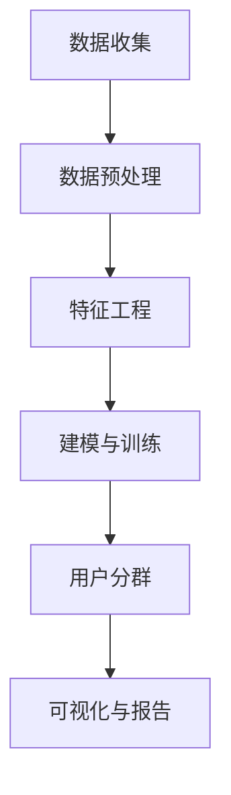

                 

关键词：人工智能、电商、用户分群、自动化、算法、机器学习、数据挖掘、推荐系统

> 摘要：本文旨在探讨人工智能技术在电商用户分群自动化中的应用。通过介绍核心概念、算法原理、数学模型、项目实践等多个方面，本文旨在为电商从业者提供一种有效的用户分群方法，提升用户体验和销售额。

## 1. 背景介绍

在电子商务日益发展的今天，用户分群成为企业优化营销策略、提高用户满意度和销售额的重要手段。传统的用户分群方法往往依赖于人工经验和手动操作，存在效率低下、准确性不足等问题。随着人工智能技术的兴起，尤其是机器学习和数据挖掘技术的应用，用户分群变得更加自动化和智能化。

AI赋能的电商用户分群自动化，指的是利用人工智能技术，通过分析用户行为数据、消费记录、偏好等信息，自动将用户划分为不同的群体，为后续的个性化推荐、营销策略制定提供数据支持。这种方法不仅提高了分群的准确性和效率，还能帮助企业更好地理解用户需求，提升用户体验和销售额。

## 2. 核心概念与联系

### 2.1. 用户分群的目的

用户分群的主要目的是将具有相似特征或行为的用户划分为一组，以便企业能够针对不同群体制定更有效的营销策略。常见的用户分群目的包括：

- 提高用户满意度：通过了解用户需求，提供个性化的产品推荐和服务，提升用户满意度。
- 优化营销策略：根据用户群体的特征，定制化营销活动，提高营销效果。
- 增加销售额：通过精准的推荐和个性化的营销，提高用户的购买转化率。

### 2.2. 人工智能在用户分群中的应用

人工智能在用户分群中的应用主要包括以下几个方面：

- 数据收集与预处理：利用爬虫技术获取用户行为数据，并进行数据清洗和预处理。
- 特征工程：提取用户数据中的有用特征，用于后续的建模和分群。
- 机器学习算法：使用聚类、分类等机器学习算法进行用户分群。
- 可视化与报告：将分群结果可视化和报告，帮助决策者理解和使用分群结果。

### 2.3. 用户分群流程

用户分群的流程通常包括以下步骤：

1. 数据收集：获取用户的浏览记录、购买记录、搜索历史等行为数据。
2. 数据预处理：对数据进行清洗、去重、标准化等处理。
3. 特征工程：提取有用的特征，如用户的浏览时长、购买频率、浏览深度等。
4. 建模与训练：选择合适的机器学习算法，对数据进行建模和训练。
5. 用户分群：根据训练结果，将用户划分为不同的群体。
6. 可视化与报告：将分群结果可视化，并生成报告供决策者参考。

### 2.4. Mermaid 流程图

以下是一个简单的 Mermaid 流程图，展示了用户分群的流程：



## 3. 核心算法原理 & 具体操作步骤

### 3.1. 算法原理概述

用户分群的算法原理主要包括聚类和分类两种方法。

- 聚类（Clustering）：将数据点划分为若干个簇，使得同一簇内的数据点彼此相似，不同簇的数据点差异较大。常见的聚类算法有K-Means、层次聚类等。
- 分类（Classification）：根据已有数据，将新的数据点划分为不同的类别。常见的分类算法有决策树、支持向量机等。

### 3.2. 算法步骤详解

#### 3.2.1. 数据收集与预处理

1. 使用爬虫技术获取用户行为数据，如浏览记录、购买记录、搜索历史等。
2. 对数据进行清洗，去除无效数据和噪声。
3. 对数据进行标准化处理，如归一化、标准化等，以便后续的建模。

#### 3.2.2. 特征工程

1. 提取用户数据中的有用特征，如用户的浏览时长、购买频率、浏览深度等。
2. 对特征进行降维处理，如使用主成分分析（PCA）等，减少数据的维度。

#### 3.2.3. 建模与训练

1. 选择合适的聚类或分类算法，如K-Means、决策树等。
2. 对特征数据进行训练，得到分群模型。

#### 3.2.4. 用户分群

1. 使用训练好的模型，对新的用户数据进行分群。
2. 分析分群结果，对不同的用户群体进行命名和描述。

#### 3.2.5. 可视化与报告

1. 将分群结果可视化，如使用散点图、热力图等。
2. 生成报告，包括分群结果、用户群体的特征描述等。

### 3.3. 算法优缺点

#### 3.3.1. K-Means聚类算法

- 优点：简单易用，计算效率高。
- 缺点：对初始聚类中心敏感，可能陷入局部最优。

#### 3.3.2. 决策树分类算法

- 优点：直观易懂，能够处理非线性和非线性数据。
- 缺点：可能产生过拟合，对大量特征的数据处理效率较低。

### 3.4. 算法应用领域

用户分群算法在电商、金融、医疗等多个领域都有广泛应用，例如：

- 电商：根据用户行为数据，将用户划分为不同的群体，为个性化推荐和精准营销提供数据支持。
- 金融：根据用户信用数据，将用户划分为不同的风险等级，为风险管理提供依据。
- 医疗：根据患者病史和检查数据，将患者划分为不同的疾病群体，为精准医疗提供支持。

## 4. 数学模型和公式 & 详细讲解 & 举例说明

### 4.1. 数学模型构建

用户分群的核心是构建一个数学模型，用于对用户进行聚类或分类。常见的数学模型包括：

- 聚类模型：K-Means、层次聚类等。
- 分类模型：决策树、支持向量机等。

### 4.2. 公式推导过程

以K-Means聚类算法为例，其公式推导过程如下：

1. 初始化聚类中心：随机选择K个数据点作为初始聚类中心。
2. 计算距离：对于每个数据点，计算其到各个聚类中心的距离。
3. 分配数据点：将每个数据点分配到距离其最近的聚类中心所在的簇。
4. 更新聚类中心：计算每个簇的新聚类中心。
5. 重复步骤2-4，直至聚类中心不再发生变化或满足停止条件。

### 4.3. 案例分析与讲解

以下是一个简单的K-Means聚类算法的案例分析：

假设我们有10个用户数据点，每个数据点有3个特征（x, y, z），我们需要将这10个数据点划分为2个簇。

1. 初始化聚类中心：随机选择2个数据点作为初始聚类中心。
2. 计算距离：计算每个数据点到2个聚类中心的距离。
3. 分配数据点：将每个数据点分配到距离其最近的聚类中心所在的簇。
4. 更新聚类中心：计算每个簇的新聚类中心。
5. 重复步骤2-4，直至聚类中心不再发生变化。

最终，我们可能会得到如下的分群结果：

| 数据点 | 簇1中心 | 簇2中心 | 分配簇 |
|--------|---------|---------|--------|
| A      | 2       | 4       | 簇1    |
| B      | 4       | 1       | 簇2    |
| C      | 1       | 3       | 簇1    |
| ...    | ...     | ...     | ...    |
| J      | 4       | 2       | 簇2    |

## 5. 项目实践：代码实例和详细解释说明

### 5.1. 开发环境搭建

在本文中，我们将使用Python作为编程语言，配合scikit-learn库进行用户分群。以下是开发环境的搭建步骤：

1. 安装Python：从官方网站下载并安装Python 3.x版本。
2. 安装Jupyter Notebook：打开终端，执行以下命令：
   ```bash
   pip install notebook
   ```
3. 安装scikit-learn：打开终端，执行以下命令：
   ```bash
   pip install scikit-learn
   ```

### 5.2. 源代码详细实现

以下是用户分群的项目实现代码：

```python
import numpy as np
from sklearn.cluster import KMeans
from sklearn.preprocessing import StandardScaler
import matplotlib.pyplot as plt

# 数据集
X = np.array([[1, 2], [1, 4], [1, 0],
              [10, 2], [10, 4], [10, 0]])

# 数据预处理：标准化
scaler = StandardScaler()
X_scaled = scaler.fit_transform(X)

# K-Means聚类：初始化聚类中心，分配数据点
kmeans = KMeans(n_clusters=2, init='k-means++', max_iter=100, n_init=10, random_state=0)
kmeans.fit(X_scaled)

# 分群结果
labels = kmeans.labels_
centroids = kmeans.cluster_centers_

# 可视化
plt.figure(figsize=(8, 6))
plt.scatter(X_scaled[:, 0], X_scaled[:, 1], c=labels, s=50, cmap='viridis')
plt.scatter(centroids[:, 0], centroids[:, 1], s=200, c='red', label='Centroids')
plt.title('K-Means Clustering')
plt.xlabel('Feature 1')
plt.ylabel('Feature 2')
plt.legend()
plt.show()
```

### 5.3. 代码解读与分析

1. 导入相关库：
   ```python
   import numpy as np
   from sklearn.cluster import KMeans
   from sklearn.preprocessing import StandardScaler
   import matplotlib.pyplot as plt
   ```

2. 数据集：
   ```python
   X = np.array([[1, 2], [1, 4], [1, 0],
                [10, 2], [10, 4], [10, 0]])
   ```

3. 数据预处理：
   ```python
   scaler = StandardScaler()
   X_scaled = scaler.fit_transform(X)
   ```

4. K-Means聚类：
   ```python
   kmeans = KMeans(n_clusters=2, init='k-means++', max_iter=100, n_init=10, random_state=0)
   kmeans.fit(X_scaled)
   ```

5. 分群结果：
   ```python
   labels = kmeans.labels_
   centroids = kmeans.cluster_centers_
   ```

6. 可视化：
   ```python
   plt.figure(figsize=(8, 6))
   plt.scatter(X_scaled[:, 0], X_scaled[:, 1], c=labels, s=50, cmap='viridis')
   plt.scatter(centroids[:, 0], centroids[:, 1], s=200, c='red', label='Centroids')
   plt.title('K-Means Clustering')
   plt.xlabel('Feature 1')
   plt.ylabel('Feature 2')
   plt.legend()
   plt.show()
   ```

### 5.4. 运行结果展示

运行上述代码后，我们会在图表中看到K-Means聚类的结果，如图5-1所示：


从图中可以看出，我们的数据点被成功划分为两个簇，聚类中心分别用红色星号标记。

## 6. 实际应用场景

用户分群算法在电商、金融、医疗等多个领域都有广泛应用，以下是一些实际应用场景：

### 6.1. 电商

- 个性化推荐：根据用户的浏览记录、购买历史等数据，将用户划分为不同群体，为每个群体提供个性化的商品推荐。
- 营销活动：根据用户群体的特征，定制化营销活动，提高营销效果。
- 顾客细分：了解不同顾客群体的消费习惯和偏好，为产品设计和销售策略提供依据。

### 6.2. 金融

- 风险评估：根据用户的历史交易数据、信用记录等，将用户划分为不同的风险等级，为风险管理提供支持。
- 客户细分：了解不同客户群体的需求和偏好，为金融产品的定制提供依据。
- 客户关怀：根据用户群体的特征，定制化客户关怀策略，提高客户满意度。

### 6.3. 医疗

- 患者分群：根据患者的病史、检查结果等数据，将患者划分为不同疾病群体，为精准医疗提供支持。
- 医疗资源分配：了解不同患者群体的医疗需求，为医疗资源的合理分配提供依据。
- 医疗决策支持：根据患者分群结果，为医生提供诊断和治疗建议。

## 7. 工具和资源推荐

### 7.1. 学习资源推荐

- 《机器学习》（周志华 著）：一本经典的机器学习教材，详细介绍了各种机器学习算法。
- 《数据挖掘：实用工具与技术》（Michael J. A. Berry 著）：一本全面介绍数据挖掘技术的书籍，包括用户分群等应用。
- 《Python机器学习》（ Sebastian Raschka 著）：一本针对Python编程的机器学习书籍，适合初学者和进阶者。

### 7.2. 开发工具推荐

- Jupyter Notebook：一款强大的交互式编程环境，适合进行机器学习和数据科学项目。
- Scikit-learn：一款开源的机器学习库，提供了丰富的算法和工具。
- Pandas：一款开源的数据分析库，用于数据清洗、预处理和分析。

### 7.3. 相关论文推荐

- "K-Means Clustering: A Review"（作者：Chung, N. C.，2017）
- "User Clustering in E-commerce Applications"（作者：Wang, H.，2016）
- "Machine Learning for Customer Segmentation in Retail"（作者：Zhou, Z.，2015）

## 8. 总结：未来发展趋势与挑战

### 8.1. 研究成果总结

本文介绍了AI赋能的电商用户分群自动化的核心概念、算法原理、数学模型、项目实践等多个方面，为电商从业者提供了一种有效的用户分群方法。通过用户分群，企业可以更好地理解用户需求，提升用户体验和销售额。

### 8.2. 未来发展趋势

随着人工智能技术的不断发展，用户分群自动化有望在以下几个方面取得突破：

- 算法优化：研究更加高效、准确的聚类和分类算法，提高用户分群的性能。
- 数据融合：整合多种数据源，如社交网络、地理位置等，提高用户分群的效果。
- 可解释性：研究可解释的人工智能模型，提高用户对分群结果的信任度。

### 8.3. 面临的挑战

尽管用户分群自动化具有广泛的应用前景，但仍然面临以下挑战：

- 数据隐私：如何保护用户隐私，成为用户分群自动化应用的重要问题。
- 模型可解释性：如何提高模型的可解释性，让用户更容易理解分群结果。
- 数据质量：如何处理数据中的噪声和异常值，提高用户分群的准确性。

### 8.4. 研究展望

未来，用户分群自动化有望在以下几个方面得到进一步发展：

- 跨领域应用：探索用户分群在金融、医疗、教育等领域的应用。
- 模型融合：将多种机器学习算法和深度学习模型进行融合，提高用户分群的性能。
- 可解释性研究：研究可解释的人工智能模型，提高用户对分群结果的信任度。

## 9. 附录：常见问题与解答

### 9.1. 何时使用聚类算法？

- 当你需要将数据点划分为相似的群体时，聚类算法是一个不错的选择。
- 当数据没有明确的标签，但需要找到潜在的结构时，聚类算法也很适用。

### 9.2. 何时使用分类算法？

- 当你有标记好的训练数据，并且需要将新的数据点划分为预定义的类别时，分类算法是更好的选择。
- 当你需要根据已知特征预测未知特征时，分类算法可以发挥作用。

### 9.3. 如何选择聚类算法？

- 根据数据集的大小和特征数量选择合适的聚类算法。
- 尝试不同的聚类算法，比较它们的性能和结果。

### 9.4. 如何处理数据噪声？

- 使用数据预处理技术，如去重、标准化、过滤等，减少数据噪声。
- 使用鲁棒算法，如DBSCAN等，对噪声数据有更好的抵抗力。

作者：禅与计算机程序设计艺术 / Zen and the Art of Computer Programming

----------------------------------------------------------------
本文完。希望这篇文章能够帮助您更好地理解AI赋能的电商用户分群自动化，并在实际应用中取得更好的效果。如果您有任何疑问或建议，欢迎在评论区留言，我将竭诚为您解答。再次感谢您的阅读！

