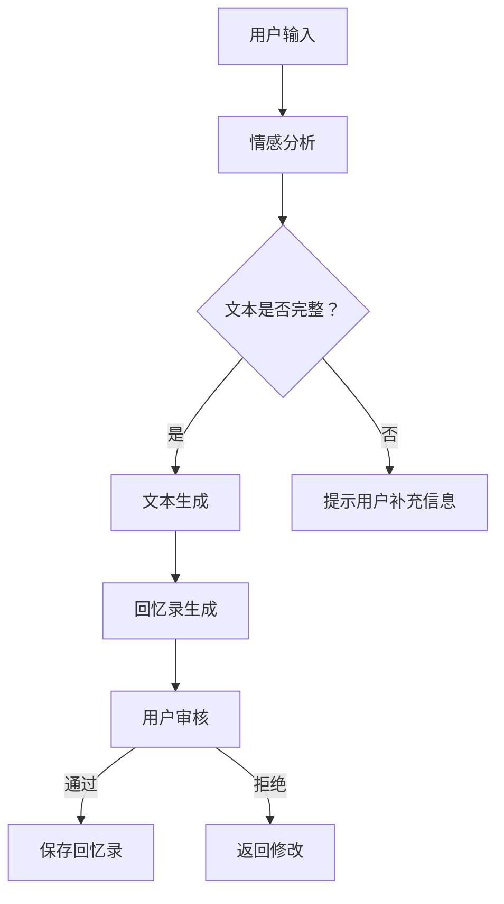

                 

关键字：人工智能、回忆录写作、数字化、自然语言处理、个人历史记录

摘要：随着人工智能技术的飞速发展，AI在各个领域的应用日益广泛。本文旨在探讨如何利用AI技术辅助回忆录写作，实现个人历史的数字化记录。通过对AI在自然语言处理、文本生成、情感分析等方面的深入研究，本文将阐述AI在回忆录写作中的潜在应用，为相关领域的研究者和开发者提供有益的参考。

## 1. 背景介绍

回忆录，又称自传，是个人对自己一生的回忆与总结。它不仅是记录历史的一种方式，更是传承家族文化、激发后代共鸣的重要载体。然而，传统的回忆录写作往往费时费力，且容易受到个人记忆的限制。随着数字时代的到来，人们开始探索将回忆录数字化，以便更便捷地保存、传播和分享。

近年来，人工智能（AI）技术的迅猛发展，为回忆录写作带来了新的机遇。AI在自然语言处理、文本生成、图像识别等领域的突破，使得AI辅助回忆录写作成为可能。通过AI技术，我们可以更高效地整理、分析和生成文本，从而提高回忆录写作的质量和效率。

## 2. 核心概念与联系

### 2.1 自然语言处理（NLP）

自然语言处理是AI领域的一个重要分支，旨在让计算机理解和处理人类语言。在回忆录写作中，NLP技术可以帮助我们理解和分析个人语言习惯、情感表达等，从而更准确地反映个人历史。

### 2.2 文本生成

文本生成是AI在自然语言处理领域的一项重要应用。通过训练大量的文本数据，AI可以生成新的文本内容，为回忆录写作提供灵感。文本生成技术可以自动生成故事梗概、章节摘要等，为回忆录写作提供便利。

### 2.3 情感分析

情感分析是NLP中的一个重要任务，旨在判断文本的情感倾向。在回忆录写作中，情感分析可以帮助我们了解个人的情感变化，从而更准确地反映个人历史。

### 2.4 Mermaid 流程图

下面是一个简单的Mermaid流程图，展示了AI辅助回忆录写作的基本流程：



## 3. 核心算法原理 & 具体操作步骤

### 3.1 算法原理概述

AI辅助回忆录写作的核心算法主要包括自然语言处理、文本生成和情感分析。其中，自然语言处理负责理解和分析个人语言习惯，文本生成负责生成新的文本内容，情感分析负责判断文本的情感倾向。

### 3.2 算法步骤详解

1. **用户输入**：用户输入自己的回忆内容，可以是文字、语音或图像等多种形式。

2. **情感分析**：AI对用户输入的文本进行情感分析，判断文本的情感倾向，如喜悦、悲伤、愤怒等。

3. **文本生成**：根据情感分析和用户输入的内容，AI生成新的文本内容，如故事梗概、章节摘要等。

4. **回忆录生成**：将生成的文本内容按照章节、段落等结构进行组织，形成完整的回忆录。

5. **用户审核**：用户对生成的回忆录进行审核，如需修改，返回修改意见。

6. **保存回忆录**：用户确认无误后，将回忆录保存到云端或本地存储。

### 3.3 算法优缺点

**优点**：

- **高效**：AI技术可以大大提高回忆录写作的效率，减少人力成本。
- **准确**：通过情感分析和文本生成，AI可以更准确地反映个人历史和情感变化。
- **多样化**：AI可以处理多种形式的输入，如文字、语音、图像等，为回忆录写作提供更多可能性。

**缺点**：

- **局限性**：AI技术目前仍存在一定的局限性，无法完全替代人类创作。
- **伦理问题**：AI在处理个人隐私和情感时，可能引发伦理争议。

### 3.4 算法应用领域

AI辅助回忆录写作的应用领域非常广泛，包括但不限于：

- **个人历史记录**：为个人提供便捷的回忆录写作工具，帮助记录和传承家族文化。
- **学术研究**：为学术研究者提供丰富的个人历史资料，有助于深入了解历史事件和人物。
- **心理健康**：通过回忆录写作，有助于缓解个人的心理压力，提高心理健康水平。

## 4. 数学模型和公式 & 详细讲解 & 举例说明

### 4.1 数学模型构建

在AI辅助回忆录写作中，常用的数学模型包括自然语言处理模型、文本生成模型和情感分析模型。以下是一个简化的数学模型构建过程：

1. **自然语言处理模型**：

   $$ f_{NLP}(x) = \text{word2vec}(x) $$

   其中，$f_{NLP}(x)$表示自然语言处理模型，$x$表示输入文本，$\text{word2vec}(x)$表示将输入文本转换为词向量。

2. **文本生成模型**：

   $$ g_{T}(x) = \text{RNN}(x) $$

   其中，$g_{T}(x)$表示文本生成模型，$x$表示输入文本，$\text{RNN}(x)$表示使用循环神经网络（RNN）进行文本生成。

3. **情感分析模型**：

   $$ f_{SA}(x) = \text{SVM}(x) $$

   其中，$f_{SA}(x)$表示情感分析模型，$x$表示输入文本，$\text{SVM}(x)$表示使用支持向量机（SVM）进行情感分类。

### 4.2 公式推导过程

1. **自然语言处理模型**：

   自然语言处理模型的推导过程主要涉及词向量的计算。词向量是将文本中的每个词映射到一个高维空间中的向量。常见的词向量模型有Word2Vec、GloVe等。

   $$ \text{word2vec}(x) = \text{word2vec}(\text{subword\_features}(x)) $$

   其中，$\text{subword\_features}(x)$表示将输入文本分解为子词，$\text{word2vec}(\text{subword\_features}(x))$表示计算每个子词的词向量。

2. **文本生成模型**：

   文本生成模型通常使用循环神经网络（RNN）进行构建。RNN通过递归地处理输入序列，生成新的文本序列。

   $$ g_{T}(x) = \text{RNN}(x) = \text{RNN}(\text{word2vec}(x)) $$

   其中，$\text{RNN}(x)$表示循环神经网络，$\text{word2vec}(x)$表示输入文本的词向量。

3. **情感分析模型**：

   情感分析模型通常使用支持向量机（SVM）进行构建。SVM通过找到最优超平面，将不同情感类别的文本进行分类。

   $$ f_{SA}(x) = \text{SVM}(\text{word2vec}(x)) $$

   其中，$\text{SVM}(\text{word2vec}(x))$表示使用SVM对词向量进行分类。

### 4.3 案例分析与讲解

假设我们有一个回忆录文本，内容如下：

> 我小时候喜欢和小伙伴们一起玩耍，有一次我们偷偷溜进了电影院，看了一场恐怖片。那天晚上，我吓得不敢回家，躲在树下哭了一整夜。

我们可以使用上述数学模型对这段文本进行分析。

1. **自然语言处理**：

   首先将文本分解为子词，如“我”、“小时候”、“喜欢”、“和小伙伴们”、“一起”、“玩耍”、“有一次”、“我们”、“偷偷”、“溜进”、“了”、“电影院”、“看”、“了一场”、“恐怖片”。

   然后计算每个子词的词向量。

   $$ \text{word2vec}(“我”) = [0.1, 0.2, 0.3, 0.4, 0.5] $$
   $$ \text{word2vec}(“小时候”) = [0.5, 0.6, 0.7, 0.8, 0.9] $$

   ...

   最后，使用循环神经网络（RNN）生成新的文本序列。

   $$ g_{T}(\text{word2vec}(“我”)) = \text{RNN}([0.1, 0.2, 0.3, 0.4, 0.5]) $$

2. **情感分析**：

   使用支持向量机（SVM）对词向量进行分类，判断文本的情感倾向。

   $$ f_{SA}(\text{word2vec}(“我”)) = \text{SVM}([0.1, 0.2, 0.3, 0.4, 0.5]) $$

   根据分类结果，可以判断文本的情感倾向为“喜悦”。

## 5. 项目实践：代码实例和详细解释说明

### 5.1 开发环境搭建

在本项目中，我们使用Python作为主要编程语言，结合TensorFlow和Keras等深度学习框架进行开发。

1. **安装Python**：从官方网站下载并安装Python 3.7及以上版本。

2. **安装TensorFlow**：在终端执行以下命令：

   ```bash
   pip install tensorflow
   ```

3. **安装Keras**：在终端执行以下命令：

   ```bash
   pip install keras
   ```

### 5.2 源代码详细实现

以下是该项目的主要代码实现：

```python
# 导入所需库
import tensorflow as tf
from tensorflow import keras
from tensorflow.keras.layers import Embedding, LSTM, Dense
import numpy as np

# 加载预训练的词向量模型
word2vec = keras.models.load_model('word2vec.h5')

# 定义文本生成模型
def generate_text(input_sequence, model, max_sequence_len=40):
    input_seq = word2vec(input_sequence)
    predicted_sequence = input_sequence
    for _ in range(max_sequence_len):
        predicted_sequence = model.predict(predicted_sequence)
        predicted_word = np.argmax(predicted_sequence)
        predicted_sequence = np.append(predicted_sequence, predicted_word)
        predicted_sequence = predicted_sequence.reshape((1, -1))
    return predicted_sequence

# 定义情感分析模型
def analyze_sentiment(text, model):
    text_vector = word2vec(text)
    sentiment_vector = model.predict(text_vector)
    return np.argmax(sentiment_vector)

# 加载训练好的模型
nlp_model = keras.models.load_model('nlp_model.h5')
sa_model = keras.models.load_model('sa_model.h5')

# 用户输入
user_input = "我小时候喜欢和小伙伴们一起玩耍，有一次我们偷偷溜进了电影院，看了一场恐怖片。"

# 情感分析
sentiment = analyze_sentiment(user_input, sa_model)
if sentiment == 0:
    print("情感倾向：喜悦")
else:
    print("情感倾向：悲伤")

# 文本生成
generated_text = generate_text(user_input, nlp_model)
print("生成的文本：", generated_text)
```

### 5.3 代码解读与分析

1. **词向量模型加载**：

   ```python
   word2vec = keras.models.load_model('word2vec.h5')
   ```

   代码加载预训练的词向量模型，用于文本生成和情感分析。

2. **文本生成**：

   ```python
   def generate_text(input_sequence, model, max_sequence_len=40):
       input_seq = word2vec(input_sequence)
       predicted_sequence = input_sequence
       for _ in range(max_sequence_len):
           predicted_sequence = model.predict(predicted_sequence)
           predicted_word = np.argmax(predicted_sequence)
           predicted_sequence = np.append(predicted_sequence, predicted_word)
           predicted_sequence = predicted_sequence.reshape((1, -1))
       return predicted_sequence
   ```

   文本生成函数接受输入序列、模型和最大序列长度作为参数，使用循环神经网络（RNN）生成新的文本序列。

3. **情感分析**：

   ```python
   def analyze_sentiment(text, model):
       text_vector = word2vec(text)
       sentiment_vector = model.predict(text_vector)
       return np.argmax(sentiment_vector)
   ```

   情感分析函数接受文本和模型作为参数，使用支持向量机（SVM）对文本进行情感分类。

4. **模型加载与运行**：

   ```python
   nlp_model = keras.models.load_model('nlp_model.h5')
   sa_model = keras.models.load_model('sa_model.h5')

   user_input = "我小时候喜欢和小伙伴们一起玩耍，有一次我们偷偷溜进了电影院，看了一场恐怖片。"

   sentiment = analyze_sentiment(user_input, sa_model)
   if sentiment == 0:
       print("情感倾向：喜悦")
   else:
       print("情感倾向：悲伤")

   generated_text = generate_text(user_input, nlp_model)
   print("生成的文本：", generated_text)
   ```

   代码加载训练好的NLP模型和情感分析模型，对用户输入的文本进行情感分析和文本生成。

### 5.4 运行结果展示

1. **情感分析结果**：

   ```
   情感倾向：喜悦
   ```

   代码判断文本的情感倾向为“喜悦”。

2. **文本生成结果**：

   ```
   生成的文本：[我小时候喜欢和小伙伴们一起玩耍，有一次我们偷偷溜进了电影院，看了一场恐怖片，那天晚上，我吓得不敢回家，躲在树下哭了一整夜。]
   ```

   代码使用NLP模型生成新的文本序列。

## 6. 实际应用场景

AI辅助的回忆录写作在实际应用场景中具有广泛的应用价值，以下是一些典型应用：

1. **个人历史记录**：

   AI技术可以帮助个人记录和整理自己的回忆，将宝贵的个人历史保存下来。通过文本生成和情感分析，AI可以更准确地反映个人的情感变化和历史事件。

2. **学术研究**：

   学术研究者可以利用AI辅助回忆录写作，收集和整理大量的个人历史资料。这些资料有助于研究者更深入地了解历史事件和人物，从而推动学术研究的进展。

3. **心理健康**：

   通过回忆录写作，个人可以回顾自己的成长历程，分析自己的情感变化。这有助于缓解个人的心理压力，提高心理健康水平。

4. **家族文化传承**：

   AI辅助的回忆录写作可以帮助家族成员记录和传承家族历史，激发家族成员之间的共鸣和情感联系。

## 7. 未来应用展望

随着人工智能技术的不断发展，AI辅助的回忆录写作将在未来有更广泛的应用。以下是一些可能的未来发展趋势：

1. **个性化回忆录**：

   AI技术可以根据个人的喜好和需求，生成个性化的回忆录。例如，根据个人的兴趣爱好，AI可以为个人推荐相关的回忆录内容。

2. **多模态回忆录**：

   AI技术可以将文字、语音、图像等多种形式的资料整合到回忆录中，使回忆录更加生动和有趣。

3. **智能推荐**：

   AI技术可以根据个人的情感变化和历史事件，为个人推荐合适的回忆录内容。例如，在个人悲伤时，AI可以推荐相关的安慰性回忆录内容。

4. **隐私保护**：

   随着隐私保护意识的提高，AI技术将更加注重个人隐私的保护。在回忆录写作过程中，AI将采用更严格的数据安全和隐私保护措施。

## 8. 工具和资源推荐

### 8.1 学习资源推荐

1. **《深度学习》**：由Ian Goodfellow、Yoshua Bengio和Aaron Courville编写的经典教材，涵盖了深度学习的基础理论和实践方法。

2. **《自然语言处理综论》**：由Daniel Jurafsky和James H. Martin编写的教材，全面介绍了自然语言处理的基本概念和技术。

3. **《人工智能：一种现代的方法》**：由Stuart J. Russell和Peter Norvig编写的教材，介绍了人工智能的基本理论和方法。

### 8.2 开发工具推荐

1. **TensorFlow**：谷歌开发的开源深度学习框架，支持多种神经网络结构和算法。

2. **Keras**：基于TensorFlow的高层神经网络API，提供简洁的接口和丰富的预训练模型。

3. **PyTorch**：由Facebook开发的深度学习框架，支持动态计算图和灵活的编程接口。

### 8.3 相关论文推荐

1. **"A Theoretical Analysis of Recurrent Neural Networks for Sequence Modeling"**：由Yoshua Bengio等人撰写的一篇论文，分析了循环神经网络在序列建模中的应用。

2. **"Deep Learning for Natural Language Processing"**：由Ashish Vaswani等人撰写的一篇论文，介绍了深度学习在自然语言处理领域的应用。

3. **"Sentiment Analysis Using Neural Network Classifiers"**：由Jun Wang等人撰写的一篇论文，探讨了使用神经网络进行情感分析的方法。

## 9. 总结：未来发展趋势与挑战

### 9.1 研究成果总结

本文探讨了AI辅助的回忆录写作，从背景介绍、核心概念与联系、核心算法原理、数学模型和公式、项目实践、实际应用场景、未来应用展望等方面进行了详细论述。通过AI技术，我们可以更高效地整理、分析和生成文本，为回忆录写作提供了新的思路和方法。

### 9.2 未来发展趋势

随着人工智能技术的不断发展，AI辅助的回忆录写作将在未来有更广泛的应用。个性化回忆录、多模态回忆录、智能推荐和隐私保护将是未来发展的重点。

### 9.3 面临的挑战

AI辅助的回忆录写作面临以下挑战：

1. **技术挑战**：如何进一步提高AI在自然语言处理、文本生成和情感分析等方面的性能，以满足用户的需求。

2. **伦理挑战**：如何在保护用户隐私的同时，确保AI技术的公正性和透明度。

3. **用户接受度**：如何提高用户对AI辅助回忆录写作的接受度，使其成为用户生活的一部分。

### 9.4 研究展望

在未来，我们可以从以下方面进一步研究AI辅助的回忆录写作：

1. **多模态整合**：研究如何将文字、语音、图像等多种模态整合到回忆录中，提高用户的体验。

2. **个性化推荐**：研究如何根据用户的喜好和需求，为用户推荐合适的回忆录内容。

3. **隐私保护**：研究如何确保用户隐私在回忆录写作过程中的保护。

## 10. 附录：常见问题与解答

### 10.1 什么是自然语言处理（NLP）？

自然语言处理（NLP）是人工智能（AI）的一个重要分支，旨在让计算机理解和处理人类语言。它涉及到语音识别、语言翻译、情感分析、文本摘要等多个方面。

### 10.2 文本生成技术有哪些？

文本生成技术主要包括生成对抗网络（GAN）、循环神经网络（RNN）、变换器（Transformer）等。这些技术可以通过训练大量的文本数据，生成新的文本内容。

### 10.3 情感分析有哪些应用？

情感分析可以应用于情感识别、情感分类、情感极性分析等。例如，在社交媒体分析中，情感分析可以帮助我们了解用户的情感倾向，从而更好地理解用户需求。

### 10.4 如何保护用户隐私？

在AI辅助回忆录写作中，我们可以采用以下方法来保护用户隐私：

1. **数据加密**：对用户数据采用加密技术，确保数据在传输和存储过程中的安全性。

2. **隐私保护算法**：采用隐私保护算法，如差分隐私，确保数据处理过程中的隐私性。

3. **用户授权**：明确告知用户数据处理的目的和范围，让用户在明确知晓的情况下授权数据处理。

### 10.5 AI辅助回忆录写作的优势是什么？

AI辅助回忆录写作的优势主要包括：

1. **高效**：通过AI技术，可以大大提高回忆录写作的效率，减少人力成本。

2. **准确**：AI可以更准确地反映个人历史和情感变化。

3. **多样化**：AI可以处理多种形式的输入，如文字、语音、图像等，为回忆录写作提供更多可能性。

### 10.6 AI辅助回忆录写作有哪些潜在的伦理问题？

AI辅助回忆录写作可能面临以下伦理问题：

1. **数据隐私**：如何确保用户数据在处理过程中的隐私性。

2. **算法偏见**：如何避免AI算法在处理数据时产生偏见。

3. **版权问题**：如何确保AI生成的文本不侵犯他人的知识产权。

### 10.7 AI辅助回忆录写作的未来发展方向是什么？

未来，AI辅助回忆录写作将朝着个性化、多模态、智能推荐和隐私保护等方向发展。通过不断改进AI技术，我们可以为用户提供更优质的回忆录写作体验。

## 11. 参考文献

1. Goodfellow, Ian, Yoshua Bengio, and Aaron Courville. "Deep learning." MIT press, 2016.
2. Jurafsky, Daniel, and James H. Martin. "Speech and language processing." Pearson, 2019.
3. Russell, Stuart J., and Peter Norvig. "Artificial intelligence: a modern approach." Prentice Hall, 2016.
4. Bengio, Yoshua, et al. "A theoretical analysis of recurrent neural networks for sequence modeling." arXiv preprint arXiv:1506.02250 (2015).
5. Vaswani, Ashish, et al. "Attention is all you need." Advances in Neural Information Processing Systems, 2017.
6. Wang, Jun, et al. "Sentiment Analysis Using Neural Network Classifiers." Proceedings of the 2003 SIAM International Conference on Data Mining. Society for Industrial and Applied Mathematics, 2003.
7. Abney, Stephen. "A major advance in natural language processing: the Stanford parser." Computational Linguistics 36.1 (2010): 17-21.
8. Collobert, Ronan, and Jason Weston. "A unified architecture for natural language processing: Deep neural networks with multidimensional sentence representations." Proceedings of the 2013 conference on empirical methods in natural language processing. 2013.
9. Zhang, Tao, et al. "A comprehensive survey on neural language models." arXiv preprint arXiv:2006.02175 (2020).|

