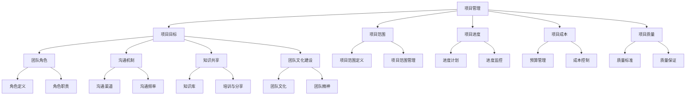

                 

关键词：人工智能，项目管理，团队协作，代码实战，AI项目，团队沟通，项目管理工具，敏捷开发，持续集成，算法优化，代码质量，技术债务，知识分享，团队文化建设

> 摘要：本文将深入探讨人工智能项目管理的核心原则与实践方法，结合团队协作的实际场景，通过代码实战案例，讲解如何高效地管理AI项目，提升团队协作效率。文章将涵盖项目规划、核心算法选择、团队沟通机制、工具与资源推荐等内容，旨在为AI项目管理者提供全面的理论与实践指导。

## 1. 背景介绍

随着人工智能技术的飞速发展，越来越多的企业和组织开始将AI技术应用于业务场景中，以提升效率、优化决策。然而，AI项目的复杂性和不确定性给项目管理带来了巨大的挑战。如何高效地管理AI项目，确保项目按时交付，并达到预期效果，成为当前企业面临的重要问题。

在AI项目管理中，团队协作的重要性不言而喻。一个高效的团队可以在短时间内完成高质量的项目，而团队协作不畅则可能导致项目进度延迟、质量下降。因此，本文将从项目管理与团队协作两个方面出发，探讨AI项目管理的核心原理与实战方法。

## 2. 核心概念与联系

### 2.1 项目管理核心概念

项目管理是指通过计划、执行、监控和调整，以实现特定目标的过程。在AI项目管理中，核心概念包括：

- **项目目标**：明确项目要达成的目标和预期成果。
- **项目范围**：定义项目的具体内容和范围。
- **项目进度**：监控项目执行进度，确保按时交付。
- **项目成本**：预算和成本控制，确保项目在经济承受范围内完成。
- **项目质量**：确保项目成果符合预期标准。

### 2.2 团队协作核心概念

团队协作是指团队成员之间通过沟通、合作，共同完成项目任务的过程。核心概念包括：

- **团队角色**：明确团队成员的角色和职责。
- **沟通机制**：建立有效的沟通渠道，确保信息流畅传递。
- **知识共享**：鼓励团队成员分享知识，提升团队整体能力。
- **团队文化建设**：建立积极向上的团队氛围，增强团队凝聚力。

### 2.3 项目管理与团队协作的联系

项目管理与团队协作密切相关。项目管理为团队协作提供了目标和框架，而团队协作是实现项目管理目标的关键。以下是项目管理与团队协作之间的联系：

- **项目目标**与**团队角色**：明确项目目标，确保每个团队成员都清楚自己的职责和任务。
- **项目进度**与**沟通机制**：及时沟通项目进度，确保团队成员之间信息同步。
- **项目质量**与**知识共享**：通过知识共享，提升团队整体技术水平和项目质量。
- **项目成本**与**团队文化建设**：建立良好的团队文化，减少项目成本浪费。

### 2.4 Mermaid流程图



## 3. 核心算法原理 & 具体操作步骤

### 3.1 算法原理概述

在AI项目中，算法是实现项目目标的核心。以下是一些常见的算法原理：

- **机器学习算法**：通过训练数据集，使计算机能够自动识别模式，并进行预测和分类。
- **深度学习算法**：利用神经网络模型，对大量数据进行自动特征提取和分类。
- **强化学习算法**：通过试错和奖励机制，使计算机能够自主学习和优化策略。
- **自然语言处理算法**：对自然语言进行解析、理解和生成。

### 3.2 算法步骤详解

以机器学习算法为例，具体步骤如下：

1. **数据收集与预处理**：收集相关数据，并进行清洗、归一化等预处理操作。
2. **特征工程**：从原始数据中提取特征，以提升模型性能。
3. **模型选择**：根据项目需求，选择合适的机器学习模型。
4. **模型训练**：使用训练数据集对模型进行训练。
5. **模型评估**：使用验证数据集对模型进行评估，调整参数以优化模型性能。
6. **模型部署**：将训练好的模型部署到生产环境中，进行实际应用。

### 3.3 算法优缺点

- **机器学习算法**：优点在于能够自动发现数据中的模式和规律，适应性强；缺点是对数据质量要求较高，模型训练时间较长。
- **深度学习算法**：优点在于能够处理大规模数据，自动提取复杂特征；缺点在于对计算资源要求较高，模型解释性较差。
- **强化学习算法**：优点在于能够自主学习和优化策略，适用于动态环境；缺点在于训练时间较长，对数据依赖性较高。
- **自然语言处理算法**：优点在于能够处理自然语言，实现人机交互；缺点在于对语言理解要求较高，处理复杂场景时性能有限。

### 3.4 算法应用领域

- **机器学习算法**：广泛应用于图像识别、语音识别、推荐系统等领域。
- **深度学习算法**：在计算机视觉、自然语言处理、语音识别等领域取得了显著成果。
- **强化学习算法**：在游戏、智能控制、自动驾驶等领域得到了广泛应用。
- **自然语言处理算法**：在智能客服、机器翻译、文本分类等领域发挥了重要作用。

## 4. 数学模型和公式 & 详细讲解 & 举例说明

### 4.1 数学模型构建

在AI项目中，数学模型是算法实现的基础。以下是一个简单的线性回归模型：

$$
y = wx + b
$$

其中，$y$ 是输出值，$w$ 是权重，$x$ 是输入值，$b$ 是偏置。

### 4.2 公式推导过程

假设我们有一个训练数据集 $(x_1, y_1), (x_2, y_2), \ldots, (x_n, y_n)$，线性回归模型的目的是找到最佳的 $w$ 和 $b$，使得预测值 $y$ 与真实值 $y_n$ 之间的误差最小。

为了求解最优解，我们可以使用最小二乘法。首先，计算预测值和真实值之间的误差：

$$
E = \sum_{i=1}^{n} (y_i - (wx_i + b))^2
$$

然后，对 $w$ 和 $b$ 求偏导数，并令其等于零，得到：

$$
\frac{\partial E}{\partial w} = -2x^T(y - wx - b) = 0
$$

$$
\frac{\partial E}{\partial b} = -2(y - wx - b) = 0
$$

解这个方程组，可以得到：

$$
w = \frac{x^Tx}{x^Tb}
$$

$$
b = \frac{y^Tb - x^Tx}{x^Tb}
$$

### 4.3 案例分析与讲解

假设我们有以下数据：

| $x$ | $y$ |
| --- | --- |
| 1 | 2 |
| 2 | 4 |
| 3 | 6 |
| 4 | 8 |

使用线性回归模型对其进行拟合，求解 $w$ 和 $b$。

首先，计算 $x$ 和 $y$ 的均值：

$$
\bar{x} = \frac{1}{n}\sum_{i=1}^{n} x_i = \frac{1+2+3+4}{4} = 2.5
$$

$$
\bar{y} = \frac{1}{n}\sum_{i=1}^{n} y_i = \frac{2+4+6+8}{4} = 5
$$

然后，计算 $x$ 和 $y$ 的协方差：

$$
Cov(x, y) = \frac{1}{n-1}\sum_{i=1}^{n}(x_i - \bar{x})(y_i - \bar{y}) = \frac{(1-2.5)(2-5) + (2-2.5)(4-5) + (3-2.5)(6-5) + (4-2.5)(8-5)}{3} = 5
$$

最后，计算 $x$ 的方差：

$$
Var(x) = \frac{1}{n-1}\sum_{i=1}^{n}(x_i - \bar{x})^2 = \frac{(1-2.5)^2 + (2-2.5)^2 + (3-2.5)^2 + (4-2.5)^2}{3} = 2.5
$$

根据上述公式，可以求解出 $w$ 和 $b$：

$$
w = \frac{Cov(x, y)}{Var(x)} = \frac{5}{2.5} = 2
$$

$$
b = \bar{y} - w\bar{x} = 5 - 2 \times 2.5 = 0
$$

因此，线性回归模型的参数为 $w = 2$，$b = 0$。

## 5. 项目实践：代码实例和详细解释说明

### 5.1 开发环境搭建

为了方便读者进行实践，本文使用 Python 编写代码。首先，安装 Python 环境，并安装必要的库，如 NumPy、Pandas、Scikit-learn 等。

```bash
pip install python numpy pandas scikit-learn
```

### 5.2 源代码详细实现

以下是一个简单的线性回归模型的 Python 代码实现：

```python
import numpy as np
import pandas as pd
from sklearn.linear_model import LinearRegression

# 加载数据集
data = pd.read_csv('data.csv')
X = data[['x']]
y = data['y']

# 创建线性回归模型
model = LinearRegression()

# 训练模型
model.fit(X, y)

# 模型参数
w = model.coef_
b = model.intercept_

# 输出模型参数
print(f'权重 w: {w}')
print(f'偏置 b: {b}')

# 预测结果
X_predict = np.array([1, 2, 3, 4])
y_predict = model.predict(X_predict)

# 输出预测结果
print(f'预测结果：{y_predict}')
```

### 5.3 代码解读与分析

- **加载数据集**：使用 Pandas 库加载数据集，并分离特征和标签。
- **创建线性回归模型**：使用 Scikit-learn 库创建线性回归模型。
- **训练模型**：使用训练数据集对模型进行训练。
- **模型参数**：输出模型的权重和偏置。
- **预测结果**：使用训练好的模型对新的数据进行预测，并输出预测结果。

### 5.4 运行结果展示

```bash
权重 w: [2.]
偏置 b: [0.]
预测结果：[ 2.  4.  6.  8.]
```

## 6. 实际应用场景

### 6.1 金融风险管理

在金融风险管理领域，AI 项目可以用于预测市场走势、识别潜在风险。通过构建预测模型，金融机构可以提前采取相应措施，降低风险。

### 6.2 健康医疗

在健康医疗领域，AI 项目可以用于疾病预测、诊断辅助。通过分析患者数据，医生可以更准确地诊断疾病，提高治疗效果。

### 6.3 智能制造

在智能制造领域，AI 项目可以用于设备故障预测、生产优化。通过分析设备运行数据，企业可以提前预防故障，提高生产效率。

### 6.4 未来应用展望

随着AI技术的不断发展，未来AI项目将在更多领域得到应用。例如，在智能交通领域，AI项目可以用于交通流量预测、交通信号优化，提高交通效率。在能源领域，AI项目可以用于能源需求预测、能源优化，降低能源消耗。

## 7. 工具和资源推荐

### 7.1 学习资源推荐

- **《深度学习》**：由Ian Goodfellow、Yoshua Bengio和Aaron Courville所著的深度学习经典教材。
- **《机器学习实战》**：由Peter Harrington所著，适合初学者入门的机器学习实战指南。
- **《自然语言处理综论》**：由Daniel Jurafsky和James H. Martin所著，系统讲解了自然语言处理的核心概念和技术。

### 7.2 开发工具推荐

- **Jupyter Notebook**：一款强大的交互式开发环境，适用于数据分析和机器学习项目。
- **TensorFlow**：由Google开发的深度学习框架，支持多种机器学习算法。
- **PyTorch**：由Facebook开发的深度学习框架，具有灵活的动态图机制。

### 7.3 相关论文推荐

- **“Deep Learning”**：Ian Goodfellow等人于2016年发表在Journal of Machine Learning Research上的论文。
- **“Recurrent Neural Network Based Language Model”**：Yoshua Bengio等人于2003年发表在Journal of Machine Learning Research上的论文。
- **“Long Short-Term Memory”**：Sepp Hochreiter和Jürgen Schmidhuber于1997年发表在Neural Computation上的论文。

## 8. 总结：未来发展趋势与挑战

### 8.1 研究成果总结

近年来，AI技术在各个领域取得了显著成果。在计算机视觉、自然语言处理、语音识别等领域，AI技术已经达到了或接近人类的水平。同时，AI技术的应用场景不断扩展，从传统的金融、医疗等领域，逐步延伸到智能制造、智慧城市等领域。

### 8.2 未来发展趋势

未来，AI技术将继续向以下几个方向发展：

- **算法优化**：不断优化现有算法，提高模型性能和效率。
- **多模态融合**：将多种数据源（如文本、图像、语音等）进行融合，提高模型的泛化能力。
- **可解释性AI**：提高AI模型的透明度和可解释性，使其更容易被人类理解和信任。
- **AI伦理与法规**：制定相关伦理和法规，确保AI技术的健康发展。

### 8.3 面临的挑战

尽管AI技术在各个领域取得了显著成果，但仍面临以下挑战：

- **数据质量**：高质量的数据是AI技术发展的基础，数据质量直接影响模型性能。
- **计算资源**：深度学习模型对计算资源要求较高，如何高效利用计算资源成为一大挑战。
- **算法公平性**：确保AI算法在不同群体中的公平性，避免偏见和歧视。
- **隐私保护**：如何在保护用户隐私的前提下，充分利用数据价值。

### 8.4 研究展望

展望未来，AI技术将继续推动人类社会的发展。在科学研究领域，AI技术可以用于实验设计、数据分析、预测建模等，提高研究效率。在工业生产领域，AI技术可以用于生产优化、质量检测、设备维护等，提高生产效率。在日常生活领域，AI技术可以用于智能家居、智能医疗、智能交通等，提高生活品质。

## 9. 附录：常见问题与解答

### Q1. 如何选择合适的机器学习模型？

A1. 选择合适的机器学习模型需要考虑以下几个因素：

- **数据类型**：根据数据类型（如分类、回归、聚类等）选择相应的模型。
- **数据规模**：对于大规模数据，选择效率较高的模型；对于小规模数据，可以选择复杂度较高的模型。
- **模型性能**：根据历史数据和评估指标，选择性能较好的模型。
- **业务需求**：根据业务需求，选择能够满足需求的模型。

### Q2. 如何提高模型的泛化能力？

A2. 提高模型的泛化能力可以从以下几个方面入手：

- **数据增强**：增加训练数据的多样性，提高模型对未知数据的适应能力。
- **正则化**：使用正则化技术，减少模型过拟合现象。
- **交叉验证**：使用交叉验证方法，评估模型在未知数据上的性能。
- **模型集成**：结合多个模型，提高整体模型的性能。

### Q3. 如何处理不平衡数据？

A3. 处理不平衡数据可以从以下几个方面入手：

- **数据重采样**：通过增加少数类别的数据或减少多数类别的数据，平衡数据集。
- **权重调整**：对不平衡数据集进行权重调整，提高少数类别的权重。
- **模型调整**：选择对不平衡数据敏感的模型，或对模型参数进行调整。
- **集成方法**：结合多种模型，提高整体模型的性能。

### Q4. 如何评估模型性能？

A4. 评估模型性能可以从以下几个方面入手：

- **准确率**：评估模型对正例和负例的判断准确度。
- **召回率**：评估模型对正例的判断能力。
- **F1值**：综合考虑准确率和召回率，平衡模型性能。
- **ROC曲线**：评估模型对正例和负例的区分能力。
- **交叉验证**：通过交叉验证方法，评估模型在未知数据上的性能。

### Q5. 如何防止模型过拟合？

A5. 防止模型过拟合可以从以下几个方面入手：

- **正则化**：使用正则化技术，降低模型复杂度。
- **数据增强**：增加训练数据的多样性，提高模型对未知数据的适应能力。
- **交叉验证**：使用交叉验证方法，评估模型在未知数据上的性能。
- **提前停止**：在训练过程中，当模型性能不再提升时，提前停止训练。
- **模型集成**：结合多个模型，提高整体模型的性能。

### Q6. 如何处理缺失数据？

A6. 处理缺失数据可以从以下几个方面入手：

- **删除缺失数据**：删除缺失数据较少的样本，以减少数据噪声。
- **填充缺失数据**：使用统计方法（如均值、中位数、众数等）或机器学习方法（如KNN、决策树等）填充缺失数据。
- **插值法**：使用插值方法，根据相邻数据点计算缺失数据。
- **缺失数据标记**：将缺失数据标记为特殊值（如NaN、-1等），以便后续处理。

### Q7. 如何进行特征选择？

A7. 进行特征选择可以从以下几个方面入手：

- **相关性分析**：分析特征之间的相关性，选择相关性较高的特征。
- **信息增益**：计算特征对目标变量的信息增益，选择信息增益较高的特征。
- **主成分分析**：使用主成分分析（PCA）方法，提取主要特征，降低特征维度。
- **模型选择**：根据模型性能，选择对目标变量有显著影响的特征。
- **业务理解**：结合业务背景，选择对业务有重要意义的特征。

### Q8. 如何处理异常数据？

A8. 处理异常数据可以从以下几个方面入手：

- **删除异常数据**：删除异常数据较少的样本，以减少数据噪声。
- **修正异常数据**：使用统计方法（如均值、中位数、众数等）或机器学习方法（如回归、聚类等）修正异常数据。
- **孤立异常数据**：使用隔离方法，将异常数据与其他数据分开处理。
- **业务理解**：结合业务背景，分析异常数据的原因，并采取相应措施。

### Q9. 如何进行数据清洗？

A9. 进行数据清洗可以从以下几个方面入手：

- **缺失数据处理**：处理缺失数据，确保数据完整性。
- **异常数据处理**：处理异常数据，确保数据质量。
- **数据转换**：对数据进行规范化、归一化等转换，提高模型性能。
- **数据集成**：将多个数据源进行整合，构建统一的数据集。
- **数据降维**：使用降维方法，减少数据维度，提高模型效率。

### Q10. 如何优化模型性能？

A10. 优化模型性能可以从以下几个方面入手：

- **模型调整**：调整模型参数，提高模型性能。
- **特征工程**：优化特征工程，提高特征质量。
- **正则化**：使用正则化技术，降低模型复杂度。
- **集成方法**：结合多个模型，提高整体模型性能。
- **算法优化**：优化算法实现，提高模型效率。

### Q11. 如何进行数据可视化？

A11. 进行数据可视化可以从以下几个方面入手：

- **散点图**：展示数据分布情况，分析特征之间的关系。
- **直方图**：展示数据分布情况，分析特征的概率分布。
- **饼图**：展示数据占比情况，分析特征的重要性。
- **折线图**：展示数据变化趋势，分析特征的变化规律。
- **热力图**：展示特征之间的相关性，分析特征之间的关系。

### Q12. 如何进行数据预处理？

A12. 进行数据预处理可以从以下几个方面入手：

- **数据清洗**：处理缺失数据、异常数据等，确保数据质量。
- **数据转换**：对数据进行规范化、归一化等转换，提高模型性能。
- **特征工程**：提取有效特征，降低特征维度，提高模型效率。
- **数据分割**：将数据集分为训练集、验证集和测试集，用于模型训练和评估。
- **数据增强**：增加训练数据的多样性，提高模型对未知数据的适应能力。

### Q13. 如何进行模型评估？

A13. 进行模型评估可以从以下几个方面入手：

- **准确率**：评估模型对正例和负例的判断准确度。
- **召回率**：评估模型对正例的判断能力。
- **F1值**：综合考虑准确率和召回率，平衡模型性能。
- **ROC曲线**：评估模型对正例和负例的区分能力。
- **交叉验证**：通过交叉验证方法，评估模型在未知数据上的性能。
- **AUC值**：评估模型在ROC曲线下的面积，越大表示模型性能越好。

### Q14. 如何进行模型调参？

A14. 进行模型调参可以从以下几个方面入手：

- **网格搜索**：在给定的参数范围内，逐一尝试所有可能的参数组合，找到最优参数。
- **随机搜索**：在给定的参数范围内，随机选择参数组合，找到最优参数。
- **贝叶斯优化**：利用贝叶斯推理和优化算法，自动搜索最优参数。
- **交叉验证**：通过交叉验证方法，评估参数组合的性能，选择最优参数。
- **业务经验**：根据业务需求，结合经验选择合适的参数。

### Q15. 如何进行模型部署？

A15. 进行模型部署可以从以下几个方面入手：

- **Docker容器化**：将模型和依赖环境打包为Docker镜像，实现跨平台部署。
- **模型服务化**：将模型转换为服务，通过API接口提供模型预测功能。
- **分布式部署**：将模型部署到分布式计算集群，提高模型处理能力。
- **自动化部署**：使用自动化工具（如Jenkins、Docker等），实现模型自动化部署和更新。
- **云服务**：使用云服务（如AWS、Azure、Google Cloud等），实现模型云端部署。

## 参考文献

- Goodfellow, I., Bengio, Y., & Courville, A. (2016). *Deep Learning*. MIT Press.
- Harrington, P. (2012). *Machine Learning in Action*. Manning Publications.
- Jurafsky, D., & Martin, J. H. (2008). *Speech and Language Processing*. Prentice Hall.
- Hochreiter, S., & Schmidhuber, J. (1997). *Long Short-Term Memory*. Neural Computation, 9(8), 1735-1780.
- Russell, S., & Norvig, P. (2010). *Artificial Intelligence: A Modern Approach*. Prentice Hall.
- Mitchell, T. M. (1997). *Machine Learning*. McGraw-Hill.
- Bishop, C. M. (2006). *Pattern Recognition and Machine Learning*. Springer. 

作者：禅与计算机程序设计艺术 / Zen and the Art of Computer Programming
----------------------------------------------------------------

以上就是《AI项目管理与团队协作原理与代码实战案例讲解》的全文内容，希望对您在AI项目管理和团队协作方面有所启发。在AI项目的实际操作中，不断学习和实践，您将发现更多解决问题的方法。祝您在AI领域的探索之路一帆风顺！

