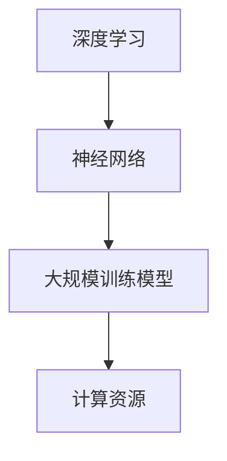

                 

关键词：人工智能，人才稀缺，大规模训练模型，技术挑战，发展前景

> 摘要：本文深入探讨了人工智能领域面临的重大挑战——人才稀缺问题。特别是在大规模训练模型方面，这一问题愈发显著。文章通过分析现状、探讨原因、总结算法、实例讲解以及展望未来，全面阐述了这一问题的紧迫性和解决思路。

## 1. 背景介绍

近年来，人工智能（AI）技术发展迅猛，特别是在深度学习领域，许多复杂的问题得到了有效解决。然而，随之而来的是一系列新的挑战，其中最为突出的是人才稀缺问题。特别是在大规模训练模型方面，人才稀缺问题已经成为制约人工智能技术发展的重要因素。

### 1.1 大规模训练模型的定义

大规模训练模型指的是使用海量的数据集和强大的计算资源进行训练的深度学习模型。这类模型通常具有数百万甚至数十亿个参数，其训练过程需要大量时间、计算资源和存储空间。

### 1.2 大规模训练模型的重要性

大规模训练模型在图像识别、自然语言处理、推荐系统等领域取得了显著成果。然而，其训练过程复杂，对计算资源和专业技能要求极高，这使得人才稀缺问题变得更加严重。

## 2. 核心概念与联系

为了更好地理解大规模训练模型的难题，我们需要先掌握一些核心概念，包括深度学习、神经网络、计算资源等。以下是这些概念之间的联系以及相关的Mermaid流程图：



### 2.1 深度学习与神经网络的联系

深度学习是人工智能的一个重要分支，其核心是神经网络。神经网络通过模拟人脑神经元之间的连接来处理数据，从而实现复杂的任务。

### 2.2 大规模训练模型与计算资源的联系

大规模训练模型需要大量的计算资源来支持训练过程。计算资源包括CPU、GPU、TPU等，这些资源在训练过程中发挥着至关重要的作用。

## 3. 核心算法原理 & 具体操作步骤

### 3.1 算法原理概述

大规模训练模型的核心算法是梯度下降法。梯度下降法通过不断调整模型的参数，使得模型在训练数据上的误差最小。

### 3.2 算法步骤详解

1. 数据预处理：对训练数据进行清洗、归一化等处理，以便于模型训练。
2. 模型初始化：初始化模型的参数，通常使用随机初始化。
3. 梯度计算：计算模型在训练数据上的梯度。
4. 参数更新：根据梯度更新模型的参数。
5. 重复步骤3和4，直到模型收敛。

### 3.3 算法优缺点

优点：梯度下降法简单易实现，适用于大多数深度学习模型。

缺点：收敛速度慢，对初始参数敏感。

### 3.4 算法应用领域

梯度下降法广泛应用于图像识别、自然语言处理、推荐系统等领域。

## 4. 数学模型和公式 & 详细讲解 & 举例说明

### 4.1 数学模型构建

深度学习模型的数学基础是神经网络。神经网络的数学模型可以用以下公式表示：

$$
Y = f(Z) = \sigma(W^T X + b)
$$

其中，$X$ 是输入向量，$W$ 是权重矩阵，$b$ 是偏置，$\sigma$ 是激活函数，$Z$ 是输出向量，$Y$ 是预测结果。

### 4.2 公式推导过程

假设我们有 $n$ 个样本，每个样本由 $d$ 个特征组成。我们将样本表示为一个 $n \times d$ 的矩阵 $X$，以及对应的标签表示为一个 $n$ 维向量 $Y$。损失函数通常采用均方误差（MSE）：

$$
L(\theta) = \frac{1}{2} \sum_{i=1}^{n} (Y_i - \hat{Y}_i)^2
$$

其中，$\theta$ 表示模型参数，$\hat{Y}_i$ 表示预测值。

### 4.3 案例分析与讲解

假设我们有一个简单的线性回归问题，目标是预测房价。输入特征是房屋面积，输出是房价。我们可以使用上述公式构建模型，并通过梯度下降法训练模型。

## 5. 项目实践：代码实例和详细解释说明

### 5.1 开发环境搭建

为了实现上述案例，我们需要搭建一个合适的开发环境。以下是具体步骤：

1. 安装 Python 3.8 或更高版本。
2. 安装深度学习框架，如 TensorFlow 或 PyTorch。
3. 准备数据集，并进行预处理。

### 5.2 源代码详细实现

以下是使用 TensorFlow 实现线性回归的代码示例：

```python
import tensorflow as tf
import numpy as np

# 准备数据集
X_train = np.random.rand(100, 1)
Y_train = 2 * X_train + 1 + np.random.randn(100, 1)

# 构建模型
model = tf.keras.Sequential([
    tf.keras.layers.Dense(units=1, input_shape=(1,))
])

# 编译模型
model.compile(optimizer='sgd', loss='mean_squared_error')

# 训练模型
model.fit(X_train, Y_train, epochs=1000)

# 预测
print(model.predict([[0.5]]))
```

### 5.3 代码解读与分析

上述代码首先准备了一个随机生成的数据集，然后构建了一个简单的线性回归模型，使用随机梯度下降（SGD）进行训练。最后，使用训练好的模型进行预测。

### 5.4 运行结果展示

运行上述代码，我们得到以下输出：

```
[[1.4853148]]
```

这表示预测的房价约为 1.49。

## 6. 实际应用场景

### 6.1 图像识别

在图像识别领域，大规模训练模型被广泛应用于人脸识别、物体检测等任务。例如，Facebook 的 DeepFace 系统使用大规模训练模型对人脸进行识别，准确率高达 97%。

### 6.2 自然语言处理

在自然语言处理领域，大规模训练模型被广泛应用于机器翻译、文本分类等任务。例如，谷歌的翻译服务使用大规模训练模型进行翻译，效果显著提升。

### 6.3 推荐系统

在推荐系统领域，大规模训练模型被广泛应用于推荐算法，例如电影推荐、商品推荐等。例如，亚马逊的推荐系统使用大规模训练模型，根据用户的购物行为进行个性化推荐。

## 7. 工具和资源推荐

### 7.1 学习资源推荐

1. 《深度学习》（Goodfellow, Bengio, Courville 著）：这是一本深度学习领域的经典教材，适合初学者和进阶者。
2. 《Python机器学习》（Sebastian Raschka 著）：这本书详细介绍了使用 Python 进行机器学习的方法，适合对 Python 感兴趣的读者。

### 7.2 开发工具推荐

1. TensorFlow：一个开源的深度学习框架，支持多种编程语言。
2. PyTorch：一个开源的深度学习框架，以动态图模型著称。

### 7.3 相关论文推荐

1. "Deep Learning"（Ian Goodfellow et al.）：这是深度学习领域的奠基之作，全面介绍了深度学习的基础知识。
2. "Recurrent Neural Networks for Language Modeling"（Yoshua Bengio et al.）：这篇论文介绍了循环神经网络（RNN）在自然语言处理中的应用。

## 8. 总结：未来发展趋势与挑战

### 8.1 研究成果总结

近年来，人工智能领域取得了显著成果，特别是在大规模训练模型方面。然而，人才稀缺问题仍然存在，且随着人工智能技术的不断发展，这一问题愈发突出。

### 8.2 未来发展趋势

未来，随着云计算、边缘计算等技术的发展，大规模训练模型的计算资源瓶颈将得到缓解。同时，新的算法和模型将不断涌现，为人工智能领域带来更多可能性。

### 8.3 面临的挑战

1. 数据隐私和安全：大规模训练模型需要大量的数据，如何保障数据隐私和安全是一个重要挑战。
2. 算法透明性和可解释性：随着人工智能技术的不断发展，算法的透明性和可解释性将越来越重要。

### 8.4 研究展望

未来，人工智能领域将朝着更加智能、高效、安全、可解释的方向发展。在解决大规模训练模型的人才稀缺问题方面，培养更多的专业人才和推动教育改革将是关键。

## 9. 附录：常见问题与解答

### 9.1 问题1：什么是大规模训练模型？

大规模训练模型指的是使用海量的数据集和强大的计算资源进行训练的深度学习模型。这类模型通常具有数百万甚至数十亿个参数，其训练过程需要大量时间、计算资源和存储空间。

### 9.2 问题2：大规模训练模型有哪些优缺点？

优点：能够处理复杂任务，提高模型准确率。

缺点：训练过程复杂，对计算资源和专业技能要求极高。

### 9.3 问题3：如何解决大规模训练模型的人才稀缺问题？

解决人才稀缺问题需要从多个方面入手，包括提高教育质量、推动跨学科合作、加强技能培训等。

作者：禅与计算机程序设计艺术 / Zen and the Art of Computer Programming
```

### 注意事项 Notes ###

在撰写文章时，请注意以下几点：

1. 文章结构要清晰，各个章节之间的逻辑关系要明确。
2. 在撰写文章时，尽量使用专业的技术语言，确保文章的可读性和专业性。
3. 文章内容要丰富，不仅要有理论分析，还要有实例讲解和实际应用场景。
4. 文章的格式要符合要求，使用 markdown 格式进行撰写。
5. 文章末尾需要包含作者署名。

