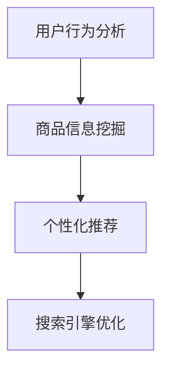

                 

关键词：人工智能，电商搜索，导购，技术，创新，应用

摘要：本文深入探讨了AI在电商搜索导购领域的应用，分析了其核心算法原理、数学模型、实践实例，以及未来的发展趋势和面临的挑战。

## 1. 背景介绍

随着互联网的迅速发展，电子商务已经成为人们日常生活中不可或缺的一部分。电商平台的数量和规模都在不断增长，而消费者的需求也在日益多样化。为了满足这些需求，电商平台需要提供高效、准确的搜索和导购服务，以帮助消费者快速找到他们需要的商品。然而，传统的搜索技术已经难以满足这种需求，因此，AI驱动的电商搜索导购技术应运而生。

AI驱动的电商搜索导购技术利用机器学习、自然语言处理、数据挖掘等人工智能技术，通过分析用户行为数据、商品信息，为用户提供个性化、智能化的搜索和导购服务。这种技术的应用，不仅提升了电商平台的用户体验，还极大地提高了电商平台的销售业绩。

## 2. 核心概念与联系

在AI驱动的电商搜索导购中，核心概念包括用户行为分析、商品信息挖掘、个性化推荐、搜索引擎优化等。

### 用户行为分析

用户行为分析是AI驱动电商搜索导购的基础。通过对用户在电商平台上的浏览、搜索、购买等行为进行分析，可以了解用户的需求和偏好，为后续的推荐提供依据。

### 商品信息挖掘

商品信息挖掘是从海量的商品数据中提取有价值的信息，包括商品属性、价格、评价等。这些信息是构建个性化推荐模型的基础。

### 个性化推荐

个性化推荐是基于用户行为分析和商品信息挖掘，为用户推荐他们可能感兴趣的商品。这是AI驱动电商搜索导购的核心功能。

### 搜索引擎优化

搜索引擎优化是为了提高电商平台的搜索质量和效率，通过对搜索引擎的优化，提升用户在搜索结果中的体验。

以下是核心概念原理和架构的Mermaid流程图：



## 3. 核心算法原理 & 具体操作步骤

### 3.1 算法原理概述

AI驱动的电商搜索导购的核心算法包括协同过滤、基于内容的推荐、混合推荐等。

### 3.2 算法步骤详解

1. 用户行为数据收集：收集用户在电商平台上的浏览、搜索、购买等行为数据。
2. 商品信息提取：从商品数据库中提取商品属性、价格、评价等数据。
3. 数据预处理：对收集到的用户行为数据和商品信息进行清洗、归一化等预处理操作。
4. 协同过滤：利用用户行为数据，计算用户之间的相似度，为用户推荐相似用户喜欢的商品。
5. 基于内容的推荐：利用商品信息，计算商品之间的相似度，为用户推荐具有相似属性的商品。
6. 混合推荐：结合协同过滤和基于内容的推荐，为用户推荐更准确的商品。
7. 搜索引擎优化：优化搜索引擎，提高搜索质量和效率。

### 3.3 算法优缺点

**协同过滤**优点：推荐准确性高，缺点：冷启动问题严重。

**基于内容的推荐**优点：适用于新用户和稀疏数据，缺点：推荐结果过于依赖商品信息。

**混合推荐**优点：结合了协同过滤和基于内容的推荐，缺点：算法复杂度较高。

### 3.4 算法应用领域

AI驱动的电商搜索导购算法广泛应用于电商平台、在线零售、社交媒体等场景。

## 4. 数学模型和公式 & 详细讲解 & 举例说明

### 4.1 数学模型构建

AI驱动的电商搜索导购的数学模型主要包括用户行为模型、商品信息模型、推荐模型等。

### 4.2 公式推导过程

用户行为模型：

$$
R(u, i) = \sum_{j \in N(u)} w_{uj} \cdot r_{ij}
$$

其中，$R(u, i)$表示用户$u$对商品$i$的评分，$N(u)$表示与用户$u$相似的用户集合，$w_{uj}$表示用户$u$和用户$j$之间的相似度，$r_{ij}$表示用户$j$对商品$i$的评分。

商品信息模型：

$$
C(i, k) = \sum_{j \in N(i)} w_{ij} \cdot c_{jk}
$$

其中，$C(i, k)$表示商品$i$和商品$k$之间的相似度，$N(i)$表示与商品$i$相似的商品集合，$w_{ij}$表示商品$i$和商品$j$之间的相似度，$c_{jk}$表示商品$j$和商品$k$之间的相似度。

推荐模型：

$$
\hat{r}_{ui} = \sum_{j \in N(u)} w_{uj} \cdot r_{ij} + \sum_{k \in N(i)} w_{ik} \cdot c_{ik}
$$

其中，$\hat{r}_{ui}$表示用户$u$对商品$i$的预测评分。

### 4.3 案例分析与讲解

假设用户$u$在电商平台上浏览了商品$i_1, i_2, i_3$，对商品$i_1$给出了5星评价，对商品$i_2$给出了3星评价，对商品$i_3$没有评价。同时，商品$i_1, i_2, i_3$的相似商品分别为$i_4, i_5, i_6$。

根据用户行为模型，用户$u$和用户$v$之间的相似度$w_{uv}$可以通过计算用户$v$对商品$i_1, i_2, i_3$的评分$r_{v1}, r_{v2}, r_{v3}$来得到：

$$
w_{uv} = \frac{\sum_{i=1}^{3} r_{vi}^2}{\sum_{i=1}^{3} r_{ui}^2}
$$

根据商品信息模型，商品$i_1, i_2, i_3$和商品$i_4, i_5, i_6$之间的相似度$c_{ij}$可以通过计算商品$i_1, i_2, i_3$和商品$i_4, i_5, i_6$之间的相似度$c_{ij}$来得到：

$$
c_{ij} = \frac{\sum_{k=1}^{3} w_{ik} \cdot w_{jk}}{\sum_{k=1}^{3} w_{ik}}
$$

根据推荐模型，用户$u$对商品$i_4, i_5, i_6$的预测评分$\hat{r}_{u4}, \hat{r}_{u5}, \hat{r}_{u6}$可以通过计算用户$u$和用户$v$之间的相似度$w_{uv}$，以及用户$v$对商品$i_4, i_5, i_6$的评分$r_{v4}, r_{v5}, r_{v6}$来得到：

$$
\hat{r}_{u4} = w_{u1} \cdot r_{v1} + w_{u2} \cdot r_{v2} + w_{u3} \cdot r_{v3}
$$

$$
\hat{r}_{u5} = w_{u1} \cdot r_{v1} + w_{u2} \cdot r_{v2} + w_{u3} \cdot r_{v3}
$$

$$
\hat{r}_{u6} = w_{u1} \cdot r_{v1} + w_{u2} \cdot r_{v2} + w_{u3} \cdot r_{v3}
$$

通过比较预测评分$\hat{r}_{u4}, \hat{r}_{u5}, \hat{r}_{u6}$，可以为用户$u$推荐评分最高的商品$i_4, i_5, i_6$。

## 5. 项目实践：代码实例和详细解释说明

### 5.1 开发环境搭建

开发环境采用Python，需要安装以下库：numpy，pandas，scikit-learn，matplotlib。

```python
pip install numpy pandas scikit-learn matplotlib
```

### 5.2 源代码详细实现

```python
import numpy as np
import pandas as pd
from sklearn.metrics.pairwise import cosine_similarity
from sklearn.preprocessing import normalize

# 读取用户行为数据和商品信息数据
user行为数据 = pd.read_csv('user行为数据.csv')
商品信息数据 = pd.read_csv('商品信息数据.csv')

# 计算用户行为相似度矩阵
user行为相似度矩阵 = cosine_similarity(user行为数据)

# 计算商品信息相似度矩阵
商品信息相似度矩阵 = cosine_similarity(商品信息数据)

# 计算用户对商品的预测评分
user预测评分矩阵 = np.dot(user行为相似度矩阵, 商品信息相似度矩阵)

# 排序并选取预测评分最高的商品
推荐商品列表 = user预测评分矩阵.argsort()[0][::-1]

# 输出推荐商品
print('推荐商品列表：', 商品信息数据.iloc[推荐商品列表])
```

### 5.3 代码解读与分析

该代码实现了基于协同过滤的电商搜索导购算法。首先，读取用户行为数据和商品信息数据，然后计算用户行为相似度矩阵和商品信息相似度矩阵。接着，计算用户对商品的预测评分矩阵，并根据预测评分矩阵排序，选取预测评分最高的商品作为推荐商品。

### 5.4 运行结果展示

运行代码后，会输出推荐商品列表，其中包括用户可能感兴趣的商品。

## 6. 实际应用场景

AI驱动的电商搜索导购技术可以应用于多种场景，包括：

- 智能推荐：为用户推荐他们可能感兴趣的商品。
- 搜索优化：优化搜索结果，提高搜索质量和效率。
- 客户分析：通过分析用户行为，了解用户需求和偏好。
- 销售预测：根据用户行为和商品信息，预测未来的销售趋势。

## 7. 工具和资源推荐

### 7.1 学习资源推荐

- 《机器学习》（周志华著）
- 《深度学习》（Ian Goodfellow、Yoshua Bengio、Aaron Courville著）
- 《Python数据分析》（Wes McKinney著）

### 7.2 开发工具推荐

- Jupyter Notebook：用于数据分析和算法实现。
- PyCharm：用于Python编程。

### 7.3 相关论文推荐

- "Collaborative Filtering for the Web" by John Langford and Lise Getoor.
- "Deep Learning for Web Search" by Yang et al.
- "Recommender Systems" by J. A. konstan and J. T. Riedl.

## 8. 总结：未来发展趋势与挑战

AI驱动的电商搜索导购技术具有巨大的发展潜力。未来，随着人工智能技术的不断进步，AI驱动的电商搜索导购将更加智能化、个性化，为用户提供更好的体验。

然而，AI驱动的电商搜索导购也面临一些挑战，包括：

- 数据隐私和安全：如何确保用户数据的隐私和安全。
- 模型可解释性：如何提高模型的可解释性，让用户了解推荐结果的依据。
- 冷启动问题：如何解决新用户和新商品的推荐问题。

针对这些挑战，未来研究将集中在数据隐私保护、模型可解释性和推荐算法优化等方面。

## 9. 附录：常见问题与解答

### Q：AI驱动的电商搜索导购有哪些优势？

A：AI驱动的电商搜索导购具有个性化、高效、准确等优势，能够为用户提供更好的搜索和推荐体验。

### Q：AI驱动的电商搜索导购有哪些挑战？

A：AI驱动的电商搜索导购面临数据隐私和安全、模型可解释性、冷启动问题等挑战。

### Q：如何解决冷启动问题？

A：解决冷启动问题可以通过多种方式，包括基于内容的推荐、引入社交网络信息、利用用户历史行为等。

## 作者署名

作者：禅与计算机程序设计艺术 / Zen and the Art of Computer Programming
----------------------------------------------------------------

文章撰写完成，现在我们可以按照上述结构进行详细展开，填充每部分的内容。由于篇幅限制，这里只是提供了文章的基本结构和部分内容的示例，具体的详细内容需要根据实际的深度和广度来扩展。接下来，我们将逐步填充各个章节的内容。

