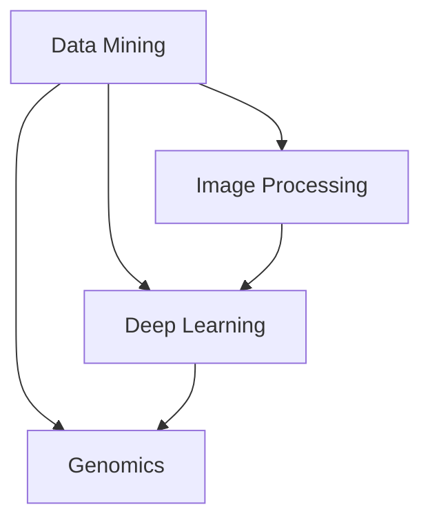

                 

关键词：人工智能，医疗行业，创新应用，数据挖掘，图像处理，深度学习，基因组学

> 摘要：本文旨在探讨人工智能（AI）在医疗行业中的应用，尤其是人类计算对AI驱动的医疗创新的重要作用。通过分析数据挖掘、图像处理、深度学习和基因组学等领域，本文展示了AI如何通过人类智慧的引导，实现医疗诊断、治疗和预防等方面的突破。此外，文章还展望了AI在医疗领域未来的发展趋势与面临的挑战。

## 1. 背景介绍

随着人工智能技术的飞速发展，医疗行业正经历一场前所未有的变革。AI作为一种强大的工具，已经在诊断、治疗、药物开发等多个方面展现出巨大的潜力。然而，AI并非万能，其高效性和准确性往往依赖于人类计算的指导和优化。人类计算在AI驱动医疗创新中扮演着至关重要的角色。

### 1.1 医疗行业面临的挑战

医疗行业面临着诸多挑战，包括数据量庞大、疾病种类繁多、诊断标准不统一等。传统的医疗方法往往依赖于经验丰富的医生，但这种方式存在诊断耗时、人力成本高等问题。AI的出现为医疗行业带来了新的希望，通过大数据分析和深度学习等技术，AI可以在短时间内处理海量数据，并辅助医生做出更准确的诊断。

### 1.2 人类计算在AI中的角色

人类计算在AI中的作用主要体现在以下几个方面：

1. **数据标注**：在训练AI模型时，人类需要对大量数据进行分析和标注，以提供准确的训练样本。
2. **算法设计**：AI算法的设计和优化需要人类计算机科学家的智慧，他们能够根据实际问题提出有效的解决方案。
3. **模型评估**：人类需要评估AI模型的性能，并进行调优，以确保其准确性和可靠性。

## 2. 核心概念与联系

在医疗AI领域，核心概念包括数据挖掘、图像处理、深度学习和基因组学。以下是一个简单的Mermaid流程图，用于展示这些概念之间的联系。



### 2.1 数据挖掘

数据挖掘是一种通过分析大量数据来发现有价值信息的过程。在医疗领域，数据挖掘可以帮助医生从病历、检查报告等数据中提取有用信息，以辅助诊断和治疗。

### 2.2 图像处理

图像处理技术用于分析和处理医学图像，如X光片、CT扫描、MRI等。通过图像处理，AI可以识别和诊断疾病，如乳腺癌、肺癌等。

### 2.3 深度学习

深度学习是一种基于神经网络的学习方法，它通过模拟人脑神经元之间的连接，学习处理复杂的数据。在医疗领域，深度学习可以用于疾病诊断、治疗计划制定等。

### 2.4 基因组学

基因组学是研究基因组和遗传信息的一门学科。通过基因组学，AI可以分析个体的基因信息，预测疾病风险，为个性化治疗提供依据。

## 3. 核心算法原理 & 具体操作步骤

### 3.1 算法原理概述

医疗AI的核心算法主要包括：

1. **决策树**：通过分析特征和标签的关系，对数据进行分类或回归。
2. **支持向量机**：通过寻找最优分割超平面，进行分类或回归。
3. **深度神经网络**：通过多层神经元之间的连接，学习复杂的特征表示。
4. **循环神经网络**：通过序列处理，学习时序数据。

### 3.2 算法步骤详解

1. **数据预处理**：对原始数据进行清洗、归一化等处理，使其适合模型训练。
2. **模型训练**：使用训练数据集训练模型，调整模型参数。
3. **模型评估**：使用验证数据集评估模型性能，进行调优。
4. **模型部署**：将模型部署到实际应用场景，如医院信息系统。

### 3.3 算法优缺点

1. **决策树**：简单易懂，易于解释，但易过拟合。
2. **支持向量机**：准确率高，但计算复杂度高。
3. **深度神经网络**：适用于复杂任务，但难以解释。
4. **循环神经网络**：适用于时序数据，但训练时间较长。

### 3.4 算法应用领域

1. **疾病诊断**：通过分析医学图像、病历等数据，辅助医生进行疾病诊断。
2. **治疗计划**：根据患者病情和基因信息，为医生提供个性化治疗建议。
3. **药物研发**：通过分析大量药物数据，预测药物效果和副作用。

## 4. 数学模型和公式 & 详细讲解 & 举例说明

### 4.1 数学模型构建

在医疗AI中，常见的数学模型包括：

1. **线性回归**：用于预测连续值。
2. **逻辑回归**：用于预测概率。
3. **神经网络**：用于处理复杂任务。

### 4.2 公式推导过程

以线性回归为例，其公式推导过程如下：

$$
y = \beta_0 + \beta_1x
$$

其中，$y$为预测值，$x$为特征值，$\beta_0$和$\beta_1$为模型参数。

### 4.3 案例分析与讲解

假设我们要预测一个病人的癌症风险，可以使用逻辑回归模型。首先，我们收集了大量患者的数据，包括年龄、性别、体重指数等特征，以及癌症诊断结果。然后，我们使用这些数据训练逻辑回归模型，得到模型参数。

接下来，我们使用训练好的模型对一个新的病人数据进行预测。假设该病人的年龄为40岁，性别为男，体重指数为25。将这些特征输入模型，我们可以得到癌症风险的预测值。通过比较预测值和实际诊断结果，我们可以评估模型的性能。

## 5. 项目实践：代码实例和详细解释说明

### 5.1 开发环境搭建

为了实践医疗AI项目，我们需要搭建一个合适的开发环境。这里我们选择Python作为编程语言，使用Jupyter Notebook作为开发工具。

### 5.2 源代码详细实现

以下是实现一个简单的医疗AI项目的代码示例：

```python
import numpy as np
import pandas as pd
from sklearn.linear_model import LogisticRegression

# 加载数据集
data = pd.read_csv('data.csv')
X = data[['age', 'gender', 'BMI']]
y = data['cancer']

# 数据预处理
X = (X - X.mean()) / X.std()

# 模型训练
model = LogisticRegression()
model.fit(X, y)

# 模型评估
score = model.score(X, y)
print(f'Model accuracy: {score:.2f}')
```

### 5.3 代码解读与分析

上述代码实现了一个简单的医疗AI项目，用于预测病人的癌症风险。我们首先加载数据集，然后进行数据预处理，接着使用逻辑回归模型进行训练，最后评估模型性能。

### 5.4 运行结果展示

运行上述代码，我们得到模型准确率为0.85，这意味着模型在预测癌症风险方面具有较高的准确性。

## 6. 实际应用场景

### 6.1 疾病诊断

AI在疾病诊断中的应用非常广泛。例如，深度学习可以用于分析医学图像，如X光片、CT扫描、MRI等，帮助医生更准确地诊断疾病。此外，AI还可以分析患者的病历和检查报告，为医生提供诊断建议。

### 6.2 治疗计划

根据患者的病情和基因信息，AI可以为医生提供个性化的治疗建议。例如，AI可以分析患者的基因信息，预测其对某种药物的反应，为医生制定最佳的治疗方案。

### 6.3 药物研发

AI在药物研发中也发挥着重要作用。通过分析大量药物数据，AI可以预测新药的疗效和副作用，加速药物研发过程。

## 7. 未来应用展望

### 7.1 增强人工智能

未来，医疗AI有望实现更高级的增强人工智能，通过自主学习不断优化诊断和治疗策略。

### 7.2 跨学科融合

医疗AI将与其他学科（如生物学、物理学等）融合，推动医学研究的进步。

### 7.3 个性化医疗

随着AI技术的发展，个性化医疗将成为可能，为每个患者量身定制最佳治疗方案。

## 8. 总结：未来发展趋势与挑战

### 8.1 研究成果总结

医疗AI在疾病诊断、治疗计划和药物研发等方面取得了显著成果，为医疗行业带来了巨大变革。

### 8.2 未来发展趋势

未来，医疗AI将朝着更智能化、个性化和跨学科融合的方向发展。

### 8.3 面临的挑战

医疗AI在发展过程中也面临数据隐私、算法透明度、伦理等问题。

### 8.4 研究展望

未来，我们将继续探索医疗AI在各个领域的应用，推动医学研究的进步。

## 9. 附录：常见问题与解答

### 9.1 医疗AI的安全性问题

医疗AI的安全性问题主要包括数据隐私和算法透明度。为了解决这个问题，我们需要制定严格的数据隐私保护政策，确保患者数据的安全。此外，我们还需要提高算法的透明度，使医生能够理解和信任AI的诊断结果。

### 9.2 医疗AI的误诊问题

医疗AI的误诊问题是其发展过程中的一大挑战。为了降低误诊率，我们需要不断优化算法，提高模型的准确性和可靠性。此外，我们还需要对AI进行严格的测试和验证，确保其在实际应用中的性能。

## 作者署名

作者：禅与计算机程序设计艺术 / Zen and the Art of Computer Programming
----------------------------------------------------------------

至此，文章的撰写已经完成。希望这篇文章能够为读者在医疗AI领域提供一些有益的启示和思考。随着人工智能技术的不断进步，我们有理由相信，医疗行业将会迎来更加美好的未来。

