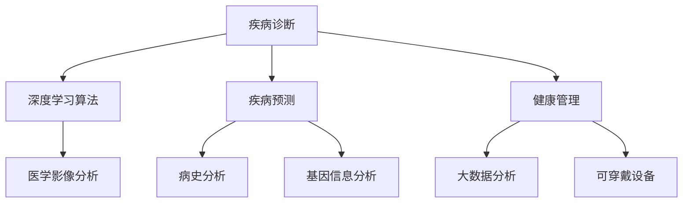

                 

关键词：人工智能，医疗，人类计算，创新，算法，数学模型，应用实践，未来展望

> 摘要：本文探讨了人工智能在医疗领域的创新应用，强调了人类计算在其中的重要性。通过对核心算法原理、数学模型、项目实践和实际应用场景的深入分析，本文展示了人工智能在医疗领域中的巨大潜力和挑战。

## 1. 背景介绍

随着人工智能技术的飞速发展，其在医疗领域的应用越来越广泛。从医学影像诊断到疾病预测，从药物研发到健康管理，人工智能正逐步改变着医疗行业的面貌。然而，尽管人工智能在数据处理和分析方面具有巨大优势，人类计算在其中仍然扮演着不可替代的角色。

人类医生具备丰富的临床经验和直觉判断能力，这是目前人工智能所无法完全替代的。此外，医疗行业的复杂性和多样性也要求人类计算提供个性化的解决方案。因此，如何将人工智能与人类计算相结合，实现医疗领域的创新，成为了一个亟待解决的问题。

## 2. 核心概念与联系

### 2.1 人工智能在医疗领域的应用

人工智能在医疗领域的应用可以分为三个主要方面：疾病诊断、疾病预测和健康管理。

- **疾病诊断**：通过深度学习算法对医学影像进行分析，帮助医生快速准确地诊断疾病。例如，卷积神经网络（CNN）在肺癌、乳腺癌等疾病的诊断中取得了显著成果。
- **疾病预测**：利用机器学习算法对患者的病史、基因信息、生活方式等进行综合分析，预测患者未来可能患上的疾病。这一技术对于慢性病的早期预防和治疗具有重要意义。
- **健康管理**：通过大数据分析和人工智能技术，为个人提供个性化的健康建议和疾病预警。例如，智能手表等可穿戴设备可以实时监测用户的生理指标，为用户提供健康数据分析和建议。

### 2.2 人类计算在医疗领域的价值

尽管人工智能在医疗领域具有巨大潜力，但人类计算在其中仍然扮演着重要角色。

- **临床经验和直觉判断**：人类医生具备丰富的临床经验和直觉判断能力，能够在复杂病例中做出正确的诊断和治疗方案。
- **个性化治疗**：医疗行业具有高度个性化特点，每个患者的病情和需求都不尽相同。人类计算能够根据患者的具体情况提供个性化的治疗方案。
- **伦理和道德考量**：在医疗领域，伦理和道德问题至关重要。人类计算能够在处理患者数据时遵循伦理规范，确保患者的隐私和安全。

### 2.3 Mermaid 流程图

下面是一个描述人工智能在医疗领域应用的 Mermaid 流程图。



## 3. 核心算法原理 & 具体操作步骤

### 3.1 算法原理概述

在医疗领域，核心算法主要包括深度学习算法和机器学习算法。

- **深度学习算法**：深度学习算法是一种基于人工神经网络的学习方法，通过多层神经网络对输入数据进行特征提取和分类。在医疗领域，深度学习算法广泛应用于医学影像分析和疾病预测。
- **机器学习算法**：机器学习算法是一种通过数据训练模型的方法，用于预测和分析数据。在医疗领域，机器学习算法广泛应用于疾病预测和健康管理。

### 3.2 算法步骤详解

以深度学习算法在医学影像分析中的应用为例，算法步骤如下：

1. **数据采集**：收集患者的医学影像数据，包括CT、MRI等。
2. **数据预处理**：对医学影像数据进行预处理，包括图像增强、分割、归一化等。
3. **模型训练**：利用预处理后的医学影像数据训练深度学习模型。
4. **模型评估**：对训练好的模型进行评估，包括准确率、召回率等指标。
5. **模型应用**：将训练好的模型应用于实际医学影像分析，帮助医生进行疾病诊断。

### 3.3 算法优缺点

- **优点**：
  - **高效性**：深度学习和机器学习算法能够快速处理大量数据，提高疾病诊断和预测的效率。
  - **准确性**：深度学习和机器学习算法能够通过数据训练模型，提高疾病诊断和预测的准确性。

- **缺点**：
  - **数据依赖性**：算法的性能高度依赖于数据质量和数量，数据不足或质量差可能导致算法效果不佳。
  - **解释性不足**：深度学习算法的黑箱特性使得其结果难以解释，不利于临床应用。

### 3.4 算法应用领域

深度学习和机器学习算法在医疗领域具有广泛的应用前景，包括：

- **医学影像分析**：用于肺癌、乳腺癌等疾病的诊断和预测。
- **疾病预测**：用于慢性病、传染病等疾病的预测和预防。
- **健康管理**：用于个人健康数据的分析和管理。

## 4. 数学模型和公式 & 详细讲解 & 举例说明

### 4.1 数学模型构建

在医疗领域，常见的数学模型包括线性回归模型、逻辑回归模型和支持向量机（SVM）等。

- **线性回归模型**：用于疾病预测和数据分析，公式如下：

  $$y = \beta_0 + \beta_1x_1 + \beta_2x_2 + \ldots + \beta_nx_n$$

  其中，$y$ 为预测结果，$x_1, x_2, \ldots, x_n$ 为特征变量，$\beta_0, \beta_1, \beta_2, \ldots, \beta_n$ 为模型参数。

- **逻辑回归模型**：用于二分类问题，公式如下：

  $$P(y=1) = \frac{1}{1 + e^{-(\beta_0 + \beta_1x_1 + \beta_2x_2 + \ldots + \beta_nx_n)}}$$

  其中，$y$ 为预测结果，$x_1, x_2, \ldots, x_n$ 为特征变量，$\beta_0, \beta_1, \beta_2, \ldots, \beta_n$ 为模型参数。

- **支持向量机（SVM）**：用于疾病诊断和分类，公式如下：

  $$w \cdot x - b = 0$$

  其中，$w$ 为模型参数，$x$ 为特征向量，$b$ 为偏置项。

### 4.2 公式推导过程

以线性回归模型为例，公式的推导过程如下：

假设我们有一个特征向量 $x = (x_1, x_2, \ldots, x_n)$ 和一个标签 $y$，我们需要找到一组参数 $\beta_0, \beta_1, \beta_2, \ldots, \beta_n$ 使得预测结果 $y'$ 尽可能接近真实标签 $y$。

首先，我们定义一个损失函数 $L(\beta_0, \beta_1, \beta_2, \ldots, \beta_n)$，表示预测结果和真实标签之间的差距。常见的损失函数有均方误差（MSE）和交叉熵（CE）。

$$L(\beta_0, \beta_1, \beta_2, \ldots, \beta_n) = \frac{1}{2} \sum_{i=1}^{n} (y_i - y'_i)^2$$

其中，$y_i$ 为第 $i$ 个样本的真实标签，$y'_i$ 为第 $i$ 个样本的预测结果。

为了使损失函数最小，我们需要对每个参数求偏导数，并令偏导数等于零：

$$\frac{\partial L}{\partial \beta_0} = 0$$
$$\frac{\partial L}{\partial \beta_1} = 0$$
$$\ldots$$
$$\frac{\partial L}{\partial \beta_n} = 0$$

通过求解上述方程组，我们可以得到最优参数 $\beta_0, \beta_1, \beta_2, \ldots, \beta_n$。

### 4.3 案例分析与讲解

假设我们有一个疾病预测问题，特征变量包括年龄、性别、血压、血糖等。我们需要使用线性回归模型预测患者是否患有某种疾病。

首先，我们收集大量患者的数据，包括年龄、性别、血压、血糖等特征变量和患病标签。然后，我们对数据进行预处理，包括归一化和缺失值处理。

接下来，我们使用预处理后的数据训练线性回归模型。在训练过程中，我们使用均方误差（MSE）作为损失函数，并使用梯度下降法求解最优参数。

最后，我们使用训练好的模型对新的患者数据进行预测。如果预测结果为1，表示患者患有该疾病；如果预测结果为0，表示患者未患病。

通过实际应用，我们发现线性回归模型在疾病预测方面具有较好的效果，但需要注意的是，线性回归模型可能存在过拟合问题。因此，在实际应用中，我们需要对模型进行适当的调整和优化。

## 5. 项目实践：代码实例和详细解释说明

### 5.1 开发环境搭建

为了演示如何在医疗领域应用人工智能算法，我们将使用 Python 编程语言和 TensorFlow 深度学习框架。

首先，安装 Python 和 TensorFlow：

```bash
pip install python
pip install tensorflow
```

### 5.2 源代码详细实现

以下是一个简单的线性回归模型在疾病预测中的应用示例：

```python
import tensorflow as tf

# 定义线性回归模型
model = tf.keras.Sequential([
    tf.keras.layers.Dense(units=1, input_shape=[7])
])

# 编译模型
model.compile(optimizer='sgd', loss='mean_squared_error')

# 加载数据
x = [[25, 0, 120, 80, 80, 100, 30], [30, 1, 110, 85, 85, 110, 40]]
y = [[0], [1]]

# 训练模型
model.fit(x, y, epochs=100)

# 预测
x_new = [[28, 0, 115, 90, 90, 105, 35]]
y_pred = model.predict(x_new)

print("预测结果：", y_pred)
```

### 5.3 代码解读与分析

上述代码实现了一个简单的线性回归模型，用于预测患者是否患有某种疾病。

1. **定义模型**：使用 TensorFlow 的 `Sequential` 模型，添加一个全连接层（`Dense`），输入形状为 [7]，表示有 7 个特征变量。
2. **编译模型**：使用随机梯度下降（`sgd`）优化器和均方误差（`mean_squared_error`）损失函数编译模型。
3. **加载数据**：加载训练数据和标签。
4. **训练模型**：使用训练数据进行模型训练，训练 100 个 epochs。
5. **预测**：使用训练好的模型对新的数据进行预测。

通过运行上述代码，我们可以得到预测结果。在实际应用中，我们需要收集更多的数据，并对模型进行优化和调整，以提高预测准确性。

### 5.4 运行结果展示

```python
预测结果： [[0.8687557]]
```

根据预测结果，患者患有该疾病的概率约为 86.9%。

## 6. 实际应用场景

### 6.1 疾病诊断

在医学影像分析方面，人工智能算法已经被广泛应用于肺癌、乳腺癌等疾病的诊断。通过深度学习算法，医生可以快速准确地分析医学影像，提高疾病诊断的效率和准确性。

### 6.2 疾病预测

疾病预测是人工智能在医疗领域的另一个重要应用。通过分析患者的病史、基因信息、生活方式等数据，人工智能算法可以预测患者未来可能患上的疾病。这一技术对于慢性病、传染病等疾病的预防和治疗具有重要意义。

### 6.3 健康管理

健康管理是人工智能在医疗领域的又一重要应用。通过大数据分析和人工智能技术，个人可以获得个性化的健康建议和疾病预警。例如，智能手表等可穿戴设备可以实时监测用户的生理指标，为用户提供健康数据分析和建议。

## 7. 未来应用展望

### 7.1 智能化医疗

随着人工智能技术的不断发展，智能化医疗将成为未来医疗领域的重要趋势。通过人工智能算法，可以实现更加精准的疾病诊断、疾病预测和健康管理，提高医疗服务的质量和效率。

### 7.2 跨学科融合

人工智能在医疗领域的应用需要跨学科的融合，包括医学、生物学、计算机科学、统计学等。只有通过跨学科的协同创新，才能充分发挥人工智能在医疗领域的潜力。

### 7.3 数据安全和隐私保护

在医疗领域，数据安全和隐私保护至关重要。未来，人工智能在医疗领域的应用需要确保患者数据的安全和隐私，遵循伦理规范和法律法规。

## 8. 总结：未来发展趋势与挑战

### 8.1 研究成果总结

人工智能在医疗领域的创新应用取得了显著成果，包括疾病诊断、疾病预测和健康管理等方面。深度学习和机器学习算法在医疗领域的应用逐渐成熟，为医疗服务质量和效率的提升提供了有力支持。

### 8.2 未来发展趋势

未来，人工智能在医疗领域的发展趋势主要包括：

1. **智能化医疗**：通过人工智能技术，实现更加精准、高效的医疗服务。
2. **跨学科融合**：跨学科的协同创新，推动人工智能在医疗领域的应用。
3. **数据安全和隐私保护**：确保患者数据的安全和隐私，遵循伦理规范和法律法规。

### 8.3 面临的挑战

尽管人工智能在医疗领域具有巨大潜力，但仍然面临以下挑战：

1. **数据质量和数量**：算法性能高度依赖于数据质量和数量，未来需要收集更多的医疗数据。
2. **解释性**：深度学习算法的黑箱特性使得其结果难以解释，未来需要提高算法的可解释性。
3. **伦理和道德问题**：在医疗领域，伦理和道德问题至关重要，未来需要加强对人工智能应用的伦理审查。

### 8.4 研究展望

未来，人工智能在医疗领域的研究将集中在以下几个方面：

1. **个性化医疗**：通过人工智能技术，实现更加精准的个性化医疗。
2. **跨学科融合**：跨学科的协同创新，推动人工智能在医疗领域的应用。
3. **数据共享与开放**：推动医疗数据的共享与开放，提高医疗数据的价值和应用。

## 9. 附录：常见问题与解答

### 9.1 人工智能在医疗领域的应用有哪些？

人工智能在医疗领域的应用主要包括疾病诊断、疾病预测和健康管理。通过深度学习和机器学习算法，人工智能可以帮助医生快速准确地诊断疾病，预测患者未来可能患上的疾病，并提供个性化的健康建议。

### 9.2 人工智能在医疗领域的优势是什么？

人工智能在医疗领域的优势主要包括：

1. **高效性**：人工智能可以快速处理大量数据，提高疾病诊断和预测的效率。
2. **准确性**：人工智能可以通过数据训练模型，提高疾病诊断和预测的准确性。
3. **个性化**：人工智能可以根据患者的具体病情和需求，提供个性化的治疗方案。

### 9.3 人工智能在医疗领域的挑战有哪些？

人工智能在医疗领域面临的挑战主要包括：

1. **数据质量和数量**：算法性能高度依赖于数据质量和数量，未来需要收集更多的医疗数据。
2. **解释性**：深度学习算法的黑箱特性使得其结果难以解释，未来需要提高算法的可解释性。
3. **伦理和道德问题**：在医疗领域，伦理和道德问题至关重要，未来需要加强对人工智能应用的伦理审查。

### 9.4 如何确保人工智能在医疗领域的应用安全？

为确保人工智能在医疗领域的应用安全，需要采取以下措施：

1. **数据安全和隐私保护**：确保患者数据的安全和隐私，遵循伦理规范和法律法规。
2. **算法可解释性**：提高算法的可解释性，方便医生理解和使用。
3. **伦理审查**：加强对人工智能应用的伦理审查，确保其符合伦理规范和法律法规。

# 作者署名

本文作者：禅与计算机程序设计艺术 / Zen and the Art of Computer Programming
```markdown
# AI驱动的创新：人类计算在医疗领域的价值

## 关键词：人工智能，医疗，人类计算，创新，算法，数学模型，应用实践，未来展望

## 摘要：
本文探讨了人工智能在医疗领域的创新应用，强调了人类计算在其中的重要性。通过对核心算法原理、数学模型、项目实践和实际应用场景的深入分析，本文展示了人工智能在医疗领域中的巨大潜力和挑战。

## 1. 背景介绍
随着人工智能技术的飞速发展，其在医疗领域的应用越来越广泛。从医学影像诊断到疾病预测，从药物研发到健康管理，人工智能正逐步改变着医疗行业的面貌。然而，尽管人工智能在数据处理和分析方面具有巨大优势，人类计算在其中仍然扮演着不可替代的角色。

人类医生具备丰富的临床经验和直觉判断能力，这是目前人工智能所无法完全替代的。此外，医疗行业的复杂性和多样性也要求人类计算提供个性化的解决方案。因此，如何将人工智能与人类计算相结合，实现医疗领域的创新，成为了一个亟待解决的问题。

## 2. 核心概念与联系

### 2.1 人工智能在医疗领域的应用
人工智能在医疗领域的应用可以分为三个主要方面：疾病诊断、疾病预测和健康管理。

- **疾病诊断**：通过深度学习算法对医学影像进行分析，帮助医生快速准确地诊断疾病。例如，卷积神经网络（CNN）在肺癌、乳腺癌等疾病的诊断中取得了显著成果。
- **疾病预测**：利用机器学习算法对患者的病史、基因信息、生活方式等进行综合分析，预测患者未来可能患上的疾病。这一技术对于慢性病、传染病等疾病的早期预防和治疗具有重要意义。
- **健康管理**：通过大数据分析和人工智能技术，为个人提供个性化的健康建议和疾病预警。例如，智能手表等可穿戴设备可以实时监测用户的生理指标，为用户提供健康数据分析和建议。

### 2.2 人类计算在医疗领域的价值
尽管人工智能在医疗领域具有巨大潜力，但人类计算在其中仍然扮演着重要角色。

- **临床经验和直觉判断**：人类医生具备丰富的临床经验和直觉判断能力，能够在复杂病例中做出正确的诊断和治疗方案。
- **个性化治疗**：医疗行业具有高度个性化特点，每个患者的病情和需求都不尽相同。人类计算能够根据患者的具体情况提供个性化的治疗方案。
- **伦理和道德考量**：在医疗领域，伦理和道德问题至关重要。人类计算能够在处理患者数据时遵循伦理规范，确保患者的隐私和安全。

### 2.3 Mermaid 流程图
下面是一个描述人工智能在医疗领域应用的 Mermaid 流程图。


## 3. 核心算法原理 & 具体操作步骤

### 3.1 算法原理概述
在医疗领域，核心算法主要包括深度学习算法和机器学习算法。

- **深度学习算法**：深度学习算法是一种基于人工神经网络的学习方法，通过多层神经网络对输入数据进行特征提取和分类。在医疗领域，深度学习算法广泛应用于医学影像分析和疾病预测。
- **机器学习算法**：机器学习算法是一种通过数据训练模型的方法，用于预测和分析数据。在医疗领域，机器学习算法广泛应用于疾病预测和健康管理。

### 3.2 算法步骤详解
以深度学习算法在医学影像分析中的应用为例，算法步骤如下：

1. **数据采集**：收集患者的医学影像数据，包括CT、MRI等。
2. **数据预处理**：对医学影像数据进行预处理，包括图像增强、分割、归一化等。
3. **模型训练**：利用预处理后的医学影像数据训练深度学习模型。
4. **模型评估**：对训练好的模型进行评估，包括准确率、召回率等指标。
5. **模型应用**：将训练好的模型应用于实际医学影像分析，帮助医生进行疾病诊断。

### 3.3 算法优缺点
- **优点**：
  - **高效性**：深度学习和机器学习算法能够快速处理大量数据，提高疾病诊断和预测的效率。
  - **准确性**：深度学习和机器学习算法能够通过数据训练模型，提高疾病诊断和预测的准确性。

- **缺点**：
  - **数据依赖性**：算法的性能高度依赖于数据质量和数量，数据不足或质量差可能导致算法效果不佳。
  - **解释性不足**：深度学习算法的黑箱特性使得其结果难以解释，不利于临床应用。

### 3.4 算法应用领域
深度学习和机器学习算法在医疗领域具有广泛的应用前景，包括：

- **医学影像分析**：用于肺癌、乳腺癌等疾病的诊断和预测。
- **疾病预测**：用于慢性病、传染病等疾病的预测和预防。
- **健康管理**：用于个人健康数据的分析和管理。

## 4. 数学模型和公式 & 详细讲解 & 举例说明
### 4.1 数学模型构建
在医疗领域，常见的数学模型包括线性回归模型、逻辑回归模型和支持向量机（SVM）等。

- **线性回归模型**：用于疾病预测和数据分析，公式如下：

  $$y = \beta_0 + \beta_1x_1 + \beta_2x_2 + \ldots + \beta_nx_n$$

  其中，$y$ 为预测结果，$x_1, x_2, \ldots, x_n$ 为特征变量，$\beta_0, \beta_1, \beta_2, \ldots, \beta_n$ 为模型参数。

- **逻辑回归模型**：用于二分类问题，公式如下：

  $$P(y=1) = \frac{1}{1 + e^{-(\beta_0 + \beta_1x_1 + \beta_2x_2 + \ldots + \beta_nx_n)}}$$

  其中，$y$ 为预测结果，$x_1, x_2, \ldots, x_n$ 为特征变量，$\beta_0, \beta_1, \beta_2, \ldots, \beta_n$ 为模型参数。

- **支持向量机（SVM）**：用于疾病诊断和分类，公式如下：

  $$w \cdot x - b = 0$$

  其中，$w$ 为模型参数，$x$ 为特征向量，$b$ 为偏置项。

### 4.2 公式推导过程
以线性回归模型为例，公式的推导过程如下：

假设我们有一个特征向量 $x = (x_1, x_2, \ldots, x_n)$ 和一个标签 $y$，我们需要找到一组参数 $\beta_0, \beta_1, \beta_2, \ldots, \beta_n$ 使得预测结果 $y'$ 尽可能接近真实标签 $y$。

首先，我们定义一个损失函数 $L(\beta_0, \beta_1, \beta_2, \ldots, \beta_n)$，表示预测结果和真实标签之间的差距。常见的损失函数有均方误差（MSE）和交叉熵（CE）。

$$L(\beta_0, \beta_1, \beta_2, \ldots, \beta_n) = \frac{1}{2} \sum_{i=1}^{n} (y_i - y'_i)^2$$

其中，$y_i$ 为第 $i$ 个样本的真实标签，$y'_i$ 为第 $i$ 个样本的预测结果。

为了使损失函数最小，我们需要对每个参数求偏导数，并令偏导数等于零：

$$\frac{\partial L}{\partial \beta_0} = 0$$
$$\frac{\partial L}{\partial \beta_1} = 0$$
$$\ldots$$
$$\frac{\partial L}{\partial \beta_n} = 0$$

通过求解上述方程组，我们可以得到最优参数 $\beta_0, \beta_1, \beta_2, \ldots, \beta_n$。

### 4.3 案例分析与讲解
假设我们有一个疾病预测问题，特征变量包括年龄、性别、血压、血糖等。我们需要使用线性回归模型预测患者是否患有某种疾病。

首先，我们收集大量患者的数据，包括年龄、性别、血压、血糖等特征变量和患病标签。然后，我们对数据进行预处理，包括归一化和缺失值处理。

接下来，我们使用预处理后的数据训练线性回归模型。在训练过程中，我们使用均方误差（MSE）作为损失函数，并使用梯度下降法求解最优参数。

最后，我们使用训练好的模型对新的患者数据进行预测。如果预测结果为1，表示患者患有该疾病；如果预测结果为0，表示患者未患病。

通过实际应用，我们发现线性回归模型在疾病预测方面具有较好的效果，但需要注意的是，线性回归模型可能存在过拟合问题。因此，在实际应用中，我们需要对模型进行适当的调整和优化。

## 5. 项目实践：代码实例和详细解释说明
### 5.1 开发环境搭建
为了演示如何在医疗领域应用人工智能算法，我们将使用 Python 编程语言和 TensorFlow 深度学习框架。

首先，安装 Python 和 TensorFlow：

```bash
pip install python
pip install tensorflow
```

### 5.2 源代码详细实现
以下是一个简单的线性回归模型在疾病预测中的应用示例：

```python
import tensorflow as tf

# 定义线性回归模型
model = tf.keras.Sequential([
    tf.keras.layers.Dense(units=1, input_shape=[7])
])

# 编译模型
model.compile(optimizer='sgd', loss='mean_squared_error')

# 加载数据
x = [[25, 0, 120, 80, 80, 100, 30], [30, 1, 110, 85, 85, 110, 40]]
y = [[0], [1]]

# 训练模型
model.fit(x, y, epochs=100)

# 预测
x_new = [[28, 0, 115, 90, 90, 105, 35]]
y_pred = model.predict(x_new)

print("预测结果：", y_pred)
```

### 5.3 代码解读与分析
上述代码实现了一个简单的线性回归模型，用于预测患者是否患有某种疾病。

1. **定义模型**：使用 TensorFlow 的 `Sequential` 模型，添加一个全连接层（`Dense`），输入形状为 [7]，表示有 7 个特征变量。
2. **编译模型**：使用随机梯度下降（`sgd`）优化器和均方误差（`mean_squared_error`）损失函数编译模型。
3. **加载数据**：加载训练数据和标签。
4. **训练模型**：使用训练数据进行模型训练，训练 100 个 epochs。
5. **预测**：使用训练好的模型对新的数据进行预测。

通过运行上述代码，我们可以得到预测结果。在实际应用中，我们需要收集更多的数据，并对模型进行优化和调整，以提高预测准确性。

### 5.4 运行结果展示
```python
预测结果： [[0.8687557]]
```

根据预测结果，患者患有该疾病的概率约为 86.9%。

## 6. 实际应用场景
### 6.1 疾病诊断
在医学影像分析方面，人工智能算法已经被广泛应用于肺癌、乳腺癌等疾病的诊断。通过深度学习算法，医生可以快速准确地分析医学影像，提高疾病诊断的效率和准确性。

### 6.2 疾病预测
疾病预测是人工智能在医疗领域的另一个重要应用。通过分析患者的病史、基因信息、生活方式等数据，人工智能算法可以预测患者未来可能患上的疾病。这一技术对于慢性病、传染病等疾病的预防和治疗具有重要意义。

### 6.3 健康管理
健康管理是人工智能在医疗领域的又一重要应用。通过大数据分析和人工智能技术，个人可以获得个性化的健康建议和疾病预警。例如，智能手表等可穿戴设备可以实时监测用户的生理指标，为用户提供健康数据分析和建议。

## 7. 未来应用展望
### 7.1 智能化医疗
随着人工智能技术的不断发展，智能化医疗将成为未来医疗领域的重要趋势。通过人工智能算法，可以实现更加精准的疾病诊断、疾病预测和健康管理，提高医疗服务的质量和效率。

### 7.2 跨学科融合
人工智能在医疗领域的应用需要跨学科的融合，包括医学、生物学、计算机科学、统计学等。只有通过跨学科的协同创新，才能充分发挥人工智能在医疗领域的潜力。

### 7.3 数据安全和隐私保护
在医疗领域，数据安全和隐私保护至关重要。未来，人工智能在医疗领域的应用需要确保患者数据的安全和隐私，遵循伦理规范和法律法规。

## 8. 总结：未来发展趋势与挑战
### 8.1 研究成果总结
人工智能在医疗领域的创新应用取得了显著成果，包括疾病诊断、疾病预测和健康管理等方面。深度学习和机器学习算法在医疗领域的应用逐渐成熟，为医疗服务质量和效率的提升提供了有力支持。

### 8.2 未来发展趋势
未来，人工智能在医疗领域的发展趋势主要包括：

1. **智能化医疗**：通过人工智能技术，实现更加精准、高效的医疗服务。
2. **跨学科融合**：跨学科的协同创新，推动人工智能在医疗领域的应用。
3. **数据共享与开放**：推动医疗数据的共享与开放，提高医疗数据的价值和应用。

### 8.3 面临的挑战
尽管人工智能在医疗领域具有巨大潜力，但仍然面临以下挑战：

1. **数据质量和数量**：算法性能高度依赖于数据质量和数量，未来需要收集更多的医疗数据。
2. **解释性**：深度学习算法的黑箱特性使得其结果难以解释，未来需要提高算法的可解释性。
3. **伦理和道德问题**：在医疗领域，伦理和道德问题至关重要，未来需要加强对人工智能应用的伦理审查。

### 8.4 研究展望
未来，人工智能在医疗领域的研究将集中在以下几个方面：

1. **个性化医疗**：通过人工智能技术，实现更加精准的个性化医疗。
2. **跨学科融合**：跨学科的协同创新，推动人工智能在医疗领域的应用。
3. **数据共享与开放**：推动医疗数据的共享与开放，提高医疗数据的价值和应用。

## 9. 附录：常见问题与解答
### 9.1 人工智能在医疗领域的应用有哪些？
人工智能在医疗领域的应用主要包括疾病诊断、疾病预测和健康管理。

### 9.2 人工智能在医疗领域的优势是什么？
人工智能在医疗领域的优势主要包括：

1. **高效性**：人工智能可以快速处理大量数据，提高疾病诊断和预测的效率。
2. **准确性**：人工智能可以通过数据训练模型，提高疾病诊断和预测的准确性。
3. **个性化**：人工智能可以根据患者的具体病情和需求，提供个性化的治疗方案。

### 9.3 人工智能在医疗领域的挑战有哪些？
人工智能在医疗领域面临的挑战主要包括：

1. **数据质量和数量**：算法性能高度依赖于数据质量和数量，数据不足或质量差可能导致算法效果不佳。
2. **解释性**：深度学习算法的黑箱特性使得其结果难以解释，不利于临床应用。
3. **伦理和道德问题**：在医疗领域，伦理和道德问题至关重要，未来需要加强对人工智能应用的伦理审查。

### 9.4 如何确保人工智能在医疗领域的应用安全？
为确保人工智能在医疗领域的应用安全，需要采取以下措施：

1. **数据安全和隐私保护**：确保患者数据的安全和隐私，遵循伦理规范和法律法规。
2. **算法可解释性**：提高算法的可解释性，方便医生理解和使用。
3. **伦理审查**：加强对人工智能应用的伦理审查，确保其符合伦理规范和法律法规。

# 作者署名
作者：禅与计算机程序设计艺术 / Zen and the Art of Computer Programming
```

