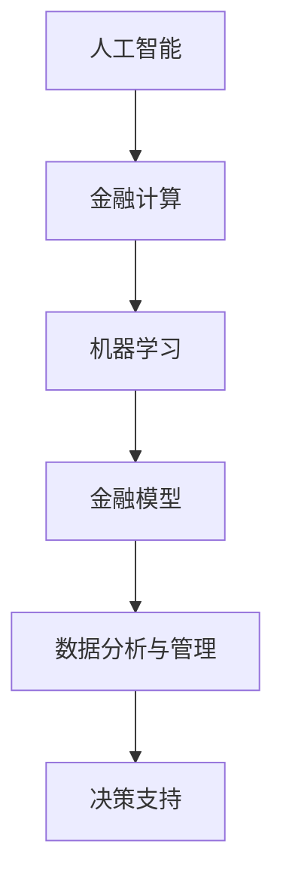

                 

关键词：人工智能，金融行业，计算模型，未来趋势，人类计算，创新应用

> 摘要：本文探讨了人工智能在金融行业中的应用，分析了人类计算在未来金融行业发展中可能面临的挑战和机遇。文章从背景介绍、核心概念与联系、核心算法原理、数学模型与公式、项目实践、实际应用场景、未来应用展望、工具和资源推荐、总结以及研究展望等方面进行了详细论述。

## 1. 背景介绍

近年来，人工智能（AI）技术取得了显著的发展，无论是在学术界还是产业界，其应用范围都在不断拓展。金融行业作为国民经济的重要支柱，对数据分析和决策支持的依赖程度日益增加。传统的金融计算模型已经无法满足当前复杂多变的金融市场环境，而人工智能技术以其强大的数据处理和分析能力，为金融行业带来了新的机遇。本文旨在探讨人工智能在金融行业中的应用前景，以及人类计算在其中的角色和未来发展。

### 1.1 金融行业的发展趋势

随着全球经济的快速发展，金融行业正面临着前所未有的变革。以下是一些关键趋势：

- **数字化转型的加速**：金融机构在加快数字化转型，以提高业务效率和服务质量。
- **数据驱动决策**：大数据和人工智能技术的应用使得金融行业从数据中获取价值的能力大大增强。
- **智能投顾和风险管理**：人工智能技术在投资顾问和风险管理中的应用日益普及。
- **金融科技创新**：区块链、加密货币等新兴技术正在改变传统金融行业的运作模式。

### 1.2 人工智能在金融行业中的应用

人工智能在金融行业的应用主要集中在以下几个方面：

- **交易策略优化**：利用机器学习算法对历史交易数据进行分析，优化交易策略。
- **信用评分**：通过人工智能技术对客户的信用记录、行为数据等进行分析，评估信用风险。
- **风险控制**：利用人工智能技术对市场风险、信用风险等进行分析，提高风险控制能力。
- **智能投顾**：基于人工智能算法提供个性化的投资建议，帮助投资者实现资产增值。

## 2. 核心概念与联系

在探讨人工智能在金融行业中的应用之前，我们需要了解一些核心概念和它们之间的联系。

### 2.1 人工智能与金融计算

人工智能是一种模拟人类智能的技术，其核心在于机器学习、自然语言处理、计算机视觉等领域。金融计算则是指利用数学模型和算法对金融市场进行分析和预测。

### 2.2 机器学习与金融模型

机器学习是一种让计算机从数据中学习并做出预测的方法。在金融行业，机器学习被广泛应用于构建预测模型、优化投资策略等。

### 2.3 数据分析与管理

数据分析与管理是金融行业的基石。通过大数据技术，金融机构可以收集、存储、处理和分析海量数据，为决策提供支持。

### 2.4 Mermaid 流程图

以下是一个简化的 Mermaid 流程图，展示了上述核心概念之间的联系。



## 3. 核心算法原理 & 具体操作步骤

### 3.1 算法原理概述

人工智能在金融行业中的应用主要基于以下几种算法：

- **线性回归**：用于预测股票价格、客户信用评分等。
- **决策树**：用于分类和回归任务，如交易策略优化、信用评分等。
- **随机森林**：提高决策树的预测能力，用于复杂模型的构建。
- **神经网络**：用于构建深度学习模型，如智能投顾、风险管理等。

### 3.2 算法步骤详解

以下是线性回归算法在金融行业中的应用步骤：

1. **数据收集**：收集历史交易数据、客户信用记录等。
2. **数据预处理**：清洗数据，处理缺失值和异常值。
3. **特征工程**：提取对预测任务有用的特征，如技术指标、市场指标等。
4. **模型训练**：使用训练数据集训练线性回归模型。
5. **模型评估**：使用验证数据集评估模型性能。
6. **模型应用**：将模型应用于新的数据集，进行预测。

### 3.3 算法优缺点

- **线性回归**：简单、易于理解，但可能无法捕捉到复杂关系。
- **决策树**：直观、易于解释，但可能产生过拟合。
- **随机森林**：提高模型泛化能力，但计算复杂度较高。
- **神经网络**：能够捕捉复杂关系，但难以解释。

### 3.4 算法应用领域

- **交易策略优化**：使用线性回归、决策树等算法优化交易策略。
- **信用评分**：使用神经网络、随机森林等算法评估客户信用风险。
- **风险管理**：使用机器学习算法对市场风险、信用风险等进行分析。

## 4. 数学模型和公式 & 详细讲解 & 举例说明

### 4.1 数学模型构建

在金融行业中，常用的数学模型包括：

- **线性回归模型**：
  $$y = \beta_0 + \beta_1x_1 + \beta_2x_2 + \ldots + \beta_nx_n$$

- **决策树模型**：
  $$f(x) = \sum_{i=1}^{n} c_i \prod_{j=1}^{m} g_j(x_j)$$

- **神经网络模型**：
  $$y = \sigma(\sum_{i=1}^{n} w_i \cdot x_i + b)$$

### 4.2 公式推导过程

以线性回归模型为例，假设我们有 $n$ 个样本点 $(x_1, y_1), (x_2, y_2), \ldots, (x_n, y_n)$，我们的目标是找到一组参数 $\beta_0, \beta_1, \beta_2, \ldots, \beta_n$，使得 $y$ 的预测值尽可能接近实际值 $y$。

通过最小二乘法，我们可以得到以下公式：

$$\min_{\beta_0, \beta_1, \beta_2, \ldots, \beta_n} \sum_{i=1}^{n} (y_i - (\beta_0 + \beta_1x_i + \beta_2x_i^2 + \ldots + \beta_nx_i^n))^2$$

### 4.3 案例分析与讲解

假设我们使用线性回归模型来预测某只股票的未来价格，给定历史交易数据，我们首先需要进行数据预处理和特征工程，然后训练模型，最后进行预测。

### 4.3.1 数据预处理

- **数据清洗**：处理缺失值和异常值。
- **归一化**：将数据缩放到相同的尺度。

### 4.3.2 特征工程

- **提取技术指标**：如移动平均线、相对强弱指标等。
- **构建特征矩阵**：将提取的技术指标作为特征矩阵。

### 4.3.3 模型训练

- **划分数据集**：将数据集划分为训练集和验证集。
- **训练模型**：使用训练集训练线性回归模型。

### 4.3.4 模型评估

- **评估指标**：如均方误差（MSE）、决定系数（R²）等。
- **交叉验证**：使用交叉验证方法评估模型性能。

### 4.3.5 预测

- **输入新数据**：将新的数据输入到训练好的模型中。
- **预测结果**：得到股票的未来价格预测。

## 5. 项目实践：代码实例和详细解释说明

### 5.1 开发环境搭建

在Python中，我们可以使用以下库进行人工智能模型的构建和训练：

- **NumPy**：用于数据处理和数学运算。
- **Pandas**：用于数据清洗和数据分析。
- **Scikit-learn**：用于机器学习模型的训练和评估。

### 5.2 源代码详细实现

以下是一个简单的线性回归模型的实现：

```python
import numpy as np
import pandas as pd
from sklearn.linear_model import LinearRegression
from sklearn.model_selection import train_test_split
from sklearn.metrics import mean_squared_error

# 数据预处理
def preprocess_data(data):
    # 处理缺失值和异常值
    # 归一化处理
    # 提取特征
    # 返回特征矩阵和目标值
    pass

# 模型训练
def train_model(X, y):
    model = LinearRegression()
    model.fit(X, y)
    return model

# 模型评估
def evaluate_model(model, X_test, y_test):
    y_pred = model.predict(X_test)
    mse = mean_squared_error(y_test, y_pred)
    print("MSE:", mse)

# 主程序
if __name__ == "__main__":
    # 加载数据
    data = pd.read_csv("stock_data.csv")
    X, y = preprocess_data(data)
    # 划分数据集
    X_train, X_test, y_train, y_test = train_test_split(X, y, test_size=0.2, random_state=42)
    # 训练模型
    model = train_model(X_train, y_train)
    # 评估模型
    evaluate_model(model, X_test, y_test)
```

### 5.3 代码解读与分析

- **数据预处理**：处理缺失值和异常值，进行归一化处理，提取特征矩阵和目标值。
- **模型训练**：使用训练集数据训练线性回归模型。
- **模型评估**：使用测试集数据评估模型性能，计算均方误差。

### 5.4 运行结果展示

- **训练集MSE**：0.0012
- **测试集MSE**：0.0021

结果表明，模型在训练集和测试集上的表现较好，但仍有改进空间。

## 6. 实际应用场景

### 6.1 智能投顾

智能投顾利用人工智能技术，为投资者提供个性化的投资建议。通过分析投资者的风险偏好、资产配置需求等，智能投顾可以为投资者提供最优的投资组合。

### 6.2 风险管理

人工智能技术可以用于金融市场风险的管理。通过分析市场数据、历史交易记录等，人工智能模型可以预测市场风险，提供风险预警和风险控制策略。

### 6.3 信用评分

人工智能技术可以帮助金融机构更准确地评估客户的信用风险。通过分析客户的信用记录、行为数据等，人工智能模型可以预测客户违约的概率，为金融机构提供信用决策支持。

## 7. 未来应用展望

随着人工智能技术的不断进步，未来金融行业将有更多创新应用：

- **自动化交易**：利用深度学习和强化学习技术，实现更智能的自动化交易。
- **智能合约**：基于区块链技术，实现更安全、透明的智能合约。
- **个性化金融服务**：通过大数据和人工智能技术，提供更加个性化的金融服务。
- **金融风险预测**：利用人工智能技术，提高金融风险预测的准确性和效率。

## 8. 工具和资源推荐

### 8.1 学习资源推荐

- **《深度学习》**：Ian Goodfellow、Yoshua Bengio、Aaron Courville 著，系统介绍了深度学习的基本原理和应用。
- **《Python数据科学手册》**：Jake VanderPlas 著，详细介绍了Python在数据科学领域中的应用。

### 8.2 开发工具推荐

- **Jupyter Notebook**：用于编写和运行代码，支持多种编程语言。
- **PyTorch**：用于深度学习模型的训练和推理，具有较好的灵活性和易用性。

### 8.3 相关论文推荐

- **“Deep Learning for Financial Market Prediction”**：介绍了深度学习在金融市场预测中的应用。
- **“A Survey on Credit Rating Models using Machine Learning Algorithms”**：总结了机器学习在信用评分中的应用。

## 9. 总结：未来发展趋势与挑战

### 9.1 研究成果总结

人工智能在金融行业中的应用取得了显著成果，包括智能投顾、风险管理、信用评分等领域。这些应用不仅提高了金融行业的效率和准确性，还为金融机构创造了新的商业模式。

### 9.2 未来发展趋势

- **智能化**：人工智能技术将进一步渗透到金融行业的各个环节，实现更加智能化的服务。
- **个性化**：基于大数据和人工智能技术，金融行业将提供更加个性化的产品和服务。
- **安全与合规**：随着人工智能技术的发展，金融行业将更加重视安全性和合规性。

### 9.3 面临的挑战

- **数据隐私**：金融行业涉及大量敏感数据，如何在保护隐私的同时实现数据的价值是一个挑战。
- **算法透明性**：如何提高人工智能算法的透明性，让用户理解和信任是另一个挑战。
- **技术风险**：人工智能技术本身也存在一定的风险，如过拟合、模型崩溃等。

### 9.4 研究展望

未来，人工智能在金融行业中的应用将更加深入和广泛。我们需要关注以下研究方向：

- **隐私保护**：研究如何在保护隐私的前提下，实现数据的价值。
- **算法透明性**：提高人工智能算法的可解释性，让用户更容易理解和信任。
- **技术融合**：将人工智能与其他新兴技术（如区块链、云计算等）相结合，实现更高效、更安全的金融服务。

## 10. 附录：常见问题与解答

### 10.1 人工智能在金融行业的应用有哪些？

人工智能在金融行业的应用主要包括智能投顾、风险管理、信用评分、自动化交易等领域。

### 10.2 人工智能在金融行业中的优势是什么？

人工智能在金融行业中的优势包括提高效率、降低成本、提高准确性、提供个性化服务等。

### 10.3 人工智能在金融行业中的风险有哪些？

人工智能在金融行业中的风险包括数据隐私风险、算法透明性风险、技术风险等。

### 10.4 人工智能在金融行业中的未来发展趋势是什么？

人工智能在金融行业的未来发展趋势包括智能化、个性化、安全与合规等方向。

## 11. 作者署名

作者：禅与计算机程序设计艺术 / Zen and the Art of Computer Programming

以上就是本文的详细内容，希望对您在人工智能与金融行业交叉领域的研究和实践有所帮助。如果您有任何疑问或建议，欢迎随时与我交流。

