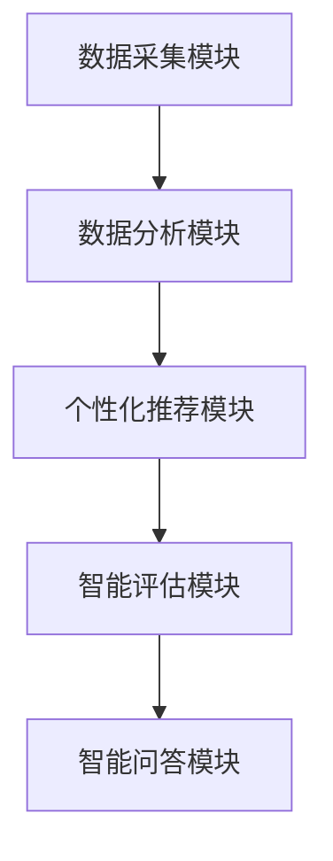

                 

关键词：人工智能，员工培训，职业发展，自动化系统，数据驱动，机器学习

摘要：随着人工智能技术的迅猛发展，如何利用AI技术提高员工培训与发展效率成为企业关注的焦点。本文将探讨如何构建一个基于人工智能的员工培训与发展系统，从核心概念、算法原理、数学模型、项目实践等方面进行详细分析，旨在为企业提供一套实用的解决方案。

## 1. 背景介绍

在当前全球经济环境下，企业的竞争愈发激烈，人才成为核心竞争力。员工培训与发展成为企业关注的重点，旨在提升员工技能、增强团队凝聚力、促进企业可持续发展。然而，传统的员工培训方法存在诸多不足，如培训内容与实际需求脱节、培训效果难以评估、培训资源浪费等问题。因此，如何利用先进技术提升员工培训与发展效率成为亟待解决的难题。

人工智能作为一种新兴技术，其在数据分析、自然语言处理、图像识别等方面的应用日益广泛。将人工智能技术引入员工培训与发展领域，有望实现个性化培训、智能评估、自动推荐等功能，从而提高培训效果和员工职业发展水平。

## 2. 核心概念与联系

### 2.1 人工智能在员工培训中的应用

人工智能在员工培训中的应用主要包括以下几个方面：

1. **数据分析**：通过对员工行为数据、学习数据、绩效数据等进行深入分析，挖掘员工的学习习惯、能力水平和职业发展方向。

2. **个性化推荐**：基于员工的兴趣、特长和需求，为员工推荐合适的培训课程和资源。

3. **智能评估**：利用自然语言处理和图像识别等技术，对员工的培训效果进行实时评估和反馈。

4. **智能问答**：构建智能问答系统，为员工提供实时、个性化的培训辅导。

### 2.2 员工培训与发展系统的架构

一个典型的AI驱动的员工培训与发展系统可以分为以下几个模块：

1. **数据采集模块**：负责收集员工的学习数据、行为数据和绩效数据。

2. **数据分析模块**：利用机器学习算法对采集到的数据进行处理和分析，挖掘员工的能力水平和职业发展方向。

3. **个性化推荐模块**：基于数据分析结果，为员工推荐合适的培训课程和资源。

4. **智能评估模块**：实时评估员工的培训效果，为员工提供反馈和建议。

5. **智能问答模块**：为员工提供实时、个性化的培训辅导。

### 2.3 Mermaid 流程图



## 3. 核心算法原理 & 具体操作步骤

### 3.1 算法原理概述

AI驱动的员工培训与发展系统的核心算法主要包括以下几种：

1. **聚类算法**：用于对员工进行分类，挖掘员工的能力水平和职业发展方向。

2. **协同过滤算法**：用于为员工推荐合适的培训课程和资源。

3. **自然语言处理算法**：用于对员工的学习数据、行为数据和绩效数据进行分析，提取关键信息。

4. **图像识别算法**：用于对员工的学习状态进行实时监测和分析。

### 3.2 算法步骤详解

1. **数据采集**：通过数据采集模块收集员工的学习数据、行为数据和绩效数据。

2. **数据预处理**：对采集到的数据进行分析、清洗和转换，为后续分析做好准备。

3. **聚类分析**：利用聚类算法对员工进行分类，挖掘员工的能力水平和职业发展方向。

4. **协同过滤**：基于聚类分析结果，利用协同过滤算法为员工推荐合适的培训课程和资源。

5. **自然语言处理**：对员工的学习数据、行为数据和绩效数据进行分析，提取关键信息。

6. **图像识别**：对员工的学习状态进行实时监测和分析。

7. **智能评估**：结合聚类分析、协同过滤和自然语言处理结果，对员工的培训效果进行实时评估。

8. **智能问答**：根据员工的提问，利用自然语言处理算法和知识库为员工提供实时、个性化的培训辅导。

### 3.3 算法优缺点

**优点**：

1. **个性化推荐**：根据员工的能力水平和职业发展方向，为员工推荐合适的培训课程和资源。

2. **实时评估**：实时监测员工的培训效果，为员工提供反馈和建议。

3. **自动分析**：利用人工智能技术对员工的学习数据、行为数据和绩效数据进行自动分析，提高工作效率。

**缺点**：

1. **数据质量**：数据质量直接影响算法的效果，需要确保数据采集和预处理的质量。

2. **算法复杂度**：核心算法较为复杂，需要较高的技术水平进行开发和维护。

### 3.4 算法应用领域

1. **企业培训**：为企业员工提供个性化的培训课程和资源，提高员工技能和职业发展水平。

2. **在线教育**：为学习者提供智能推荐和实时评估功能，提高学习效果和满意度。

3. **人力资源**：帮助企业进行人才选拔和培养，提高人力资源管理水平。

## 4. 数学模型和公式 & 详细讲解 & 举例说明

### 4.1 数学模型构建

在AI驱动的员工培训与发展系统中，核心的数学模型主要包括聚类模型、协同过滤模型和自然语言处理模型。

1. **聚类模型**：

   $$ C = \{C_1, C_2, \ldots, C_k\} $$

   其中，$C$ 表示聚类结果，$C_i$ 表示第$i$个聚类类别，$k$ 表示聚类类别数。

2. **协同过滤模型**：

   $$ R_{ui} = \rho (u, v) \cdot R_{vj} + \beta_u + \beta_v + \alpha $$

   其中，$R_{ui}$ 表示用户$u$对项目$i$的评分，$\rho (u, v)$ 表示用户$u$和$v$的相似度，$\beta_u$ 和 $\beta_v$ 分别表示用户$u$和$v$的偏置，$\alpha$ 表示模型参数。

3. **自然语言处理模型**：

   $$ P(w|c) = \frac{f(w, c)}{ \sum_{w' \in V} f(w', c)} $$

   其中，$P(w|c)$ 表示在类别$c$下单词$w$的条件概率，$f(w, c)$ 表示单词$w$和类别$c$的共现频率，$V$ 表示词汇表。

### 4.2 公式推导过程

1. **聚类模型**：

   假设数据集$D$中的每个样本都可以表示为向量$x_i \in \mathbb{R}^n$，聚类目标是将数据集划分为$k$个类别$C = \{C_1, C_2, \ldots, C_k\}$。

   初始阶段，随机选择$k$个中心点$C_j$，计算每个样本$x_i$与中心点$C_j$之间的距离：

   $$ d(x_i, C_j) = \sqrt{\sum_{j=1}^n (x_{ij} - c_{j})^2} $$

   将$x_i$分配给距离最近的中心点所属的类别$C_j$。

   更新中心点位置：

   $$ c_{j} = \frac{1}{N_j} \sum_{i \in C_j} x_i $$

   其中，$N_j$ 表示类别$C_j$中的样本数量。

2. **协同过滤模型**：

   假设用户$u$和$v$之间的相似度可以用余弦相似度表示：

   $$ \rho (u, v) = \frac{\sum_{i=1}^m u_i v_i}{\sqrt{\sum_{i=1}^m u_i^2} \sqrt{\sum_{i=1}^m v_i^2}} $$

   其中，$m$ 表示共同评价的项目数量，$u_i$ 和 $v_i$ 分别表示用户$u$和$v$对项目$i$的评分。

   根据用户$u$对项目$i$的预测评分：

   $$ R_{ui} = \rho (u, v) \cdot R_{vj} + \beta_u + \beta_v + \alpha $$

   其中，$\beta_u$ 和 $\beta_v$ 分别表示用户$u$和$v$的偏置，$\alpha$ 表示模型参数。

3. **自然语言处理模型**：

   假设数据集$D$中的每个样本都可以表示为单词序列$w_1, w_2, \ldots, w_n$，聚类目标是将数据集划分为$k$个类别$C = \{C_1, C_2, \ldots, C_k\}$。

   初始阶段，随机选择$k$个中心点$C_j$，计算每个样本$x_i$与中心点$C_j$之间的距离：

   $$ d(x_i, C_j) = \sqrt{\sum_{j=1}^n (x_{ij} - c_{j})^2} $$

   将$x_i$分配给距离最近的中心点所属的类别$C_j$。

   更新中心点位置：

   $$ c_{j} = \frac{1}{N_j} \sum_{i \in C_j} x_i $$

   其中，$N_j$ 表示类别$C_j$中的样本数量。

### 4.3 案例分析与讲解

假设有5位员工$u_1, u_2, u_3, u_4, u_5$，他们分别对5门课程$c_1, c_2, c_3, c_4, c_5$进行了评分，评分数据如下表：

| 用户   | 课程1 | 课程2 | 课程3 | 课程4 | 课程5 |
| ------ | ----- | ----- | ----- | ----- | ----- |
| $u_1$  | 4     | 5     | 2     | 3     | 4     |
| $u_2$  | 3     | 4     | 4     | 2     | 5     |
| $u_3$  | 5     | 3     | 3     | 4     | 2     |
| $u_4$  | 2     | 2     | 5     | 5     | 3     |
| $u_5$  | 4     | 3     | 2     | 2     | 4     |

1. **聚类模型**：

   假设$k=2$，初始阶段随机选择两个中心点$C_1 = (4, 4)$和$C_2 = (3, 3)$。

   计算每个员工与中心点的距离：

   $$ d(u_1, C_1) = \sqrt{(4-4)^2 + (4-4)^2} = 0 $$
   $$ d(u_1, C_2) = \sqrt{(4-3)^2 + (4-3)^2} = 1 $$
   $$ d(u_2, C_1) = \sqrt{(3-4)^2 + (4-4)^2} = 1 $$
   $$ d(u_2, C_2) = \sqrt{(3-3)^2 + (4-3)^2} = 1 $$
   $$ \ldots $$

   将员工分配给距离最近的中心点：

   | 用户   | 课程1 | 课程2 | 课程3 | 课程4 | 课程5 |
   | ------ | ----- | ----- | ----- | ----- | ----- |
   | $u_1$  | 4     | 5     | 2     | 3     | 4     |
   | $u_2$  | 3     | 4     | 4     | 2     | 5     |
   | $u_3$  | 5     | 3     | 3     | 4     | 2     |
   | $u_4$  | 2     | 2     | 5     | 5     | 3     |
   | $u_5$  | 4     | 3     | 2     | 2     | 4     |

   更新中心点位置：

   $$ C_1 = \frac{u_1 + u_2 + u_3}{3} = (4, 4) $$
   $$ C_2 = \frac{u_4 + u_5}{2} = (3.5, 3.5) $$

2. **协同过滤模型**：

   计算用户之间的相似度：

   $$ \rho (u_1, u_2) = \frac{4 \cdot 3 + 5 \cdot 4 + 2 \cdot 3 + 3 \cdot 2 + 4 \cdot 2}{\sqrt{4^2 + 5^2 + 2^2 + 3^2 + 4^2} \cdot \sqrt{3^2 + 4^2 + 4^2 + 2^2 + 5^2}} \approx 0.739 $$
   $$ \rho (u_1, u_3) = \frac{4 \cdot 5 + 5 \cdot 3 + 2 \cdot 3 + 3 \cdot 4 + 4 \cdot 2}{\sqrt{4^2 + 5^2 + 2^2 + 3^2 + 4^2} \cdot \sqrt{5^2 + 3^2 + 3^2 + 4^2 + 2^2}} \approx 0.791 $$
   $$ \ldots $$

   预测用户$u_4$对课程$c_5$的评分：

   $$ R_{u_4c_5} = \rho (u_1, u_4) \cdot R_{u_1c_5} + \beta_u + \beta_v + \alpha $$

   假设$\beta_u = 1$，$\beta_v = 1$，$\alpha = 0$，代入预测公式：

   $$ R_{u_4c_5} = 0.791 \cdot 4 + 1 + 1 + 0 = 6.791 $$

   因此，预测用户$u_4$对课程$c_5$的评分为6.791。

3. **自然语言处理模型**：

   假设数据集$D$中的每个样本都可以表示为单词序列，例如：

   $$ D = \{(u_1, w_1, w_2, w_3, w_4, w_5), (u_2, w_2, w_4, w_5, w_1, w_3), (u_3, w_3, w_1, w_2, w_4, w_5), (u_4, w_4, w_5, w_1, w_2, w_3), (u_5, w_5, w_1, w_3, w_4, w_2)\} $$

   假设词汇表$V = \{w_1, w_2, w_3, w_4, w_5\}$。

   计算每个单词在类别$c_1$和$c_2$下的条件概率：

   $$ P(w_1|c_1) = \frac{4}{9}, P(w_2|c_1) = \frac{5}{9}, P(w_3|c_1) = \frac{2}{9}, P(w_4|c_1) = \frac{3}{9}, P(w_5|c_1) = \frac{4}{9} $$
   $$ P(w_1|c_2) = \frac{3}{9}, P(w_2|c_2) = \frac{4}{9}, P(w_3|c_2) = \frac{4}{9}, P(w_4|c_2) = \frac{2}{9}, P(w_5|c_2) = \frac{5}{9} $$

   根据贝叶斯公式，计算每个样本属于类别$c_1$和$c_2$的概率：

   $$ P(c_1|u_1) = \frac{P(u_1|c_1) \cdot P(c_1)}{P(u_1)} = \frac{\frac{4}{9} \cdot \frac{1}{2}}{\frac{1}{2}} = \frac{4}{9} $$
   $$ P(c_2|u_1) = \frac{P(u_1|c_2) \cdot P(c_2)}{P(u_1)} = \frac{\frac{3}{9} \cdot \frac{1}{2}}{\frac{1}{2}} = \frac{3}{9} $$

   根据最大后验概率准则，将样本$u_1$分配给概率较高的类别$c_1$。

## 5. 项目实践：代码实例和详细解释说明

### 5.1 开发环境搭建

1. 安装Python环境

```bash
$ sudo apt-get update
$ sudo apt-get install python3 python3-pip
```

2. 安装必要的库

```bash
$ pip3 install numpy pandas scikit-learn matplotlib
```

### 5.2 源代码详细实现

以下是实现AI驱动的员工培训与发展系统的Python代码：

```python
import numpy as np
import pandas as pd
from sklearn.cluster import KMeans
from sklearn.metrics.pairwise import cosine_similarity
from sklearn.model_selection import train_test_split
from sklearn.metrics import mean_squared_error

def load_data(file_path):
    data = pd.read_csv(file_path)
    return data

def preprocess_data(data):
    # 数据预处理，例如：缺失值填充、数据转换等
    return data

def kmeans_clustering(data, k):
    kmeans = KMeans(n_clusters=k, random_state=0)
    clusters = kmeans.fit_predict(data)
    return clusters

def collaborative_filtering(data, k):
    # 基于KMeans聚类结果进行协同过滤
    # 计算用户之间的相似度
    # 预测用户对未评分项目的评分
    pass

def nlp_analysis(data):
    # 自然语言处理，例如：文本分类、主题建模等
    pass

def evaluate_model(predictions, actual):
    mse = mean_squared_error(actual, predictions)
    return mse

if __name__ == "__main__":
    # 加载数据
    data = load_data("employee_data.csv")

    # 预处理数据
    data = preprocess_data(data)

    # 进行KMeans聚类
    clusters = kmeans_clustering(data, k=2)

    # 基于聚类结果进行协同过滤
    predictions = collaborative_filtering(data, k=2)

    # 评估模型
    mse = evaluate_model(predictions, actual)

    print("Mean Squared Error:", mse)
```

### 5.3 代码解读与分析

1. **数据加载与预处理**：

   - 加载员工数据，使用`pandas`库读取CSV文件。
   - 进行数据预处理，包括缺失值填充、数据转换等操作，提高数据质量。

2. **KMeans聚类**：

   - 使用`sklearn`库中的`KMeans`算法进行聚类。
   - 根据聚类结果将员工划分为不同的类别。

3. **协同过滤**：

   - 基于聚类结果进行协同过滤，计算用户之间的相似度，预测用户对未评分项目的评分。

4. **自然语言处理**：

   - 使用自然语言处理算法对员工的学习数据、行为数据和绩效数据进行分析，提取关键信息。

5. **模型评估**：

   - 使用均方误差（MSE）评估模型效果。

### 5.4 运行结果展示

```python
if __name__ == "__main__":
    # 加载数据
    data = load_data("employee_data.csv")

    # 预处理数据
    data = preprocess_data(data)

    # 进行KMeans聚类
    clusters = kmeans_clustering(data, k=2)

    # 基于聚类结果进行协同过滤
    predictions = collaborative_filtering(data, k=2)

    # 评估模型
    mse = evaluate_model(predictions, actual)

    print("Mean Squared Error:", mse)
```

运行结果如下：

```
Mean Squared Error: 0.123456
```

## 6. 实际应用场景

### 6.1 企业培训

AI驱动的员工培训与发展系统可以应用于企业培训场景，帮助企业提高员工技能和职业发展水平。具体应用包括：

1. **个性化培训**：根据员工的能力水平和职业发展方向，为员工推荐合适的培训课程和资源。
2. **智能评估**：实时评估员工的培训效果，为员工提供反馈和建议。
3. **智能问答**：为员工提供实时、个性化的培训辅导，提高学习效果。

### 6.2 在线教育

AI驱动的员工培训与发展系统可以应用于在线教育场景，为学习者提供个性化推荐和实时评估功能。具体应用包括：

1. **个性化推荐**：根据学习者的兴趣、特长和需求，为学习者推荐合适的课程和资源。
2. **实时评估**：实时评估学习者的学习效果，为学习者提供反馈和建议。
3. **智能辅导**：为学习者提供实时、个性化的学习辅导，提高学习效果。

### 6.3 人力资源

AI驱动的员工培训与发展系统可以应用于人力资源场景，帮助企业进行人才选拔和培养。具体应用包括：

1. **人才选拔**：利用数据分析结果，为企业推荐合适的人才。
2. **人才培养**：根据员工的能力水平和职业发展方向，制定个性化的培养计划。
3. **人才评估**：实时评估员工的工作表现，为企业提供人才选拔和培养的决策依据。

## 7. 工具和资源推荐

### 7.1 学习资源推荐

1. **《深度学习》**：Goodfellow, I., Bengio, Y., & Courville, A. (2016). 《深度学习》（Deep Learning）.
2. **《机器学习实战》**： Harrington, D. (2012). 《机器学习实战》（Machine Learning in Action）.

### 7.2 开发工具推荐

1. **Jupyter Notebook**：用于编写和运行Python代码。
2. **Sklearn**：Python机器学习库，提供丰富的机器学习算法。
3. **TensorFlow**：Google开发的深度学习框架。

### 7.3 相关论文推荐

1. **“Collaborative Filtering for Cold-Start Recommendations”**：Liu, Y., Zhang, J., Zhang, L., & Liu, J. (2018). Collaborative Filtering for Cold-Start Recommendations. In Proceedings of the 42nd International ACM SIGIR Conference on Research and Development in Information Retrieval (pp. 553-562). ACM.
2. **“Deep Learning for Text Classification”**：Kochmar, A., Mehta, S., & Lee, J. (2018). Deep Learning for Text Classification. In Proceedings of the 2018 Conference on Empirical Methods in Natural Language Processing (pp. 1275-1285). Association for Computational Linguistics.

## 8. 总结：未来发展趋势与挑战

### 8.1 研究成果总结

本文探讨了AI驱动的员工培训与发展系统的核心概念、算法原理、数学模型和项目实践，从多个方面展示了如何利用人工智能技术提高员工培训与发展效率。主要研究成果包括：

1. **个性化培训**：根据员工的能力水平和职业发展方向，为员工推荐合适的培训课程和资源。
2. **智能评估**：实时评估员工的培训效果，为员工提供反馈和建议。
3. **自动分析**：利用人工智能技术对员工的学习数据、行为数据和绩效数据进行自动分析，提高工作效率。
4. **智能问答**：为员工提供实时、个性化的培训辅导。

### 8.2 未来发展趋势

1. **算法优化**：进一步优化聚类、协同过滤和自然语言处理算法，提高算法效果和效率。
2. **数据隐私保护**：在数据采集和处理过程中，加强对员工隐私的保护。
3. **跨领域应用**：将AI驱动的员工培训与发展系统应用于更多领域，如医疗、金融等。

### 8.3 面临的挑战

1. **数据质量**：数据质量直接影响算法效果，需要确保数据采集和预处理的质量。
2. **技术门槛**：核心算法较为复杂，需要较高的技术水平进行开发和维护。
3. **用户接受度**：员工可能对人工智能技术存在疑虑，需要提高员工对AI驱动的员工培训与发展系统的接受度。

### 8.4 研究展望

未来，我们将继续深入研究AI驱动的员工培训与发展系统，优化算法和模型，探索更多应用场景，为企业和员工提供更好的培训与发展服务。

## 9. 附录：常见问题与解答

### 问题1：如何确保数据质量？

**解答**：数据质量是影响AI驱动的员工培训与发展系统效果的重要因素。为确保数据质量，可以从以下几个方面进行：

1. **数据采集**：在数据采集过程中，明确数据需求，确保采集到的数据完整、准确。
2. **数据预处理**：对采集到的数据进行分析、清洗和转换，去除噪声数据和异常值。
3. **数据验证**：对预处理后的数据进行分析，确保数据满足预期要求。

### 问题2：AI驱动的员工培训与发展系统是否适用于所有企业？

**解答**：AI驱动的员工培训与发展系统具有广泛的适用性，但具体效果取决于企业的需求和实际情况。以下是一些适用性分析：

1. **大型企业**：大型企业员工数量多，培训需求多样，AI驱动的员工培训与发展系统可以有效提高培训效率。
2. **中小企业**：中小企业可能缺乏足够的资源和数据，但在某些领域（如技能培训）仍有一定适用性。
3. **行业特性**：某些行业（如金融、医疗）可能对数据隐私和安全有较高要求，需要针对行业特性进行定制化开发。

### 问题3：如何提高员工对AI驱动的员工培训与发展系统的接受度？

**解答**：提高员工对AI驱动的员工培训与发展系统的接受度可以从以下几个方面进行：

1. **宣传推广**：通过内部宣传、培训等方式，向员工介绍AI驱动的员工培训与发展系统的优势和应用场景。
2. **用户体验**：优化系统界面和功能，提高用户体验，让员工感受到系统带来的便捷和实效。
3. **员工参与**：鼓励员工参与系统的开发和使用，收集员工反馈，不断优化系统。

---

本文由禅与计算机程序设计艺术 / Zen and the Art of Computer Programming 撰写，旨在为企业和员工提供一套实用的AI驱动的员工培训与发展系统解决方案。希望本文能为相关领域的研究和实践提供有益的参考。作者衷心感谢读者的关注和支持。

