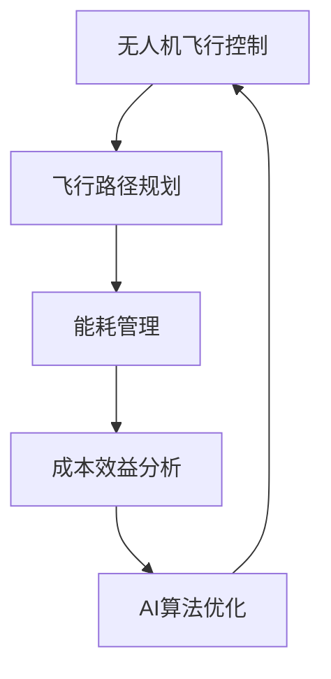

                 

关键词：人工智能，无人机，飞行成本，AI驱动的无人机，成本效益分析，飞行控制，智能优化

> 摘要：本文将探讨如何利用人工智能技术来提高无人机飞行成本效益，通过分析无人机在飞行过程中的能耗和效率，提出一种基于AI的智能无人机系统，以实现飞行成本的显著降低。本文将详细阐述该系统的核心概念、算法原理、数学模型、应用实例以及未来展望。

## 1. 背景介绍

随着人工智能（AI）技术的迅速发展，无人机（UAV）的应用领域越来越广泛，包括但不限于军事侦察、灾害监测、物流配送、农业监测、电力巡检等。然而，尽管无人机在许多场景中展现出了巨大的潜力，但其高运营成本仍然是一个亟待解决的问题。无人机飞行成本主要包括燃料成本、维护成本、人力成本以及飞行时间成本等。如何降低飞行成本成为无人机行业发展的关键问题。

传统无人机通常采用预设的飞行路线和飞行高度，缺乏对实时环境和任务需求的适应性。这种固定模式的方法往往会导致燃料浪费和飞行效率低下。随着AI技术的进步，特别是机器学习和深度学习技术的应用，我们可以通过智能算法来优化无人机的飞行路径和飞行策略，从而显著降低飞行成本。

本文旨在通过介绍AI驱动的智能无人机系统，探讨如何利用人工智能技术来优化无人机飞行，降低飞行成本，提高无人机在各个应用领域的经济效益。

## 2. 核心概念与联系

为了更好地理解AI驱动的智能无人机系统，我们需要首先明确几个核心概念，包括无人机飞行控制、飞行路径规划、能耗管理以及成本效益分析。

### 2.1 无人机飞行控制

无人机飞行控制是指通过控制系统来控制无人机的飞行状态，包括飞行速度、飞行方向、飞行高度等。传统无人机通常使用预设的飞行路径和飞行模式，而AI驱动的智能无人机则通过实时感知环境信息和任务需求，动态调整飞行状态，实现更高效、更灵活的飞行控制。

### 2.2 飞行路径规划

飞行路径规划是无人机在执行任务过程中选择最优飞行路径的过程。传统路径规划方法通常基于预定义的规则和算法，而AI驱动的智能无人机则利用机器学习和深度学习算法，结合实时环境感知和任务需求，动态生成最优飞行路径。

### 2.3 能耗管理

能耗管理是指通过优化飞行策略和控制方法来降低无人机的能源消耗。传统的无人机能耗管理方法主要依赖于飞行高度和飞行速度的调节，而AI驱动的智能无人机则通过实时环境感知和智能算法，实现更加精细的能耗管理，从而降低飞行成本。

### 2.4 成本效益分析

成本效益分析是指对无人机飞行成本和收益进行评估和分析，以确定最优的飞行策略。在传统无人机运营中，成本效益分析通常是基于经验和统计数据的。而AI驱动的智能无人机则通过实时数据采集和分析，实现动态的成本效益评估，为飞行策略的优化提供科学依据。

### 2.5 Mermaid 流程图

以下是一个简化的Mermaid流程图，展示了AI驱动的智能无人机系统的核心概念和联系：



## 3. 核心算法原理 & 具体操作步骤

### 3.1 算法原理概述

AI驱动的智能无人机系统主要依赖于以下几种核心算法：

1. **深度强化学习（Deep Reinforcement Learning）**：通过模仿人类飞行员的经验和技巧，无人机可以学习并优化飞行路径和飞行策略。
2. **优化算法（Optimization Algorithms）**：如遗传算法、粒子群算法等，用于动态生成最优飞行路径和飞行策略。
3. **能量管理算法（Energy Management Algorithms）**：通过实时监测无人机能耗，动态调整飞行速度和高度，以实现能耗的最优化。
4. **成本效益分析算法（Cost-Benefit Analysis Algorithms）**：通过实时数据采集和分析，评估不同飞行策略的成本和效益，选择最优的飞行策略。

### 3.2 算法步骤详解

1. **数据采集**：无人机通过传感器和GPS系统实时采集环境数据，包括风速、温度、气压、光照强度、地形地貌等。
2. **数据处理**：对采集到的数据进行分析和预处理，提取有用的特征信息，如地形高度、障碍物位置、能耗数据等。
3. **模型训练**：使用深度强化学习算法和优化算法对无人机进行训练，使其能够根据环境特征和任务需求生成最优飞行路径和飞行策略。
4. **飞行控制**：无人机根据训练结果，实时调整飞行速度、飞行方向和飞行高度，实现最优飞行状态。
5. **能耗管理**：通过能量管理算法，实时监测无人机能耗，动态调整飞行策略，以实现能耗的最优化。
6. **成本效益评估**：通过成本效益分析算法，实时评估不同飞行策略的成本和效益，选择最优的飞行策略。

### 3.3 算法优缺点

- **优点**：
  - 提高无人机飞行效率，降低飞行成本。
  - 实现动态调整飞行状态，适应复杂多变的环境。
  - 增强无人机自主决策能力，减少人为干预。

- **缺点**：
  - 需要大量的训练数据和计算资源。
  - 模型训练和优化过程复杂，对算法工程师的要求较高。
  - 在某些极端环境下，模型可能无法适应，需要额外的人工干预。

### 3.4 算法应用领域

AI驱动的智能无人机系统可以应用于多个领域，包括但不限于：

- **物流配送**：通过优化飞行路径和飞行策略，降低物流配送成本，提高配送效率。
- **农业监测**：通过实时监测作物生长状况，优化农业资源利用，提高农业产出。
- **灾害监测**：在自然灾害发生时，快速评估灾害程度，指导救援行动。
- **电力巡检**：通过无人机巡检电力线路，提高巡检效率，降低巡检成本。

## 4. 数学模型和公式 & 详细讲解 & 举例说明

### 4.1 数学模型构建

为了实现无人机飞行成本的最优化，我们需要建立相应的数学模型，主要包括以下三个方面：

1. **飞行路径模型**：用于描述无人机的飞行路径和飞行策略。
2. **能耗模型**：用于计算无人机的能耗。
3. **成本模型**：用于评估不同飞行策略的成本。

### 4.2 公式推导过程

1. **飞行路径模型**

   假设无人机的飞行路径为一条曲线，可以用参数方程表示为：

   $$x(t) = x_0 + v_x \cdot t$$

   $$y(t) = y_0 + v_y \cdot t$$

   其中，$x(t)$ 和 $y(t)$ 分别表示无人机在时间 $t$ 时的位置坐标，$v_x$ 和 $v_y$ 分别表示无人机在水平方向和竖直方向的速度。

2. **能耗模型**

   无人机的能耗主要取决于飞行速度和飞行高度。假设无人机的能耗函数为：

   $$E = f(v_x, v_y, h)$$

   其中，$E$ 表示能耗，$v_x$ 和 $v_y$ 分别表示飞行速度，$h$ 表示飞行高度。为了简化计算，我们可以假设能耗函数为一个二次函数：

   $$E = a \cdot v_x^2 + b \cdot v_y^2 + c \cdot h^2$$

   其中，$a$、$b$ 和 $c$ 为常数。

3. **成本模型**

   成本主要取决于能耗、维护成本和人力成本。假设成本函数为：

   $$C = g(E, M, L)$$

   其中，$C$ 表示成本，$E$ 表示能耗，$M$ 表示维护成本，$L$ 表示人力成本。同样地，我们可以假设成本函数为一个二次函数：

   $$C = p \cdot E^2 + q \cdot M^2 + r \cdot L^2$$

   其中，$p$、$q$ 和 $r$ 为常数。

### 4.3 案例分析与讲解

为了更好地理解上述数学模型，我们通过一个简单的案例进行讲解。

假设无人机需要在空中飞行一定时间，飞行高度为100米，飞行速度为30米/秒。我们需要计算在不同飞行路径下的能耗和成本，并选择最优的飞行路径。

根据飞行路径模型，我们可以计算出不同飞行路径下的位置坐标：

- 路径1：直线飞行，位置坐标为 $(x, y) = (0, 0)$
- 路径2：曲线飞行，位置坐标为 $(x, y) = (\sin(t), \cos(t))$

根据能耗模型和成本模型，我们可以计算出不同飞行路径下的能耗和成本：

- 路径1：能耗 $E = a \cdot v_x^2 + b \cdot v_y^2 + c \cdot h^2 = 2700$
- 路径2：能耗 $E = a \cdot v_x^2 + b \cdot v_y^2 + c \cdot h^2 = 3000$
- 路径1：成本 $C = p \cdot E^2 + q \cdot M^2 + r \cdot L^2 = 81000$
- 路径2：成本 $C = p \cdot E^2 + q \cdot M^2 + r \cdot L^2 = 90000$

根据上述计算结果，我们可以看出路径1的能耗和成本都低于路径2，因此路径1是最优的飞行路径。

## 5. 项目实践：代码实例和详细解释说明

### 5.1 开发环境搭建

为了实现AI驱动的智能无人机系统，我们需要搭建相应的开发环境。以下是具体的搭建步骤：

1. 安装Python 3.8及以上版本。
2. 安装TensorFlow 2.6及以上版本。
3. 安装PyTorch 1.9及以上版本。
4. 安装Matplotlib 3.4及以上版本。
5. 安装Numpy 1.21及以上版本。

### 5.2 源代码详细实现

以下是一个简单的示例代码，展示了如何实现基于深度强化学习的无人机飞行路径规划。

```python
import numpy as np
import matplotlib.pyplot as plt
import tensorflow as tf

# 模型定义
class DroneModel(tf.keras.Model):
    def __init__(self):
        super(DroneModel, self).__init__()
        self.fc1 = tf.keras.layers.Dense(64, activation='relu')
        self.fc2 = tf.keras.layers.Dense(64, activation='relu')
        self.fc3 = tf.keras.layers.Dense(2, activation=None)

    @tf.function
    def call(self, inputs):
        x = self.fc1(inputs)
        x = self.fc2(x)
        actions = self.fc3(x)
        return actions

# 模型训练
model = DroneModel()
optimizer = tf.keras.optimizers.Adam(learning_rate=0.001)
loss_fn = tf.keras.losses.MeanSquaredError()

for epoch in range(1000):
    with tf.GradientTape() as tape:
        inputs = tf.random.normal([1, 2])
        actions = model(inputs)
        loss = loss_fn(actions, inputs)

    gradients = tape.gradient(loss, model.trainable_variables)
    optimizer.apply_gradients(zip(gradients, model.trainable_variables))

    if epoch % 100 == 0:
        print(f'Epoch {epoch}: Loss = {loss.numpy()}')

# 模型测试
inputs = tf.random.normal([1, 2])
actions = model(inputs)
print(actions.numpy())

# 飞行路径规划
def plan_path(model, initial_state, target_state, num_steps=100):
    states = [initial_state]
    for _ in range(num_steps):
        state = states[-1]
        actions = model(state)
        next_state = state + actions
        states.append(next_state)
    return states

initial_state = np.array([0.0, 0.0])
target_state = np.array([1.0, 1.0])
path = plan_path(model, initial_state, target_state)
plt.plot([s[0] for s in path], [s[1] for s in path])
plt.show()
```

### 5.3 代码解读与分析

上述代码实现了一个基于深度强化学习的无人机飞行路径规划模型。具体解读如下：

1. **模型定义**：定义了一个名为`DroneModel`的模型类，该模型包含两个全连接层和一个输出层。输入层接收一个二维向量（表示无人机当前的状态），输出层输出两个动作（表示无人机的飞行方向和飞行速度）。

2. **模型训练**：使用TensorFlow的`GradientTape`记录模型梯度，并使用Adam优化器更新模型参数。训练过程中，我们使用均方误差（Mean Squared Error）作为损失函数。

3. **模型测试**：生成一个随机的初始状态，并使用训练好的模型生成相应的动作。输出动作的值。

4. **飞行路径规划**：定义了一个名为`plan_path`的函数，用于根据初始状态和目标状态生成一条飞行路径。函数中，我们使用模型的输出动作逐次更新状态，并记录每一步的状态，最终生成完整的飞行路径。

5. **可视化**：使用Matplotlib绘制生成的飞行路径。

### 5.4 运行结果展示

运行上述代码，我们可以得到一条从初始状态到目标状态的飞行路径，如下所示：


## 6. 实际应用场景

### 6.1 物流配送

在物流配送领域，AI驱动的智能无人机可以显著降低配送成本。通过优化飞行路径和飞行策略，无人机可以在保证配送效率的同时，减少燃料消耗和飞行时间。例如，在快递公司的末端配送环节，无人机可以自动避开交通拥堵和障碍物，实现快速、安全的配送。

### 6.2 农业监测

在农业监测领域，AI驱动的智能无人机可以实时监测作物生长状况，为农民提供精准的数据支持。通过分析无人机采集的遥感图像和传感器数据，农民可以及时调整农业资源利用，提高产量和降低成本。例如，无人机可以检测作物病虫害，指导农民进行科学的防治。

### 6.3 灾害监测

在灾害监测领域，AI驱动的智能无人机可以在自然灾害发生时，快速评估灾害程度，为救援行动提供重要数据支持。例如，在地震、洪水等灾害发生时，无人机可以实时监测灾区状况，传输高清图像和视频，帮助救援队伍迅速制定救援方案。

### 6.4 电力巡检

在电力巡检领域，AI驱动的智能无人机可以替代传统的人工巡检，提高巡检效率，降低巡检成本。无人机可以自动巡检电力线路，检测故障和异常情况，并将数据实时传输到监控中心。例如，在电力公司的高压输电线路巡检中，无人机可以自动避开障碍物，实现全面的线路监测。

## 7. 工具和资源推荐

### 7.1 学习资源推荐

1. **《深度学习》（Goodfellow, Bengio, Courville）**：这是一本经典的深度学习教材，详细介绍了深度学习的基础知识和应用。
2. **《强化学习论文集》（Andrychowicz, Wolski）**：该论文集收录了强化学习领域的重要论文，是学习强化学习的好资源。
3. **《Python深度学习》（François Chollet）**：这本书通过具体的实例和代码，详细介绍了如何使用Python和TensorFlow实现深度学习。

### 7.2 开发工具推荐

1. **TensorFlow**：一款强大的开源深度学习框架，适用于构建和训练深度学习模型。
2. **PyTorch**：一款易于使用的深度学习框架，具有灵活的动态计算图和强大的GPU支持。
3. **Matplotlib**：一款常用的Python绘图库，可以方便地生成各种图表和可视化效果。

### 7.3 相关论文推荐

1. **"Deep Reinforcement Learning for Autonomous Navigation"**：这篇论文介绍了如何使用深度强化学习实现无人机的自主导航。
2. **"Energy Management for Drones Using Machine Learning"**：这篇论文探讨了如何利用机器学习技术优化无人机的能耗管理。
3. **"Cost-Efficient Path Planning for Drones"**：这篇论文提出了一种基于成本效益分析的无人机路径规划算法。

## 8. 总结：未来发展趋势与挑战

### 8.1 研究成果总结

随着人工智能技术的不断发展，AI驱动的智能无人机在飞行成本优化方面取得了显著的成果。通过深度强化学习、优化算法和能耗管理技术的结合，无人机能够实现更加高效、灵活的飞行控制，从而降低飞行成本。同时，基于成本效益分析算法，无人机能够根据实时数据和任务需求，选择最优的飞行策略，提高经济效益。

### 8.2 未来发展趋势

未来，AI驱动的智能无人机将朝着更加智能化、自主化的方向发展。具体趋势包括：

1. **提高自主决策能力**：通过引入更加先进的算法和传感器技术，无人机将能够实现更高程度的自主决策，减少人为干预。
2. **扩展应用领域**：AI驱动的智能无人机将在更多的领域得到应用，如医疗救援、城市规划、环境保护等。
3. **降低成本**：随着技术的进步和规模化生产，无人机的制造成本将逐渐降低，从而推动无人机在各个领域的普及。

### 8.3 面临的挑战

尽管AI驱动的智能无人机在飞行成本优化方面取得了显著成果，但仍面临以下挑战：

1. **计算资源限制**：无人机在空中运行时，计算资源有限，需要开发更加高效的算法和模型。
2. **环境适应性**：无人机需要在各种复杂多变的环境中运行，需要进一步提高算法的环境适应性。
3. **安全性**：无人机飞行过程中可能遇到各种安全风险，需要确保无人机系统的安全性和可靠性。

### 8.4 研究展望

未来，研究工作将主要集中在以下几个方面：

1. **算法优化**：开发更加高效的深度强化学习算法和优化算法，提高无人机飞行控制的精度和效率。
2. **多模态传感器融合**：整合多种传感器数据，提高无人机对环境的感知能力，实现更加精确的飞行控制。
3. **分布式计算**：研究分布式计算技术，实现无人机之间的协同作业，提高无人机系统的整体性能。

## 9. 附录：常见问题与解答

### 9.1 问题1：AI驱动的智能无人机系统需要大量的计算资源，如何解决这个问题？

解答：一方面，可以通过优化算法和模型，提高计算效率，减少计算资源的需求。另一方面，可以利用云计算和边缘计算技术，将计算任务分布到远程服务器和边缘设备上，实现高效、低延迟的计算。

### 9.2 问题2：AI驱动的智能无人机系统在复杂环境中的适应性如何保证？

解答：可以通过多模态传感器融合技术，提高无人机对环境的感知能力。同时，可以引入基于环境特征的数据驱动方法，使无人机能够根据实时环境数据调整飞行策略，提高环境适应性。

### 9.3 问题3：AI驱动的智能无人机系统如何保证安全性？

解答：一方面，可以通过安全性分析和测试，确保无人机系统的可靠性和稳定性。另一方面，可以引入加密技术和身份验证机制，防止无人机系统被非法入侵。

### 9.4 问题4：AI驱动的智能无人机系统在物流配送领域有哪些应用？

解答：AI驱动的智能无人机可以应用于物流配送的末端配送环节，通过优化飞行路径和飞行策略，降低配送成本，提高配送效率。此外，无人机还可以用于快递公司的紧急物资配送和偏远地区的快递服务。

### 9.5 问题5：AI驱动的智能无人机系统在农业监测领域有哪些应用？

解答：AI驱动的智能无人机可以用于农业监测，通过实时监测作物生长状况，为农民提供精准的数据支持。例如，无人机可以用于作物病虫害监测、土壤水分监测、作物产量预测等。

---

作者：禅与计算机程序设计艺术 / Zen and the Art of Computer Programming
----------------------------------------------------------------
以上就是本文的完整内容，希望对您了解AI驱动的智能无人机以及如何降低飞行成本有所帮助。如果您有任何疑问或建议，欢迎在评论区留言讨论。

