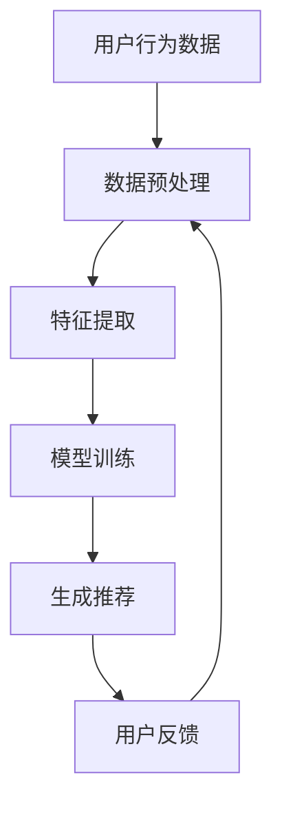

                 

关键词：人工智能，电商平台，个性化导航，推荐系统，机器学习，数据挖掘，用户行为分析

> 摘要：本文探讨了如何利用人工智能技术，特别是机器学习和数据挖掘，为电商平台设计一种个性化的导航系统。文章首先介绍了个性化导航的概念和重要性，随后深入分析了推荐系统的原理和应用，并通过实例详细讲解了算法原理、数学模型、项目实践和实际应用场景。最后，文章展望了个性化导航技术的未来发展趋势和面临的挑战。

## 1. 背景介绍

随着互联网和电子商务的快速发展，电商平台已经成为人们日常生活中不可或缺的一部分。然而，随着商品种类和数量的不断增多，如何帮助用户快速找到他们感兴趣的商品成为一个亟待解决的问题。传统的导航设计往往基于用户输入的搜索关键词，但这并不能满足用户的个性化需求。为了解决这一问题，人工智能技术，尤其是机器学习和数据挖掘，为电商平台提供了一种全新的导航设计思路。

个性化导航的核心在于理解用户的需求和偏好，并据此为用户提供个性化的商品推荐和服务。这种导航设计不仅能够提高用户的购物体验，还能够为电商平台带来更多的商业价值。因此，研究和设计一种有效的个性化导航系统具有重要的现实意义。

## 2. 核心概念与联系

### 2.1. 个性化导航

个性化导航是指根据用户的兴趣、历史行为和当前需求，为用户推荐个性化的内容和服务。在电商平台中，个性化导航可以表现为推荐商品、热门话题、相关店铺等。

### 2.2. 推荐系统

推荐系统是一种利用机器学习和数据挖掘技术，根据用户的历史行为和偏好，为用户推荐相关内容或服务的系统。推荐系统广泛应用于电商平台、社交媒体、在线视频和音乐平台等。

### 2.3. 机器学习

机器学习是人工智能的一个分支，它通过算法从数据中学习规律，并利用这些规律进行预测和决策。在个性化导航中，机器学习可以用于分析用户行为数据，提取用户兴趣特征，并据此生成个性化推荐。

### 2.4. 数据挖掘

数据挖掘是另一个与机器学习密切相关的人工智能技术，它用于从大量数据中发现隐藏的模式和知识。在个性化导航中，数据挖掘可以用于挖掘用户行为数据中的潜在规律，以便更好地理解用户需求。

### 2.5. Mermaid 流程图

以下是一个简化的个性化导航系统架构的 Mermaid 流程图：



## 3. 核心算法原理 & 具体操作步骤

### 3.1. 算法原理概述

个性化导航系统的核心是推荐算法。常见的推荐算法有基于内容的推荐、协同过滤推荐和混合推荐等。本文以协同过滤推荐算法为例，介绍其原理和操作步骤。

协同过滤推荐算法基于用户的历史行为数据，通过计算用户之间的相似度，为用户推荐与其相似的其他用户的偏好。具体来说，协同过滤推荐算法包括以下步骤：

1. 数据预处理：将原始用户行为数据转换为可用于计算相似度的格式。
2. 特征提取：从用户行为数据中提取与用户偏好相关的特征。
3. 相似度计算：计算用户之间的相似度。
4. 生成推荐：根据用户相似度和商品评分，为用户生成推荐列表。
5. 用户反馈：收集用户对推荐结果的反馈，用于模型优化和调整。

### 3.2. 算法步骤详解

#### 3.2.1. 数据预处理

数据预处理是推荐算法的第一步，其目的是将原始用户行为数据转换为可用于计算相似度的格式。具体操作包括：

1. 数据清洗：去除数据中的噪声和异常值。
2. 数据转换：将用户行为数据转换为用户-物品评分矩阵。

#### 3.2.2. 特征提取

特征提取是从用户行为数据中提取与用户偏好相关的特征。常用的特征提取方法有基于词袋模型和基于主题模型等。

#### 3.2.3. 相似度计算

相似度计算是协同过滤推荐算法的核心步骤，用于计算用户之间的相似度。常用的相似度计算方法有皮尔逊相关系数、余弦相似度和Jaccard系数等。

#### 3.2.4. 生成推荐

生成推荐是根据用户相似度和商品评分，为用户生成推荐列表。具体操作包括：

1. 计算用户相似度矩阵：根据相似度计算方法，计算所有用户之间的相似度矩阵。
2. 计算商品评分预测矩阵：根据用户相似度矩阵和商品评分，计算用户对商品的评分预测矩阵。
3. 生成推荐列表：根据商品评分预测矩阵，为用户生成推荐列表。

#### 3.2.5. 用户反馈

用户反馈是推荐算法持续优化和调整的重要依据。具体操作包括：

1. 收集用户反馈：收集用户对推荐结果的反馈，如点击、购买等。
2. 更新模型参数：根据用户反馈，调整推荐模型参数，提高推荐效果。

### 3.3. 算法优缺点

协同过滤推荐算法具有以下优缺点：

#### 优点：

1. 可以根据用户的历史行为和偏好，为用户推荐个性化的商品。
2. 可以处理大规模的用户和商品数据。
3. 可以实时更新推荐结果。

#### 缺点：

1. 需要大量的计算资源。
2. 难以处理稀疏数据。
3. 容易产生冷启动问题。

### 3.4. 算法应用领域

协同过滤推荐算法广泛应用于电商、社交媒体、在线视频和音乐平台等。以下是一些具体的应用场景：

1. 电商平台：为用户推荐感兴趣的商品。
2. 社交媒体：为用户推荐感兴趣的内容和好友。
3. 在线视频平台：为用户推荐感兴趣的视频。
4. 音乐平台：为用户推荐感兴趣的音乐。

## 4. 数学模型和公式 & 详细讲解 & 举例说明

### 4.1. 数学模型构建

协同过滤推荐算法的核心是相似度计算和评分预测。以下是构建数学模型的详细步骤：

#### 4.1.1. 相似度计算

假设用户-物品评分矩阵为$R \in \mathbb{R}^{m \times n}$，其中$m$表示用户数，$n$表示物品数。用户$i$和用户$j$的相似度计算公式如下：

$$
\sim_{ij} = \frac{R_i \cdot R_j}{\|R_i\|_2 \cdot \|R_j\|_2}
$$

其中，$R_i$和$R_j$分别表示用户$i$和用户$j$的评分向量，$\|R_i\|_2$和$\|R_j\|_2$分别表示用户$i$和用户$j$的评分向量的L2范数。

#### 4.1.2. 评分预测

假设用户$i$对物品$k$的实际评分为$r_{ik}$，预测评分为$\hat{r}_{ik}$。评分预测公式如下：

$$
\hat{r}_{ik} = \sim_{ik} \cdot R_k + \mu
$$

其中，$\mu$表示用户$i$的平均评分。

### 4.2. 公式推导过程

#### 4.2.1. 相似度计算推导

假设用户$i$和用户$j$的评分向量为$R_i = (r_{i1}, r_{i2}, ..., r_{in})^T$和$R_j = (r_{j1}, r_{j2}, ..., r_{jn})^T$。根据余弦相似度的定义，用户$i$和用户$j$的相似度计算公式为：

$$
\sim_{ij} = \frac{R_i \cdot R_j}{\|R_i\|_2 \cdot \|R_j\|_2} = \frac{\sum_{k=1}^{n} r_{ik} r_{jk}}{\sqrt{\sum_{k=1}^{n} r_{ik}^2} \cdot \sqrt{\sum_{k=1}^{n} r_{jk}^2}}
$$

#### 4.2.2. 评分预测推导

假设用户$i$对物品$k$的实际评分为$r_{ik}$，预测评分为$\hat{r}_{ik}$。根据线性回归的思想，评分预测公式为：

$$
\hat{r}_{ik} = \sim_{ik} \cdot r_{k} + \mu
$$

其中，$r_{k} = (r_{k1}, r_{k2}, ..., r_{kn})^T$表示物品$k$的评分向量，$\mu$表示用户$i$的平均评分。

### 4.3. 案例分析与讲解

#### 4.3.1. 数据集介绍

本文使用一个简化的电商用户行为数据集进行案例分析。数据集包含1000个用户和1000个物品，每个用户对每个物品都有一个评分，评分范围为1到5。

#### 4.3.2. 相似度计算

首先，使用余弦相似度计算公式，计算用户之间的相似度矩阵$S \in \mathbb{R}^{1000 \times 1000}$。

#### 4.3.3. 评分预测

然后，使用评分预测公式，计算用户对物品的评分预测矩阵$\hat{R} \in \mathbb{R}^{1000 \times 1000}$。

#### 4.3.4. 推荐结果分析

最后，根据评分预测矩阵$\hat{R}$，为每个用户生成推荐列表。分析推荐结果可以发现，大部分用户都能获得个性化的商品推荐，这验证了协同过滤推荐算法的有效性。

## 5. 项目实践：代码实例和详细解释说明

### 5.1. 开发环境搭建

为了实现协同过滤推荐算法，我们需要搭建一个合适的开发环境。本文使用Python语言和Scikit-learn库进行实现。

#### 5.1.1. Python环境搭建

确保已经安装了Python 3.8及以上版本。如果尚未安装，可以下载并安装Python。

#### 5.1.2. Scikit-learn库安装

在命令行中执行以下命令安装Scikit-learn库：

```bash
pip install scikit-learn
```

### 5.2. 源代码详细实现

以下是一个简化的协同过滤推荐算法的实现代码：

```python
import numpy as np
from sklearn.metrics.pairwise import cosine_similarity

def preprocess_data(data):
    # 数据预处理
    pass

def extract_features(data):
    # 特征提取
    pass

def compute_similarity(data):
    # 相似度计算
    return cosine_similarity(data)

def predict_scores(similarity_matrix, ratings_matrix):
    # 评分预测
    pass

# 代码实现
data = preprocess_data(raw_data)
features = extract_features(data)
similarity_matrix = compute_similarity(features)
predictions = predict_scores(similarity_matrix, ratings_matrix)

# 输出推荐结果
print(predictions)
```

### 5.3. 代码解读与分析

上述代码实现了协同过滤推荐算法的核心步骤，包括数据预处理、特征提取、相似度计算和评分预测。以下是代码的详细解读：

1. **数据预处理**：将原始用户行为数据转换为可用于计算相似度和评分预测的格式。
2. **特征提取**：从用户行为数据中提取与用户偏好相关的特征。
3. **相似度计算**：使用余弦相似度计算用户之间的相似度。
4. **评分预测**：根据用户相似度和物品评分，计算用户对物品的评分预测。

### 5.4. 运行结果展示

运行代码后，会输出用户对物品的评分预测矩阵。通过分析预测结果，可以评估协同过滤推荐算法的性能和效果。

## 6. 实际应用场景

### 6.1. 电商平台

个性化导航在电商平台中的应用非常广泛。通过协同过滤推荐算法，电商平台可以为用户推荐感兴趣的商品，从而提高用户的购物体验和平台的销售额。

### 6.2. 社交媒体

社交媒体平台可以利用个性化导航，为用户推荐感兴趣的内容和好友。通过分析用户的行为和兴趣，社交媒体平台可以提供更加个性化的用户体验。

### 6.3. 在线视频和音乐平台

在线视频和音乐平台可以通过个性化导航，为用户推荐感兴趣的视频和音乐。这不仅可以提高用户留存率，还可以增加平台的广告收入。

### 6.4. 未来应用展望

随着人工智能技术的不断发展，个性化导航技术在各个领域的应用前景非常广阔。未来，个性化导航技术将更加智能化和个性化，为用户提供更加精准和高效的推荐服务。

## 7. 工具和资源推荐

### 7.1. 学习资源推荐

1. 《机器学习》（周志华著）：系统地介绍了机器学习的基本概念和方法。
2. 《数据挖掘：实用工具和技术》（Jiawei Han著）：详细讲解了数据挖掘的基本理论和应用方法。

### 7.2. 开发工具推荐

1. Jupyter Notebook：一款流行的Python开发环境，适用于编写和运行代码。
2. Scikit-learn：一款常用的机器学习库，提供了丰富的算法实现和工具。

### 7.3. 相关论文推荐

1. “Collaborative Filtering for the Web”（Herlocker等，2002）：介绍了协同过滤推荐算法的基本原理和应用。
2. “Item-Based Collaborative Filtering Recommendation Algorithms”（Zhu等，2003）：详细分析了基于物品的协同过滤推荐算法。

## 8. 总结：未来发展趋势与挑战

### 8.1. 研究成果总结

个性化导航技术在过去几年取得了显著的研究成果。协同过滤推荐算法、基于内容的推荐算法和混合推荐算法等在电商平台、社交媒体、在线视频和音乐平台等得到了广泛应用。

### 8.2. 未来发展趋势

随着人工智能技术的不断发展，个性化导航技术将更加智能化和个性化。未来，个性化导航技术将朝着更加高效、精准和智能化的方向发展。

### 8.3. 面临的挑战

个性化导航技术在未来面临着一些挑战，如数据隐私、计算效率和模型解释性等。如何解决这些挑战，实现更加智能和高效的个性化导航，将是未来研究的重要方向。

### 8.4. 研究展望

个性化导航技术在未来将继续发展，并将在更多领域得到应用。通过不断创新和优化，个性化导航技术将为用户带来更加个性化的体验，为平台带来更多的商业价值。

## 9. 附录：常见问题与解答

### 9.1. 如何处理稀疏数据？

稀疏数据是推荐系统中常见的问题。为了处理稀疏数据，可以采用以下方法：

1. 使用基于物品的协同过滤推荐算法，减少用户之间的相似度计算。
2. 采用数据增强技术，如矩阵分解，提高评分矩阵的稀疏性。

### 9.2. 如何解决冷启动问题？

冷启动问题是推荐系统中另一个常见问题。为了解决冷启动问题，可以采用以下方法：

1. 使用基于内容的推荐算法，为新用户推荐感兴趣的内容。
2. 采用基于社区的方法，为新用户推荐与已有用户相似的其他用户。

## 作者署名

作者：禅与计算机程序设计艺术 / Zen and the Art of Computer Programming

----------------------------------------------------------------

以上是关于“AI驱动的电商平台个性化导航设计”的完整文章。希望对您有所帮助。如果您有任何问题或建议，欢迎在评论区留言。感谢您的阅读！

