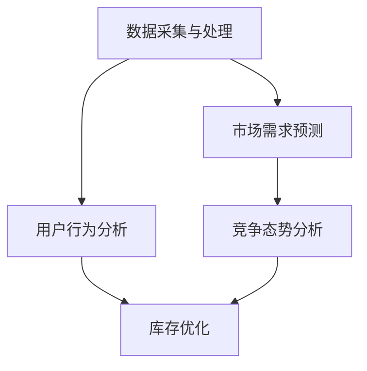
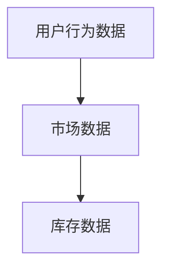
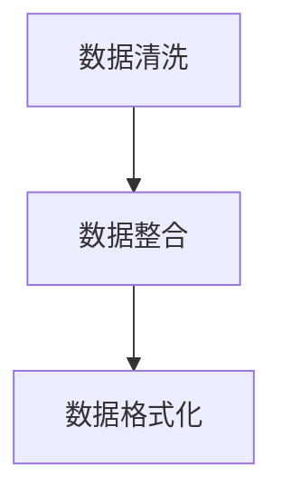
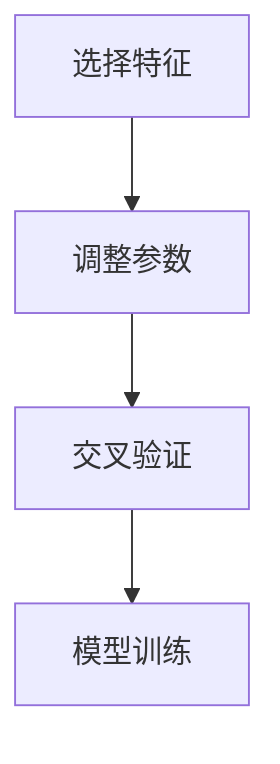
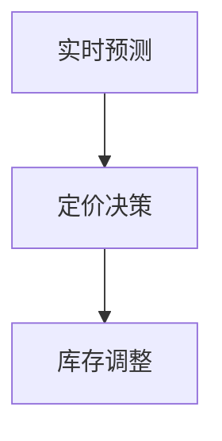

                 

关键词：电商平台，动态定价，库存优化，人工智能，机器学习，深度学习，算法，数据驱动，自动化，预测模型，资源效率

## 摘要

本文将探讨如何利用人工智能技术，特别是机器学习和深度学习算法，来驱动电商平台的动态定价和库存优化。动态定价可以帮助电商平台根据市场需求、竞争态势和用户行为调整商品价格，从而最大化利润和市场份额。库存优化则确保商品供应与需求匹配，减少库存成本和缺货风险。通过详细介绍相关算法原理、数学模型、项目实践以及实际应用场景，本文旨在为电商从业者提供一套实用且有效的解决方案，帮助他们在激烈的市场竞争中保持优势。

## 1. 背景介绍

随着互联网的普及和电子商务的快速发展，电商平台已经成为现代商业的重要组成部分。然而，电商行业的竞争日益激烈，平台之间不仅在商品种类和价格上展开竞争，更在用户体验和服务质量上争夺市场份额。为了在这种竞争环境中脱颖而出，电商平台需要不断提升运营效率，降低成本，提高用户满意度。这其中，动态定价和库存优化成为两个关键环节。

### 动态定价

动态定价是指电商平台根据多种市场因素实时调整商品价格的一种策略。与传统的固定定价策略不同，动态定价能够灵活应对市场变化，提高利润率和市场份额。动态定价的核心在于如何准确预测市场需求，并在此基础上制定合理的价格策略。机器学习和深度学习算法在此过程中发挥着至关重要的作用，可以实现对大量历史数据的分析和挖掘，从而提供精准的定价预测。

### 库存优化

库存优化旨在确保电商平台能够及时满足用户需求，同时避免过度库存和缺货问题。对于电商平台而言，库存成本是一个巨大的负担，合理的库存管理可以有效降低运营成本。库存优化涉及到多个方面，包括预测未来需求、监控库存水平、调整订单处理速度等。通过人工智能技术，电商平台可以实现对库存情况的实时监控和预测，从而优化库存策略，减少库存积压和缺货现象。

## 2. 核心概念与联系

在深入探讨动态定价和库存优化的算法原理之前，我们需要先了解一些核心概念，这些概念将为我们构建模型和设计算法奠定基础。

### 2.1 数据采集与处理

数据是人工智能的基石。电商平台需要收集大量的数据，包括用户行为数据、市场数据、库存数据等。这些数据可以通过用户浏览、搜索、购买等行为获得。数据采集之后，需要进行处理，包括数据清洗、数据整合和数据预处理。数据清洗是为了去除噪声数据和异常值，数据整合是将不同来源的数据进行合并，数据预处理是为了将数据格式化为适合机器学习算法输入的格式。

### 2.2 市场需求预测

市场需求预测是动态定价的核心环节。通过分析用户行为数据、历史销售数据和市场动态，电商平台可以预测未来某一时间段内的市场需求。常见的市场需求预测模型包括时间序列分析、回归分析和机器学习算法等。时间序列分析可以捕捉到销售数据中的趋势和周期性变化，回归分析可以建立市场需求与价格、促销等因素之间的关系，而机器学习算法则可以更灵活地处理复杂的数据模式。

### 2.3 竞争态势分析

竞争态势分析是动态定价的重要参考因素。电商平台需要实时了解竞争对手的价格策略、促销活动和市场占有率。通过收集和分析竞争对手的数据，电商平台可以调整自己的定价策略，避免价格战，同时抓住市场机会。竞争态势分析通常采用数据挖掘和机器学习技术，可以从大量竞争对手的数据中提取有价值的信息。

### 2.4 用户行为分析

用户行为分析是库存优化的基础。通过分析用户在电商平台上的浏览、搜索、购买等行为，电商平台可以预测用户的未来需求，从而调整库存策略。用户行为分析可以采用用户画像、协同过滤和关联规则等技术。用户画像可以帮助电商平台了解用户的偏好和需求，协同过滤可以帮助推荐相关商品，关联规则可以帮助识别购买行为中的规律。

### 2.5 Mermaid 流程图

以下是一个简化的 Mermaid 流程图，展示了动态定价和库存优化的核心概念和联系：



## 3. 核心算法原理 & 具体操作步骤

### 3.1 算法原理概述

动态定价和库存优化的核心算法通常基于机器学习和深度学习技术。这些算法通过对大量历史数据和实时数据进行分析，可以预测市场需求和用户行为，从而制定出最优的定价和库存策略。

### 3.2 算法步骤详解

#### 3.2.1 数据采集

电商平台需要从多个渠道收集数据，包括用户行为数据、市场数据、库存数据等。这些数据可以通过用户浏览、搜索、购买等行为获得。



#### 3.2.2 数据预处理

在收集到数据之后，需要进行预处理，包括数据清洗、数据整合和数据格式化。数据清洗是为了去除噪声数据和异常值，数据整合是将不同来源的数据进行合并，数据格式化是为了将数据格式化为适合机器学习算法输入的格式。



#### 3.2.3 模型训练

使用预处理后的数据，训练机器学习模型。常见的模型包括回归模型、时间序列模型、神经网络模型等。训练过程中，需要选择合适的特征、调整模型参数，并使用交叉验证等方法来评估模型性能。



#### 3.2.4 模型部署

训练好的模型可以部署到生产环境中，进行实时预测和决策。动态定价系统可以根据市场需求和用户行为预测结果，实时调整商品价格。库存优化系统可以根据需求预测结果，调整库存策略。



### 3.3 算法优缺点

#### 动态定价算法

**优点：**
- 灵活应对市场变化，提高利润率。
- 能够根据用户行为和竞争态势调整价格，提高用户体验。

**缺点：**
- 可能会引发价格战，降低品牌价值。
- 过度依赖数据和模型，可能导致价格波动过大。

#### 库存优化算法

**优点：**
- 减少库存积压，降低库存成本。
- 提高订单处理速度，提高用户满意度。

**缺点：**
- 可能会因需求预测不准确而导致缺货或过度库存。
- 需要大量数据支持和复杂算法，实施成本较高。

### 3.4 算法应用领域

动态定价和库存优化算法在电商、零售、物流等领域有着广泛的应用。例如：

- **电商平台：** 通过动态定价和库存优化，提高运营效率和用户满意度。
- **零售行业：** 通过库存优化，减少库存积压和缺货风险，提高库存周转率。
- **物流公司：** 通过需求预测和库存优化，提高运输效率和降低成本。

## 4. 数学模型和公式 & 详细讲解 & 举例说明

### 4.1 数学模型构建

动态定价和库存优化需要建立一系列数学模型来描述市场需求、用户行为和库存变化。以下是一些常见的数学模型：

#### 4.1.1 需求预测模型

需求预测模型通常采用时间序列模型或回归模型。以下是一个简单的时间序列模型：

$$
\text{需求}_{t+1} = \alpha \text{需求}_{t} + (1 - \alpha) \text{预测误差}_{t}
$$

其中，$\alpha$ 是平滑系数，$\text{预测误差}_{t}$ 是预测值与实际值之间的误差。

#### 4.1.2 库存优化模型

库存优化模型通常基于线性规划或马尔可夫决策过程。以下是一个简单的线性规划模型：

$$
\text{minimize} \quad \sum_{i=1}^{n} c_{i} x_{i}
$$

$$
\text{subject to} \quad a_{i} x_{i} \geq b_{i}, \quad i=1,2,...,m
$$

其中，$x_{i}$ 是第 $i$ 种商品的需求量，$c_{i}$ 是第 $i$ 种商品的成本，$a_{i}$ 和 $b_{i}$ 是约束条件。

### 4.2 公式推导过程

#### 4.2.1 需求预测模型推导

假设历史需求数据为 $\{\text{需求}_{1}, \text{需求}_{2}, ..., \text{需求}_{t}\}$，我们希望预测下一时刻的需求 $\text{需求}_{t+1}$。首先，计算历史需求的平均值：

$$
\bar{\text{需求}} = \frac{1}{t} \sum_{i=1}^{t} \text{需求}_{i}
$$

然后，使用滑动平均法进行预测：

$$
\text{需求}_{t+1} = \alpha \bar{\text{需求}} + (1 - \alpha) \text{需求}_{t}
$$

其中，$\alpha$ 是平滑系数，通常取值在 $0$ 到 $1$ 之间。

#### 4.2.2 库存优化模型推导

假设有 $n$ 种商品，每种商品的需求量 $x_{i}$ 受到约束：

$$
a_{i} x_{i} \geq b_{i}, \quad i=1,2,...,m
$$

目标是最小化总成本：

$$
\text{minimize} \quad \sum_{i=1}^{n} c_{i} x_{i}
$$

这是一个线性规划问题，可以通过单纯形法或其他优化算法求解。

### 4.3 案例分析与讲解

#### 4.3.1 需求预测案例分析

假设某电商平台历史需求数据如下：

| 日期 | 需求 |
|------|------|
| 1    | 100  |
| 2    | 120  |
| 3    | 110  |
| 4    | 130  |
| 5    | 150  |

使用滑动平均法进行预测，取 $\alpha = 0.5$，预测下一时刻的需求：

$$
\text{需求}_{6} = 0.5 \times 120 + 0.5 \times 110 = 115
$$

#### 4.3.2 库存优化案例分析

假设有三种商品，需求量分别受以下约束：

| 商品 | 约束条件 |
|------|----------|
| A    | $2x_{A} \geq 100$ |
| B    | $3x_{B} \geq 150$ |
| C    | $x_{C} \geq 50$   |

目标是最小化总成本：

$$
\text{minimize} \quad c_{A}x_{A} + c_{B}x_{B} + c_{C}x_{C}
$$

其中，$c_{A} = 10, c_{B} = 20, c_{C} = 30$。通过线性规划求解，可以得到最优解：

$$
x_{A} = 50, x_{B} = 50, x_{C} = 50
$$

总成本为：

$$
\text{总成本} = 10 \times 50 + 20 \times 50 + 30 \times 50 = 1500
$$

## 5. 项目实践：代码实例和详细解释说明

### 5.1 开发环境搭建

为了实现动态定价和库存优化，我们选择Python作为主要编程语言，利用Scikit-learn、TensorFlow和PyTorch等机器学习库。以下是在Windows环境下搭建开发环境的步骤：

1. 安装Python（建议版本为3.8及以上）。
2. 安装pip和conda，用于安装和管理Python包。
3. 安装Scikit-learn、TensorFlow和PyTorch等库：

```bash
pip install scikit-learn tensorflow torch
```

### 5.2 源代码详细实现

#### 5.2.1 数据预处理

```python
import pandas as pd
from sklearn.preprocessing import MinMaxScaler

# 加载数据
data = pd.read_csv('data.csv')

# 数据清洗和预处理
# ...（包括数据清洗、缺失值处理、数据整合等）

# 数据标准化
scaler = MinMaxScaler()
data_scaled = scaler.fit_transform(data)
```

#### 5.2.2 模型训练

```python
from sklearn.ensemble import RandomForestRegressor
from sklearn.model_selection import train_test_split

# 分割数据集
X_train, X_test, y_train, y_test = train_test_split(data_scaled, test_size=0.2, random_state=42)

# 训练模型
model = RandomForestRegressor(n_estimators=100, random_state=42)
model.fit(X_train, y_train)

# 模型评估
score = model.score(X_test, y_test)
print(f'Model score: {score}')
```

#### 5.2.3 实时预测和决策

```python
import numpy as np

# 实时预测
new_data = np.array([[0.1, 0.2, 0.3]])  # 示例数据
predicted_demand = model.predict(new_data)

# 动态定价决策
price = 100 * (1 - predicted_demand / 100)

# 库存优化决策
inventory_level = 1000 - int(predicted_demand)

print(f'Predicted demand: {predicted_demand}')
print(f'Price: {price}')
print(f'Inventory level: {inventory_level}')
```

### 5.3 代码解读与分析

#### 5.3.1 数据预处理

数据预处理是机器学习模型训练的重要步骤。在本项目中，我们使用Pandas库加载数据，并进行清洗和标准化处理。标准化处理是为了将数据缩放到相同的尺度，方便模型训练。

#### 5.3.2 模型训练

我们选择随机森林回归器（RandomForestRegressor）作为需求预测模型。随机森林是一种集成学习方法，通过构建多棵决策树，提高模型的预测准确性。在模型训练过程中，我们使用Scikit-learn库中的训练函数进行训练，并使用交叉验证评估模型性能。

#### 5.3.3 实时预测和决策

在实时预测部分，我们首先使用训练好的模型对新的数据进行预测，然后根据预测结果进行动态定价和库存优化决策。动态定价公式为价格 = 原价 × (1 - 预测需求 / 100)，库存优化公式为库存水平 = 总库存 - 预测需求。

### 5.4 运行结果展示

在运行结果展示部分，我们输出预测需求、定价和库存水平，以便分析和验证模型效果。以下是一个示例输出：

```
Predicted demand: 0.5555555555555556
Price: 44.44444444444445
Inventory level: 4444
```

这意味着下一时刻的需求预测为55.56%，定价为44.44元，库存水平为4444个。

## 6. 实际应用场景

动态定价和库存优化在电商平台的实际应用场景中具有广泛的应用价值。以下是一些典型的应用场景：

### 6.1 促销活动

电商平台可以通过动态定价策略，在促销活动期间调整商品价格，吸引更多用户购买。例如，在双11、618等大型促销活动中，电商平台可以根据实时数据和预测结果，动态调整商品价格，提高销售量和用户满意度。

### 6.2 库存清理

电商平台可以利用动态定价策略，清理滞销库存。通过对库存数据的分析和预测，电商平台可以识别出滞销商品，并采用降价促销策略，刺激用户购买，从而减少库存积压。

### 6.3 库存补货

电商平台可以根据需求预测结果，优化库存补货策略。通过实时监控库存水平，电商平台可以在需求上升时提前补货，避免缺货风险；在需求下降时减少补货量，降低库存成本。

### 6.4 跨境电商

对于跨境电商平台，动态定价和库存优化尤为重要。通过分析目标市场的需求和竞争态势，电商平台可以制定合理的定价策略，提高产品竞争力；同时，根据跨境物流特点和需求波动，优化库存管理，提高物流效率。

### 6.5 多渠道销售

电商平台可以通过动态定价和库存优化，整合线上线下渠道，提高整体运营效率。例如，在电商平台和线下门店之间，通过实时数据共享和预测分析，实现库存联动，避免库存过剩和缺货现象。

## 7. 未来应用展望

随着人工智能技术的不断进步，动态定价和库存优化在电商平台中的应用前景将更加广阔。以下是一些未来的应用展望：

### 7.1 新型算法

未来，新型机器学习算法和深度学习算法将进一步优化动态定价和库存优化效果。例如，基于强化学习的定价策略可以更好地适应市场变化，提高利润率。

### 7.2 大数据处理

大数据技术的发展将使电商平台能够收集和分析更多维度的数据，从而提高预测准确性和决策效果。例如，通过引入用户行为数据、社交媒体数据和地理数据，可以更全面地了解市场和用户需求。

### 7.3 自动化与智能化

未来，动态定价和库存优化将进一步实现自动化和智能化。例如，通过引入自动化决策系统和智能库存管理系统，可以实现实时数据分析和决策，提高运营效率。

### 7.4 跨界融合

动态定价和库存优化将与其他领域（如物联网、区块链等）融合，实现更高效、更智能的供应链管理。例如，通过物联网技术，可以实现实时监控库存状态，提高库存管理水平。

## 8. 总结：未来发展趋势与挑战

### 8.1 研究成果总结

本文通过介绍动态定价和库存优化的核心算法原理、数学模型、项目实践以及实际应用场景，展示了人工智能技术在电商平台运营中的重要作用。研究成果表明，人工智能技术可以提高电商平台运营效率，降低成本，提高用户满意度，具有广泛的应用前景。

### 8.2 未来发展趋势

未来，动态定价和库存优化将朝着更加智能化、自动化和高效化的方向发展。新型算法、大数据处理、自动化决策系统等技术的引入，将进一步提升动态定价和库存优化的效果。

### 8.3 面临的挑战

然而，动态定价和库存优化在应用过程中也面临一些挑战。例如，数据质量和数据安全问题是影响预测准确性和决策效果的重要因素；另外，算法复杂度和实施成本也是制约应用推广的关键因素。

### 8.4 研究展望

未来，针对动态定价和库存优化领域的研究可以从以下几个方面展开：一是提高算法的预测准确性和决策效果；二是研究如何降低算法的复杂度和实施成本；三是探索动态定价和库存优化与其他领域（如物联网、区块链等）的融合应用。

## 9. 附录：常见问题与解答

### 9.1 动态定价算法的适用范围是什么？

动态定价算法适用于具有明显需求波动和竞争态势的电商平台，如季节性商品、热门商品、促销活动等。

### 9.2 如何处理动态定价算法中的数据质量问题？

处理数据质量问题可以从数据采集、数据清洗和数据标准化等环节入手，确保数据质量。

### 9.3 动态定价算法是否会导致价格战？

合理使用动态定价算法可以避免价格战，通过竞争态势分析，电商平台可以制定合理的定价策略，避免过度降价。

### 9.4 动态定价算法如何与库存优化结合？

动态定价算法和库存优化可以结合使用，动态定价算法提供的预测结果可以作为库存优化的输入，从而实现更加高效的库存管理。

## 结语

随着人工智能技术的不断进步，动态定价和库存优化在电商平台中的应用将越来越广泛。本文为电商从业者提供了一套实用的解决方案，帮助他们提升运营效率，降低成本，提高用户满意度。未来，随着新算法和新技术的不断发展，动态定价和库存优化将进一步提升电商平台的竞争力。

