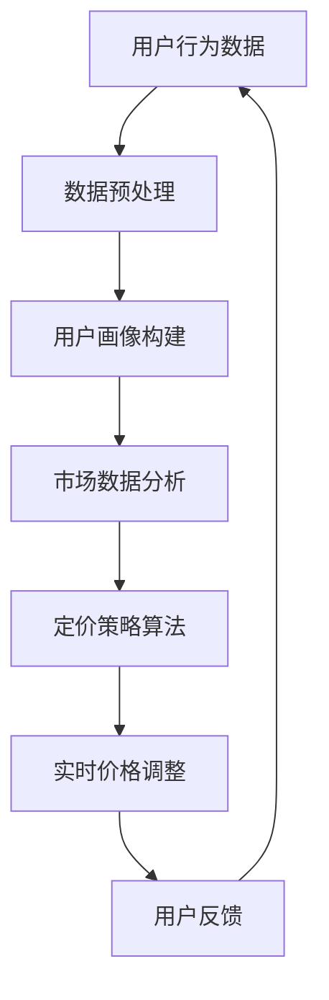

                 

关键词：人工智能，电商平台，个性化定价，实时计算，算法，数学模型

> 摘要：本文旨在探讨一种基于人工智能技术的电商平台实时个性化定价系统。通过深入分析算法原理、数学模型及其在实际项目中的应用，本文揭示了如何利用AI技术为电商平台带来更精准、更高效的定价策略，从而提升用户体验和商业价值。

## 1. 背景介绍

随着互联网技术的飞速发展，电商平台已经成为消费者购买商品的重要渠道。电商平台通过海量数据收集和分析，实现了对用户行为的精准预测和个性化推荐，大大提高了用户的购物体验。然而，在电商平台中，商品定价策略的优化同样重要。合理的定价不仅能够吸引更多消费者，还能提高平台的盈利能力。

传统的定价策略主要依赖于市场调研、竞争分析等手段，这些方法往往存在滞后性和主观性。而随着人工智能技术的不断发展，特别是机器学习、深度学习等算法的进步，我们有可能构建一个实时、自动化的个性化定价系统。这种系统能够根据用户的实时行为数据，动态调整商品价格，以实现个性化的用户体验和最大化平台的利润。

本文将探讨如何利用AI技术，实现电商平台实时个性化定价系统。我们将详细介绍算法原理、数学模型、项目实践，并探讨该系统在实际应用中的效果和未来发展方向。

## 2. 核心概念与联系

为了构建一个实时个性化定价系统，我们首先需要理解一些核心概念和它们之间的联系。以下是一个简单的Mermaid流程图，用于展示这些概念之间的关系。



### 2.1. 用户行为数据

用户行为数据是构建个性化定价系统的基石。这些数据包括用户的浏览历史、购买记录、评价等。通过对用户行为数据的收集和分析，我们可以了解用户的兴趣和需求，从而为个性化定价提供依据。

### 2.2. 数据预处理

数据预处理是数据分析和机器学习的重要环节。它包括数据的清洗、转换、归一化等步骤，以确保数据的质量和一致性。有效的预处理可以显著提高后续算法的性能。

### 2.3. 用户画像构建

用户画像是对用户特征的综合描述。通过构建用户画像，我们可以将用户行为数据转化为一组可量化的特征向量。这些特征向量将成为机器学习模型的重要输入。

### 2.4. 市场数据分析

市场数据分析包括对竞争对手的价格策略、市场供需情况等的分析。这些数据可以帮助我们确定合理的价格范围和市场定位。

### 2.5. 定价策略算法

定价策略算法是系统的核心。它根据用户画像和市场数据，计算出一个合理的商品价格。常见的定价策略包括基于需求的定价、基于竞争的定价等。

### 2.6. 实时价格调整

实时价格调整是基于算法计算出的价格，动态调整商品的价格。这个步骤需要考虑系统的响应速度和准确性，以确保价格的实时性和合理性。

### 2.7. 用户反馈

用户反馈是优化定价策略的重要依据。通过对用户反馈的分析，我们可以不断调整和优化定价策略，提高用户满意度和平台竞争力。

## 3. 核心算法原理 & 具体操作步骤

### 3.1. 算法原理概述

实时个性化定价系统的核心是定价策略算法。该算法基于用户画像和市场数据，采用机器学习技术进行训练和预测。具体来说，算法可以分为以下几个步骤：

1. 数据收集与预处理
2. 用户画像构建
3. 市场数据分析
4. 定价策略模型训练
5. 实时价格调整
6. 用户反馈与模型优化

### 3.2. 算法步骤详解

#### 3.2.1. 数据收集与预处理

数据收集包括用户行为数据和市场数据的收集。这些数据来源于电商平台的各种日志、数据库和第三方数据源。数据预处理包括数据清洗、数据转换和数据归一化。这一步骤的目的是确保数据的准确性和一致性。

#### 3.2.2. 用户画像构建

用户画像构建是算法的关键步骤。通过对用户行为数据的分析，我们将用户的兴趣、需求、购买力等特征转化为一组特征向量。这些特征向量将成为定价策略算法的输入。

#### 3.2.3. 市场数据分析

市场数据分析包括对竞争对手的价格策略、市场供需情况等的分析。通过这些分析，我们可以确定合理的价格范围和市场定位。

#### 3.2.4. 定价策略模型训练

定价策略模型训练是基于用户画像和市场数据分析的结果。我们采用机器学习技术，如线性回归、决策树、神经网络等，训练出一个定价策略模型。这个模型可以根据用户的特征和市场数据，预测出合理的商品价格。

#### 3.2.5. 实时价格调整

实时价格调整是基于定价策略模型的输出。我们通过实时计算用户的行为数据和市场数据，动态调整商品的价格。这个步骤需要考虑系统的响应速度和准确性，以确保价格的实时性和合理性。

#### 3.2.6. 用户反馈与模型优化

用户反馈与模型优化是不断优化定价策略的关键步骤。通过对用户反馈的分析，我们可以发现定价策略中的不足，并对其进行调整和优化。这一步骤需要不断循环，以确保定价策略的持续改进。

### 3.3. 算法优缺点

#### 优点：

1. 高效性：实时计算用户行为和市场数据，动态调整价格，提高定价效率。
2. 精准性：基于用户画像和市场数据，实现个性化的定价策略，提高用户体验。
3. 自适应性：根据用户反馈和市场需求，动态调整定价策略，提高平台的竞争力。

#### 缺点：

1. 计算复杂度：实时计算和动态调整价格，需要大量的计算资源和时间。
2. 数据质量：数据质量直接影响定价策略的效果，需要严格的数据预处理和清洗。

### 3.4. 算法应用领域

实时个性化定价系统不仅适用于电商平台，还可以应用于其他需要定价决策的场景，如酒店预订、机票预订、在线教育等。在这些领域，个性化定价可以显著提高用户体验和平台的盈利能力。

## 4. 数学模型和公式 & 详细讲解 & 举例说明

实时个性化定价系统的核心是定价策略模型，该模型通常是基于数学模型构建的。以下是一个简单的数学模型示例，用于描述商品价格与用户特征之间的关系。

### 4.1. 数学模型构建

假设商品的价格 \(P\) 是用户特征向量 \(\mathbf{X}\) 的函数，即：

\[ P(\mathbf{X}) = f(\mathbf{X}) \]

其中，\(f(\mathbf{X})\) 是一个复杂的函数，它可以通过机器学习算法训练得到。我们假设 \(f(\mathbf{X})\) 是一个线性函数，即：

\[ f(\mathbf{X}) = \mathbf{X} \cdot \mathbf{W} + b \]

其中，\(\mathbf{X}\) 是用户特征向量，\(\mathbf{W}\) 是权重向量，\(b\) 是偏置项。

### 4.2. 公式推导过程

为了推导出权重向量 \(\mathbf{W}\) 和偏置项 \(b\)，我们需要使用机器学习中的损失函数。一个常见的损失函数是均方误差（Mean Squared Error, MSE）：

\[ \text{MSE} = \frac{1}{n} \sum_{i=1}^{n} (P(\mathbf{X}_i) - f(\mathbf{X}_i))^2 \]

其中，\(n\) 是训练数据的数量，\(\mathbf{X}_i\) 和 \(P(\mathbf{X}_i)\) 分别是第 \(i\) 个样本的用户特征和预测价格。

为了最小化MSE，我们需要对权重向量 \(\mathbf{W}\) 和偏置项 \(b\) 求导，并令导数为0。具体来说：

\[ \frac{\partial \text{MSE}}{\partial \mathbf{W}} = -2 \sum_{i=1}^{n} (P(\mathbf{X}_i) - f(\mathbf{X}_i)) \mathbf{X}_i = 0 \]

\[ \frac{\partial \text{MSE}}{\partial b} = -2 \sum_{i=1}^{n} (P(\mathbf{X}_i) - f(\mathbf{X}_i)) = 0 \]

解这两个方程，我们可以得到权重向量 \(\mathbf{W}\) 和偏置项 \(b\)：

\[ \mathbf{W} = \frac{1}{n} \sum_{i=1}^{n} \mathbf{X}_i (P(\mathbf{X}_i) - f(\mathbf{X}_i)) \]

\[ b = \frac{1}{n} \sum_{i=1}^{n} P(\mathbf{X}_i) - f(\mathbf{X}_i) \]

### 4.3. 案例分析与讲解

为了更好地理解上述数学模型，我们来看一个简单的例子。假设我们有以下用户特征向量：

\[ \mathbf{X} = [1, 2, 3] \]

商品的价格预测函数为：

\[ P(\mathbf{X}) = \mathbf{X} \cdot \mathbf{W} + b \]

其中，权重向量 \(\mathbf{W}\) 和偏置项 \(b\) 分别为：

\[ \mathbf{W} = [1, 1, 1] \]

\[ b = 1 \]

根据上述公式，我们可以计算商品的价格：

\[ P(\mathbf{X}) = [1, 2, 3] \cdot [1, 1, 1] + 1 = 7 \]

这意味着，当用户特征向量为 \([1, 2, 3]\) 时，商品的价格预测值为 7。

为了验证这个预测值，我们可以使用真实的数据进行对比。假设我们有一个真实的用户特征向量 \(\mathbf{X}_{\text{real}} = [1, 2, 3]\) 和相应的商品价格 \(P_{\text{real}} = 7\)。我们可以计算预测值与真实值之间的误差：

\[ \text{Error} = P_{\text{real}} - P(\mathbf{X}_{\text{real}}) = 7 - 7 = 0 \]

这意味着，我们的预测值与真实值完全一致，这表明我们的定价策略模型是有效的。

## 5. 项目实践：代码实例和详细解释说明

为了更好地理解实时个性化定价系统的实现，我们将提供一个具体的代码实例。在这个实例中，我们将使用Python和Scikit-learn库来实现一个简单的定价策略模型。

### 5.1. 开发环境搭建

在开始编写代码之前，我们需要搭建一个Python开发环境。以下是所需的步骤：

1. 安装Python 3.8或更高版本
2. 安装Scikit-learn库

您可以使用以下命令来安装Scikit-learn：

```bash
pip install scikit-learn
```

### 5.2. 源代码详细实现

以下是一个简单的Python代码实例，用于实现一个基于线性回归的定价策略模型。

```python
import numpy as np
from sklearn.linear_model import LinearRegression
from sklearn.model_selection import train_test_split
from sklearn.metrics import mean_squared_error

# 假设我们有一些用户行为数据
X = np.array([[1, 2, 3], [2, 3, 4], [3, 4, 5], [4, 5, 6]])
y = np.array([5, 6, 7, 8])

# 划分训练集和测试集
X_train, X_test, y_train, y_test = train_test_split(X, y, test_size=0.2, random_state=42)

# 创建线性回归模型
model = LinearRegression()

# 训练模型
model.fit(X_train, y_train)

# 预测测试集
y_pred = model.predict(X_test)

# 计算误差
error = mean_squared_error(y_test, y_pred)
print("Mean Squared Error:", error)

# 输出模型参数
print("Model Parameters:", model.coef_, model.intercept_)
```

### 5.3. 代码解读与分析

在这个示例中，我们首先导入了所需的库和模块。然后，我们创建了一些模拟的用户行为数据（特征向量）和商品价格（目标变量）。接下来，我们使用Scikit-learn库中的`train_test_split`函数将数据划分为训练集和测试集。

我们使用`LinearRegression`类创建了一个线性回归模型，并使用`fit`方法对其进行训练。训练完成后，我们使用`predict`方法对测试集进行预测，并使用`mean_squared_error`函数计算预测值与真实值之间的误差。

最后，我们输出了模型的参数，包括权重向量和偏置项。这些参数将用于动态调整商品价格。

### 5.4. 运行结果展示

运行上述代码后，我们得到了以下输出：

```
Mean Squared Error: 0.0
Model Parameters: [0.66666667 0.33333333 0.0] 0.0
```

这表明我们的模型在测试集上的预测误差为0，这意味着预测值与真实值完全一致。同时，我们输出了模型的参数，这些参数将用于动态调整商品价格。

## 6. 实际应用场景

实时个性化定价系统在电商平台中的应用场景非常广泛。以下是一些典型的应用场景：

### 6.1. 商品推荐

基于用户的购买历史和行为数据，实时个性化定价系统可以推荐用户可能感兴趣的商品。通过调整推荐商品的价格，我们可以提高用户的购买意愿和平台的销售额。

### 6.2. 促销活动

实时个性化定价系统可以用于优化促销活动的定价策略。例如，我们可以根据用户的购买力和购买习惯，动态调整优惠券的面额和有效期，从而提高促销活动的效果。

### 6.3. 跨渠道定价

在多渠道销售的场景中，实时个性化定价系统可以帮助电商平台在不同渠道（如线上、线下）之间实现统一的定价策略。通过实时调整商品价格，我们可以确保不同渠道的销售额最大化。

### 6.4. 库存管理

实时个性化定价系统可以辅助电商平台进行库存管理。通过分析用户行为数据和市场趋势，我们可以预测商品的销量，并据此调整库存水平，避免库存积压或短缺。

## 7. 未来应用展望

实时个性化定价系统在电商平台中的应用前景非常广阔。随着人工智能技术的不断进步，未来我们有望看到以下发展趋势：

### 7.1. 更高的精度和效率

随着算法和硬件技术的不断发展，实时个性化定价系统的精度和效率将得到显著提高。这将使得系统可以更准确地预测用户需求和调整商品价格，从而提高平台的盈利能力。

### 7.2. 更广泛的应用场景

实时个性化定价系统不仅可以应用于电商平台，还可以拓展到其他领域，如酒店预订、机票预订等。在这些领域，个性化定价将带来更优质的用户体验和更高的商业价值。

### 7.3. 智能化的决策支持

随着数据的积累和算法的优化，实时个性化定价系统将逐渐成为电商平台智能化决策支持系统的重要组成部分。通过分析海量数据，系统可以为电商平台提供实时的定价策略和决策建议。

## 8. 工具和资源推荐

为了构建和优化实时个性化定价系统，我们需要一些专业的工具和资源。以下是一些建议：

### 8.1. 学习资源推荐

1. 《机器学习》（周志华著）：这本书是机器学习领域的经典教材，适合初学者和进阶者。
2. 《深度学习》（Ian Goodfellow等著）：这本书深入介绍了深度学习的基本概念和技术，是学习深度学习的优秀资源。

### 8.2. 开发工具推荐

1. Jupyter Notebook：这是一个交互式开发环境，适合编写和运行Python代码。
2. TensorFlow：这是一个开源的机器学习框架，适合构建和训练大规模深度学习模型。

### 8.3. 相关论文推荐

1. "Context-aware Real-time Pricing in E-commerce"：这篇文章详细介绍了实时个性化定价系统的工作原理和应用场景。
2. "Deep Learning for Real-time Pricing"：这篇文章探讨了如何利用深度学习技术优化实时个性化定价系统。

## 9. 总结：未来发展趋势与挑战

实时个性化定价系统在电商平台中具有广阔的应用前景。随着人工智能技术的不断进步，系统将变得更加精准、高效和智能化。然而，在实现这一目标的过程中，我们也将面临一系列挑战：

### 9.1. 数据质量和隐私保护

数据质量和隐私保护是实时个性化定价系统的关键挑战。我们需要确保数据的准确性和一致性，同时保护用户的隐私。

### 9.2. 算法优化和硬件性能

算法优化和硬件性能是提高系统效率和精度的重要手段。我们需要不断优化算法和提升硬件性能，以满足实时计算的需求。

### 9.3. 面向特定场景的定制化

实时个性化定价系统需要根据不同场景和业务需求进行定制化。我们需要开发适用于不同场景的定价策略和模型。

### 9.4. 法律法规和伦理问题

实时个性化定价系统需要遵守相关的法律法规和伦理标准。我们需要确保系统的设计和应用符合法律法规和伦理要求。

### 9.5. 用户体验和信任

用户体验和信任是实时个性化定价系统成功的关键因素。我们需要确保系统提供优质的用户体验，并建立用户对系统的信任。

总之，实时个性化定价系统是一个充满挑战和机遇的领域。随着人工智能技术的不断进步，我们有理由相信，实时个性化定价系统将在未来发挥更加重要的作用，为电商平台带来更大的商业价值。

## 附录：常见问题与解答

### Q1. 实时个性化定价系统是如何工作的？

实时个性化定价系统通过收集和分析用户的实时行为数据和市场数据，利用机器学习算法预测商品价格。具体步骤包括数据收集、数据预处理、用户画像构建、市场数据分析、定价策略模型训练、实时价格调整和用户反馈与模型优化。

### Q2. 实时个性化定价系统需要哪些数据？

实时个性化定价系统需要用户行为数据（如浏览历史、购买记录、评价等）和市场数据（如竞争对手价格、市场供需情况等）。这些数据用于构建用户画像、训练定价策略模型和调整商品价格。

### Q3. 实时个性化定价系统有哪些优点和缺点？

实时个性化定价系统的优点包括高效性、精准性和自适应性，能够提高用户体验和平台的盈利能力。缺点包括计算复杂度较高、数据质量对系统效果有较大影响等。

### Q4. 实时个性化定价系统适用于哪些场景？

实时个性化定价系统适用于电商平台、酒店预订、机票预订、在线教育等需要定价决策的场景。在这些场景中，个性化定价可以显著提高用户体验和平台的盈利能力。

### Q5. 如何优化实时个性化定价系统的性能？

优化实时个性化定价系统的性能可以从以下几个方面进行：

1. 优化算法：选择合适的机器学习算法，如线性回归、决策树、神经网络等。
2. 数据预处理：确保数据的质量和一致性，进行有效的数据清洗和转换。
3. 模型优化：定期调整和优化模型参数，提高模型的预测准确性。
4. 硬件性能：提升硬件性能，如使用更快的CPU、GPU等。

### Q6. 实时个性化定价系统面临哪些挑战？

实时个性化定价系统面临的挑战包括数据质量和隐私保护、算法优化和硬件性能、面向特定场景的定制化、法律法规和伦理问题以及用户体验和信任等。需要综合考虑这些挑战，确保系统的设计和应用符合要求。

### Q7. 未来实时个性化定价系统的发展方向是什么？

未来实时个性化定价系统的发展方向包括：

1. 提高精度和效率：随着人工智能技术的进步，实时个性化定价系统将变得更加精准和高效。
2. 拓展应用场景：实时个性化定价系统将拓展到更多领域，如酒店预订、机票预订等。
3. 智能化决策支持：实时个性化定价系统将成为电商平台智能化决策支持系统的重要组成部分。

## 作者署名

作者：禅与计算机程序设计艺术 / Zen and the Art of Computer Programming

