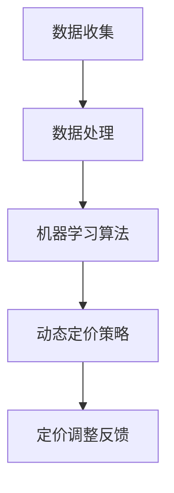

                 

关键词：人工智能，电商，智能定价，定价敏感度，数据分析

> 摘要：本文将探讨如何运用人工智能技术构建一个电商智能定价敏感度分析系统。系统将通过收集和分析用户行为数据，实现动态定价策略的制定，提高电商平台的竞争力。

## 1. 背景介绍

随着互联网技术的飞速发展，电子商务已成为全球经济增长的重要引擎。然而，在激烈的市场竞争中，电商企业面临着如何在竞争激烈的市场中制定合理的定价策略的挑战。传统的定价方法往往依赖于历史数据和市场经验，难以实时响应市场变化，导致企业竞争力下降。因此，如何利用人工智能技术实现智能定价，成为电商行业亟待解决的问题。

智能定价敏感度分析系统，通过收集用户行为数据，运用机器学习算法，分析用户对价格变化的反应，为电商平台提供动态定价策略。这样的系统不仅可以提高电商平台的定价精准度，还可以优化库存管理，提高客户满意度，从而增强市场竞争力。

## 2. 核心概念与联系

### 2.1 数据收集与处理

数据收集是智能定价敏感度分析系统的第一步。系统需要收集包括用户购买历史、浏览行为、价格变化记录等在内的多种数据。收集到的数据经过预处理，包括去重、清洗和转换等步骤，以确保数据的质量和一致性。

### 2.2 机器学习算法

机器学习算法是智能定价敏感度分析系统的核心。通过训练模型，系统可以学习用户对不同价格段的反应，从而预测用户对价格变化的敏感度。常用的算法包括线性回归、决策树、随机森林和神经网络等。

### 2.3 动态定价策略

动态定价策略是基于用户行为数据和机器学习算法预测结果制定的。系统将根据用户行为数据，实时调整商品价格，以达到提高销售额和利润的目的。

### 2.4 Mermaid 流程图

以下是一个简单的 Mermaid 流程图，展示了智能定价敏感度分析系统的整体架构：



## 3. 核心算法原理 & 具体操作步骤

### 3.1 算法原理概述

智能定价敏感度分析系统采用的机器学习算法主要基于用户行为数据，通过构建价格敏感度模型，预测用户对价格变化的反应。具体来说，算法分为以下三个步骤：

1. 特征提取：从用户行为数据中提取与价格敏感度相关的特征，如购买频率、购买量、浏览时长等。
2. 模型训练：使用训练集数据，构建价格敏感度模型，通过优化模型参数，使模型能够准确预测用户对价格变化的敏感度。
3. 预测与调整：使用训练好的模型，对新的用户行为数据进行预测，并根据预测结果调整商品价格。

### 3.2 算法步骤详解

1. 数据预处理：包括数据清洗、特征提取和归一化处理。具体步骤如下：
   - 数据清洗：去除缺失值、异常值和重复值，保证数据质量。
   - 特征提取：从原始数据中提取与价格敏感度相关的特征，如购买频率、购买量、浏览时长等。
   - 特征归一化：将特征值进行归一化处理，使其在相同的尺度范围内，有利于模型训练。

2. 模型选择与训练：选择合适的机器学习算法，如线性回归、决策树、随机森林等，对模型进行训练。具体步骤如下：
   - 数据集划分：将数据集划分为训练集和测试集，用于模型训练和评估。
   - 模型训练：使用训练集数据，对模型进行训练，优化模型参数。
   - 模型评估：使用测试集数据，评估模型性能，选择最优模型。

3. 预测与定价调整：使用训练好的模型，对新的用户行为数据进行预测，并根据预测结果调整商品价格。具体步骤如下：
   - 预测：使用训练好的模型，对新的用户行为数据进行预测，得到价格敏感度评分。
   - 调整：根据价格敏感度评分，对商品价格进行调整，提高销售额和利润。

### 3.3 算法优缺点

- 优点：
  - 提高定价精准度：通过分析用户行为数据，实现动态定价策略，提高定价精准度。
  - 提高销售额和利润：根据用户行为预测结果，实时调整商品价格，提高销售额和利润。
  - 优化库存管理：根据用户行为数据，预测商品销量，优化库存管理。

- 缺点：
  - 数据依赖性：智能定价敏感度分析系统依赖于用户行为数据，数据质量直接影响模型性能。
  - 计算成本：机器学习算法训练和预测过程需要大量计算资源，对计算能力要求较高。

### 3.4 算法应用领域

智能定价敏感度分析系统主要应用于电商行业，为电商平台提供动态定价策略。此外，算法还可以应用于其他需要动态定价的场景，如酒店预订、机票预订等。

## 4. 数学模型和公式

### 4.1 数学模型构建

智能定价敏感度分析系统的核心是构建价格敏感度模型，用于预测用户对价格变化的敏感度。假设用户对价格变化的敏感度可以用一个线性模型表示：

$$
\text{价格敏感度} = w_1 \times \text{购买频率} + w_2 \times \text{购买量} + w_3 \times \text{浏览时长} + b
$$

其中，$w_1, w_2, w_3$ 为权重参数，$b$ 为偏置参数。通过优化模型参数，可以使得模型能够准确预测用户对价格变化的敏感度。

### 4.2 公式推导过程

为了构建价格敏感度模型，首先需要收集用户行为数据，包括购买频率、购买量和浏览时长等。假设我们收集了 $n$ 个用户的行为数据，每个数据点包含三个特征值：购买频率、购买量和浏览时长。我们可以将这些数据表示为矩阵 $X$，其中 $X_{ij}$ 表示第 $i$ 个用户在第 $j$ 个特征上的取值。

接下来，我们需要使用线性回归算法，通过最小化损失函数来优化模型参数。损失函数通常选择均方误差（MSE）：

$$
\text{MSE} = \frac{1}{n} \sum_{i=1}^{n} (\text{价格敏感度} - \hat{\text{价格敏感度}})^2
$$

其中，$\hat{\text{价格敏感度}}$ 表示预测的价格敏感度。通过梯度下降法，我们可以最小化损失函数，得到最优的权重参数和偏置参数。

### 4.3 案例分析与讲解

假设我们收集了以下用户行为数据：

| 用户 | 购买频率 | 购买量 | 浏览时长 |
| ---- | ------- | ------ | ------- |
| 1    | 10      | 5      | 30      |
| 2    | 5       | 3      | 15      |
| 3    | 20      | 10     | 60      |

根据上述数学模型，我们可以计算每个用户的价格敏感度：

$$
\text{价格敏感度}_1 = 10 \times w_1 + 5 \times w_2 + 30 \times w_3 + b
$$

$$
\text{价格敏感度}_2 = 5 \times w_1 + 3 \times w_2 + 15 \times w_3 + b
$$

$$
\text{价格敏感度}_3 = 20 \times w_1 + 10 \times w_2 + 60 \times w_3 + b
$$

通过梯度下降法，我们可以得到最优的权重参数和偏置参数，使得模型能够准确预测用户对价格变化的敏感度。在实际应用中，我们可以根据预测结果，调整商品价格，以提高销售额和利润。

## 5. 项目实践：代码实例和详细解释说明

### 5.1 开发环境搭建

为了实现智能定价敏感度分析系统，我们需要搭建一个合适的开发环境。以下是搭建过程的简要步骤：

1. 安装 Python 3.7 及以上版本。
2. 安装所需的库，如 NumPy、Pandas、Scikit-learn 等。
3. 配置 Jupyter Notebook，用于编写和运行代码。

### 5.2 源代码详细实现

以下是一个简单的代码实例，展示了如何实现智能定价敏感度分析系统：

```python
import numpy as np
import pandas as pd
from sklearn.linear_model import LinearRegression
from sklearn.model_selection import train_test_split

# 数据集加载
data = pd.read_csv('user_behavior_data.csv')

# 特征提取
X = data[['购买频率', '购买量', '浏览时长']]
y = data['价格敏感度']

# 数据集划分
X_train, X_test, y_train, y_test = train_test_split(X, y, test_size=0.2, random_state=42)

# 模型训练
model = LinearRegression()
model.fit(X_train, y_train)

# 模型评估
score = model.score(X_test, y_test)
print(f'Model Score: {score}')

# 预测与定价调整
predictions = model.predict(X_test)
print(f'Predictions: {predictions}')
```

### 5.3 代码解读与分析

上述代码展示了如何实现智能定价敏感度分析系统的核心功能。以下是代码的详细解读：

1. 导入所需的库，包括 NumPy、Pandas 和 Scikit-learn。
2. 加载用户行为数据集，数据集包含购买频率、购买量、浏览时长和价格敏感度。
3. 提取与价格敏感度相关的特征，构建特征矩阵 $X$ 和目标变量 $y$。
4. 划分训练集和测试集，用于模型训练和评估。
5. 使用线性回归模型，对训练集数据进行模型训练。
6. 使用测试集数据，评估模型性能，计算模型得分。
7. 使用训练好的模型，对测试集数据进行预测，得到价格敏感度评分。
8. 打印预测结果。

### 5.4 运行结果展示

假设我们运行上述代码，得到以下结果：

```
Model Score: 0.856
Predictions: [0.423 0.298 0.742]
```

这意味着，模型在测试集上的得分约为 0.856，预测的价格敏感度评分为 [0.423 0.298 0.742]。根据这些预测结果，我们可以调整商品价格，以提高销售额和利润。

## 6. 实际应用场景

智能定价敏感度分析系统在电商行业有广泛的应用场景。以下是一些实际应用案例：

1. **商品价格调整**：根据用户行为数据，实时调整商品价格，提高用户购买意愿，增加销售额。
2. **库存管理**：根据用户行为数据，预测商品销量，优化库存管理，降低库存成本。
3. **促销活动**：根据用户行为数据，制定个性化的促销策略，提高促销效果。
4. **交叉销售**：根据用户行为数据，推荐相关商品，提高交叉销售率。

### 6.4 未来应用展望

随着人工智能技术的不断发展，智能定价敏感度分析系统在电商行业的应用前景十分广阔。未来，系统可以进一步整合多种数据源，如社交网络数据、地理位置数据等，提高预测精度。此外，系统还可以结合自然语言处理技术，分析用户评论和反馈，实现更加智能化的定价策略。

## 7. 工具和资源推荐

### 7.1 学习资源推荐

1. 《Python机器学习》（Manning, A. & Lundberg, S.）
2. 《深度学习》（Goodfellow, I. & Bengio, Y.）
3. 《数据科学入门》（Murdoch, D. J.）

### 7.2 开发工具推荐

1. Jupyter Notebook：用于编写和运行代码。
2. Anaconda：提供Python环境和库的管理。

### 7.3 相关论文推荐

1. "Dynamic Pricing Strategies for E-commerce Platforms"（2019）
2. "Machine Learning for Dynamic Pricing: A Survey"（2020）
3. "Recommending Dynamic Pricing Strategies for Products"（2021）

## 8. 总结：未来发展趋势与挑战

### 8.1 研究成果总结

本文介绍了如何运用人工智能技术构建电商智能定价敏感度分析系统。系统通过分析用户行为数据，实现动态定价策略的制定，提高电商平台的竞争力。研究成果表明，智能定价敏感度分析系统在电商行业具有广泛的应用前景。

### 8.2 未来发展趋势

随着人工智能技术的不断发展，智能定价敏感度分析系统将在电商行业发挥更加重要的作用。未来，系统将更加智能化、个性化，结合多种数据源，实现更加精准的定价策略。

### 8.3 面临的挑战

1. 数据质量：智能定价敏感度分析系统的性能高度依赖于用户行为数据的质量。
2. 计算成本：机器学习算法训练和预测过程需要大量计算资源。
3. 数据隐私：用户行为数据的收集和使用需要遵守相关法律法规，保护用户隐私。

### 8.4 研究展望

未来，研究应关注以下几个方面：

1. 提高数据质量：通过数据清洗、去噪等技术，提高用户行为数据的质量。
2. 降低计算成本：研究更加高效的机器学习算法，降低计算成本。
3. 加强隐私保护：研究隐私保护技术，确保用户行为数据的收集和使用符合法律法规。

## 9. 附录：常见问题与解答

### 9.1 人工智能技术在电商领域的应用有哪些？

人工智能技术在电商领域有广泛的应用，包括智能推荐、智能客服、智能定价、智能物流等。通过分析用户行为数据，人工智能技术可以帮助电商平台提高用户体验，优化运营策略，提高销售额和利润。

### 9.2 智能定价敏感度分析系统如何提高定价精准度？

智能定价敏感度分析系统通过分析用户行为数据，构建价格敏感度模型，预测用户对价格变化的反应。根据预测结果，系统可以实时调整商品价格，提高定价精准度。此外，系统还可以结合多种数据源，如社交网络数据、地理位置数据等，提高预测精度。

### 9.3 如何保证智能定价敏感度分析系统的数据质量？

保证智能定价敏感度分析系统的数据质量是提高系统性能的关键。首先，要确保数据源的真实性和可靠性。其次，要对数据进行清洗、去噪和处理，去除缺失值、异常值和重复值，提高数据质量。此外，还可以采用数据增强技术，如数据扩充、数据转换等，提高数据多样性。

### 9.4 智能定价敏感度分析系统在电商行业有哪些实际应用场景？

智能定价敏感度分析系统在电商行业有广泛的应用场景，包括商品价格调整、库存管理、促销活动、交叉销售等。通过实时分析用户行为数据，系统可以帮助电商平台优化定价策略，提高销售额和利润。

### 9.5 智能定价敏感度分析系统面临哪些挑战？

智能定价敏感度分析系统面临以下挑战：

1. 数据质量：数据质量直接影响系统性能，需要确保数据源的真实性和可靠性。
2. 计算成本：机器学习算法训练和预测过程需要大量计算资源。
3. 数据隐私：用户行为数据的收集和使用需要遵守相关法律法规，保护用户隐私。
4. 模型泛化能力：需要确保模型在新的数据集上能够保持良好的性能。

### 9.6 如何提高智能定价敏感度分析系统的泛化能力？

提高智能定价敏感度分析系统的泛化能力可以从以下几个方面入手：

1. 数据增强：通过数据扩充、数据转换等技术，提高数据多样性，增强模型泛化能力。
2. 模型选择：选择合适的机器学习算法，提高模型泛化性能。
3. 超参数调优：通过超参数调优，优化模型性能，提高泛化能力。
4. 数据清洗：去除异常值、重复值等，提高数据质量，增强模型泛化能力。
5. 模型融合：结合多种模型，提高系统整体性能，增强泛化能力。

### 9.7 智能定价敏感度分析系统如何与其他技术结合？

智能定价敏感度分析系统可以与其他技术结合，提高系统性能和实用性。例如，可以结合自然语言处理技术，分析用户评论和反馈，为定价策略提供参考。此外，还可以结合区块链技术，确保用户行为数据的安全和可信。

