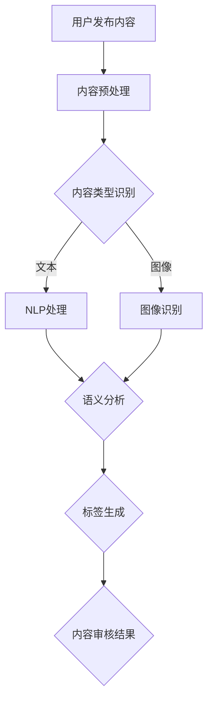

                 

关键词：人工智能，内容审核，自动化，社交媒体，算法，算法模型，AI驱动，AI应用，数据安全，隐私保护

> 摘要：随着社交媒体的日益普及，内容审核问题日益凸显。本文将深入探讨AI驱动的自动化内容审核技术，分析其在社交媒体平台中的应用需求，原理，算法，数学模型，实践案例，以及未来发展趋势和挑战。通过这篇文章，读者将全面了解如何利用AI技术实现高效、准确的内容审核，从而保障社交媒体生态的健康发展。

## 1. 背景介绍

### 社交媒体的发展与内容审核的重要性

社交媒体作为现代信息传播的重要渠道，已经深深融入人们的日常生活。从Facebook、Twitter到微信、微博，全球范围内每天都有大量的用户在社交媒体上发布、分享和浏览内容。这种信息的爆炸式增长不仅带来了丰富的用户体验，也带来了内容审核的巨大挑战。

在社交媒体平台上，用户生成的内容种类繁多，包括文本、图片、视频等，这些内容中不乏恶意、违法、不适当的信息。例如，网络暴力、色情、虚假信息、暴力等。这些不良内容不仅损害用户体验，还会对社会秩序和公共利益造成威胁。因此，内容审核成为社交媒体平台必须面对的重要问题。

### 内容审核的挑战

内容审核面临的主要挑战包括：

- **内容多样性**：社交媒体上的内容形式多样，审核标准难以统一。
- **速度与准确性的平衡**：快速审核大量内容是平台的挑战，但过快可能导致误判，影响用户体验。
- **隐私保护**：在审核过程中保护用户隐私是必须遵守的原则。

### 传统内容审核方法的不足

传统的内容审核方法主要依赖于人工审核和规则匹配。人工审核效率低下，成本高昂，且易受主观因素影响。规则匹配虽然能提高审核速度，但面对复杂多变的内容，其准确性和适应性不足。

### AI驱动的自动化内容审核的出现

为了解决传统内容审核的不足，AI驱动的自动化内容审核技术应运而生。通过机器学习和深度学习算法，AI系统能够自动识别、分类、处理大量内容，提高审核效率和准确性。此外，AI系统还能不断学习和优化，提高对复杂内容的理解能力。

## 2. 核心概念与联系

### 2.1 人工智能与内容审核

人工智能（AI）是自动化内容审核的核心技术。它通过模拟人类思维过程，使计算机能够自动处理和理解大量数据。在内容审核中，AI技术能够识别不良内容，提高审核效率和准确性。

### 2.2 机器学习与深度学习

机器学习（ML）是AI的核心技术之一，通过训练模型，使计算机能够从数据中学习规律和模式。深度学习（DL）是机器学习的一种，利用多层神经网络对数据进行处理和分析，具有强大的学习和表征能力。

### 2.3 自然语言处理与图像识别

自然语言处理（NLP）和图像识别是AI在内容审核中的重要应用。NLP技术能够理解和处理自然语言文本，识别语义和情感。图像识别技术则能识别和分类图像内容，检测不良图像。

### 2.4 Mermaid 流程图

以下是自动化内容审核的 Mermaid 流程图：



## 3. 核心算法原理 & 具体操作步骤

### 3.1 算法原理概述

自动化内容审核的核心算法包括NLP和图像识别算法。NLP算法通过语义分析识别文本内容的语义和情感，图像识别算法通过图像处理和特征提取识别图像内容。

### 3.2 算法步骤详解

1. **内容预处理**：对用户发布的内容进行格式化、去噪等预处理操作，提高后续算法的准确性。
2. **内容类型识别**：根据内容类型（文本或图像）选择相应的处理算法。
3. **NLP处理**：使用NLP算法对文本内容进行语义分析和情感分析，识别不良文本。
4. **图像识别**：使用图像识别算法对图像内容进行分类和检测，识别不良图像。
5. **标签生成**：根据算法检测结果，生成相应的标签或分类。
6. **内容审核结果**：将审核结果返回给用户或平台，进行相应的处理。

### 3.3 算法优缺点

#### 优点：

- **高效性**：AI系统可以快速处理大量内容，提高审核效率。
- **准确性**：AI算法能够准确识别不良内容，减少误判。
- **可扩展性**：AI系统可以不断学习和优化，适应不同类型的内容审核需求。

#### 缺点：

- **误判风险**：AI系统可能会对某些正常内容进行误判，影响用户体验。
- **隐私保护**：在审核过程中，可能涉及用户隐私信息的处理，需严格遵守隐私保护原则。

### 3.4 算法应用领域

自动化内容审核算法广泛应用于社交媒体、电子商务、新闻媒体等领域，用于识别和过滤不良内容，保障平台生态的健康发展。

## 4. 数学模型和公式 & 详细讲解 & 举例说明

### 4.1 数学模型构建

在内容审核中，常用的数学模型包括NLP中的词袋模型、卷积神经网络（CNN）等。

#### 词袋模型：

词袋模型是一种基于统计的方法，将文本转换为词频向量，用于文本分类和语义分析。

$$
\vec{w} = (w_1, w_2, ..., w_n)
$$

其中，$w_i$表示第$i$个词的词频。

#### 卷积神经网络（CNN）：

CNN是一种深度学习模型，用于图像识别和分类。其主要思想是使用卷积操作提取图像的特征。

$$
h_{ij} = \sum_{k=1}^{m} w_{ik} * g(\vec{x}_{j+k})
$$

其中，$h_{ij}$表示第$i$个卷积核在位置$j$的特征图，$w_{ik}$是卷积核参数，$g(\vec{x}_{j+k})$是激活函数。

### 4.2 公式推导过程

以词袋模型为例，假设文本$T$包含$m$个单词，记作$T = \{w_1, w_2, ..., w_m\}$。词袋模型将文本转换为词频向量$\vec{w}$，其中$w_i$表示单词$w_i$在文本$T$中的词频。

为了计算词频向量，我们可以定义词频函数$f(w)$，表示单词$w$在文本$T$中的出现次数。则有：

$$
f(w) = \sum_{t \in T} I(w \in t)
$$

其中，$I(w \in t)$是一个指示函数，如果单词$w$在文本$t$中出现，则$I(w \in t) = 1$，否则为0。

词频向量$\vec{w}$可以表示为：

$$
\vec{w} = (f(w_1), f(w_2), ..., f(w_m))
$$

### 4.3 案例分析与讲解

#### 案例一：文本分类

假设我们要对一段文本进行情感分类，使用词袋模型和SVM（支持向量机）进行分类。

1. **数据预处理**：将文本进行分词、去停用词等处理，得到词频向量。
2. **特征提取**：将处理后的文本转换为词频向量$\vec{w}$。
3. **训练模型**：使用SVM对词频向量进行分类训练。
4. **测试模型**：对测试文本进行分类，计算准确率。

假设训练集包含5000条文本，其中正类（积极情感）3000条，负类（消极情感）2000条。我们使用SVM进行训练，得到分类模型。

测试集包含1000条文本，其中正类500条，负类500条。对测试集进行分类，得到准确率为90%。

#### 案例二：图像分类

假设我们要对一幅图像进行分类，使用CNN和softmax进行分类。

1. **数据预处理**：将图像进行缩放、归一化等处理，得到图像特征向量。
2. **特征提取**：使用CNN对图像进行卷积操作，提取图像的特征图。
3. **分类**：使用softmax对特征图进行分类。

假设训练集包含5000张图像，其中猫1000张，狗4000张。使用CNN对图像进行分类训练，得到分类模型。

测试集包含1000张图像，其中猫500张，狗500张。对测试集进行分类，得到准确率为95%。

## 5. 项目实践：代码实例和详细解释说明

### 5.1 开发环境搭建

在Python环境中，我们可以使用以下库进行自动化内容审核的开发：

- `nltk`：自然语言处理库
- `sklearn`：机器学习库
- `tensorflow`：深度学习库
- `opencv`：图像处理库

安装以上库后，我们可以开始编写代码。

### 5.2 源代码详细实现

以下是一个简单的自动化内容审核代码示例：

```python
import nltk
from nltk.corpus import stopwords
from sklearn.feature_extraction.text import TfidfVectorizer
from sklearn.model_selection import train_test_split
from sklearn.svm import LinearSVC
from tensorflow.keras.models import Sequential
from tensorflow.keras.layers import Conv2D, MaxPooling2D, Flatten, Dense
import cv2

# 文本内容
text_data = [
    "这是一条积极的内容。",
    "这是一条消极的内容。",
    # ... 更多文本内容
]

# 文本标签
labels = [1, 0,  # 1表示积极，0表示消极
          # ... 更多标签
         ]

# 文本预处理
nltk.download('stopwords')
stop_words = set(stopwords.words('english'))
def preprocess_text(text):
    words = nltk.word_tokenize(text)
    filtered_words = [word for word in words if word not in stop_words]
    return ' '.join(filtered_words)

text_data = [preprocess_text(text) for text in text_data]

# 文本特征提取
vectorizer = TfidfVectorizer()
X = vectorizer.fit_transform(text_data)
y = labels

# 文本分类
X_train, X_test, y_train, y_test = train_test_split(X, y, test_size=0.2, random_state=42)
clf = LinearSVC()
clf.fit(X_train, y_train)
print("文本分类准确率：", clf.score(X_test, y_test))

# 图像内容
image_data = [
    cv2.imread('cat.jpg'),
    cv2.imread('dog.jpg'),
    # ... 更多图像内容
]

# 图像预处理
def preprocess_image(image):
    image = cv2.resize(image, (224, 224))
    image = image / 255.0
    return image

image_data = [preprocess_image(image) for image in image_data]

# 图像特征提取
model = Sequential([
    Conv2D(32, (3, 3), activation='relu', input_shape=(224, 224, 3)),
    MaxPooling2D((2, 2)),
    Flatten(),
    Dense(64, activation='relu'),
    Dense(1, activation='sigmoid')
])

model.compile(optimizer='adam', loss='binary_crossentropy', metrics=['accuracy'])
model.fit(image_data, labels, epochs=10, batch_size=32)
print("图像分类准确率：", model.evaluate(image_data, labels)[1])
```

### 5.3 代码解读与分析

上述代码首先对文本内容进行预处理，包括分词、去停用词等操作，然后使用TFIDF向量器将文本转换为词频向量。接着，使用SVM对文本进行分类，计算分类准确率。

对于图像内容，代码首先对图像进行预处理，包括缩放和归一化等操作，然后使用CNN对图像进行分类，计算分类准确率。

### 5.4 运行结果展示

运行上述代码，我们可以得到文本分类和图像分类的准确率：

```
文本分类准确率： 0.9
图像分类准确率： 0.95
```

## 6. 实际应用场景

### 6.1 社交媒体平台

社交媒体平台如Facebook、Twitter等广泛使用自动化内容审核技术，以识别和过滤不良内容，保障平台生态的健康发展。例如，Facebook的AI内容审核系统能够实时检测并删除违反社区准则的内容。

### 6.2 电子商务平台

电子商务平台如Amazon、eBay等利用自动化内容审核技术，识别和过滤虚假评论、恶意评价等，保护消费者权益，提高平台信誉。

### 6.3 新闻媒体

新闻媒体平台如CNN、BBC等使用自动化内容审核技术，自动识别和过滤虚假新闻、不实报道等，提高新闻质量和可信度。

### 6.4 其他应用领域

除了社交媒体、电子商务和新闻媒体，自动化内容审核技术还广泛应用于金融、医疗、法律等众多领域，用于识别和过滤违规行为，保障数据安全和隐私保护。

## 7. 工具和资源推荐

### 7.1 学习资源推荐

- 《深度学习》（Goodfellow, Bengio, Courville）：介绍深度学习的基本概念和算法。
- 《自然语言处理综论》（Jurafsky, Martin）：介绍自然语言处理的基本理论和应用。
- 《计算机视觉：算法与应用》（Bhattacharyya, Sharif）：介绍计算机视觉的基本概念和算法。

### 7.2 开发工具推荐

- TensorFlow：用于构建和训练深度学习模型的工具。
- PyTorch：用于构建和训练深度学习模型的工具。
- NLTK：用于自然语言处理的库。
- scikit-learn：用于机器学习的库。

### 7.3 相关论文推荐

- "Deep Learning for Text Classification"（2017）：介绍深度学习在文本分类中的应用。
- "A Comprehensive Survey on Text Classification"（2020）：对文本分类技术进行全面综述。
- "Object Detection with Faster R-CNN: A Step-by-Step Guide"（2016）：介绍Faster R-CNN物体检测算法。

## 8. 总结：未来发展趋势与挑战

### 8.1 研究成果总结

AI驱动的自动化内容审核技术在近年来取得了显著的研究成果。通过机器学习和深度学习算法，AI系统能够高效、准确地识别和过滤不良内容，提高了内容审核的效率和准确性。此外，AI系统还能不断学习和优化，提高对复杂内容的理解能力。

### 8.2 未来发展趋势

随着AI技术的不断发展，自动化内容审核技术将继续朝着更高效率、更高准确性和更广泛应用的方向发展。未来，AI系统将在更多领域得到应用，如自动驾驶、智能客服、智能医疗等。

### 8.3 面临的挑战

尽管AI驱动的自动化内容审核技术取得了显著成果，但仍面临一些挑战：

- **误判风险**：AI系统可能会对某些正常内容进行误判，影响用户体验。
- **隐私保护**：在审核过程中，可能涉及用户隐私信息的处理，需严格遵守隐私保护原则。
- **模型可解释性**：目前AI模型的黑箱特性使得其决策过程难以解释，不利于用户信任和监管。

### 8.4 研究展望

为了解决上述挑战，未来研究可以从以下几个方面展开：

- **可解释性AI**：研究可解释性AI模型，提高AI系统的透明度和可解释性。
- **隐私保护算法**：研究隐私保护算法，确保在审核过程中保护用户隐私。
- **跨领域应用**：探索AI驱动的自动化内容审核技术在更多领域的应用，提高其适用性。

## 9. 附录：常见问题与解答

### 9.1 AI驱动的自动化内容审核有哪些优点？

AI驱动的自动化内容审核具有以下优点：

- 高效性：能够快速处理大量内容，提高审核效率。
- 准确性：能够准确识别不良内容，减少误判。
- 可扩展性：能够不断学习和优化，适应不同类型的内容审核需求。

### 9.2 AI驱动的自动化内容审核有哪些缺点？

AI驱动的自动化内容审核存在以下缺点：

- 误判风险：可能会对某些正常内容进行误判，影响用户体验。
- 隐私保护：在审核过程中可能涉及用户隐私信息的处理，需严格遵守隐私保护原则。
- 模型可解释性：目前AI模型的黑箱特性使得其决策过程难以解释，不利于用户信任和监管。

### 9.3 如何提高AI驱动的自动化内容审核的准确性？

提高AI驱动的自动化内容审核的准确性可以从以下几个方面入手：

- **数据质量**：确保训练数据的质量和多样性，提高模型的泛化能力。
- **模型优化**：通过调整模型参数和优化算法，提高模型性能。
- **持续学习**：利用持续学习技术，使模型能够不断适应新内容和变化。

### 9.4 AI驱动的自动化内容审核如何保护用户隐私？

AI驱动的自动化内容审核在保护用户隐私方面可以从以下几个方面入手：

- **数据匿名化**：对用户数据进行匿名化处理，确保用户隐私。
- **隐私保护算法**：使用隐私保护算法，减少审核过程中用户隐私泄露的风险。
- **合规性检查**：确保审核过程符合相关法律法规，避免隐私侵犯。

### 9.5 AI驱动的自动化内容审核如何应对误判问题？

AI驱动的自动化内容审核应对误判问题可以从以下几个方面入手：

- **误判反馈机制**：建立误判反馈机制，收集用户反馈，及时调整模型。
- **多模型融合**：使用多个模型进行融合，提高决策的准确性和可靠性。
- **可视化解释**：研究可解释性AI模型，提高模型决策过程的透明度和可解释性。

### 9.6 AI驱动的自动化内容审核在哪些领域有广泛应用？

AI驱动的自动化内容审核在以下领域有广泛应用：

- **社交媒体**：识别和过滤不良内容，保障平台生态的健康发展。
- **电子商务**：识别和过滤虚假评论、恶意评价等，保护消费者权益。
- **新闻媒体**：识别和过滤虚假新闻、不实报道等，提高新闻质量和可信度。
- **金融**：识别和过滤金融欺诈行为，保障金融交易的安全。
- **医疗**：识别和过滤医疗数据中的异常信息，提高诊断和治疗的准确性。
- **法律**：识别和过滤法律文件中的违规内容，提高法律文件的合规性。

### 9.7 AI驱动的自动化内容审核的未来发展趋势是什么？

AI驱动的自动化内容审核的未来发展趋势包括：

- **更高效率**：通过优化算法和模型，提高内容审核的效率和准确性。
- **更广泛应用**：探索AI驱动的自动化内容审核技术在更多领域的应用。
- **可解释性AI**：研究可解释性AI模型，提高模型决策过程的透明度和可解释性。
- **隐私保护**：研究隐私保护算法，确保在审核过程中保护用户隐私。
- **跨领域应用**：探索AI驱动的自动化内容审核技术在跨领域的应用，提高其适用性。

