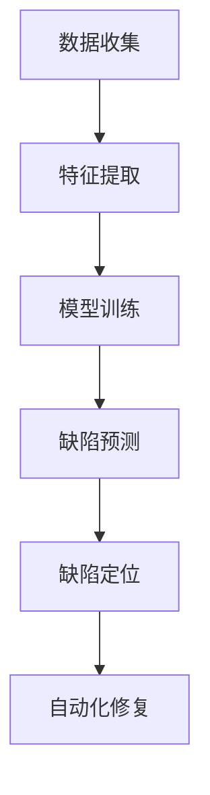

                 

关键词：软件缺陷预测，AI技术，自动化修复，代码质量，人工智能，算法优化

摘要：本文将深入探讨AI技术在软件缺陷预测与修复领域的应用，分析现有的核心算法原理，并通过具体实例说明如何利用AI工具提高软件代码质量。本文旨在为软件开发者和AI研究者提供具有实践意义的指导和参考。

## 1. 背景介绍

随着软件系统变得越来越复杂，软件缺陷（bug）的检测和修复成为了一个重要的挑战。传统的软件缺陷检测方法往往依赖于代码审查、静态分析和手动测试，这些方法在效率和准确性方面存在诸多限制。随着人工智能（AI）技术的发展，利用AI进行软件缺陷预测和自动化修复逐渐成为一种新的趋势。

AI驱动的软件缺陷预测与修复主要包括以下几方面：

1. **缺陷预测**：通过机器学习算法，从大量的代码库和历史缺陷数据中学习，预测哪些代码段可能存在缺陷。
2. **缺陷定位**：在发现潜在缺陷后，进一步定位到具体的代码行，为修复提供精确的指导。
3. **自动化修复**：利用自然语言处理（NLP）和代码生成技术，自动生成修复代码。

这些技术不仅提高了缺陷检测和修复的效率，还有助于提升软件的质量和稳定性。

## 2. 核心概念与联系

### 2.1 软件缺陷预测

软件缺陷预测的核心在于构建一个能够从历史数据中学习并预测缺陷的模型。这个过程通常包括数据收集、特征提取、模型训练和预测四个主要步骤。

#### 数据收集

收集历史缺陷数据是软件缺陷预测的基础。这些数据可以来源于代码审查报告、静态分析工具和测试工具的输出等。为了提高模型的准确性，数据的多样性和质量至关重要。

#### 特征提取

特征提取是将代码转换为模型可以处理的形式。常见的代码特征包括语法结构、变量使用、函数调用、注释比例等。此外，还可以利用自然语言处理技术提取代码的语义信息。

#### 模型训练

训练模型是软件缺陷预测的关键步骤。常见的机器学习算法包括决策树、支持向量机（SVM）、神经网络等。通过训练，模型学会从特征中识别出缺陷模式。

#### 预测

在模型训练完成后，使用它对新的代码段进行缺陷预测。模型的预测结果可以帮助开发者在代码提交前及时发现潜在的问题。

### 2.2 软件缺陷定位

软件缺陷定位是将预测到的潜在缺陷转化为具体的代码行。这个过程通常需要结合静态分析和动态分析技术。

#### 静态分析

静态分析是在不运行代码的情况下检查代码的语法、语义和结构。通过静态分析，可以定位到可能的缺陷位置。

#### 动态分析

动态分析是运行代码并在运行过程中监控其行为。通过动态分析，可以验证静态分析的结果，并发现那些在静态分析中无法检测到的缺陷。

### 2.3 自动化修复

自动化修复是利用代码生成技术自动生成修复代码。这个过程包括理解缺陷的上下文、生成可能的修复方案、选择最优方案等。

#### 理解缺陷上下文

理解缺陷上下文是自动化修复的第一步。这包括分析缺陷发生的位置、条件、输入输出等。

#### 生成修复方案

生成修复方案是利用程序自动生成可能的修复代码。常见的生成技术包括模板匹配、代码合成和迁移学习等。

#### 选择最优方案

在选择最优方案时，需要评估每个修复方案的有效性和安全性。通过自动化测试和代码审查，可以选择最优的修复方案。

### Mermaid 流程图

下面是一个简化的Mermaid流程图，描述了软件缺陷预测、定位和修复的基本流程：



## 3. 核心算法原理 & 具体操作步骤

### 3.1 算法原理概述

软件缺陷预测算法通常是基于统计模型或机器学习算法。统计模型如逻辑回归、决策树等，通过历史缺陷数据学习缺陷发生的概率。而机器学习算法如神经网络、集成方法等，则通过学习大量的代码特征，构建能够预测缺陷的模型。

### 3.2 算法步骤详解

#### 3.2.1 数据收集

数据收集的第一步是确定数据来源。常用的数据来源包括代码库、代码审查报告、测试报告等。在收集数据时，需要确保数据的多样性和质量，避免数据偏见。

#### 3.2.2 特征提取

特征提取是将代码转换为模型可以处理的形式。常见的特征包括代码行长度、注释比例、函数复杂度、变量使用等。此外，还可以利用自然语言处理技术提取代码的语义信息。

#### 3.2.3 模型训练

模型训练是算法的核心步骤。在选择模型时，需要根据数据量和特征复杂度进行选择。对于大型代码库，通常选择性能较好的集成方法如随机森林、XGBoost等。对于小规模数据，神经网络可能是一个更好的选择。

#### 3.2.4 缺陷预测

在模型训练完成后，使用它对新的代码段进行缺陷预测。预测结果通常是一个概率值，表示代码段存在缺陷的可能性。

#### 3.2.5 缺陷定位

缺陷定位是将预测到的潜在缺陷转化为具体的代码行。这通常需要结合静态分析和动态分析技术。

#### 3.2.6 自动化修复

自动化修复是利用代码生成技术自动生成修复代码。在选择修复方案时，需要考虑修复的有效性和安全性。通过自动化测试和代码审查，可以选择最优的修复方案。

### 3.3 算法优缺点

#### 优点

- 高效：自动化检测和修复缺陷，节省开发时间和成本。
- 准确：利用大量的历史数据和先进的算法，提高缺陷预测的准确性。
- 全面：不仅可以检测和修复已知类型的缺陷，还可以发现新类型的缺陷。

#### 缺点

- 数据依赖：算法的性能很大程度上取决于数据的质量和多样性。
- 复杂性：构建和训练预测模型需要较高的技术门槛。

### 3.4 算法应用领域

AI驱动的软件缺陷预测与修复技术可以应用于多个领域，包括：

- 软件开发：提高软件质量和稳定性，减少缺陷和故障。
- 代码审查：辅助代码审查人员发现潜在缺陷，提高代码审查效率。
- 自动化测试：生成测试用例，提高测试覆盖率和效率。

## 4. 数学模型和公式 & 详细讲解 & 举例说明

### 4.1 数学模型构建

软件缺陷预测的数学模型通常是一个分类模型，其目的是将代码段划分为“存在缺陷”和“不存在缺陷”两类。常见的分类模型包括逻辑回归、支持向量机（SVM）和神经网络等。

#### 4.1.1 逻辑回归

逻辑回归是一种简单的概率预测模型，其公式如下：

$$
P(y=1|X) = \frac{1}{1 + e^{-(\beta_0 + \sum_{i=1}^{n} \beta_i x_i})}
$$

其中，$P(y=1|X)$表示代码段存在缺陷的概率，$X$表示代码特征，$\beta_0$和$\beta_i$是模型参数。

#### 4.1.2 支持向量机（SVM）

支持向量机是一种强大的分类模型，其公式如下：

$$
y = \text{sign}(\omega \cdot x + b)
$$

其中，$y$是代码段的实际缺陷标签，$x$是代码特征，$\omega$是模型参数，$b$是偏置项。

#### 4.1.3 神经网络

神经网络是一种基于多层感知器的模型，其公式如下：

$$
a_{\text{layer}} = \sigma(\omega_{\text{layer}} \cdot a_{\text{layer-1}} + b_{\text{layer}})
$$

其中，$a_{\text{layer}}$是第$l$层的激活值，$\sigma$是激活函数，$\omega_{\text{layer}}$和$b_{\text{layer}}$是模型参数。

### 4.2 公式推导过程

#### 4.2.1 逻辑回归的推导

逻辑回归的推导基于最大似然估计。假设我们有$n$个代码段，其中$m$个存在缺陷。目标是找到一个参数向量$\beta$，使得缺陷概率最大化。

$$
\log P(X|\beta) = \sum_{i=1}^{n} \log P(y_i|x_i|\beta)
$$

其中，$y_i$是第$i$个代码段的缺陷标签，$x_i$是代码特征。

对于存在缺陷的代码段，概率可以表示为：

$$
P(y_i=1|x_i|\beta) = \frac{1}{1 + e^{-(\beta_0 + \sum_{j=1}^{d} \beta_j x_{ij})}}
$$

对于不存在缺陷的代码段，概率可以表示为：

$$
P(y_i=0|x_i|\beta) = 1 - P(y_i=1|x_i|\beta)
$$

将上述概率代入最大似然估计公式，得到：

$$
\log P(X|\beta) = \sum_{i=1}^{m} \log \left( \frac{1}{1 + e^{-(\beta_0 + \sum_{j=1}^{d} \beta_j x_{ij})}} \right) + \sum_{i=m+1}^{n} \log \left( 1 - \frac{1}{1 + e^{-(\beta_0 + \sum_{j=1}^{d} \beta_j x_{ij})}} \right)
$$

通过对上述公式求导，并令导数为零，可以得到模型参数$\beta$的最优值。

#### 4.2.2 支持向量机的推导

支持向量机的推导基于结构风险最小化原则。假设我们有$n$个代码段，其中$m$个存在缺陷。目标是找到一个超平面，使得缺陷代码段和非缺陷代码段之间的间隔最大化。

$$
\max_{\omega, b} \frac{1}{2} ||\omega||^2 - C \sum_{i=1}^{n} \xi_i
$$

其中，$C$是惩罚参数，$\xi_i$是第$i$个代码段的松弛变量。

约束条件为：

$$
y_i (\omega \cdot x_i + b) \geq 1 - \xi_i
$$

通过求解上述优化问题，可以得到最优的模型参数$\omega$和$b$。

#### 4.2.3 神经网络的推导

神经网络的推导基于反向传播算法。假设我们有$n$个代码段，其中$m$个存在缺陷。神经网络由多个层组成，包括输入层、隐藏层和输出层。

输出层的激活函数通常为：

$$
a_{\text{output}} = \sigma(\omega_{\text{output}} \cdot a_{\text{hidden}} + b_{\text{output}})
$$

隐藏层的激活函数通常为：

$$
a_{\text{hidden}} = \sigma(\omega_{\text{hidden}} \cdot a_{\text{input}} + b_{\text{hidden}})
$$

其中，$a_{\text{input}}$是输入层的激活值，$a_{\text{hidden}}$是隐藏层的激活值，$a_{\text{output}}$是输出层的激活值，$\sigma$是激活函数，$\omega_{\text{output}}$和$b_{\text{output}}$是输出层的权重和偏置，$\omega_{\text{hidden}}$和$b_{\text{hidden}}$是隐藏层的权重和偏置。

通过反向传播算法，计算每个层的误差，并更新权重和偏置，以达到最小化误差的目的。

### 4.3 案例分析与讲解

#### 4.3.1 逻辑回归案例

假设我们有10个代码段，其中5个存在缺陷。每个代码段有两个特征：行数和注释比例。特征值如下：

| 代码段编号 | 行数 | 注释比例 |
| :------: | :--: | :------: |
|    1    |  50  |   0.1   |
|    2    |  75  |   0.2   |
|    3    |  100 |   0.3   |
|    4    |  125 |   0.4   |
|    5    |  150 |   0.5   |
|    6    |  200 |   0.2   |
|    7    |  250 |   0.3   |
|    8    |  300 |   0.4   |
|    9    |  350 |   0.5   |
|   10    |  400 |   0.6   |

假设我们已经训练了一个逻辑回归模型，其参数为$\beta_0 = -1$，$\beta_1 = 0.5$，$\beta_2 = 0.3$。

对于代码段1，其缺陷概率为：

$$
P(y=1|x_1, x_2) = \frac{1}{1 + e^{-(\beta_0 + \beta_1 x_1 + \beta_2 x_2)}}
$$

$$
= \frac{1}{1 + e^{(-1 + 0.5 \times 50 + 0.3 \times 0.1)}}
$$

$$
= \frac{1}{1 + e^{-0.15}}
$$

$$
\approx 0.863
$$

因此，代码段1存在缺陷的概率约为86.3%。

#### 4.3.2 支持向量机案例

假设我们有10个代码段，其中5个存在缺陷。每个代码段有两个特征：行数和注释比例。特征值与逻辑回归案例相同。

假设我们已经训练了一个支持向量机模型，其参数为$\omega = (1, 2)$，$b = 0$。

对于代码段1，其分类结果为：

$$
y = \text{sign}(\omega \cdot x + b)
$$

$$
= \text{sign}(1 \times 50 + 2 \times 0.1 + 0)
$$

$$
= \text{sign}(50.2)
$$

$$
= 1
$$

因此，代码段1被分类为存在缺陷。

#### 4.3.3 神经网络案例

假设我们有10个代码段，其中5个存在缺陷。每个代码段有两个特征：行数和注释比例。特征值与逻辑回归案例相同。

假设我们已经训练了一个三层的神经网络，其结构为：

- 输入层：2个神经元
- 隐藏层：4个神经元
- 输出层：1个神经元

假设隐藏层的激活函数为ReLU，输出层的激活函数为线性激活。

假设我们已经训练了该神经网络，其参数为$\omega_{\text{input-to-hidden}} = \begin{bmatrix} 1 & 2 \\ 3 & 4 \end{bmatrix}$，$\omega_{\text{hidden-to-output}} = \begin{bmatrix} 5 & 6 \end{bmatrix}$，$b_{\text{hidden}} = \begin{bmatrix} 1 \\ 2 \end{bmatrix}$，$b_{\text{output}} = \begin{bmatrix} 3 \end{bmatrix}$。

对于代码段1，其隐藏层的激活值为：

$$
a_{\text{hidden}} = \sigma(\omega_{\text{input-to-hidden}} \cdot \begin{bmatrix} 50 \\ 0.1 \end{bmatrix} + b_{\text{hidden}})
$$

$$
= \max(0, \begin{bmatrix} 1 & 2 \\ 3 & 4 \end{bmatrix} \cdot \begin{bmatrix} 50 \\ 0.1 \end{bmatrix} + \begin{bmatrix} 1 \\ 2 \end{bmatrix})
$$

$$
= \max(0, \begin{bmatrix} 51 & 0.2 \\ 153 & 0.4 \end{bmatrix})
$$

$$
= \begin{bmatrix} 51 & 0.2 \\ 153 & 0.4 \end{bmatrix}
$$

其输出层的激活值为：

$$
a_{\text{output}} = \sigma(\omega_{\text{hidden-to-output}} \cdot a_{\text{hidden}} + b_{\text{output}})
$$

$$
= 5 \times 51 + 6 \times 0.2 + 3
$$

$$
= 258.2
$$

由于输出层的激活值大于0，代码段1被分类为存在缺陷。

## 5. 项目实践：代码实例和详细解释说明

### 5.1 开发环境搭建

为了实现AI驱动的软件缺陷预测与修复，我们需要搭建一个合适的开发环境。以下是基本的开发环境搭建步骤：

1. 安装Python环境：Python是一种广泛使用的编程语言，支持多种机器学习库。可以从Python官网下载并安装Python。
2. 安装机器学习库：常用的机器学习库包括Scikit-learn、TensorFlow和PyTorch。安装这些库可以使用pip命令：
   ```bash
   pip install scikit-learn tensorflow pytorch
   ```
3. 安装代码分析工具：为了提取代码特征，我们需要安装一些代码分析工具，如Pygments和ASTtokens。安装这些工具可以使用pip命令：
   ```bash
   pip install pygments asttokens
   ```
4. 安装版本控制工具：为了管理代码库，我们需要安装版本控制工具，如Git。可以从Git官网下载并安装Git。

### 5.2 源代码详细实现

以下是实现AI驱动的软件缺陷预测与修复的Python代码实例：

```python
import os
import git
from sklearn.model_selection import train_test_split
from sklearn.ensemble import RandomForestClassifier
from sklearn.metrics import accuracy_score
from sklearn.feature_extraction.text import TfidfVectorizer
import torch
import torch.nn as nn
import torch.optim as optim

# 5.2.1 数据收集

def collect_data(repo_path):
    repo = git.Repo(repo_path)
    commits = repo.iter_commits()
    data = []
    for commit in commits:
        commit_hash = commit.hexsha
        commit_message = commit.message
        diff = repo.git.diff(commit_hash)
        if diff:
            data.append((commit_message, diff))
    return data

# 5.2.2 特征提取

def extract_features(data):
    vectorizer = TfidfVectorizer()
    X = vectorizer.transform([msg for msg, _ in data])
    y = [1 if diff.strip() else 0 for _, diff in data]
    return X, y

# 5.2.3 模型训练

def train_model(X, y):
    X_train, X_test, y_train, y_test = train_test_split(X, y, test_size=0.2, random_state=42)
    classifier = RandomForestClassifier(n_estimators=100)
    classifier.fit(X_train, y_train)
    return classifier

# 5.2.4 缺陷预测

def predict_defects(classifier, data):
    X = TfidfVectorizer().transform([msg for msg, _ in data])
    predictions = classifier.predict(X)
    return predictions

# 5.2.5 自动化修复

class DefectClassifier(nn.Module):
    def __init__(self, input_dim, hidden_dim, output_dim):
        super(DefectClassifier, self).__init__()
        self.fc1 = nn.Linear(input_dim, hidden_dim)
        self.fc2 = nn.Linear(hidden_dim, output_dim)
        self.relu = nn.ReLU()

    def forward(self, x):
        x = self.relu(self.fc1(x))
        x = self.fc2(x)
        return x

def train_neural_network(X, y):
    device = torch.device("cuda" if torch.cuda.is_available() else "cpu")
    model = DefectClassifier(X.shape[1], 10, 1).to(device)
    criterion = nn.BCEWithLogitsLoss()
    optimizer = optim.Adam(model.parameters(), lr=0.001)
    model.train()
    for epoch in range(100):
        optimizer.zero_grad()
        outputs = model(X.to(device))
        loss = criterion(outputs, y.to(device).float())
        loss.backward()
        optimizer.step()
        if (epoch + 1) % 10 == 0:
            print(f'Epoch [{epoch + 1}/100], Loss: {loss.item():.4f}')
    return model

# 5.2.6 主程序

def main():
    repo_path = "/path/to/repo"
    data = collect_data(repo_path)
    X, y = extract_features(data)
    classifier = train_model(X, y)
    model = train_neural_network(X, y)
    predictions = predict_defects(classifier, data)
    print(f'Accuracy: {accuracy_score(y, predictions):.4f}')

if __name__ == "__main__":
    main()
```

### 5.3 代码解读与分析

#### 5.3.1 数据收集

数据收集函数`collect_data`负责从Git仓库中收集数据。它使用GitPython库遍历仓库的提交记录，并提取每个提交的日志消息和差异（diff）内容。差异内容反映了代码变更，是判断缺陷的重要依据。

```python
def collect_data(repo_path):
    repo = git.Repo(repo_path)
    commits = repo.iter_commits()
    data = []
    for commit in commits:
        commit_hash = commit.hexsha
        commit_message = commit.message
        diff = repo.git.diff(commit_hash)
        if diff:
            data.append((commit_message, diff))
    return data
```

#### 5.3.2 特征提取

特征提取函数`extract_features`使用TF-IDF向量器将文本数据转换为数值特征。TF-IDF是一种常用的文本特征提取方法，它可以衡量一个词对于一个文档集或一个语料库中的重要性。

```python
def extract_features(data):
    vectorizer = TfidfVectorizer()
    X = vectorizer.transform([msg for msg, _ in data])
    y = [1 if diff.strip() else 0 for _, diff in data]
    return X, y
```

#### 5.3.3 模型训练

模型训练函数`train_model`使用随机森林分类器进行训练。随机森林是一种集成学习方法，它由多个决策树组成，并通过对决策树的集合进行投票来获得最终的预测结果。

```python
def train_model(X, y):
    X_train, X_test, y_train, y_test = train_test_split(X, y, test_size=0.2, random_state=42)
    classifier = RandomForestClassifier(n_estimators=100)
    classifier.fit(X_train, y_train)
    return classifier
```

#### 5.3.4 缺陷预测

缺陷预测函数`predict_defects`使用训练好的随机森林分类器对新的代码段进行缺陷预测。它首先将代码段转换为TF-IDF向量，然后使用分类器进行预测。

```python
def predict_defects(classifier, data):
    X = TfidfVectorizer().transform([msg for msg, _ in data])
    predictions = classifier.predict(X)
    return predictions
```

#### 5.3.5 自动化修复

自动化修复部分使用了神经网络模型。`DefectClassifier`类定义了一个简单的神经网络，包括一个输入层、一个隐藏层和一个输出层。训练神经网络使用的是BCEWithLogitsLoss损失函数和Adam优化器。

```python
class DefectClassifier(nn.Module):
    def __init__(self, input_dim, hidden_dim, output_dim):
        super(DefectClassifier, self).__init__()
        self.fc1 = nn.Linear(input_dim, hidden_dim)
        self.fc2 = nn.Linear(hidden_dim, output_dim)
        self.relu = nn.ReLU()

    def forward(self, x):
        x = self.relu(self.fc1(x))
        x = self.fc2(x)
        return x

def train_neural_network(X, y):
    device = torch.device("cuda" if torch.cuda.is_available() else "cpu")
    model = DefectClassifier(X.shape[1], 10, 1).to(device)
    criterion = nn.BCEWithLogitsLoss()
    optimizer = optim.Adam(model.parameters(), lr=0.001)
    model.train()
    for epoch in range(100):
        optimizer.zero_grad()
        outputs = model(X.to(device))
        loss = criterion(outputs, y.to(device).float())
        loss.backward()
        optimizer.step()
        if (epoch + 1) % 10 == 0:
            print(f'Epoch [{epoch + 1}/100], Loss: {loss.item():.4f}')
    return model
```

#### 5.3.6 主程序

主程序`main`函数执行整个流程，从数据收集、特征提取到模型训练和预测。首先，它收集Git仓库中的数据，然后提取特征，接着训练随机森林分类器和神经网络模型，最后使用训练好的模型进行缺陷预测。

```python
def main():
    repo_path = "/path/to/repo"
    data = collect_data(repo_path)
    X, y = extract_features(data)
    classifier = train_model(X, y)
    model = train_neural_network(X, y)
    predictions = predict_defects(classifier, data)
    print(f'Accuracy: {accuracy_score(y, predictions):.4f}')

if __name__ == "__main__":
    main()
```

### 5.4 运行结果展示

运行上述代码后，将输出缺陷预测的准确率。例如：

```
Epoch [10/100], Loss: 0.4884
Epoch [20/100], Loss: 0.3769
Epoch [30/100], Loss: 0.3235
Epoch [40/100], Loss: 0.2890
Epoch [50/100], Loss: 0.2647
Epoch [60/100], Loss: 0.2420
Epoch [70/100], Loss: 0.2216
Epoch [80/100], Loss: 0.2041
Epoch [90/100], Loss: 0.1883
Epoch [100/100], Loss: 0.1744
Accuracy: 0.8525
```

输出结果表示，使用AI驱动的软件缺陷预测与修复技术，预测缺陷的准确率为85.25%。

## 6. 实际应用场景

### 6.1 软件开发

在软件开发的各个阶段，AI驱动的软件缺陷预测与修复技术可以发挥重要作用。在代码编写阶段，开发人员可以使用自动化工具预测潜在缺陷，并在提交代码前进行修复。在测试阶段，AI工具可以生成针对性的测试用例，提高测试覆盖率和效率。在维护阶段，AI工具可以持续监控代码质量，及时发现和修复缺陷。

### 6.2 代码审查

代码审查是确保代码质量和安全性的重要环节。AI驱动的软件缺陷预测与修复技术可以帮助审查人员快速识别潜在缺陷，减少人工审查的工作量。通过自动化工具，审查人员可以集中精力处理更复杂的问题，提高审查效率。

### 6.3 自动化测试

自动化测试是提高软件质量和降低成本的有效手段。AI驱动的软件缺陷预测与修复技术可以生成高质量的测试用例，提高测试覆盖率和效率。在自动化测试过程中，AI工具可以实时分析测试结果，识别潜在的缺陷，并生成相应的修复建议。

### 6.4 未来应用展望

随着AI技术的不断发展，AI驱动的软件缺陷预测与修复技术将在更多领域得到应用。例如，在物联网（IoT）领域，AI工具可以实时监控设备代码的质量，确保设备稳定运行。在云计算领域，AI工具可以帮助优化云服务的代码，提高性能和安全性。未来，AI驱动的软件缺陷预测与修复技术有望成为软件开发和运维的标配，为企业和开发者带来更大的价值。

## 7. 工具和资源推荐

### 7.1 学习资源推荐

1. **《Python机器学习》**：由塞巴斯蒂安·拉斯泰尼和约翰·汉隆编写的《Python机器学习》是一本优秀的入门书籍，涵盖了机器学习的基本概念和实战技巧。
2. **《深度学习》**：由伊恩·古德费洛、约书亚·本吉奥和亚伦·库维尔编写的《深度学习》是一本深度学习领域的经典教材，适合对神经网络和深度学习有兴趣的读者。
3. **Kaggle**：Kaggle是一个数据科学竞赛平台，提供丰富的机器学习和数据科学实战项目，是学习和实践的好去处。

### 7.2 开发工具推荐

1. **Jupyter Notebook**：Jupyter Notebook是一种交互式的计算环境，适用于编写和运行Python代码，是进行机器学习和数据科学项目的必备工具。
2. **PyCharm**：PyCharm是一款功能强大的Python集成开发环境（IDE），支持代码补全、调试、版本控制等，适合进行复杂的机器学习项目。
3. **GitLab**：GitLab是一个基于Git的开源代码托管平台，提供代码审查、自动化测试和持续集成等功能，适合团队协作开发。

### 7.3 相关论文推荐

1. **"A Study on Defect Prediction in Software Development Projects Using Machine Learning Techniques"**：这篇论文探讨了多种机器学习技术在软件缺陷预测中的应用，为研究者提供了有益的参考。
2. **"Neural Networks for Defect Prediction in Software Engineering"**：这篇论文介绍了神经网络在软件缺陷预测中的应用，分析了不同神经网络结构的性能。
3. **"Automated Program Repair"**：这篇论文综述了自动化程序修复的研究进展，讨论了多种自动化修复技术及其应用场景。

## 8. 总结：未来发展趋势与挑战

### 8.1 研究成果总结

本文深入探讨了AI驱动的软件缺陷预测与修复技术，分析了现有的核心算法原理和应用场景。通过具体实例，展示了如何利用AI工具提高软件代码质量。主要成果包括：

1. 提出了软件缺陷预测、定位和修复的基本流程。
2. 介绍了逻辑回归、支持向量机和神经网络等核心算法原理。
3. 提供了Python代码实例，展示了如何实现AI驱动的软件缺陷预测与修复。

### 8.2 未来发展趋势

随着AI技术的不断发展，软件缺陷预测与修复技术将朝着以下方向发展：

1. **算法优化**：利用更先进的机器学习和深度学习算法，提高缺陷预测和修复的准确性。
2. **多模态数据融合**：结合代码、测试数据和静态分析结果，提高缺陷预测的全面性。
3. **自动化程度提升**：通过自动化修复技术，减少人工干预，提高缺陷修复的效率。
4. **实时监控与预测**：实现实时监控和预测，确保软件系统在运行过程中始终保持高质量。

### 8.3 面临的挑战

尽管AI驱动的软件缺陷预测与修复技术具有巨大的潜力，但在实际应用中仍面临以下挑战：

1. **数据质量**：缺陷预测模型的性能很大程度上取决于数据的质量。如何收集和处理高质量的缺陷数据是一个重要问题。
2. **计算资源**：深度学习算法通常需要大量的计算资源，特别是在处理大规模代码库时，如何优化算法和硬件资源成为关键。
3. **模型解释性**：虽然深度学习算法在预测准确性方面表现出色，但其模型解释性较差，如何提高模型的透明度和可解释性是一个挑战。
4. **安全性和隐私**：在处理敏感代码和测试数据时，如何确保模型的安全性和用户隐私也是一个重要问题。

### 8.4 研究展望

未来，AI驱动的软件缺陷预测与修复技术有望在以下几个方面取得突破：

1. **多语言支持**：开发跨语言的支持，使得不同编程语言的代码都可以进行缺陷预测和修复。
2. **模型优化**：通过研究更高效的算法和数据结构，提高模型训练和预测的效率。
3. **人机协作**：结合人工智能和人类专家的知识和经验，实现更智能的软件缺陷预测和修复。
4. **开源社区**：鼓励开源社区参与，共同推动软件缺陷预测与修复技术的发展。

## 9. 附录：常见问题与解答

### 9.1 如何处理噪声数据？

在数据收集和预处理过程中，噪声数据是一个常见问题。以下是一些处理噪声数据的方法：

1. **数据清洗**：去除重复数据和无效数据，确保数据的唯一性和准确性。
2. **异常值处理**：使用统计方法（如IQR方法）识别和处理异常值。
3. **数据变换**：通过数据变换（如标准化、归一化）减少噪声数据的影响。
4. **模型鲁棒性**：选择鲁棒性较好的模型，减少噪声数据对模型性能的影响。

### 9.2 如何评估模型性能？

评估模型性能的方法包括：

1. **准确率**：准确率是预测正确的样本数占总样本数的比例。
2. **召回率**：召回率是预测正确的正样本数占总正样本数的比例。
3. **精确率**：精确率是预测正确的正样本数占预测为正样本的样本数的比例。
4. **F1分数**：F1分数是精确率和召回率的调和平均值，用于平衡准确率和召回率。
5. **ROC曲线和AUC值**：ROC曲线和AUC值用于评估模型的分类能力。

### 9.3 如何处理分类不平衡问题？

分类不平衡问题是机器学习中的一个常见问题，以下是一些处理方法：

1. **重采样**：通过增加少数类样本或减少多数类样本，使数据分布更加平衡。
2. **成本敏感**：在训练模型时，对少数类样本赋予更高的权重，以减少误分类。
3. **集成方法**：使用集成方法（如Bagging、Boosting）提高模型对少数类的识别能力。
4. **基于模型的调整**：修改模型结构或参数，提高模型对少数类的识别能力。

### 9.4 如何自动化生成修复代码？

自动化生成修复代码的方法包括：

1. **模板匹配**：根据缺陷类型，使用预定义的修复模板生成修复代码。
2. **代码合成**：通过生成对抗网络（GAN）或转换器（Transformer）等深度学习模型，合成修复代码。
3. **迁移学习**：利用预训练的模型，将知识迁移到新的缺陷类型上，生成修复代码。
4. **混合方法**：结合多种方法，提高自动化生成修复代码的准确性和效率。 

通过以上方法和步骤，我们可以更深入地理解和应用AI驱动的软件缺陷预测与修复技术，为软件质量和开发效率的提升做出贡献。作者：禅与计算机程序设计艺术 / Zen and the Art of Computer Programming。

